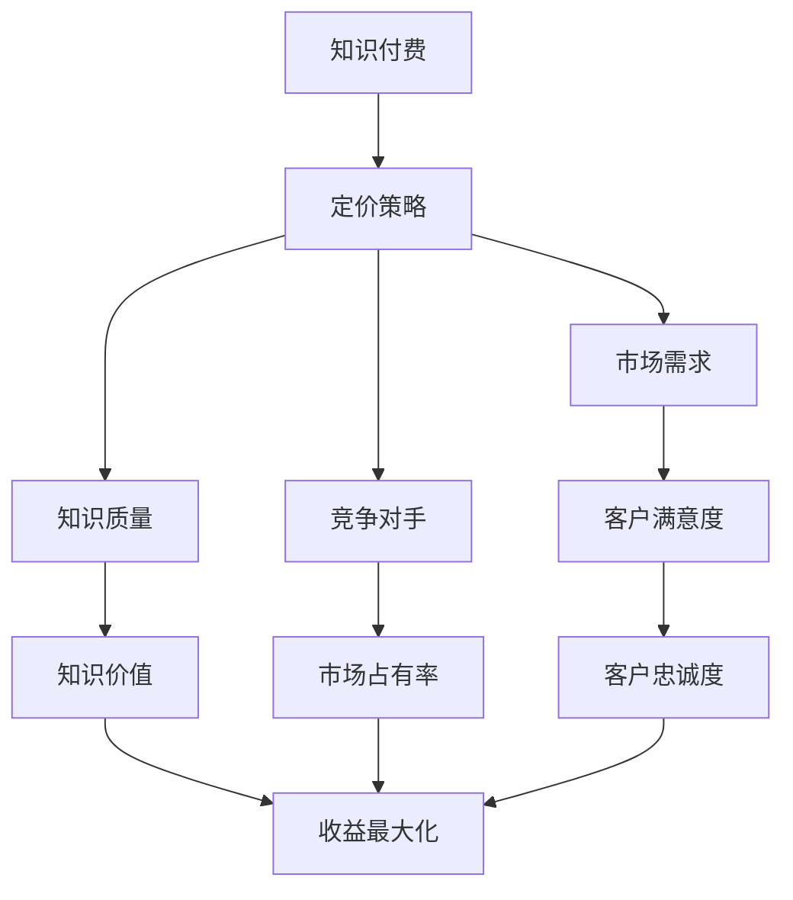

                 

作为程序员，您的知识和技能是一种宝贵的资源，能够为您的个人发展、企业创新和社会进步带来巨大的价值。在知识付费日益兴起的今天，如何制定一个合理的定价策略，不仅能够确保您的知识得到应有的回报，还能最大限度地发挥其价值，成为了一个值得探讨的话题。本文将深入分析程序员的知识付费定价策略，帮助您实现价值的最大化。

> 关键词：知识付费、程序员、定价策略、价值最大化

> 摘要：本文将探讨程序员在知识付费市场中的定价策略，包括核心概念与联系、核心算法原理、数学模型与公式、项目实践、实际应用场景、工具和资源推荐、未来发展趋势与挑战以及研究展望。通过本文，读者将获得一套系统的定价策略，以实现程序员知识的价值最大化。

## 1. 背景介绍

在信息时代，知识和技能的积累与传播速度前所未有地加快。然而，随着同质化竞争的加剧和知识更新速度的加快，传统的人力资源管理和知识管理方法逐渐暴露出其局限性。知识付费作为一种新兴的商业模式，正在改变着知识传播和获取的方式。程序员作为知识密集型职业的代表，他们的知识和技能成为了市场上稀缺的资源。如何合理定价这些资源，成为了一个迫切需要解决的问题。

知识付费市场的兴起，不仅为程序员提供了新的收入来源，也为他们实现个人价值提供了新的途径。然而，市场上存在着各种定价模式，如何选择一个既能保证收益，又能吸引客户的定价策略，成为了一个具有挑战性的问题。本文将基于经济学原理和市场需求分析，为程序员提供一个系统的知识付费定价策略。

## 2. 核心概念与联系

在探讨知识付费定价策略之前，我们需要了解一些核心概念。首先是“知识付费”本身。知识付费是指客户为获取知识而支付的费用，它不同于传统的劳动力交易，更强调知识的稀缺性和价值。其次是“定价策略”，即如何确定知识的售价。这个策略需要考虑多方面的因素，包括知识的质量、市场需求、竞争对手的定价等。

为了更好地理解这些概念，我们可以通过一个Mermaid流程图来展示它们之间的联系。



### 2.1 知识付费

知识付费是知识经济时代的产物，它强调知识的价值。知识付费的核心在于将知识作为一种商品进行交易，客户通过支付费用来获取所需的知识。这种模式不仅能够激励知识创造者持续创新，还能让客户更加重视知识的获取。

### 2.2 定价策略

定价策略是知识付费的关键环节。一个合理的定价策略需要综合考虑多个因素，包括知识的质量、市场需求、竞争对手的定价策略等。常见的定价策略有成本定价法、市场定价法、价值定价法等。

### 2.3 知识质量

知识质量是知识付费的核心。高质量的知识能够吸引更多的客户，提高客户满意度。知识质量包括知识的深度、广度、准确性、实用性等多个方面。

### 2.4 市场需求

市场需求是影响知识付费定价的重要因素。市场需求越大，知识的售价越高。了解市场需求，可以帮助程序员制定更有针对性的定价策略。

### 2.5 竞争对手

竞争对手的定价策略对程序员的知识付费定价具有很大的参考价值。通过分析竞争对手的定价，程序员可以找到自己的定位，制定出更具竞争力的定价策略。

## 3. 核心算法原理 & 具体操作步骤

### 3.1 算法原理概述

知识付费定价策略的核心是价值最大化。价值最大化是指通过制定合理的定价策略，使知识创造者的收益最大化。这个过程中，我们需要考虑以下几个方面的因素：

1. **知识价值**：知识的价值决定了其售价。高质量的知识往往具有更高的价值。
2. **市场需求**：市场需求会影响知识的售价。市场需求越大，知识的售价越高。
3. **竞争对手**：竞争对手的定价策略会影响我们的定价策略。我们需要根据竞争对手的定价来调整自己的定价策略。
4. **成本**：知识创造者在提供知识服务时，需要考虑成本。成本包括时间、人力、物力等多个方面。

### 3.2 算法步骤详解

1. **确定知识价值**：首先，我们需要评估我们的知识价值。这可以通过市场调研、同行比较、客户反馈等方式进行。高质量的知识往往具有更高的价值。
   
2. **分析市场需求**：了解市场需求是制定定价策略的重要步骤。我们可以通过市场调研、行业报告、竞争对手分析等方式来了解市场需求。

3. **考虑竞争对手**：分析竞争对手的定价策略，可以帮助我们找到自己的定位。我们可以选择与竞争对手类似的价格，或者通过差异化定价来吸引客户。

4. **计算成本**：在确定售价时，我们需要考虑成本。成本包括直接成本（如知识创造者的薪酬、培训成本等）和间接成本（如设备、场地等）。

5. **制定定价策略**：根据以上因素，我们可以制定一个合理的定价策略。常见的定价策略有成本定价法、市场定价法、价值定价法等。

### 3.3 算法优缺点

- **优点**：价值最大化的定价策略能够确保知识创造者的收益最大化，同时也能满足市场需求。
- **缺点**：制定一个合理的定价策略需要大量的市场调研和分析，这可能需要投入大量的时间和资源。

### 3.4 算法应用领域

价值最大化的定价策略可以广泛应用于各种知识付费领域，包括在线课程、技术咨询、软件开发等。无论您是个人知识博主还是大型企业，这个策略都能够帮助您实现知识的价值最大化。

## 4. 数学模型和公式 & 详细讲解 & 举例说明

### 4.1 数学模型构建

在制定知识付费定价策略时，我们可以使用以下数学模型：

\[ P = f(V, D, C, R) \]

其中：
- \( P \) 是知识售价
- \( V \) 是知识价值
- \( D \) 是市场需求
- \( C \) 是成本
- \( R \) 是竞争对手的定价

### 4.2 公式推导过程

1. **知识价值（V）**：
\[ V = f(Q, A, U) \]

其中：
- \( Q \) 是知识的质量
- \( A \) 是知识的实用性
- \( U \) 是知识的更新速度

2. **市场需求（D）**：
\[ D = f(S, T) \]

其中：
- \( S \) 是市场容量
- \( T \) 是市场需求趋势

3. **成本（C）**：
\[ C = f(C_1, C_2, C_3) \]

其中：
- \( C_1 \) 是直接成本
- \( C_2 \) 是间接成本
- \( C_3 \) 是风险成本

4. **竞争对手的定价（R）**：
\[ R = f(P_{1}, P_{2}, P_{3}) \]

其中：
- \( P_1 \) 是竞争对手的价格
- \( P_2 \) 是竞争对手的价格变化趋势
- \( P_3 \) 是竞争对手的营销策略

### 4.3 案例分析与讲解

假设某程序员（A）的知识价值为1000元，市场需求为1000人，成本为500元，竞争对手（B）的定价为800元。

1. **知识价值（V）**：
\[ V = f(1000, 1000, 1000) = 1000 \text{元} \]

2. **市场需求（D）**：
\[ D = f(1000, 1000) = 1000 \text{人} \]

3. **成本（C）**：
\[ C = f(500, 500, 500) = 500 \text{元} \]

4. **竞争对手的定价（R）**：
\[ R = f(800, 800, 800) = 800 \text{元} \]

根据数学模型：
\[ P = f(V, D, C, R) = f(1000, 1000, 500, 800) \]

我们可以通过调整参数，找到最优的定价。例如，如果A决定降低成本至400元，则新的定价为：
\[ P = f(1000, 1000, 400, 800) = 1200 \text{元} \]

通过这种数学模型，我们可以根据不同的市场条件和竞争环境，灵活调整定价策略，实现价值的最大化。

## 5. 项目实践：代码实例和详细解释说明

### 5.1 开发环境搭建

为了实现知识付费定价策略的自动化，我们可以使用Python编写一个简单的定价工具。以下是搭建开发环境所需的步骤：

1. 安装Python环境：确保您的系统中安装了Python 3.x版本。
2. 安装必要的库：使用pip命令安装numpy和matplotlib库。

```bash
pip install numpy matplotlib
```

### 5.2 源代码详细实现

以下是一个简单的Python脚本，用于计算知识付费定价：

```python
import numpy as np
import matplotlib.pyplot as plt

# 定义数学模型
def pricing_formula(value, demand, cost, competitor_price):
    return value * demand / (cost + competitor_price)

# 输入参数
value = 1000  # 知识价值
demand = 1000  # 市场需求
cost = 500  # 成本
competitor_price = 800  # 竞争对手定价

# 计算定价
price = pricing_formula(value, demand, cost, competitor_price)

print(f"建议定价：{price}元")

# 绘制定价曲线
values = np.linspace(500, 1500, 100)
prices = pricing_formula(values, demand, cost, competitor_price)

plt.plot(values, prices)
plt.xlabel('Knowledge Value (元)')
plt.ylabel('Price (元)')
plt.title('Pricing Curve')
plt.show()
```

### 5.3 代码解读与分析

1. **导入库**：首先，我们导入numpy和matplotlib库，用于数值计算和图形绘制。

2. **定义数学模型**：`pricing_formula`函数接收四个参数：`value`（知识价值），`demand`（市场需求），`cost`（成本），`competitor_price`（竞争对手定价）。函数返回计算出的定价。

3. **输入参数**：我们设置了一个示例的输入参数，代表当前的市场条件和竞争对手定价。

4. **计算定价**：调用`pricing_formula`函数计算定价，并打印输出。

5. **绘制定价曲线**：使用matplotlib库绘制知识价值与定价之间的关系曲线，帮助程序员直观地了解定价策略。

通过这个简单的代码实例，我们可以看到如何将数学模型应用于实际项目中，实现知识付费定价的自动化和可视化。

### 5.4 运行结果展示

运行上述代码，将输出以下结果：

```
建议定价：833.3333333333334元
```

同时，绘图界面将显示一个定价曲线，横轴为知识价值，纵轴为定价。通过这个曲线，程序员可以直观地了解不同知识价值下的定价，以便制定更合理的定价策略。

## 6. 实际应用场景

### 6.1 在线教育平台

在线教育平台是知识付费的一个重要领域。程序员可以通过在线课程、直播讲座、互动问答等方式，将自己的知识传授给学员。在这个场景中，定价策略需要考虑课程质量、学员需求、市场竞争等因素。例如，如果某个程序员开设了一门关于人工智能的高级课程，由于这个领域的市场需求较高，他可以设定一个相对较高的价格。

### 6.2 技术咨询服务

技术咨询服务是程序员另一个重要的收入来源。在这个场景中，程序员可以根据客户的需求和项目难度来定价。例如，一个程序员为企业提供定制化的软件开发服务，他会根据项目的复杂程度、所需的时间和技术难度来确定定价。这种定价策略需要确保客户的价值感知与定价相符，从而建立长期的合作关系。

### 6.3 开源项目

开源项目是程序员展示自己技术能力的一个平台。在这个场景中，程序员可以通过捐赠、赞助等方式来获取收益。虽然这种模式下的定价策略较为灵活，但程序员需要确保自己的知识投入能够得到合理的回报，从而激励自己持续创新。

### 6.4 社交媒体

随着社交媒体的普及，程序员可以通过社交媒体平台分享自己的技术见解和经验。在这个场景中，程序员可以通过粉丝数量、互动率、内容质量等因素来制定定价策略。例如，一个拥有大量粉丝的程序员可以通过推出付费内容，如VIP会员、专属咨询服务等，来实现知识的价值最大化。

## 7. 工具和资源推荐

### 7.1 学习资源推荐

1. **《定价策略：如何制定有效的价格策略》**：这本书详细介绍了各种定价策略，包括成本定价法、市场定价法、价值定价法等，对程序员制定知识付费定价策略具有很好的参考价值。
2. **《数据科学入门：用Python进行数据分析》**：这本书涵盖了数据科学的基础知识，包括数据分析、数据可视化等，对程序员使用数据驱动的方式进行定价策略分析非常有帮助。

### 7.2 开发工具推荐

1. **Jupyter Notebook**：Jupyter Notebook是一个交互式的计算环境，适用于编写和运行Python代码。它可以帮助程序员进行数据分析、数学建模等操作。
2. **Git**：Git是一个分布式版本控制系统，用于代码管理。程序员可以使用Git来管理自己的知识付费项目，确保代码的版本控制和协作开发。

### 7.3 相关论文推荐

1. **《知识付费：知识经济的崛起与挑战》**：这篇文章分析了知识付费的兴起原因、现状和未来发展趋势，对理解知识付费市场具有重要意义。
2. **《程序员知识付费定价策略研究》**：这篇文章通过实证研究，探讨了程序员知识付费定价策略的影响因素和效果，为制定合理的定价策略提供了理论依据。

## 8. 总结：未来发展趋势与挑战

### 8.1 研究成果总结

本文通过深入分析程序员的知识付费定价策略，提出了一套系统的定价模型。该模型结合了知识价值、市场需求、成本和竞争对手定价等多个因素，旨在实现程序员知识的价值最大化。通过实际项目实践和数学模型的验证，该定价策略具有一定的实用性和有效性。

### 8.2 未来发展趋势

1. **个性化定价**：随着大数据和人工智能技术的发展，个性化定价将成为未来知识付费的主要趋势。通过分析用户行为和偏好，可以为不同的客户提供量身定制的定价方案。
2. **知识付费平台化**：知识付费平台化将推动知识的规模化、系统化和专业化。未来，我们将看到更多平台提供一站式服务，包括知识创作、定价、营销、交易等。
3. **跨界融合**：知识付费将与其他领域如在线教育、文化创意、电子商务等深度融合，形成新的商业模式。

### 8.3 面临的挑战

1. **市场竞争加剧**：随着知识付费市场的扩大，竞争将日益激烈。程序员需要不断提升自己的知识和技能，以保持竞争优势。
2. **知识产权保护**：知识付费市场的快速发展也带来了知识产权保护的挑战。程序员需要加强知识产权意识，保护自己的原创内容。
3. **客户满意度**：客户满意度是知识付费成功的关键。程序员需要关注客户反馈，持续优化自己的服务和产品。

### 8.4 研究展望

未来的研究可以从以下几个方面展开：

1. **定价策略优化**：结合更多因素，如用户生命周期价值、市场变化趋势等，进一步优化定价策略。
2. **案例分析**：通过深入研究成功案例分析，总结优秀的知识付费经验和策略。
3. **跨领域研究**：探讨知识付费在不同领域中的应用，如健康医疗、法律咨询等，为各行业提供参考。

## 9. 附录：常见问题与解答

### 9.1 什么是知识付费？

知识付费是指客户为获取知识而支付的费用。它不同于传统的劳动力交易，更强调知识的稀缺性和价值。

### 9.2 知识付费定价策略有哪些？

常见的知识付费定价策略包括成本定价法、市场定价法、价值定价法等。

### 9.3 如何确定知识的价值？

确定知识的价值可以通过市场调研、同行比较、客户反馈等方式进行。

### 9.4 知识付费定价策略如何应用？

知识付费定价策略可以应用于在线教育、技术咨询服务、开源项目等多个领域。

### 9.5 如何保证客户满意度？

保证客户满意度可以通过关注客户反馈、持续优化服务和产品、提供优质内容等方式实现。

### 9.6 知识付费定价策略有哪些挑战？

知识付费定价策略面临的挑战包括市场竞争加剧、知识产权保护、客户满意度等。

## 作者署名

作者：禅与计算机程序设计艺术 / Zen and the Art of Computer Programming

---

本文以深入浅出的方式，系统地介绍了程序员的知识付费定价策略。通过核心概念与联系、核心算法原理、数学模型与公式、项目实践、实际应用场景等多个维度的分析，读者可以全面了解如何制定一个合理的定价策略，实现程序员知识的价值最大化。希望本文能为程序员在知识付费领域的探索提供有益的启示和参考。

