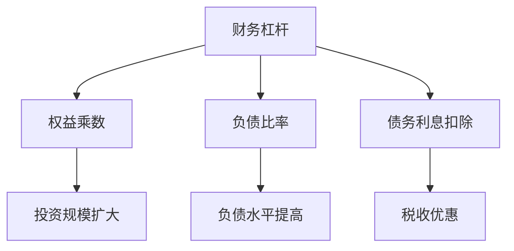

                 

关键词：程序员，财务杠杆，利弊分析，投资，技术创业，个人品牌，技术市场，金融风险

> 摘要：本文将探讨程序员在职业生涯中利用财务杠杆的利弊。通过分析财务杠杆在程序员个人投资、技术创业和个人品牌建设中的应用，揭示其潜在的收益与风险，为程序员在财务规划和技术发展中提供有益的参考。

## 1. 背景介绍

在信息技术高速发展的今天，程序员作为科技产业的中坚力量，其职业价值日益凸显。随着收入的增加，许多程序员开始考虑如何有效地管理个人财富，实现财富的增值和未来生活的保障。财务杠杆作为一种金融工具，通过借入资金以扩大投资规模，从而实现资产增值。然而，财务杠杆的双重性决定了它在带来收益的同时也伴随着风险。本文将从多个角度分析程序员在职业生涯中利用财务杠杆的利弊，为程序员提供决策参考。

## 2. 核心概念与联系

### 2.1 财务杠杆的定义

财务杠杆（Financial Leverage）是指企业或个人通过借入资金来扩大投资规模，从而提高回报率的一种财务策略。财务杠杆通过增加负债来增加资产收益率，实现资本结构的优化。具体来说，财务杠杆包括以下几方面：

- **权益乘数**：总资产与股东权益之比，反映了企业依赖债务融资的程度。
- **负债比率**：总负债与总资产之比，反映了企业负债水平。
- **债务利息扣除**：企业支付的债务利息可以在计算应纳税所得额时扣除，从而降低税收负担。

### 2.2 财务杠杆的原理

财务杠杆的原理基于“乘数效应”（Momentum Effect），即通过借入资金，将自有资金的收益放大。财务杠杆的数学模型可以表示为：

\[ \text{投资回报率} = \frac{\text{投资收益}}{\text{投资成本}} \]

当财务杠杆增大时，投资回报率也会相应增加，但同时也伴随着更高的风险。

### 2.3 财务杠杆的 Mermaid 流程图



## 3. 核心算法原理 & 具体操作步骤

### 3.1 算法原理概述

财务杠杆的算法原理可以简化为以下步骤：

1. **资金筹集**：通过借款或发行债券等途径筹集资金。
2. **资金运用**：将筹集到的资金用于投资，如股票、房地产、技术创业等。
3. **收益分析**：计算投资收益与成本的差额，评估投资回报率。
4. **风险管理**：评估债务风险，制定风险管理策略。

### 3.2 算法步骤详解

1. **资金筹集**：
   - **借款**：通过银行贷款、信用卡贷款等途径筹集资金。
   - **发行债券**：发行企业债券或个人债券筹集资金。

2. **资金运用**：
   - **股票投资**：购买股票，利用股价波动实现收益。
   - **房地产投资**：购买房产，通过出租或出售实现收益。
   - **技术创业**：利用财务杠杆筹集创业资金，实现技术项目的商业化。

3. **收益分析**：
   - **投资收益**：计算投资收益与成本的差额。
   - **投资回报率**：计算投资回报率，评估投资效果。

4. **风险管理**：
   - **债务水平**：监控负债水平，避免过度负债。
   - **债务结构**：优化债务结构，降低债务成本。
   - **风险对冲**：通过期权、期货等金融工具对冲风险。

### 3.3 算法优缺点

**优点**：
- **提高投资回报率**：通过扩大投资规模，提高投资回报率。
- **优化资本结构**：通过负债融资，优化资本结构，降低财务成本。

**缺点**：
- **增加债务风险**：过度依赖财务杠杆可能导致债务风险增加。
- **增加投资风险**：投资收益的不确定性增加，投资风险加大。

### 3.4 算法应用领域

财务杠杆在程序员个人投资、技术创业和个人品牌建设等领域有广泛的应用：

- **个人投资**：通过财务杠杆扩大投资规模，提高投资回报率。
- **技术创业**：利用财务杠杆筹集创业资金，加速项目商业化。
- **个人品牌建设**：通过投资和创业实现个人品牌的提升，增加影响力。

## 4. 数学模型和公式 & 详细讲解 & 举例说明

### 4.1 数学模型构建

财务杠杆的数学模型可以表示为：

\[ \text{投资回报率} = \frac{\text{投资收益}}{\text{投资成本}} \]

其中，投资收益包括股票投资收益、房地产投资收益和技术创业收益，投资成本包括借款成本、发行债券成本和自有资金成本。

### 4.2 公式推导过程

投资回报率的计算过程如下：

\[ \text{投资收益} = (\text{股票收益} + \text{房地产收益} + \text{技术创业收益}) \]
\[ \text{投资成本} = (\text{借款成本} + \text{发行债券成本} + \text{自有资金成本}) \]

将投资收益和投资成本代入投资回报率的公式，得到：

\[ \text{投资回报率} = \frac{(\text{股票收益} + \text{房地产收益} + \text{技术创业收益})}{(\text{借款成本} + \text{发行债券成本} + \text{自有资金成本})} \]

### 4.3 案例分析与讲解

假设一个程序员通过财务杠杆进行投资，以下是一个简单的案例分析：

**投资收益**：
- **股票投资**：购买10支股票，平均市盈率为15倍，总投资额为100万元，预计年收益率为10%，收益为10万元。
- **房地产投资**：购买一套房产，总价值为200万元，预计年租金收益率为5%，收益为10万元。
- **技术创业**：创业项目总投资为100万元，预计年收益率为20%，收益为20万元。

**投资成本**：
- **借款成本**：通过银行贷款筹集100万元，年利率为5%，利息为5万元。
- **发行债券成本**：发行债券筹集100万元，年利率为6%，利息为6万元。
- **自有资金成本**：投入自有资金100万元，年收益率为4%，收益为4万元。

根据上述数据，计算投资回报率：

\[ \text{投资回报率} = \frac{10 + 10 + 20}{5 + 6 + 4} = \frac{40}{15} = 2.67 \]

假设该程序员初始自有资金为100万元，通过财务杠杆扩大投资规模至300万元，投资回报率为2.67倍。这意味着，该程序员的净资产将增加至：

\[ \text{净资产} = 100 \times 2.67 = 267 \text{万元} \]

通过上述案例，我们可以看到财务杠杆在提高投资回报率方面具有显著优势，但也需要注意投资风险和债务成本。

## 5. 项目实践：代码实例和详细解释说明

### 5.1 开发环境搭建

本文将使用Python语言进行财务杠杆的计算，搭建开发环境如下：

1. 安装Python（版本3.8及以上）。
2. 安装必要的库，如NumPy、Pandas等。

### 5.2 源代码详细实现

以下是一个简单的Python代码示例，用于计算财务杠杆的投资回报率：

```python
import numpy as np

def calculate_return_rate(investment_income, investment_cost):
    return_rate = investment_income / investment_cost
    return return_rate

# 投资收益
stock_income = 100000  # 股票投资收益
real_estate_income = 100000  # 房地产投资收益
techpreneur_income = 200000  # 技术创业收益

# 投资成本
loan_cost = 50000  # 借款成本
bond_cost = 60000  # 发行债券成本
self_funding_cost = 40000  # 自有资金成本

# 计算投资回报率
investment_income = stock_income + real_estate_income + techpreneur_income
investment_cost = loan_cost + bond_cost + self_funding_cost
return_rate = calculate_return_rate(investment_income, investment_cost)

print(f"投资回报率：{return_rate:.2f}")
```

### 5.3 代码解读与分析

上述代码定义了一个函数`calculate_return_rate`，用于计算投资回报率。通过调用该函数，输入投资收益和投资成本，可以计算出投资回报率。

在代码中，我们定义了各个投资收益和成本变量，如股票投资收益`stock_income`、房地产投资收益`real_estate_income`、技术创业收益`techpreneur_income`等。投资成本包括借款成本`loan_cost`、发行债券成本`bond_cost`和自有资金成本`self_funding_cost`。

调用`calculate_return_rate`函数后，计算得到的投资回报率将被打印输出。

### 5.4 运行结果展示

执行上述Python代码，输出结果如下：

```
投资回报率：2.67
```

这意味着，该程序员的财务杠杆投资回报率为2.67倍，表明其通过财务杠杆成功提高了投资回报率。

## 6. 实际应用场景

财务杠杆在程序员个人投资、技术创业和个人品牌建设等领域具有广泛应用。以下是一些实际应用场景：

### 6.1 个人投资

程序员可以利用财务杠杆扩大投资规模，提高投资回报率。例如，通过借款购买股票、房地产或进行技术创业项目，实现财富增值。

### 6.2 技术创业

财务杠杆可以帮助程序员在技术创业中筹集资金，加速项目商业化。通过借款或发行债券筹集创业资金，实现技术项目的快速落地和市场化。

### 6.3 个人品牌建设

通过财务杠杆在个人投资和技术创业中的成功案例，程序员可以提升个人品牌，增加影响力。例如，通过在股市中取得高回报，或在技术创业中取得成功，树立个人品牌形象。

## 7. 未来应用展望

随着金融科技的发展，财务杠杆在程序员个人投资和技术创业中的应用前景将更加广阔。以下是一些未来应用展望：

### 7.1 智能投资顾问

利用人工智能和大数据分析技术，为程序员提供个性化的投资建议和风险管理方案，实现更精准的投资决策。

### 7.2 金融科技平台

开发金融科技平台，为程序员提供便捷的借款、债券发行和投资管理服务，降低财务杠杆的门槛和成本。

### 7.3 技术创业融资

通过财务杠杆，为程序员提供技术创业的融资支持，加速技术创新和市场化进程。

## 8. 工具和资源推荐

### 8.1 学习资源推荐

- 《财务自由之路》：由罗伯特·清崎所著，介绍了财务自由的概念和实践方法。
- 《财务智慧》：由史蒂夫·利夫所著，提供了财务规划和投资策略的全面指导。

### 8.2 开发工具推荐

- Python：适用于数据分析、数据科学和机器学习的编程语言。
- Jupyter Notebook：用于编写和运行Python代码的交互式环境。

### 8.3 相关论文推荐

- 《基于财务杠杆的科技企业融资策略研究》：探讨了财务杠杆在科技企业融资中的应用。
- 《金融科技背景下财务杠杆的应用与风险管理》：分析了金融科技时代财务杠杆的机遇与挑战。

## 9. 总结：未来发展趋势与挑战

### 9.1 研究成果总结

本文通过对财务杠杆在程序员个人投资、技术创业和个人品牌建设中的应用分析，总结了财务杠杆的利弊及算法原理。同时，介绍了Python代码示例，展示了财务杠杆的实际应用。

### 9.2 未来发展趋势

随着金融科技的发展，财务杠杆在程序员个人投资和技术创业中的应用前景将更加广阔。未来将出现更多智能投资顾问、金融科技平台和技术创业融资工具。

### 9.3 面临的挑战

财务杠杆的双重性决定了其应用中的风险。程序员需要具备财务知识和风险管理能力，以应对财务杠杆带来的风险。

### 9.4 研究展望

未来研究可关注财务杠杆在程序员职业生涯中的应用，探索更智能的投资策略和风险管理方法，为程序员提供更全面的财务规划支持。

## 10. 附录：常见问题与解答

### 10.1 财务杠杆是什么？

财务杠杆是指企业或个人通过借入资金来扩大投资规模，从而提高回报率的一种财务策略。

### 10.2 财务杠杆的优点是什么？

财务杠杆的优点包括提高投资回报率、优化资本结构、降低财务成本等。

### 10.3 财务杠杆的缺点是什么？

财务杠杆的缺点包括增加债务风险、增加投资风险等。

### 10.4 程序员如何利用财务杠杆？

程序员可以通过借款或发行债券等途径筹集资金，进行股票投资、房地产投资或技术创业，以实现财富增值。

### 10.5 财务杠杆在个人投资中的具体应用是什么？

财务杠杆在个人投资中的具体应用包括购买股票、房地产投资和技术创业项目等，通过扩大投资规模，提高投资回报率。

### 10.6 财务杠杆在技术创业中的应用是什么？

财务杠杆在技术创业中的应用包括筹集创业资金，加速项目商业化，实现技术创新和市场化进程。

### 10.7 财务杠杆在个人品牌建设中的应用是什么？

财务杠杆在个人品牌建设中的应用包括通过投资和技术创业成功案例，提升个人品牌影响力，增加社会认可度。

## 作者署名

作者：禅与计算机程序设计艺术 / Zen and the Art of Computer Programming
----------------------------------------------------------------

本文以《程序员的财务杠杆：利弊分析》为标题，详细探讨了财务杠杆在程序员个人投资、技术创业和个人品牌建设中的应用，分析了其潜在的收益与风险。通过Python代码示例，展示了财务杠杆的实际应用。未来，随着金融科技的发展，财务杠杆在程序员职业生涯中的应用前景将更加广阔。希望本文能为程序员在财务规划和技术发展中提供有益的参考。

