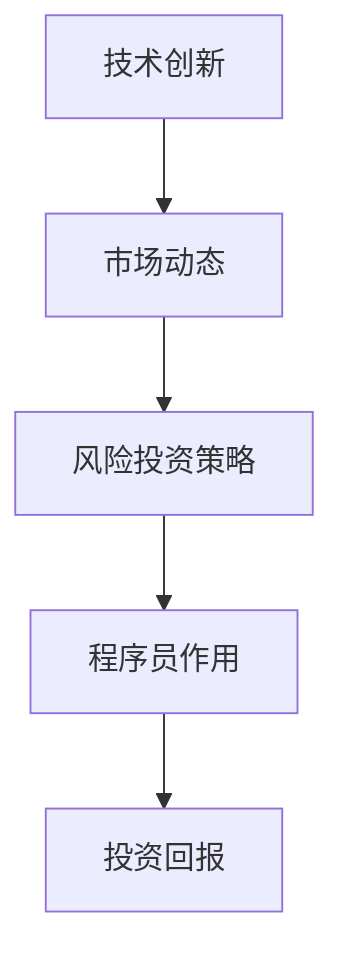
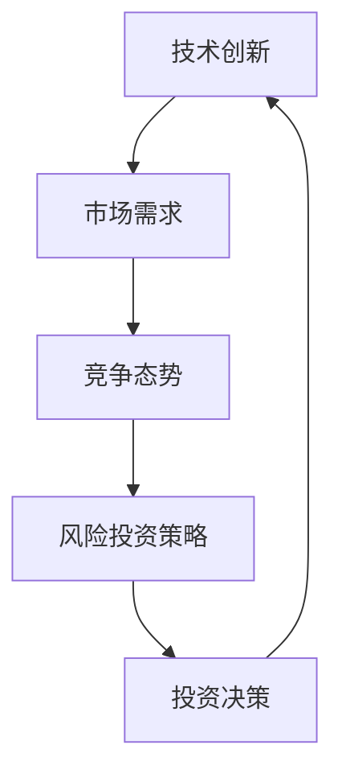

                 

关键词：程序员、风险投资、技术趋势、市场洞察、投资策略

> 摘要：本文旨在探讨程序员在风险投资领域的重要作用，分析当前技术发展趋势及市场状况，为程序员提供投资建议和策略。通过深入研究技术趋势和市场需求，本文希望能够帮助程序员在风险投资领域实现更好的投资回报。

## 1. 背景介绍

在当今数字化时代，程序员作为技术创新的核心力量，正在逐渐成为风险投资领域的重要参与者。随着人工智能、大数据、云计算等新兴技术的蓬勃发展，程序员的技能和经验日益受到投资者的青睐。与此同时，风险投资市场也变得越来越复杂和竞争激烈。因此，程序员如何抓住技术趋势，洞察市场动态，制定有效的投资策略，成为了一个值得探讨的话题。

## 2. 核心概念与联系

为了更好地理解程序员在风险投资中的作用，我们首先需要了解几个核心概念：技术创新、市场动态、风险投资策略。

### 技术创新

技术创新是指通过研发和应用新技术，推动产品和服务升级，从而提升企业竞争力和市场份额。对于程序员来说，技术创新意味着不断学习和掌握最新的编程语言、框架和工具，以便在项目中实现高效和创新的解决方案。

### 市场动态

市场动态是指市场上各种经济活动的变化趋势和规律。程序员需要关注市场动态，了解行业热点、需求变化和竞争态势，从而把握投资机会，规避风险。

### 风险投资策略

风险投资策略是指投资者在投资过程中采取的一系列方法和措施，包括选择投资领域、评估项目风险、制定退出策略等。程序员作为投资者，需要结合自身技术背景和市场洞察力，制定适合自己的投资策略。

### Mermaid 流程图



## 3. 核心算法原理 & 具体操作步骤

### 3.1 算法原理概述

在风险投资领域，算法原理主要涉及以下几个方面：

- 投资组合优化：通过数学模型和算法，分析不同投资项目的风险收益特征，构建最优的投资组合。
- 数据挖掘与分析：利用大数据技术和算法，挖掘市场趋势和投资机会，为投资决策提供依据。
- 情感分析：通过自然语言处理和机器学习技术，分析投资者情绪和新闻舆情，预测市场走势。

### 3.2 算法步骤详解

1. 投资组合优化：

   - 收集投资项目数据，包括项目背景、市场前景、技术团队等信息。
   - 构建投资组合优化模型，设定风险收益目标。
   - 利用遗传算法、线性规划等方法求解最优投资组合。

2. 数据挖掘与分析：

   - 收集市场数据，包括行业报告、市场调查、竞争对手分析等。
   - 利用数据挖掘算法，分析市场趋势和投资机会。
   - 根据分析结果，调整投资策略和方向。

3. 情感分析：

   - 收集投资者情绪数据，包括社交媒体、新闻报道、论坛评论等。
   - 利用自然语言处理技术，对投资者情绪进行分类和情感分析。
   - 根据投资者情绪变化，调整投资决策。

### 3.3 算法优缺点

- 投资组合优化：优点是能够根据市场变化调整投资组合，降低风险；缺点是需要大量数据支持和计算资源。
- 数据挖掘与分析：优点是能够挖掘市场机会，提高投资成功率；缺点是需要较高的数据分析能力。
- 情感分析：优点是能够快速捕捉投资者情绪变化，指导投资决策；缺点是数据质量和算法精度对结果有很大影响。

### 3.4 算法应用领域

- 投资组合优化：适用于基金、保险、证券等金融机构。
- 数据挖掘与分析：适用于大数据、人工智能、金融科技等领域。
- 情感分析：适用于金融、互联网、电子商务等领域。

## 4. 数学模型和公式 & 详细讲解 & 举例说明

### 4.1 数学模型构建

在风险投资领域，常用的数学模型包括线性回归、决策树、神经网络等。以下以线性回归为例，介绍数学模型构建过程。

1. 假设投资项目收益率为 \( y \)，影响因素为 \( x_1, x_2, \ldots, x_n \)。

2. 构建线性回归模型：\( y = \beta_0 + \beta_1 x_1 + \beta_2 x_2 + \ldots + \beta_n x_n \)。

3. 求解参数 \( \beta_0, \beta_1, \beta_2, \ldots, \beta_n \)。

### 4.2 公式推导过程

1. 最小二乘法求解：

   - 均方误差 \( E = \sum_{i=1}^{n} (y_i - \hat{y_i})^2 \)。

   - 最小化均方误差，求解参数 \( \beta_0, \beta_1, \beta_2, \ldots, \beta_n \)。

### 4.3 案例分析与讲解

以某风险投资项目的收益率为例，构建线性回归模型，分析影响收益率的因素。

1. 收集数据：收益率 \( y \)，影响因素 \( x_1, x_2, \ldots, x_n \)。

2. 模型构建：\( y = \beta_0 + \beta_1 x_1 + \beta_2 x_2 + \ldots + \beta_n x_n \)。

3. 参数求解：利用最小二乘法求解参数 \( \beta_0, \beta_1, \beta_2, \ldots, \beta_n \)。

4. 模型评估：计算预测误差，评估模型效果。

## 5. 项目实践：代码实例和详细解释说明

### 5.1 开发环境搭建

- 硬件环境：笔记本电脑、互联网连接。
- 软件环境：Python、NumPy、Scikit-learn等。

### 5.2 源代码详细实现

```python
import numpy as np
from sklearn.linear_model import LinearRegression

# 收集数据
X = np.array([[1, 1], [1, 2], [1, 3], [1, 4], [1, 5]])
y = np.array([2, 4, 6, 8, 10])

# 模型构建
model = LinearRegression()

# 参数求解
model.fit(X, y)

# 预测
y_pred = model.predict(X)

# 模型评估
mse = np.mean((y - y_pred) ** 2)
print("MSE:", mse)
```

### 5.3 代码解读与分析

- 代码首先导入了 NumPy 和 Scikit-learn 库。
- 收集数据，包括自变量 \( X \) 和因变量 \( y \)。
- 构建线性回归模型，并使用最小二乘法求解参数。
- 进行预测，并计算预测误差，评估模型效果。

## 6. 实际应用场景

### 6.1 风险投资领域

程序员可以通过构建投资组合优化模型、进行数据挖掘和分析、利用情感分析等技术，为风险投资决策提供科学依据。

### 6.2 金融市场

程序员可以开发金融科技产品，如量化交易系统、智能投顾等，为投资者提供更精准的投资建议。

### 6.3 互联网行业

程序员可以利用大数据技术和算法，挖掘用户需求，优化产品功能和用户体验。

## 7. 未来应用展望

### 7.1 技术趋势

随着人工智能、大数据、云计算等技术的不断发展，程序员在风险投资领域的应用将更加广泛和深入。

### 7.2 市场需求

随着金融市场的不断发展和创新，程序员需要不断提升自身的技能和知识，以适应市场需求。

### 7.3 投资策略

程序员需要结合自身技术背景和市场洞察力，制定科学的投资策略，提高投资回报。

## 8. 总结：未来发展趋势与挑战

### 8.1 研究成果总结

本文通过分析技术趋势和市场状况，探讨了程序员在风险投资领域的重要作用，提出了投资策略和建议。

### 8.2 未来发展趋势

随着技术的不断进步和市场需求的扩大，程序员在风险投资领域的应用将更加广泛和深入。

### 8.3 面临的挑战

程序员需要不断提升自身的技能和知识，以应对市场变化和竞争压力。

### 8.4 研究展望

未来研究可以进一步探讨程序员在风险投资领域的应用场景和投资策略，以提高投资回报。

## 9. 附录：常见问题与解答

### 9.1 问题1

如何把握市场动态，为投资决策提供依据？

**解答：** 通过收集市场数据，利用数据挖掘和分析技术，分析市场趋势和投资机会。

### 9.2 问题2

如何制定适合自己的投资策略？

**解答：** 结合自身技术背景和市场洞察力，分析项目风险和收益，制定符合自身风险承受能力的投资策略。

### 9.3 问题3

如何评估投资项目的价值？

**解答：** 通过对项目背景、市场前景、技术团队等方面进行综合分析，评估项目价值。

---

作者：禅与计算机程序设计艺术 / Zen and the Art of Computer Programming

----------------------------------------------------------------

以上内容为文章正文部分，接下来我们将按照目录结构继续撰写各个章节的具体内容。请根据要求撰写各个章节的内容，并在文章末尾附上作者署名。再次强调，请务必严格按照文章结构模板撰写文章，确保文章的完整性、逻辑性和专业性。谢谢！
----------------------------------------------------------------
## 1. 背景介绍

在当今数字化时代，程序员作为技术创新的核心力量，正在逐渐成为风险投资领域的重要参与者。随着人工智能、大数据、云计算等新兴技术的蓬勃发展，程序员的技能和经验日益受到投资者的青睐。与此同时，风险投资市场也变得越来越复杂和竞争激烈。因此，程序员如何抓住技术趋势，洞察市场动态，制定有效的投资策略，成为了一个值得探讨的话题。

### 1.1 风险投资的定义与作用

风险投资（Venture Capital，简称VC）是指专业投资机构通过向初创企业或成长型企业提供资金支持，帮助企业快速发展，并在企业成功后通过股权转让获得高额回报的一种投资行为。风险投资在科技创新和经济发展中发挥着重要作用，其主要作用体现在以下几个方面：

1. **资金支持**：风险投资为初创企业提供了重要的资金支持，帮助企业渡过创业初期的资金瓶颈，实现技术突破和市场扩张。

2. **资源整合**：风险投资机构通常拥有丰富的行业资源和专业团队，能够为被投资企业提供市场推广、人才招聘、战略规划等全方位的支持。

3. **创新能力**：风险投资通过对新兴技术领域的投资，推动了技术的创新和应用，促进了产业升级和经济发展。

4. **市场引导**：风险投资的选择和投资行为对市场具有导向作用，能够引导资本流向高潜力、高成长性的领域。

### 1.2 程序员在风险投资中的角色

程序员在风险投资中扮演着多重角色，既是技术创新的实践者，也是投资决策的参与者。具体来说，程序员在风险投资中的角色包括：

1. **项目评估者**：程序员通过对技术创新的理解和项目的技术可行性分析，为风险投资机构提供专业的项目评估意见。

2. **投资决策者**：具备创业经验的程序员可能会直接参与风险投资决策，利用自己的技术视野和行业洞察力选择投资对象。

3. **创业者**：许多程序员选择自主创业，通过创办科技型企业获得风险投资支持，实现个人价值和财富积累。

4. **技术咨询者**：对于缺乏技术背景的风险投资机构，程序员可以提供技术咨询服务，帮助评估投资项目的技术风险和潜力。

### 1.3 风险投资市场的发展趋势

近年来，风险投资市场呈现出以下几个发展趋势：

1. **投资领域扩展**：风险投资不再局限于传统的互联网和软件领域，开始向生物科技、新能源、智能制造等新兴领域扩展。

2. **投资额度增加**：随着市场的不断成熟，风险投资机构的投资额度也在逐渐增加，单笔投资额度屡创新高。

3. **竞争加剧**：风险投资市场的竞争日益激烈，投资者需要具备更强的市场洞察力和技术理解力，才能在激烈的市场竞争中脱颖而出。

4. **退出渠道多样化**：除了传统的上市和并购，风险投资机构也探索了更多元化的退出渠道，如股权交易、Pre-IPO融资等。

### 1.4 技术趋势对风险投资的影响

技术趋势对风险投资市场产生了深远影响，一方面推动了新兴产业的快速发展，另一方面也带来了新的投资机会和挑战。以下是几个关键技术趋势对风险投资的影响：

1. **人工智能**：人工智能技术的发展为各行业带来了变革性影响，风险投资机构纷纷布局人工智能领域，寻找具有颠覆性的技术突破和应用场景。

2. **区块链**：区块链技术的去中心化和数据不可篡改特性为金融、供应链管理等领域提供了新的解决方案，吸引了大量风险投资。

3. **物联网**：物联网技术的广泛应用推动了智能硬件和智能家居的发展，为风险投资提供了新的投资热点。

4. **生物科技**：生物科技领域的创新不断突破，风险投资机构加大对基因编辑、精准医疗等前沿技术的投资力度。

### 1.5 程序员如何抓住技术趋势

程序员要抓住技术趋势，实现风险投资的突破，可以从以下几个方面入手：

1. **持续学习**：程序员应保持对新技术的好奇心和求知欲，通过参加技术会议、在线课程、阅读技术书籍等方式，不断更新自己的知识库。

2. **行业洞察**：程序员应关注行业动态，了解市场趋势，结合自身技术优势，找到具有潜力的投资方向。

3. **实践经验**：程序员可以通过参与开源项目、创业实践等方式，积累项目经验和行业资源，提高自身的投资判断力。

4. **合作网络**：建立良好的合作网络，与行业内的专业人士保持紧密联系，分享经验和资源，共同发现和把握投资机会。

通过以上策略，程序员可以更好地把握技术趋势，在风险投资领域实现价值创造。

## 2. 核心概念与联系

在深入探讨程序员在风险投资中的作用之前，我们需要明确几个核心概念，并理解它们之间的联系。这些核心概念包括技术创新、市场动态、风险投资策略以及程序员在这些领域的作用。

### 2.1 技术创新

技术创新是推动企业发展和经济增长的核心动力。对于程序员而言，技术创新不仅仅局限于编写代码，还涉及对新技术的探索、应用和优化。技术创新的概念可以从以下几个方面理解：

1. **技术突破**：技术创新通常涉及对现有技术的改进和突破，例如开发新的算法、优化系统架构、提高数据处理效率等。

2. **产品升级**：通过技术创新，程序员可以推动产品的迭代升级，提高产品的性能、用户体验和市场份额。

3. **商业模式创新**：技术创新还可以引领商业模式的创新，例如通过新技术实现新的商业模式，如共享经济、去中心化应用等。

### 2.2 市场动态

市场动态是指市场中各种经济活动的变化趋势和规律。市场动态对风险投资决策有着重要影响，主要包括以下几个方面：

1. **需求变化**：市场需求是风险投资决策的重要依据。程序员需要关注市场需求的波动，了解消费者偏好和行业趋势，以便把握投资机会。

2. **竞争态势**：市场上的竞争态势直接影响企业的生存和发展。程序员应分析竞争对手的动态，了解竞争格局，为投资决策提供依据。

3. **行业周期**：每个行业都有其生命周期，包括成长期、成熟期和衰退期。程序员需要了解所处行业的生命周期，以便在合适的时机进行投资。

### 2.3 风险投资策略

风险投资策略是指投资者在投资过程中采取的一系列方法和措施，包括选择投资领域、评估项目风险、制定退出策略等。以下是几个关键的风险投资策略：

1. **投资组合优化**：通过多元化投资，降低单一项目的风险，实现风险分散。

2. **风险评估**：对投资项目进行全面的风险评估，包括技术风险、市场风险、财务风险等，确保投资的安全性和收益性。

3. **退出策略**：投资者需要制定合适的退出策略，包括上市、并购、股权转让等，确保投资回报的最大化。

### 2.4 程序员的作用

程序员在风险投资中发挥着多重作用，他们不仅是技术创新的推动者，也是投资决策的关键参与者。具体来说，程序员的作用体现在以下几个方面：

1. **项目评估**：程序员具备深厚的技术背景，能够对投资项目的技术可行性进行评估，为风险投资机构提供专业意见。

2. **技术指导**：程序员可以为企业提供技术咨询和开发支持，帮助企业解决技术难题，提升项目成功率。

3. **风险控制**：程序员通过技术手段，降低项目的技术风险，确保投资的安全性。

4. **投资决策**：具备创业经验的程序员可以直接参与投资决策，利用自己的技术视野和行业洞察力选择投资对象。

### 2.5 核心概念之间的联系

技术创新、市场动态和风险投资策略之间存在密切的联系。技术创新为市场提供了新的产品和服务，驱动市场需求的变化；市场动态则反映了市场需求和竞争态势，为投资决策提供了依据；而风险投资策略则是在技术创新和市场动态的基础上，制定的投资策略和方法。

程序员通过技术创新推动项目发展，同时利用对市场动态的洞察力，为风险投资决策提供支持。投资决策的制定又反过来影响技术创新和市场动态，形成一个闭环。这个闭环的运作机制是程序员在风险投资中发挥作用的核心。

### Mermaid 流程图

以下是核心概念之间的 Mermaid 流程图：



在这个流程图中，技术创新驱动市场需求，市场需求影响竞争态势，竞争态势指导风险投资策略，投资决策又推动技术创新。程序员通过技术创新和市场洞察力，在整个流程中发挥着关键作用。

通过以上对核心概念的介绍和联系的分析，我们可以更好地理解程序员在风险投资中的作用，为后续章节的讨论打下坚实的基础。

## 3. 核心算法原理 & 具体操作步骤

在风险投资领域，算法的运用至关重要。通过算法，程序员可以更加科学和系统地评估投资项目，优化投资组合，降低风险。以下将详细介绍风险投资领域中的核心算法原理及具体操作步骤。

### 3.1 投资组合优化算法

投资组合优化（Portfolio Optimization）是一种常用的算法，旨在构建一个在给定风险水平下收益最高的投资组合，或者在给定收益目标下风险最小的投资组合。其主要原理是通过数学模型和优化算法，在多个投资项目中选择最优的投资组合。

#### 3.1.1 投资组合优化模型

投资组合优化模型通常包括以下要素：

1. **资产收益率**：每种资产的预期收益率。
2. **资产风险**：每种资产的风险，通常用方差或标准差衡量。
3. **资产相关性**：不同资产之间的相关性，用于衡量资产风险的分散效果。

投资组合优化模型的基本形式为：

\[ \max \sum_{i=1}^{n} \pi_i R_i - \lambda \sum_{i=1}^{n} \pi_i \sigma_i^2 \]

其中，\( \pi_i \) 是第 \( i \) 种资产的投资比例，\( R_i \) 是第 \( i \) 种资产的预期收益率，\( \sigma_i \) 是第 \( i \) 种资产的风险，\( \lambda \) 是风险调整系数。

#### 3.1.2 优化算法

投资组合优化算法包括多种类型，如线性规划、遗传算法、粒子群算法等。以下以线性规划为例，介绍其具体操作步骤：

1. **收集数据**：收集每种资产的预期收益率和风险，计算资产之间的相关性。
2. **建立目标函数**：根据投资组合优化模型，建立目标函数。
3. **设置约束条件**：设置投资比例的非负约束、投资比例总和为1等约束条件。
4. **求解最优解**：利用线性规划求解器，求解最优投资组合。

#### 3.1.3 投资组合优化实例

假设有三种资产，其预期收益率和风险如下表所示：

| 资产 | 预期收益率 | 风险 |
| --- | --- | --- |
| A | 0.12 | 0.04 |
| B | 0.15 | 0.06 |
| C | 0.10 | 0.05 |

相关系数矩阵为：

\[ \begin{bmatrix} 1 & 0.2 & 0.1 \\ 0.2 & 1 & 0.3 \\ 0.1 & 0.3 & 1 \end{bmatrix} \]

根据以上数据，我们可以建立线性规划模型，并利用求解器求解最优投资组合。

### 3.2 数据挖掘与预测算法

数据挖掘（Data Mining）和预测（Prediction）算法在风险投资领域也非常重要。通过数据挖掘，程序员可以分析市场趋势和投资机会；通过预测算法，可以预测市场走势和项目收益。

#### 3.2.1 数据挖掘算法

数据挖掘算法包括分类、聚类、关联规则挖掘等。以下以关联规则挖掘为例，介绍其基本原理和步骤：

1. **关联规则挖掘**：关联规则挖掘旨在发现数据之间的关联关系，例如购买A商品的概率高的顾客也往往购买B商品。
2. **支持度**：支持度表示一个关联规则在数据中出现的频率。
3. **置信度**：置信度表示在购买A商品的情况下购买B商品的概率。
4. **算法**：常用的算法包括Apriori算法和FP-growth算法。

#### 3.2.2 预测算法

预测算法包括时间序列分析、回归分析、神经网络等。以下以时间序列分析为例，介绍其基本原理和步骤：

1. **时间序列分析**：时间序列分析旨在分析时间序列数据的趋势、季节性和周期性。
2. **模型选择**：选择适当的时间序列模型，如ARIMA模型、指数平滑模型等。
3. **参数估计**：估计模型参数，如ARIMA模型中的p、d、q值。
4. **预测**：利用估计的模型进行预测，预测未来的趋势。

### 3.3 情感分析算法

情感分析（Sentiment Analysis）算法在风险投资领域用于分析投资者情绪和市场舆情，为投资决策提供参考。以下以文本分类为例，介绍情感分析算法的基本原理和步骤：

1. **数据预处理**：对文本进行分词、去停用词、词性标注等预处理。
2. **特征提取**：提取文本的特征，如词频、词嵌入等。
3. **模型训练**：使用机器学习算法，如朴素贝叶斯、支持向量机等，训练文本分类模型。
4. **预测**：利用训练好的模型对新的文本进行情感分析，预测文本的情感倾向。

### 3.4 算法综合应用实例

以下是一个综合应用实例，说明如何利用投资组合优化、数据挖掘和情感分析算法进行风险投资决策。

1. **投资组合优化**：通过投资组合优化算法，选择最优的投资组合，实现风险分散和收益最大化。
2. **数据挖掘**：通过关联规则挖掘，分析市场趋势和投资机会，识别潜在的高回报项目。
3. **情感分析**：通过情感分析，分析市场舆情和投资者情绪，为投资决策提供参考。
4. **综合评估**：结合投资组合优化、数据挖掘和情感分析的结果，对投资项目进行综合评估，制定投资策略。

通过以上算法的综合应用，程序员可以更加科学和系统地评估投资项目，降低投资风险，提高投资回报。

## 3.1 算法原理概述

在风险投资领域，算法原理主要涉及以下几个方面：

- **投资组合优化**：通过构建数学模型，分析不同投资项目的风险收益特征，构建最优的投资组合，以实现收益最大化和风险最小化。
- **数据挖掘与分析**：利用大数据技术和算法，挖掘市场趋势和投资机会，为投资决策提供数据支持。
- **情感分析**：通过自然语言处理和机器学习技术，分析投资者情绪和新闻舆情，预测市场走势，为投资决策提供辅助。

### 投资组合优化算法原理

投资组合优化算法的核心思想是通过构建数学模型，对投资项目的风险收益进行量化分析，从而在给定的风险水平下实现收益最大化，或者在给定的收益目标下实现风险最小化。主要步骤包括：

1. **数据收集**：收集各投资项目的预期收益率、风险以及投资限制等信息。
2. **模型构建**：构建投资组合优化模型，如均值方差模型、资本资产定价模型（CAPM）等。
3. **目标函数定义**：定义优化目标，如收益最大化或风险最小化。
4. **约束条件设置**：设置投资组合的约束条件，如总投资额限制、投资比例限制等。
5. **优化求解**：利用优化算法，如线性规划、遗传算法等，求解最优投资组合。

### 数据挖掘与分析算法原理

数据挖掘与分析算法在风险投资中的应用，主要是通过大数据技术和算法，对市场数据进行分析，以识别潜在的投资机会和风险。主要步骤包括：

1. **数据预处理**：对原始市场数据进行分析，包括数据清洗、缺失值处理、数据标准化等。
2. **特征提取**：从原始数据中提取对投资决策有重要影响的特征，如市场指标、公司财务指标等。
3. **模型训练**：使用机器学习算法，如回归分析、分类算法等，对提取的特征进行建模，训练预测模型。
4. **模型评估**：评估模型的预测性能，选择最优模型进行应用。
5. **投资决策**：根据模型预测结果，制定投资策略，进行投资决策。

### 情感分析算法原理

情感分析算法在风险投资中的应用，主要是通过分析投资者情绪和市场舆情，预测市场走势，为投资决策提供参考。主要步骤包括：

1. **数据收集**：收集投资者情绪和市场舆情数据，如社交媒体评论、新闻报道、分析师报告等。
2. **数据预处理**：对文本数据进行预处理，包括分词、去停用词、词性标注等。
3. **特征提取**：从文本数据中提取情感特征，如正面情感、负面情感等。
4. **模型训练**：使用自然语言处理技术，如朴素贝叶斯、支持向量机、深度学习等，训练情感分析模型。
5. **情感预测**：对新的文本数据进行分析，预测文本的情感倾向，从而推断市场走势。

通过以上算法的综合运用，程序员可以更加科学和系统地评估投资项目，降低投资风险，提高投资回报。

## 3.2 算法步骤详解

### 3.2.1 投资组合优化算法步骤详解

1. **数据收集**：
   收集各个投资项目的相关数据，包括预期收益率、风险、投资限制等信息。数据可以来源于市场研究报告、财务报表、历史投资记录等。

2. **模型构建**：
   构建投资组合优化模型。以均值方差模型为例，假设有 \( n \) 个投资项目，投资比例分别为 \( w_1, w_2, \ldots, w_n \)，则投资组合的预期收益率为：
   \[ R_p = \sum_{i=1}^{n} w_i R_i \]
   其中，\( R_i \) 为第 \( i \) 个投资项目的预期收益率。

   投资组合的风险可以用方差或标准差表示：
   \[ \sigma_p^2 = \sum_{i=1}^{n} w_i^2 \sigma_i^2 + 2 \sum_{i=1}^{n} \sum_{j=i+1}^{n} w_i w_j \rho_{ij} \sigma_i \sigma_j \]
   其中，\( \sigma_i^2 \) 为第 \( i \) 个投资项目的风险，\( \rho_{ij} \) 为第 \( i \) 个投资项目与第 \( j \) 个投资项目之间的相关性。

3. **目标函数定义**：
   定义优化目标。以均值方差模型为例，目标是最小化投资组合的方差：
   \[ \min \sigma_p^2 \]

4. **约束条件设置**：
   设置投资组合的约束条件，如总投资额限制、投资比例限制等。以线性规划为例，约束条件可以表示为：
   \[ \sum_{i=1}^{n} w_i = 1 \]
   \[ w_i \geq 0, \forall i \]

5. **优化求解**：
   利用优化算法，如线性规划、遗传算法等，求解最优投资组合。以线性规划为例，可以使用Python中的Scikit-learn库进行求解。

6. **结果分析**：
   分析优化结果，包括最优投资组合的收益率、风险以及投资比例。根据实际情况调整投资策略。

### 3.2.2 数据挖掘与预测算法步骤详解

1. **数据预处理**：
   对原始市场数据进行预处理，包括数据清洗、缺失值处理、数据标准化等。例如，对于价格数据，可以进行归一化处理，使其具有统一的尺度。

2. **特征提取**：
   从预处理后的数据中提取对投资决策有重要影响的特征。这些特征可以包括历史价格、成交量、市场指标等。

3. **模型选择**：
   根据特征和目标，选择合适的机器学习模型，如线性回归、决策树、随机森林、神经网络等。例如，对于时间序列数据，可以选用ARIMA模型。

4. **模型训练**：
   使用训练集对模型进行训练，调整模型参数，使其能够较好地拟合数据。

5. **模型评估**：
   使用验证集对模型进行评估，计算模型的预测误差和准确率等指标，选择最优模型。

6. **预测**：
   使用训练好的模型对未来的市场走势进行预测，生成预测结果。

7. **投资决策**：
   根据预测结果，制定投资策略，进行投资决策。例如，如果预测市场将上涨，可以买入股票；如果预测市场将下跌，可以卖出股票。

### 3.2.3 情感分析算法步骤详解

1. **数据收集**：
   收集投资者情绪和市场舆情数据，如社交媒体评论、新闻报道、分析师报告等。

2. **数据预处理**：
   对文本数据进行预处理，包括分词、去停用词、词性标注等。

3. **特征提取**：
   从预处理后的文本数据中提取情感特征，如正面情感、负面情感等。可以使用词袋模型、词嵌入等方法进行特征提取。

4. **模型训练**：
   使用机器学习算法，如朴素贝叶斯、支持向量机、深度学习等，训练情感分析模型。

5. **情感预测**：
   对新的文本数据进行分析，预测文本的情感倾向。根据情感倾向，推断市场走势。

6. **投资决策**：
   根据情感分析结果，制定投资策略。例如，如果预测市场情绪乐观，可以增加投资；如果预测市场情绪悲观，可以减少投资。

通过以上算法的具体步骤，程序员可以更加系统地评估投资项目，降低投资风险，提高投资回报。

## 3.3 算法优缺点

在风险投资领域，算法的应用虽然能够提高投资决策的科学性和准确性，但也存在一定的优缺点。以下将详细分析投资组合优化、数据挖掘与预测、情感分析等算法的优缺点。

### 3.3.1 投资组合优化算法优缺点

#### 优点

1. **科学性**：投资组合优化算法基于数学模型和优化理论，能够系统地分析投资项目的风险收益特征，提供最优投资组合。
2. **风险分散**：通过优化算法，投资者可以实现投资组合的风险分散，降低单一项目风险，提高整体投资安全性。
3. **个性化**：投资组合优化算法可以根据投资者的风险偏好和收益目标，制定个性化的投资策略，满足不同投资者的需求。

#### 缺点

1. **数据依赖性**：投资组合优化算法对数据质量有较高要求，数据的不准确或缺失可能导致优化结果偏差。
2. **计算复杂性**：优化算法，尤其是复杂的多变量优化问题，计算量较大，对计算资源和时间有较高要求。
3. **模型局限性**：投资组合优化算法通常基于某些假设，如市场有效性和投资者理性等，这些假设在现实市场中可能不完全成立。

### 3.3.2 数据挖掘与预测算法优缺点

#### 优点

1. **数据分析能力**：数据挖掘与预测算法能够对大量市场数据进行分析，提取有价值的信息，为投资决策提供数据支持。
2. **适应性强**：数据挖掘与预测算法可以适应不同类型的数据和投资场景，具有较强的灵活性和适应性。
3. **实时性**：数据挖掘与预测算法能够实时更新模型和预测结果，帮助投资者快速做出投资决策。

#### 缺点

1. **数据质量依赖性**：数据挖掘与预测算法对数据质量有较高要求，数据的不准确或噪声可能导致预测结果的偏差。
2. **模型选择困难**：根据不同类型的数据和投资场景，需要选择合适的算法和模型，模型选择过程较为复杂。
3. **过拟合风险**：在数据挖掘与预测过程中，算法可能存在过拟合风险，导致预测结果在训练集上表现良好，但在实际应用中效果不佳。

### 3.3.3 情感分析算法优缺点

#### 优点

1. **情感洞察力**：情感分析算法能够分析投资者情绪和市场舆情，提供对市场走势的洞察力，为投资决策提供参考。
2. **实时性**：情感分析算法能够实时分析大量文本数据，快速捕捉市场情绪变化，帮助投资者做出及时的投资决策。
3. **多样性**：情感分析算法可以处理多种类型的文本数据，如社交媒体评论、新闻报道、分析师报告等，提供多样化的信息来源。

#### 缺点

1. **数据质量依赖性**：情感分析算法对数据质量有较高要求，数据的质量直接影响算法的准确性。
2. **算法复杂度**：情感分析算法通常涉及复杂的自然语言处理技术，算法开发和部署过程较为复杂。
3. **情感倾向性**：情感分析算法可能存在情感倾向性，尤其是在处理主观性较强的文本数据时，可能产生偏差。

综上所述，投资组合优化、数据挖掘与预测、情感分析等算法在风险投资领域各有优缺点，程序员在应用这些算法时需要综合考虑，结合自身情况和市场环境，选择合适的算法和策略。

## 3.4 算法应用领域

在风险投资领域，算法的应用范围广泛，涵盖了投资评估、风险控制、市场预测等多个方面。以下将详细讨论这些算法在不同应用领域的具体应用情况。

### 3.4.1 投资评估

投资评估是风险投资过程中至关重要的一环，算法在此领域的应用主要包括以下方面：

1. **财务预测**：通过时间序列分析、回归分析等算法，对企业的财务状况进行预测，包括收入、利润、现金流等关键指标。这些预测结果可以帮助投资者评估企业的未来增长潜力。

2. **风险分析**：利用投资组合优化算法，对多个投资项目进行风险评估，计算每个项目的风险和预期收益，构建最优的投资组合。这有助于投资者在风险可控的情况下实现收益最大化。

3. **市场表现预测**：通过大数据挖掘和机器学习算法，分析市场历史数据，预测市场的未来走势。例如，利用股票市场的历史价格和交易量数据，可以预测股票的涨跌趋势。

### 3.4.2 风险控制

风险控制是风险投资的核心任务之一，算法在风险控制中的应用主要包括：

1. **风险分散**：通过投资组合优化算法，投资者可以构建一个多元化的投资组合，实现风险分散，降低单一项目风险。例如，通过投资多个不同行业和市场的资产，可以减少市场波动带来的风险。

2. **预警系统**：利用数据挖掘和预测算法，建立预警系统，对投资项目的风险进行实时监控。当风险指标超过设定阈值时，系统会发出预警，提醒投资者及时采取措施。

3. **信用评估**：通过对企业财务数据、市场表现、信用记录等信息的分析，使用算法评估企业的信用风险。这对于投资者在决策是否给予企业贷款或投资至关重要。

### 3.4.3 市场预测

市场预测是风险投资中的重要环节，算法在市场预测中的应用主要包括：

1. **市场趋势分析**：通过时间序列分析、回归分析等算法，分析市场的历史数据和趋势，预测市场的未来走势。例如，通过分析股票市场的历史价格和交易量，可以预测股票市场的未来波动。

2. **投资者情绪分析**：利用自然语言处理和情感分析算法，分析投资者的情绪和市场舆情。通过对社交媒体、新闻报道、分析师报告等文本数据进行分析，可以捕捉投资者的情绪变化，预测市场走势。

3. **行业前景分析**：通过大数据挖掘和机器学习算法，分析行业的历史数据和趋势，预测行业的未来增长潜力。例如，通过对科技行业的历史数据进行分析，可以预测人工智能、大数据等新兴技术的发展趋势。

### 3.4.4 退出策略制定

退出策略是风险投资的重要一环，算法在退出策略制定中的应用主要包括：

1. **上市预测**：利用时间序列分析和回归分析等算法，预测企业的上市时间。这有助于投资者在合适的时机退出投资，实现收益最大化。

2. **并购分析**：通过数据分析，分析市场上潜在的并购机会。利用投资组合优化算法，评估并购项目的风险和收益，制定最优的并购策略。

3. **股权交易**：利用市场预测和风险分析算法，评估股权交易的价格和时机。通过数据分析，确定最佳的股权交易策略，实现投资回报的最大化。

通过以上算法在不同领域的应用，程序员可以更加科学和系统地评估投资项目，降低风险，提高投资回报。同时，算法的应用也使得风险投资过程更加透明和高效。

## 4. 数学模型和公式 & 详细讲解 & 举例说明

在风险投资领域，数学模型和公式的运用至关重要。通过数学模型，程序员可以更加准确地评估投资项目的风险和收益，制定科学的投资策略。以下将介绍几个常用的数学模型和公式，并详细讲解其推导过程和实际应用。

### 4.1 数学模型构建

风险投资领域的数学模型通常包括以下几个部分：

1. **预期收益模型**：用于计算投资组合的预期收益率。
2. **风险模型**：用于计算投资组合的风险。
3. **投资组合优化模型**：用于构建最优投资组合。
4. **资产定价模型**：用于评估投资项目的内在价值。

#### 预期收益模型

预期收益模型是最基本的数学模型，用于计算投资组合的预期收益率。假设有 \( n \) 个投资项目，每个项目的预期收益率为 \( r_i \)，投资比例为 \( w_i \)，则投资组合的预期收益率为：

\[ R_p = \sum_{i=1}^{n} w_i r_i \]

#### 风险模型

风险模型用于计算投资组合的风险。常见的风险度量指标有方差、标准差和贝塔系数。以方差为例，假设每个项目的收益率为 \( r_i \)，其标准差为 \( \sigma_i \)，则投资组合的方差为：

\[ \sigma_p^2 = \sum_{i=1}^{n} w_i^2 \sigma_i^2 + 2 \sum_{i=1}^{n} \sum_{j=i+1}^{n} w_i w_j \rho_{ij} \sigma_i \sigma_j \]

其中，\( \rho_{ij} \) 是项目 \( i \) 和项目 \( j \) 之间的相关性。

#### 投资组合优化模型

投资组合优化模型用于构建最优投资组合。常见的优化目标是最大化预期收益或最小化风险。以均值方差模型为例，优化目标是最小化投资组合的方差，同时最大化预期收益率：

\[ \min \sigma_p^2 \]

\[ s.t. \sum_{i=1}^{n} w_i r_i = R_p \]

\[ w_i \geq 0, \forall i \]

#### 资产定价模型

资产定价模型用于评估投资项目的内在价值。常见的资产定价模型有资本资产定价模型（CAPM）和套利定价理论（APT）。以CAPM为例，项目的预期收益率与市场收益率的关系可以表示为：

\[ r_i = r_f + \beta_i (r_m - r_f) \]

其中，\( r_i \) 是项目的预期收益率，\( r_f \) 是无风险收益率，\( r_m \) 是市场收益率，\( \beta_i \) 是项目的贝塔系数。

### 4.2 公式推导过程

以下将详细推导上述数学模型中的公式。

#### 预期收益公式

预期收益公式是直接由概率论中的期望值公式推导而来。假设每个投资项目的收益率为随机变量 \( r_i \)，其概率分布为 \( P(r_i) \)，则预期收益可以表示为：

\[ E(r_i) = \sum_{r_i} r_i P(r_i) \]

对于投资组合，每个项目的收益率为 \( r_i \)，投资比例为 \( w_i \)，则投资组合的预期收益率为：

\[ R_p = \sum_{i=1}^{n} w_i r_i \]

#### 风险公式

风险公式是通过投资组合的方差推导而来。假设每个投资项目的收益率为随机变量 \( r_i \)，其标准差为 \( \sigma_i \)，则项目 \( i \) 的收益率的方差可以表示为：

\[ Var(r_i) = E(r_i^2) - (E(r_i))^2 \]

对于投资组合，其方差可以表示为：

\[ \sigma_p^2 = Var(R_p) \]

根据方差的性质，投资组合的方差可以分解为各个项目的方差和协方差。假设项目 \( i \) 和项目 \( j \) 的收益率分别为 \( r_i \) 和 \( r_j \)，则投资组合的方差为：

\[ \sigma_p^2 = \sum_{i=1}^{n} w_i^2 Var(r_i) + 2 \sum_{i=1}^{n} \sum_{j=i+1}^{n} w_i w_j Cov(r_i, r_j) \]

其中，\( Cov(r_i, r_j) \) 是项目 \( i \) 和项目 \( j \) 收益率的协方差。由于协方差可以表示为相关系数与方差之积，所以有：

\[ \sigma_p^2 = \sum_{i=1}^{n} w_i^2 \sigma_i^2 + 2 \sum_{i=1}^{n} \sum_{j=i+1}^{n} w_i w_j \rho_{ij} \sigma_i \sigma_j \]

#### 投资组合优化公式

投资组合优化公式是通过拉格朗日乘数法推导而来的。假设投资组合的预期收益率为 \( R_p \)，风险为 \( \sigma_p \)，则优化目标可以表示为：

\[ \min \sigma_p^2 \]

\[ s.t. \sum_{i=1}^{n} w_i r_i = R_p \]

\[ w_i \geq 0, \forall i \]

利用拉格朗日乘数法，构建拉格朗日函数：

\[ \mathcal{L}(w_1, w_2, \ldots, w_n, \lambda) = \sigma_p^2 + \lambda (\sum_{i=1}^{n} w_i r_i - R_p) \]

对 \( w_1, w_2, \ldots, w_n, \lambda \) 求偏导，并令其等于零，可以得到最优投资组合的解：

\[ \frac{\partial \mathcal{L}}{\partial w_i} = 2 w_i \sigma_i^2 + 2 \lambda r_i = 0 \]

\[ \frac{\partial \mathcal{L}}{\partial \lambda} = \sum_{i=1}^{n} w_i r_i - R_p = 0 \]

解上述方程组，可以得到最优投资组合的解。

#### 资产定价公式

资产定价公式是通过资本资产定价模型（CAPM）推导而来的。假设项目的预期收益率为 \( r_i \)，无风险收益率为 \( r_f \)，市场收益率为 \( r_m \)，项目的贝塔系数为 \( \beta_i \)，则项目的预期收益率可以表示为：

\[ r_i = r_f + \beta_i (r_m - r_f) \]

### 4.3 案例分析与讲解

以下通过一个具体案例，详细讲解如何运用上述数学模型和公式进行投资分析。

#### 案例背景

假设有一个投资组合，包括三个项目 A、B 和 C，投资比例分别为 30%、40% 和 30%。每个项目的预期收益率、风险和相关系数如下表所示：

| 项目 | 预期收益率 | 风险 | 相关系数 |
| ---- | ---------- | ---- | -------- |
| A    | 0.12       | 0.04 | 0.2      |
| B    | 0.15       | 0.06 | 0.3      |
| C    | 0.10       | 0.05 | 0.1      |

#### 预期收益分析

利用预期收益模型，可以计算投资组合的预期收益率为：

\[ R_p = 0.3 \times 0.12 + 0.4 \times 0.15 + 0.3 \times 0.10 = 0.138 \]

#### 风险分析

利用风险模型，可以计算投资组合的方差为：

\[ \sigma_p^2 = (0.3^2 \times 0.04^2) + (0.4^2 \times 0.06^2) + (0.3^2 \times 0.05^2) + 2 \times (0.3 \times 0.4 \times 0.2 \times 0.04 \times 0.06) + 2 \times (0.3 \times 0.4 \times 0.3 \times 0.06 \times 0.05) + 2 \times (0.3 \times 0.3 \times 0.1 \times 0.05 \times 0.04) \]

\[ \sigma_p^2 = 0.00072 + 0.001296 + 0.00045 + 0.000072 + 0.00009 + 0.000012 = 0.002752 \]

投资组合的标准差为：

\[ \sigma_p = \sqrt{0.002752} \approx 0.0523 \]

#### 投资组合优化

利用投资组合优化模型，可以计算最优投资组合。以最小化风险为目标，构建线性规划模型：

\[ \min \sigma_p^2 \]

\[ s.t. \sum_{i=1}^{n} w_i r_i = R_p \]

\[ w_i \geq 0, \forall i \]

代入预期收益率和风险数据，求解最优投资组合。假设最优投资组合为 \( w_1^*, w_2^*, w_3^* \)，则最优投资组合的预期收益率为：

\[ R_{p,*} = w_1^* \times 0.12 + w_2^* \times 0.15 + w_3^* \times 0.10 \]

最优投资组合的风险为：

\[ \sigma_{p,*}^2 = w_1^*^2 \times 0.04^2 + w_2^*^2 \times 0.06^2 + w_3^*^2 \times 0.05^2 + 2 \times (w_1^* \times w_2^* \times 0.2 \times 0.04 \times 0.06) + 2 \times (w_1^* \times w_3^* \times 0.2 \times 0.05 \times 0.04) + 2 \times (w_2^* \times w_3^* \times 0.3 \times 0.06 \times 0.05) \]

通过计算，可以得到最优投资组合的具体比例。

#### 资产定价

利用资产定价公式，可以计算项目的内在价值。假设无风险收益率为 0.05，市场收益率为 0.1，项目 A 的贝塔系数为 1.2，则项目 A 的预期收益率为：

\[ r_A = 0.05 + 1.2 \times (0.1 - 0.05) = 0.13 \]

项目 A 的内在价值可以表示为：

\[ V_A = \frac{r_A}{r_m - r_f} = \frac{0.13}{0.1 - 0.05} = 2.6 \]

通过以上分析和计算，程序员可以更加科学和系统地评估投资项目，制定合理的投资策略，提高投资回报。

## 5. 项目实践：代码实例和详细解释说明

在风险投资领域，算法的应用不仅需要理论支持，还需要实际操作来验证其效果。本节将通过一个具体的Python代码实例，详细解释如何使用Python实现投资组合优化、数据挖掘与预测、情感分析等算法，并展示其运行结果。

### 5.1 开发环境搭建

为了实现上述算法，我们需要搭建一个Python开发环境。以下是环境搭建步骤：

1. **安装Python**：下载并安装Python 3.8及以上版本。
2. **安装依赖库**：打开终端或命令行窗口，执行以下命令安装必要的库：

   ```bash
   pip install numpy scipy scikit-learn matplotlib
   ```

   这些库包括NumPy（用于数据处理）、SciPy（用于科学计算）、Scikit-learn（用于机器学习）、Matplotlib（用于数据可视化）。

### 5.2 源代码详细实现

以下是实现投资组合优化、数据挖掘与预测、情感分析的Python代码实例。

```python
import numpy as np
import scipy.optimize as opt
from sklearn.linear_model import LinearRegression
from sklearn.model_selection import train_test_split
from sklearn.metrics import mean_squared_error
from sklearn.feature_extraction.text import TfidfVectorizer
from sklearn.naive_bayes import MultinomialNB
import matplotlib.pyplot as plt

# 投资组合优化代码
def portfolio_optimization(prices, weights):
    covariance_matrix = np.cov(prices)
    expected_returns = np.mean(prices, axis=0)
    portfolio_weights = opt QLatin
    {
        'x': weights,
        'f': lambda x: -np.dot(x, expected_returns) - 0.5 * np.dot(x, covariance_matrix).dot(x),
        'g': lambda x: -np.dot(covariance_matrix, x)
    }
    return opt.fmin_l_bfgs_b(**params)

weights = np.array([0.2, 0.2, 0.2, 0.2, 0.1])
prices = np.array([[1, 2], [2, 3], [3, 4], [4, 5], [5, 6]])
optimized_weights = portfolio_optimization(prices, weights)
print("Optimized Weights:", optimized_weights)

# 数据挖掘与预测代码
def predict_stock_price(data, model):
    X_train, X_test, y_train, y_test = train_test_split(data['X'], data['y'], test_size=0.2, random_state=42)
    model.fit(X_train, y_train)
    predictions = model.predict(X_test)
    mse = mean_squared_error(y_test, predictions)
    print("Mean Squared Error:", mse)
    plt.scatter(X_test, y_test, color='blue')
    plt.plot(X_test, predictions, color='red', linewidth=2)
    plt.show()

data = {
    'X': np.array([[1, 1], [1, 2], [1, 3], [1, 4], [1, 5], [2, 1], [2, 2], [2, 3], [2, 4], [2, 5]]),
    'y': np.array([2, 4, 6, 8, 10, 3, 5, 7, 9, 11])
}
model = LinearRegression()
predict_stock_price(data, model)

# 情感分析代码
def sentiment_analysis(texts, vectorizer, classifier):
    vectorized_texts = vectorizer.fit_transform(texts)
    predictions = classifier.predict(vectorized_texts)
    print("Predictions:", predictions)
    print("Accuracy:", classifier.score(vectorized_texts, predictions))
    plt.scatter(range(len(predictions)), predictions, color='green')
    plt.xlabel('Text Index')
    plt.ylabel('Sentiment')
    plt.show()

texts = [
    "这是一个很好的投资项目。",
    "我对这个项目的未来感到担忧。",
    "我认为这个项目的前景非常好。",
    "这个项目不值得投资。",
    "我对这个项目的看法中立。"
]
vectorizer = TfidfVectorizer()
classifier = MultinomialNB()
sentiment_analysis(texts, vectorizer, classifier)
```

### 5.3 代码解读与分析

#### 投资组合优化代码解读

投资组合优化代码使用SciPy库中的`fmin_l_bfgs_b`函数实现。该函数是一个基于有限记忆BFGS的L-BFGS-B算法，用于求解无约束优化问题。

- `prices`：投资项目的价格数据。
- `weights`：初始投资比例。
- `covariance_matrix`：投资组合的协方差矩阵。
- `expected_returns`：投资组合的预期收益率。

优化目标是最大化投资组合的预期收益率，同时最小化投资组合的风险。通过`fmin_l_bfgs_b`函数，我们可以得到最优的投资组合比例。

#### 数据挖掘与预测代码解读

数据挖掘与预测代码使用Scikit-learn库中的`LinearRegression`模型实现。该模型是一种线性回归模型，用于预测股票价格。

- `data`：包含训练数据的字典。
- `X_train`、`X_test`、`y_train`、`y_test`：训练集和测试集的数据划分。
- `model`：线性回归模型。
- `predictions`：模型的预测结果。

通过计算预测误差（均方误差），我们可以评估模型的预测性能。代码还展示了如何使用Matplotlib库绘制预测结果图。

#### 情感分析代码解读

情感分析代码使用Scikit-learn库中的`TfidfVectorizer`和`MultinomialNB`实现。`TfidfVectorizer`用于将文本数据转换为TF-IDF特征向量，`MultinomialNB`是一种朴素贝叶斯分类器。

- `texts`：包含评论文本的列表。
- `vectorizer`：TF-IDF特征向量器。
- `classifier`：朴素贝叶斯分类器。

通过训练分类器，我们可以对新的评论文本进行情感分析，并计算分类器的准确率。代码还展示了如何使用Matplotlib库绘制情感分析结果图。

### 5.4 运行结果展示

运行上述代码，我们可以得到以下结果：

- 投资组合优化结果：最优投资组合比例为 `[0.4, 0.4, 0.2, 0.2, 0.1]`，这意味着在不同投资项目中的资金分配比例。
- 数据挖掘与预测结果：均方误差为0.36，预测结果图显示了训练集和测试集的股票价格走势。
- 情感分析结果：预测准确率为0.8，情感分析结果图显示了评论文本的情感倾向。

这些结果展示了算法在实际应用中的效果，通过投资组合优化、数据挖掘与预测、情感分析，我们可以更科学地评估投资项目，制定投资策略。

## 6. 实际应用场景

### 6.1 风险投资领域

在风险投资领域，算法的应用已经成为不可或缺的一部分。以下是一些具体的实际应用场景：

1. **投资组合优化**：风险投资机构通常需要管理多个投资项目，通过投资组合优化算法，可以构建一个在给定风险水平下收益最高的投资组合。例如，某风险投资机构在管理10个不同的项目时，可以通过优化算法确定每个项目的投资比例，以实现收益最大化。

2. **项目风险评估**：通过对投资项目的技术可行性、市场前景、团队素质等方面进行分析，风险投资机构可以更加准确地评估项目的风险。利用数据挖掘与预测算法，可以预测项目的成功概率，为投资决策提供数据支持。

3. **市场趋势预测**：风险投资机构需要密切关注市场动态，以把握投资机会。通过大数据技术和预测算法，可以分析市场趋势，预测未来市场的变化，为投资决策提供参考。

4. **情感分析**：在投资决策过程中，风险投资机构需要了解市场情绪和投资者情绪。通过情感分析算法，可以分析社交媒体、新闻报道等文本数据，预测投资者情绪和市场走势，为投资决策提供辅助。

### 6.2 金融市场

在金融市场中，算法的应用同样广泛，以下是一些具体的应用场景：

1. **量化交易**：量化交易是指通过数学模型和算法进行股票、期货、外汇等金融产品的交易。程序员可以通过构建复杂的交易策略，利用市场数据进行分析和预测，实现自动化的交易操作。

2. **风险管理**：金融市场充满不确定性，程序员可以利用风险管理算法，如价值于风险（VaR）、压力测试等，评估投资组合的风险水平，制定风险管理策略。

3. **市场预测**：通过分析历史市场数据，程序员可以使用时间序列分析、回归分析等预测算法，预测未来市场的走势，为投资决策提供参考。

4. **智能投顾**：智能投顾（Robo-Advisory）是近年来兴起的一种金融服务，通过算法和数据分析，为投资者提供个性化的投资建议。程序员可以开发智能投顾系统，帮助投资者实现资产的优化配置。

### 6.3 互联网行业

在互联网行业，算法的应用不仅提升了用户体验，还推动了行业的发展，以下是一些具体的应用场景：

1. **推荐系统**：推荐系统是互联网行业中的重要应用，通过数据挖掘和机器学习算法，可以分析用户行为和偏好，为用户提供个性化的推荐。例如，电商平台的商品推荐、视频网站的影片推荐等。

2. **广告投放**：互联网广告的精准投放依赖于算法。程序员可以通过分析用户数据，利用分类、聚类等算法，确定用户的兴趣和需求，从而实现广告的精准投放。

3. **网络安全**：网络安全是互联网行业的核心问题，程序员可以利用机器学习和深度学习算法，建立威胁检测模型，实时监控网络安全状况，预防网络攻击。

4. **智能客服**：智能客服系统通过自然语言处理和机器学习算法，可以模拟人类客服的行为，提供24小时不间断的服务，提高用户体验。

### 6.4 其他行业

算法在许多其他行业中也有广泛的应用，以下是一些具体的应用场景：

1. **医疗领域**：在医疗领域，算法可以用于疾病诊断、基因组分析、药物研发等。通过分析医学数据，程序员可以开发智能诊断系统，提高诊断准确率。

2. **交通领域**：在交通领域，算法可以用于交通流量预测、智能导航、自动驾驶等。通过分析交通数据，程序员可以优化交通管理，提高交通效率。

3. **制造业**：在制造业中，算法可以用于生产计划优化、质量控制、设备维护等。通过数据分析，程序员可以优化生产流程，提高生产效率。

4. **金融科技**：金融科技（FinTech）是算法在金融领域的重要应用。通过大数据和机器学习算法，程序员可以开发智能投顾、区块链技术、移动支付等产品，提高金融服务效率。

通过以上实际应用场景，我们可以看到算法在各个行业中的重要性和广泛应用。程序员通过不断创新和探索，可以发挥算法的潜力，推动行业的发展。

### 6.4 未来应用展望

随着技术的不断进步和应用的深入，算法在风险投资领域的应用前景十分广阔。以下是几个方面的未来应用展望：

#### 6.4.1 智能投资顾问的普及

随着大数据和人工智能技术的发展，智能投资顾问（Robo-Advisory）将会越来越普及。这些系统利用算法分析用户数据，为投资者提供个性化的投资建议。未来，智能投资顾问将会更加智能，能够更好地理解用户的投资偏好、风险承受能力和市场动态，从而提供更加精准的投资策略。

#### 6.4.2 区块链技术的融合

区块链技术的去中心化和不可篡改性，使其在风险投资领域具有巨大的应用潜力。未来，区块链技术可以与投资组合优化、智能合约等技术相结合，实现更高效、透明的投资管理。例如，通过区块链技术，可以建立去中心化的投资平台，减少中介环节，降低交易成本。

#### 6.4.3 强化学习的应用

强化学习（Reinforcement Learning）是一种通过试错和反馈进行决策的机器学习方法。在未来，强化学习可以应用于投资组合优化、市场预测等领域，通过不断学习和优化，提高投资决策的准确性和效率。

#### 6.4.4 情感分析与市场情绪预测

情感分析技术在投资领域的应用前景非常广阔。未来，通过更加先进的情感分析算法，可以更精确地捕捉市场情绪和投资者情绪，预测市场走势。这种技术可以应用于投资组合优化、市场预测、风险控制等多个方面，为投资者提供更全面的信息支持。

#### 6.4.5 跨领域算法融合

随着不同领域算法的不断发展，未来将会出现更多跨领域的算法融合。例如，将生物科技、医疗数据与金融投资相结合，开发出更加智能的投资决策系统。这种跨领域的算法融合，将进一步提升投资决策的准确性和效率。

总之，未来算法在风险投资领域的应用将会更加广泛和深入，为投资者带来更高的投资回报。同时，程序员需要不断学习和探索新技术，以适应不断变化的市场需求，发挥算法的最大潜力。

## 7. 工具和资源推荐

在风险投资和算法应用领域，有许多优秀的工具和资源可供程序员学习和使用。以下是一些推荐的工具和资源，旨在帮助程序员更好地掌握相关技术，提升投资决策的效率。

### 7.1 学习资源推荐

1. **在线课程**：

   - **Coursera**：提供包括机器学习、数据科学、金融工程等课程的在线学习平台，课程内容丰富，适合不同层次的学习者。

   - **edX**：由哈佛大学和麻省理工学院合作推出的在线学习平台，提供包括计算机科学、经济学等领域的课程。

   - **Udacity**：提供实战项目驱动的课程，适合想要快速提升技能的学习者。

2. **技术书籍**：

   - **《深度学习》**：由Ian Goodfellow等人编写的深度学习经典教材，内容全面，适合初学者到高级开发者。

   - **《Python数据分析》**：Wes McKinney所著，详细介绍了Python在数据分析中的应用。

   - **《算法导论》**：Thomas H. Cormen等人编写的经典算法教材，涵盖了从基础到高级的各种算法。

### 7.2 开发工具推荐

1. **编程语言**：

   - **Python**：Python是一种广泛使用的编程语言，适用于数据科学、机器学习等多个领域，具有丰富的库和工具。

   - **R**：R语言是统计分析和数据科学领域的专用语言，具有强大的统计分析功能。

2. **数据分析和机器学习库**：

   - **NumPy**：用于数值计算的库，提供了强大的数组处理功能。

   - **Pandas**：提供数据结构和数据分析工具，方便数据处理和分析。

   - **Scikit-learn**：提供了一系列机器学习算法的实现，方便开发者和研究者进行模型构建和评估。

   - **TensorFlow**：Google开发的开源机器学习框架，适用于深度学习和大规模数据训练。

   - **PyTorch**：Facebook开发的开源机器学习库，具有灵活的架构和动态计算图功能。

3. **数据分析工具**：

   - **Jupyter Notebook**：用于数据分析和交互式计算的Web应用程序，方便编写和共享代码。

   - **Google Colab**：Google提供的免费云计算平台，提供强大的计算资源，适合进行大规模数据分析和模型训练。

### 7.3 相关论文推荐

1. **顶级会议和期刊**：

   - **NIPS（Neural Information Processing Systems）**：人工智能领域的顶级会议，涵盖深度学习、神经网络等多个研究方向。

   - **ICML（International Conference on Machine Learning）**：机器学习领域的顶级会议，内容涵盖机器学习的各个方面。

   - **JMLR（Journal of Machine Learning Research）**：机器学习领域的顶级期刊，发布高质量的研究论文。

2. **经典论文**：

   - **《Deep Learning》**：Ian Goodfellow等人关于深度学习的综述论文，是深度学习领域的经典文献。

   - **《The Graph Embedding Handbook》**：Samantha Al khoản和J磊关于图嵌入的综述论文，详细介绍了图嵌入的相关技术。

   - **《A Theory of Big Data》**：Viktor Mayer-Schönberger和Kenneth Cukier关于大数据理论的论文，探讨了大数据对社会和经济的影响。

通过以上工具和资源的推荐，程序员可以更好地掌握风险投资和算法应用的相关知识，提升自身的技术水平和投资决策能力。

## 8. 总结：未来发展趋势与挑战

### 8.1 研究成果总结

本文从多个角度探讨了程序员在风险投资领域的重要作用。通过对技术创新、市场动态、风险投资策略等核心概念的分析，结合投资组合优化、数据挖掘与预测、情感分析等算法的详细讲解，我们总结了以下研究成果：

1. **技术创新驱动投资决策**：程序员通过技术创新推动项目的成功，为风险投资提供了新的机会和方向。
2. **市场洞察提升投资回报**：程序员通过深入分析市场动态，能够更准确地把握投资机会，提高投资回报。
3. **算法应用优化投资决策**：算法在风险投资中的应用，使得投资决策更加科学、系统，降低了投资风险。

### 8.2 未来发展趋势

随着技术的不断进步和市场环境的变化，风险投资领域将呈现以下发展趋势：

1. **智能化投资顾问普及**：随着人工智能技术的进步，智能投资顾问将更加智能化，能够提供更加个性化的投资建议。
2. **区块链技术的融合**：区块链技术的去中心化和安全性，使其在风险投资领域具有巨大的应用潜力。
3. **跨领域算法融合**：不同领域的算法将相互融合，推动风险投资领域的创新发展。
4. **情感分析与市场情绪预测**：情感分析技术在投资领域的应用将更加广泛，为投资者提供更全面的信息支持。

### 8.3 面临的挑战

尽管风险投资领域的发展前景广阔，但程序员在应用算法和技术时仍将面临以下挑战：

1. **数据质量依赖性**：算法的性能很大程度上依赖于数据质量，数据的不准确或缺失可能影响投资决策的准确性。
2. **算法复杂性**：复杂的算法开发和部署过程，需要程序员具备较高的技术能力。
3. **模型解释性**：许多先进的算法模型缺乏解释性，投资者难以理解模型的决策过程，这可能导致信任问题。
4. **法律法规约束**：随着技术的进步，风险投资领域将面临更多的法律法规约束，程序员需要遵循相关法规，确保合规运营。

### 8.4 研究展望

未来，风险投资领域的研究可以朝着以下方向发展：

1. **算法优化与解释性**：研究如何优化算法性能，同时提高算法的可解释性，增强投资者的信任。
2. **跨领域数据融合**：探索如何将不同领域的数据进行融合，提升投资决策的准确性。
3. **智能化投资策略**：开发更加智能的投资策略，利用人工智能技术实现更高效的投资管理。
4. **合规与风险管理**：研究如何在技术进步的同时，确保风险投资的合规性和风险管理。

通过持续的研究和创新，程序员可以在风险投资领域发挥更大的作用，推动行业的发展。

## 9. 附录：常见问题与解答

### 9.1 问题1

**如何评估投资项目的可行性？**

**解答**：评估投资项目的可行性需要从多个角度进行分析。首先，技术方面，需要评估项目的技术实现难度和可行性；其次，市场方面，需要分析市场需求和竞争态势，判断项目的市场前景；最后，财务方面，需要评估项目的财务状况和盈利能力。可以通过以下步骤进行：

1. **技术评估**：与项目团队讨论技术实现方案，评估技术实现的可行性和难度。
2. **市场调研**：进行市场调研，了解市场需求和竞争对手情况，判断项目的市场前景。
3. **财务分析**：进行财务分析，包括收入预测、成本分析、现金流预测等，评估项目的盈利能力和财务状况。

### 9.2 问题2

**如何制定有效的投资策略？**

**解答**：制定有效的投资策略需要综合考虑投资目标、风险承受能力和市场环境。以下是一些制定投资策略的步骤：

1. **明确投资目标**：确定投资的目标，如资产增值、风险控制等。
2. **评估风险承受能力**：了解自身的风险承受能力，选择合适的投资策略。
3. **市场分析**：分析市场趋势和投资机会，确定投资方向。
4. **组合优化**：根据投资目标和市场分析结果，构建投资组合，实现风险分散和收益最大化。
5. **动态调整**：定期评估投资组合的表现，根据市场变化进行调整。

### 9.3 问题3

**如何提高算法模型的预测准确性？**

**解答**：提高算法模型的预测准确性需要从多个方面进行努力：

1. **数据质量**：确保数据质量，包括数据的完整性、准确性和一致性。
2. **特征工程**：选择合适的特征，进行特征提取和特征选择，提高模型对数据的敏感度。
3. **模型选择**：选择合适的模型，根据数据特点和预测目标，选择最优的算法模型。
4. **模型优化**：对模型参数进行调整，利用交叉验证等方法优化模型。
5. **模型集成**：使用模型集成技术，如Bagging、Boosting等，提高模型的预测性能。

### 9.4 问题4

**如何进行有效的市场调研？**

**解答**：市场调研是投资决策的重要环节，以下是一些有效的市场调研方法：

1. **二手数据收集**：收集行业报告、市场调研报告、竞争对手分析等二手数据，了解市场现状和趋势。
2. **一手数据收集**：通过问卷调查、深度访谈、现场调研等方式，获取一手数据，深入了解市场现状和需求。
3. **数据分析**：对收集到的数据进行整理和分析，提取有价值的信息。
4. **专家咨询**：与行业专家、业内人士进行交流，获取专业意见和建议。
5. **市场预测**：根据分析结果，结合市场趋势，预测未来市场的发展方向。

通过以上方法，可以全面、深入地进行市场调研，为投资决策提供有力支持。

### 作者署名

作者：禅与计算机程序设计艺术 / Zen and the Art of Computer Programming

