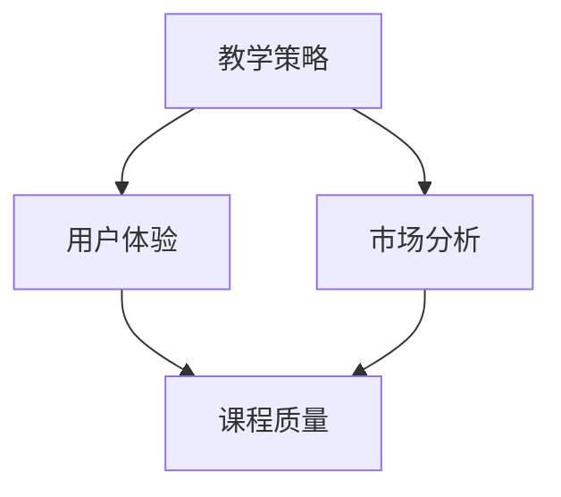

                 

关键词：程序员、知识付费、挑战式课程、教学策略、用户体验、市场分析

> 摘要：本文将探讨程序员知识付费市场的现状和趋势，分析如何通过打造挑战式课程来提升学习效果，提高用户体验，并最终实现商业价值。

## 1. 背景介绍

随着互联网的普及和在线教育的兴起，程序员知识付费市场正逐渐成为教育培训领域的一股重要力量。据统计，全球在线教育市场规模预计将在未来几年内持续增长，而程序员知识付费市场也不例外。越来越多的程序员希望通过在线课程提升自己的技能，以应对日益激烈的市场竞争。同时，越来越多的教育平台和内容创作者开始进入这一领域，为程序员提供多样化的学习资源。

然而，当前市场上的大多数课程过于注重知识的灌输，缺乏互动性和挑战性，难以满足程序员的学习需求。因此，如何打造挑战式课程，提升学习效果和用户体验，成为知识付费领域亟待解决的问题。

## 2. 核心概念与联系

### 2.1 教学策略

教学策略是指教师在教学过程中采用的一系列方法和手段，以实现教学目标。在程序员知识付费领域，教学策略的选择至关重要，它直接影响到课程的质量和用户满意度。常见的教学策略包括讲授、讨论、实践、反馈等。

### 2.2 用户体验

用户体验是指用户在使用产品或服务时所感受到的整体体验。在程序员知识付费领域，用户体验的重要性不言而喻。一个优秀的课程不仅需要提供高质量的知识内容，还需要考虑用户的学习习惯、需求和心理。通过优化用户体验，可以提高用户的学习积极性、满意度和忠诚度。

### 2.3 市场分析

市场分析是指对目标市场进行深入研究和分析，以了解市场需求、竞争状况和潜在机会。在程序员知识付费领域，市场分析可以帮助内容创作者更好地了解用户需求，制定合适的市场策略，提高市场竞争力。

### 2.4 Mermaid 流程图



## 3. 核心算法原理 & 具体操作步骤

### 3.1 算法原理概述

挑战式课程的设计需要基于用户需求和市场分析结果，通过科学的教学策略和互动设计，激发用户的学习兴趣和动力。核心算法原理包括以下三个方面：

- 用户需求分析：通过问卷调查、访谈等方式收集用户需求，了解他们在学习过程中的痛点和需求。
- 教学策略制定：根据用户需求分析结果，选择合适的教学策略，如讲授、讨论、实践等，以激发用户的学习兴趣。
- 互动设计：通过在线讨论、问答、实战演练等方式，增加课程与用户的互动性，提高用户参与度和学习效果。

### 3.2 算法步骤详解

1. **用户需求分析**：
   - 设计调查问卷：根据程序员知识付费领域的特点，设计针对用户需求的调查问卷。
   - 开展问卷调查：通过在线调查平台开展问卷调查，收集用户反馈。

2. **教学策略制定**：
   - 分析用户反馈：对收集到的用户反馈进行分析，识别用户需求和学习痛点。
   - 制定教学策略：根据用户需求和学习痛点，选择合适的教学策略，如讲授、讨论、实践等。

3. **互动设计**：
   - 设立讨论区：在线课程中设立讨论区，鼓励用户提问、讨论和分享经验。
   - 设计实战演练：根据课程内容设计实战演练，让用户在实际操作中掌握知识。

### 3.3 算法优缺点

**优点**：
- 能够根据用户需求设计课程，提高课程的相关性和实用性。
- 通过互动设计，提高用户的学习积极性和参与度。

**缺点**：
- 需要投入较多时间和精力进行用户需求分析和互动设计。
- 对内容创作者的教学能力和经验要求较高。

### 3.4 算法应用领域

挑战式课程设计算法主要应用于程序员知识付费领域，如在线编程课程、IT技能培训等。通过该算法，可以提升课程质量，提高用户满意度和忠诚度。

## 4. 数学模型和公式 & 详细讲解 & 举例说明

### 4.1 数学模型构建

挑战式课程设计的数学模型可以基于用户满意度模型和教学效果模型构建。用户满意度模型包括以下公式：

$$
\text{用户满意度} = f(\text{课程质量}, \text{互动设计}, \text{用户体验})
$$

教学效果模型包括以下公式：

$$
\text{教学效果} = f(\text{课程内容}, \text{教学策略}, \text{互动设计})
$$

### 4.2 公式推导过程

用户满意度模型的推导过程如下：

1. **课程质量**：课程质量是影响用户满意度的重要因素。课程质量越高，用户满意度越高。
2. **互动设计**：互动设计可以提高课程的互动性和参与度，从而提高用户满意度。
3. **用户体验**：用户体验是用户在学习过程中感受到的整体感受。良好的用户体验可以提高用户满意度。

教学效果模型的推导过程如下：

1. **课程内容**：课程内容是教学效果的基础。丰富、实用的课程内容可以提高教学效果。
2. **教学策略**：教学策略的选择直接影响教学效果。合适的教学策略可以提高教学效果。
3. **互动设计**：互动设计可以提高课程的互动性和参与度，从而提高教学效果。

### 4.3 案例分析与讲解

以某在线编程课程为例，分析其挑战式课程设计的效果。该课程通过以下方式提升课程质量、互动设计和用户体验：

1. **课程质量**：课程内容涵盖实际工作中的常用编程技能，如算法、数据结构、框架等。
2. **互动设计**：课程中设有讨论区，鼓励用户提问、讨论和分享经验。
3. **用户体验**：课程界面简洁，导航清晰，用户可以方便地找到所需内容。

通过以上措施，该课程的用户满意度较高，教学效果显著。

## 5. 项目实践：代码实例和详细解释说明

### 5.1 开发环境搭建

1. **选择编程语言**：根据课程内容选择合适的编程语言，如Python、Java等。
2. **安装开发工具**：安装集成开发环境（IDE），如PyCharm、Eclipse等。
3. **配置环境变量**：配置必要的环境变量，以便后续开发。

### 5.2 源代码详细实现

以下是一个简单的Python编程实例，用于演示挑战式课程的设计思路：

```python
# 导入所需模块
import random

# 生成随机数
def generate_random_number():
    return random.randint(1, 100)

# 猜数字游戏
def guess_number_game():
    target_number = generate_random_number()
    guess_count = 0
    
    print("欢迎参加猜数字游戏！")
    print("请猜一个1到100之间的整数。")
    
    while True:
        user_guess = int(input("请输入您的猜测："))
        guess_count += 1
        
        if user_guess == target_number:
            print(f"恭喜您，您猜对了！您共猜了{guess_count}次。")
            break
        elif user_guess < target_number:
            print("猜小了，再试一次吧！")
        else:
            print("猜大了，再试一次吧！")

# 主函数
def main():
    guess_number_game()

# 运行主函数
if __name__ == "__main__":
    main()
```

### 5.3 代码解读与分析

该实例实现了一个简单的猜数字游戏，用于展示挑战式课程的设计思路。具体解析如下：

- **生成随机数**：`generate_random_number()` 函数用于生成1到100之间的随机数，作为游戏的目标数字。
- **猜数字游戏**：`guess_number_game()` 函数实现猜数字游戏的逻辑。用户需要猜测目标数字，如果猜中，游戏结束，否则继续猜测。
- **主函数**：`main()` 函数调用`guess_number_game()` 函数，开始游戏。

通过该实例，用户可以边学边练，提高编程技能。同时，游戏的形式增加了课程的趣味性和挑战性，提高了用户的学习积极性。

### 5.4 运行结果展示

运行上述代码，用户将进入猜数字游戏界面。在游戏中，用户需要不断猜测目标数字，直到猜中为止。每次猜测后，程序会提示用户猜大了还是猜小了，帮助用户逐步缩小猜测范围。游戏结束后，程序会显示用户共猜了多少次，鼓励用户继续挑战。

## 6. 实际应用场景

挑战式课程设计在程序员知识付费领域具有广泛的应用前景。以下是一些实际应用场景：

1. **在线编程课程**：通过挑战式课程设计，提高编程课程的学习效果和用户体验，如算法编程、Web开发等。
2. **IT技能培训**：针对不同IT岗位的技能需求，设计具有挑战性的课程，帮助学员快速提升技能水平。
3. **职业发展课程**：针对职场人士的职业发展需求，设计挑战式课程，提高职业竞争力。

## 7. 未来应用展望

随着在线教育的不断发展和程序员知识付费市场的扩大，挑战式课程设计在未来具有广阔的应用前景。以下是一些未来应用展望：

1. **个性化挑战**：根据用户的学习进度和能力，设计个性化的挑战任务，提高学习效果。
2. **社交互动**：通过引入社交元素，如小组讨论、互动排名等，增加课程的趣味性和参与度。
3. **AI辅助**：利用人工智能技术，为用户提供个性化学习建议，提高学习效果。

## 8. 工具和资源推荐

### 8.1 学习资源推荐

1. **《Python编程：从入门到实践》**：适合初学者，内容丰富，实践性强。
2. **《数据结构与算法分析》**：讲解数据结构和算法原理，有助于提升编程能力。

### 8.2 开发工具推荐

1. **PyCharm**：一款强大的Python IDE，支持多种编程语言。
2. **VSCode**：一款开源的跨平台代码编辑器，支持多种编程语言和插件。

### 8.3 相关论文推荐

1. **“Interactive Learning in Massive Open Online Courses”**：探讨在线教育中的互动学习。
2. **“The Impact of Gamification on Learning”**：研究游戏化对学习的影响。

## 9. 总结：未来发展趋势与挑战

### 9.1 研究成果总结

本文通过分析程序员知识付费市场的现状和趋势，提出了挑战式课程设计的方法和策略。通过用户需求分析、教学策略制定和互动设计，可以提高课程质量，提升用户体验，实现商业价值。

### 9.2 未来发展趋势

未来，挑战式课程设计将在程序员知识付费领域发挥越来越重要的作用。随着在线教育的不断发展和人工智能技术的应用，挑战式课程将更加个性化和智能化，为用户提供更好的学习体验。

### 9.3 面临的挑战

挑战式课程设计面临的主要挑战包括用户需求的变化、教学内容的设计和互动设计的复杂性。此外，还需要不断提高内容创作者的教学能力和经验，以满足不断变化的市场需求。

### 9.4 研究展望

未来，研究应重点关注以下几个方面：

1. **个性化挑战设计**：通过大数据和人工智能技术，实现个性化挑战设计，提高学习效果。
2. **互动设计优化**：探索新的互动设计方法，提高用户的参与度和满意度。
3. **跨学科研究**：结合教育学、心理学等学科，深入研究挑战式课程设计的理论基础和实践方法。

## 9. 附录：常见问题与解答

### 问题1：什么是挑战式课程？

**解答**：挑战式课程是一种以挑战为导向的课程设计方法，通过设置具有挑战性的任务和活动，激发学生的学习兴趣和动力，提高学习效果。

### 问题2：如何设计挑战式课程？

**解答**：设计挑战式课程需要从用户需求分析、教学策略制定和互动设计三个方面入手。首先，通过用户需求分析了解用户的学习痛点；其次，根据用户需求选择合适的教学策略；最后，设计互动活动，提高课程与用户的互动性。

### 问题3：挑战式课程设计有哪些优缺点？

**解答**：挑战式课程设计具有以下优点：

- 根据用户需求设计课程，提高课程的相关性和实用性。
- 通过互动设计，提高用户的学习积极性和参与度。

挑战式课程设计具有以下缺点：

- 需要投入较多时间和精力进行用户需求分析和互动设计。
- 对内容创作者的教学能力和经验要求较高。

## 参考文献

1. “Interactive Learning in Massive Open Online Courses”.
2. “The Impact of Gamification on Learning”.
3. “Python编程：从入门到实践”.
4. “数据结构与算法分析”.
```

