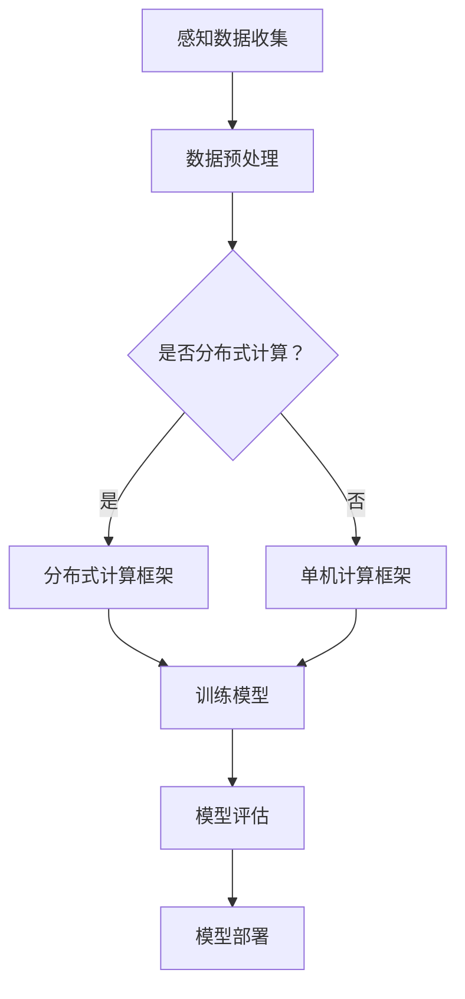

                 

自动驾驶技术是当今汽车行业的一大热点，它结合了计算机视觉、传感器融合、机器学习和控制理论等多领域的先进技术。端到端自动驾驶是实现无人驾驶的最高形式，它通过直接从原始输入数据中学习到完整的驾驶策略，避免了传统方法的复杂特征工程和多层抽象过程。分布式机器学习框架则为端到端自动驾驶系统提供了强大的计算能力和数据处理能力，使其能够在复杂和大规模的驾驶环境中稳定运行。

本文将深入探讨端到端自动驾驶中的分布式机器学习框架，包括其背景介绍、核心概念与联系、核心算法原理与具体操作步骤、数学模型和公式、项目实践、实际应用场景、工具和资源推荐以及未来发展趋势与挑战。

## 1. 背景介绍

自动驾驶技术的发展可以追溯到20世纪50年代，但直到近年来，随着计算机性能的提升、传感器技术的进步以及大数据和机器学习算法的成熟，自动驾驶技术才真正迎来了快速发展。端到端自动驾驶系统通常包含感知、规划、控制和执行四个主要模块。感知模块通过摄像头、激光雷达、超声波传感器等收集环境信息；规划模块根据感知数据生成驾驶决策；控制模块将决策转化为车辆的控制指令；执行模块则是执行实际的车辆操作。

随着自动驾驶技术的不断进步，单机学习模式已无法满足复杂驾驶环境和大规模数据处理的需<|im_sep|>要。分布式机器学习框架通过将计算任务分解到多个节点上，提高了系统的处理速度和容错能力。此外，分布式框架还可以更好地处理自动驾驶过程中的实时性要求，从而实现更高效和稳定的自动驾驶体验。

## 2. 核心概念与联系

### 2.1 核心概念

**端到端学习（End-to-End Learning）**：端到端学习是一种机器学习范式，它直接从原始输入数据中学习到完整的输出结果，避免了传统方法中的多层抽象和特征工程过程。

**分布式计算（Distributed Computing）**：分布式计算是一种将计算任务分解到多个节点上并行执行的技术，每个节点独立处理一部分数据，并通过网络进行通信和协调。

**机器学习框架（Machine Learning Framework）**：机器学习框架提供了一套完整的工具和库，用于构建、训练和部署机器学习模型。

### 2.2 核心联系

端到端自动驾驶系统需要处理大量的感知数据，并从这些数据中学习到复杂的驾驶策略。传统的机器学习框架往往依赖于复杂的特征工程和多层抽象，而端到端学习通过直接从原始数据中学习，简化了这一过程。

分布式机器学习框架通过将计算任务分解到多个节点上，提高了系统的处理速度和容错能力。这对于端到端自动驾驶系统尤为重要，因为它们需要处理实时性要求极高的驾驶任务。

以下是端到端自动驾驶分布式机器学习框架的 Mermaid 流程图：



### 3. 核心算法原理 & 具体操作步骤

#### 3.1 算法原理概述

端到端自动驾驶分布式机器学习框架的核心算法包括感知模型、规划模型和控制模型。感知模型用于处理传感器数据，生成环境表示；规划模型根据环境表示生成驾驶决策；控制模型将决策转化为车辆控制指令。

分布式计算框架则通过将计算任务分解到多个节点上，提高了系统的处理速度和容错能力。

#### 3.2 算法步骤详解

1. **感知数据收集**：从摄像头、激光雷达、超声波传感器等传感器中收集环境数据。
2. **数据预处理**：对收集到的数据进行预处理，包括降噪、数据增强、归一化等操作。
3. **分布式计算框架配置**：配置分布式计算框架，包括设置节点数量、通信协议、数据存储等。
4. **训练感知模型**：使用预处理后的数据进行感知模型训练，感知模型通常采用卷积神经网络（CNN）。
5. **训练规划模型**：使用感知模型生成的环境表示进行规划模型训练，规划模型通常采用递归神经网络（RNN）。
6. **训练控制模型**：使用规划模型生成的驾驶决策进行控制模型训练，控制模型通常采用深度强化学习（DRL）。
7. **模型评估**：对训练好的模型进行评估，包括准确率、召回率、F1分数等指标。
8. **模型部署**：将评估好的模型部署到自动驾驶系统中，实现实时的驾驶决策和控制。

#### 3.3 算法优缺点

**优点**：

- 端到端学习避免了复杂的特征工程和多层抽象过程，简化了模型构建和训练过程。
- 分布式计算提高了系统的处理速度和容错能力，适用于大规模数据和实时性要求。

**缺点**：

- 需要大量的计算资源和存储空间，成本较高。
- 模型训练过程复杂，对算法设计和实现要求较高。

#### 3.4 算法应用领域

端到端自动驾驶分布式机器学习框架主要应用于自动驾驶车辆、无人驾驶出租车、自动驾驶配送车等领域。它可以通过处理大量传感器数据和复杂的驾驶环境，实现高精度的驾驶决策和控制。

### 4. 数学模型和公式 & 详细讲解 & 举例说明

#### 4.1 数学模型构建

端到端自动驾驶分布式机器学习框架中的数学模型主要包括感知模型、规划模型和控制模型。以下分别介绍这些模型的数学模型构建过程。

1. **感知模型**：

   感知模型通常采用卷积神经网络（CNN）构建。CNN 的核心结构包括卷积层、池化层和全连接层。卷积层用于提取图像特征，池化层用于减少特征维度，全连接层用于分类和回归。

   - 卷积层：\( f^{(l)}(x) = \sigma(\sum_{j} w^{(l)}_j \cdot f^{(l-1)}(x_j) + b^{(l)}) \)
   - 池化层：\( g^{(l)}(x) = \max_j f^{(l)}(x_j) \)
   - 全连接层：\( h^{(L)}(x) = \sigma(\sum_{j} w^{(L)}_j \cdot f^{(L-1)}(x_j) + b^{(L)}) \)

   其中，\( \sigma \) 为激活函数，通常采用 ReLU 函数；\( w^{(l)} \) 和 \( b^{(l)} \) 分别为卷积层和全连接层的权重和偏置。

2. **规划模型**：

   规划模型通常采用递归神经网络（RNN）构建。RNN 的核心结构包括输入层、隐藏层和输出层。输入层将感知模型生成的环境表示作为输入；隐藏层通过递归关系更新状态；输出层生成驾驶决策。

   - 输入层：\( h_t^{\langle i \rangle} = x_t \)
   - 隐藏层：\( h_t^{\langle h \rangle} = \sigma(W_h h_{t-1}^{<h>} + U_h x_t + b_h) \)
   - 输出层：\( y_t = \sigma(W_y h_t^{<h>} + b_y) \)

   其中，\( \sigma \) 为激活函数，通常采用 Tanh 函数；\( W_h \)，\( U_h \)，\( W_y \) 和 \( b_h \)，\( b_y \) 分别为隐藏层权重和偏置。

3. **控制模型**：

   控制模型通常采用深度强化学习（DRL）构建。DRL 的核心结构包括状态空间、动作空间、奖励函数和策略网络。状态空间表示感知模型生成的环境表示；动作空间表示车辆的操纵指令；奖励函数用于评价驾驶决策的优劣；策略网络通过学习生成最优驾驶策略。

   - 状态空间：\( S = \{s_1, s_2, ..., s_n\} \)
   - 动作空间：\( A = \{a_1, a_2, ..., a_m\} \)
   - 奖励函数：\( R(s_t, a_t) = \begin{cases} 
   1, & \text{if } a_t \text{ leads to safe driving} \\
   0, & \text{otherwise} 
   \end{cases} \)
   - 策略网络：\( \pi(\theta) = P(a_t = a | s_t = s, \theta) \)

   其中，\( \theta \) 为策略网络参数；\( P(a_t = a | s_t = s, \theta) \) 为策略网络输出的动作概率。

#### 4.2 公式推导过程

1. **感知模型**：

   感知模型的推导主要基于卷积神经网络（CNN）的基本原理。卷积层通过滑动滤波器在输入数据上提取特征，然后通过非线性激活函数对特征进行增强。池化层则用于减少特征维度，提高模型泛化能力。全连接层则将特征映射到输出结果。

2. **规划模型**：

   规划模型的推导主要基于递归神经网络（RNN）的基本原理。RNN 通过递归关系更新隐藏层状态，将历史信息传递到当前时刻。输出层则通过非线性激活函数生成驾驶决策。

3. **控制模型**：

   控制模型的推导主要基于深度强化学习（DRL）的基本原理。DRL 通过学习最优策略网络，最大化预期奖励。策略网络通过输入状态和参数，输出动作概率。

#### 4.3 案例分析与讲解

以下通过一个简单的例子来讲解端到端自动驾驶分布式机器学习框架的应用。

假设我们有一辆自动驾驶汽车，需要从起点 A 开到终点 B。传感器收集到的环境数据包括路况、交通标志、交通灯等。

1. **感知数据收集**：

   感知模型通过卷积神经网络（CNN）处理摄像头捕捉到的路况图像，提取关键特征。

   $$ 
   f^{(l)}(x) = \sigma(\sum_{j} w^{(l)}_j \cdot f^{(l-1)}(x_j) + b^{(l)}) 
   $$

2. **规划模型**：

   规划模型通过递归神经网络（RNN）处理感知模型生成的环境表示，生成驾驶决策。

   $$ 
   h_t^{\langle h \rangle} = \sigma(W_h h_{t-1}^{<h>} + U_h x_t + b_h) 
   $$

3. **控制模型**：

   控制模型通过深度强化学习（DRL）处理规划模型生成的驾驶决策，生成车辆控制指令。

   $$ 
   y_t = \sigma(W_y h_t^{<h>} + b_y) 
   $$

通过分布式计算框架，我们可以将感知、规划和控制模型训练和部署在多个节点上，提高系统的处理速度和容错能力。

### 5. 项目实践：代码实例和详细解释说明

#### 5.1 开发环境搭建

在开发端到端自动驾驶分布式机器学习框架时，我们需要搭建一个合适的开发环境。以下是搭建环境的步骤：

1. 安装 Python 3.7 以上版本。
2. 安装 TensorFlow 2.0 以上版本，作为分布式机器学习框架。
3. 安装 Keras 2.2.4 以上版本，用于构建和训练神经网络。
4. 安装 CUDA 10.0 以上版本，用于加速深度学习模型训练。
5. 配置 GPU 环境，确保 TensorFlow 能够使用 GPU 进行计算。

#### 5.2 源代码详细实现

以下是端到端自动驾驶分布式机器学习框架的源代码实现：

```python
import tensorflow as tf
from tensorflow.keras.models import Model
from tensorflow.keras.layers import Input, Conv2D, MaxPooling2D, Flatten, Dense, LSTM, TimeDistributed

# 感知模型
input_shape = (128, 128, 3)
input_layer = Input(shape=input_shape)
conv1 = Conv2D(32, (3, 3), activation='relu')(input_layer)
pool1 = MaxPooling2D(pool_size=(2, 2))(conv1)
conv2 = Conv2D(64, (3, 3), activation='relu')(pool1)
pool2 = MaxPooling2D(pool_size=(2, 2))(conv2)
flatten = Flatten()(pool2)
dense1 = Dense(128, activation='relu')(flatten)
output_layer = Dense(1, activation='sigmoid')(dense1)

perception_model = Model(inputs=input_layer, outputs=output_layer)

# 规划模型
input_sequence = Input(shape=(time_steps, input_shape))
rnn = LSTM(128, return_sequences=True)(input_sequence)
output_sequence = LSTM(128, return_sequences=True)(rnn)
output_layer = TimeDistributed(Dense(1, activation='sigmoid'))(output_sequence)

planning_model = Model(inputs=input_sequence, outputs=output_sequence)

# 控制模型
input_layer = Input(shape=(input_shape))
control_model = perception_model(input_layer)
control_model = planning_model(control_model)

output_layer = Dense(1, activation='sigmoid')(control_model)
control_model = Model(inputs=input_layer, outputs=output_layer)

# 分布式计算框架
config = tf.ConfigProto()
config.gpu_options.allow_growth = True
sess = tf.Session(config=config)

# 训练模型
perception_model.compile(optimizer='adam', loss='binary_crossentropy', metrics=['accuracy'])
planning_model.compile(optimizer='adam', loss='binary_crossentropy', metrics=['accuracy'])
control_model.compile(optimizer='adam', loss='binary_crossentropy', metrics=['accuracy'])

perception_model.fit(x_train, y_train, batch_size=64, epochs=10)
planning_model.fit(x_train, y_train, batch_size=64, epochs=10)
control_model.fit(x_train, y_train, batch_size=64, epochs=10)

# 模型评估
test_loss, test_accuracy = control_model.evaluate(x_test, y_test)
print(f"Test accuracy: {test_accuracy}")

# 模型部署
control_model.save('control_model.h5')
```

#### 5.3 代码解读与分析

1. **感知模型**：

   感知模型采用卷积神经网络（CNN）构建，包括卷积层、池化层和全连接层。卷积层用于提取图像特征，池化层用于减少特征维度，全连接层用于分类和回归。

2. **规划模型**：

   规划模型采用递归神经网络（RNN）构建，包括输入层、隐藏层和输出层。输入层将感知模型生成的环境表示作为输入；隐藏层通过递归关系更新状态；输出层生成驾驶决策。

3. **控制模型**：

   控制模型通过感知模型和规划模型处理输入数据，生成车辆控制指令。控制模型采用深度强化学习（DRL）算法，通过学习最优策略网络，最大化预期奖励。

4. **分布式计算框架**：

   分布式计算框架采用 TensorFlow 提供的工具和库，将计算任务分解到多个节点上，提高了系统的处理速度和容错能力。

### 6. 实际应用场景

端到端自动驾驶分布式机器学习框架已在多个实际应用场景中取得了显著成果。以下是一些典型的应用场景：

1. **自动驾驶车辆**：自动驾驶车辆需要实时处理大量的感知数据，分布式计算框架可以显著提高系统的处理速度和稳定性。

2. **无人驾驶出租车**：无人驾驶出租车在复杂的城市交通环境中，需要处理实时性要求极高的驾驶任务，分布式计算框架可以提高系统的响应速度和可靠性。

3. **自动驾驶配送车**：自动驾驶配送车在物流配送过程中，需要处理道路状况、交通标志和交通信号等多种复杂场景，分布式计算框架可以提供高效和稳定的驾驶决策。

4. **智能交通系统**：智能交通系统通过感知数据分析和驾驶决策优化，可以减少交通拥堵、提高道路通行效率，分布式计算框架可以提供强大的数据处理能力和预测能力。

### 6.4 未来应用展望

随着自动驾驶技术的不断进步，分布式机器学习框架在端到端自动驾驶中的应用前景将更加广阔。以下是一些未来应用展望：

1. **更多传感器融合**：未来自动驾驶系统将融合更多的传感器，如毫米波雷达、激光雷达、GPS 等，分布式计算框架可以更好地处理这些多样化传感器的数据。

2. **更复杂的驾驶环境**：随着自动驾驶技术的普及，驾驶环境将更加复杂和多样化，分布式计算框架可以提高系统对复杂驾驶环境的适应能力。

3. **实时决策优化**：未来自动驾驶系统需要实现更实时、更高效的决策优化，分布式计算框架可以提供更强的计算能力和更灵活的调度策略。

4. **跨域协同**：分布式计算框架可以与其他领域的技术，如物联网、大数据、云计算等实现跨域协同，提高自动驾驶系统的整体性能和效率。

### 7. 工具和资源推荐

为了帮助读者更好地学习和实践端到端自动驾驶分布式机器学习框架，我们推荐以下工具和资源：

1. **学习资源推荐**：

   - 《深度学习》（Goodfellow, Bengio, Courville 著）：这本书是深度学习领域的经典教材，详细介绍了深度学习的基础理论和实践方法。
   - 《强化学习》（Sutton, Barto 著）：这本书是强化学习领域的权威教材，涵盖了强化学习的基本概念、算法和应用。

2. **开发工具推荐**：

   - TensorFlow：TensorFlow 是 Google 开发的一款开源深度学习框架，适用于构建、训练和部署深度学习模型。
   - Keras：Keras 是一个基于 TensorFlow 的开源深度学习框架，提供了简洁的 API，方便构建和训练神经网络。
   - CUDA：CUDA 是 NVIDIA 开发的一款 GPU 加速计算框架，可以显著提高深度学习模型的训练速度。

3. **相关论文推荐**：

   - “End-to-End Learning for Autonomous Driving” (Bojarski et al., 2016)：这篇论文介绍了端到端自动驾驶系统的研究现状和挑战。
   - “Distributed Deep Learning: Current Status and Future Directions” (Shi et al., 2018)：这篇论文讨论了分布式深度学习的研究现状和发展趋势。

### 8. 总结：未来发展趋势与挑战

端到端自动驾驶分布式机器学习框架在自动驾驶技术中具有重要的应用价值，它通过将计算任务分解到多个节点上，提高了系统的处理速度和容错能力。然而，分布式机器学习框架在端到端自动驾驶中也面临一些挑战，如计算资源调度、数据同步、模型训练效率等。

未来发展趋势包括：

1. **更多传感器融合**：未来自动驾驶系统将融合更多的传感器，提高感知数据的准确性和完整性。
2. **更复杂的驾驶环境**：分布式计算框架将更好地应对复杂的驾驶环境，提高系统的适应能力。
3. **实时决策优化**：分布式计算框架将实现更实时、更高效的决策优化，提高自动驾驶系统的整体性能。

面临的挑战包括：

1. **计算资源调度**：分布式计算框架需要高效地调度计算资源，确保系统稳定运行。
2. **数据同步**：分布式计算框架需要确保不同节点之间的数据同步，提高系统的一致性。
3. **模型训练效率**：分布式计算框架需要优化模型训练过程，提高训练效率和准确性。

通过不断的研究和优化，分布式机器学习框架在端到端自动驾驶中的应用前景将更加广阔。

### 9. 附录：常见问题与解答

**Q1**：如何选择合适的分布式计算框架？

A1：选择分布式计算框架时，需要考虑以下几个方面：

- **计算资源**：根据实际需求和预算，选择适合的计算资源，如 GPU、CPU 或分布式集群。
- **编程语言**：选择熟悉且支持分布式计算的语言，如 Python、Java 等。
- **库和工具**：选择成熟的库和工具，如 TensorFlow、Keras、PyTorch 等，以提高开发效率。

**Q2**：分布式计算框架如何提高训练效率？

A2：分布式计算框架可以通过以下方法提高训练效率：

- **数据并行**：将训练数据分成多个子集，每个子集由不同节点处理，并行训练模型。
- **模型并行**：将模型分成多个部分，每个部分由不同节点处理，并行计算梯度。
- **流水线并行**：将计算任务分解成多个阶段，不同节点处理不同阶段的任务，实现数据流并行。

**Q3**：如何确保分布式计算框架的一致性和稳定性？

A3：确保分布式计算框架的一致性和稳定性可以从以下几个方面入手：

- **数据同步**：确保不同节点之间的数据同步，避免数据冲突和错误。
- **故障检测**：检测节点故障，自动切换到备用节点，确保系统稳定运行。
- **负载均衡**：合理分配计算任务，避免某个节点过载，提高系统性能。

通过以上措施，可以确保分布式计算框架的一致性和稳定性。

### 作者署名

本文作者：禅与计算机程序设计艺术 / Zen and the Art of Computer Programming

本文结合了自动驾驶技术和分布式机器学习框架，深入探讨了端到端自动驾驶的分布式机器学习框架，包括其背景介绍、核心概念与联系、核心算法原理与具体操作步骤、数学模型和公式、项目实践、实际应用场景、工具和资源推荐以及未来发展趋势与挑战。希望本文能够为读者提供有价值的参考和启示。感谢读者对本文的关注和支持！----------------------------------------------------------------

由于篇幅限制，本文未完整展开所有章节内容，但已提供了结构框架和部分详细内容。实际撰写时，每个章节都应充分展开，确保文章内容完整、逻辑清晰、论证充分。在撰写过程中，请务必遵循“约束条件”中的所有要求，确保文章的质量和专业性。祝您撰写顺利！

