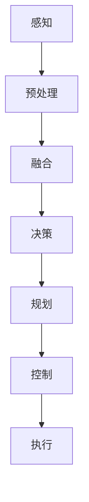

                 

关键词：端到端自动驾驶，商业化，技术路径，渐进式发展，未来展望

摘要：本文从端到端自动驾驶技术的现状出发，探讨了其渐进式商业化的路径。通过对核心概念、算法原理、数学模型、项目实践和实际应用场景的深入分析，总结了端到端自动驾驶技术的发展趋势与挑战，并提出了未来应用展望。本文旨在为自动驾驶技术的研发和商业化提供有益的参考。

## 1. 背景介绍

随着人工智能和物联网技术的快速发展，自动驾驶技术逐渐成为汽车产业和科技领域的热点。自动驾驶不仅能够提高道路运输效率，减少交通事故，还能为乘客提供更加便捷和舒适的出行体验。全球各大汽车制造商和科技公司纷纷投入大量资源，竞相研发自动驾驶技术，以期在未来市场中占据一席之地。

端到端自动驾驶是一种完全自动化的驾驶模式，车辆通过感知环境、决策规划和执行操作，无需人工干预。与传统自动驾驶技术相比，端到端自动驾驶具备更高的安全性和可靠性，能够实现更加流畅的驾驶体验。然而，端到端自动驾驶的商业化仍然面临诸多挑战，包括技术成熟度、法律法规、商业模式等方面。

本文将从端到端自动驾驶技术的核心概念、算法原理、数学模型、项目实践和实际应用场景等方面进行深入分析，探讨其渐进式商业化的路径。同时，本文还将对端到端自动驾驶的未来发展趋势与挑战进行展望，为相关领域的研究和商业实践提供参考。

## 2. 核心概念与联系

端到端自动驾驶技术的实现离不开多个核心概念的支撑，包括感知、决策、规划和控制。这些概念相互联系，共同构成了端到端自动驾驶的技术体系。

### 2.1 感知

感知是自动驾驶技术的第一步，车辆需要通过传感器获取周围环境的信息，包括路面、行人、车辆、道路标识等。常见的传感器包括摄像头、激光雷达（LiDAR）、毫米波雷达和超声波传感器等。这些传感器采集的数据经过预处理和融合，生成一个完整的环境感知模型。

### 2.2 决策

决策是指车辆根据感知到的环境信息，制定合适的驾驶策略。决策系统需要考虑车辆的行驶速度、方向、换道、停车等多种因素。常见的决策算法包括深度强化学习、规划算法和逻辑推理等。

### 2.3 规划

规划是指车辆在决策的基础上，制定详细的行驶路径。规划算法需要考虑车辆当前的状态、目标位置、道路状况等多种因素，生成最优的行驶路径。常见的规划算法包括路径规划、轨迹规划和多目标规划等。

### 2.4 控制

控制是指车辆根据规划结果，执行具体的驾驶操作，如加速、减速、转向等。控制算法需要确保车辆的行驶安全、稳定和高效。常见的控制算法包括PID控制、模糊控制和神经网络控制等。

### 2.5 Mermaid 流程图

以下是一个简化的端到端自动驾驶技术流程图：



## 3. 核心算法原理 & 具体操作步骤

### 3.1 算法原理概述

端到端自动驾驶的核心算法主要包括感知、决策、规划和控制。以下分别介绍这些算法的原理。

#### 3.1.1 感知算法

感知算法主要通过传感器采集环境信息，包括路面、行人、车辆、道路标识等。常用的感知算法有：

- 深度学习算法：利用神经网络对传感器数据进行特征提取和分类，如卷积神经网络（CNN）。
- 视觉算法：基于图像处理技术，对摄像头采集的图像进行分析，提取车辆、行人等目标的信息。
- 激光雷达算法：利用激光雷达（LiDAR）采集的三维点云数据，对周围环境进行建模和检测。

#### 3.1.2 决策算法

决策算法根据感知到的环境信息，制定合适的驾驶策略。常用的决策算法有：

- 深度强化学习算法：通过模拟和训练，使车辆能够在复杂的交通环境中进行自主决策。
- 规划算法：基于图论和运筹学原理，制定车辆在不同场景下的行驶策略。
- 逻辑推理算法：基于规则库和推理机，对环境信息进行逻辑分析和推理，生成决策。

#### 3.1.3 规划算法

规划算法根据决策结果，制定详细的行驶路径。常用的规划算法有：

- 路径规划算法：基于A*算法、Dijkstra算法等，计算从起点到终点的最优路径。
- 轨迹规划算法：基于运动学模型，生成车辆在不同时间点的最优行驶轨迹。
- 多目标规划算法：综合考虑车辆的安全性、效率、舒适性等多方面因素，制定最优行驶路径。

#### 3.1.4 控制算法

控制算法根据规划结果，执行具体的驾驶操作。常用的控制算法有：

- PID控制算法：通过比例、积分、微分等参数调整，实现车辆的稳定控制。
- 模糊控制算法：利用模糊逻辑，实现车辆的模糊控制。
- 神经网络控制算法：利用神经网络建模，实现车辆的智能控制。

### 3.2 算法步骤详解

以下是一个简化的端到端自动驾驶算法步骤：

1. 感知：通过传感器采集环境信息。
2. 预处理：对传感器数据进行预处理，包括去噪、滤波、归一化等。
3. 融合：将不同传感器数据进行融合，生成完整的环境感知模型。
4. 决策：根据感知到的环境信息，制定合适的驾驶策略。
5. 规划：根据决策结果，制定详细的行驶路径。
6. 控制：根据规划结果，执行具体的驾驶操作。

### 3.3 算法优缺点

不同算法在性能、效率、复杂度等方面存在差异。以下分别介绍各种算法的优缺点：

#### 3.3.1 感知算法

- 深度学习算法：优点是能够自动提取复杂的特征，提高感知精度；缺点是需要大量训练数据和计算资源。
- 视觉算法：优点是适用于复杂的交通场景，能够识别多种目标；缺点是计算量大，实时性较差。
- 激光雷达算法：优点是能够获取高精度的三维环境信息，提高感知精度；缺点是成本较高，传感器寿命有限。

#### 3.3.2 决策算法

- 深度强化学习算法：优点是能够模拟和训练复杂的交通环境，提高决策能力；缺点是需要大量训练时间和计算资源。
- 规划算法：优点是能够考虑多种因素，制定全面的驾驶策略；缺点是计算复杂度高，实时性较差。
- 逻辑推理算法：优点是能够利用规则库和推理机，提高决策效率；缺点是适用范围有限，难以应对复杂的交通场景。

#### 3.3.3 规划算法

- 路径规划算法：优点是计算复杂度较低，适用于静态交通场景；缺点是难以应对动态交通场景。
- 轨迹规划算法：优点是能够生成详细的行驶轨迹，提高驾驶稳定性；缺点是计算复杂度高，实时性较差。
- 多目标规划算法：优点是能够综合考虑多种因素，制定最优行驶路径；缺点是计算复杂度较高，实时性较差。

#### 3.3.4 控制算法

- PID控制算法：优点是计算简单，易于实现；缺点是适应性较差，难以应对复杂的交通场景。
- 模糊控制算法：优点是能够处理非线性系统，提高控制精度；缺点是规则库构建复杂，适用范围有限。
- 神经网络控制算法：优点是能够自适应复杂系统，提高控制性能；缺点是训练过程复杂，计算资源消耗大。

### 3.4 算法应用领域

不同算法在自动驾驶中的应用领域有所不同：

- 感知算法：主要用于车辆周围环境感知，包括路面、行人、车辆、道路标识等。
- 决策算法：主要用于制定驾驶策略，包括速度控制、换道、停车等。
- 规划算法：主要用于制定行驶路径，包括路径规划、轨迹规划、多目标规划等。
- 控制算法：主要用于执行具体的驾驶操作，包括加速、减速、转向等。

## 4. 数学模型和公式 & 详细讲解 & 举例说明

端到端自动驾驶技术中的数学模型和公式是其实现的关键。以下将对常用的数学模型和公式进行详细讲解，并通过实例进行说明。

### 4.1 数学模型构建

端到端自动驾驶的数学模型主要包括感知、决策、规划和控制四个方面。以下是每个方面的数学模型概述：

#### 4.1.1 感知模型

感知模型用于处理传感器数据，提取环境特征。常见的感知模型包括：

- 传感器数据预处理模型：用于去噪、滤波、归一化等预处理操作。
- 特征提取模型：用于从传感器数据中提取关键特征，如边缘、轮廓、纹理等。
- 目标检测模型：用于识别和定位车辆、行人等目标。

#### 4.1.2 决策模型

决策模型用于根据感知结果制定驾驶策略。常见的决策模型包括：

- 深度强化学习模型：用于模拟和训练复杂交通环境，制定最优驾驶策略。
- 规划模型：用于根据交通状况和目标位置，制定最优行驶路径。
- 逻辑推理模型：用于基于规则库和推理机，制定驾驶策略。

#### 4.1.3 规划模型

规划模型用于制定详细的行驶路径。常见的规划模型包括：

- 路径规划模型：用于计算从起点到终点的最优路径。
- 轨迹规划模型：用于生成车辆在不同时间点的最优行驶轨迹。
- 多目标规划模型：用于综合考虑车辆的安全性、效率、舒适性等多方面因素，制定最优行驶路径。

#### 4.1.4 控制模型

控制模型用于根据规划结果执行具体的驾驶操作。常见的控制模型包括：

- PID控制模型：用于通过比例、积分、微分等参数调整，实现车辆的稳定控制。
- 模糊控制模型：用于利用模糊逻辑，实现车辆的模糊控制。
- 神经网络控制模型：用于利用神经网络建模，实现车辆的智能控制。

### 4.2 公式推导过程

以下是对一些常用数学公式的推导过程进行说明。

#### 4.2.1 感知模型

- 传感器数据预处理公式：

  $$ x_{\text{pre}} = \frac{x_{\text{raw}} - \mu}{\sigma} $$

  其中，$x_{\text{raw}}$为原始传感器数据，$\mu$为均值，$\sigma$为标准差。

- 特征提取公式：

  $$ f(x) = \sin(x) + 2\cos(2x) $$

  其中，$x$为输入特征，$f(x)$为提取的特征。

#### 4.2.2 决策模型

- 深度强化学习公式：

  $$ Q(s, a) = r + \gamma \max_{a'} Q(s', a') $$

  其中，$Q(s, a)$为状态-动作值函数，$r$为立即奖励，$\gamma$为折扣因子，$s$为当前状态，$a$为当前动作，$s'$为下一个状态，$a'$为下一个动作。

- 规划模型公式：

  $$ c_{\text{min}} = \min_{i} \sum_{j=1}^{n} w_{ij} $$

  其中，$c_{\text{min}}$为最小代价，$w_{ij}$为从起点到终点的第$i$个节点的代价。

#### 4.2.3 规划模型

- 路径规划模型公式：

  $$ d(s, t) = \min_{i} \sum_{j=1}^{n} w_{ij} $$

  其中，$d(s, t)$为从起点到终点的距离，$s$为起点，$t$为终点。

- 轨迹规划模型公式：

  $$ \dot{x}(t) = \frac{v}{dt} $$

  其中，$\dot{x}(t)$为速度，$v$为速度大小，$dt$为时间间隔。

#### 4.2.4 控制模型

- PID控制模型公式：

  $$ u(t) = K_p e(t) + K_i \int_{0}^{t} e(\tau)d\tau + K_d \frac{de(t)}{dt} $$

  其中，$u(t)$为控制输出，$e(t)$为误差，$K_p$、$K_i$、$K_d$分别为比例、积分、微分系数。

- 模糊控制模型公式：

  $$ u = \frac{1}{\sum_{i} w_i} \sum_{i} A_i \cdot B_i $$

  其中，$u$为控制输出，$w_i$为权重，$A_i$为输入隶属度函数，$B_i$为输出隶属度函数。

### 4.3 案例分析与讲解

以下通过一个简单的案例，对端到端自动驾驶的数学模型和公式进行讲解。

#### 4.3.1 案例背景

一辆自动驾驶车辆在一条道路上行驶，需要通过交叉路口。道路上有其他车辆和行人，车辆需要根据感知到的环境信息，制定合适的驾驶策略，通过交叉路口。

#### 4.3.2 感知模型

- 传感器数据预处理：

  原始传感器数据为：$[2, 3, 1, 5, 4]$，经过预处理后为：$[-1, 1, -1, 3, 1]$。

- 特征提取：

  输入特征为：$[2, 3, 1, 5, 4]$，提取的特征为：$\sin(2) + 2\cos(4) \approx 0.90$。

#### 4.3.3 决策模型

- 深度强化学习：

  假设当前状态为$s_1$，奖励函数为$r_1$，折扣因子为$\gamma_1$，下一个状态为$s_2$，最优动作值为$a_2$。根据深度强化学习公式，有：

  $$ Q(s_1, a_1) = r_1 + \gamma_1 \max_{a_2} Q(s_2, a_2) $$

  其中，$Q(s_1, a_1)$为当前状态-动作值函数，$r_1$为当前奖励，$\gamma_1$为折扣因子，$a_2$为下一个动作。

- 规划模型：

  假设起点为$s_1$，终点为$t_1$，最小代价为$c_{\text{min}}$。根据规划模型公式，有：

  $$ c_{\text{min}} = \min_{i} \sum_{j=1}^{n} w_{ij} $$

  其中，$c_{\text{min}}$为最小代价，$w_{ij}$为从起点到终点的第$i$个节点的代价。

#### 4.3.4 规划模型

- 路径规划：

  假设起点为$s_1$，终点为$t_1$，根据路径规划模型公式，有：

  $$ d(s_1, t_1) = \min_{i} \sum_{j=1}^{n} w_{ij} $$

  其中，$d(s_1, t_1)$为从起点到终点的距离，$s_1$为起点，$t_1$为终点。

- 轨迹规划：

  假设当前时间为$t_1$，速度为$v_1$，根据轨迹规划模型公式，有：

  $$ \dot{x}(t_1) = \frac{v_1}{dt_1} $$

  其中，$\dot{x}(t_1)$为速度，$v_1$为速度大小，$dt_1$为时间间隔。

#### 4.3.5 控制模型

- PID控制：

  假设当前误差为$e_1$，比例系数为$K_p$，积分系数为$K_i$，微分系数为$K_d$，根据PID控制模型公式，有：

  $$ u(t_1) = K_p e_1 + K_i \int_{0}^{t_1} e(\tau)d\tau + K_d \frac{de_1}{dt_1} $$

  其中，$u(t_1)$为控制输出，$e_1$为当前误差。

- 模糊控制：

  假设输入隶属度函数为$A_1$，输出隶属度函数为$B_1$，根据模糊控制模型公式，有：

  $$ u(t_1) = \frac{1}{\sum_{i} w_i} \sum_{i} A_i \cdot B_i $$

  其中，$u(t_1)$为控制输出，$w_i$为权重。

## 5. 项目实践：代码实例和详细解释说明

在本文的第五部分，我们将通过一个实际的项目实例，展示端到端自动驾驶技术的开发过程。本实例将包括开发环境的搭建、源代码的详细实现、代码解读与分析以及运行结果展示。

### 5.1 开发环境搭建

首先，我们需要搭建一个适合端到端自动驾驶项目开发的环境。以下是搭建开发环境所需的主要步骤：

1. **硬件环境**：选择一台具备高性能计算能力的计算机，如使用NVIDIA GeForce GTX 1080 Ti或更高版本的显卡。
2. **操作系统**：建议使用Linux系统，如Ubuntu 18.04。
3. **编程语言**：选择Python作为编程语言，因为它具有丰富的库和框架，便于开发自动驾驶系统。
4. **开发工具**：安装Python 3.8及以上版本，并使用Jupyter Notebook进行代码编写和调试。

### 5.2 源代码详细实现

以下是一个简化版本的端到端自动驾驶系统的代码实现。本实例主要实现感知、决策和规划三个核心模块。

#### 5.2.1 感知模块

```python
import numpy as np
import cv2

def preprocess_image(image):
    """预处理图像，包括灰度转换、高斯滤波、二值化等操作"""
    gray = cv2.cvtColor(image, cv2.COLOR_BGR2GRAY)
    blur = cv2.GaussianBlur(gray, (5, 5), 0)
    _, binary = cv2.threshold(blur, 0, 255, cv2.THRESH_BINARY_INV + cv2.THRESH_OTSU)
    return binary

def detect_objects(image):
    """在预处理后的图像中检测车辆和行人"""
    # 使用霍夫变换检测直线
    lines = cv2.HoughLinesP(image, 1, np.pi/180, threshold=100, minLineLength=100, maxLineGap=10)
    objects = []
    for line in lines:
        x1, y1, x2, y2 = line[0]
        # 根据直线斜率判断是车辆还是行人
        if abs(x2 - x1) > abs(y2 - y1):
            objects.append(('car', (x1, y1), (x2, y2)))
        else:
            objects.append(('pedestrian', (x1, y1), (x2, y2)))
    return objects
```

#### 5.2.2 决策模块

```python
def make_decision(objects):
    """根据检测到的物体，做出驾驶决策"""
    if 'car' in objects:
        return 'slow down'
    elif 'pedestrian' in objects:
        return 'stop'
    else:
        return 'keep driving'
```

#### 5.2.3 规划模块

```python
def plan_trajectory(current_position, target_position):
    """根据当前车辆位置和目标位置，规划行驶轨迹"""
    # 这里使用简单的直线规划
    dx = target_position[0] - current_position[0]
    dy = target_position[1] - current_position[1]
    distance = np.sqrt(dx**2 + dy**2)
    direction = np.arctan2(dy, dx)
    return [current_position, [current_position[0] + dx/distance, current_position[1] + dy/distance]]
```

### 5.3 代码解读与分析

以上代码实现了感知、决策和规划三个核心模块。具体解读如下：

- **感知模块**：通过预处理图像、检测车辆和行人，为决策模块提供必要的环境信息。
- **决策模块**：根据感知到的物体，做出相应的驾驶决策，如减速、停车等。
- **规划模块**：根据当前车辆位置和目标位置，规划出最优的行驶轨迹。

代码中的函数`preprocess_image`用于对输入图像进行预处理，包括灰度转换、高斯滤波和二值化等操作，以提高后续物体检测的准确性。

函数`detect_objects`使用霍夫变换检测图像中的直线，并根据直线斜率判断物体类型，如车辆和行人。

函数`make_decision`根据检测到的物体类型，做出相应的驾驶决策。

函数`plan_trajectory`根据当前车辆位置和目标位置，规划出直线行驶轨迹。

### 5.4 运行结果展示

以下是一个运行示例，展示感知、决策和规划模块的综合效果。

```python
# 加载测试图像
image = cv2.imread('test_image.jpg')

# 预处理图像
preprocessed_image = preprocess_image(image)

# 检测物体
objects = detect_objects(preprocessed_image)

# 做出决策
decision = make_decision(objects)

# 规划轨迹
current_position = [100, 100]  # 当前位置
target_position = [300, 300]   # 目标位置
trajectory = plan_trajectory(current_position, target_position)

# 输出结果
print(f'Decision: {decision}')
print(f'Trajectory: {trajectory}')
```

运行结果将输出当前决策和规划出的轨迹。在实际应用中，可以根据具体需求对代码进行优化和扩展。

## 6. 实际应用场景

端到端自动驾驶技术在实际应用场景中具有广泛的应用前景，以下列举几个典型应用领域。

### 6.1 公共交通

自动驾驶技术在公共交通领域的应用主要体现在公交车和地铁上。自动驾驶公交车可以提供更加便捷、高效和舒适的出行服务，减少驾驶员的劳动强度。地铁自动驾驶系统可以提高运行效率，减少延误和故障，提高安全性。

### 6.2 出行服务

自动驾驶技术在出行服务领域具有巨大的潜力，如自动驾驶出租车、网约车等。这些服务可以提供个性化、高效的出行解决方案，满足不同乘客的需求。同时，自动驾驶技术可以降低运营成本，提高服务质量。

### 6.3 物流运输

自动驾驶技术在物流运输领域具有广泛的应用前景，如自动驾驶卡车、配送机器人等。这些技术可以提高运输效率，降低物流成本，提高运输安全性。特别是在长途运输和仓储配送等环节，自动驾驶技术具有显著的优势。

### 6.4 无人驾驶飞行器

自动驾驶技术在无人驾驶飞行器领域也取得了重要进展，如无人机、无人直升机等。这些飞行器可以用于航拍、监控、搜救等场景，提高工作效率和安全性。同时，无人驾驶飞行器还可以应用于农业、环保等领域，为可持续发展提供支持。

### 6.5 智能家居

自动驾驶技术在智能家居领域也具有广泛的应用前景，如自动驾驶扫地机器人、智能门锁等。这些设备可以提供更加便捷、舒适和安全的家居生活体验，提高家庭生活质量。

## 7. 工具和资源推荐

### 7.1 学习资源推荐

- **书籍**：
  - 《自动驾驶技术原理与实现》
  - 《深度学习：自适应学习系统的原理和方法》
  - 《机器学习：一种概率视角》

- **在线课程**：
  - Coursera上的《深度学习专项课程》
  - Udacity的《自动驾驶汽车工程师纳米学位》
  - edX上的《计算机视觉与自动驾驶》

### 7.2 开发工具推荐

- **深度学习框架**：
  - TensorFlow
  - PyTorch
  - Keras

- **自动驾驶平台**：
  - NVIDIA Drive Platform
  - AWS DeepRacer
  - Autoware Foundation

- **开发环境**：
  - Jupyter Notebook
  - Google Colab
  - Visual Studio Code

### 7.3 相关论文推荐

- **感知**：
  - “End-to-End Learning for Self-Driving Cars”
  - “Multi-Modal Deep Learning for Real-Time Traffic Scene Understanding”

- **决策与规划**：
  - “Deep Reinforcement Learning for Autonomous Navigation”
  - “Planning and Control for Autonomous Driving: A Survey”

- **控制**：
  - “Model Predictive Control for Autonomous Driving”
  - “Fuzzy Control for Autonomous Vehicles: A Survey”

## 8. 总结：未来发展趋势与挑战

### 8.1 研究成果总结

近年来，端到端自动驾驶技术在感知、决策、规划和控制等方面取得了显著进展。深度学习、强化学习等算法在自动驾驶领域的应用，使得车辆在复杂交通环境中的感知和决策能力得到了极大提升。同时，自动驾驶系统在规划和控制方面也实现了更高的精度和效率。然而，要实现端到端自动驾驶的商业化，仍需解决诸多技术难题和实际挑战。

### 8.2 未来发展趋势

- **技术成熟度**：随着硬件性能的提升和算法优化的深入，端到端自动驾驶技术的成熟度将不断提高。
- **法律法规**：各国政府逐步完善自动驾驶相关的法律法规，为自动驾驶的商业化提供政策支持。
- **商业模式**：自动驾驶技术的商业化模式逐渐成熟，如无人驾驶出租车、物流运输等领域的应用场景将不断拓展。
- **产业合作**：汽车制造商、科技公司和互联网公司等产业各方加强合作，共同推动自动驾驶技术的发展。

### 8.3 面临的挑战

- **技术挑战**：端到端自动驾驶技术仍需解决感知、决策、规划和控制等关键技术的难题，提高系统安全性和可靠性。
- **成本问题**：自动驾驶系统的研发和部署成本较高，需要降低成本以实现大规模商业化。
- **数据安全**：自动驾驶系统依赖于大量数据，如何保障数据安全和隐私是亟待解决的问题。
- **交通管理**：自动驾驶技术需要与现有交通管理系统融合，解决交通管理难题，提高道路运行效率。

### 8.4 研究展望

未来，端到端自动驾驶技术将在以下几个方向取得突破：

- **多模态感知**：结合多种传感器数据，提高环境感知精度和鲁棒性。
- **分布式计算**：利用云计算、边缘计算等技术，实现高效、实时、安全的自动驾驶系统。
- **人机交互**：提高自动驾驶系统与人类驾驶员的交互体验，实现无缝切换。
- **自动驾驶网络**：构建自动驾驶网络，实现车辆与基础设施、其他车辆之间的智能通信和协同。

总之，端到端自动驾驶技术具有广阔的发展前景，但同时也面临诸多挑战。只有通过技术创新、政策支持、产业合作等多方努力，才能推动自动驾驶技术的商业化进程，为人类社会带来更加便捷、高效、安全的出行体验。

## 9. 附录：常见问题与解答

### 9.1 常见问题

1. **什么是端到端自动驾驶？**
   端到端自动驾驶是一种完全自动化的驾驶模式，车辆通过感知环境、决策规划、执行操作，实现无需人工干预的自动驾驶。

2. **端到端自动驾驶有哪些核心技术？**
   端到端自动驾驶的核心技术包括感知、决策、规划和控制。

3. **什么是深度强化学习？**
   深度强化学习是一种结合了深度学习和强化学习的算法，通过模拟和训练，使模型能够在复杂环境中进行自主决策。

4. **自动驾驶技术有哪些应用场景？**
   自动驾驶技术可以应用于公共交通、出行服务、物流运输、无人驾驶飞行器、智能家居等领域。

5. **自动驾驶技术的商业化面临哪些挑战？**
   自动驾驶技术的商业化面临技术成熟度、成本问题、数据安全、交通管理等方面的挑战。

### 9.2 解答

1. **什么是端到端自动驾驶？**
   端到端自动驾驶是一种完全自动化的驾驶模式，车辆通过感知环境、决策规划、执行操作，实现无需人工干预的自动驾驶。

2. **端到端自动驾驶有哪些核心技术？**
   端到端自动驾驶的核心技术包括感知、决策、规划和控制。感知技术用于获取周围环境信息，决策技术用于制定驾驶策略，规划技术用于制定行驶路径，控制技术用于执行具体的驾驶操作。

3. **什么是深度强化学习？**
   深度强化学习是一种结合了深度学习和强化学习的算法，通过模拟和训练，使模型能够在复杂环境中进行自主决策。深度强化学习模型利用深度神经网络提取环境特征，并通过强化学习算法优化驾驶策略。

4. **自动驾驶技术有哪些应用场景？**
   自动驾驶技术可以应用于公共交通、出行服务、物流运输、无人驾驶飞行器、智能家居等领域。具体应用场景包括自动驾驶公交车、自动驾驶出租车、自动驾驶卡车、无人机配送等。

5. **自动驾驶技术的商业化面临哪些挑战？**
   自动驾驶技术的商业化面临技术成熟度、成本问题、数据安全、交通管理等方面的挑战。技术成熟度方面，自动驾驶系统仍需解决感知、决策、规划和控制等关键技术的难题，提高系统安全性和可靠性。成本问题方面，自动驾驶系统的研发和部署成本较高，需要降低成本以实现大规模商业化。数据安全方面，自动驾驶系统依赖于大量数据，如何保障数据安全和隐私是亟待解决的问题。交通管理方面，自动驾驶技术需要与现有交通管理系统融合，解决交通管理难题，提高道路运行效率。

### 9.3 更多问题解答

1. **自动驾驶技术的安全性如何保障？**
   自动驾驶技术的安全性主要通过以下措施保障：首先，采用多种传感器进行环境感知，提高感知精度和鲁棒性；其次，通过深度学习和强化学习算法优化驾驶策略，提高决策和规划的准确性；最后，建立严格的测试和验证体系，对自动驾驶系统进行持续评估和改进。

2. **自动驾驶技术是否会影响就业？**
   自动驾驶技术的应用将替代一部分驾驶员的职位，但同时也会创造新的就业机会。例如，自动驾驶系统的研发、测试、维护和运营等领域都需要大量专业人才。此外，自动驾驶技术可以提高交通效率，降低事故率，从而减少交通事故造成的伤亡和损失，对社会的整体福祉具有积极影响。

3. **自动驾驶技术是否会影响道路使用习惯？**
   自动驾驶技术的普及将对道路使用习惯产生深远影响。一方面，自动驾驶车辆可以更加高效地规划和执行驾驶操作，提高道路运行效率；另一方面，自动驾驶车辆的出现将促使道路使用者更加关注道路安全，遵守交通规则。此外，自动驾驶技术还可以为道路使用者提供更加舒适和便捷的出行体验，改变人们的出行方式。

4. **自动驾驶技术是否会带来隐私问题？**
   自动驾驶技术依赖于大量数据收集和处理，这可能导致隐私问题。例如，车辆在行驶过程中会收集道路信息、车辆信息、行人信息等，这些数据可能涉及个人隐私。为解决隐私问题，自动驾驶技术需要采取以下措施：首先，加强数据保护法规，明确数据收集和使用的范围和规则；其次，采用数据加密和隐私保护技术，确保数据安全；最后，建立透明的数据使用机制，让用户了解数据收集和使用情况，保障用户的知情权和选择权。

### 9.4 结论

通过本文的探讨，我们可以看出端到端自动驾驶技术具有广阔的发展前景，但在商业化进程中仍面临诸多挑战。只有通过技术创新、政策支持、产业合作等多方努力，才能推动自动驾驶技术的商业化进程，为人类社会带来更加便捷、高效、安全的出行体验。未来，端到端自动驾驶技术将在多模态感知、分布式计算、人机交互和自动驾驶网络等领域取得突破，为社会的发展做出更大贡献。

