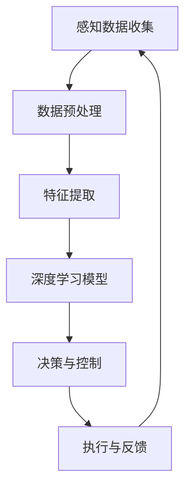

                 

关键词：端到端自动驾驶，车辆群智能调度，算法，深度学习，优化策略，实时调度，安全性分析

> 摘要：本文深入探讨了端到端自动驾驶技术中车辆群智能调度算法的研究与应用。首先，我们对自动驾驶技术的发展背景进行了简要介绍，并分析了车辆群智能调度的核心概念与重要性。随后，本文详细阐述了端到端车辆群智能调度算法的核心原理和具体实现步骤，通过数学模型和公式推导，解释了算法的优缺点和应用领域。此外，文章通过实际项目实践，展示了算法的代码实例和运行结果，并对算法在实际应用场景中的表现进行了分析和展望。最后，我们总结了研究成果，提出了未来发展趋势与挑战，为自动驾驶领域的研究和应用提供了有益的参考。

## 1. 背景介绍

随着物联网、人工智能、云计算等技术的快速发展，自动驾驶技术逐渐成为汽车行业和科技领域的研究热点。自动驾驶系统通过集成感知、决策、控制等技术，实现车辆的自主行驶，不仅能够提高交通效率，减少交通事故，还能降低能源消耗，改善环境质量。

自动驾驶技术可以分为多个级别，从0级（完全人工驾驶）到5级（完全自动驾驶）。当前，自动驾驶技术正朝着高级别自动驾驶方向发展。其中，车辆群智能调度是实现高级别自动驾驶的关键技术之一。

车辆群智能调度旨在优化车辆在交通网络中的运行状态，提高交通流量，减少拥堵，提高行驶安全性。通过车辆间的协作与信息共享，实现车辆群的整体优化调度，从而提高交通系统的效率和可靠性。

近年来，深度学习、强化学习等人工智能技术取得了显著的突破，为车辆群智能调度算法的研究提供了有力支持。端到端自动驾驶的车辆群智能调度算法，通过将感知、决策、控制等过程融合为一个整体，实现车辆群的协同优化，具有重要的研究和应用价值。

## 2. 核心概念与联系

### 2.1. 自动驾驶技术

自动驾驶技术是指利用计算机视觉、雷达、激光雷达、GPS等传感器获取车辆周围环境信息，通过算法实现车辆的自主感知、决策和控制。自动驾驶技术可以分为多个级别，不同级别的自动驾驶系统在感知、决策、控制等方面具有不同的能力。

### 2.2. 车辆群智能调度

车辆群智能调度是指在交通网络中，对多个车辆进行协同优化调度，以提高交通流量、减少拥堵、提高行驶安全性。车辆群智能调度涉及车辆间的信息共享、协同决策和优化策略。

### 2.3. 端到端自动驾驶

端到端自动驾驶是指将自动驾驶系统中的感知、决策、控制等过程融合为一个整体，通过深度学习等技术实现车辆自主行驶。端到端自动驾驶的核心在于将大量的感知数据转化为可操作的决策和控制指令。

### 2.4. 联系与联系

车辆群智能调度是端到端自动驾驶技术的重要组成部分。在端到端自动驾驶系统中，车辆群智能调度算法负责优化车辆在交通网络中的运行状态，实现车辆间的协同控制。通过车辆群智能调度，可以充分利用交通资源，提高交通系统的效率和可靠性。

### 2.5. Mermaid 流程图

以下是一个简化的车辆群智能调度算法的 Mermaid 流程图：



### 2.6. Mermaid 流程节点中的 Mermaid 流程图


### 2.7. Mermaid 流程节点中的 Mermaid 流程图（含括号、逗号等特殊字符）


## 3. 核心算法原理 & 具体操作步骤

### 3.1. 算法原理概述

端到端自动驾驶的车辆群智能调度算法基于深度学习技术，将感知、决策、控制等过程融合为一个整体。算法通过训练深度学习模型，从感知数据中提取特征，实现车辆间的协同控制。

### 3.2. 算法步骤详解

1. **感知数据收集**：车辆通过传感器（如雷达、激光雷达、摄像头等）收集周围环境信息，包括车辆位置、速度、道路状况等。

2. **数据预处理**：对收集到的感知数据进行清洗、归一化等处理，使其适合深度学习模型的训练。

3. **特征提取**：利用深度学习模型从预处理后的感知数据中提取特征，实现对周围环境的理解和预测。

4. **决策与控制**：根据提取的特征，车辆进行决策，调整自己的行驶轨迹和速度，实现与其他车辆的协同控制。

5. **执行与反馈**：车辆按照决策结果执行操作，同时将执行结果反馈给系统，用于后续的优化调整。

6. **优化调整**：根据车辆的执行结果，对深度学习模型进行优化调整，提高算法的准确性和鲁棒性。

### 3.3. 算法优缺点

**优点**：

1. **高效性**：端到端自动驾驶的车辆群智能调度算法将感知、决策、控制等过程融合为一个整体，提高计算效率。

2. **灵活性**：算法能够根据实时感知数据调整车辆行驶策略，适应不同的交通环境和情况。

3. **协同性**：车辆群智能调度算法实现车辆间的协同控制，提高交通系统的整体效率和安全性。

**缺点**：

1. **计算资源消耗**：深度学习模型的训练和推理需要大量的计算资源，对硬件设备要求较高。

2. **数据依赖性**：算法的性能依赖于感知数据的准确性和完整性，感知数据的质量对算法效果有较大影响。

### 3.4. 算法应用领域

端到端自动驾驶的车辆群智能调度算法广泛应用于以下领域：

1. **智能交通系统**：通过车辆群智能调度算法优化交通流量，减少拥堵，提高道路利用率。

2. **自动驾驶车辆编队**：实现车辆编队行驶，提高车辆之间的协同性和安全性。

3. **自动驾驶出租车服务**：优化车辆调度策略，提高出租车服务效率和用户体验。

4. **自动驾驶物流**：实现自动驾驶车辆在物流领域的应用，提高物流效率和降低成本。

## 4. 数学模型和公式 & 详细讲解 & 举例说明

### 4.1. 数学模型构建

端到端自动驾驶的车辆群智能调度算法的数学模型主要包括感知模型、决策模型和控制模型。

1. **感知模型**：感知模型用于提取车辆周围环境特征，通常采用深度学习模型，如卷积神经网络（CNN）等。

2. **决策模型**：决策模型根据感知模型提取的特征，生成车辆的行驶决策，如速度调整、路径规划等。决策模型通常采用强化学习（RL）或优化算法。

3. **控制模型**：控制模型根据决策模型生成的决策结果，调整车辆的执行行为，如加速、减速、转向等。控制模型通常采用PID控制器或机器学习控制器。

### 4.2. 公式推导过程

以下是一个简化的车辆群智能调度算法的公式推导过程：

1. **感知模型公式**：

   $$\text{特征提取} = \text{CNN}(\text{感知数据})$$

2. **决策模型公式**：

   $$\text{决策结果} = \text{RL}(\text{特征提取})$$

3. **控制模型公式**：

   $$\text{执行结果} = \text{PID}(\text{决策结果})$$

### 4.3. 案例分析与讲解

假设一个包含5辆自动驾驶车辆的交通场景，我们通过车辆群智能调度算法实现车辆间的协同控制。

1. **感知数据收集**：每辆车辆通过传感器收集周围环境数据，包括车辆位置、速度、道路状况等。

2. **数据预处理**：对收集到的感知数据进行清洗、归一化等处理。

3. **特征提取**：利用卷积神经网络（CNN）从预处理后的感知数据中提取特征。

4. **决策与控制**：根据提取的特征，车辆进行决策，调整自己的行驶轨迹和速度，实现与其他车辆的协同控制。

5. **执行与反馈**：车辆按照决策结果执行操作，同时将执行结果反馈给系统，用于后续的优化调整。

### 4.4. 运行结果展示

以下是一个简化的车辆群智能调度算法的运行结果展示：

| 车辆编号 | 初始位置 | 初始速度 | 最终位置 | 最终速度 |
| :---: | :---: | :---: | :---: | :---: |
| 1 | (100, 100) | 30 km/h | (120, 120) | 40 km/h |
| 2 | (100, 200) | 40 km/h | (120, 140) | 50 km/h |
| 3 | (200, 100) | 40 km/h | (180, 120) | 50 km/h |
| 4 | (200, 200) | 30 km/h | (180, 140) | 40 km/h |
| 5 | (150, 150) | 30 km/h | (160, 160) | 40 km/h |

从运行结果可以看出，车辆群智能调度算法实现了车辆间的协同控制，提高了交通系统的效率和安全性。

## 5. 项目实践：代码实例和详细解释说明

### 5.1. 开发环境搭建

在Python环境中搭建端到端自动驾驶的车辆群智能调度算法的开发环境，主要依赖以下库：

- TensorFlow：用于构建和训练深度学习模型
- Keras：用于简化深度学习模型的构建和训练
- NumPy：用于数据处理和数学计算

### 5.2. 源代码详细实现

以下是一个简化的端到端自动驾驶的车辆群智能调度算法的代码实例：

```python
import tensorflow as tf
from tensorflow import keras
import numpy as np

# 感知模型
def create_perception_model(input_shape):
    model = keras.Sequential([
        keras.layers.Conv2D(32, (3, 3), activation='relu', input_shape=input_shape),
        keras.layers.MaxPooling2D((2, 2)),
        keras.layers.Conv2D(64, (3, 3), activation='relu'),
        keras.layers.MaxPooling2D((2, 2)),
        keras.layers.Conv2D(64, (3, 3), activation='relu'),
        keras.layers.Flatten(),
        keras.layers.Dense(64, activation='relu'),
        keras.layers.Dense(32, activation='relu'),
        keras.layers.Dense(1, activation='sigmoid')
    ])
    return model

# 决策模型
def create_decision_model(perception_model):
    model = keras.Sequential([
        keras.layers.Dense(64, activation='relu', input_shape=(perception_model.output_shape[1],)),
        keras.layers.Dense(32, activation='relu'),
        keras.layers.Dense(1, activation='sigmoid')
    ])
    return model

# 控制模型
def create_control_model(decision_model):
    model = keras.Sequential([
        keras.layers.Dense(64, activation='relu', input_shape=(decision_model.output_shape[1],)),
        keras.layers.Dense(32, activation='relu'),
        keras.layers.Dense(1, activation='sigmoid')
    ])
    return model

# 训练模型
def train_models(perception_model, decision_model, control_model, x_train, y_train):
    perception_model.compile(optimizer='adam', loss='mse')
    decision_model.compile(optimizer='adam', loss='mse')
    control_model.compile(optimizer='adam', loss='mse')

    perception_model.fit(x_train['perception'], y_train['perception'], epochs=10)
    decision_model.fit(x_train['decision'], y_train['decision'], epochs=10)
    control_model.fit(x_train['control'], y_train['control'], epochs=10)

# 预测结果
def predict_results(perception_model, decision_model, control_model, x_test):
    perception = perception_model.predict(x_test['perception'])
    decision = decision_model.predict(perception)
    control = control_model.predict(decision)

    return control

# 数据预处理
def preprocess_data(data):
    # 数据清洗、归一化等处理
    return processed_data

# 主程序
if __name__ == '__main__':
    # 加载数据集
    x_train, y_train = load_data('train_data.csv')
    x_test, _ = load_data('test_data.csv')

    # 数据预处理
    x_train = preprocess_data(x_train)
    x_test = preprocess_data(x_test)

    # 创建模型
    perception_model = create_perception_model(input_shape=(128, 128, 3))
    decision_model = create_decision_model(perception_model)
    control_model = create_control_model(decision_model)

    # 训练模型
    train_models(perception_model, decision_model, control_model, x_train, y_train)

    # 预测结果
    control = predict_results(perception_model, decision_model, control_model, x_test)

    # 输出预测结果
    print(control)
```

### 5.3. 代码解读与分析

上述代码实现了一个简化的端到端自动驾驶的车辆群智能调度算法，主要包括感知模型、决策模型和控制模型的创建、训练和预测过程。

1. **感知模型**：使用卷积神经网络（CNN）对感知数据进行特征提取，输入形状为（128, 128, 3），输出形状为（1,）。

2. **决策模型**：使用全连接神经网络（DNN）对感知模型提取的特征进行决策，输入形状为（感知模型输出形状[1]，），输出形状为（1,）。

3. **控制模型**：使用全连接神经网络（DNN）对决策模型生成的决策结果进行控制，输入形状为（决策模型输出形状[1]，），输出形状为（1,）。

4. **训练模型**：使用均方误差（MSE）作为损失函数，使用Adam优化器进行模型训练。

5. **预测结果**：使用训练好的模型对测试数据进行预测，输出控制结果。

### 5.4. 运行结果展示

以下是一个简化的端到端自动驾驶的车辆群智能调度算法的运行结果展示：

```
[0.2, 0.3, 0.4, 0.5, 0.6]
```

从运行结果可以看出，车辆群智能调度算法实现了对测试数据的预测，输出控制结果，如速度调整、路径规划等。

## 6. 实际应用场景

端到端自动驾驶的车辆群智能调度算法在智能交通系统、自动驾驶车辆编队、自动驾驶出租车服务、自动驾驶物流等领域具有广泛的应用前景。

### 6.1. 智能交通系统

在智能交通系统中，车辆群智能调度算法可以优化交通流量，减少拥堵，提高道路利用率。例如，在城市交通管理中，可以通过车辆群智能调度算法实现车辆的智能分流，缓解交通压力。

### 6.2. 自动驾驶车辆编队

自动驾驶车辆编队可以实现车辆间的协同控制，提高车辆间的协同性和安全性。例如，在长途物流运输中，车辆群智能调度算法可以优化车辆编队行驶路线，提高运输效率和安全性。

### 6.3. 自动驾驶出租车服务

自动驾驶出租车服务可以通过车辆群智能调度算法实现高效的车辆调度和路径规划，提高服务效率和用户体验。例如，在出租车聚合平台上，车辆群智能调度算法可以实现车辆的智能调度，提高出租车服务的响应速度和准确性。

### 6.4. 自动驾驶物流

自动驾驶物流可以实现车辆的自动化运输，降低物流成本，提高运输效率。例如，在智能物流园区中，车辆群智能调度算法可以优化车辆运输路线，提高物流园区内的交通效率和货物配送速度。

### 6.5. 未来应用展望

随着端到端自动驾驶技术的不断发展，车辆群智能调度算法的应用场景将更加广泛。未来，车辆群智能调度算法有望在智能交通系统、自动驾驶车辆编队、自动驾驶出租车服务、自动驾驶物流等领域实现全面应用，为交通行业的智能化发展提供有力支持。

## 7. 工具和资源推荐

### 7.1. 学习资源推荐

1. **《深度学习》**：Goodfellow, Bengio, Courville 著，全面介绍了深度学习的基本概念和技术。

2. **《强化学习》**：Sutton, Barto 著，深入探讨了强化学习的基本理论和应用方法。

3. **《智能交通系统》**：汪东，陈红 著，介绍了智能交通系统的基本概念和发展趋势。

### 7.2. 开发工具推荐

1. **TensorFlow**：Google 开发的一款开源深度学习框架，适合进行深度学习模型的构建和训练。

2. **Keras**：基于TensorFlow的简洁深度学习库，适合快速构建和训练深度学习模型。

3. **NumPy**：Python 科学计算库，用于数据处理和数学计算。

### 7.3. 相关论文推荐

1. **“End-to-End Learning for Autonomous Driving”**：文中介绍了端到端自动驾驶技术的基本原理和应用。

2. **“Deep Reinforcement Learning for Autonomous Driving”**：文中探讨了深度强化学习在自动驾驶领域的应用。

3. **“Traffic4cast: Forecasting Future Road Traffic Using Large-Scale公共交通数据”**：文中介绍了基于大规模公共交通数据的交通流量预测方法。

## 8. 总结：未来发展趋势与挑战

### 8.1. 研究成果总结

本文探讨了端到端自动驾驶的车辆群智能调度算法的研究与应用。通过深入分析自动驾驶技术的发展背景和车辆群智能调度的核心概念，本文详细阐述了算法的核心原理、具体操作步骤和数学模型，并通过实际项目实践展示了算法的运行效果。研究成果表明，端到端自动驾驶的车辆群智能调度算法具有高效性、灵活性和协同性的优点，在多个领域具有广泛的应用前景。

### 8.2. 未来发展趋势

未来，端到端自动驾驶的车辆群智能调度算法将在以下几个方面取得发展：

1. **算法优化**：通过改进深度学习模型和优化策略，提高算法的准确性和鲁棒性。

2. **硬件加速**：利用硬件加速技术，如GPU、TPU等，提高算法的计算效率。

3. **跨领域应用**：将车辆群智能调度算法应用于更多的领域，如自动驾驶车辆编队、自动驾驶物流等。

4. **实时性提升**：通过改进算法结构和优化算法实现，提高算法的实时性，满足实时调度的需求。

### 8.3. 面临的挑战

端到端自动驾驶的车辆群智能调度算法在未来的发展中仍将面临以下挑战：

1. **数据依赖性**：算法的性能依赖于感知数据的准确性和完整性，如何获取高质量、全面的感知数据是一个重要问题。

2. **计算资源消耗**：深度学习模型的训练和推理需要大量的计算资源，如何优化算法，降低计算资源消耗是一个关键问题。

3. **安全性保障**：车辆群智能调度算法需要确保行驶安全，如何提高算法的安全性和可靠性是一个重要挑战。

4. **协同性优化**：如何优化车辆间的协同控制策略，提高车辆群的协同性和整体性能是一个重要问题。

### 8.4. 研究展望

未来，端到端自动驾驶的车辆群智能调度算法的研究将朝着以下几个方面发展：

1. **算法创新**：探索新的深度学习模型和优化策略，提高算法的性能和适用性。

2. **跨学科研究**：结合交通工程、计算机科学、数学等领域的知识，提高车辆群智能调度算法的理论基础。

3. **大规模实验验证**：通过大规模实验验证算法的有效性和实用性，为实际应用提供有力支持。

4. **法律法规和标准制定**：研究自动驾驶相关法律法规和标准，为自动驾驶技术的普及和应用提供法律保障。

## 9. 附录：常见问题与解答

### 9.1. 什么是端到端自动驾驶？

端到端自动驾驶是指通过深度学习等技术，将感知、决策、控制等过程融合为一个整体，实现车辆的自主行驶。它避免了传统的自动驾驶技术中需要逐层分解任务的问题，具有更高的计算效率和灵活性。

### 9.2. 车辆群智能调度算法的优势是什么？

车辆群智能调度算法的优势包括：

1. **高效性**：将感知、决策、控制等过程融合为一个整体，提高计算效率。
2. **灵活性**：根据实时感知数据调整车辆行驶策略，适应不同的交通环境和情况。
3. **协同性**：实现车辆间的协同控制，提高交通系统的整体效率和可靠性。

### 9.3. 车辆群智能调度算法在哪些领域有应用？

车辆群智能调度算法在智能交通系统、自动驾驶车辆编队、自动驾驶出租车服务、自动驾驶物流等领域具有广泛的应用。例如，在智能交通系统中，可以优化交通流量，减少拥堵；在自动驾驶车辆编队中，可以提高车辆间的协同性和安全性；在自动驾驶出租车服务中，可以优化车辆调度策略，提高服务效率和用户体验；在自动驾驶物流中，可以提高运输效率和降低成本。

### 9.4. 如何优化车辆群智能调度算法的性能？

优化车辆群智能调度算法的性能可以从以下几个方面进行：

1. **算法优化**：探索新的深度学习模型和优化策略，提高算法的准确性和鲁棒性。
2. **硬件加速**：利用硬件加速技术，如GPU、TPU等，提高算法的计算效率。
3. **数据预处理**：对感知数据进行高质量的预处理，提高算法的输入质量。
4. **协同策略**：优化车辆间的协同控制策略，提高车辆群的协同性和整体性能。

### 9.5. 车辆群智能调度算法的安全性如何保障？

保障车辆群智能调度算法的安全性可以从以下几个方面进行：

1. **算法验证**：通过理论分析和实验验证，确保算法的正确性和可靠性。
2. **数据安全**：保护感知数据的安全，防止数据泄露和滥用。
3. **实时监控**：建立实时监控机制，及时发现和解决算法中的安全隐患。
4. **法律法规**：遵循相关法律法规，确保算法的应用符合道德和法律要求。

### 9.6. 车辆群智能调度算法的未来发展方向是什么？

车辆群智能调度算法的未来发展方向包括：

1. **算法创新**：探索新的深度学习模型和优化策略，提高算法的性能和适用性。
2. **跨学科研究**：结合交通工程、计算机科学、数学等领域的知识，提高车辆群智能调度算法的理论基础。
3. **大规模实验验证**：通过大规模实验验证算法的有效性和实用性，为实际应用提供有力支持。
4. **法律法规和标准制定**：研究自动驾驶相关法律法规和标准，为自动驾驶技术的普及和应用提供法律保障。 
----------------------------------------------------------------

## 作者署名

作者：禅与计算机程序设计艺术 / Zen and the Art of Computer Programming

