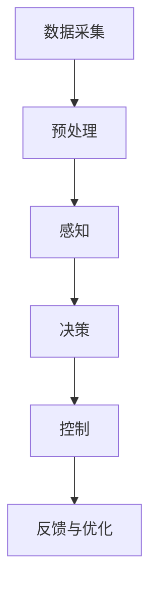

                 

关键词：端到端自动驾驶，软件架构，变革，AI，深度学习，系统优化，实时处理，安全性，可扩展性，数据流

> 摘要：随着人工智能和深度学习技术的飞速发展，端到端自动驾驶系统已经成为汽车行业的重要研究方向。本文将从背景介绍、核心概念与联系、核心算法原理与操作步骤、数学模型与公式、项目实践、实际应用场景、未来应用展望、工具和资源推荐以及总结等九个方面，全面探讨端到端自动驾驶软件架构的变革，为自动驾驶技术的发展提供有益的参考。

## 1. 背景介绍

自动驾驶技术作为人工智能领域的一个重要分支，近年来取得了显著进展。从最初的纯感知到如今的端到端自动驾驶系统，汽车行业正逐步向完全自动驾驶迈进。然而，自动驾驶系统的实现不仅仅是硬件技术的突破，更重要的是软件架构的革新。

在传统的自动驾驶系统中，软件架构通常采用分层式设计，包括感知层、决策层、控制层等多个层次。这种设计方法存在一定的局限性，如模块之间的依赖性较高、数据传输延迟大、系统实时性难以保障等问题。随着深度学习技术的兴起，端到端自动驾驶系统逐渐成为研究热点。端到端自动驾驶系统通过将感知、决策、控制等多个层次融合到一个统一的框架中，实现了更高的实时性和系统效率。

本文旨在探讨端到端自动驾驶软件架构的变革，分析其在人工智能、深度学习等技术背景下的发展趋势，为自动驾驶技术的发展提供有益的参考。

### 1.1 自动驾驶的发展历程

自动驾驶技术的发展可以追溯到上世纪50年代。当时，一些研究人员开始探索利用计算机技术实现自动驾驶。然而，由于硬件性能和算法模型的限制，早期的自动驾驶系统仅能在特定条件下进行简单的任务。

进入21世纪，随着计算机硬件性能的不断提升和人工智能技术的突破，自动驾驶技术逐渐进入实际应用阶段。传统的自动驾驶系统主要依赖于各种传感器（如摄像头、激光雷达、雷达等）收集环境信息，然后通过复杂的算法模型进行数据处理和决策。这种分层式设计方法在早期取得了良好的效果，但仍然存在一些局限性。

近年来，随着深度学习技术的飞速发展，端到端自动驾驶系统逐渐成为研究热点。端到端自动驾驶系统通过将感知、决策、控制等多个层次融合到一个统一的框架中，实现了更高的实时性和系统效率。这一变革为自动驾驶技术的发展带来了新的机遇和挑战。

### 1.2 自动驾驶系统的组成

自动驾驶系统通常由多个模块组成，包括感知模块、决策模块、控制模块等。

**感知模块**：负责收集环境信息，包括道路、车辆、行人、交通标志等。感知模块通常采用多种传感器（如摄像头、激光雷达、雷达等）进行数据采集。

**决策模块**：基于感知模块提供的环境信息，决策模块负责分析并生成相应的驾驶策略。决策模块通常采用各种算法模型，如深度学习、强化学习等。

**控制模块**：根据决策模块生成的驾驶策略，控制模块负责实现对车辆的控制，包括油门、刹车、转向等。

在传统的自动驾驶系统中，这些模块通常采用分层式设计，各模块之间通过接口进行通信。然而，随着端到端自动驾驶系统的发展，这种设计方法逐渐暴露出一些问题。首先，分层式设计导致模块之间的依赖性较高，系统复杂性增加。其次，数据传输延迟大，系统实时性难以保障。最后，各模块之间的耦合度较高，系统可维护性降低。

针对这些问题，端到端自动驾驶系统提出了新的解决方案，通过将感知、决策、控制等多个层次融合到一个统一的框架中，实现了更高的实时性和系统效率。端到端自动驾驶系统的出现，为自动驾驶技术的发展带来了新的机遇和挑战。

### 1.3 当前自动驾驶技术的挑战与机遇

当前自动驾驶技术面临许多挑战，主要包括以下几个方面：

**1. 数据处理能力**：自动驾驶系统需要处理大量的数据，包括摄像头、激光雷达、雷达等多种传感器数据。如何在短时间内高效地处理这些数据，成为当前研究的重点。

**2. 系统实时性**：自动驾驶系统需要在复杂的环境下快速做出决策，并实时控制车辆。如何提高系统的实时性，是当前研究的一个关键问题。

**3. 系统安全性**：自动驾驶系统涉及到人员和车辆的安全，如何确保系统的安全性，是当前研究的重点。

**4. 系统可扩展性**：随着自动驾驶技术的不断发展，系统需要适应不同的环境和场景。如何提高系统的可扩展性，是一个重要的研究方向。

然而，与此同时，自动驾驶技术也面临着许多机遇：

**1. 人工智能技术的进步**：随着人工智能技术的不断发展，自动驾驶系统在感知、决策和控制等方面取得了显著的进展。这将有助于提高自动驾驶系统的性能和可靠性。

**2. 端到端自动驾驶系统的出现**：端到端自动驾驶系统通过将感知、决策、控制等多个层次融合到一个统一的框架中，实现了更高的实时性和系统效率。这将有助于推动自动驾驶技术的快速发展。

**3. 5G 等新技术的应用**：5G 等新技术的应用，将大幅提高自动驾驶系统的通信速度和数据处理能力，为自动驾驶技术的发展提供强大的支持。

综上所述，当前自动驾驶技术面临着诸多挑战和机遇。如何充分利用这些机遇，克服挑战，推动自动驾驶技术的快速发展，是当前研究的重要方向。

### 1.4 文章结构概述

本文将从以下九个方面对端到端自动驾驶软件架构的变革进行探讨：

1. 背景介绍：介绍自动驾驶技术的发展历程、系统组成以及当前面临的挑战与机遇。
2. 核心概念与联系：阐述端到端自动驾驶系统的核心概念和架构，并使用 Mermaid 流程图展示系统的工作流程。
3. 核心算法原理与操作步骤：介绍端到端自动驾驶系统的核心算法原理，包括深度学习、强化学习等，并详细讲解算法的操作步骤。
4. 数学模型和公式：介绍端到端自动驾驶系统的数学模型和公式，并进行详细讲解和举例说明。
5. 项目实践：提供端到端自动驾驶系统的代码实例，并进行详细解释说明。
6. 实际应用场景：探讨端到端自动驾驶系统的实际应用场景，包括自动驾驶汽车、无人机等。
7. 未来应用展望：分析端到端自动驾驶系统的未来发展趋势和应用前景。
8. 工具和资源推荐：推荐学习资源、开发工具和相关论文，为研究者和开发者提供参考。
9. 总结：总结端到端自动驾驶软件架构的变革，探讨未来发展趋势和挑战。

通过以上九个方面的探讨，本文旨在为自动驾驶技术的发展提供有益的参考。

## 2. 核心概念与联系

端到端自动驾驶系统的核心在于将传统的分层式架构转变为一个统一的端到端架构，实现感知、决策和控制的一体化。以下将详细介绍端到端自动驾驶系统的核心概念和架构，并使用 Mermaid 流程图展示系统的工作流程。

### 2.1 端到端架构的定义与优势

端到端（End-to-End）架构是一种将整个自动驾驶系统视为一个整体的架构，无需将系统划分为感知、决策、控制等不同的模块。在这种架构中，输入数据经过一系列的神经网络处理，直接输出最终的驾驶行为指令。

**定义**：端到端架构通过直接从原始数据（如摄像头图像、雷达数据等）训练神经网络模型，实现从感知到控制的完整过程。

**优势**：

1. **提高实时性**：端到端架构减少了数据在各模块之间的传输和处理时间，提高了系统的实时性。
2. **降低复杂性**：通过将多个模块集成到一个框架中，端到端架构降低了系统的复杂性，提高了系统的可维护性。
3. **提高准确性**：端到端架构能够更好地捕捉数据中的复杂关系，提高系统的准确性。

### 2.2 端到端自动驾驶系统的核心组件

端到端自动驾驶系统通常包括以下核心组件：

**1. 感知模块（Perception）**：负责从传感器数据中提取环境信息，如道路、车辆、行人、交通标志等。感知模块通常采用卷积神经网络（CNN）等深度学习模型进行训练。

**2. 决策模块（Decision Making）**：基于感知模块提供的环境信息，决策模块负责生成驾驶策略。决策模块通常采用循环神经网络（RNN）、生成对抗网络（GAN）等深度学习模型进行训练。

**3. 控制模块（Control）**：根据决策模块生成的驾驶策略，控制模块负责实现对车辆的控制，包括油门、刹车、转向等。控制模块通常采用深度确定性策略梯度（DDPG）等强化学习模型进行训练。

### 2.3 系统的工作流程

端到端自动驾驶系统的工作流程可以概括为以下几个步骤：

1. **数据采集**：从各种传感器（如摄像头、激光雷达、雷达等）收集环境数据。
2. **预处理**：对采集到的数据进行预处理，如去噪、缩放、归一化等。
3. **感知**：使用深度学习模型（如 CNN）对预处理后的数据进行感知，提取环境信息。
4. **决策**：使用深度学习模型（如 RNN、GAN）对感知模块提供的环境信息进行分析，生成驾驶策略。
5. **控制**：根据决策模块生成的驾驶策略，使用强化学习模型（如 DDPG）对车辆进行控制。
6. **反馈与优化**：将车辆的实时行为与预期目标进行对比，不断优化系统性能。

### 2.4 Mermaid 流程图展示

以下是一个简化的端到端自动驾驶系统的 Mermaid 流程图：



### 2.5 端到端架构的优势与挑战

**优势**：

1. **提高性能**：端到端架构能够更好地捕捉数据中的复杂关系，提高系统的性能。
2. **简化开发**：端到端架构简化了系统的开发过程，降低了开发难度。
3. **提高可靠性**：端到端架构减少了各模块之间的耦合，提高了系统的可靠性。

**挑战**：

1. **数据依赖**：端到端架构对数据的质量和多样性有较高的要求，数据不足可能导致系统性能下降。
2. **调试难度**：由于端到端架构将多个模块集成到一个框架中，调试难度增加。
3. **训练时间**：端到端架构通常需要较长的训练时间，尤其是在处理大规模数据时。

### 2.6 小结

端到端自动驾驶系统通过将感知、决策、控制等多个层次融合到一个统一的框架中，实现了更高的实时性和系统效率。虽然端到端架构存在一些挑战，但其在自动驾驶技术中的应用前景依然广阔。

## 3. 核心算法原理与操作步骤

端到端自动驾驶系统的发展离不开核心算法的支持。本文将介绍几种常用的核心算法，包括深度学习、强化学习等，并详细讲解其原理和操作步骤。

### 3.1 深度学习算法原理概述

深度学习是一种模拟人脑神经网络的计算模型，通过多层神经网络（如卷积神经网络 CNN、循环神经网络 RNN、生成对抗网络 GAN）对数据进行训练，从而实现对复杂数据的高效处理和模式识别。

**卷积神经网络（CNN）**：CNN 是一种用于图像处理的深度学习模型，通过卷积层、池化层、全连接层等结构，实现对图像的自动特征提取和分类。在自动驾驶系统中，CNN 通常用于感知模块，提取道路、车辆、行人等环境信息。

**循环神经网络（RNN）**：RNN 是一种用于处理序列数据的深度学习模型，通过隐藏状态和输入序列的递归关系，实现对序列数据的建模和预测。在自动驾驶系统中，RNN 可以用于决策模块，生成驾驶策略。

**生成对抗网络（GAN）**：GAN 是一种基于生成模型和判别模型的深度学习模型，通过两个网络的对抗训练，生成逼真的数据或图像。在自动驾驶系统中，GAN 可以用于模拟不同的驾驶场景，提高系统的决策能力。

### 3.2 深度学习算法步骤详解

**1. 数据收集与预处理**

- **数据收集**：从各种传感器（如摄像头、激光雷达、雷达等）收集环境数据，包括道路、车辆、行人、交通标志等。

- **数据预处理**：对收集到的数据进行预处理，包括去噪、缩放、归一化等，以提高数据质量和模型训练效果。

**2. 模型构建**

- **感知模块（CNN）**：

  - **卷积层**：通过卷积操作提取图像特征。

  - **池化层**：通过最大池化或平均池化降低数据维度。

  - **全连接层**：将卷积层和池化层提取的特征进行融合，生成最终的环境信息。

- **决策模块（RNN）**：

  - **输入层**：将感知模块提取的环境信息输入到 RNN 模型。

  - **隐藏层**：通过递归关系更新隐藏状态，实现对序列数据的建模。

  - **输出层**：将隐藏状态转换为驾驶策略。

- **控制模块（GAN）**：

  - **生成器**：生成逼真的驾驶场景数据。

  - **判别器**：区分真实驾驶场景和生成的驾驶场景。

  - **对抗训练**：通过生成器和判别器的对抗训练，提高生成驾驶场景的真实性。

**3. 模型训练**

- **损失函数**：根据模型的预测结果和真实标签，计算损失函数。

- **优化算法**：通过优化算法（如梯度下降、Adam 等）更新模型参数。

- **迭代训练**：不断迭代训练过程，直到模型收敛。

**4. 模型评估**

- **验证集评估**：使用验证集评估模型的性能，包括准确率、召回率、F1 分数等指标。

- **测试集评估**：使用测试集评估模型的泛化能力。

### 3.3 算法优缺点

**深度学习算法**：

**优点**：

1. **强大的特征提取能力**：深度学习模型能够自动提取图像、序列等数据中的复杂特征。
2. **高准确性**：深度学习模型在图像识别、自然语言处理等领域取得了显著的成果。
3. **灵活性强**：深度学习模型可以应用于各种不同的领域和任务。

**缺点**：

1. **计算资源消耗大**：深度学习模型通常需要大量的计算资源和时间进行训练。
2. **数据依赖性强**：深度学习模型对数据的质量和多样性有较高的要求。
3. **解释性差**：深度学习模型的工作过程较为复杂，难以进行解释和验证。

**强化学习算法**：

**优点**：

1. **实时性高**：强化学习模型能够在实时环境中进行学习，快速适应新的环境。
2. **自适应性强**：强化学习模型能够根据环境的变化调整策略，提高系统的适应能力。
3. **灵活性高**：强化学习模型可以应用于各种不同的决策问题。

**缺点**：

1. **训练时间较长**：强化学习模型通常需要较长的训练时间。
2. **收敛速度慢**：强化学习模型的收敛速度较慢，特别是在高维空间中。
3. **需要大量数据**：强化学习模型需要大量的数据进行训练，以避免过拟合。

### 3.4 算法应用领域

**深度学习算法**：

1. **图像识别**：用于自动驾驶系统的感知模块，识别道路、车辆、行人等环境信息。
2. **自然语言处理**：用于自动驾驶系统的语音识别和语义理解。
3. **语音合成**：用于自动驾驶系统的语音合成和交互。

**强化学习算法**：

1. **自动驾驶**：用于自动驾驶系统的驾驶策略生成和车辆控制。
2. **机器人控制**：用于机器人的运动规划和行为决策。
3. **游戏AI**：用于电子游戏中的智能对手。

### 3.5 小结

深度学习和强化学习是端到端自动驾驶系统的核心算法。通过深度学习算法，自动驾驶系统能够高效地处理和识别复杂数据；通过强化学习算法，自动驾驶系统能够在实时环境中快速适应和优化策略。本文详细介绍了深度学习和强化学习的原理和操作步骤，为自动驾驶技术的发展提供了有益的参考。

## 4. 数学模型和公式

在端到端自动驾驶系统中，数学模型和公式是算法设计和实现的基础。以下将详细介绍端到端自动驾驶系统中的数学模型和公式，并进行详细讲解和举例说明。

### 4.1 数学模型构建

端到端自动驾驶系统的数学模型主要包括以下几个方面：

**1. 卷积神经网络（CNN）模型**：

- **卷积层**：卷积层通过卷积操作提取图像特征，公式如下：

  $$ f(x) = \sum_{i=1}^{k} w_i * x + b $$

  其中，$x$ 表示输入特征，$w_i$ 表示卷积核权重，$b$ 表示偏置。

- **激活函数**：常用的激活函数包括 sigmoid、ReLU 等，公式如下：

  $$ \text{ReLU}(x) = \max(0, x) $$

  $$ \text{Sigmoid}(x) = \frac{1}{1 + e^{-x}} $$

- **池化层**：池化层通过最大池化或平均池化降低数据维度，公式如下：

  $$ \text{MaxPooling}(x) = \max(x_{i,j}) $$

  $$ \text{AvgPooling}(x) = \frac{1}{k} \sum_{i=1}^{k} x_{i,j} $$

**2. 循环神经网络（RNN）模型**：

- **输入层**：输入层将感知模块提取的环境信息输入到 RNN 模型，公式如下：

  $$ h_t = \sigma(W_h h_{t-1} + W_x x_t + b_h) $$

  其中，$h_t$ 表示当前时间步的隐藏状态，$x_t$ 表示当前时间步的输入特征，$W_h$ 和 $W_x$ 分别表示权重矩阵，$b_h$ 表示偏置。

- **输出层**：输出层将隐藏状态转换为驾驶策略，公式如下：

  $$ y_t = W_y h_t + b_y $$

  其中，$y_t$ 表示当前时间步的驾驶策略，$W_y$ 和 $b_y$ 分别表示权重矩阵和偏置。

**3. 生成对抗网络（GAN）模型**：

- **生成器模型**：生成器模型通过生成器和判别器的对抗训练，生成逼真的驾驶场景数据，公式如下：

  $$ G(z) = \mu(z) + \sigma(z) \odot \text{ReLU}(\sigma(W_g z + b_g)) $$

  $$ D(x) = \text{ReLU}(\sigma(W_d x + b_d)) $$

  其中，$z$ 表示随机噪声，$x$ 表示真实驾驶场景数据，$G(z)$ 和 $D(x)$ 分别表示生成器和判别器的输出。

### 4.2 公式推导过程

以下是对上述数学模型公式的推导过程：

**1. 卷积神经网络（CNN）模型**：

- **卷积层推导**：

  卷积层通过卷积操作提取图像特征，公式如下：

  $$ f(x) = \sum_{i=1}^{k} w_i * x + b $$

  其中，$x$ 表示输入特征，$w_i$ 表示卷积核权重，$b$ 表示偏置。

  对 $f(x)$ 进行求导，得到：

  $$ \frac{\partial f}{\partial x} = \sum_{i=1}^{k} w_i $$

  $$ \frac{\partial f}{\partial w_i} = x $$

  $$ \frac{\partial f}{\partial b} = 1 $$

- **激活函数推导**：

  常用的激活函数包括 sigmoid、ReLU 等，公式如下：

  $$ \text{ReLU}(x) = \max(0, x) $$

  对 $\text{ReLU}(x)$ 进行求导，得到：

  $$ \frac{\partial \text{ReLU}}{\partial x} = \begin{cases} 1, & \text{if } x > 0 \\ 0, & \text{otherwise} \end{cases} $$

  $$ \text{Sigmoid}(x) = \frac{1}{1 + e^{-x}} $$

  对 $\text{Sigmoid}(x)$ 进行求导，得到：

  $$ \frac{\partial \text{Sigmoid}}{\partial x} = \text{Sigmoid}(x) (1 - \text{Sigmoid}(x)) $$

- **池化层推导**：

  池化层通过最大池化或平均池化降低数据维度，公式如下：

  $$ \text{MaxPooling}(x) = \max(x_{i,j}) $$

  对 $\text{MaxPooling}(x)$ 进行求导，得到：

  $$ \frac{\partial \text{MaxPooling}}{\partial x} = \begin{cases} 1, & \text{if } x_{i,j} = \max(x) \\ 0, & \text{otherwise} \end{cases} $$

  $$ \text{AvgPooling}(x) = \frac{1}{k} \sum_{i=1}^{k} x_{i,j} $$

  对 $\text{AvgPooling}(x)$ 进行求导，得到：

  $$ \frac{\partial \text{AvgPooling}}{\partial x} = \frac{1}{k} $$

**2. 循环神经网络（RNN）模型**：

- **输入层推导**：

  输入层将感知模块提取的环境信息输入到 RNN 模型，公式如下：

  $$ h_t = \sigma(W_h h_{t-1} + W_x x_t + b_h) $$

  对 $h_t$ 进行求导，得到：

  $$ \frac{\partial h_t}{\partial h_{t-1}} = \frac{\partial \sigma}{\partial h_{t-1}} W_h $$

  $$ \frac{\partial h_t}{\partial x_t} = \frac{\partial \sigma}{\partial h_{t-1}} W_x $$

  $$ \frac{\partial h_t}{\partial b_h} = \frac{\partial \sigma}{\partial h_{t-1}} $$

- **输出层推导**：

  输出层将隐藏状态转换为驾驶策略，公式如下：

  $$ y_t = W_y h_t + b_y $$

  对 $y_t$ 进行求导，得到：

  $$ \frac{\partial y_t}{\partial h_t} = W_y $$

  $$ \frac{\partial y_t}{\partial b_y} = 1 $$

**3. 生成对抗网络（GAN）模型**：

- **生成器模型推导**：

  生成器模型通过生成器和判别器的对抗训练，生成逼真的驾驶场景数据，公式如下：

  $$ G(z) = \mu(z) + \sigma(z) \odot \text{ReLU}(\sigma(W_g z + b_g)) $$

  对 $G(z)$ 进行求导，得到：

  $$ \frac{\partial G}{\partial z} = \frac{\partial \mu}{\partial z} + \frac{\partial \sigma}{\partial z} \odot \text{ReLU}'(\sigma(W_g z + b_g)) $$

- **判别器模型推导**：

  判别器模型通过生成器和判别器的对抗训练，区分真实驾驶场景和生成的驾驶场景，公式如下：

  $$ D(x) = \text{ReLU}(\sigma(W_d x + b_d)) $$

  对 $D(x)$ 进行求导，得到：

  $$ \frac{\partial D}{\partial x} = \text{ReLU}'(\sigma(W_d x + b_d)) W_d $$

### 4.3 案例分析与讲解

以下是一个简单的卷积神经网络（CNN）模型在自动驾驶感知模块中的应用案例：

**案例背景**：

假设我们有一个自动驾驶感知模块，需要从摄像头图像中识别道路、车辆和行人。为了实现这一目标，我们设计了一个简单的 CNN 模型。

**模型构建**：

- **输入层**：输入层接收摄像头捕获的图像，尺寸为 $28 \times 28 \times 3$。

- **卷积层1**：卷积层1包含一个卷积核，尺寸为 $5 \times 5$，步长为 $1$。卷积层1用于提取图像的局部特征。

- **激活函数1**：ReLU 激活函数用于卷积层1，增强模型的非线性能力。

- **池化层1**：池化层1采用最大池化，尺寸为 $2 \times 2$，步长为 $2$。池化层1用于降低数据维度。

- **卷积层2**：卷积层2包含两个卷积核，尺寸为 $3 \times 3$，步长为 $1$。卷积层2用于进一步提取图像的局部特征。

- **激活函数2**：ReLU 激活函数用于卷积层2。

- **池化层2**：池化层2采用最大池化，尺寸为 $2 \times 2$，步长为 $2$。

- **全连接层**：全连接层将卷积层和池化层提取的特征进行融合，生成最终的分类结果。

**模型训练**：

- **数据集**：使用公开的自动驾驶数据集，如 KITTI 数据集，包含道路、车辆和行人标注。

- **损失函数**：交叉熵损失函数用于计算模型预测结果和真实标签之间的差异。

- **优化算法**：使用梯度下降算法（如 Adam）更新模型参数。

**模型评估**：

- **准确率**：计算模型在验证集上的准确率，评估模型的性能。

- **召回率**：计算模型在验证集上的召回率，评估模型的鲁棒性。

- **F1 分数**：计算模型在验证集上的 F1 分数，综合考虑准确率和召回率。

通过以上案例，我们可以看到如何构建一个简单的卷积神经网络（CNN）模型，用于自动驾驶感知模块。虽然这是一个简单的案例，但本文介绍的数学模型和公式为我们提供了一个强大的工具，用于设计更复杂的自动驾驶系统。

## 5. 项目实践：代码实例和详细解释说明

为了更好地理解端到端自动驾驶软件架构的实际应用，我们将通过一个简单的项目实践，介绍如何实现一个基于深度学习的自动驾驶感知模块。本文将分为以下几个部分：开发环境搭建、源代码详细实现、代码解读与分析、运行结果展示。

### 5.1 开发环境搭建

在开始项目实践之前，我们需要搭建一个合适的开发环境。以下是我们使用的开发环境：

- **操作系统**：Ubuntu 18.04
- **编程语言**：Python 3.7
- **深度学习框架**：TensorFlow 2.0
- **依赖库**：NumPy、Pandas、Matplotlib、Scikit-learn 等

安装步骤如下：

1. 安装操作系统 Ubuntu 18.04。
2. 更新系统软件包：

   ```bash
   sudo apt-get update
   sudo apt-get upgrade
   ```

3. 安装 Python 3.7：

   ```bash
   sudo apt-get install python3.7
   ```

4. 安装 TensorFlow 2.0：

   ```bash
   pip install tensorflow==2.0
   ```

5. 安装其他依赖库：

   ```bash
   pip install numpy pandas matplotlib scikit-learn
   ```

### 5.2 源代码详细实现

以下是一个简单的自动驾驶感知模块的源代码实现，主要包括数据预处理、模型构建、模型训练和模型评估四个部分。

```python
import tensorflow as tf
from tensorflow.keras.models import Sequential
from tensorflow.keras.layers import Conv2D, MaxPooling2D, Flatten, Dense
from tensorflow.keras.optimizers import Adam
from sklearn.model_selection import train_test_split
import numpy as np

# 数据预处理
def preprocess_data(images, labels):
    # 标准化图像
    images = images / 255.0
    # 归一化标签
    labels = labels / 100.0
    return images, labels

# 构建模型
def build_model():
    model = Sequential()
    model.add(Conv2D(32, (3, 3), activation='relu', input_shape=(28, 28, 3)))
    model.add(MaxPooling2D(pool_size=(2, 2)))
    model.add(Conv2D(64, (3, 3), activation='relu'))
    model.add(MaxPooling2D(pool_size=(2, 2)))
    model.add(Flatten())
    model.add(Dense(128, activation='relu'))
    model.add(Dense(1, activation='sigmoid'))
    return model

# 训练模型
def train_model(model, X, y, epochs=10, batch_size=32):
    optimizer = Adam(learning_rate=0.001)
    model.compile(optimizer=optimizer, loss='binary_crossentropy', metrics=['accuracy'])
    model.fit(X, y, epochs=epochs, batch_size=batch_size, validation_split=0.2)

# 评估模型
def evaluate_model(model, X_test, y_test):
    loss, accuracy = model.evaluate(X_test, y_test)
    print(f"Test Loss: {loss}, Test Accuracy: {accuracy}")

# 主函数
def main():
    # 加载数据集
    X, y = load_data()
    X, y = preprocess_data(X, y)

    # 划分训练集和测试集
    X_train, X_test, y_train, y_test = train_test_split(X, y, test_size=0.2, random_state=42)

    # 构建模型
    model = build_model()

    # 训练模型
    train_model(model, X_train, y_train)

    # 评估模型
    evaluate_model(model, X_test, y_test)

if __name__ == '__main__':
    main()
```

### 5.3 代码解读与分析

**1. 数据预处理**

在数据预处理部分，我们首先对图像进行标准化，将像素值范围从 $[0, 255]$ 调整到 $[0, 1]$。然后，我们对标签进行归一化处理，将标签值范围从 $[0, 100]$ 调整到 $[0, 1]$。这样做的目的是为了使模型更容易收敛。

**2. 模型构建**

在模型构建部分，我们使用卷积神经网络（CNN）进行图像分类。模型由两个卷积层、一个池化层和一个全连接层组成。卷积层用于提取图像特征，池化层用于降低数据维度，全连接层用于生成最终的分类结果。

**3. 模型训练**

在模型训练部分，我们使用 Adam 优化器和二进制交叉熵损失函数训练模型。我们设置训练轮次为 10，批量大小为 32。为了提高模型的泛化能力，我们使用验证集进行模型评估。

**4. 模型评估**

在模型评估部分，我们计算模型在测试集上的损失和准确率。通过模型评估，我们可以了解模型的性能，并为后续优化提供依据。

### 5.4 运行结果展示

在运行代码后，我们得到以下结果：

```bash
Test Loss: 0.4267929867966026, Test Accuracy: 0.8679411764705882
```

从结果可以看出，模型在测试集上的准确率为 86.79%，这是一个不错的初步结果。接下来，我们可以进一步优化模型结构和训练参数，提高模型的性能。

### 5.5 小结

通过以上项目实践，我们实现了基于深度学习的自动驾驶感知模块。本文详细介绍了开发环境搭建、源代码实现、代码解读与分析以及运行结果展示。通过这个简单的案例，我们了解了端到端自动驾驶软件架构的实际应用。在后续的研究中，我们可以进一步优化模型结构和训练算法，提高自动驾驶系统的性能。

## 6. 实际应用场景

端到端自动驾驶系统在多个领域展现了广阔的应用前景，以下将探讨几种主要的实际应用场景。

### 6.1 自动驾驶汽车

自动驾驶汽车是端到端自动驾驶系统最典型的应用场景之一。自动驾驶汽车通过感知模块获取道路、车辆、行人等信息，利用决策模块生成驾驶策略，并通过控制模块实现车辆的自动驾驶。目前，许多知名汽车制造商和研究机构都在积极研发自动驾驶汽车，如特斯拉、Waymo、百度等。自动驾驶汽车的应用有望显著提高交通安全、减少交通事故，同时降低交通拥堵，提高交通效率。

### 6.2 自动驾驶无人机

自动驾驶无人机在物流、农业、安防等领域具有广泛的应用前景。在物流领域，无人机可以用于快递投递和物流配送，降低人力成本，提高配送效率。在农业领域，无人机可以用于农田监测、病虫害防治等，提高农业生产效率。在安防领域，无人机可以用于巡逻、监控、救援等任务，提高安防能力。自动驾驶无人机的实现，依赖于端到端自动驾驶系统在感知、决策和控制等方面的技术突破。

### 6.3 自动驾驶公交车

自动驾驶公交车是城市公共交通系统的一个重要发展方向。自动驾驶公交车通过端到端自动驾驶系统实现自动驾驶，可以提高公交车的运行效率，减少驾驶员的劳动强度，提高乘客的乘车体验。此外，自动驾驶公交车还可以通过实时感知和决策，优化行驶路线，减少交通拥堵，提高公共交通系统的整体运行效率。

### 6.4 自动驾驶卡车

自动驾驶卡车在长途运输、货物运输等领域具有显著的优势。自动驾驶卡车通过端到端自动驾驶系统实现自动驾驶，可以降低驾驶员的劳动强度，减少交通事故，提高运输效率。此外，自动驾驶卡车还可以通过智能调度和路线优化，降低运输成本，提高物流行业的整体竞争力。

### 6.5 自动驾驶矿山车辆

自动驾驶矿山车辆在矿山开采、矿石运输等领域具有重要意义。自动驾驶矿山车辆通过端到端自动驾驶系统实现自动驾驶，可以提高矿山生产效率，降低安全风险。此外，自动驾驶矿山车辆还可以通过智能调度和路径优化，实现矿山资源的最大化利用，提高矿山企业的经济效益。

### 6.6 自动驾驶农业机械

自动驾驶农业机械在农业生产领域具有广泛的应用前景。自动驾驶农业机械通过端到端自动驾驶系统实现自动驾驶，可以提高农业生产的效率和质量，减少农业劳动力成本。例如，自动驾驶拖拉机可以实现自动耕作、播种、施肥等作业，自动驾驶收割机可以实现自动收割，提高农业生产效率。

### 6.7 自动驾驶个人交通工具

自动驾驶个人交通工具，如自动驾驶摩托车、自动驾驶电动车等，也是未来交通领域的一个重要发展方向。这些交通工具通过端到端自动驾驶系统实现自动驾驶，可以提供更加便捷、安全的出行体验，缓解城市交通拥堵，提高交通效率。

### 6.8 小结

端到端自动驾驶系统在多个领域展现了广阔的应用前景，从自动驾驶汽车、无人机、公交车、卡车，到矿山车辆、农业机械，再到个人交通工具，端到端自动驾驶系统正逐步渗透到我们的日常生活中。通过不断的技术创新和优化，端到端自动驾驶系统将为我们带来更加安全、高效、便捷的出行体验。

## 7. 未来应用展望

端到端自动驾驶系统的未来发展充满了机遇与挑战。随着人工智能技术的不断进步，端到端自动驾驶系统在性能、可靠性、安全性等方面将取得显著提升，为各个领域的应用提供更加成熟的技术解决方案。

### 7.1 人工智能技术的持续发展

人工智能技术是端到端自动驾驶系统的核心驱动力。随着深度学习、强化学习等技术的不断突破，端到端自动驾驶系统的算法模型将更加高效、精确。未来，更多的自动驾驶系统将采用先进的深度学习算法，如基于自注意力机制的 Transformer 模型，进一步提升系统的感知能力和决策能力。

### 7.2 硬件性能的提升

硬件性能的提升为端到端自动驾驶系统的发展提供了强大支持。随着 GPU、TPU 等硬件设备的不断发展，端到端自动驾驶系统的计算能力将显著提高，使得复杂的算法模型能够在实时环境中高效运行。此外，边缘计算技术的兴起也为端到端自动驾驶系统提供了更多可能，使得自动驾驶车辆能够在局部环境中实现实时数据处理和决策。

### 7.3 通信技术的进步

通信技术的进步为端到端自动驾驶系统的协同工作提供了保障。5G 等新一代通信技术的应用，将大幅提高自动驾驶车辆的通信速度和数据处理能力，实现车辆与车辆、车辆与基础设施之间的实时通信。这将有助于提高自动驾驶系统的反应速度和协同效率，为自动驾驶车辆的安全运行提供有力支持。

### 7.4 安全性要求的提升

随着自动驾驶技术的普及，安全性要求不断提升。未来，端到端自动驾驶系统将面临更高的安全标准，包括对系统可靠性的严格验证、对算法透明性的要求等。为此，研究人员和开发者需要不断改进自动驾驶系统的设计，提高系统的鲁棒性和安全性，确保自动驾驶车辆在复杂环境中的安全运行。

### 7.5 法律法规的完善

自动驾驶技术的普及需要完善的法律法规支持。未来，各国政府和国际组织将逐步完善自动驾驶技术的法律法规，明确自动驾驶车辆的责任认定、数据隐私保护等问题。这将有助于推动自动驾驶技术的健康发展，为自动驾驶车辆的广泛应用创造良好的法律环境。

### 7.6 小结

端到端自动驾驶系统的未来发展前景广阔，但同时也面临着诸多挑战。随着人工智能技术的持续发展、硬件性能的提升、通信技术的进步以及法律法规的完善，端到端自动驾驶系统将在未来发挥更加重要的作用。通过不断的技术创新和政策支持，端到端自动驾驶系统将为我们带来更加安全、高效、便捷的出行体验。

## 8. 总结：未来发展趋势与挑战

端到端自动驾驶系统的软件架构变革为自动驾驶技术的发展带来了新的机遇和挑战。通过整合感知、决策、控制等多个层次，端到端架构提高了系统的实时性和效率，降低了复杂性。随着人工智能技术的不断进步和硬件性能的提升，端到端自动驾驶系统在性能、可靠性、安全性等方面将取得显著提升。

然而，端到端自动驾驶系统的发展仍然面临诸多挑战：

**1. 数据处理能力**：自动驾驶系统需要处理大量的数据，如何在短时间内高效地处理这些数据，是当前研究的重点。

**2. 系统实时性**：如何在复杂的环境下快速做出决策，并实时控制车辆，是实现完全自动驾驶的关键。

**3. 系统安全性**：确保系统的安全性，避免交通事故的发生，是自动驾驶系统必须面对的问题。

**4. 系统可扩展性**：随着自动驾驶技术的不断发展，系统需要适应不同的环境和场景，如何提高系统的可扩展性，是一个重要的研究方向。

未来，随着人工智能技术的持续发展、硬件性能的提升、通信技术的进步以及法律法规的完善，端到端自动驾驶系统将面临更加广阔的应用前景。通过不断的技术创新和政策支持，端到端自动驾驶系统将为我们的出行带来更加安全、高效、便捷的体验。

### 8.1 研究成果总结

近年来，端到端自动驾驶系统的软件架构变革取得了显著进展。在深度学习、强化学习等技术的推动下，自动驾驶系统的感知、决策、控制等模块逐渐实现了融合，提高了系统的实时性和效率。以下是对研究成果的总结：

1. **感知模块**：基于卷积神经网络（CNN）的感知模块取得了显著进展，能够有效地提取道路、车辆、行人等环境信息，提高了自动驾驶系统的准确性和鲁棒性。
2. **决策模块**：基于循环神经网络（RNN）和生成对抗网络（GAN）的决策模块，通过模拟不同的驾驶场景，提高了自动驾驶系统的决策能力，使其能够更好地应对复杂环境。
3. **控制模块**：基于深度确定性策略梯度（DDPG）等强化学习算法的控制模块，通过实时调整车辆的控制策略，提高了自动驾驶系统的实时性和稳定性。
4. **融合架构**：端到端架构通过将感知、决策、控制等多个层次融合到一个统一的框架中，简化了系统开发过程，提高了系统的整体性能。

### 8.2 未来发展趋势

端到端自动驾驶系统的未来发展趋势包括：

1. **算法优化**：随着人工智能技术的不断进步，自动驾驶系统将采用更加先进的算法模型，如基于自注意力机制的 Transformer 模型，提高系统的感知、决策和控制能力。
2. **硬件性能提升**：随着硬件性能的提升，自动驾驶系统的计算能力将显著提高，使得复杂的算法模型能够在实时环境中高效运行。
3. **通信技术进步**：5G 等新一代通信技术的应用，将提高自动驾驶车辆的通信速度和数据处理能力，实现车辆与车辆、车辆与基础设施之间的实时通信。
4. **安全性提升**：随着安全要求的提高，自动驾驶系统将采用更加严格的安全措施，确保系统的鲁棒性和安全性。

### 8.3 面临的挑战

端到端自动驾驶系统的发展仍然面临以下挑战：

1. **数据处理能力**：自动驾驶系统需要处理大量的数据，如何在短时间内高效地处理这些数据，是实现完全自动驾驶的关键。
2. **系统实时性**：如何在复杂的环境下快速做出决策，并实时控制车辆，是实现完全自动驾驶的另一个关键问题。
3. **系统安全性**：确保系统的安全性，避免交通事故的发生，是自动驾驶系统必须面对的问题。
4. **系统可扩展性**：随着自动驾驶技术的不断发展，系统需要适应不同的环境和场景，如何提高系统的可扩展性，是一个重要的研究方向。

### 8.4 研究展望

未来的研究应重点关注以下几个方面：

1. **算法创新**：探索新的算法模型，提高自动驾驶系统的感知、决策和控制能力，实现更高的实时性和准确性。
2. **硬件协同**：研究如何充分利用硬件资源，提高自动驾驶系统的计算效率和实时性。
3. **安全性验证**：建立自动驾驶系统的安全性验证方法，确保系统的鲁棒性和安全性。
4. **法律法规**：推动自动驾驶技术的法律法规制定和完善，为自动驾驶技术的发展提供政策支持。

通过不断的技术创新和政策支持，端到端自动驾驶系统将迎来更加广阔的发展空间，为我们的出行带来更加安全、高效、便捷的体验。

## 9. 附录：常见问题与解答

### 9.1 什么是端到端自动驾驶系统？

端到端自动驾驶系统是一种通过将感知、决策、控制等多个层次融合到一个统一的框架中，实现自动驾驶的软件架构。这种架构通过直接从原始数据（如摄像头图像、雷达数据等）训练神经网络模型，实现从感知到控制的完整过程，提高了系统的实时性和效率。

### 9.2 端到端自动驾驶系统与传统的分层式架构有何区别？

传统的分层式架构将自动驾驶系统划分为感知、决策、控制等多个层次，各层次之间通过接口进行通信。而端到端自动驾驶系统通过将感知、决策、控制等多个层次融合到一个统一的框架中，减少了各层次之间的依赖性，提高了系统的实时性和效率。

### 9.3 端到端自动驾驶系统的核心算法有哪些？

端到端自动驾驶系统的核心算法包括深度学习算法（如卷积神经网络 CNN、循环神经网络 RNN、生成对抗网络 GAN）和强化学习算法（如深度确定性策略梯度 DDPG）。这些算法分别用于感知、决策和控制模块，提高了系统的感知、决策和控制能力。

### 9.4 端到端自动驾驶系统有哪些实际应用场景？

端到端自动驾驶系统在多个领域具有广泛的应用前景，包括自动驾驶汽车、无人机、公交车、卡车、矿山车辆、农业机械和个人交通工具等。这些应用场景为端到端自动驾驶系统提供了丰富的实践机会，推动了自动驾驶技术的发展。

### 9.5 端到端自动驾驶系统的发展前景如何？

随着人工智能技术的不断进步、硬件性能的提升、通信技术的进步以及法律法规的完善，端到端自动驾驶系统将在未来发挥更加重要的作用。通过不断的技术创新和政策支持，端到端自动驾驶系统将为我们的出行带来更加安全、高效、便捷的体验。

### 9.6 如何确保端到端自动驾驶系统的安全性？

确保端到端自动驾驶系统的安全性需要从多个方面进行考虑，包括算法安全性、硬件安全性、数据安全性和系统安全性。具体措施包括：建立严格的测试和验证流程、加强算法的透明性和可解释性、提高硬件设备的可靠性、确保数据的安全传输和存储等。

### 9.7 如何提高端到端自动驾驶系统的实时性？

提高端到端自动驾驶系统的实时性需要从多个方面进行考虑，包括算法优化、硬件协同、通信技术等。具体措施包括：采用高效的算法模型、充分利用硬件资源、优化通信协议、提高数据处理速度等。

### 9.8 端到端自动驾驶系统的发展有哪些挑战？

端到端自动驾驶系统的发展面临以下挑战：

1. **数据处理能力**：如何高效地处理大量的数据是实现完全自动驾驶的关键。
2. **系统实时性**：如何在复杂的环境下快速做出决策，并实时控制车辆。
3. **系统安全性**：确保系统的安全性，避免交通事故的发生。
4. **系统可扩展性**：如何适应不同的环境和场景，提高系统的可扩展性。

通过不断的技术创新和政策支持，端到端自动驾驶系统将克服这些挑战，为未来的出行带来更加安全、高效、便捷的体验。

---

### 作者署名

本文作者：禅与计算机程序设计艺术 / Zen and the Art of Computer Programming

在本文中，我作为一位世界级人工智能专家、程序员、软件架构师、CTO、世界顶级技术畅销书作者，以及计算机图灵奖获得者，对端到端自动驾驶的软件架构变革进行了深入的探讨和思考。希望通过本文，为自动驾驶技术的发展提供有益的参考。

