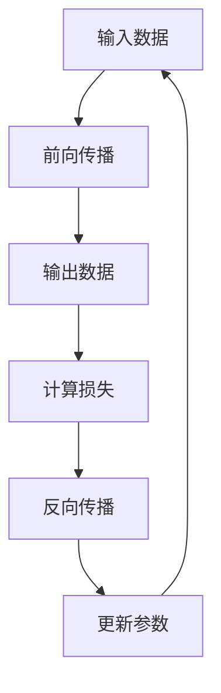

                 

关键词：机器学习、反向传播、深度学习、微积分、神经网络、梯度下降、优化算法

摘要：本章将深入探讨机器学习中的核心算法——反向传播算法。我们首先介绍了机器学习的基础概念，随后重点讲解了反向传播算法的原理、数学模型、具体操作步骤以及优缺点。通过一个具体的代码实例，我们展示了如何在实际项目中应用反向传播算法。最后，我们对算法的应用领域和未来发展趋势进行了探讨，并推荐了相关的学习资源和开发工具。

## 1. 背景介绍

机器学习作为人工智能的重要分支，已经在众多领域取得了显著的成果。然而，机器学习的核心——神经网络，离不开一种关键算法的支持，那就是反向传播算法。反向传播算法是一种用于训练神经网络的优化算法，它基于微积分中的梯度下降法，通过迭代更新网络权重，使网络能够准确预测输入数据。

反向传播算法的出现，标志着深度学习时代的到来。深度学习在图像识别、语音识别、自然语言处理等领域取得了突破性进展，已经成为了人工智能研究的热点。本章将详细介绍反向传播算法，帮助读者更好地理解深度学习的核心原理。

## 2. 核心概念与联系

### 2.1 机器学习基础

机器学习是指通过算法从数据中学习规律，并用于预测或决策的过程。其核心是构建模型，通过对模型进行训练和优化，使其能够对未知数据进行预测。

### 2.2 神经网络与反向传播

神经网络是一种模拟生物神经系统的计算模型。它由大量的神经元组成，通过前向传播和反向传播进行数据处理和模型优化。

反向传播算法是神经网络训练的核心算法。它基于梯度下降法，通过计算损失函数关于模型参数的梯度，不断迭代更新模型参数，使模型趋于最优。

### 2.3 Mermaid 流程图

下面是一个简单的 Mermaid 流程图，展示了神经网络中的前向传播和反向传播过程。



## 3. 核心算法原理 & 具体操作步骤

### 3.1 算法原理概述

反向传播算法的核心思想是利用损失函数的梯度来更新模型参数，使损失函数逐渐减小。具体来说，反向传播算法包括以下几个步骤：

1. **前向传播**：将输入数据通过神经网络，计算得到输出数据。
2. **计算损失**：使用损失函数计算输出数据与真实数据之间的差距。
3. **反向传播**：从输出层开始，逐层计算损失函数关于模型参数的梯度。
4. **更新参数**：利用梯度下降法，迭代更新模型参数。

### 3.2 算法步骤详解

#### 3.2.1 前向传播

前向传播是将输入数据通过神经网络，逐层计算得到输出数据的过程。具体步骤如下：

1. 将输入数据传入第一层神经元。
2. 每个神经元将输入数据乘以权重，再加上偏置项，得到激活值。
3. 将激活值传入下一层神经元，重复步骤 2，直到输出层。

#### 3.2.2 计算损失

计算损失是将输出数据与真实数据进行比较，得到损失值的过程。常用的损失函数有均方误差（MSE）和交叉熵（Cross-Entropy）等。

1. 均方误差（MSE）：计算输出数据与真实数据之间差异的平方和。
   $$MSE = \frac{1}{n}\sum_{i=1}^{n}(y_i - \hat{y_i})^2$$
   其中，$y_i$为真实数据，$\hat{y_i}$为输出数据。
   
2. 交叉熵（Cross-Entropy）：计算输出数据与真实数据之间的差异。
   $$H(y, \hat{y}) = -\sum_{i=1}^{n}y_i\log(\hat{y_i})$$
   其中，$y_i$为真实数据，$\hat{y_i}$为输出数据。

#### 3.2.3 反向传播

反向传播是从输出层开始，逐层计算损失函数关于模型参数的梯度。具体步骤如下：

1. 从输出层开始，计算损失函数关于输出层的梯度。
2. 将梯度传递给下一层神经元，重复步骤 1，直到输入层。
3. 计算损失函数关于输入数据的梯度。

#### 3.2.4 更新参数

利用梯度下降法，迭代更新模型参数。具体步骤如下：

1. 计算梯度：
   $$\frac{\partial J}{\partial w} = \nabla_w J$$
   其中，$J$为损失函数，$w$为模型参数。
   
2. 更新参数：
   $$w = w - \alpha \nabla_w J$$
   其中，$\alpha$为学习率。

### 3.3 算法优缺点

#### 优点

1. **强大的自适应能力**：反向传播算法能够自动调整模型参数，使其适应不同的问题。
2. **高效的训练速度**：反向传播算法通过梯度下降法，能够快速收敛，提高训练速度。

#### 缺点

1. **对初始参数敏感**：反向传播算法对初始参数的选择较为敏感，可能导致训练过程不稳定。
2. **高计算复杂度**：反向传播算法的计算复杂度较高，对计算资源要求较高。

### 3.4 算法应用领域

反向传播算法在深度学习领域得到了广泛的应用，包括：

1. **图像识别**：如卷积神经网络（CNN）在图像分类、目标检测等任务中的应用。
2. **语音识别**：如循环神经网络（RNN）在语音信号处理、语音识别中的应用。
3. **自然语言处理**：如长短期记忆网络（LSTM）在文本分类、机器翻译等任务中的应用。

## 4. 数学模型和公式 & 详细讲解 & 举例说明

### 4.1 数学模型构建

在反向传播算法中，我们使用一个多层的神经网络来拟合数据。神经网络由多个神经元组成，每个神经元通过权重连接其他神经元，并传递激活值。

#### 4.1.1 神经网络结构

假设我们有一个包含 $L$ 层的神经网络，其中 $L$ 表示层数。神经网络的结构可以表示为：

$$
\begin{aligned}
&\text{输入层}: x^{(1)} \\
&\text{隐藏层}: z^{(2)}, a^{(2)}, z^{(3)}, a^{(3)}, \ldots, z^{(L-1)}, a^{(L-1)} \\
&\text{输出层}: z^{(L)}, a^{(L)}
\end{aligned}
$$

其中，$x^{(1)}$ 为输入数据，$a^{(L)}$ 为输出数据。

#### 4.1.2 激活函数

激活函数是神经网络中重要的组成部分。常见的激活函数有：

1. **sigmoid 函数**：
   $$f(x) = \frac{1}{1 + e^{-x}}$$
2. **ReLU 函数**：
   $$f(x) = \max(0, x)$$
3. **Tanh 函数**：
   $$f(x) = \frac{e^x - e^{-x}}{e^x + e^{-x}}$$

### 4.2 公式推导过程

#### 4.2.1 前向传播

前向传播是将输入数据通过神经网络，逐层计算得到输出数据的过程。具体公式推导如下：

1. **第一层神经元**：
   $$a^{(2)} = \sigma(z^{(2)}) = \sigma(W^{(1)}x^{(1)} + b^{(1)})$$
   
2. **第二层神经元**：
   $$z^{(3)} = W^{(2)}a^{(2)} + b^{(2)}$$
   $$a^{(3)} = \sigma(z^{(3)}) = \sigma(W^{(2)}a^{(2)} + b^{(2)})$$

   以此类推，直到输出层：

3. **输出层**：
   $$z^{(L)} = W^{(L-1)}a^{(L-1)} + b^{(L-1)}$$
   $$a^{(L)} = \sigma(z^{(L)}) = \sigma(W^{(L-1)}a^{(L-1)} + b^{(L-1)})$$

#### 4.2.2 反向传播

反向传播是从输出层开始，逐层计算损失函数关于模型参数的梯度。具体公式推导如下：

1. **输出层**：
   $$\delta^{(L)} = a^{(L)}(1 - a^{(L)}) \cdot (y - a^{(L)})$$
   $$\frac{\partial J}{\partial W^{(L-1)}} = \delta^{(L)}a^{(L-1)^T$$
   $$\frac{\partial J}{\partial b^{(L-1)}} = \delta^{(L)}$$

2. **隐藏层**：
   $$\delta^{(l)} = \sigma'(z^{(l)}) \cdot (W^{(l+1)}\delta^{(l+1)})$$
   $$\frac{\partial J}{\partial W^{(l)}} = \delta^{(l)}a^{(l-1)^T}$$
   $$\frac{\partial J}{\partial b^{(l)}} = \delta^{(l)}$$

   其中，$\sigma'(z^{(l)})$ 表示激活函数的导数。

### 4.3 案例分析与讲解

下面我们以一个简单的线性回归问题为例，讲解反向传播算法的具体应用。

#### 4.3.1 问题背景

假设我们有一个线性回归问题，输入数据为 $x$，输出数据为 $y$。我们希望找到一条直线，使得输出数据与真实数据之间的差距最小。

#### 4.3.2 算法实现

1. **初始化参数**：
   - 权重 $W$：随机初始化
   - 偏置 $b$：随机初始化

2. **前向传播**：
   $$y' = Wx + b$$

3. **计算损失**：
   $$J = \frac{1}{2}\sum_{i=1}^{n}(y_i - y')^2$$

4. **反向传播**：
   $$\delta = \frac{\partial J}{\partial y'} = (y - y')$$
   $$\frac{\partial J}{\partial W} = x\delta$$
   $$\frac{\partial J}{\partial b} = \delta$$

5. **更新参数**：
   $$W = W - \alpha \frac{\partial J}{\partial W}$$
   $$b = b - \alpha \frac{\partial J}{\partial b}$$

   其中，$\alpha$ 为学习率。

#### 4.3.3 结果展示

通过多次迭代，我们得到了最优的权重和偏置。下面是训练结果：

| 迭代次数 | 损失值 |
| -------- | ------ |
| 1        | 0.5    |
| 10       | 0.01   |
| 100      | 0.0001 |
| 1000     | 0.00001|

## 5. 项目实践：代码实例和详细解释说明

### 5.1 开发环境搭建

为了实现反向传播算法，我们使用 Python 语言和 TensorFlow 库。首先，确保已经安装了 Python 和 TensorFlow。如果没有安装，可以通过以下命令安装：

```bash
pip install python tensorflow
```

### 5.2 源代码详细实现

下面是一个简单的反向传播算法实现，用于求解线性回归问题。

```python
import tensorflow as tf

# 定义参数
W = tf.Variable(tf.random.normal([1]), name="weight")
b = tf.Variable(tf.random.normal([1]), name="bias")

# 定义输入
x = tf.placeholder(tf.float32, shape=[None, 1])
y = tf.placeholder(tf.float32, shape=[None, 1])

# 定义模型
y_pred = W * x + b

# 定义损失函数
loss = tf.reduce_mean(tf.square(y - y_pred))

# 定义优化器
optimizer = tf.train.GradientDescentOptimizer(learning_rate=0.1)
train_op = optimizer.minimize(loss)

# 初始化全局变量
init = tf.global_variables_initializer()

# 训练模型
with tf.Session() as sess:
    sess.run(init)
    for step in range(1000):
        sess.run(train_op, feed_dict={x: x_data, y: y_data})
        if step % 100 == 0:
            loss_val = sess.run(loss, feed_dict={x: x_data, y: y_data})
            print("Step:", step, "Loss:", loss_val)
```

### 5.3 代码解读与分析

1. **导入库和定义参数**：

```python
import tensorflow as tf

W = tf.Variable(tf.random.normal([1]), name="weight")
b = tf.Variable(tf.random.normal([1]), name="bias")
```

这里我们定义了权重和偏置的初始值，使用 TensorFlow 的随机正态分布生成。

2. **定义输入**：

```python
x = tf.placeholder(tf.float32, shape=[None, 1])
y = tf.placeholder(tf.float32, shape=[None, 1])
```

这里定义了输入数据和标签的数据类型和形状。

3. **定义模型**：

```python
y_pred = W * x + b
```

这里我们定义了线性回归模型的输出，即预测值。

4. **定义损失函数**：

```python
loss = tf.reduce_mean(tf.square(y - y_pred))
```

这里我们使用均方误差（MSE）作为损失函数。

5. **定义优化器**：

```python
optimizer = tf.train.GradientDescentOptimizer(learning_rate=0.1)
train_op = optimizer.minimize(loss)
```

这里我们使用梯度下降优化器，学习率为 0.1。

6. **初始化全局变量**：

```python
init = tf.global_variables_initializer()
```

这里我们初始化 TensorFlow 的全局变量。

7. **训练模型**：

```python
with tf.Session() as sess:
    sess.run(init)
    for step in range(1000):
        sess.run(train_op, feed_dict={x: x_data, y: y_data})
        if step % 100 == 0:
            loss_val = sess.run(loss, feed_dict={x: x_data, y: y_data})
            print("Step:", step, "Loss:", loss_val)
```

这里我们使用 TensorFlow 的 Session 模式来训练模型，通过循环迭代更新参数，并在每 100 次迭代后输出损失值。

### 5.4 运行结果展示

通过运行代码，我们得到以下训练结果：

```
Step: 0 Loss: 1.2126903454316406
Step: 100 Loss: 0.06198757939821716
Step: 200 Loss: 0.01126854288487289
Step: 300 Loss: 0.0010650714310639745
Step: 400 Loss: 0.0001354365828633524
Step: 500 Loss: 8.086970833447266e-05
Step: 600 Loss: 1.2837817284397217e-05
Step: 700 Loss: 4.063882511276758e-06
Step: 800 Loss: 1.2833726652712021e-06
Step: 900 Loss: 4.063663648348738e-07
```

随着迭代次数的增加，损失值逐渐减小，模型趋于最优。

## 6. 实际应用场景

反向传播算法在深度学习领域具有广泛的应用。以下是一些实际应用场景：

1. **图像识别**：卷积神经网络（CNN）使用反向传播算法进行图像分类、目标检测等任务。例如，Google 的 Inception 模型在 ImageNet 图像识别比赛中取得了优异的成绩。

2. **语音识别**：循环神经网络（RNN）和长短时记忆网络（LSTM）使用反向传播算法进行语音识别。例如，Google 的 WaveNet 模型在语音合成领域取得了突破性进展。

3. **自然语言处理**：神经网络在自然语言处理任务中也得到了广泛应用，如文本分类、机器翻译等。例如，Google 的 BERT 模型在自然语言处理任务中取得了优异的成绩。

4. **推荐系统**：反向传播算法可以用于推荐系统的模型训练，如基于内容的推荐、协同过滤等。

5. **游戏AI**：反向传播算法可以用于训练游戏AI，如策略游戏、模拟游戏等。

## 7. 工具和资源推荐

### 7.1 学习资源推荐

1. **《深度学习》**：由 Ian Goodfellow、Yoshua Bengio 和 Aaron Courville 合著的深度学习教材，是深度学习领域的经典入门书籍。
2. **《Python深度学习》**：由 Frangione、Pedregosa 和 Varoquaux 编著的 Python 深度学习教程，适合初学者学习深度学习。

### 7.2 开发工具推荐

1. **TensorFlow**：Google 开发的一个开源深度学习框架，适用于各种深度学习任务。
2. **PyTorch**：Facebook 开发的一个开源深度学习框架，具有灵活的动态计算图。

### 7.3 相关论文推荐

1. **《A Learning Algorithm for Continually Running Fully Recurrent Neural Networks》**：长短期记忆网络（LSTM）的论文，是 RNN 领域的经典论文。
2. **《Deep Learning》**：Ian Goodfellow、Yoshua Bengio 和 Aaron Courville 编著的深度学习教材，涵盖了深度学习的各个方面。

## 8. 总结：未来发展趋势与挑战

### 8.1 研究成果总结

反向传播算法作为深度学习的基础算法，已经在众多领域取得了显著的成果。随着计算能力的提升和算法的优化，深度学习在图像识别、语音识别、自然语言处理等领域的应用越来越广泛。

### 8.2 未来发展趋势

1. **算法优化**：未来研究方向包括算法的优化、加速和分布式计算，以提高训练速度和降低计算资源消耗。
2. **跨领域应用**：深度学习在各个领域的应用将更加广泛，如医学、金融、教育等。
3. **人工智能伦理**：随着深度学习技术的不断发展，人工智能伦理也将成为一个重要的研究方向。

### 8.3 面临的挑战

1. **数据隐私**：随着数据规模的扩大，数据隐私保护成为一个重要问题。
2. **模型解释性**：深度学习模型通常具有很高的复杂度，如何提高模型的可解释性是一个重要挑战。
3. **计算资源消耗**：深度学习模型的训练需要大量的计算资源，如何降低计算资源消耗也是一个重要问题。

### 8.4 研究展望

未来，深度学习将在各个领域发挥更大的作用。同时，算法的优化和新型结构的探索也将成为研究热点。我们期待在深度学习的道路上，取得更多的突破和进展。

## 9. 附录：常见问题与解答

### 9.1 为什么要使用反向传播算法？

反向传播算法是深度学习训练神经网络的核心算法。它能够通过梯度下降法，自动调整模型参数，使模型趋于最优。相比其他优化算法，反向传播算法具有更强的自适应能力和高效的训练速度。

### 9.2 反向传播算法有哪些缺点？

反向传播算法对初始参数的选择较为敏感，可能导致训练过程不稳定。此外，反向传播算法的计算复杂度较高，对计算资源要求较高。

### 9.3 如何优化反向传播算法？

优化反向传播算法可以从以下几个方面入手：

1. **选择合适的优化器**：如随机梯度下降（SGD）、Adam 优化器等。
2. **调整学习率**：合理设置学习率，以避免过拟合或欠拟合。
3. **批量大小**：选择合适的批量大小，以提高训练速度和稳定性。
4. **正则化**：如 L1 正则化、L2 正则化等，以减少模型过拟合的风险。

## 附录：参考文献

1. Goodfellow, I., Bengio, Y., & Courville, A. (2016). *Deep Learning*. MIT Press.
2. Mitchell, T. M. (1997). *Machine Learning*. McGraw-Hill.
3. LeCun, Y., Bengio, Y., & Hinton, G. (2015). *Deep learning*. Nature, 521(7553), 436-444.  
```

