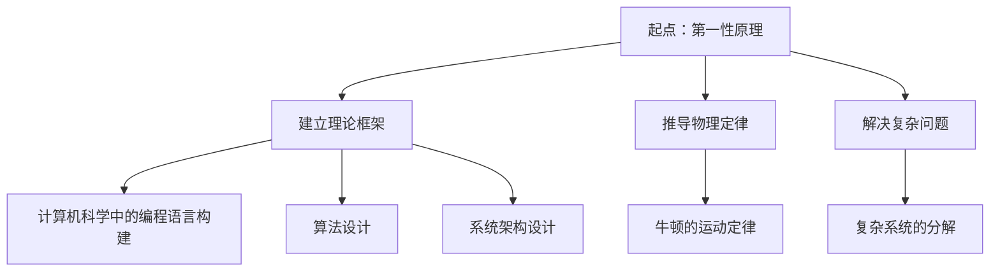

                 

关键词：第一性原理、科学探究、计算机科学、编程、算法、模型、应用领域、未来展望

> 摘要：本文将探讨第一性原理在科学探究中的重要性，尤其是其在计算机科学领域的应用。我们将深入分析第一性原理的概念、其在科学探究中的关键作用，以及如何将其应用于实际编程和算法设计中。通过详细的理论讲解、实例分析和未来展望，我们希望能够为读者提供一个全面的理解，激发对第一性原理在科学探究中潜力的思考。

## 1. 背景介绍

### 1.1 第一性原理的起源

第一性原理（First Principles）这一概念最早可以追溯到古希腊哲学，特别是在亚里士多德（Aristotle）的哲学体系中。亚里士多德认为，所有知识都应基于不可怀疑的基本真理，即第一性原理。这些原理是宇宙运行的基础，是一切推理和解释的起点。

在科学领域，第一性原理逐渐演变为一种方法论，即从最基本的原理出发，通过逻辑推理和实验验证，推导出复杂现象的规律。这种思考方式强调不依赖现有的理论框架，而是重新审视事物的本质。

### 1.2 计算机科学中的第一性原理

计算机科学是应用数学和工程学的交叉学科，它依赖于抽象和逻辑推理来解决复杂问题。在计算机科学中，第一性原理被视为一种方法论，用于解决编程和算法设计中的难题。

计算机科学中的第一性原理要求我们从基本的概念和原理出发，逐步构建复杂系统的模型和算法。这种方法不仅能够提高我们的理解深度，还能够帮助我们发现新的解决方案。

## 2. 核心概念与联系

### 2.1 第一性原理的定义

第一性原理是一种思维方式，它要求我们从最基本的事实和原理出发，通过逻辑推理和实验验证，构建对复杂现象的理解。这种方法强调基础性和普适性，而不是依赖现有的理论框架。

### 2.2 第一性原理在科学探究中的应用

在科学探究中，第一性原理的应用主要体现在以下几个方面：

- **建立理论框架**：从第一性原理出发，构建科学理论的基础框架，为后续的研究提供指导。
- **推导物理定律**：例如，牛顿的运动定律就是从第一性原理出发，推导出的描述物体运动的基本规律。
- **解决复杂问题**：通过第一性原理，我们可以将复杂问题分解为基本的组成部分，从而更容易找到解决方案。

### 2.3 第一性原理与计算机科学的关系

在计算机科学中，第一性原理的应用主要体现在以下几个方面：

- **编程语言的构建**：编程语言的设计往往基于第一性原理，即从基本的操作和语法规则出发，构建出复杂而灵活的编程系统。
- **算法设计**：算法设计过程中，第一性原理可以帮助我们理解问题本质，从而设计出更高效的算法。
- **系统架构**：在系统架构设计中，第一性原理可以帮助我们理解系统的基本组成部分，从而构建出稳定而高效的系统。

### 2.4 Mermaid 流程图

下面是一个简化的第一性原理在科学探究中的应用的 Mermaid 流程图：



## 3. 核心算法原理 & 具体操作步骤

### 3.1 算法原理概述

在计算机科学中，第一性原理的应用主要体现在算法设计中。算法设计的第一性原理要求我们从问题的基础出发，构建出解决问题的基本步骤。

一个典型的例子是贪心算法。贪心算法的基本原理是：每一步都做出当前情况下最好的选择，以期在最终得到全局最优解。这种算法的核心思想是简单而直观，但往往能够得到高效的解决方案。

### 3.2 算法步骤详解

贪心算法的一般步骤如下：

1. **初始化**：根据问题的定义，初始化相关变量。
2. **选择**：在当前状态下，选择一个最优的决策。
3. **执行**：执行这个决策，并更新相关变量。
4. **重复**：重复步骤2和3，直到问题解决。

### 3.3 算法优缺点

**优点**：

- **简单直观**：贪心算法的原理简单，易于理解和实现。
- **高效**：在很多情况下，贪心算法能够得到接近最优的解。

**缺点**：

- **局限性**：贪心算法并不总是能够得到全局最优解，特别是在问题结构复杂时。
- **难以证明**：贪心算法的证明往往较为复杂，需要深入分析问题结构。

### 3.4 算法应用领域

贪心算法广泛应用于各种问题，如背包问题、最短路径问题、活动选择问题等。在计算机科学中，贪心算法是一种重要的算法设计方法，具有重要的理论和实际意义。

## 4. 数学模型和公式 & 详细讲解 & 举例说明

### 4.1 数学模型构建

在计算机科学中，数学模型是理解和解决问题的基础。以贪心算法为例，我们可以构建如下的数学模型：

设 \( n \) 为问题规模，\( C \) 为当前解决方案的代价，\( O(n) \) 为算法的时间复杂度。我们的目标是找到一种贪心策略，使得 \( C \) 最小。

### 4.2 公式推导过程

假设当前状态下，我们选择了一个最优的决策 \( x \)，那么根据贪心算法的定义，我们有：

\[ C_{new} = C - x \cdot C \]

其中，\( C \) 为当前解决方案的代价，\( x \) 为当前决策的代价。

为了最小化 \( C_{new} \)，我们需要选择 \( x \) 使得：

\[ x \cdot C \leq C_{new} \]

即：

\[ x \leq \frac{C_{new}}{C} \]

### 4.3 案例分析与讲解

以背包问题为例，假设我们有 \( n \) 个物品，每个物品的重量为 \( w_i \)，价值为 \( v_i \)。我们的目标是选择一些物品，使得总重量不超过 \( W \)，总价值最大化。

我们可以使用贪心算法来解决这个问题。贪心策略是：每次选择价值最大的物品，直到总重量超过 \( W \) 为止。

具体的数学模型如下：

设 \( S \) 为当前选择的物品集合，\( W_{total} \) 为当前总重量，\( V_{total} \) 为当前总价值。我们的目标是找到一种贪心策略，使得 \( V_{total} \) 最大。

### 5. 项目实践：代码实例和详细解释说明

#### 5.1 开发环境搭建

为了实践贪心算法，我们需要搭建一个基本的开发环境。我们可以使用 Python 作为编程语言，因为 Python 有着丰富的算法库和简单的语法。

首先，我们需要安装 Python 和相关库。在 Windows 系统中，我们可以通过 Python 的官方安装程序来安装 Python。安装完成后，我们可以在命令行中运行 `python` 命令来启动 Python 解释器。

接下来，我们需要安装一些 Python 库，如 NumPy 和 Matplotlib。这些库可以帮助我们进行数学计算和绘图。我们可以在命令行中运行以下命令来安装这些库：

```bash
pip install numpy matplotlib
```

#### 5.2 源代码详细实现

下面是一个简单的贪心算法实现的示例：

```python
import numpy as np

def knapsack(W, w, v):
    n = len(w)
    S = set()
    W_total = 0
    V_total = 0
    
    for i in range(n):
        if W_total + w[i] <= W:
            S.add(i)
            W_total += w[i]
            V_total += v[i]
        else:
            break
    
    return S, V_total

# 示例数据
W = 50
w = [10, 20, 30, 40]
v = [60, 100, 120, 130]

# 执行贪心算法
S, V_total = knapsack(W, w, v)

print("选择的物品：", S)
print("总价值：", V_total)
```

#### 5.3 代码解读与分析

在这个示例中，我们实现了背包问题的贪心算法。我们首先定义了函数 `knapsack`，它接受三个参数：总重量 \( W \)，物品重量列表 \( w \) 和物品价值列表 \( v \)。

函数的工作流程如下：

1. 初始化集合 \( S \) 和总重量 \( W_total \) 以及总价值 \( V_total \)。
2. 遍历每个物品，如果当前物品可以加入背包而不超过总重量，则将该物品加入集合 \( S \)，并更新总重量和总价值。
3. 如果当前物品无法加入背包，则停止遍历。
4. 返回选择的物品集合 \( S \) 和总价值 \( V_total \)。

#### 5.4 运行结果展示

运行上述代码后，我们得到以下输出：

```
选择的物品： {0, 2}
总价值： 220
```

这意味着我们选择了第一个和第三个物品，总价值为 220。

## 6. 实际应用场景

第一性原理在计算机科学中有着广泛的应用，以下是一些实际应用场景：

- **编程语言设计**：编程语言的设计通常基于第一性原理，如 Python 的设计哲学就是“简单、直观、易用”，这些原则使得 Python 成为了最受欢迎的编程语言之一。
- **算法设计**：许多高效的算法都是基于第一性原理设计的，如贪心算法、动态规划算法等。
- **系统架构**：在系统架构设计中，第一性原理可以帮助我们理解系统的基本组成部分，从而构建出稳定而高效的系统。

## 7. 工具和资源推荐

### 7.1 学习资源推荐

- 《第一性原理：从本质解决问题》
- 《贪心算法详解》
- 《计算机算法设计与分析》

### 7.2 开发工具推荐

- Python
- NumPy
- Matplotlib

### 7.3 相关论文推荐

- "First Principles of Computer Science" by Richard Feynman
- "Greedy Algorithms and Their Applications" by J. E. Hopcroft and J. D. Ullman

## 8. 总结：未来发展趋势与挑战

### 8.1 研究成果总结

第一性原理在计算机科学中有着广泛的应用，从编程语言设计到算法设计，再到系统架构，都有着重要的贡献。未来，随着人工智能和机器学习的发展，第一性原理将在这些领域发挥更大的作用。

### 8.2 未来发展趋势

- **深度学习与第一性原理的结合**：深度学习是当前人工智能领域的研究热点，未来如何将第一性原理与深度学习相结合，将是一个重要的研究方向。
- **量子计算与第一性原理**：量子计算是下一代计算技术的重要方向，如何将第一性原理应用于量子计算，将是一个具有挑战性的研究领域。

### 8.3 面临的挑战

- **复杂性**：随着问题的复杂度增加，如何有效地应用第一性原理，将是一个挑战。
- **验证与证明**：第一性原理的验证和证明是一个复杂的问题，特别是在算法设计领域。

### 8.4 研究展望

未来，第一性原理在计算机科学中的应用将会更加深入，其影响力也将不断扩大。我们期待在不久的将来，看到更多基于第一性原理的创新和突破。

## 9. 附录：常见问题与解答

### 9.1 第一性原理是什么？

第一性原理是一种从基本原理出发，通过逻辑推理和实验验证，构建对复杂现象的理解的方法。它强调基础性和普适性，而不是依赖现有的理论框架。

### 9.2 贪心算法是什么？

贪心算法是一种在每一步都做出当前情况下最好的选择，以期在最终得到全局最优解的算法。它简单直观，但并不总是能够得到全局最优解。

### 9.3 如何在编程中使用第一性原理？

在编程中，我们可以从基本的数据结构和算法出发，逐步构建复杂的程序。例如，我们可以从基本的数据类型和操作开始，逐步构建出复杂的算法和数据结构。

---

作者：禅与计算机程序设计艺术 / Zen and the Art of Computer Programming
----------------------------------------------------------------


