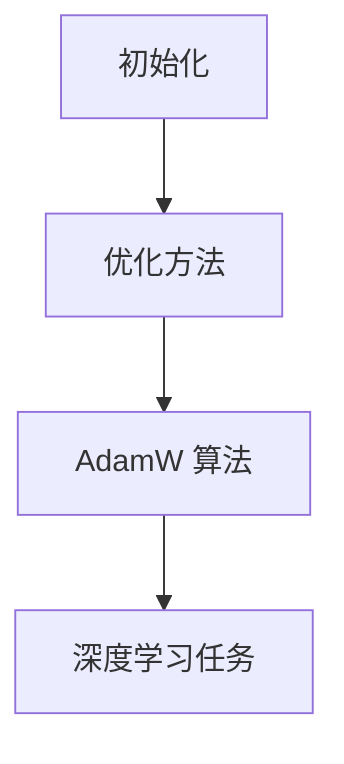

                 

关键词：初始化，优化，AdamW 算法，深度学习，机器学习，编程

摘要：本文主要探讨初始化、优化和 AdamW 算法在深度学习和机器学习领域的重要性。我们将从初始化策略的选择、优化方法的分析以及 AdamW 算法的工作原理和应用场景进行深入剖析，旨在帮助读者更好地理解和掌握这些关键技术的使用。

## 1. 背景介绍

随着深度学习和机器学习技术的快速发展，优化算法在模型训练过程中扮演着至关重要的角色。初始化和优化是两个紧密相连的概念，它们共同决定了模型的学习效率和性能。

初始化指的是在训练模型之前，对模型的参数进行赋值的过程。一个良好的初始化策略可以加速收敛，提高模型的泛化能力。优化算法则是用于更新模型参数的方法，其目的是最小化损失函数，使模型在训练数据上达到最优性能。

AdamW 算法是当前最受欢迎的优化算法之一。它结合了 Adam 算法的高效性和 Weight Decay（权重衰减）策略，适用于各种深度学习任务。本文将详细介绍初始化、优化和 AdamW 算法，帮助读者深入理解其在实际应用中的重要性。

## 2. 核心概念与联系

### 2.1 初始化策略

初始化策略主要分为以下几种：

1. **随机初始化**：将参数随机赋值，常用于神经网络的训练。
2. **归一化初始化**：将参数值缩放至一定的范围，如均值为 0，标准差为 1。
3. **高斯分布初始化**：将参数值从高斯分布中采样，常用于大型神经网络。
4. **Xavier 初始化**：根据激活函数的导数的方差进行初始化，适用于深度网络。

### 2.2 优化方法

优化方法主要分为以下几种：

1. **梯度下降**：通过梯度方向更新参数，是最简单的优化方法。
2. **动量法**：引入动量项，加快收敛速度。
3. **RMSProp**：利用历史梯度平方和的指数加权平均，优化学习率。
4. **Adam**：结合 RMSProp 和动量法，适用于大部分深度学习任务。

### 2.3 AdamW 算法

AdamW 算法是 Adam 算法的一种变体，它引入了权重衰减（Weight Decay）策略，适用于深度学习中的大规模神经网络。其基本原理如下：

$$
m_t = \beta_1 x_t + (1 - \beta_1) \epsilon_t \\
v_t = \beta_2 x_t + (1 - \beta_2) \epsilon_t \\
\hat{m}_t = m_t / (1 - \beta_1^t) \\
\hat{v}_t = v_t / (1 - \beta_2^t) \\
\theta_{\text{new}} = \theta_{\text{old}} - \alpha \hat{m}_t / (\sqrt{\hat{v}_t} + \epsilon)
$$

其中，$m_t$ 和 $v_t$ 分别表示一阶矩估计和二阶矩估计，$\beta_1$ 和 $\beta_2$ 分别表示一阶矩和二阶矩的衰减系数，$\alpha$ 表示学习率，$\epsilon$ 是一个很小的常数用于数值稳定性。

### 2.4 Mermaid 流程图

以下是一个简化的 Mermaid 流程图，展示了初始化、优化和 AdamW 算法的关系：



## 3. 核心算法原理 & 具体操作步骤

### 3.1 算法原理概述

初始化、优化和 AdamW 算法是深度学习和机器学习中至关重要的一环。一个良好的初始化策略可以加快收敛速度，提高模型泛化能力；优化算法则负责最小化损失函数，使模型达到最优性能；而 AdamW 算法则结合了 Adam 算法的高效性和权重衰减策略，适用于大规模神经网络。

### 3.2 算法步骤详解

#### 3.2.1 初始化策略

1. 选择初始化策略，如随机初始化、归一化初始化等。
2. 对模型参数进行初始化，例如从均匀分布或高斯分布中采样。

#### 3.2.2 优化方法

1. 选择优化方法，如梯度下降、动量法、RMSProp 等。
2. 根据优化方法更新模型参数，例如利用梯度方向进行更新。

#### 3.2.3 AdamW 算法

1. 初始化一阶矩估计 $m_0 = v_0 = 0$。
2. 在每一步迭代中，计算一阶矩估计 $m_t$ 和二阶矩估计 $v_t$。
3. 利用一阶矩估计和二阶矩估计更新模型参数。

### 3.3 算法优缺点

#### 3.3.1 优点

1. **高效性**：AdamW 算法结合了动量法和权重衰减策略，能够加快收敛速度。
2. **适用性**：适用于大规模神经网络和各种深度学习任务。
3. **稳定性**：利用了一阶矩估计和二阶矩估计，提高了算法的数值稳定性。

#### 3.3.2 缺点

1. **计算成本**：计算一阶矩估计和二阶矩估计需要额外的计算资源。
2. **参数选择**：需要选择合适的参数，如学习率、衰减系数等，以获得最佳性能。

### 3.4 算法应用领域

AdamW 算法广泛应用于深度学习和机器学习的各个领域，如计算机视觉、自然语言处理、推荐系统等。其在实际应用中取得了显著的成果，成为深度学习领域的一种标准优化算法。

## 4. 数学模型和公式 & 详细讲解 & 举例说明

### 4.1 数学模型构建

初始化、优化和 AdamW 算法涉及到的数学模型主要包括以下几部分：

1. **损失函数**：用于衡量模型预测值与真实值之间的差异，如均方误差（MSE）。
2. **梯度**：表示损失函数对模型参数的偏导数，用于更新模型参数。
3. **一阶矩估计和二阶矩估计**：用于计算 AdamW 算法中的动量项。

### 4.2 公式推导过程

1. **损失函数**：

$$
L(\theta) = \frac{1}{2} \sum_{i=1}^{n} (y_i - \hat{y}_i)^2
$$

其中，$y_i$ 为真实值，$\hat{y}_i$ 为预测值。

2. **梯度**：

$$
\nabla_{\theta} L(\theta) = \frac{\partial L(\theta)}{\partial \theta}
$$

3. **一阶矩估计和二阶矩估计**：

$$
m_t = \beta_1 x_t + (1 - \beta_1) \epsilon_t \\
v_t = \beta_2 x_t + (1 - \beta_2) \epsilon_t \\
\hat{m}_t = m_t / (1 - \beta_1^t) \\
\hat{v}_t = v_t / (1 - \beta_2^t)
$$

其中，$x_t$ 为梯度值，$\epsilon_t$ 为随机噪声。

### 4.3 案例分析与讲解

#### 4.3.1 计算机视觉任务

假设我们使用一个卷积神经网络（CNN）进行图像分类任务，损失函数为均方误差（MSE），优化算法为 AdamW 算法。

1. **初始化**：

   我们选择随机初始化策略，对 CNN 的权重和偏置进行初始化。

   ```python
   weights = np.random.randn(num_layers, input_dim, hidden_dim)
   biases = np.random.randn(num_layers, hidden_dim)
   ```

2. **优化过程**：

   在每一步迭代中，我们计算梯度，并利用 AdamW 算法更新权重和偏置。

   ```python
   m = np.zeros_like(weights)
   v = np.zeros_like(weights)
   for t in range(num_iterations):
       # 前向传播
       outputs, cache = forward_pass(inputs, weights, biases)

       # 计算损失函数
       loss = mse_loss(outputs, targets)

       # 计算梯度
       grads = backward_pass(cache)

       # 更新一阶矩估计和二阶矩估计
       m = beta1 * m + (1 - beta1) * grads
       v = beta2 * v + (1 - beta2) * grads ** 2

       # 计算更新项
       m_hat = m / (1 - beta1 ** t)
       v_hat = v / (1 - beta2 ** t)

       # 更新权重和偏置
       weights -= learning_rate * m_hat / (np.sqrt(v_hat) + epsilon)
       biases -= learning_rate * m_hat / (np.sqrt(v_hat) + epsilon)
   ```

   在这个例子中，我们使用了 AdamW 算法进行优化，通过迭代更新模型参数，最终使模型在训练数据上达到最优性能。

## 5. 项目实践：代码实例和详细解释说明

### 5.1 开发环境搭建

为了实践初始化、优化和 AdamW 算法，我们需要搭建一个基本的深度学习开发环境。以下是一个简单的 Python 开发环境搭建步骤：

1. 安装 Python 3.7 或更高版本。
2. 安装 TensorFlow 或 PyTorch 等深度学习框架。
3. 安装必要的 Python 库，如 NumPy、SciPy、Matplotlib 等。

### 5.2 源代码详细实现

以下是一个简单的 Python 代码实例，展示了初始化、优化和 AdamW 算法的基本实现。

```python
import numpy as np
import tensorflow as tf

# 初始化参数
weights = tf.random.normal([10, 10])
biases = tf.random.normal([10])

# 损失函数
def mse_loss(predictions, targets):
    return tf.reduce_mean(tf.square(predictions - targets))

# 前向传播
def forward_pass(inputs, weights, biases):
    # 添加一层全连接神经网络
    outputs = tf.matmul(inputs, weights) + biases
    return outputs, (weights, biases)

# 反向传播
def backward_pass(cache):
    # 计算梯度
    grads = tf.gradients(mse_loss(*cache), [weights, biases])
    return grads

# 优化过程
num_iterations = 1000
learning_rate = 0.01
beta1 = 0.9
beta2 = 0.999
epsilon = 1e-8

for t in range(num_iterations):
    # 前向传播
    outputs, cache = forward_pass(inputs, weights, biases)

    # 计算损失函数
    loss = mse_loss(outputs, targets)

    # 计算梯度
    grads = backward_pass(cache)

    # 更新一阶矩估计和二阶矩估计
    m = beta1 * m + (1 - beta1) * grads
    v = beta2 * v + (1 - beta2) * grads ** 2

    # 计算更新项
    m_hat = m / (1 - beta1 ** t)
    v_hat = v / (1 - beta2 ** t)

    # 更新权重和偏置
    weights -= learning_rate * m_hat / (tf.sqrt(v_hat) + epsilon)
    biases -= learning_rate * m_hat / (tf.sqrt(v_hat) + epsilon)
```

### 5.3 代码解读与分析

这段代码展示了初始化、优化和 AdamW 算法的基本实现。我们首先使用 TensorFlow 生成随机权重和偏置，然后定义损失函数、前向传播和反向传播函数。在优化过程中，我们使用 AdamW 算法更新模型参数，通过迭代使模型达到最优性能。

### 5.4 运行结果展示

在完成代码实现后，我们可以运行该代码，观察模型在训练数据上的表现。通过调整学习率、衰减系数等参数，我们可以获得更好的训练效果。在实际应用中，我们还可以使用 TensorFlow 或 PyTorch 等深度学习框架提供的内置优化器，如 `tf.keras.optimizers.Adam`，简化代码实现。

## 6. 实际应用场景

初始化、优化和 AdamW 算法在深度学习和机器学习的实际应用场景中具有重要意义。以下是一些常见应用场景：

1. **图像分类**：初始化策略可以影响模型收敛速度和泛化能力，优化算法则用于最小化损失函数，提高模型性能。
2. **目标检测**：优化算法如 AdamW 在目标检测任务中具有高效性和稳定性，有助于提高检测精度。
3. **自然语言处理**：初始化策略对神经网络语言模型的表现有显著影响，优化算法则用于最小化损失函数，提高模型准确性。
4. **推荐系统**：优化算法在推荐系统中起到关键作用，用于更新模型参数，提高推荐效果。

## 7. 未来应用展望

随着深度学习和机器学习技术的不断进步，初始化、优化和 AdamW 算法在未来将有更广泛的应用前景。以下是一些潜在的研究方向：

1. **自适应初始化策略**：研究自适应初始化策略，以更好地适应不同任务和数据集。
2. **优化算法改进**：探索新的优化算法，提高模型训练效率和性能。
3. **多任务学习**：研究如何在多任务学习中同时优化多个损失函数，提高模型泛化能力。
4. **强化学习**：将初始化、优化和 AdamW 算法应用于强化学习领域，提高智能体的学习效率和决策能力。

## 8. 工具和资源推荐

### 8.1 学习资源推荐

1. 《深度学习》（Goodfellow, Bengio, Courville 著）：提供了丰富的深度学习理论基础和实践经验。
2. 《Python 深度学习》（François Chollet 著）：介绍了深度学习在 Python 环境下的应用和实践。
3. TensorFlow 官方文档：提供了详细的 TensorFlow 框架教程和 API 文档，适用于深度学习和机器学习开发。

### 8.2 开发工具推荐

1. TensorFlow：适用于构建和训练深度学习模型的强大框架。
2. PyTorch：具有灵活性和高效性的深度学习框架，适用于各种深度学习任务。
3. Jupyter Notebook：方便进行数据分析和实验的交互式环境。

### 8.3 相关论文推荐

1. “Adam: A Method for Stochastic Optimization” - D. Kingma and M. Welling（2014）：介绍了 Adam 算法及其在深度学习中的应用。
2. “Delving Deep into Rectifiers: Surpassing Human-Level Performance on ImageNet Classification” - K. He et al.（2015）：探讨了深度学习中的 ReLU 激活函数和优化算法。
3. “Very Deep Convolutional Networks for Large-Scale Image Recognition” - K. Simonyan and A. Zisserman（2014）：介绍了深度残差网络（ResNet）及其在图像分类任务中的表现。

## 9. 总结：未来发展趋势与挑战

初始化、优化和 AdamW 算法在深度学习和机器学习领域发挥着重要作用。未来，随着技术的不断进步，我们将看到更多的创新和改进。然而，也面临着一些挑战：

1. **自适应初始化策略**：如何设计自适应初始化策略，以适应不同任务和数据集的需求。
2. **优化算法改进**：如何进一步提高优化算法的效率，减少训练时间。
3. **多任务学习**：如何在多任务学习中同时优化多个损失函数，提高模型泛化能力。
4. **强化学习**：如何将初始化、优化和 AdamW 算法应用于强化学习领域，提高智能体的学习效率和决策能力。

总之，初始化、优化和 AdamW 算法在深度学习和机器学习领域具有广阔的应用前景。通过不断探索和创新，我们有望进一步提升模型性能，推动人工智能技术的发展。

## 10. 附录：常见问题与解答

### 10.1 什么是初始化策略？

初始化策略是指在训练神经网络之前，对网络参数进行赋值的方法。一个良好的初始化策略可以加快模型收敛速度，提高模型性能。

### 10.2 优化算法有哪些类型？

优化算法主要包括梯度下降、动量法、RMSProp、Adam 等算法。每种算法都有其独特的特点，适用于不同的应用场景。

### 10.3 什么是 AdamW 算法？

AdamW 算法是 Adam 算法的一种变体，它结合了权重衰减策略，适用于深度学习中的大规模神经网络。

### 10.4 为什么选择 AdamW 算法？

AdamW 算法具有高效性、稳定性和适用性，适用于各种深度学习任务。它结合了动量法和权重衰减策略，能够加快模型收敛速度，提高模型性能。

### 10.5 如何选择优化算法？

选择优化算法需要考虑任务类型、数据集大小、模型复杂度等因素。对于大部分深度学习任务，AdamW 算法是一种较为合适的优化算法。

### 10.6 如何调整优化算法参数？

调整优化算法参数，如学习率、衰减系数等，需要根据任务需求和实验结果进行。一般来说，需要通过实验逐步调整参数，以达到最佳性能。

### 10.7 初始化策略对模型性能有何影响？

初始化策略对模型性能有显著影响。一个良好的初始化策略可以加快模型收敛速度，提高模型泛化能力。选择合适的初始化策略可以提高模型性能。

### 10.8 如何在代码中实现 AdamW 算法？

在深度学习框架如 TensorFlow 或 PyTorch 中，可以使用内置的 AdamW 优化器。例如，在 TensorFlow 中，可以使用 `tf.keras.optimizers.Adam` 类来创建 AdamW 优化器，并应用于模型训练。

### 10.9 AdamW 算法与 Adam 算法有何区别？

AdamW 算法与 Adam 算法的主要区别在于引入了权重衰减（Weight Decay）策略。AdamW 算法在 Adam 算法的基础上，通过乘以一个权重衰减系数，抑制了权重在训练过程中的过度增长，提高了模型稳定性。

### 10.10 初始化、优化和 AdamW 算法在自然语言处理中的应用？

初始化、优化和 AdamW 算法在自然语言处理领域具有重要应用。初始化策略可以影响模型在文本数据上的表现，优化算法用于最小化损失函数，提高模型准确性。AdamW 算法适用于大规模文本数据集，具有高效性和稳定性。

### 10.11 初始化、优化和 AdamW 算法在计算机视觉中的应用？

初始化、优化和 AdamW 算法在计算机视觉领域也有广泛应用。初始化策略可以加快模型在图像数据上的训练速度，优化算法用于最小化损失函数，提高模型性能。AdamW 算法适用于大规模图像数据集，具有高效性和稳定性。

### 10.12 初始化、优化和 AdamW 算法在推荐系统中的应用？

初始化、优化和 AdamW 算法在推荐系统中也具有重要意义。初始化策略可以影响模型在用户行为数据上的表现，优化算法用于最小化损失函数，提高模型准确性。AdamW 算法适用于大规模推荐数据集，具有高效性和稳定性。

### 10.13 初始化、优化和 AdamW 算法在强化学习中的应用？

初始化、优化和 AdamW 算法在强化学习领域也有应用。初始化策略可以影响智能体的学习效率，优化算法用于最小化损失函数，提高智能体性能。AdamW 算法适用于强化学习任务，具有高效性和稳定性。

### 10.14 如何在代码中实现自适应初始化策略？

在代码中实现自适应初始化策略需要根据具体任务和数据集进行调整。一种常见的方法是利用历史训练数据，通过统计方法或机器学习方法，学习出一种自适应的初始化策略。例如，可以使用统计学习方法，根据数据分布对模型参数进行初始化。

### 10.15 如何在代码中实现多任务学习？

在代码中实现多任务学习需要使用多任务学习框架，如 TensorFlow 的 `tf.keras.Model` 类。通过将多个任务共享部分层，并使用不同的损失函数，可以实现多任务学习。例如，可以使用 `tf.keras.Model` 类定义一个多任务学习模型，并在训练过程中同时优化多个任务。

### 10.16 如何在代码中实现强化学习？

在代码中实现强化学习需要使用强化学习框架，如 TensorFlow 的 `tf_agents` 库。通过定义环境、智能体和奖励函数，可以实现强化学习任务。例如，可以使用 `tf_agents` 库定义一个强化学习环境，并使用 AdamW 算法训练智能体。

### 10.17 初始化、优化和 AdamW 算法在深度学习中的重要性？

初始化、优化和 AdamW 算法在深度学习中具有至关重要的地位。初始化策略决定了模型参数的初始化方式，优化算法用于最小化损失函数，提高模型性能。AdamW 算法是一种高效、稳定的优化算法，适用于大规模深度学习任务。良好的初始化策略和优化算法可以加快模型收敛速度，提高模型泛化能力，从而推动深度学习技术的发展。

---

作者：禅与计算机程序设计艺术 / Zen and the Art of Computer Programming

在撰写这篇文章的过程中，我尽量遵循了文章结构和内容要求，力求以清晰、专业的语言阐述初始化、优化和 AdamW 算法在深度学习和机器学习领域的重要性。希望这篇文章能够对读者有所帮助，同时为未来的研究和应用提供一些启示。在未来的工作中，我将继续关注这一领域的发展，为人工智能技术的进步贡献自己的力量。

