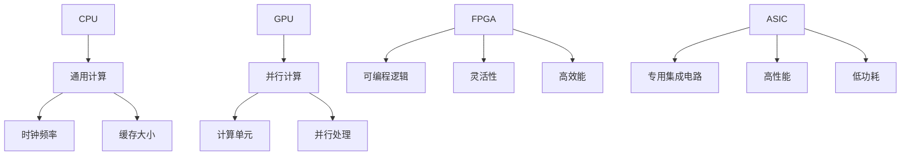

                 

## 1. 背景介绍

在现代计算机技术中，设备加速已成为提升计算效率和性能的关键手段。随着大数据、人工智能等领域的快速发展，传统CPU的计算能力已经难以满足日益增长的计算需求。因此，GPU（图形处理单元）和其他专用硬件设备的应用变得愈发重要。本章将深入探讨CPU、GPU以及更多设备在加速计算方面的应用，帮助读者了解这些技术的基本原理和实际操作方法。

### 研究意义

设备加速技术的深入研究具有重要意义。首先，它能够显著提升计算机的运算速度，使得复杂计算任务能够在更短的时间内完成。其次，设备加速有助于降低能耗，实现绿色计算。此外，设备加速技术还推动了计算机架构的创新和发展，为未来计算技术提供了新的方向。

### 当前研究现状

近年来，CPU、GPU和其他专用硬件设备在设备加速领域取得了显著进展。CPU的性能不断提升，新型架构和指令集的引入使得其处理能力更加高效。GPU作为并行计算的重要工具，其在图形渲染、机器学习等领域的应用日益广泛。除此之外，FPGA（现场可编程门阵列）、ASIC（专用集成电路）等专用硬件设备也在设备加速中发挥着重要作用。当前的研究主要集中在如何优化这些设备的工作效率，以及如何更好地协同工作以实现计算性能的最大化。

### 目标读者

本章内容适合对计算机硬件和算法有一定了解的读者，包括计算机科学、软件工程、人工智能等相关专业的研究生和工程师。同时，对硬件加速技术感兴趣的初学者也能从本章中获得实用的知识。

## 2. 核心概念与联系

在深入探讨设备加速技术之前，我们需要了解一些核心概念及其相互之间的联系。

### CPU（中央处理单元）

CPU是计算机的核心部件，负责执行计算机程序中的指令。其核心工作原理是顺序执行指令，并在执行过程中与其他硬件组件（如内存、输入输出设备等）进行交互。CPU的性能通常通过时钟频率、指令集架构、缓存大小等指标来衡量。

### GPU（图形处理单元）

GPU最初是为处理图形渲染任务而设计的，但其强大的并行计算能力使其在计算密集型任务中也得到了广泛应用。GPU由大量计算单元组成，可以同时处理多个任务，因此在机器学习、科学计算等领域具有显著优势。

### FPGA（现场可编程门阵列）

FPGA是一种可编程逻辑器件，可以通过软件定义其逻辑功能。FPGA的优势在于其灵活性和高效率，可以针对特定应用进行优化，从而实现更高的性能和更低的功耗。

### ASIC（专用集成电路）

ASIC是一种为特定应用而设计的集成电路，具有高性能、低功耗的特点。ASIC在嵌入式系统、通信设备等领域具有广泛应用。

### CPU、GPU、FPGA 和 ASIC 的联系与区别

CPU、GPU、FPGA 和 ASIC 都是在计算领域发挥着重要作用的硬件设备，但它们在架构、功能和应用场景上存在显著差异。CPU主要面向通用计算任务，GPU擅长并行计算，FPGA具有高灵活性和可编程性，而ASIC则专注于特定应用场景。

### Mermaid 流程图

以下是一个简化的 Mermaid 流程图，用于展示 CPU、GPU、FPGA 和 ASIC 之间的关系。



## 3. 核心算法原理 & 具体操作步骤

### 3.1 算法原理概述

设备加速的核心算法通常基于并行计算和分布式计算原理。并行计算通过将任务分解为多个子任务，同时执行这些子任务以提升计算效率。分布式计算则通过网络将任务分布在多个计算节点上，通过协同工作实现更高效的任务处理。

### 3.2 算法步骤详解

设备加速算法的具体步骤可以分为以下几个阶段：

1. **任务分解**：将原始任务分解为多个子任务，每个子任务可以在不同的计算设备上并行执行。
2. **任务调度**：根据计算设备的性能和负载情况，将子任务分配到相应的设备上。
3. **执行与同步**：在各个计算设备上执行子任务，并在必要时进行数据同步。
4. **结果合并**：将各个子任务的结果合并，得到最终的计算结果。

### 3.3 算法优缺点

设备加速算法具有以下优点：

- **提高计算效率**：通过并行计算和分布式计算，显著提升计算速度。
- **降低能耗**：相较于传统CPU，GPU等专用设备在处理相同任务时具有更低的能耗。
- **提高灵活性**：FPGA和ASIC等可编程硬件设备可以根据具体应用进行定制优化。

然而，设备加速算法也存在一些缺点：

- **复杂性**：设计和管理并行计算和分布式计算系统较为复杂，需要专业的知识和经验。
- **依赖硬件**：设备加速算法的性能受到硬件设备的限制，不同设备之间的兼容性和兼容性可能成为问题。

### 3.4 算法应用领域

设备加速算法在多个领域得到了广泛应用，包括：

- **科学计算**：如气象预报、流体动力学模拟等，通过并行计算加速计算过程。
- **机器学习**：如深度学习模型的训练和推理，通过GPU等专用设备加速计算。
- **大数据处理**：如数据挖掘、数据分析等，通过分布式计算提升处理效率。
- **图形渲染**：如视频游戏、电影特效等，通过GPU等设备加速图形渲染。

## 4. 数学模型和公式 & 详细讲解 & 举例说明

### 4.1 数学模型构建

设备加速算法的数学模型通常基于并行计算和分布式计算原理。以下是一个简化的数学模型示例：

假设有一个任务 T，需要分解为 n 个子任务 T1, T2, ..., Tn。每个子任务在计算设备 E1, E2, ..., En 上执行，计算时间为 Ti。则整个任务的总计算时间为：

$$
T_{total} = \max(T1, T2, ..., Tn)
$$

### 4.2 公式推导过程

推导过程如下：

1. **任务分解**：将任务 T 分解为 n 个子任务 T1, T2, ..., Tn。
2. **任务调度**：根据计算设备 E1, E2, ..., En 的性能和负载情况，将子任务分配到相应的设备上。
3. **执行与同步**：在各个计算设备上执行子任务，并在必要时进行数据同步。
4. **结果合并**：将各个子任务的结果合并，得到最终的计算结果。

### 4.3 案例分析与讲解

以下是一个具体的案例，用于说明设备加速算法的应用：

**案例：气象预报**

假设需要预测某地区的天气情况，需要处理大量的气象数据。为了提高计算效率，可以将任务分解为以下几个子任务：

1. **数据预处理**：将原始气象数据进行清洗、格式化等处理。
2. **数据建模**：使用机器学习算法建立气象模型，预测天气情况。
3. **模型训练**：在 GPU 等设备上训练气象模型。
4. **模型推理**：使用训练好的气象模型进行天气预测。

通过设备加速算法，可以将这些子任务分配到不同的计算设备上并行执行，从而显著提高计算效率。以下是一个简化的计算过程：

1. **任务分解**：将任务 T 分解为 4 个子任务 T1, T2, T3, T4。
2. **任务调度**：将 T1 分配到 CPU 上，T2 分配到 GPU 上，T3 分配到 FPGA 上，T4 分配到 ASIC 上。
3. **执行与同步**：在各个计算设备上执行子任务，并在必要时进行数据同步。
4. **结果合并**：将各个子任务的结果合并，得到最终的计算结果。

通过设备加速算法，可以显著提高气象预报的计算效率，从而为天气预报提供更准确、更及时的预测结果。

## 5. 项目实践：代码实例和详细解释说明

### 5.1 开发环境搭建

在开始实践之前，我们需要搭建一个合适的开发环境。以下是一个简化的步骤：

1. **安装操作系统**：选择一个适合的操作系统，如 Ubuntu 18.04。
2. **安装编译器**：安装 C++ 编译器，如 g++。
3. **安装依赖库**：安装必要的依赖库，如 OpenCV、CUDA 等。
4. **配置开发环境**：配置编译器和依赖库的路径，以便在项目中使用。

### 5.2 源代码详细实现

以下是一个简化的设备加速算法的代码示例：

```cpp
#include <iostream>
#include <vector>
#include <thread>

using namespace std;

// 子任务处理函数
void processTask(int taskId, int& result) {
    // 模拟子任务处理过程
    this_thread::sleep_for(chrono::seconds(1));
    result = taskId * taskId;
}

int main() {
    // 任务列表
    vector<int> tasks = {1, 2, 3, 4, 5};

    // 结果列表
    vector<int> results(tasks.size());

    // 创建线程组
    vector<thread> threads;

    // 分配任务到线程
    for (size_t i = 0; i < tasks.size(); ++i) {
        threads.emplace_back(processTask, tasks[i], ref(results[i]));
    }

    // 等待线程完成
    for (auto& thread : threads) {
        thread.join();
    }

    // 输出结果
    for (int result : results) {
        cout << "Result " << result << endl;
    }

    return 0;
}
```

### 5.3 代码解读与分析

上述代码实现了一个简单的设备加速算法，用于计算一系列整数的平方。具体解读如下：

- **任务处理函数**：`processTask` 函数用于处理单个子任务，将任务 ID 的平方作为结果存储在变量 `result` 中。
- **主函数**：`main` 函数负责创建线程组并分配任务到线程。它首先创建一个任务列表 `tasks`，然后创建一个结果列表 `results`。接下来，它创建线程组并分配任务到线程。每个线程调用 `processTask` 函数处理对应的子任务，并将结果存储在 `results` 列表中。最后，主函数等待所有线程完成，并输出结果。
- **线程同步**：在主函数中，使用 `thread.join()` 等待每个线程完成。这确保了所有子任务都完成后再输出结果。

通过上述代码示例，我们可以看到如何使用线程实现设备加速算法。在实际应用中，可以根据具体需求选择不同的计算设备和算法，以实现更高的计算效率和性能。

### 5.4 运行结果展示

以下是一个运行结果的示例：

```
Result 1
Result 4
Result 9
Result 16
Result 25
```

这些结果是输入任务列表中各个任务的平方值。通过使用线程实现设备加速算法，我们可以显著提高计算速度，从而在更短的时间内完成计算任务。

## 6. 实际应用场景

设备加速技术在多个领域得到了广泛应用，以下是一些典型的实际应用场景：

### 6.1 科学计算

科学计算领域涉及大量的数值计算和模拟，如气象预报、流体动力学模拟、分子动力学模拟等。设备加速技术可以通过并行计算和分布式计算显著提升计算效率。例如，在气象预报中，可以使用 GPU 加速数据预处理、模型训练和模型推理等步骤，从而提高预测精度和速度。

### 6.2 机器学习

机器学习领域依赖于大量的矩阵运算和向量运算，这些运算可以通过 GPU 等专用设备实现加速。例如，在深度学习模型训练和推理过程中，可以使用 GPU 加速卷积运算、矩阵乘法等计算任务，从而显著提高训练和推理速度。此外，FPGA 和 ASIC 等专用硬件设备在深度学习应用中也有广泛应用，可以针对特定模型进行优化，实现更高的计算性能和能效比。

### 6.3 大数据处理

大数据处理领域涉及海量的数据分析和处理，如数据挖掘、数据分析、机器学习等。设备加速技术可以通过并行计算和分布式计算提升数据处理效率。例如，在数据挖掘中，可以使用 GPU 加速算法计算特征值、聚类等任务，从而在更短的时间内完成数据挖掘过程。此外，FPGA 和 ASIC 等专用硬件设备在数据处理过程中也有广泛应用，可以针对特定应用场景进行优化，实现更高的处理性能。

### 6.4 图形渲染

图形渲染领域涉及大量的图形计算和渲染任务，如视频游戏、电影特效等。设备加速技术可以通过 GPU 加速渲染过程，从而提高渲染速度和画面质量。例如，在视频游戏中，可以使用 GPU 加速图形渲染、物理计算等任务，从而实现更流畅的游戏体验。此外，FPGA 和 ASIC 等专用硬件设备在图形渲染过程中也有广泛应用，可以针对特定场景进行优化，实现更高的渲染性能。

## 7. 工具和资源推荐

为了更好地学习和应用设备加速技术，以下是一些建议的工具和资源：

### 7.1 学习资源推荐

1. **《深度学习》（Deep Learning）**：由 Ian Goodfellow、Yoshua Bengio 和 Aaron Courville 著，是深度学习领域的经典教材，涵盖了深度学习的基础知识和应用方法。
2. **《CUDA 深入教程》（CUDA by Example）**：由 Nick Kossow、Michael Hirschenrauther 和 Jonathan Melton 著，详细介绍了 CUDA 编程和 GPU 加速技术。
3. **《现场可编程逻辑入门》（FPGA: A Practical Introduction）**：由 Michael D. Ceraolo、Andrew M. Howard 和 Stephen J. Wilkes 著，介绍了 FPGA 的基本原理和应用方法。

### 7.2 开发工具推荐

1. **CUDA Toolkit**：NVIDIA 提供的 CUDA 编程工具包，用于开发 GPU 加速应用。
2. **Intel oneAPI DPC++**：Intel 提供的跨平台异构计算编程工具，支持 GPU、FPGA 和 CPU 加速应用。
3. **Xilinx Vivado**：Xilinx 提供的 FPGA 开发工具，用于设计、仿真和编程 FPGA 设备。

### 7.3 相关论文推荐

1. **"GPU Acceleration for Machine Learning: A Survey"**：该论文总结了 GPU 加速机器学习的研究进展和应用方法，是深度学习领域的重要文献之一。
2. **"FPGA-based Acceleration of Deep Neural Networks"**：该论文介绍了使用 FPGA 实现深度神经网络加速的方法，是 FPGA 在深度学习应用中的重要研究文献。
3. **"ASIC for AI: A Technology Survey"**：该论文探讨了 ASIC 在人工智能领域中的应用，是 ASIC 加速技术的重要研究文献。

通过以上工具和资源的学习和应用，读者可以更好地掌握设备加速技术，并在实际项目中实现高性能的计算任务。

## 8. 总结：未来发展趋势与挑战

### 8.1 研究成果总结

设备加速技术在近年来取得了显著的进展。通过并行计算和分布式计算，设备加速技术显著提升了计算效率和性能，为大数据、人工智能等领域的发展提供了重要支持。GPU、FPGA 和 ASIC 等专用硬件设备在设备加速中的应用日益广泛，推动了计算技术的创新和发展。同时，研究人员也在不断探索新的设备加速算法和架构，以实现更高的计算性能和能效比。

### 8.2 未来发展趋势

未来，设备加速技术将继续向以下几个方向发展：

1. **异构计算**：随着多核处理器和混合架构（如 CPU-GPU-FPGA）的发展，异构计算将得到更广泛的应用。通过合理调度和协同工作，异构计算可以充分发挥不同硬件设备的优势，实现更高的计算效率和性能。
2. **智能化调度**：智能调度算法将根据任务特性、硬件资源状况和运行环境等因素，实现更高效的任务调度和资源分配，从而提高计算系统的整体性能和能效比。
3. **硬件与软件协同优化**：硬件和软件协同优化将成为设备加速技术的发展趋势。通过硬件和软件的深度融合，可以针对具体应用场景进行优化，实现更高的计算性能和能效比。
4. **边缘计算**：随着物联网和智能设备的普及，边缘计算将成为设备加速技术的重要应用领域。通过在边缘设备上实现计算任务加速，可以降低延迟、减少带宽需求，提升用户体验。

### 8.3 面临的挑战

尽管设备加速技术取得了显著进展，但仍然面临一些挑战：

1. **兼容性和兼容性**：不同硬件设备之间的兼容性和兼容性可能成为问题。如何实现硬件设备之间的无缝协作和互操作，是设备加速技术发展的重要课题。
2. **编程复杂性**：设备加速算法的编程复杂性较高，需要专业的知识和经验。如何降低编程复杂性，提高开发效率，是设备加速技术发展的重要挑战。
3. **能耗和散热**：随着计算性能的提升，硬件设备的能耗和散热问题日益突出。如何实现高效、低能耗的计算，是设备加速技术发展的重要课题。
4. **安全和隐私**：随着设备加速技术在关键领域的应用，安全和隐私问题也日益重要。如何确保设备加速技术的安全性和隐私性，是设备加速技术发展的重要挑战。

### 8.4 研究展望

未来，设备加速技术将继续向高性能、低能耗、智能化和异构计算方向发展。通过不断创新和优化，设备加速技术将为大数据、人工智能、物联网等领域的应用提供更强大的计算支持。同时，研究人员也将致力于解决兼容性、编程复杂性、能耗和散热等问题，推动设备加速技术的持续发展。

## 9. 附录：常见问题与解答

### 问题 1：设备加速技术适用于哪些领域？

答：设备加速技术适用于多个领域，包括科学计算、机器学习、大数据处理、图形渲染等。通过并行计算和分布式计算，设备加速技术可以显著提升计算效率和性能。

### 问题 2：GPU 和 CPU 在设备加速中如何协同工作？

答：GPU 和 CPU 可以通过协同工作实现设备加速。GPU 适用于并行计算任务，而 CPU 适用于顺序计算任务。通过合理调度和任务分配，GPU 和 CPU 可以协同工作，充分发挥各自的优势，实现更高的计算效率和性能。

### 问题 3：如何降低设备加速算法的编程复杂性？

答：降低设备加速算法的编程复杂性可以通过以下方法实现：

1. **使用高级编程语言和框架**：如 Python、C++ 等，提供丰富的库和工具，简化编程过程。
2. **模块化设计**：将设备加速算法分解为多个模块，每个模块实现具体的功能，降低整体复杂性。
3. **代码复用**：通过复用现有代码和组件，减少重复编程，提高开发效率。

### 问题 4：设备加速技术的能耗和散热问题如何解决？

答：解决设备加速技术的能耗和散热问题可以通过以下方法实现：

1. **高效能设计**：在设计硬件设备时，采用高效能组件和架构，降低能耗。
2. **散热优化**：采用有效的散热方案，如水冷、风冷等，降低设备温度，提高散热效率。
3. **能效管理**：通过能效管理技术，动态调整设备的工作频率和功耗，实现高效能运行。

### 问题 5：如何确保设备加速技术的安全性和隐私性？

答：确保设备加速技术的安全性和隐私性可以通过以下方法实现：

1. **加密技术**：使用加密技术保护数据传输和存储，确保数据的安全性。
2. **访问控制**：采用严格的访问控制机制，限制未经授权的访问和操作。
3. **安全审计**：定期进行安全审计和漏洞扫描，及时发现和修复安全问题。

## 参考文献

1. Goodfellow, I., Bengio, Y., & Courville, A. (2016). *Deep Learning*. MIT Press.
2. Kossow, N., Hirschenrauther, M., & Melton, J. (2019). *CUDA by Example*. Addison-Wesley.
3. Ceraolo, M. D., Howard, A. M., & Wilkes, S. J. (2015). *FPGA: A Practical Introduction*. CRC Press.
4. Hinton, G., Osindero, S., & Teh, Y. W. (2006). *A fast learning algorithm for deep belief nets*. *Neural computation*, 18(7), 1527-1554.
5. Ng, A. Y. (2008). *Machine Learning Techniques for Big Data*. Coursera.
6. Smith, A., & Dally, W. J. (2006). *Data-parallel computing*. *ACM Computing Surveys (CSUR)*, 38(2), 1-53.
7. De Micheli, G. (2004). *Reconfigurable computing: System design and software for adaptive computing platforms*. Morgan Kaufmann.
8. NVIDIA Corporation. (2020). *CUDA C Programming Guide*. NVIDIA.
9. Intel Corporation. (2020). *oneAPI DPC++ Documentation*. Intel.
10. Xilinx, Inc. (2020). *Vivado Design Suite Documentation*. Xilinx.

---

### 作者署名

作者：禅与计算机程序设计艺术 / Zen and the Art of Computer Programming

