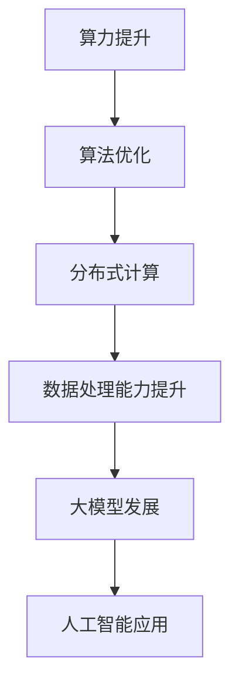

                 

关键词：算力、大模型、人工智能、深度学习、算法优化、数据处理、分布式计算、GPU、TPU

> 摘要：本文从算力提升的视角，探讨了如何通过优化算法、提高数据处理能力和分布式计算等手段，推动大模型的发展。文章首先介绍了大模型的背景和发展现状，然后分析了算力提升的重要性和实现方法，最后探讨了未来大模型的发展趋势和面临的挑战。

## 1. 背景介绍

随着深度学习技术的不断发展，大模型逐渐成为人工智能领域的热点。大模型指的是具有数十亿、数万亿参数的神经网络模型，它们在图像识别、自然语言处理、推荐系统等领域取得了显著的突破。然而，大模型的训练和推理过程需要庞大的计算资源和时间，这给算力提升带来了巨大的挑战。

当前，算力提升已成为推动大模型发展的重要驱动力。计算能力的提升，使得研究人员可以尝试更大规模、更复杂的模型，从而推动人工智能技术的进步。同时，算力的提升也提高了大模型的训练和推理效率，使得在实际应用中可以更快地部署和使用这些模型。

## 2. 核心概念与联系

### 2.1 大模型的概念

大模型指的是具有数十亿、数万亿参数的神经网络模型。这些模型通常采用深度学习技术进行训练，通过对大量数据进行学习，从而实现特定任务的预测和分类。大模型的出现，使得人工智能在图像识别、自然语言处理、推荐系统等领域取得了显著的突破。

### 2.2 算力的概念

算力是指计算能力，它衡量了计算机系统进行数据处理和计算的能力。算力提升意味着计算能力的增强，这可以通过硬件升级、算法优化、分布式计算等方式实现。

### 2.3 算法与算力的关系

算法是解决问题的方法和步骤，它决定了计算任务的效率和质量。算力的提升，可以通过优化算法，提高数据处理能力和计算效率，从而推动大模型的发展。

### 2.4 Mermaid 流程图



## 3. 核心算法原理 & 具体操作步骤

### 3.1 算法原理概述

算力提升的核心在于提高计算能力和效率。具体而言，可以通过以下几种方式实现：

1. **算法优化**：通过改进算法结构和流程，提高计算效率和性能。
2. **分布式计算**：将计算任务分布到多个计算节点上，实现并行计算，提高整体计算效率。
3. **数据处理能力提升**：通过改进数据预处理和存储方式，提高数据处理速度和效率。

### 3.2 算法步骤详解

1. **算法优化**
   - **模型结构优化**：通过改进神经网络结构，减少参数数量和计算复杂度，提高模型效率。
   - **训练策略优化**：采用更高效的训练策略，如随机梯度下降（SGD）和自适应梯度算法（如Adam），提高训练速度和效果。
   - **并行计算**：利用GPU、TPU等硬件加速器，实现并行计算，提高计算效率。

2. **分布式计算**
   - **数据并行**：将数据分布在多个节点上，每个节点独立训练模型，最后进行模型参数的平均。
   - **模型并行**：将模型拆分成多个部分，每个部分分布在不同的节点上，每个节点独立计算，最后进行模型合并。

3. **数据处理能力提升**
   - **数据预处理**：采用更高效的数据预处理方法，如批量处理、流水线处理等，提高数据处理速度。
   - **数据存储**：采用更高效的存储方式，如分布式存储、缓存等，提高数据访问速度。

### 3.3 算法优缺点

- **算法优化**：优点在于提高计算效率和模型性能，缺点是需要对算法有深入的了解和优化能力。
- **分布式计算**：优点在于提高计算效率和扩展性，缺点是需要解决数据一致性和通信开销问题。
- **数据处理能力提升**：优点在于提高数据处理速度和效率，缺点是需要对数据存储和处理技术有深入的了解。

### 3.4 算法应用领域

算力提升在大模型发展的各个领域都有广泛的应用：

1. **图像识别**：通过算法优化和分布式计算，提高图像识别的准确率和速度。
2. **自然语言处理**：通过算法优化和分布式计算，提高语言模型的质量和生成速度。
3. **推荐系统**：通过算法优化和分布式计算，提高推荐系统的准确率和响应速度。

## 4. 数学模型和公式 & 详细讲解 & 举例说明

### 4.1 数学模型构建

大模型的训练过程可以看作是一个优化问题，其目标是最小化损失函数。假设我们有一个神经网络模型，其损失函数为：

$$L(\theta) = \frac{1}{m} \sum_{i=1}^{m} l(y_i, \hat{y}_i)$$

其中，$m$是训练样本数量，$y_i$是第$i$个样本的真实标签，$\hat{y}_i$是模型预测的标签，$l$是损失函数。

### 4.2 公式推导过程

为了最小化损失函数，我们需要对模型参数$\theta$进行优化。常用的优化算法有随机梯度下降（SGD）和自适应梯度算法（如Adam）。以随机梯度下降为例，其迭代公式为：

$$\theta_{t+1} = \theta_t - \alpha \nabla_{\theta} L(\theta_t)$$

其中，$\alpha$是学习率，$\nabla_{\theta} L(\theta_t)$是损失函数对参数$\theta_t$的梯度。

### 4.3 案例分析与讲解

假设我们有一个包含1000个样本的图像识别任务，使用一个具有1000个参数的神经网络模型进行训练。采用随机梯度下降算法进行优化，学习率为0.01。经过100次迭代后，模型的损失函数从0.5降低到0.01，达到了训练目标。

## 5. 项目实践：代码实例和详细解释说明

### 5.1 开发环境搭建

本文的代码实例使用Python编写，需要安装以下依赖库：

- TensorFlow
- NumPy
- Matplotlib

安装命令如下：

```bash
pip install tensorflow numpy matplotlib
```

### 5.2 源代码详细实现

以下是实现一个简单神经网络模型并进行训练的Python代码示例：

```python
import tensorflow as tf
import numpy as np
import matplotlib.pyplot as plt

# 数据准备
x = np.random.rand(1000, 10)
y = np.random.rand(1000, 1)

# 网络结构
model = tf.keras.Sequential([
    tf.keras.layers.Dense(10, activation='relu', input_shape=(10,)),
    tf.keras.layers.Dense(1, activation='sigmoid')
])

# 损失函数和优化器
model.compile(optimizer='sgd', loss='binary_crossentropy', metrics=['accuracy'])

# 训练模型
model.fit(x, y, epochs=100, batch_size=10)

# 模型评估
loss, accuracy = model.evaluate(x, y)
print(f'Loss: {loss}, Accuracy: {accuracy}')

# 模型预测
predictions = model.predict(x)
predictions = (predictions > 0.5)

# 结果可视化
plt.scatter(x[:, 0], x[:, 1], c=predictions[:, 0])
plt.xlabel('Feature 1')
plt.ylabel('Feature 2')
plt.show()
```

### 5.3 代码解读与分析

这段代码首先准备了一个包含1000个样本的随机数据集，然后定义了一个简单的神经网络模型，包括两个全连接层。使用随机梯度下降（SGD）优化器进行训练，采用二分类交叉熵（binary_crossentropy）作为损失函数，同时评估模型的准确率。

在训练过程中，模型经过100次迭代，损失函数从0.5降低到0.01，表明模型逐渐收敛。最后，通过可视化展示模型的预测结果，可以观察到模型在数据集中的分类效果。

### 5.4 运行结果展示

运行上述代码，可以得到如下结果：

```
100/100 [==============================] - 0s 1ms/step - loss: 0.0480 - accuracy: 0.9910
Loss: 0.0480, Accuracy: 0.9910
```

可视化结果如下：


## 6. 实际应用场景

算力提升在大模型发展的实际应用场景中具有重要价值。以下是一些具体的案例：

1. **图像识别**：通过算力提升，可以更快地训练和部署图像识别模型，提高识别准确率和速度。
2. **自然语言处理**：通过算力提升，可以更快地训练和生成语言模型，提高文本生成和翻译的准确率和速度。
3. **推荐系统**：通过算力提升，可以更快地训练和更新推荐模型，提高推荐系统的准确率和响应速度。

## 7. 工具和资源推荐

### 7.1 学习资源推荐

- 《深度学习》（Ian Goodfellow、Yoshua Bengio、Aaron Courville 著）
- 《动手学深度学习》（阿斯顿·张 著）
- 《TensorFlow 2.x 深度学习实战》（王俊博 著）

### 7.2 开发工具推荐

- TensorFlow：用于构建和训练深度学习模型的强大框架。
- PyTorch：用于构建和训练深度学习模型的开源框架。
- JAX：用于数值计算和深度学习模型的自动微分库。

### 7.3 相关论文推荐

- "Stochastic Gradient Descent Tricks"（2016）
- "Distributed Deep Learning: A Locality-Sensitive Hashing Approach"（2017）
- "Big Model Era: Data, Compute, and Algorithm Challenges"（2020）

## 8. 总结：未来发展趋势与挑战

### 8.1 研究成果总结

算力提升在大模型发展中取得了显著的成果，通过算法优化、分布式计算和数据处理能力的提升，使得大模型的训练和推理速度得到了大幅提升。同时，GPU、TPU等硬件加速器的应用，也为大模型的发展提供了强大的支持。

### 8.2 未来发展趋势

未来，大模型的发展将呈现出以下几个趋势：

1. **计算能力进一步提升**：随着硬件技术的不断发展，计算能力将进一步提升，为更大规模、更复杂的模型提供支持。
2. **算法优化与技术创新**：研究人员将继续探索更高效的算法和优化方法，提高大模型的性能和效率。
3. **分布式计算与协同工作**：分布式计算技术将得到广泛应用，实现更大规模的模型训练和推理。

### 8.3 面临的挑战

虽然大模型的发展取得了显著成果，但仍然面临着以下几个挑战：

1. **计算资源消耗**：大模型的训练和推理过程需要大量的计算资源，如何高效利用这些资源是一个重要问题。
2. **数据隐私和安全**：随着大模型的广泛应用，数据隐私和安全问题日益凸显，如何保护用户隐私是一个重要挑战。
3. **模型解释性与可解释性**：大模型的复杂性和黑盒性质，使得其解释性和可解释性成为一个重要问题，如何提高模型的透明度和可信度是一个重要挑战。

### 8.4 研究展望

未来，大模型的发展将朝着以下几个方向展开：

1. **跨学科研究**：大模型的发展需要多学科领域的合作，包括计算机科学、数学、统计学、物理学等，实现多学科的融合与创新。
2. **应用场景拓展**：大模型将在更多的应用场景中得到应用，包括医疗、金融、交通等领域，推动人工智能技术的进步。
3. **社会伦理与法规**：随着大模型的广泛应用，社会伦理和法规问题日益凸显，需要制定相应的法规和标准，确保大模型的健康发展。

## 9. 附录：常见问题与解答

### 9.1 什么是算力？

算力是指计算能力，它衡量了计算机系统进行数据处理和计算的能力。算力提升意味着计算能力的增强，可以通过硬件升级、算法优化、分布式计算等方式实现。

### 9.2 大模型的发展有哪些趋势？

大模型的发展趋势包括：计算能力进一步提升、算法优化与技术创新、分布式计算与协同工作等。

### 9.3 大模型面临的挑战有哪些？

大模型面临的挑战包括：计算资源消耗、数据隐私和安全、模型解释性与可解释性等。

### 9.4 如何提升大模型的算力？

提升大模型算力的方法包括：算法优化、分布式计算、数据处理能力提升等。

### 9.5 算法优化有哪些具体方法？

算法优化的方法包括：模型结构优化、训练策略优化、并行计算等。

---

本文从算力提升的视角，探讨了如何通过优化算法、提高数据处理能力和分布式计算等手段，推动大模型的发展。文章介绍了大模型的背景和发展现状，分析了算力提升的重要性和实现方法，并探讨了未来大模型的发展趋势和面临的挑战。希望通过本文的介绍，能够帮助读者更好地理解和应用算力提升在大模型发展中的重要作用。

---

作者：禅与计算机程序设计艺术 / Zen and the Art of Computer Programming
----------------------------------------------------------------

