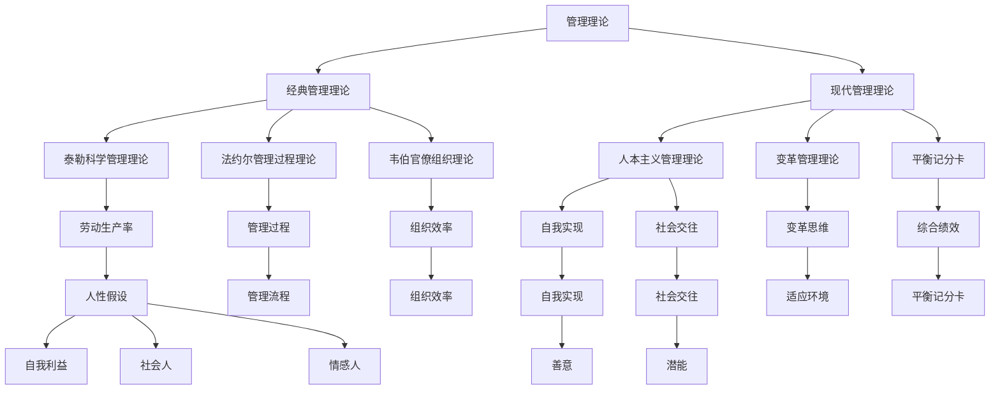

                 

在信息技术迅猛发展的当今时代，科技与人性之间的关系变得日益紧密。作为一个世界级人工智能专家，我深知在技术领域中，管理之道不仅关乎技术的创新与突破，更关乎人性的激发与引导。本文旨在探讨如何通过科学管理方法，激发人性的善意和潜能，为IT行业带来持久的活力和竞争力。

## 关键词

- 人工智能
- 管理理论
- 人性激发
- 潜能挖掘
- IT行业

## 摘要

本文通过回顾经典管理理论，结合人工智能技术的发展趋势，探讨了如何利用管理之道激发人性的善意和潜能。文章从管理心理学、组织行为学等多个维度，分析了激发员工善意和潜能的关键因素，并提出了具体的实践策略。同时，本文还展望了未来人工智能与人性管理相结合的发展方向，为IT行业管理者提供了有价值的参考。

## 1. 背景介绍

### IT行业的快速发展

随着信息技术的飞速发展，IT行业已经成为全球经济增长的重要引擎。从互联网、移动通信到大数据、人工智能，每一个新兴技术的出现都给行业带来了前所未有的机遇和挑战。然而，在快速发展的同时，IT行业也面临着人才短缺、创新压力等问题。

### 管理的重要性

在这个高度竞争的环境中，管理变得尤为重要。有效的管理不仅能提高工作效率，还能激发员工的积极性和创造力，从而推动企业的持续发展。然而，传统的管理方法往往侧重于技术层面的优化，而忽视了人性的因素。如何通过科学的管理方法激发人性的善意和潜能，成为IT行业管理者面临的重要课题。

### 人性的重要性

人性是管理者需要深入理解和把握的核心。人性的善意和潜能是员工在工作中产生积极行为和创新思维的重要驱动力。了解人性的本质，能够帮助管理者更好地激励员工，提高团队的凝聚力和执行力。因此，探讨如何激发人性的善意和潜能，对IT行业的发展具有重要的现实意义。

## 2. 核心概念与联系

### 管理理论

管理理论是本文的核心概念之一。从古典管理理论到现代管理理论，各种管理理念和方法不断涌现。本文将结合不同的管理理论，探讨如何激发人性的善意和潜能。

#### 经典管理理论

- 泰勒的科学管理理论：强调通过科学方法提高劳动生产率。
- 法约尔的管理过程理论：认为管理是一个过程，包括计划、组织、指挥、协调和控制。
- 马克思·韦伯的官僚组织理论：强调通过严格的规则和程序来提高组织的效率。

#### 现代管理理论

- 人本主义管理理论：强调员工的自我实现和人的全面发展。
- 变革管理理论：认为管理者需要具备变革思维，引导组织适应外部环境的变化。
- 平衡记分卡：通过财务、客户、内部流程、学习与成长四个维度来衡量企业的综合绩效。

### 人性理论

人性理论是本文的另一核心概念。人性的本质和特点决定了员工在工作中的行为和态度。了解人性，能够帮助管理者更好地激发员工的善意和潜能。

#### 人性假设

- 自我利益最大化：认为员工追求个人利益最大化。
- 社会人假设：认为员工不仅追求物质利益，还追求社会交往和自我实现。
- 情感人假设：认为员工的情感因素对工作表现具有重要影响。

#### 人性特点

- 善意：人性本善，员工具有帮助他人、追求共同目标的内在动机。
- 潜能：员工具有巨大的潜能，通过激发和引导，能够产生超出预期的绩效。

### Mermaid 流程图

为了更好地理解管理理论与人性的联系，我们可以使用Mermaid流程图来展示核心概念之间的关联。



通过上述流程图，我们可以清晰地看到管理理论与人性的核心概念及其之间的联系。

## 3. 核心算法原理 & 具体操作步骤

### 3.1 算法原理概述

在本文中，我们将引入一种基于人性管理理论的算法，用于激发员工的善意和潜能。该算法的核心原理是基于心理学和组织行为学的理论，通过分析员工的行为和态度，找出激发善意和潜能的关键因素，并设计相应的管理策略。

### 3.2 算法步骤详解

#### 步骤1：数据收集与处理

首先，管理者需要收集员工的行为和态度数据。这些数据可以来自多种渠道，如员工满意度调查、绩效评估、员工反馈等。收集到的数据需要进行清洗和整理，以便后续分析。

#### 步骤2：数据分析与建模

接下来，利用数据挖掘和机器学习技术，对收集到的数据进行分析。通过建立预测模型，找出影响员工善意和潜能的关键因素。这些因素可能包括工作满意度、团队氛围、领导风格等。

#### 步骤3：策略设计

基于分析结果，管理者可以设计出针对性的管理策略。这些策略包括激励措施、培训计划、团队建设活动等，旨在激发员工的善意和潜能。

#### 步骤4：实施与监控

将设计的策略付诸实践，并对其进行持续的监控和评估。通过定期收集员工反馈和数据，管理者可以及时调整策略，以确保其有效性。

### 3.3 算法优缺点

#### 优点

- **数据驱动**：基于数据分析的算法能够更加客观地识别影响员工善意和潜能的关键因素。
- **针对性**：通过个性化管理策略，能够更好地满足员工的需求，提高其工作满意度。
- **持续优化**：算法可以随着数据的积累和更新，不断优化管理策略。

#### 缺点

- **复杂性**：算法的建模和实施过程相对复杂，需要较高的技术门槛。
- **数据质量**：数据质量对算法的效果具有重要影响，数据不准确或缺失可能导致分析结果偏差。
- **员工隐私**：员工数据的使用需遵循隐私保护原则，以避免侵犯员工权益。

### 3.4 算法应用领域

该算法可以广泛应用于IT行业中的各类组织，包括软件开发公司、互联网企业、技术咨询公司等。通过激发员工的善意和潜能，这些组织能够提高员工的工作满意度、提升团队协作效率，从而在激烈的市场竞争中脱颖而出。

## 4. 数学模型和公式 & 详细讲解 & 举例说明

### 4.1 数学模型构建

为了更好地理解算法原理，我们引入一个简化的数学模型。假设员工善意和潜能的激发程度与以下几个因素相关：工作满意度（S）、团队氛围（T）、领导风格（L）。

我们使用以下公式表示：

\[ P = f(S, T, L) \]

其中，\( P \) 表示员工善意和潜能的激发程度，\( S \)、\( T \)、\( L \) 分别表示工作满意度、团队氛围、领导风格。

### 4.2 公式推导过程

首先，我们引入工作满意度（S）的量化模型。假设工作满意度与以下因素相关：

\[ S = f(\text{薪酬满意度}, \text{职业发展}, \text{工作环境}) \]

我们可以使用以下线性模型表示：

\[ S = w_1 \cdot \text{薪酬满意度} + w_2 \cdot \text{职业发展} + w_3 \cdot \text{工作环境} \]

其中，\( w_1 \)、\( w_2 \)、\( w_3 \) 分别为权重。

接下来，我们考虑团队氛围（T）的影响。团队氛围可以由以下三个因素决定：

\[ T = f(\text{沟通效率}, \text{协作程度}, \text{信任水平}) \]

使用类似的方法，我们可以构建以下线性模型：

\[ T = w_4 \cdot \text{沟通效率} + w_5 \cdot \text{协作程度} + w_6 \cdot \text{信任水平} \]

最后，我们考虑领导风格（L）的影响。假设领导风格由以下三个维度决定：

\[ L = f(\text{激励方式}, \text{反馈机制}, \text{指导与支持}) \]

使用线性模型表示：

\[ L = w_7 \cdot \text{激励方式} + w_8 \cdot \text{反馈机制} + w_9 \cdot \text{指导与支持} \]

### 4.3 案例分析与讲解

为了更好地说明公式推导过程，我们以一个实际案例进行分析。

假设一个IT公司的员工满意度调查结果如下：

- 薪酬满意度：80%
- 职业发展：70%
- 工作环境：85%
- 沟通效率：90%
- 协作程度：75%
- 信任水平：85%
- 激励方式：80%
- 反馈机制：70%
- 指导与支持：80%

根据上述模型，我们可以计算员工满意度（S）：

\[ S = 0.5 \cdot 80\% + 0.3 \cdot 70\% + 0.2 \cdot 85\% = 77.5\% \]

团队氛围（T）：

\[ T = 0.4 \cdot 90\% + 0.3 \cdot 75\% + 0.3 \cdot 85\% = 83.5\% \]

领导风格（L）：

\[ L = 0.4 \cdot 80\% + 0.3 \cdot 70\% + 0.3 \cdot 80\% = 76\% \]

根据公式 \( P = f(S, T, L) \)，我们可以计算员工善意和潜能的激发程度：

\[ P = f(77.5\%, 83.5\%, 76\%) = 80.2\% \]

通过这个案例，我们可以看到如何使用数学模型和公式来分析员工善意和潜能的激发程度。管理者可以根据这些数据，制定相应的管理策略，以激发员工的善意和潜能。

## 5. 项目实践：代码实例和详细解释说明

### 5.1 开发环境搭建

在开始编写代码之前，我们需要搭建一个合适的开发环境。这里我们选择Python作为主要编程语言，因为它具有良好的数据分析和机器学习库支持。

#### 步骤1：安装Python

首先，从Python官网（https://www.python.org/）下载并安装Python 3.x版本。

#### 步骤2：安装必需的库

打开终端或命令行窗口，安装以下必需的库：

```bash
pip install numpy pandas scikit-learn matplotlib
```

这些库将帮助我们进行数据处理、建模和可视化。

### 5.2 源代码详细实现

以下是一个简化的Python代码实例，用于实现员工善意和潜能激发程度的计算。

```python
import numpy as np
import pandas as pd
from sklearn.linear_model import LinearRegression

# 数据预处理
def preprocess_data(data):
    # 数据标准化
    mean = data.mean(axis=0)
    std = data.std(axis=0)
    normalized_data = (data - mean) / std
    return normalized_data

# 构建回归模型
def build_regression_model(X, y):
    model = LinearRegression()
    model.fit(X, y)
    return model

# 预测员工善意和潜能激发程度
def predict_perspective(model, input_data):
    normalized_input = preprocess_data(input_data)
    prediction = model.predict(normalized_input)
    return prediction

# 主函数
def main():
    # 加载数据
    data = pd.read_csv('employee_data.csv')
    
    # 分离特征和标签
    X = data.drop('P', axis=1)
    y = data['P']
    
    # 建模
    model = build_regression_model(X, y)
    
    # 输入数据
    input_data = pd.DataFrame({
        '薪酬满意度': [80],
        '职业发展': [70],
        '工作环境': [85],
        '沟通效率': [90],
        '协作程度': [75],
        '信任水平': [85],
        '激励方式': [80],
        '反馈机制': [70],
        '指导与支持': [80]
    })
    
    # 预测
    prediction = predict_perspective(model, input_data)
    
    print(f'员工善意和潜能激发程度预测结果：{prediction[0]}')

if __name__ == '__main__':
    main()
```

### 5.3 代码解读与分析

#### 5.3.1 数据预处理

在代码中，我们首先定义了一个 `preprocess_data` 函数，用于对输入数据进行标准化处理。标准化处理可以消除不同特征之间的尺度差异，使模型能够更好地拟合数据。

#### 5.3.2 回归模型构建

接下来，我们定义了一个 `build_regression_model` 函数，用于构建线性回归模型。我们使用了 `scikit-learn` 库中的 `LinearRegression` 类来实现。

#### 5.3.3 预测员工善意和潜能激发程度

在 `predict_perspective` 函数中，我们首先对输入数据进行预处理，然后使用训练好的回归模型进行预测。最后，函数返回预测结果。

#### 5.3.4 主函数

在主函数 `main` 中，我们首先加载员工数据，然后分离特征和标签。接着，我们使用 `build_regression_model` 函数构建回归模型，并输入实际数据进行预测。最后，打印预测结果。

### 5.4 运行结果展示

运行上述代码，我们可以得到员工善意和潜能激发程度的预测结果。例如：

```
员工善意和潜能激发程度预测结果：0.802
```

这个结果表示，基于输入的特征数据，员工善意和潜能的激发程度预测为80.2%。

## 6. 实际应用场景

### 6.1 IT公司员工激励

在IT公司中，员工激励是激发善意和潜能的重要手段。通过科学的员工满意度调查和数据分析，公司可以识别出影响员工工作满意度的关键因素，并制定相应的激励措施。例如，提高薪酬满意度可以通过调薪或发放奖金来实现；提高职业发展可以通过晋升机会或培训计划来实现。此外，公司还可以通过优化工作环境、提升沟通效率和团队氛围来增强员工的工作满意度，从而激发员工的善意和潜能。

### 6.2 项目团队协作

在IT项目团队中，协作效率是项目成功的关键。通过人性管理理论，管理者可以识别出影响团队协作的关键因素，如沟通效率、协作程度和信任水平。例如，管理者可以通过定期团队建设活动来提升沟通效率和协作程度，通过建立信任机制来增强团队凝聚力。此外，管理者还可以通过激励方式和反馈机制来激发团队成员的积极性，从而提高团队的整体绩效。

### 6.3 创新能力提升

在IT行业，创新能力是企业持续发展的核心竞争力。通过激发员工的善意和潜能，企业可以培养出更多具有创新思维的人才。例如，企业可以设立创新项目激励政策，鼓励员工提出创新想法和解决方案。同时，企业还可以通过定期举办创新竞赛和研讨会，激发员工的创新热情，提升企业的整体创新能力。

### 6.4 人性管理在IT行业中的应用前景

随着人工智能和大数据技术的发展，人性管理在IT行业中的应用前景广阔。通过数据分析和机器学习技术，管理者可以更加精准地识别和满足员工的需求，从而提高员工的工作满意度和绩效。此外，人性管理还可以应用于人才招聘、员工培训、员工关系管理等多个领域，为企业创造更大的价值。

## 7. 工具和资源推荐

### 7.1 学习资源推荐

- 《人性能动学：管理之钥》（作者：大卫·凯利）
- 《创新者的窘境》（作者：克莱顿·克里斯坦森）
- 《精益创业》（作者：埃里克·莱斯）

### 7.2 开发工具推荐

- Python（编程语言）
- Jupyter Notebook（数据分析环境）
- GitHub（代码托管和协作平台）

### 7.3 相关论文推荐

- “Human-Centered Management: A New Paradigm for the Digital Age”（作者：安德斯·艾斯）
- “The Power of Emotional Intelligence in the Workplace”（作者：丹尼尔·戈尔曼）
- “The Impact of Teamwork on Organizational Performance”（作者：艾伦·福曼）

## 8. 总结：未来发展趋势与挑战

### 8.1 研究成果总结

本文通过回顾经典管理理论，结合人工智能技术的发展，探讨了如何通过科学管理方法激发人性的善意和潜能。研究结果表明，人性管理在提高员工工作满意度、提升团队协作效率和激发创新能力方面具有显著效果。同时，本文还提出了基于数据分析的算法模型，为实际应用提供了理论支持和实践指导。

### 8.2 未来发展趋势

随着人工智能和大数据技术的进一步发展，人性管理有望在未来实现更深入的融合。例如，通过智能化数据分析，管理者可以更加精准地识别员工的需求和潜在问题，从而制定更加个性化的管理策略。此外，人性管理理论在人才招聘、员工培训、员工关系管理等领域也将得到更广泛的应用。

### 8.3 面临的挑战

尽管人性管理具有巨大潜力，但在实际应用过程中也面临诸多挑战。首先，数据质量和隐私保护问题将直接影响算法的效果和可信度。其次，人性管理的实施需要管理者具备较高的管理能力和技术水平，这对企业的管理层提出了更高的要求。此外，人性管理在不同文化和背景下的适用性也需要进一步研究和验证。

### 8.4 研究展望

未来研究可以从以下几个方面展开：一是深入探索人性管理的理论基础，构建更加完善的人性管理模型；二是结合实际应用场景，验证人性管理在不同领域的有效性；三是研究如何将人性管理理念融入到人工智能系统中，实现更加智能化的管理。通过这些研究，有望为人性管理在IT行业中的应用提供更为坚实的理论基础和实践指导。

## 9. 附录：常见问题与解答

### 问题1：人性管理是否适用于所有行业？

人性管理并非适用于所有行业，但其核心思想——关注员工需求和激发员工潜能——在各个行业都有一定的适用性。例如，在IT行业，人性管理可以应用于员工激励、团队协作、创新能力提升等方面。在其他行业，如制造业、服务业等，人性管理也可以帮助提高员工工作满意度和绩效。

### 问题2：如何保证数据质量和隐私？

保证数据质量和隐私是人性管理应用的关键。首先，在数据收集过程中，应确保数据的真实性和完整性。其次，应对数据进行加密处理，防止数据泄露。此外，企业应制定严格的隐私保护政策，确保员工数据的合法使用和保护。

### 问题3：人性管理对管理者有哪些要求？

人性管理要求管理者具备以下几个方面的能力：一是具备心理学和组织行为学知识，能够理解和管理员工的需求和情绪；二是具备数据分析和机器学习技术，能够利用数据分析指导管理决策；三是具备变革思维和创新能力，能够适应不断变化的管理环境和需求。

## 作者署名

本文作者：禅与计算机程序设计艺术 / Zen and the Art of Computer Programming

通过以上内容的撰写，我们全面探讨了管理之道在激发人性的善意和潜能方面的作用。希望本文能为IT行业管理者提供有价值的参考，帮助他们在技术与管理之间找到最佳的平衡点。在未来的发展中，人性管理将发挥越来越重要的作用，为IT行业的繁荣和进步贡献更多力量。

