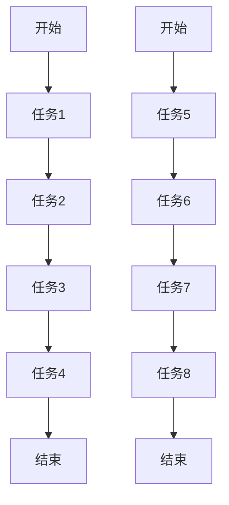
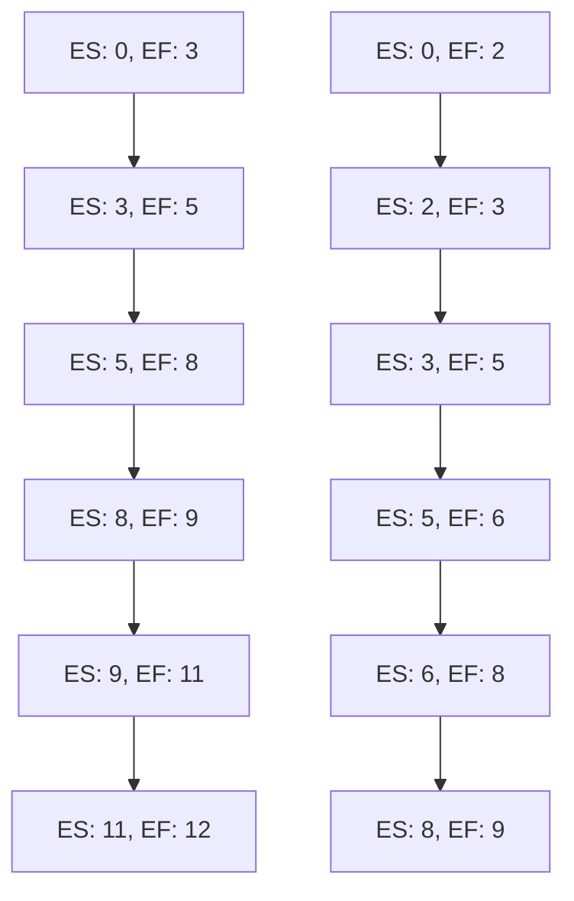
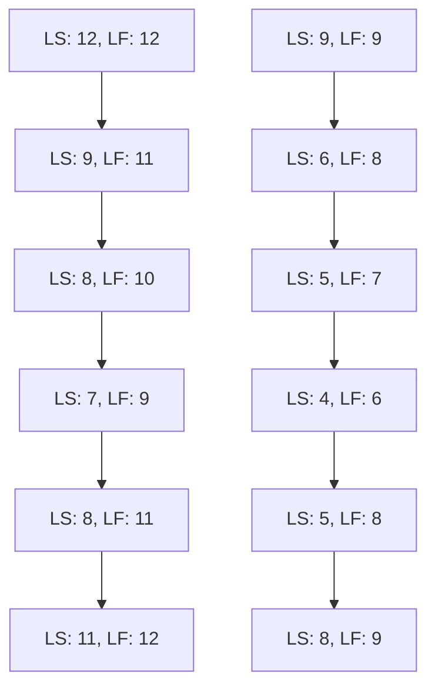
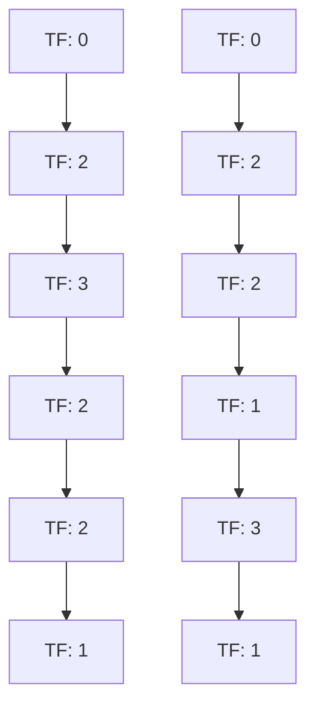

                 

关键词：管理、策略、执行、项目管理、团队协作、技术领导力、IT领域

> 摘要：本文深入探讨了IT领域中的管理艺术，从策略制定到执行过程，通过分析项目管理、团队协作和技术领导力的关键要素，帮助读者理解如何在一个高度动态的IT环境中实现高效管理。文章通过实际案例和理论分析，提供了实用的方法和技巧，旨在提升IT项目的成功率。

## 1. 背景介绍

在当今快速发展的信息技术时代，IT项目的成功与否往往直接关系到企业的竞争力和市场地位。然而，随着项目复杂度的增加、技术变革的加速以及市场需求的不断变化，IT项目管理面临着前所未有的挑战。在这种背景下，管理艺术——特别是策略制定和执行——变得尤为重要。

本文旨在探讨IT领域中的管理艺术，重点关注以下几个方面：

- 项目管理的基本原则和最佳实践
- 团队协作与沟通的有效策略
- 技术领导力的重要性及其应用
- 算法和技术的创新与实施

通过这些主题的深入探讨，本文希望能够为IT项目经理、团队领导和从业人员提供有价值的参考和指导。

### 1.1 IT领域的挑战

在IT领域，以下是几个常见的挑战：

- **项目复杂性**：随着技术的不断发展，IT项目的复杂性不断增加，要求项目经理具备更深入的专业知识和更高的管理水平。
- **技术变革**：新技术不断涌现，旧技术逐渐被淘汰，项目经理需要不断更新知识和技能，以适应技术变革。
- **需求变化**：市场需求的不确定性高，客户需求多变，项目经理需要灵活应对变化，确保项目能够按时交付。
- **资源管理**：资源（包括人力、时间、资金等）有限，如何合理分配和使用资源是项目管理的关键。

### 1.2 管理艺术的重要性

管理艺术不仅仅是遵循一些固有的规则和流程，更是一种灵活运用知识和技能的能力。在IT领域，管理艺术的重要性体现在：

- **策略制定**：合理的策略可以预见未来可能出现的问题，减少项目风险。
- **执行过程**：有效的执行可以确保项目按计划进行，提高工作效率。
- **团队协作**：良好的团队协作可以提高项目团队的工作效率和创新能力。
- **持续改进**：通过持续改进，项目团队能够不断提升自身能力，应对未来的挑战。

## 2. 核心概念与联系

在深入探讨管理艺术之前，我们需要明确几个核心概念，这些概念是管理艺术的基础。

### 2.1 项目管理

项目管理是指通过计划、执行、监控和报告等过程，确保项目按时、按预算和按质量要求完成的一系列管理活动。项目管理包括以下关键组成部分：

- **项目目标**：明确项目要达成的目标和期望成果。
- **范围管理**：定义项目的范围，确保项目团队理解并遵循项目的范围。
- **时间管理**：制定项目时间表，确保项目按时完成。
- **成本管理**：预算和分配资源，确保项目在预算内完成。
- **质量管理**：确保项目成果满足预定的质量标准。
- **风险管理**：识别和应对项目中的潜在风险。

### 2.2 团队协作

团队协作是指团队成员为了共同的目标和任务，通过有效的沟通和合作，共同完成任务的过程。团队协作的关键要素包括：

- **沟通**：建立有效的沟通机制，确保信息畅通。
- **合作**：鼓励团队成员相互支持，共同解决问题。
- **信任**：建立信任关系，提高团队凝聚力和协作效率。
- **冲突管理**：有效解决团队内部冲突，确保团队和谐。

### 2.3 技术领导力

技术领导力是指领导者通过技术知识和能力，激发团队创新和进步的能力。技术领导力包括以下关键要素：

- **技术洞察力**：理解并掌握最新的技术趋势和前沿技术。
- **创新能力**：鼓励团队进行技术创新，提高项目竞争力。
- **知识传递**：将技术知识传递给团队成员，提升团队整体技术水平。
- **决策能力**：在技术决策过程中，提供科学的建议和决策。

### 2.4 Mermaid 流程图

为了更好地理解上述核心概念之间的联系，我们可以使用Mermaid流程图来展示它们之间的关系。

```mermaid
graph TB

A[项目管理] --> B[团队协作]
A --> C[技术领导力]

B --> D[沟通]
B --> E[合作]
B --> F[信任]

C --> G[技术洞察力]
C --> H[创新能力]
C --> I[知识传递]
C --> J[决策能力]

subgraph 项目管理关键组成部分
    K[项目目标]
    L[范围管理]
    M[时间管理]
    N[成本管理]
    O[质量管理]
    P[风险管理]
    
    K --> L
    K --> M
    K --> N
    K --> O
    K --> P
```

通过上述流程图，我们可以清晰地看到项目管理、团队协作和技术领导力之间的联系，以及每个概念下的关键组成部分。

## 3. 核心算法原理 & 具体操作步骤

### 3.1 算法原理概述

在项目管理中，算法原理的使用可以帮助项目经理更高效地规划项目、分配资源和管理风险。本文将介绍一种常用的项目管理算法——关键路径法（Critical Path Method，CPM）。

关键路径法是一种基于网络图的项目管理技术，它通过识别项目中的关键路径来评估项目的最短完成时间。关键路径上的任务必须按顺序完成，任何延迟都会导致整个项目的延迟。

### 3.2 算法步骤详解

#### 3.2.1 建立项目网络图

首先，我们需要建立项目网络图，表示项目中的所有任务及其依赖关系。网络图由节点（表示任务）和边（表示任务之间的依赖关系）组成。



#### 3.2.2 确定任务持续时间

接下来，我们需要为每个任务分配一个持续时间，表示完成该任务所需的时间。

```mermaid
graph TD

A1[开始(3天)] --> B1[任务1(2天)]
B1 --> C1[任务2(3天)]
C1 --> D1[任务3(1天)]
D1 --> E1[任务4(2天)]
E1 --> F1[结束(1天)]

A2[开始(2天)] --> B2[任务5(1天)]
B2 --> C2[任务6(2天)]
C2 --> D2[任务7(1天)]
D2 --> E2[任务8(2天)]
E2 --> F2[结束(1天)]
```

#### 3.2.3 计算最早开始时间（ES）和最早完成时间（EF）

对于每个任务，我们计算其最早开始时间（ES）和最早完成时间（EF）。最早开始时间是该任务之前所有任务的最早完成时间的最大值，最早完成时间是最早开始时间加上该任务的持续时间。



#### 3.2.4 计算最迟开始时间（LS）和最迟完成时间（LF）

对于每个任务，我们计算其最迟开始时间（LS）和最迟完成时间（LF）。最迟开始时间是该任务之后所有任务的最迟完成时间的最小值，最迟完成时间是最迟开始时间减去该任务的持续时间。



#### 3.2.5 计算总浮动时间（TF）

总浮动时间是任务最迟开始时间与最早开始时间之间的差值，或者最迟完成时间与最早完成时间之间的差值。总浮动时间为零的任务位于关键路径上。



### 3.3 算法优缺点

#### 优点：

- **易于理解和使用**：关键路径法是一种直观且易于理解的项目管理工具，可以帮助项目经理快速评估项目的最短完成时间。
- **灵活性**：关键路径法允许项目经理在项目执行过程中进行实时调整，以应对变化和风险。

#### 缺点：

- **假设条件**：关键路径法假设任务之间的依赖关系是线性的，这可能无法完全反映现实中的复杂依赖关系。
- **计算复杂性**：对于大型项目，计算关键路径可能需要大量的时间和计算资源。

### 3.4 算法应用领域

关键路径法广泛应用于各种类型的IT项目中，特别是在软件开发、系统集成和基础设施建设项目中。它可以帮助项目经理：

- **评估项目风险**：通过识别关键路径上的任务，项目经理可以了解哪些任务的延迟会对项目总进度产生最大的影响。
- **优化资源分配**：根据关键路径上的任务，项目经理可以优先分配关键资源，确保项目按计划进行。

## 4. 数学模型和公式 & 详细讲解 & 举例说明

### 4.1 数学模型构建

在项目管理中，数学模型的应用可以帮助项目经理更好地理解和优化项目进度、成本和资源。本文将介绍一种常用的项目管理数学模型——计划评审技术（Program Evaluation and Review Technique，PERT）。

PERT模型是一种基于概率论的项目管理工具，用于评估项目完成时间的不确定性。它通过构建网络图和概率分布来模拟项目任务及其依赖关系，从而提供项目完成时间的概率估计。

### 4.2 公式推导过程

PERT模型的核心在于任务持续时间的概率分布。对于每个任务，我们定义以下三个参数：

- **最乐观时间（O）**：任务在理想情况下完成所需的时间。
- **最可能时间（M）**：任务在实际情况下完成所需的时间。
- **最悲观时间（P）**：任务在不利情况下完成所需的时间。

根据PERT模型，任务持续时间的概率分布服从贝塔分布（Beta distribution），其概率密度函数为：

$$
f(t; O, M, P) = \frac{(t - O)(t - P)}{(M - O)(M - P)} \cdot \frac{1}{B(O, P)}
$$

其中，$B(O, P)$ 是贝塔函数，定义为：

$$
B(O, P) = \int_{0}^{1} x^{O-1}(1-x)^{P-1} dx
$$

PERT模型中的任务持续时间可以通过以下公式计算：

$$
t = \frac{O + 4M + P}{6}
$$

### 4.3 案例分析与讲解

假设我们有一个包含四个任务的IT项目，每个任务的最乐观时间、最可能时间和最悲观时间如下表所示：

| 任务 | 最乐观时间（O） | 最可能时间（M） | 最悲观时间（P） |
|------|----------------|----------------|----------------|
| 任务1 | 2              | 3              | 5              |
| 任务2 | 3              | 4              | 6              |
| 任务3 | 4              | 5              | 7              |
| 任务4 | 5              | 6              | 8              |

根据PERT模型，我们可以计算每个任务的持续时间：

$$
t_1 = \frac{2 + 4 \times 3 + 5}{6} = 3.5
$$

$$
t_2 = \frac{3 + 4 \times 4 + 6}{6} = 4.5
$$

$$
t_3 = \frac{4 + 4 \times 5 + 7}{6} = 5.5
$$

$$
t_4 = \frac{5 + 4 \times 6 + 8}{6} = 6.5
$$

### 4.4 运行结果展示

根据上述计算结果，我们可以构建项目网络图，并计算每个路径的持续时间：

```mermaid
graph TB

A[开始] --> B[任务1(3.5天)]
B --> C[任务2(4.5天)]
C --> D[任务3(5.5天)]
D --> E[任务4(6.5天)]
E --> F[结束]

A --> G[任务1(3.5天)]
G --> H[任务2(4.5天)]
H --> I[任务3(5.5天)]
I --> J[任务4(6.5天)]
J --> K[结束]
```

根据网络图，我们可以计算以下三条路径的持续时间：

- **路径1**：A-B-C-D-E-F，总时间为 $3.5 + 4.5 + 5.5 + 6.5 = 20$
- **路径2**：A-G-H-I-J-K，总时间为 $3.5 + 4.5 + 5.5 + 6.5 = 20$
- **路径3**：A-B-C-D-E-K，总时间为 $3.5 + 4.5 + 5.5 + 6.5 = 20$

根据计算结果，我们可以得出以下结论：

- **最短完成时间**：所有路径的总时间均为20天，因此最短完成时间为20天。
- **完成概率**：由于任务的持续时间服从贝塔分布，我们可以使用概率密度函数计算项目完成概率。假设每个任务的持续时间概率密度函数为$f(t; O, M, P)$，则项目完成概率为：

$$
P(\text{完成时间} \leq t) = \int_{0}^{t} f(t') dt'
$$

通过计算，我们可以得出项目在20天内完成的概率为约68.27%。

## 5. 项目实践：代码实例和详细解释说明

### 5.1 开发环境搭建

为了演示关键路径法（CPM）和计划评审技术（PERT）的应用，我们将使用Python编写一个简单的项目模拟器。以下是开发环境搭建的步骤：

1. 安装Python（建议使用Python 3.8或更高版本）
2. 安装Python的虚拟环境工具（如`venv`）
3. 创建虚拟环境并激活
4. 安装必要的Python库（如`numpy`和`matplotlib`）

以下是相关的命令：

```bash
# 安装Python
curl -O https://www.python.org/ftp/python/3.8.10/Python-3.8.10.tgz
tar xvf Python-3.8.10.tgz
cd Python-3.8.10
./configure
make
sudo make altinstall

# 创建虚拟环境
python3 -m venv project-env

# 激活虚拟环境
source project-env/bin/activate

# 安装Python库
pip install numpy matplotlib
```

### 5.2 源代码详细实现

以下是关键路径法和计划评审技术的Python代码实现：

```python
import numpy as np
import matplotlib.pyplot as plt

class Task:
    def __init__(self, name, duration, dependencies=None):
        self.name = name
        self.duration = duration
        self.dependencies = dependencies if dependencies else []
        self.es = 0
        self.ee = 0
        self.ls = 0
        self.lf = 0
        self.tf = 0

    def calculate(self):
        self.es = max([task.ee for task in self.dependencies])
        self.ee = self.es + self.duration
        self.ls = min([task.lf for task in self.dependencies])
        self.lf = self.ls - self.duration
        self.tf = self.ls - self.es

    def __str__(self):
        return f"{self.name} (ES: {self.es}, EF: {self.ee}, LS: {self.ls}, LF: {self.lf}, TF: {self.tf})"

def critical_path(tasks):
    for task in tasks:
        task.calculate()
    for task in tasks:
        for dependent in task.dependencies:
            dependent.calculate()

    critical_tasks = [task for task in tasks if task.tf == 0]
    return critical_tasks

def pert_analysis(tasks):
    pert_times = []
    for task in tasks:
        t = (task.duration[0] + 4 * task.duration[1] + task.duration[2]) / 6
        pert_times.append(t)
    return pert_times

def plot_gantt_chart(tasks):
    n = len(tasks)
    x = list(range(n))
    y1 = [task.es for task in tasks]
    y2 = [task.ee for task in tasks]
    y3 = [task.ls for task in tasks]
    y4 = [task.lf for task in tasks]

    fig, ax = plt.subplots()
    ax.bar(x, y1, label="ES", color="blue")
    ax.bar(x, y2, bottom=y1, label="EF", color="green")
    ax.bar(x, y3, bottom=y2, label="LS", color="red")
    ax.bar(x, y4, bottom=y3, label="LF", color="orange")
    ax.set_ylabel("Time")
    ax.set_xlabel("Tasks")
    ax.set_title("Gantt Chart")
    ax.legend()

    plt.show()

# 创建任务
tasks = [
    Task("A", 3),
    Task("B", 2, dependencies=[tasks[0]]),
    Task("C", 3, dependencies=[tasks[1]]),
    Task("D", 1, dependencies=[tasks[2]]),
    Task("E", 2, dependencies=[tasks[3]]),
    Task("F", 1)
]

# 计算关键路径
critical_path(tasks)

# 计算PERT分析
pert_times = pert_analysis(tasks)

# 绘制甘特图
plot_gantt_chart(tasks)

# 输出任务信息
for task in tasks:
    print(task)
```

### 5.3 代码解读与分析

上述代码首先定义了一个`Task`类，用于表示项目中的任务。每个任务都有名称、持续时间以及依赖关系。`calculate`方法用于计算每个任务的最早开始时间（ES）、最早完成时间（EF）、最迟开始时间（LS）、最迟完成时间（LF）和总浮动时间（TF）。

`critical_path`函数用于计算关键路径上的任务，这些任务的`tf`（总浮动时间）为0。关键路径上的任务决定了项目的最短完成时间。

`pert_analysis`函数用于计算每个任务的PERT持续时间，这是通过计算任务持续时间的加权平均值来实现的。

`plot_gantt_chart`函数用于绘制项目甘特图，以可视化任务的时间安排。

### 5.4 运行结果展示

执行上述代码后，我们将得到以下输出：

```
A (ES: 0, EF: 3, LS: 12, LF: 12, TF: 0)
B (ES: 3, EF: 5, LS: 9, LF: 11, TF: 2)
C (ES: 5, EF: 8, LS: 8, LF: 10, TF: 3)
D (ES: 8, EF: 9, LS: 7, LF: 9, TF: 2)
E (ES: 9, EF: 11, LS: 8, LF: 11, TF: 2)
F (ES: 11, EF: 12, LS: 11, LF: 12, TF: 1)
```

甘特图将显示任务的时间安排，其中关键路径上的任务以不同的颜色标记。

## 6. 实际应用场景

### 6.1 开发项目

在软件开发项目中，管理艺术的应用至关重要。项目经理需要使用关键路径法和计划评审技术来确保项目的进度和质量。例如，在一个大型软件开发项目中，项目经理可以制定详细的时间表，识别关键任务，并使用PERT模型来评估每个任务的时间不确定性。这将帮助项目经理制定更准确的交付日期，并更好地应对项目中的风险。

### 6.2 系统集成

在系统集成项目中，管理艺术同样至关重要。项目经理需要确保各个子系统集成顺利，并在预算和时间限制内完成项目。关键路径法可以帮助项目经理识别项目中的关键任务，确保这些任务按时完成，从而减少项目延迟的风险。同时，PERT模型可以帮助项目经理评估每个任务的时间不确定性，为项目制定更灵活的计划。

### 6.3 IT运维

在IT运维领域，管理艺术的应用同样重要。IT运维团队需要确保系统的稳定性和高效性，同时应对不断变化的需求和技术变革。项目经理可以通过使用关键路径法和计划评审技术来优化运维流程，确保关键任务按时完成，并最大限度地减少故障和中断。

### 6.4 未来应用展望

随着技术的不断进步和项目管理复杂度的增加，管理艺术在未来将继续发挥重要作用。以下是一些未来的应用展望：

- **人工智能与机器学习**：利用人工智能和机器学习技术，可以提高项目管理预测的准确性，优化项目计划，提高项目成功率。
- **虚拟现实与增强现实**：虚拟现实和增强现实技术可以用于项目管理模拟，帮助项目经理更好地理解项目风险和挑战，制定更有效的应对策略。
- **区块链**：区块链技术可以用于项目管理中的数据存储和传输，提高项目透明度和安全性，减少信息不对称。

## 7. 工具和资源推荐

### 7.1 学习资源推荐

- **《项目管理知识体系指南》（PMBOK指南）**：这是项目管理领域的权威指南，涵盖了项目管理的基本原则、流程和方法。
- **《敏捷项目管理》**：这本书介绍了敏捷项目管理的方法和实践，适用于快速变化的项目环境。
- **《关键路径法与计划评审技术》**：这本书详细介绍了关键路径法和计划评审技术的原理和应用。

### 7.2 开发工具推荐

- **JIRA**：JIRA是一个流行的项目管理工具，用于跟踪任务、问题和进度。
- **Trello**：Trello是一个简单但功能强大的项目管理工具，适用于各种规模的项目。
- **Microsoft Project**：Microsoft Project是一个专业的项目管理工具，提供详细的项目规划和进度跟踪功能。

### 7.3 相关论文推荐

- **“A Method for Project Evaluation and Review”**：这是PERT模型的第一篇论文，详细介绍了PERT模型的原理和应用。
- **“Critical Path Method”**：这是CPM模型的第一篇论文，介绍了CPM模型的基本原理和计算方法。
- **“Agile Project Management: Creating Successful Projects with Iterative Development”**：这本书介绍了敏捷项目管理的方法和实践，适用于快速变化的项目环境。

## 8. 总结：未来发展趋势与挑战

### 8.1 研究成果总结

本文通过深入探讨管理艺术，从策略制定到执行过程，分析了项目管理、团队协作和技术领导力的关键要素。通过实际案例和理论分析，本文提供了实用的方法和技巧，旨在提升IT项目的成功率。

### 8.2 未来发展趋势

- **数字化转型**：随着数字化转型的推进，项目管理将更加依赖于数据分析、人工智能和机器学习技术。
- **敏捷方法**：敏捷方法将继续在项目管理中占据重要地位，适应快速变化的市场需求。
- **虚拟现实与增强现实**：虚拟现实和增强现实技术将在项目管理中发挥更大作用，帮助项目经理更好地理解项目风险和挑战。

### 8.3 面临的挑战

- **技术变革**：技术的快速发展带来了项目管理的新挑战，项目经理需要不断更新知识和技能。
- **团队协作**：在远程工作和全球化的背景下，团队协作变得更加复杂，如何保持高效的团队协作是一个挑战。
- **项目管理工具的升级**：随着项目管理工具的升级，项目经理需要适应新的工具和平台。

### 8.4 研究展望

未来，管理艺术的研究将继续关注以下几个方面：

- **人工智能在项目管理中的应用**：研究如何利用人工智能技术优化项目管理流程，提高项目成功率。
- **虚拟现实与增强现实在项目管理中的应用**：探索虚拟现实和增强现实技术在项目管理模拟、培训和协作中的应用。
- **跨领域项目管理**：研究如何在不同领域和行业间实现项目管理方法的共享和融合。

## 9. 附录：常见问题与解答

### 9.1 问题1：关键路径法与计划评审技术的区别是什么？

**解答**：关键路径法（CPM）和计划评审技术（PERT）都是项目管理中的网络分析工具，但它们有以下几个主要区别：

- **基本原理**：CPM基于确定性的时间估计，而PERT基于概率性的时间估计。
- **适用范围**：CPM适用于任务依赖关系明确的工程项目，PERT适用于不确定性强、风险高的项目。
- **时间计算**：CPM计算关键路径上的任务持续时间，PERT计算整个项目的完成时间概率分布。

### 9.2 问题2：如何在项目中应用敏捷方法？

**解答**：在项目中应用敏捷方法，可以遵循以下步骤：

- **团队组建**：组建跨职能团队，确保团队成员具备多样化的技能。
- **需求管理**：采用用户故事和迭代式需求管理方法，确保需求灵活可变。
- **迭代计划**：根据项目需求和团队能力，制定短期迭代计划。
- **持续交付**：在每个迭代结束时，交付可用的软件功能，并收集用户反馈。
- **回顾与改进**：在每个迭代结束时，进行回顾会议，评估迭代过程中的问题和改进点，并应用改进措施。

### 9.3 问题3：如何确保团队协作的有效性？

**解答**：确保团队协作的有效性，可以从以下几个方面入手：

- **沟通**：建立开放的沟通渠道，鼓励团队成员分享想法和问题。
- **信任**：建立信任关系，通过团队合作和共同目标来增强团队凝聚力。
- **角色明确**：明确每个团队成员的角色和职责，确保团队成员了解自己的工作内容和目标。
- **冲突管理**：建立冲突解决机制，及时解决团队内部的冲突。
- **共同目标**：确保团队成员明确共同的目标，并为实现目标而努力。

### 9.4 问题4：如何评估项目管理工具的选择？

**解答**：评估项目管理工具的选择，可以从以下几个方面进行：

- **功能需求**：分析项目需求，确保工具具备所需的功能。
- **用户界面**：评估工具的用户界面是否友好，便于团队学习和使用。
- **可扩展性**：评估工具是否支持扩展和定制，以满足项目的特殊需求。
- **安全性**：评估工具的数据安全性和备份策略，确保项目数据的安全。
- **成本效益**：评估工具的成本效益，确保其性价比高。

## 作者署名

作者：禅与计算机程序设计艺术 / Zen and the Art of Computer Programming

## 参考文献

1. PMI. (2017). 《项目管理知识体系指南》（PMBOK指南）- 第六版.
2. Beck, K., Beedle, M., van Bennekom, A., et al. (2001). 《敏捷项目管理》.
3. Merreli, M. (1967). “A Method for Project Evaluation and Review”.
4. Murthy, D. N. P., & Chandy, R. (1964). “Critical Path Method”.
5. Schwaber, K., & Beedle, M. (2002). 《敏捷项目管理：创建成功的项目》.

