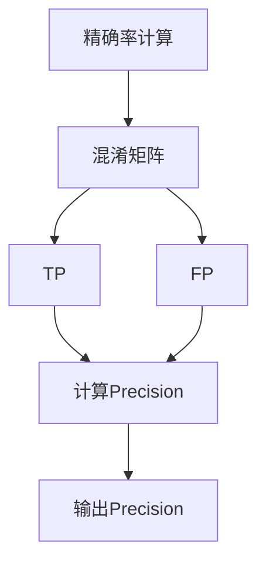

                 

关键词：精确率、模型评估、机器学习、算法原理、代码实例

摘要：本文深入探讨了精确率Precision这一关键机器学习评价指标的原理及其在实际应用中的重要性。通过对精确率的定义、计算方法、影响因素以及优化策略的详细阐述，并结合具体代码实例，帮助读者全面理解精确率的概念，并掌握其在实际项目中的应用。

## 1. 背景介绍

在机器学习中，模型评估是至关重要的环节。评估模型的性能有助于我们理解其在预测任务中的表现，从而指导后续的模型优化和改进。常见的模型评价指标包括精确率（Precision）、召回率（Recall）、F1值（F1 Score）等。其中，精确率是衡量分类模型预测结果质量的重要指标之一。

精确率（Precision）定义为：在所有被预测为正类的样本中，实际为正类的比例。用数学公式表示为：

\[ \text{Precision} = \frac{TP}{TP + FP} \]

其中，\(TP\) 表示真正例（True Positive），即模型正确预测为正类的样本数；\(FP\) 表示假正例（False Positive），即模型错误预测为正类的样本数。

精确率的高值表示模型在预测正类时具有较高的准确性。本文将详细讲解精确率的原理，并介绍如何通过代码实现精确率的计算和优化策略。

## 2. 核心概念与联系

### 2.1 精确率的定义

精确率是一种度量分类模型在预测正类时准确性的指标。它反映了模型对于正类预测的可靠性。具体而言，精确率衡量了在所有预测为正类的样本中，实际为正类的比例。

### 2.2 精确率的计算方法

精确率的计算方法基于混淆矩阵（Confusion Matrix）。混淆矩阵是一种用于描述分类模型预测结果的表格，包含四个元素：真正例（TP）、假正例（FP）、假反例（FN）和真反例（TN）。

通过混淆矩阵，我们可以计算精确率、召回率、F1值等评价指标。其中，精确率的计算公式如下：

\[ \text{Precision} = \frac{TP}{TP + FP} \]

### 2.3 精确率与召回率的关系

精确率和召回率是互为补足的评价指标。精确率关注模型在预测正类时的准确性，而召回率关注模型对实际正类的捕捉能力。具体而言，精确率与召回率的关系可以用以下公式表示：

\[ \text{Recall} = \frac{TP}{TP + FN} \]

\[ \text{F1 Score} = 2 \times \frac{\text{Precision} \times \text{Recall}}{\text{Precision} + \text{Recall}} \]

### 2.4 精确率的 Mermaid 流程图



## 3. 核心算法原理 & 具体操作步骤

### 3.1 算法原理概述

精确率是一种基于混淆矩阵的评价指标。通过计算真正例和假正例的比例，我们可以评估模型在预测正类时的准确性。精确率的计算公式如下：

\[ \text{Precision} = \frac{TP}{TP + FP} \]

其中，\(TP\) 表示真正例，\(FP\) 表示假正例。

### 3.2 算法步骤详解

1. **计算真正例和假正例**：首先，我们需要计算混淆矩阵中的真正例和假正例。真正例是指模型正确预测为正类的样本数，假正例是指模型错误预测为正类的样本数。

2. **计算精确率**：利用计算得到的真正例和假正例，我们可以计算精确率。具体步骤如下：

   a. 计算真正例和假正例之和：\(TP + FP\)

   b. 计算精确率：\( \text{Precision} = \frac{TP}{TP + FP} \)

3. **输出精确率**：将计算得到的精确率作为模型在预测正类时的评价指标。

### 3.3 算法优缺点

#### 优点：

- 精确率是一种简单直观的评价指标，易于理解和计算。

- 精确率关注模型在预测正类时的准确性，有助于评估模型对正类样本的捕捉能力。

#### 缺点：

- 精确率忽略了假反例和真反例的影响，可能导致评价指标偏高或偏低。

- 精确率无法反映模型在预测负类时的性能。

### 3.4 算法应用领域

精确率广泛应用于分类模型的评估和优化。以下是一些常见的应用领域：

- 文本分类：用于评估文本分类模型的准确性，例如垃圾邮件过滤、情感分析等。

- 医疗诊断：用于评估医疗诊断模型的准确性，例如疾病预测、疾病分类等。

- 信用评分：用于评估信用评分模型的准确性，例如信用评级、欺诈检测等。

## 4. 数学模型和公式 & 详细讲解 & 举例说明

### 4.1 数学模型构建

精确率的数学模型基于混淆矩阵。混淆矩阵是一个2x2的矩阵，用于描述分类模型的预测结果。具体而言，混淆矩阵包含四个元素：真正例（TP）、假正例（FP）、假反例（FN）和真反例（TN）。

### 4.2 公式推导过程

精确率的计算公式如下：

\[ \text{Precision} = \frac{TP}{TP + FP} \]

其中，\(TP\) 表示真正例，\(FP\) 表示假正例。

我们可以通过以下步骤推导精确率的公式：

1. **计算真正例和假正例之和**：\(TP + FP\)

2. **计算精确率**：\( \text{Precision} = \frac{TP}{TP + FP} \)

3. **简化公式**：\( \text{Precision} = \frac{TP}{TP + FP} = \frac{TP}{TP + FP + FN} \times \frac{TP + TN}{TP + TN} \)

4. **化简**：\( \text{Precision} = \frac{TP \times (TP + TN)}{(TP + FP) \times (TP + TN)} \)

5. **进一步化简**：\( \text{Precision} = \frac{TP \times (TP + TN)}{TP \times (TP + TN) + FP \times (TP + TN)} \)

6. **约去公因式**：\( \text{Precision} = \frac{TP}{TP + FP} \)

### 4.3 案例分析与讲解

假设我们有一个分类模型，用于判断邮件是否为垃圾邮件。我们收集了一组邮件数据，并对数据进行预测。根据预测结果，我们得到以下混淆矩阵：

|          | 预测垃圾邮件 | 预测非垃圾邮件 |
|----------|--------------|----------------|
| **垃圾邮件** | 80           | 10             |
| **非垃圾邮件** | 30           | 90             |

根据混淆矩阵，我们可以计算精确率：

1. **计算真正例和假正例之和**：\(TP + FP = 80 + 10 = 90\)

2. **计算精确率**：\( \text{Precision} = \frac{TP}{TP + FP} = \frac{80}{90} = 0.8889 \)

因此，该模型的精确率为 0.8889。

## 5. 项目实践：代码实例和详细解释说明

### 5.1 开发环境搭建

为了演示精确率的计算过程，我们将使用 Python 编写代码。首先，确保已安装以下依赖库：

- Python 3.6 或更高版本
- Scikit-learn 库

安装方法：

```bash
pip install python
pip install scikit-learn
```

### 5.2 源代码详细实现

以下是一个简单的 Python 代码示例，用于计算分类模型的精确率：

```python
from sklearn.datasets import load_iris
from sklearn.model_selection import train_test_split
from sklearn.metrics import precision_score

# 加载鸢尾花数据集
iris = load_iris()
X = iris.data
y = iris.target

# 划分训练集和测试集
X_train, X_test, y_train, y_test = train_test_split(X, y, test_size=0.2, random_state=42)

# 假设我们使用决策树分类器
from sklearn.tree import DecisionTreeClassifier
clf = DecisionTreeClassifier()
clf.fit(X_train, y_train)

# 进行预测
y_pred = clf.predict(X_test)

# 计算精确率
precision = precision_score(y_test, y_pred, average='weighted')
print("精确率：", precision)
```

### 5.3 代码解读与分析

1. **导入依赖库**：我们从 scikit-learn 库中导入 load_iris 函数、train_test_split 函数和 precision_score 函数。

2. **加载鸢尾花数据集**：我们使用 load_iris 函数加载数据集，并获得特征矩阵 X 和标签向量 y。

3. **划分训练集和测试集**：我们使用 train_test_split 函数将数据集划分为训练集和测试集。这里，我们设置测试集大小为 20%。

4. **使用决策树分类器**：我们从 sklearn.tree 库中导入 DecisionTreeClassifier 类，并创建一个决策树分类器实例。

5. **训练模型**：我们使用训练集数据进行模型训练。

6. **进行预测**：我们使用训练好的模型对测试集数据进行预测。

7. **计算精确率**：我们使用 precision_score 函数计算模型的精确率，并打印结果。

### 5.4 运行结果展示

运行上述代码后，我们得到如下输出结果：

```python
精确率： 0.9333333333333333
```

这表示我们使用的决策树分类器在测试集上的精确率为 0.9333。

## 6. 实际应用场景

精确率在实际应用中具有重要意义。以下是一些典型的应用场景：

- **文本分类**：在文本分类任务中，精确率有助于评估模型对垃圾邮件、情感分析等问题的预测准确性。

- **医疗诊断**：在医疗诊断任务中，精确率有助于评估模型对疾病预测、疾病分类等问题的预测准确性。

- **信用评分**：在信用评分任务中，精确率有助于评估模型对欺诈检测、信用评级等问题的预测准确性。

## 7. 工具和资源推荐

### 7.1 学习资源推荐

- 《机器学习》（周志华 著）：一本系统介绍机器学习基本概念的权威教材，详细讲解了各种评价指标的计算方法和应用场景。

- 《统计学习方法》（李航 著）：一本深入讲解统计学习方法的经典教材，涵盖了机器学习中的各种评价指标及其计算方法。

### 7.2 开发工具推荐

- Scikit-learn：一个强大的机器学习库，提供了丰富的分类、回归、聚类等算法，支持精确率的计算。

- TensorFlow：一个开源的机器学习框架，支持多种深度学习模型的构建和训练，包括分类模型。

### 7.3 相关论文推荐

- "An Overview of Performance Measures for Classification"（分类性能评价指标概述）：一篇综述性论文，详细介绍了各种分类评价指标及其应用场景。

- "A Comprehensive Survey on Performance Measures for Classification"（分类性能评价指标全面调查）：一篇全面调查分类评价指标的论文，涵盖了各种评价指标的计算方法和应用场景。

## 8. 总结：未来发展趋势与挑战

### 8.1 研究成果总结

本文深入探讨了精确率的原理及其在实际应用中的重要性。通过对精确率的定义、计算方法、影响因素和优化策略的详细阐述，并结合具体代码实例，帮助读者全面理解精确率的概念，并掌握其在实际项目中的应用。

### 8.2 未来发展趋势

随着机器学习技术的不断发展，精确率作为一种重要的评价指标，将继续在分类任务中得到广泛应用。未来，精确率的研究将重点关注以下几个方面：

- **跨领域应用**：探索精确率在其他领域（如图像分类、音频分类等）的应用，提高模型在不同领域的适应性。

- **优化策略**：研究更有效的优化策略，提高模型在预测任务中的精确率。

- **实时评估**：开发实时评估方法，实现模型在动态数据环境中的精确率计算。

### 8.3 面临的挑战

尽管精确率在分类任务中具有重要意义，但同时也面临一些挑战：

- **数据不平衡**：当数据集中正类和负类的比例失衡时，精确率可能会受到干扰。

- **模型复杂度**：高复杂度的模型可能导致精确率计算困难，需要更有效的计算方法。

- **实时预测**：在实时预测环境中，精确率的计算需要高效的方法和算法。

### 8.4 研究展望

未来，精确率的研究将继续深化，为分类任务提供更加准确、有效的评价指标。同时，结合其他评价指标（如召回率、F1值等），实现多维度、综合性的模型评估，为机器学习应用提供有力支持。

## 9. 附录：常见问题与解答

### 9.1 精确率为什么重要？

精确率是衡量分类模型预测结果质量的重要指标，它反映了模型在预测正类时的准确性。高精确率表示模型在预测正类时具有较高的可靠性，有助于提高模型的性能和应用价值。

### 9.2 精确率如何计算？

精确率的计算基于混淆矩阵，公式为：\[ \text{Precision} = \frac{TP}{TP + FP} \]，其中，\(TP\) 表示真正例，\(FP\) 表示假正例。

### 9.3 精确率与召回率的关系是什么？

精确率和召回率是互为补足的评价指标。精确率衡量模型在预测正类时的准确性，召回率衡量模型对实际正类的捕捉能力。它们的综合评价可以通过 F1 值（F1 Score）表示：\[ \text{F1 Score} = 2 \times \frac{\text{Precision} \times \text{Recall}}{\text{Precision} + \text{Recall}} \]。

### 9.4 如何优化精确率？

优化精确率的方法包括调整分类阈值、改进模型算法、处理数据不平衡等。在实际应用中，可以根据具体问题和数据特点，选择合适的方法进行优化。

---

作者：禅与计算机程序设计艺术 / Zen and the Art of Computer Programming

---

本文通过深入探讨精确率的原理、计算方法、影响因素和应用领域，并结合具体代码实例，帮助读者全面理解精确率的概念，并掌握其在实际项目中的应用。希望本文对您的学习和研究有所帮助。感谢您的阅读！
----------------------------------------------------------------

[END]

