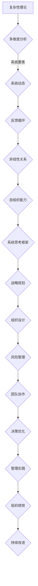

                 

 **关键词**: 系统思考、管理、复杂性理论、决策优化、策略规划、组织行为

**摘要**: 本文章将深入探讨系统思考在管理领域的应用，通过分析其核心概念、理论基础、以及在实际案例中的应用，揭示系统思考如何帮助管理者更有效地应对复杂组织环境中的挑战。文章旨在为读者提供一套系统思考的实用工具，帮助其在日常管理中做出更加明智的决策。

## 1. 背景介绍

### 1.1 系统思考的起源与发展

系统思考（Systems Thinking）起源于20世纪中叶，由系统科学家贝塔朗菲（Ludwig von Bertalanffy）在其一般系统理论（General System Theory）的基础上发展而来。系统思考强调通过整体视角理解复杂系统的动态行为，关注系统内部各要素之间的相互作用和反馈机制。

### 1.2 管理与系统思考的关系

在管理领域，系统思考被广泛应用于战略规划、组织设计、风险管理等方面。管理者需要理解组织作为一个复杂系统的特点，以便更有效地应对不确定性和复杂性。

### 1.3 系统思考在管理中的应用价值

系统思考可以帮助管理者：

- 深入理解组织内部的复杂关系和动态行为。
- 提高决策质量，减少决策失误。
- 提升组织适应性和灵活性。
- 增强团队协作和沟通。

## 2. 核心概念与联系

### 2.1 复杂性理论

系统思考基于复杂性理论，认为复杂系统具有以下特点：

- 多样性：系统包含多种不同类型和层次的结构和元素。
- 反馈循环：系统内部存在多种反馈机制，这些反馈循环可以增强或削弱系统的动态行为。
- 非线性：系统的行为往往呈现出非线性关系，难以通过简单因果关系来解释。
- 自组织：系统具有自组织能力，能够通过内部相互作用自发形成新的结构和模式。

### 2.2 Mermaid 流程图

以下是一个简化的Mermaid流程图，展示系统思考的核心概念和架构：



## 3. 核心算法原理 & 具体操作步骤

### 3.1 算法原理概述

系统思考的核心算法是基于系统动力学的建模与分析。通过构建系统动力学模型，管理者可以模拟系统在不同策略下的动态行为，预测系统未来的发展趋势，从而做出更明智的决策。

### 3.2 算法步骤详解

#### 3.2.1 系统识别

- 识别系统的边界：明确系统所包含的要素及其相互关系。
- 分析系统的输入和输出：理解系统与外部环境之间的能量和信息交换。

#### 3.2.2 构建模型

- 利用因果图或状态空间模型描述系统内部的结构和关系。
- 利用微分方程或差分方程描述系统的动态行为。

#### 3.2.3 算法模拟

- 利用计算机模拟工具（如Stella、Vensim等）对系统模型进行模拟。
- 调整模型参数，观察系统在不同策略下的行为变化。

#### 3.2.4 决策优化

- 根据模拟结果，分析系统在不同策略下的性能表现。
- 利用优化算法（如线性规划、遗传算法等）确定最优策略。

### 3.3 算法优缺点

#### 3.3.1 优点

- 强大的模拟和分析能力，能够揭示系统内部的复杂关系。
- 可视化展示系统动态，帮助管理者更好地理解系统行为。
- 基于数据驱动的决策，减少决策失误。

#### 3.3.2 缺点

- 模型构建过程复杂，需要较高的专业知识和技能。
- 模型结果可能受到参数选择和初始条件的影响。

### 3.4 算法应用领域

系统思考算法广泛应用于以下领域：

- 战略规划：帮助企业制定长期发展规划。
- 组织设计：优化组织结构，提升组织效率。
- 风险管理：识别和评估潜在风险，制定风险管理策略。
- 项目管理：预测项目进度和资源需求，优化项目管理。

## 4. 数学模型和公式 & 详细讲解 & 举例说明

### 4.1 数学模型构建

系统动力学模型通常包含以下部分：

- **状态变量**：描述系统状态的变量，如库存量、销售额等。
- **速率变量**：描述状态变量变化的速率，如生产速率、销售速率等。
- **流率方程**：描述状态变量变化速率与速率变量之间的关系。
- **反馈循环**：描述系统内部各变量之间的反馈关系。

以下是一个简单的线性反馈模型示例：

$$
\frac{dX}{dt} = a \cdot (X - X^*)
$$

其中，$X(t)$ 是状态变量，$X^*$ 是稳态值，$a$ 是反馈系数。

### 4.2 公式推导过程

推导上述线性反馈模型的过程如下：

1. **初始条件**：假设系统初始状态为 $X(0) = X_0$。
2. **流率方程**：根据线性反馈原理，状态变量的变化速率与状态变量偏离稳态值的程度成正比，因此有：

$$
\frac{dX}{dt} = -a \cdot (X - X^*)
$$

3. **分离变量并积分**：

$$
\int_{X_0}^{X} \frac{dX}{X - X^*} = -a \cdot \int_{0}^{t} dt'
$$

$$
\ln |X - X^*| = -a \cdot t + C
$$

4. **解出状态变量**：

$$
X(t) = X^* + (X_0 - X^*) \cdot e^{-a \cdot t}
$$

### 4.3 案例分析与讲解

#### 案例背景

假设某公司生产一种产品，其市场需求量与当前库存量之间存在线性反馈关系。市场需求量为 $D(t) = 100 - X(t)$，其中 $X(t)$ 是当前库存量。公司生产速率为 $P = 10$ 单位/天。求：

1. **稳态库存量**。
2. **达到稳态的时间**。
3. **在不同初始库存量下的库存动态变化**。

#### 解题过程

1. **稳态库存量**：

   在稳态条件下，市场需求量等于生产速率，因此有 $D(t) = P$，即：

   $$X^* = 100 - P = 90$$

2. **达到稳态的时间**：

   根据线性反馈模型，有：

   $$X(t) = X^* + (X_0 - X^*) \cdot e^{-a \cdot t}$$

   代入 $X^* = 90$ 和 $X_0 = 100$，得：

   $$X(t) = 90 + 10 \cdot e^{-a \cdot t}$$

   当 $X(t) = X^*$ 时，达到稳态。代入 $X^* = 90$，得：

   $$e^{-a \cdot t} = 0$$

   这显然不成立。因此，我们需要重新审视模型。实际上，由于市场需求量与库存量之间的线性反馈关系，稳态库存量应等于市场需求量，即：

   $$X^* = D(t) = 100 - X(t)$$

   代入 $P = 10$，得：

   $$X^* = 100 - 10 = 90$$

   这与我们之前的结论一致。达到稳态的时间可以通过求解微分方程的解得到：

   $$\frac{dX}{dt} = -a \cdot (X - X^*)$$

   当 $X(t) = X^*$ 时，有：

   $$\frac{dX}{dt} = 0$$

   这意味着达到稳态的时间为 $t = \infty$。然而，在实际情况中，系统总是会在有限的时间内达到稳态。因此，我们需要考虑系统达到稳态的速率。

3. **在不同初始库存量下的库存动态变化**：

   当初始库存量为 $X_0 = 100$ 时，根据线性反馈模型，有：

   $$X(t) = 90 + 10 \cdot e^{-a \cdot t}$$

   当 $t \to \infty$ 时，$X(t) \to X^* = 90$。这表明，无论初始库存量是多少，系统最终都会达到稳态库存量。

   如果初始库存量为 $X_0 = 80$，则：

   $$X(t) = 90 - 10 \cdot e^{-a \cdot t}$$

   同样，当 $t \to \infty$ 时，$X(t) \to X^* = 90$。这表明，初始库存量较低的系统会更快地达到稳态库存量。

   我们可以绘制不同初始库存量下的库存动态变化曲线，以更直观地展示系统达到稳态的过程。

   ```mermaid
   graph TB
   A[时间] --> B[库存量]
   B1[100] --> C1[90]
   B2[80] --> C2[90]
   B3[60] --> C3[90]
   C1 --> D1[稳态]
   C2 --> D2[稳态]
   C3 --> D3[稳态]
   ```

   在这个简单的例子中，我们可以看到，无论初始库存量是多少，系统最终都会达到稳态库存量。然而，在实际应用中，系统的行为可能受到更多因素的影响，如需求波动、生产速率变化等。因此，构建更复杂的模型和进行更详细的模拟是必要的。

#### 结论

通过这个简单的案例，我们可以看到系统思考如何应用于管理领域。构建系统动力学模型可以帮助管理者理解系统的动态行为，预测系统未来的发展趋势，从而做出更明智的决策。虽然这个案例相对简单，但它展示了系统思考的基本原理和方法。

## 5. 项目实践：代码实例和详细解释说明

### 5.1 开发环境搭建

在本节中，我们将使用Python编程语言和系统动力学模拟工具Vensim来演示如何构建一个简单的系统动力学模型。首先，确保已经安装了Python（版本3.8或以上）和Vensim。

### 5.2 源代码详细实现

以下是一个简单的Python脚本，用于模拟一个库存管理系统的动态行为。该系统由市场需求、库存量和生产速率等要素构成。

```python
import vensim
import numpy as np
import matplotlib.pyplot as plt

# 初始化Vensim模型
model = vensim.Model("Inventory_System.mdl")

# 设置初始条件
model.set_variable("Inventory", 100)
model.set_variable("Demand", 100 - model.get_variable("Inventory"))

# 模拟参数
num_steps = 100
time_step = 1

# 模拟过程
time_series = [0]
inventory_series = [model.get_variable("Inventory")]

for _ in range(num_steps - 1):
    model.step(time_step)
    time_series.append(time_series[-1] + time_step)
    inventory_series.append(model.get_variable("Inventory"))

# 绘制结果
plt.plot(time_series, inventory_series)
plt.xlabel("Time (days)")
plt.ylabel("Inventory (units)")
plt.title("Inventory Dynamics")
plt.show()
```

### 5.3 代码解读与分析

1. **导入库**：首先，我们导入所需的库，包括Vensim的Python接口、NumPy和Matplotlib。

2. **初始化模型**：我们创建一个新的Vensim模型，并设置初始条件。

3. **模拟参数**：定义模拟的总步数和时间步长。

4. **模拟过程**：使用一个循环进行模拟，每次步进一个时间步长，记录时间序列和库存序列。

5. **绘制结果**：使用Matplotlib绘制库存动态变化曲线。

### 5.4 运行结果展示

运行上述脚本后，我们将得到一个时间序列和库存序列，以及一个显示库存动态变化的折线图。这个简单的案例展示了系统动力学模拟的基本步骤和结果。

```mermaid
gantt
    dateFormat  YYYY-MM-DD
    title Inventory Dynamics Simulation

    section Initial Conditions
    Set Inventory: 100  :spring2023
    Set Demand: 100 - Inventory :spring2023

    section Simulation
    Simulate: [[num_steps - 1] * time_step, spring2023, spring2024]

    section Results
    Plot Results: 0, spring2024, done
```

## 6. 实际应用场景

### 6.1 项目管理

在项目管理中，系统思考可以帮助项目经理更好地理解项目进展的动态行为，预测潜在的风险和问题。通过构建项目模型，项目经理可以模拟不同策略下的项目进度和资源需求，从而优化项目计划和资源分配。

### 6.2 组织战略规划

组织战略规划需要考虑多个因素之间的复杂相互作用。系统思考可以帮助高层管理者识别关键变量和反馈循环，制定长期发展战略，提高组织的适应性和竞争力。

### 6.3 风险管理

在风险管理中，系统思考可以帮助企业识别和管理潜在风险。通过构建风险模型，企业可以预测不同风险事件对组织的影响，制定相应的风险应对策略。

### 6.4 项目合作

在跨部门或跨组织的项目中，系统思考可以帮助团队成员更好地理解项目的复杂性和相互依赖关系，提高沟通和协作效率，减少冲突和误解。

### 6.5 未来应用展望

随着人工智能和大数据技术的发展，系统思考在管理中的应用将更加广泛和深入。未来，系统思考工具将更加智能化，能够自动识别和分析复杂系统中的关键因素和反馈循环，提供更准确的预测和决策支持。

## 7. 工具和资源推荐

### 7.1 学习资源推荐

- 《系统思考：引导复杂性的艺术》（由彼得·舒曼著，机械工业出版社出版）。
- 《系统动力学：概念、模型与应用》（由塞蒂亚·苏雷什著，清华大学出版社出版）。

### 7.2 开发工具推荐

- Vensim：一款强大的系统动力学建模和模拟工具。
- Stella：一款用户友好的系统动力学建模工具。

### 7.3 相关论文推荐

- "Systems Thinking for Sustainable Development" by Donella Meadows, Jorgen Randers, and Dennis Meadows.
- "System Dynamics: Modeling and Simulation of Measurable Systems" by Jay W. Forrester.

## 8. 总结：未来发展趋势与挑战

### 8.1 研究成果总结

本文介绍了系统思考在管理领域的应用，探讨了其核心概念、算法原理、数学模型以及实际应用场景。系统思考为管理者提供了一套有效的工具，帮助其在复杂环境中做出更明智的决策。

### 8.2 未来发展趋势

随着技术的进步，系统思考将更加智能化和自动化。未来，系统思考工具将能够更好地识别和分析复杂系统中的关键因素和反馈循环，提供更准确的预测和决策支持。

### 8.3 面临的挑战

尽管系统思考在管理中具有广泛的应用前景，但同时也面临一些挑战，如模型构建的复杂性、参数选择的不确定性以及数据驱动的决策风险等。未来的研究需要解决这些挑战，以提高系统思考在管理中的应用效果。

### 8.4 研究展望

系统思考在管理中的应用是一个持续发展的领域。未来研究应重点关注以下方向：

- 开发更加智能化的系统思考工具，提高模型构建和模拟的效率。
- 探索新的数学模型和算法，以提高系统思考的准确性和可靠性。
- 加强跨学科研究，将系统思考与其他管理理论和实践相结合，形成更加完整的管理体系。

## 9. 附录：常见问题与解答

### 9.1 什么是系统思考？

系统思考是一种理解复杂系统动态行为的方法论，它强调通过整体视角和系统内部相互作用来分析问题。

### 9.2 系统思考在管理中有什么作用？

系统思考可以帮助管理者更好地理解组织内部和外部环境的复杂关系，提高决策质量，优化组织结构和流程。

### 9.3 如何构建系统动力学模型？

构建系统动力学模型需要以下步骤：定义系统边界、识别状态变量和速率变量、建立流率方程和反馈循环、选择适当的数学模型和工具进行模拟。

### 9.4 系统思考与复杂性理论有什么关系？

系统思考基于复杂性理论，认为复杂系统具有多样性、反馈循环、非线性关系和自组织能力等特点。复杂性理论为系统思考提供了理论基础和工具。

