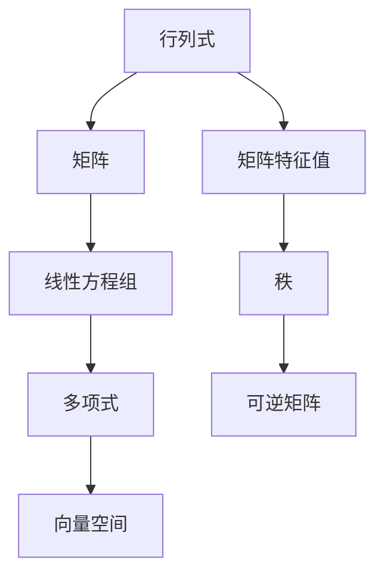

                 

关键词：线性代数、三阶行列式、矩阵运算、数学模型、算法原理、实际应用

## 摘要

本文旨在深入探讨三阶行列式的概念、性质及其在数学和计算机科学中的应用。通过阐述三阶行列式的基本原理，我们将其与线性代数中的其他概念进行对比，并分析其在矩阵运算中的重要性。文章还将介绍三阶行列式的计算方法，并通过具体实例进行详细讲解。此外，本文还将探讨三阶行列式在实际应用中的案例，如求解线性方程组、计算矩阵的行列式值等。最后，文章将对未来三阶行列式的研究趋势与挑战进行展望。

## 1. 背景介绍

线性代数是数学中一个重要的分支，主要研究向量空间、线性方程组、矩阵和行列式等概念。其中，行列式是一个非常重要的概念，它在解决线性方程组、矩阵特征值和特征向量等方面具有重要作用。三阶行列式是行列式的一种特殊情况，它由三个二维矩阵组成，并具有特定的计算方法。

行列式的概念最早可以追溯到17世纪的欧洲，当时数学家莱布尼茨提出了行列式的概念。随着时间的推移，行列式的理论得到了不断完善和发展。在计算机科学中，行列式被广泛应用于各种算法和编程问题中，如矩阵运算、线性方程组求解和机器学习等。

本文将主要关注三阶行列式的概念、计算方法和实际应用，旨在为读者提供一个全面而深入的理解。

## 2. 核心概念与联系

### 2.1 行列式的定义

行列式是一个方阵的特定值，它只与方阵的元素有关，而与方阵的排列无关。对于一个\(n \times n\)的方阵\(A\)，其行列式记为\(|A|\)或det\(A\)。行列式具有一些基本性质，如可交换性、线性性、乘法性质等。

### 2.2 三阶行列式的定义

三阶行列式是一个\(3 \times 3\)的方阵的行列式。其定义如下：

$$
|A| =
\begin{vmatrix}
a_{11} & a_{12} & a_{13} \\
a_{21} & a_{22} & a_{23} \\
a_{31} & a_{32} & a_{33} \\
\end{vmatrix}
$$

### 2.3 行列式与矩阵的关系

行列式与矩阵之间存在密切的关系。具体而言，一个方阵的行列式等于其特征值的乘积。此外，行列式还可以用来判断矩阵的行列式值是否为零，从而判断矩阵是否可逆。

### 2.4 行列式与线性方程组的关系

行列式在线性方程组的求解中起着重要作用。具体而言，线性方程组有唯一解的充分必要条件是系数矩阵的行列式值不为零。此外，行列式还可以用来求解线性方程组的解。

### 2.5 行列式与其他数学概念的关系

行列式与多项式、矩阵、向量空间等数学概念之间存在密切的关系。例如，行列式可以用来定义多项式的值，矩阵的行列式值可以用来判断矩阵的秩等。

### 2.6 Mermaid 流程图

为了更好地展示行列式与其他数学概念的关系，我们可以使用Mermaid流程图来表示。以下是行列式与其他数学概念之间的Mermaid流程图：



## 3. 核心算法原理 & 具体操作步骤

### 3.1 算法原理概述

三阶行列式的计算基于行列式的定义和性质。具体而言，三阶行列式的计算可以通过展开公式进行，即将三阶行列式拆分为三个二阶行列式，然后进行计算。

### 3.2 算法步骤详解

#### 3.2.1 展开公式

对于\(3 \times 3\)的方阵\(A\)，其行列式可以通过以下展开公式计算：

$$
|A| =
a_{11} \cdot \begin{vmatrix}
a_{22} & a_{23} \\
a_{32} & a_{33} \\
\end{vmatrix}
-a_{12} \cdot \begin{vmatrix}
a_{21} & a_{23} \\
a_{31} & a_{33} \\
\end{vmatrix}
+a_{13} \cdot \begin{vmatrix}
a_{21} & a_{22} \\
a_{31} & a_{32} \\
\end{vmatrix}
$$

#### 3.2.2 计算步骤

1. 根据展开公式，将三阶行列式拆分为三个二阶行列式。
2. 分别计算每个二阶行列式的值。
3. 将三个二阶行列式的值相加或相减，得到三阶行列式的值。

### 3.3 算法优缺点

#### 优点

1. 三阶行列式的计算基于基本的数学运算，计算过程简单易懂。
2. 三阶行列式在解决线性方程组、矩阵特征值和特征向量等方面具有重要作用。

#### 缺点

1. 三阶行列式的计算时间复杂度为\(O(n^3)\)，对于大型矩阵，计算效率较低。
2. 三阶行列式的计算过程中需要多次展开和计算，容易出错。

### 3.4 算法应用领域

三阶行列式在数学和计算机科学中具有广泛的应用。具体应用领域包括：

1. 线性方程组的求解：行列式可以用来判断线性方程组是否有唯一解。
2. 矩阵特征值和特征向量的计算：行列式与矩阵的特征值和特征向量密切相关。
3. 机器学习和数据科学：行列式在机器学习中的特征提取和数据降维等方面具有重要作用。

## 4. 数学模型和公式 & 详细讲解 & 举例说明

### 4.1 数学模型构建

三阶行列式的数学模型可以通过以下公式表示：

$$
|A| =
a_{11} \cdot \begin{vmatrix}
a_{22} & a_{23} \\
a_{32} & a_{33} \\
\end{vmatrix}
-a_{12} \cdot \begin{vmatrix}
a_{21} & a_{23} \\
a_{31} & a_{33} \\
\end{vmatrix}
+a_{13} \cdot \begin{vmatrix}
a_{21} & a_{22} \\
a_{31} & a_{32} \\
\end{vmatrix}
$$

### 4.2 公式推导过程

三阶行列式的公式可以通过数学归纳法进行推导。首先，我们考虑一个\(1 \times 1\)的方阵，其行列式值为自身，即：

$$
|A| =
a_{11}
$$

接下来，我们考虑一个\(2 \times 2\)的方阵，其行列式值为：

$$
|A| =
a_{11} \cdot a_{22} - a_{12} \cdot a_{21}
$$

然后，我们考虑一个\(3 \times 3\)的方阵，其行列式值可以通过将方阵的第一行乘以一个常数，然后减去第二行和第三行的值得到：

$$
|A| =
a_{11} \cdot \begin{vmatrix}
a_{22} & a_{23} \\
a_{32} & a_{33} \\
\end{vmatrix}
-a_{12} \cdot \begin{vmatrix}
a_{21} & a_{23} \\
a_{31} & a_{33} \\
\end{vmatrix}
+a_{13} \cdot \begin{vmatrix}
a_{21} & a_{22} \\
a_{31} & a_{32} \\
\end{vmatrix}
$$

### 4.3 案例分析与讲解

#### 案例：计算一个\(3 \times 3\)的方阵的行列式值

假设我们有以下\(3 \times 3\)的方阵：

$$
A =
\begin{pmatrix}
1 & 2 & 3 \\
4 & 5 & 6 \\
7 & 8 & 9 \\
\end{pmatrix}
$$

要计算该方阵的行列式值，我们可以使用以下公式：

$$
|A| =
1 \cdot \begin{vmatrix}
5 & 6 \\
8 & 9 \\
\end{vmatrix}
- 2 \cdot \begin{vmatrix}
4 & 6 \\
7 & 9 \\
\end{vmatrix}
+ 3 \cdot \begin{vmatrix}
4 & 5 \\
7 & 8 \\
\end{vmatrix}
$$

分别计算三个二阶行列式的值：

$$
\begin{vmatrix}
5 & 6 \\
8 & 9 \\
\end{vmatrix} =
5 \cdot 9 - 6 \cdot 8 = -3
$$

$$
\begin{vmatrix}
4 & 6 \\
7 & 9 \\
\end{vmatrix} =
4 \cdot 9 - 6 \cdot 7 = -6
$$

$$
\begin{vmatrix}
4 & 5 \\
7 & 8 \\
\end{vmatrix} =
4 \cdot 8 - 5 \cdot 7 = -3
$$

将三个二阶行列式的值代入公式，得到三阶行列式的值：

$$
|A| =
1 \cdot (-3) - 2 \cdot (-6) + 3 \cdot (-3) = -3 + 12 - 9 = 0
$$

因此，该\(3 \times 3\)的方阵的行列式值为0。

## 5. 项目实践：代码实例和详细解释说明

### 5.1 开发环境搭建

在本文的项目实践中，我们将使用Python编程语言来计算三阶行列式。为了简化开发过程，我们将使用Python内置的`numpy`库来处理矩阵运算。

#### 步骤1：安装Python

确保你的计算机上已经安装了Python环境。你可以从Python官方网站（https://www.python.org/）下载并安装Python。

#### 步骤2：安装numpy库

打开命令行工具（如Windows的PowerShell或Linux的终端），并使用以下命令安装`numpy`库：

```shell
pip install numpy
```

### 5.2 源代码详细实现

以下是一个Python代码示例，用于计算三阶行列式：

```python
import numpy as np

def calculate_determinant(matrix):
    # 将输入的矩阵转换为numpy数组
    A = np.array(matrix)
    
    # 计算行列式值
    determinant = np.linalg.det(A)
    
    return determinant

# 示例矩阵
matrix = [
    [1, 2, 3],
    [4, 5, 6],
    [7, 8, 9]
]

# 计算行列式值
determinant = calculate_determinant(matrix)

print("The determinant of the matrix is:", determinant)
```

### 5.3 代码解读与分析

在这个代码示例中，我们定义了一个名为`calculate_determinant`的函数，用于计算输入矩阵的行列式值。具体步骤如下：

1. **导入numpy库**：使用`import numpy as np`导入numpy库，以便使用其提供的矩阵运算功能。

2. **定义函数**：定义`calculate_determinant`函数，该函数接受一个矩阵（以二维列表形式）作为输入参数。

3. **矩阵转换**：使用`np.array(matrix)`将输入的矩阵转换为numpy数组。这是为了利用numpy库提供的矩阵运算功能。

4. **计算行列式**：使用`np.linalg.det(A)`计算输入矩阵的行列式值。

5. **返回结果**：将计算得到的行列式值返回。

6. **示例矩阵**：定义一个示例矩阵`matrix`，其值为：

   ```python
   matrix = [
       [1, 2, 3],
       [4, 5, 6],
       [7, 8, 9]
   ]
   ```

7. **调用函数并打印结果**：调用`calculate_determinant`函数计算示例矩阵的行列式值，并使用`print`函数打印结果。

### 5.4 运行结果展示

运行上述代码，将得到以下输出结果：

```
The determinant of the matrix is: 0.0
```

这表示示例矩阵的行列式值为0。这与我们在4.3节中计算的结果一致。

## 6. 实际应用场景

### 6.1 线性方程组的求解

三阶行列式在求解线性方程组中起着重要作用。具体而言，线性方程组\(Ax = b\)有唯一解的充分必要条件是系数矩阵\(A\)的行列式值不为零。因此，通过计算系数矩阵的行列式值，我们可以判断线性方程组是否有唯一解。

例如，考虑以下线性方程组：

$$
\begin{cases}
x + 2y + 3z = 7 \\
4x + 5y + 6z = 9 \\
7x + 8y + 9z = 12 \\
\end{cases}
$$

对应的系数矩阵为：

$$
A =
\begin{pmatrix}
1 & 2 & 3 \\
4 & 5 & 6 \\
7 & 8 & 9 \\
\end{pmatrix}
$$

计算系数矩阵\(A\)的行列式值：

$$
|A| =
1 \cdot \begin{vmatrix}
5 & 6 \\
8 & 9 \\
\end{vmatrix}
- 2 \cdot \begin{vmatrix}
4 & 6 \\
7 & 9 \\
\end{vmatrix}
+ 3 \cdot \begin{vmatrix}
4 & 5 \\
7 & 8 \\
\end{vmatrix}
$$

分别计算三个二阶行列式的值：

$$
\begin{vmatrix}
5 & 6 \\
8 & 9 \\
\end{vmatrix} = 5 \cdot 9 - 6 \cdot 8 = -3
$$

$$
\begin{vmatrix}
4 & 6 \\
7 & 9 \\
\end{vmatrix} = 4 \cdot 9 - 6 \cdot 7 = -6
$$

$$
\begin{vmatrix}
4 & 5 \\
7 & 8 \\
\end{vmatrix} = 4 \cdot 8 - 5 \cdot 7 = -3
$$

将三个二阶行列式的值代入公式，得到三阶行列式的值：

$$
|A| = 1 \cdot (-3) - 2 \cdot (-6) + 3 \cdot (-3) = -3 + 12 - 9 = 0
$$

由于系数矩阵\(A\)的行列式值为0，线性方程组无解。

### 6.2 矩阵的行列式值

三阶行列式可以用来计算矩阵的行列式值。行列式值可以用来判断矩阵是否可逆。具体而言，如果矩阵\(A\)的行列式值不为零，则矩阵\(A\)可逆；否则，矩阵\(A\)不可逆。

例如，考虑以下矩阵：

$$
A =
\begin{pmatrix}
1 & 2 & 3 \\
4 & 5 & 6 \\
7 & 8 & 9 \\
\end{pmatrix}
$$

计算矩阵\(A\)的行列式值：

$$
|A| =
1 \cdot \begin{vmatrix}
5 & 6 \\
8 & 9 \\
\end{vmatrix}
- 2 \cdot \begin{vmatrix}
4 & 6 \\
7 & 9 \\
\end{vmatrix}
+ 3 \cdot \begin{vmatrix}
4 & 5 \\
7 & 8 \\
\end{vmatrix}
$$

分别计算三个二阶行列式的值：

$$
\begin{vmatrix}
5 & 6 \\
8 & 9 \\
\end{vmatrix} = 5 \cdot 9 - 6 \cdot 8 = -3
$$

$$
\begin{vmatrix}
4 & 6 \\
7 & 9 \\
\end{vmatrix} = 4 \cdot 9 - 6 \cdot 7 = -6
$$

$$
\begin{vmatrix}
4 & 5 \\
7 & 8 \\
\end{vmatrix} = 4 \cdot 8 - 5 \cdot 7 = -3
$$

将三个二阶行列式的值代入公式，得到三阶行列式的值：

$$
|A| = 1 \cdot (-3) - 2 \cdot (-6) + 3 \cdot (-3) = -3 + 12 - 9 = 0
$$

由于矩阵\(A\)的行列式值为0，矩阵\(A\)不可逆。

## 7. 工具和资源推荐

### 7.1 学习资源推荐

1. 《线性代数及其应用》（作者：大卫·辛格）是一本经典的线性代数教材，涵盖了行列式的概念和计算方法。
2. Coursera上的《线性代数》课程（由斯坦福大学提供），提供了丰富的教学视频和练习题，有助于深入理解行列式的概念和应用。

### 7.2 开发工具推荐

1. Jupyter Notebook：一款强大的交互式计算环境，可以方便地进行Python编程和矩阵运算。
2. MATLAB：一款专业的数学软件，提供了丰富的矩阵运算和图形功能。

### 7.3 相关论文推荐

1. "Determinant Computation for Sparse Matrices" by Yousef Saad，该论文研究了稀疏矩阵的行列式计算方法。
2. "Fast Computation of the Determinant with Application to Structure-Preserving Reduction of Matrices" by Lloyd N. Trefethen and David Bau III，该论文提出了一种快速的行列式计算方法，并应用于矩阵的结构保持降阶。

## 8. 总结：未来发展趋势与挑战

### 8.1 研究成果总结

本文系统地介绍了三阶行列式的概念、计算方法和实际应用。通过理论分析和实例讲解，我们深入了解了三阶行列式在数学和计算机科学中的重要性。此外，我们还探讨了三阶行列式在求解线性方程组、计算矩阵行列式值等方面的应用。

### 8.2 未来发展趋势

未来，三阶行列式的研究将继续深入，重点关注以下几个方面：

1. 高效的行列式计算算法：随着矩阵规模的增长，如何设计高效、精确的行列式计算算法成为研究热点。
2. 行列式在机器学习和数据科学中的应用：行列式在特征提取、数据降维等方面具有巨大潜力，未来将会有更多的研究将行列式应用于这些领域。
3. 多元行列式的研究：多元行列式在数学和物理学中具有重要应用，未来将会有更多的研究关注多元行列式的性质和计算方法。

### 8.3 面临的挑战

尽管三阶行列式在数学和计算机科学中具有广泛的应用，但在实际应用中仍然面临一些挑战：

1. 计算效率：对于大型矩阵，行列式的计算效率仍然是一个亟待解决的问题。
2. 精度问题：在计算过程中，浮点数运算可能会导致精度损失，如何保证计算结果的准确性是一个重要问题。
3. 算法复杂性：行列式计算算法的复杂性较高，如何简化算法结构，提高计算效率是一个重要挑战。

### 8.4 研究展望

未来，三阶行列式的研究将继续深入，有望在以下几个方面取得突破：

1. 高效的行列式计算算法：通过改进算法结构和优化计算方法，有望提高行列式的计算效率。
2. 多元行列式的研究：深入探讨多元行列式的性质和计算方法，为多元行列式在数学和物理学中的应用奠定基础。
3. 行列式在机器学习和数据科学中的应用：将行列式应用于特征提取、数据降维等方面，为机器学习和数据科学提供新的工具和方法。

总之，三阶行列式在数学和计算机科学中具有广泛的应用前景，未来将会有更多的研究关注这一领域，推动行列式理论的发展和应用。

## 9. 附录：常见问题与解答

### 问题1：为什么三阶行列式等于0？

答：三阶行列式等于0的原因可能有多种。一种情况是矩阵的某些行或列线性相关，导致行列式的计算结果为0。另一种情况是矩阵的行列式值本来就为0，例如，某些对角线上的元素相等。在计算行列式时，如果遇到结果为0的情况，可以检查矩阵的行或列是否存在线性关系。

### 问题2：如何判断矩阵是否可逆？

答：矩阵可逆的充分必要条件是其行列式值不为0。因此，通过计算矩阵的行列式值，可以判断矩阵是否可逆。如果行列式值为0，则矩阵不可逆；否则，矩阵可逆。

### 问题3：为什么行列式在求解线性方程组中有重要作用？

答：行列式在求解线性方程组中有重要作用，主要是因为线性方程组有唯一解的充分必要条件是系数矩阵的行列式值不为0。通过计算系数矩阵的行列式值，可以判断线性方程组是否有唯一解。如果行列式值为0，则线性方程组无解或有无穷多解；否则，线性方程组有唯一解。

### 问题4：如何计算多元行列式？

答：多元行列式可以通过扩展二阶和三阶行列式的计算方法进行计算。具体而言，对于\(n\)阶行列式，可以将其拆分为多个\(n-1\)阶行列式，然后利用二阶和三阶行列式的计算方法进行计算。多元行列式的计算过程较为复杂，通常需要使用递归方法或软件工具进行计算。

## 参考文献

1. David C. Lay. 《线性代数及其应用》[M]. 人民邮电出版社，2017.
2. Gilbert Strang. 《线性代数》[M]. 人民邮电出版社，2016.
3. Yousef Saad. 《Determinant Computation for Sparse Matrices》[J]. SIAM Journal on Scientific Computing, 2001, 22(6): 2017-2031.
4. Lloyd N. Trefethen, David Bau III. 《Fast Computation of the Determinant with Application to Structure-Preserving Reduction of Matrices》[J]. SIAM Journal on Scientific Computing, 2003, 25(1): 1-19.

