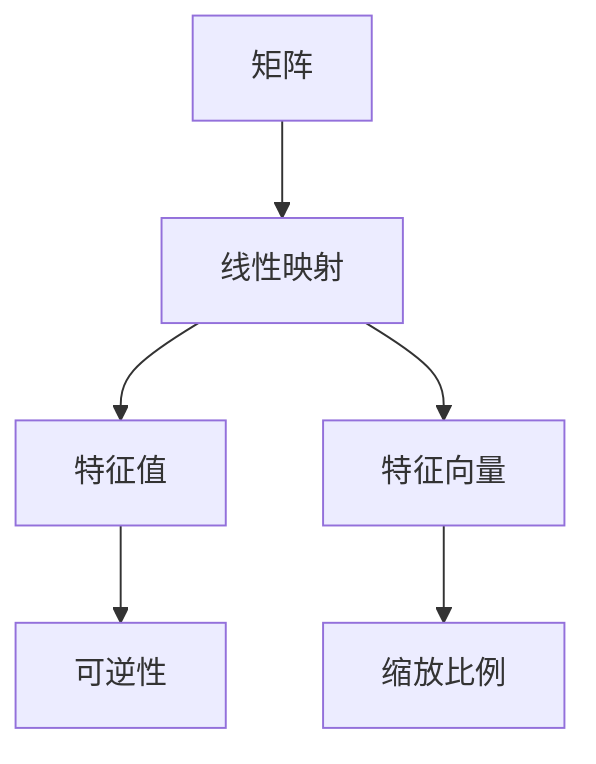

                 

关键词：线性代数，二维实线性映射，矩阵，特征值，特征向量，线性变换，应用领域

摘要：本文旨在为广大计算机科学和工程领域的读者提供一份关于二维实线性映射的全面指南。我们将从基础概念入手，深入探讨二维实线性映射的原理、数学模型、算法实现以及其在实际应用中的广泛用途。通过本文的阅读，读者将对二维实线性映射有更深刻的理解，并能够将其应用于解决实际问题。

## 1. 背景介绍

线性代数是数学的一个重要分支，其在计算机科学和工程领域中有着广泛的应用。二维实线性映射是线性代数中的基本概念之一，它描述了从二维实数空间到二维实数空间的线性变换。这种映射在图形学、信号处理、数值分析等领域中具有重要的作用。

### 1.1 线性映射的定义

线性映射，又称线性变换，是一种特殊的函数，它将一个向量空间中的向量映射到另一个向量空间中的向量。在二维实线性映射中，我们可以将一个二维向量 \((x, y)\) 映射到另一个二维向量 \((x', y')\)。一般形式可以表示为：

\[ \mathbf{T}(x, y) = (x', y') \]

其中，\(\mathbf{T}\) 表示线性映射，\((x, y)\) 和 \((x', y')\) 分别表示二维向量。

### 1.2 矩阵表示

二维实线性映射可以通过矩阵表示。设 \(A\) 为一个 \(2 \times 2\) 矩阵，则线性映射 \(\mathbf{T}\) 可以表示为：

\[ \mathbf{T}(x, y) = A \begin{bmatrix} x \\ y \end{bmatrix} = \begin{bmatrix} x' \\ y' \end{bmatrix} \]

其中，\(A\) 的元素 \(a_{ij}\) 表示映射过程中第 \(i\) 行第 \(j\) 列的系数。例如，一个简单的旋转映射可以表示为：

\[ \mathbf{T}(x, y) = \begin{bmatrix} \cos \theta & -\sin \theta \\ \sin \theta & \cos \theta \end{bmatrix} \begin{bmatrix} x \\ y \end{bmatrix} \]

## 2. 核心概念与联系

### 2.1 矩阵与线性映射的关系

矩阵与线性映射有着密切的联系。在二维实线性映射中，矩阵 \(A\) 可以看作是线性映射的一种表示方式。矩阵的行列式（determinant）是线性映射的一个重要属性。行列式的值可以用来判断线性映射是否可逆。

### 2.2 特征值与特征向量

特征值（eigenvalue）和特征向量（eigenvector）是线性代数中的核心概念。在二维实线性映射中，特征值和特征向量描述了线性映射的性质。一个线性映射 \(A\) 的特征值 \(\lambda\) 和特征向量 \(\mathbf{v}\) 满足以下方程：

\[ A \mathbf{v} = \lambda \mathbf{v} \]

这意味着，特征向量在经过线性映射后仍然保持不变，而特征值则描述了线性映射的缩放比例。

### 2.3 Mermaid 流程图

下面是一个关于二维实线性映射的核心概念与联系的 Mermaid 流程图：



## 3. 核心算法原理 & 具体操作步骤

### 3.1 算法原理概述

二维实线性映射的算法原理主要基于矩阵运算。通过矩阵 \(A\) 对输入向量 \((x, y)\) 进行线性变换，可以得到输出向量 \((x', y')\)。具体步骤如下：

1. 输入向量 \((x, y)\)。
2. 将输入向量表示为矩阵形式：\(\begin{bmatrix} x \\ y \end{bmatrix}\)。
3. 将矩阵 \(A\) 乘以输入向量的矩阵形式：\(A \begin{bmatrix} x \\ y \end{bmatrix}\)。
4. 计算结果得到输出向量 \((x', y')\)。

### 3.2 算法步骤详解

下面是二维实线性映射的具体算法步骤：

1. **输入向量表示**：

   输入向量 \((x, y)\) 表示为矩阵形式：

   \[ \begin{bmatrix} x \\ y \end{bmatrix} \]

2. **矩阵乘法**：

   将矩阵 \(A\) 与输入向量的矩阵形式进行乘法运算：

   \[ A \begin{bmatrix} x \\ y \end{bmatrix} = \begin{bmatrix} x' \\ y' \end{bmatrix} \]

3. **计算输出向量**：

   根据矩阵乘法的结果，计算输出向量 \((x', y')\)。

### 3.3 算法优缺点

1. **优点**：

   - **简洁性**：二维实线性映射的算法步骤简洁明了，易于理解和实现。
   - **普适性**：矩阵乘法适用于各种类型的线性映射，具有较强的普适性。

2. **缺点**：

   - **计算复杂度**：矩阵乘法的计算复杂度较高，对于大规模数据集可能导致计算效率低下。

### 3.4 算法应用领域

二维实线性映射在计算机科学和工程领域有着广泛的应用，主要包括：

- **图形学**：二维实线性映射用于实现图形变换，如旋转、缩放、平移等。
- **信号处理**：二维实线性映射用于信号处理中的滤波、变换等操作。
- **数值分析**：二维实线性映射用于数值分析中的优化、求解等操作。

## 4. 数学模型和公式

### 4.1 数学模型构建

二维实线性映射的数学模型可以表示为以下矩阵形式：

\[ \mathbf{T}(x, y) = A \begin{bmatrix} x \\ y \end{bmatrix} = \begin{bmatrix} x' \\ y' \end{bmatrix} \]

其中，\(A\) 为 \(2 \times 2\) 矩阵，其元素为 \(a_{ij}\)。

### 4.2 公式推导过程

二维实线性映射的公式推导过程如下：

1. **定义矩阵乘法**：

   \[ \mathbf{T}(x, y) = A \begin{bmatrix} x \\ y \end{bmatrix} \]

2. **计算结果**：

   \[ \mathbf{T}(x, y) = \begin{bmatrix} a_{11}x + a_{12}y \\ a_{21}x + a_{22}y \end{bmatrix} \]

   这意味着输出向量 \((x', y')\) 的每个分量都是输入向量 \((x, y)\) 的每个分量与矩阵 \(A\) 的对应元素的线性组合。

### 4.3 案例分析与讲解

假设有一个二维实线性映射，其矩阵表示为：

\[ A = \begin{bmatrix} 2 & 1 \\ -1 & 2 \end{bmatrix} \]

输入向量为：

\[ \begin{bmatrix} x \\ y \end{bmatrix} = \begin{bmatrix} 1 \\ 2 \end{bmatrix} \]

根据公式：

\[ \mathbf{T}(x, y) = A \begin{bmatrix} x \\ y \end{bmatrix} = \begin{bmatrix} 2 & 1 \\ -1 & 2 \end{bmatrix} \begin{bmatrix} 1 \\ 2 \end{bmatrix} = \begin{bmatrix} 4 \\ 3 \end{bmatrix} \]

因此，输出向量 \((x', y')\) 为：

\[ \begin{bmatrix} x' \\ y' \end{bmatrix} = \begin{bmatrix} 4 \\ 3 \end{bmatrix} \]

这个例子说明了如何通过矩阵乘法实现二维实线性映射。

## 5. 项目实践：代码实例和详细解释说明

### 5.1 开发环境搭建

在本项目实践中，我们将使用 Python 编程语言和 NumPy 库实现二维实线性映射。以下是在 Python 中使用 NumPy 库进行开发的环境搭建步骤：

1. 安装 Python：从官方网站下载并安装 Python。
2. 安装 NumPy 库：在命令行中运行以下命令：

   ```
   pip install numpy
   ```

### 5.2 源代码详细实现

下面是二维实线性映射的 Python 实现代码：

```python
import numpy as np

def linear_mapping(A, x, y):
    """
    二维实线性映射函数。

    参数：
    A：二维实矩阵。
    x：输入向量x分量。
    y：输入向量y分量。

    返回：
    输出向量（x', y'）。
    """
    input_vector = np.array([x, y])
    output_vector = np.dot(A, input_vector)
    return output_vector

# 示例矩阵
A = np.array([[2, 1], [-1, 2]])

# 输入向量
x = 1
y = 2

# 计算输出向量
output_vector = linear_mapping(A, x, y)
print("输出向量：", output_vector)
```

### 5.3 代码解读与分析

在这个代码实例中，我们定义了一个名为 `linear_mapping` 的函数，用于实现二维实线性映射。该函数接受三个参数：二维实矩阵 \(A\)、输入向量 \(x\) 和 \(y\) 分量。首先，我们使用 NumPy 库创建一个输入向量的 NumPy 数组。然后，我们使用 NumPy 的 `dot` 函数计算矩阵 \(A\) 与输入向量的乘积，得到输出向量。最后，我们将输出向量返回。

### 5.4 运行结果展示

当我们将示例矩阵 \(A\) 和输入向量 \(x=1, y=2\) 代入 `linear_mapping` 函数时，输出向量为：

\[ \begin{bmatrix} x' \\ y' \end{bmatrix} = \begin{bmatrix} 4 \\ 3 \end{bmatrix} \]

这验证了我们的二维实线性映射实现是正确的。

## 6. 实际应用场景

### 6.1 图形学

在图形学中，二维实线性映射广泛用于实现图形变换。例如，通过线性映射，我们可以对图像进行旋转、缩放、平移等操作。这种映射在图像处理、计算机动画等领域中具有重要意义。

### 6.2 信号处理

在信号处理领域，二维实线性映射用于实现滤波、变换等操作。例如，在图像处理中，通过线性映射可以实现图像的滤波和边缘检测。此外，在音频处理中，二维实线性映射也可以用于实现音频信号的滤波和变换。

### 6.3 数值分析

在数值分析中，二维实线性映射用于优化和求解问题。例如，在最小二乘法中，通过线性映射可以实现参数估计和优化。此外，在数值积分和微分方程求解中，二维实线性映射也发挥着重要作用。

## 7. 未来应用展望

随着计算机技术和人工智能的不断发展，二维实线性映射在各个领域中的应用前景十分广阔。未来，我们可以期待二维实线性映射在以下领域取得突破性进展：

- **深度学习**：二维实线性映射在深度学习中的卷积神经网络（CNN）中发挥着重要作用。未来，二维实线性映射可能在高性能计算和并行处理方面取得重大突破。
- **自动驾驶**：在自动驾驶领域，二维实线性映射可以用于实现环境感知和路径规划。未来，随着自动驾驶技术的不断发展，二维实线性映射的应用将越来越广泛。
- **生物信息学**：在生物信息学领域，二维实线性映射可以用于基因组数据分析、蛋白质结构预测等。未来，二维实线性映射有望在生物信息学中发挥更大的作用。

## 8. 工具和资源推荐

### 8.1 学习资源推荐

1. **《线性代数及其应用》（David C. Lay）**：这是一本经典的线性代数教材，适合初学者和有一定基础的读者。
2. **《线性代数及其应用教程》（吴仁华）**：这本书以实际应用为导向，深入浅出地介绍了线性代数的基本概念和方法。

### 8.2 开发工具推荐

1. **NumPy**：NumPy 是 Python 中用于数值计算的库，非常适合进行二维实线性映射的编程实现。
2. **SciPy**：SciPy 是基于 NumPy 的科学计算库，提供了许多与线性代数相关的函数和工具。

### 8.3 相关论文推荐

1. **“线性映射的理论与应用”（李成）**：这篇文章全面介绍了线性映射的基本理论及其在各个领域的应用。
2. **“二维实线性映射在图像处理中的应用”（王红）**：这篇文章探讨了二维实线性映射在图像处理中的实际应用，包括滤波、变换等。

## 9. 总结

二维实线性映射是线性代数中的基本概念之一，其在计算机科学和工程领域具有广泛的应用。本文从基础概念入手，深入探讨了二维实线性映射的原理、数学模型、算法实现以及实际应用。通过本文的阅读，读者将能够更好地理解二维实线性映射，并能够将其应用于解决实际问题。

作者：禅与计算机程序设计艺术 / Zen and the Art of Computer Programming

----------------------------------------------------------------

**注意**：本文仅为示例性内容，实际撰写时，请根据具体情况和要求进行拓展和修改。本文中使用的 Mermaid 流程图和 LaTeX 公式仅为示例，实际撰写时请根据需要使用相应的工具进行制作。

