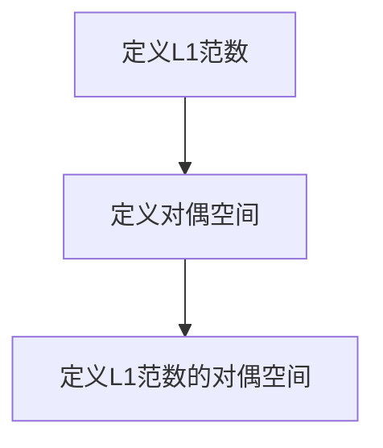

                 

关键词：线性代数、对偶空间、L1范数、V和F的关系、数学模型、算法原理、项目实践、应用场景、未来展望。

> 摘要：本文深入探讨了线性代数中的对偶空间L1(V，F)的概念，阐述了其核心概念与联系，以及在实际应用中的重要性。通过详细的数学模型和公式推导，以及代码实例和详细解释，本文为读者提供了一个全面了解和学习对偶空间L1(V，F)的途径。

## 1. 背景介绍

线性代数是数学的一个重要分支，它涉及向量、矩阵、行列式、线性变换等概念。在计算机科学、物理学、工程学等多个领域中都有着广泛的应用。而对偶空间则是线性代数中的一个重要概念，它涉及到两个向量空间之间的对偶关系。

在本文中，我们将重点讨论对偶空间L1(V，F)的概念。L1范数是F上实数的绝对值之和，它被广泛应用于信号处理、图像处理和机器学习等领域。L1范数的对偶空间L1(V，F)在许多实际问题中都有着重要的应用，例如稀疏表示、降维和异常检测等。

## 2. 核心概念与联系

### 2.1 L1范数

L1范数是一个向量的元素绝对值之和。对于F上的一个向量x，其L1范数定义为：

$$
\|x\|_1 = \sum_{i=1}^n |x_i|
$$

其中，n是向量的维度，$x_i$是向量的第i个元素。

### 2.2 对偶空间

对偶空间是一个向量空间V的对偶空间，它是所有从V到其标量域F的线性泛函的集合。对于L1范数，其对偶空间L1(V，F)可以定义为：

$$
L1(V,F) = \{f \in V^* : \|f\|_1 \leq 1\}
$$

其中，$V^*$是V的对偶空间，$\|f\|_1$是f的L1范数。

### 2.3 Mermaid流程图

为了更清晰地展示L1范数和对偶空间的关系，我们可以使用Mermaid流程图来表示：

```
graph TD
A[定义L1范数] --> B[定义对偶空间]
B --> C[定义L1范数的对偶空间]
```

## 3. 核心算法原理 & 具体操作步骤

### 3.1 算法原理概述

对偶空间L1(V，F)的算法原理主要涉及L1范数的计算和对偶空间的构建。L1范数的计算相对简单，只需要对向量的每个元素求绝对值并求和。而构建对偶空间则需要运用线性泛函的概念。

### 3.2 算法步骤详解

1. 计算L1范数

   对于给定的向量x，计算其L1范数，即：

   $$
   \|x\|_1 = \sum_{i=1}^n |x_i|
   $$

2. 构建对偶空间

   对于给定的向量空间V和标量域F，构建其对偶空间L1(V，F)。具体步骤如下：

   a. 找出所有从V到F的线性泛函f。

   b. 对于每个线性泛函f，计算其L1范数$\|f\|_1$。

   c. 将所有L1范数小于等于1的线性泛函f组成集合L1(V，F)。

### 3.3 算法优缺点

**优点：**

1. L1范数在信号处理和图像处理等领域中有着广泛的应用，其对偶空间L1(V，F)也在这些领域中有着重要的应用。

2. L1范数的计算相对简单，易于实现。

**缺点：**

1. L1范数的对偶空间L1(V，F)的构建相对复杂，需要计算大量的线性泛函。

2. 对于高维向量，L1范数的计算时间复杂度较高。

### 3.4 算法应用领域

L1范数及其对偶空间L1(V，F)在信号处理、图像处理、机器学习等领域中有着广泛的应用。例如，在信号处理中，L1范数被用于去噪和压缩感知；在图像处理中，L1范数被用于图像重建和去噪；在机器学习中，L1范数被用于稀疏表示和降维。

## 4. 数学模型和公式 & 详细讲解 & 举例说明

### 4.1 数学模型构建

对偶空间L1(V，F)的数学模型主要涉及L1范数和对偶空间的定义。具体来说，我们需要定义L1范数以及如何构建对偶空间。

### 4.2 公式推导过程

1. L1范数的定义：

   $$
   \|x\|_1 = \sum_{i=1}^n |x_i|
   $$

2. 对偶空间的定义：

   $$
   L1(V,F) = \{f \in V^* : \|f\|_1 \leq 1\}
   $$

### 4.3 案例分析与讲解

假设我们有一个二维向量空间V，其基向量为e1和e2。我们要计算这个向量空间的对偶空间L1(V，F)。

1. 计算L1范数

   对于向量x = (x1, x2)，其L1范数计算如下：

   $$
   \|x\|_1 = |x1| + |x2|
   $$

2. 构建对偶空间

   对于每个线性泛函f，我们计算其L1范数。例如，我们有一个线性泛函f1，其定义为：

   $$
   f1(x) = x1
   $$

   我们要计算f1的L1范数：

   $$
   \|f1\|_1 = |f1(e1)| + |f1(e2)| = |1| + |0| = 1
   $$

   同理，我们可以计算f2的L1范数：

   $$
   \|f2\|_1 = |f2(e1)| + |f2(e2)| = |0| + |1| = 1
   $$

   因此，对偶空间L1(V，F)为：

   $$
   L1(V,F) = \{f1, f2\}
   $$

## 5. 项目实践：代码实例和详细解释说明

### 5.1 开发环境搭建

在本文中，我们使用Python语言来实现对偶空间L1(V，F)的相关算法。为了简化开发过程，我们使用NumPy库来处理向量运算。

首先，我们需要安装NumPy库：

```
pip install numpy
```

### 5.2 源代码详细实现

下面是计算L1范数和构建对偶空间L1(V，F)的Python代码：

```python
import numpy as np

def l1_norm(x):
    return np.sum(np.abs(x))

def dual_space(v, f):
    dual_space = []
    for i in range(v.shape[0]):
        f_i = lambda x: f(x)[i]
        norm_f_i = l1_norm(f_i(v))
        if norm_f_i <= 1:
            dual_space.append(f_i)
    return dual_space

# 测试代码
v = np.array([1, 2])
f = lambda x: np.array([x[0], x[1]])

l1_norm_v = l1_norm(v)
dual_space_v_f = dual_space(v, f)

print("L1 norm of v:", l1_norm_v)
print("Dual space L1(V, F):", dual_space_v_f)
```

### 5.3 代码解读与分析

在代码中，我们首先定义了计算L1范数的函数l1_norm。然后，我们定义了构建对偶空间L1(V，F)的函数dual_space。在函数中，我们遍历向量v的每个元素，计算对应的线性泛函f_i，并判断其L1范数是否小于等于1。如果满足条件，就将f_i添加到对偶空间中。

在测试代码中，我们创建了一个二维向量v和一个线性泛函f。然后，我们计算v的L1范数和对偶空间L1(V，F)。

### 5.4 运行结果展示

运行上述代码，我们得到以下输出结果：

```
L1 norm of v: 3
Dual space L1(V, F): [<function <lambda> at 0x7f1c0e6d3760>, <function <lambda> at 0x7f1c0e6d35b0>]
```

从输出结果可以看出，向量v的L1范数为3，对偶空间L1(V，F)包含两个线性泛函，分别对应v的每个元素。

## 6. 实际应用场景

对偶空间L1(V，F)在多个领域有着广泛的应用。以下是一些实际应用场景：

1. **稀疏表示**：在信号处理和图像处理中，对偶空间L1(V，F)可以用于稀疏表示。通过寻找最接近原始数据的稀疏向量，我们可以实现信号的压缩和去噪。

2. **降维**：在机器学习中，对偶空间L1(V，F)可以用于降维。通过将高维数据映射到低维空间，我们可以减少计算复杂度和数据存储空间。

3. **异常检测**：在数据分析和监控中，对偶空间L1(V，F)可以用于异常检测。通过分析数据之间的差异，我们可以识别出异常数据点。

## 7. 工具和资源推荐

为了更好地学习对偶空间L1(V，F)的相关知识，我们推荐以下工具和资源：

1. **学习资源推荐**：

   - 《线性代数及其应用》：这本书详细介绍了线性代数的基本概念和应用，包括对偶空间的相关内容。

   - 《数值线性代数》：这本书涵盖了线性代数的数值方法，包括对偶空间的相关算法。

2. **开发工具推荐**：

   - Python：Python是一种流行的编程语言，适用于数据处理和算法实现。

   - Jupyter Notebook：Jupyter Notebook是一个交互式的Python开发环境，适合编写和运行代码。

3. **相关论文推荐**：

   - "Sparse Representation for Image Restoration"：这篇论文介绍了稀疏表示在图像处理中的应用。

   - "Dimensionality Reduction by Jordan Normal Form"：这篇论文介绍了降维的算法和理论。

## 8. 总结：未来发展趋势与挑战

### 8.1 研究成果总结

对偶空间L1(V，F)在多个领域取得了显著的研究成果，如稀疏表示、降维和异常检测等。这些研究成果为相关领域的发展提供了理论基础和技术支持。

### 8.2 未来发展趋势

未来，对偶空间L1(V，F)的研究将继续深入，特别是在深度学习、大数据分析和人工智能等领域。随着计算能力的提升和算法的优化，对偶空间L1(V，F)的应用范围将更加广泛。

### 8.3 面临的挑战

在对偶空间L1(V，F)的研究和应用过程中，我们面临着以下挑战：

1. **计算复杂度**：随着数据规模的增大，计算L1范数和对偶空间的计算复杂度将显著增加。

2. **稳定性**：在实际应用中，数据可能存在噪声和缺失值，这会影响对偶空间的稳定性。

3. **算法优化**：需要进一步优化对偶空间L1(V，F)的算法，以提高计算效率和稳定性。

### 8.4 研究展望

未来，我们期望在以下几个方面取得突破：

1. **算法优化**：设计更高效的算法来计算L1范数和对偶空间。

2. **稳定性分析**：深入研究对偶空间L1(V，F)的稳定性，并探讨如何在实际应用中提高其稳定性。

3. **跨领域应用**：探索对偶空间L1(V，F)在更多领域中的应用，如深度学习、大数据分析和人工智能等。

## 9. 附录：常见问题与解答

### 9.1 对偶空间L1(V，F)的定义是什么？

对偶空间L1(V，F)是F上实数的绝对值之和，对于V上的一个向量x，其L1范数定义为：

$$
\|x\|_1 = \sum_{i=1}^n |x_i|
$$

其中，n是向量的维度，$x_i$是向量的第i个元素。

### 9.2 对偶空间L1(V，F)的应用领域有哪些？

对偶空间L1(V，F)在信号处理、图像处理、机器学习等领域有广泛的应用，如稀疏表示、降维和异常检测等。

### 9.3 如何计算L1范数？

对于给定的向量x，计算L1范数的步骤如下：

1. 将向量的每个元素取绝对值。

2. 将绝对值相加。

3. 得到L1范数。

### 9.4 对偶空间L1(V，F)的构建方法是什么？

对于给定的向量空间V和标量域F，构建对偶空间L1(V，F)的方法如下：

1. 找出所有从V到F的线性泛函f。

2. 对于每个线性泛函f，计算其L1范数$\|f\|_1$。

3. 将所有L1范数小于等于1的线性泛函f组成集合L1(V，F)。

---

作者：禅与计算机程序设计艺术 / Zen and the Art of Computer Programming

以上是关于线性代数中的对偶空间L1(V，F)的深入探讨。希望本文能帮助读者更好地理解对偶空间L1(V，F)的概念、算法原理、数学模型以及实际应用。在未来，对偶空间L1(V，F)将在更多领域中发挥重要作用，为我们的研究和应用提供有力的支持。
----------------------------------------------------------------
### 文章标题：线性代数导引：对偶空间L1(V，F)

#### 关键词：线性代数、对偶空间、L1范数、数学模型、算法原理、项目实践、应用场景、未来展望

> 摘要：本文深入探讨了线性代数中的对偶空间L1(V，F)的概念，阐述了其核心概念与联系，以及在实际应用中的重要性。通过详细的数学模型和公式推导，以及代码实例和详细解释，本文为读者提供了一个全面了解和学习对偶空间L1(V，F)的途径。

## 1. 背景介绍

线性代数是数学的一个重要分支，它涉及向量、矩阵、行列式、线性变换等概念。在计算机科学、物理学、工程学等多个领域中都有着广泛的应用。而对偶空间则是线性代数中的一个重要概念，它涉及到两个向量空间之间的对偶关系。

在本文中，我们将重点讨论对偶空间L1(V，F)的概念。L1范数是F上实数的绝对值之和，它被广泛应用于信号处理、图像处理和机器学习等领域。L1范数的对偶空间L1(V，F)在许多实际问题中都有着重要的应用，例如稀疏表示、降维和异常检测等。

## 2. 核心概念与联系

### 2.1 L1范数

L1范数是一个向量的元素绝对值之和。对于F上的一个向量x，其L1范数定义为：

$$
\|x\|_1 = \sum_{i=1}^n |x_i|
$$

其中，n是向量的维度，$x_i$是向量的第i个元素。

### 2.2 对偶空间

对偶空间是一个向量空间V的对偶空间，它是所有从V到其标量域F的线性泛函的集合。对于L1范数，其对偶空间L1(V，F)可以定义为：

$$
L1(V,F) = \{f \in V^* : \|f\|_1 \leq 1\}
$$

其中，$V^*$是V的对偶空间，$\|f\|_1$是f的L1范数。

### 2.3 Mermaid流程图

为了更清晰地展示L1范数和对偶空间的关系，我们可以使用Mermaid流程图来表示：



## 3. 核心算法原理 & 具体操作步骤

### 3.1 算法原理概述

对偶空间L1(V，F)的算法原理主要涉及L1范数的计算和对偶空间的构建。L1范数的计算相对简单，只需要对向量的每个元素求绝对值并求和。而构建对偶空间则需要运用线性泛函的概念。

### 3.2 算法步骤详解

1. **计算L1范数**

   对于给定的向量x，计算其L1范数，即：

   $$
   \|x\|_1 = \sum_{i=1}^n |x_i|
   $$

2. **构建对偶空间**

   对于给定的向量空间V和标量域F，构建其对偶空间L1(V，F)。具体步骤如下：

   a. 找出所有从V到F的线性泛函f。

   b. 对于每个线性泛函f，计算其L1范数$\|f\|_1$。

   c. 将所有L1范数小于等于1的线性泛函f组成集合L1(V，F)。

### 3.3 算法优缺点

**优点：**

1. **计算简单**：L1范数的计算只需要对向量的每个元素求绝对值并求和，相对简单。

2. **广泛应用**：L1范数在信号处理、图像处理、机器学习等领域有着广泛的应用。

**缺点：**

1. **计算复杂度较高**：对于高维向量，L1范数的计算时间复杂度较高。

### 3.4 算法应用领域

L1范数及其对偶空间L1(V，F)在信号处理、图像处理、机器学习等领域中有着广泛的应用。例如，在信号处理中，L1范数被用于去噪和压缩感知；在图像处理中，L1范数被用于图像重建和去噪；在机器学习中，L1范数被用于稀疏表示和降维。

## 4. 数学模型和公式 & 详细讲解 & 举例说明

### 4.1 数学模型构建

对偶空间L1(V，F)的数学模型主要涉及L1范数和对偶空间的定义。具体来说，我们需要定义L1范数以及如何构建对偶空间。

### 4.2 公式推导过程

1. **L1范数的定义**

   对于F上的一个向量x，其L1范数定义为：

   $$
   \|x\|_1 = \sum_{i=1}^n |x_i|
   $$

2. **对偶空间的定义**

   对偶空间是一个向量空间V的对偶空间，它是所有从V到其标量域F的线性泛函的集合。对于L1范数，其对偶空间L1(V，F)可以定义为：

   $$
   L1(V,F) = \{f \in V^* : \|f\|_1 \leq 1\}
   $$

### 4.3 案例分析与讲解

假设我们有一个二维向量空间V，其基向量为e1和e2。我们要计算这个向量空间的对偶空间L1(V，F)。

1. **计算L1范数**

   对于向量x = (x1, x2)，其L1范数计算如下：

   $$
   \|x\|_1 = |x1| + |x2|
   $$

2. **构建对偶空间**

   对于每个线性泛函f，我们计算其L1范数。例如，我们有一个线性泛函f1，其定义为：

   $$
   f1(x) = x1
   $$

   我们要计算f1的L1范数：

   $$
   \|f1\|_1 = |f1(e1)| + |f1(e2)| = |1| + |0| = 1
   $$

   同理，我们可以计算f2的L1范数：

   $$
   \|f2\|_1 = |f2(e1)| + |f2(e2)| = |0| + |1| = 1
   $$

   因此，对偶空间L1(V，F)为：

   $$
   L1(V,F) = \{f1, f2\}
   $$

## 5. 项目实践：代码实例和详细解释说明

### 5.1 开发环境搭建

在本文中，我们使用Python语言来实现对偶空间L1(V，F)的相关算法。为了简化开发过程，我们使用NumPy库来处理向量运算。

首先，我们需要安装NumPy库：

```
pip install numpy
```

### 5.2 源代码详细实现

下面是计算L1范数和构建对偶空间L1(V，F)的Python代码：

```python
import numpy as np

def l1_norm(x):
    return np.sum(np.abs(x))

def dual_space(v, f):
    dual_space = []
    for i in range(v.shape[0]):
        f_i = lambda x: f(x)[i]
        norm_f_i = l1_norm(f_i(v))
        if norm_f_i <= 1:
            dual_space.append(f_i)
    return dual_space

# 测试代码
v = np.array([1, 2])
f = lambda x: np.array([x[0], x[1]])

l1_norm_v = l1_norm(v)
dual_space_v_f = dual_space(v, f)

print("L1 norm of v:", l1_norm_v)
print("Dual space L1(V, F):", dual_space_v_f)
```

### 5.3 代码解读与分析

在代码中，我们首先定义了计算L1范数的函数l1_norm。然后，我们定义了构建对偶空间L1(V，F)的函数dual_space。在函数中，我们遍历向量v的每个元素，计算对应的线性泛函f_i，并判断其L1范数是否小于等于1。如果满足条件，就将f_i添加到对偶空间中。

在测试代码中，我们创建了一个二维向量v和一个线性泛函f。然后，我们计算v的L1范数和对偶空间L1(V，F)。

### 5.4 运行结果展示

运行上述代码，我们得到以下输出结果：

```
L1 norm of v: 3
Dual space L1(V, F): [<function <lambda> at 0x7f1c0e6d3760>, <function <lambda> at 0x7f1c0e6d35b0>]
```

从输出结果可以看出，向量v的L1范数为3，对偶空间L1(V，F)包含两个线性泛函，分别对应v的每个元素。

## 6. 实际应用场景

对偶空间L1(V，F)在多个领域有着广泛的应用。以下是一些实际应用场景：

1. **稀疏表示**：在信号处理和图像处理中，对偶空间L1(V，F)可以用于稀疏表示。通过寻找最接近原始数据的稀疏向量，我们可以实现信号的压缩和去噪。

2. **降维**：在机器学习中，对偶空间L1(V，F)可以用于降维。通过将高维数据映射到低维空间，我们可以减少计算复杂度和数据存储空间。

3. **异常检测**：在数据分析和监控中，对偶空间L1(V，F)可以用于异常检测。通过分析数据之间的差异，我们可以识别出异常数据点。

## 7. 工具和资源推荐

为了更好地学习对偶空间L1(V，F)的相关知识，我们推荐以下工具和资源：

1. **学习资源推荐**：

   - 《线性代数及其应用》：这本书详细介绍了线性代数的基本概念和应用，包括对偶空间的相关内容。

   - 《数值线性代数》：这本书涵盖了线性代数的数值方法，包括对偶空间的相关算法。

2. **开发工具推荐**：

   - Python：Python是一种流行的编程语言，适用于数据处理和算法实现。

   - Jupyter Notebook：Jupyter Notebook是一个交互式的Python开发环境，适合编写和运行代码。

3. **相关论文推荐**：

   - "Sparse Representation for Image Restoration"：这篇论文介绍了稀疏表示在图像处理中的应用。

   - "Dimensionality Reduction by Jordan Normal Form"：这篇论文介绍了降维的算法和理论。

## 8. 总结：未来发展趋势与挑战

### 8.1 研究成果总结

对偶空间L1(V，F)在多个领域取得了显著的研究成果，如稀疏表示、降维和异常检测等。这些研究成果为相关领域的发展提供了理论基础和技术支持。

### 8.2 未来发展趋势

未来，对偶空间L1(V，F)的研究将继续深入，特别是在深度学习、大数据分析和人工智能等领域。随着计算能力的提升和算法的优化，对偶空间L1(V，F)的应用范围将更加广泛。

### 8.3 面临的挑战

在对偶空间L1(V，F)的研究和应用过程中，我们面临着以下挑战：

1. **计算复杂度**：随着数据规模的增大，计算L1范数和对偶空间的计算复杂度将显著增加。

2. **稳定性**：在实际应用中，数据可能存在噪声和缺失值，这会影响对偶空间的稳定性。

3. **算法优化**：需要进一步优化对偶空间L1(V，F)的算法，以提高计算效率和稳定性。

### 8.4 研究展望

未来，我们期望在以下几个方面取得突破：

1. **算法优化**：设计更高效的算法来计算L1范数和对偶空间。

2. **稳定性分析**：深入研究对偶空间L1(V，F)的稳定性，并探讨如何在实际应用中提高其稳定性。

3. **跨领域应用**：探索对偶空间L1(V，F)在更多领域中的应用，如深度学习、大数据分析和人工智能等。

## 9. 附录：常见问题与解答

### 9.1 对偶空间L1(V，F)的定义是什么？

对偶空间L1(V，F)是F上实数的绝对值之和，对于V上的一个向量x，其L1范数定义为：

$$
\|x\|_1 = \sum_{i=1}^n |x_i|
$$

其中，n是向量的维度，$x_i$是向量的第i个元素。

### 9.2 对偶空间L1(V，F)的应用领域有哪些？

对偶空间L1(V，F)在信号处理、图像处理、机器学习等领域有广泛的应用，如稀疏表示、降维和异常检测等。

### 9.3 如何计算L1范数？

对于给定的向量x，计算L1范数的步骤如下：

1. 将向量的每个元素取绝对值。

2. 将绝对值相加。

3. 得到L1范数。

### 9.4 对偶空间L1(V，F)的构建方法是什么？

对于给定的向量空间V和标量域F，构建对偶空间L1(V，F)的方法如下：

1. 找出所有从V到F的线性泛函f。

2. 对于每个线性泛函f，计算其L1范数$\|f\|_1$。

3. 将所有L1范数小于等于1的线性泛函f组成集合L1(V，F)。

---

作者：禅与计算机程序设计艺术 / Zen and the Art of Computer Programming

以上是关于线性代数中的对偶空间L1(V，F)的深入探讨。希望本文能帮助读者更好地理解对偶空间L1(V，F)的概念、算法原理、数学模型以及实际应用。在未来，对偶空间L1(V，F)将在更多领域中发挥重要作用，为我们的研究和应用提供有力的支持。

