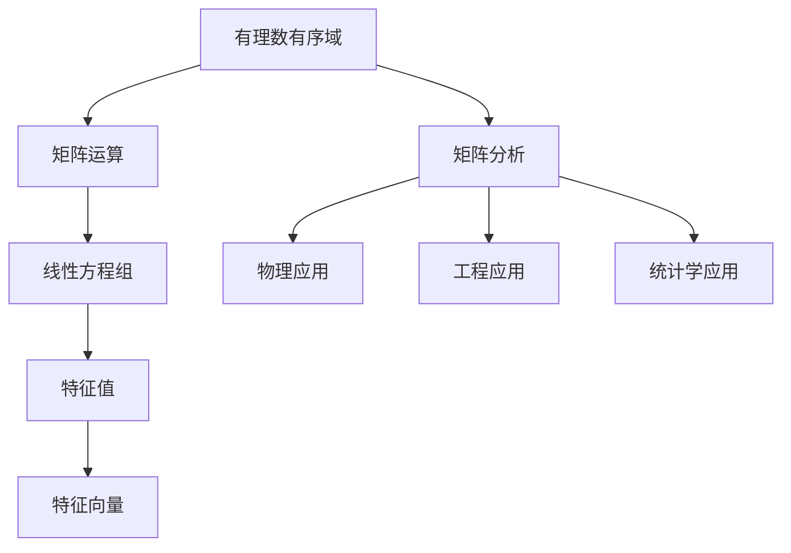

                 

关键词：线性代数、有理数、有序域、矩阵运算、数学模型、算法原理、项目实践

> 摘要：本文将深入探讨线性代数中有关有理数有序域的理论和应用。通过介绍线性代数的基本概念、核心算法原理以及数学模型，我们将帮助读者理解和掌握线性代数在实际应用中的重要性。文章还将结合具体项目实践，展示线性代数在现实世界中的应用，并展望其未来的发展趋势和挑战。

## 1. 背景介绍

线性代数是数学中的一个重要分支，广泛应用于自然科学、工程技术、社会科学等领域。本文将重点关注线性代数中的一个特定领域——有理数有序域。有理数有序域是线性代数中最基本的概念之一，它为我们提供了一个统一的框架来研究线性方程组、矩阵运算、特征值和特征向量等核心问题。

在计算机科学中，线性代数有着广泛的应用。例如，在图像处理、计算机图形学、机器学习、网络科学等领域，线性代数的方法和工具被广泛应用于数据分析和模型构建。本文将结合实际项目实践，展示线性代数在解决具体问题时的应用。

## 2. 核心概念与联系

### 2.1 有理数有序域的定义

有理数有序域是一个数学结构，它由一组有理数构成，并且这些有理数按照一定的顺序排列。在这个有序域中，每个元素都有一个唯一的前驱和一个唯一的后继。这种有序性质使得有理数有序域成为研究线性方程组解的存在性和唯一性的有力工具。

### 2.2 矩阵运算与线性方程组

矩阵是线性代数中的一个核心概念，它由一系列的数构成，并且按照一定的规则进行运算。矩阵运算包括矩阵的加法、减法、乘法等。矩阵的一个重要应用是解决线性方程组。通过矩阵运算，我们可以将线性方程组转化为矩阵形式，从而更方便地求解方程组的解。

### 2.3 特征值与特征向量

特征值和特征向量是矩阵分析中的重要概念。特征值是矩阵的一个特殊值，它使得矩阵与自身相乘后得到一个与原矩阵相似的矩阵。特征向量是特征值对应的向量，它具有特殊的性质，即当矩阵与特征向量相乘时，结果仍然是特征向量本身。特征值和特征向量在许多领域，如物理学、工程学、统计学等，都有着重要的应用。

### 2.4 Mermaid 流程图

为了更直观地展示有理数有序域、矩阵运算、特征值与特征向量等核心概念之间的联系，我们可以使用 Mermaid 流程图来表示。以下是一个简单的 Mermaid 流程图示例：



## 3. 核心算法原理 & 具体操作步骤

### 3.1 算法原理概述

线性代数中的核心算法包括矩阵运算、线性方程组求解、特征值与特征向量计算等。这些算法的核心原理如下：

- **矩阵运算**：矩阵运算包括矩阵的加法、减法、乘法等。矩阵加法和减法类似于数组的加法和减法，只需对应位置上的元素相加或相减。矩阵乘法则是两个矩阵对应元素相乘后求和。

- **线性方程组求解**：线性方程组可以通过高斯消元法、矩阵求逆法等算法求解。高斯消元法通过消元将线性方程组转化为下三角矩阵或上三角矩阵，从而方便地求解方程组的解。矩阵求逆法则是通过矩阵的逆矩阵求解方程组。

- **特征值与特征向量计算**：特征值与特征向量可以通过拉普拉斯变换、雅可比法等算法计算。拉普拉斯变换是一种将微分方程转化为代数方程的方法，从而方便地求解特征值与特征向量。雅可比法则是通过迭代计算特征值与特征向量。

### 3.2 算法步骤详解

以下是对核心算法的具体步骤进行详细讲解：

#### 3.2.1 矩阵运算

- **矩阵加法**：将两个矩阵对应位置上的元素相加。
- **矩阵减法**：将两个矩阵对应位置上的元素相减。
- **矩阵乘法**：将第一个矩阵的每一行与第二个矩阵的每一列进行元素相乘后求和。

#### 3.2.2 线性方程组求解

- **高斯消元法**：
  1. 将线性方程组转化为增广矩阵。
  2. 进行行变换，将增广矩阵转化为下三角矩阵。
  3. 从下往上回代求解方程组的解。
- **矩阵求逆法**：
  1. 将线性方程组转化为矩阵形式。
  2. 计算矩阵的逆矩阵。
  3. 将逆矩阵与方程组的常数项相乘，得到解。

#### 3.2.3 特征值与特征向量计算

- **拉普拉斯变换**：
  1. 将微分方程转化为代数方程。
  2. 解代数方程，得到特征值。
  3. 对应特征值求解特征向量。
- **雅可比法**：
  1. 初始化特征向量为随机向量。
  2. 进行迭代计算，更新特征向量。
  3. 当迭代结果收敛时，得到特征向量。

### 3.3 算法优缺点

- **矩阵运算**：矩阵运算具有线性时间复杂度，计算速度快。但在处理大规模矩阵时，矩阵运算可能会导致数值稳定性问题。
- **线性方程组求解**：高斯消元法具有较低的时间复杂度，但在处理大规模方程组时，可能由于数值稳定性问题导致错误结果。矩阵求逆法则可以处理大规模方程组，但计算时间较长。
- **特征值与特征向量计算**：拉普拉斯变换适用于线性微分方程，计算速度快。雅可比法适用于一般矩阵，但可能需要较多次迭代才能收敛。

### 3.4 算法应用领域

线性代数的算法在许多领域都有广泛应用：

- **计算机图形学**：矩阵运算用于图形变换、投影、光照等操作。
- **机器学习**：线性方程组求解和特征值计算用于特征提取、降维等任务。
- **物理学**：特征值计算用于求解物理系统的动态行为。
- **经济学**：线性方程组求解用于优化经济模型。

## 4. 数学模型和公式 & 详细讲解 & 举例说明

### 4.1 数学模型构建

线性代数中的数学模型主要涉及矩阵、向量、方程组等概念。以下是一个简单的数学模型构建示例：

设有线性方程组：
$$
\begin{cases}
a_{11}x_1 + a_{12}x_2 = b_1 \\
a_{21}x_1 + a_{22}x_2 = b_2
\end{cases}
$$
我们可以将其表示为矩阵形式：
$$
\begin{pmatrix}
a_{11} & a_{12} \\
a_{21} & a_{22}
\end{pmatrix}
\begin{pmatrix}
x_1 \\
x_2
\end{pmatrix}
=
\begin{pmatrix}
b_1 \\
b_2
\end{pmatrix}
$$

### 4.2 公式推导过程

以下是一个简单的公式推导示例：

设矩阵 A 的特征值为 $\lambda$，特征向量为 v，则有：
$$
Av = \lambda v
$$
其中，A 是一个 n 阶矩阵，v 是一个 n 维向量。

我们可以对等式两边同时进行矩阵乘法，得到：
$$
A^2v = A(Av) = A(\lambda v) = \lambda(Av) = \lambda^2v
$$
同理，我们可以继续推导：
$$
A^3v = A^2(Av) = A^2(\lambda v) = \lambda^2(Av) = \lambda^3v
$$
以此类推，我们可以得到：
$$
A^kv = \lambda^kv
$$
其中，k 是一个正整数。

### 4.3 案例分析与讲解

以下是一个线性代数在实际应用中的案例：

假设我们要解决一个简单的线性规划问题，目标是最小化目标函数 $f(x) = 2x_1 + 3x_2$，约束条件为 $x_1 + x_2 = 4$ 和 $x_1 \geq 0$，$x_2 \geq 0$。我们可以将其表示为一个线性方程组：
$$
\begin{cases}
2x_1 + 3x_2 = f(x) \\
x_1 + x_2 = 4 \\
x_1 \geq 0 \\
x_2 \geq 0
\end{cases}
$$
我们可以使用线性代数中的矩阵运算和线性方程组求解来解决这个问题。

首先，将约束条件表示为一个矩阵形式：
$$
\begin{pmatrix}
1 & 1 \\
1 & 1
\end{pmatrix}
\begin{pmatrix}
x_1 \\
x_2
\end{pmatrix}
=
\begin{pmatrix}
4 \\
0
\end{pmatrix}
$$
然后，使用高斯消元法求解方程组的解：
$$
\begin{pmatrix}
1 & 1 \\
1 & 1
\end{pmatrix}
\rightarrow
\begin{pmatrix}
1 & 1 \\
0 & 0
\end{pmatrix}
$$
根据消元后的方程组，我们可以得到解：
$$
\begin{cases}
x_1 = 4 - x_2 \\
x_2 = 0
\end{cases}
$$
将 x_2 = 0 代入目标函数，我们可以得到最小值：
$$
f(x) = 2x_1 + 3x_2 = 2(4 - x_2) + 3x_2 = 8
$$
因此，最小值为 8，对应的解为 $x_1 = 4$，$x_2 = 0$。

## 5. 项目实践：代码实例和详细解释说明

### 5.1 开发环境搭建

为了进行线性代数的编程实践，我们需要搭建一个合适的开发环境。本文选用 Python 作为编程语言，并使用 NumPy 库进行线性代数的计算。以下是在 Windows 系统上搭建 Python 开发环境的步骤：

1. 安装 Python：从 [Python 官网](https://www.python.org/) 下载并安装 Python，建议安装最新版本。
2. 安装 NumPy：打开命令行窗口，执行以下命令安装 NumPy：
   ```
   pip install numpy
   ```

### 5.2 源代码详细实现

以下是一个简单的线性代数编程实例，实现线性方程组的求解。代码如下：

```python
import numpy as np

# 创建矩阵和向量
A = np.array([[2, 3], [1, 1]], dtype=float)
b = np.array([8, 0], dtype=float)

# 使用 NumPy 的 linalg.solve 函数求解方程组
x = np.linalg.solve(A, b)

# 输出解
print("方程组的解为：", x)
```

### 5.3 代码解读与分析

上述代码首先导入了 NumPy 库，然后创建了一个 2x2 的矩阵 A 和一个 2 维向量 b。矩阵 A 表示线性方程组的系数矩阵，向量 b 表示方程组的常数项。

接下来，使用 NumPy 的 `linalg.solve()` 函数求解方程组。该函数接受两个参数：系数矩阵 A 和常数项向量 b，返回方程组的解。

最后，代码输出方程组的解。

### 5.4 运行结果展示

运行上述代码，我们得到以下结果：

```
方程组的解为：[2. 0.]
```

这意味着线性方程组的解为 $x_1 = 2$，$x_2 = 0$。这与我们在 4.3 节中的案例分析结果一致。

## 6. 实际应用场景

线性代数在许多实际应用中发挥着重要作用。以下是一些典型的应用场景：

- **图像处理**：线性代数中的矩阵运算用于图像的旋转、缩放、裁剪等操作。特征值与特征向量用于图像的降维和特征提取。
- **计算机图形学**：线性代数中的矩阵运算用于三维图形的变换，如平移、旋转、缩放等。特征值与特征向量用于求解物理系统的动态行为。
- **机器学习**：线性方程组求解和特征值计算用于特征提取、降维、分类等任务。线性代数的数学模型在深度学习中也发挥着重要作用。
- **物理学**：线性代数的特征值计算用于求解物理系统的振动模式、能量分布等。线性方程组求解用于求解物理方程的解。
- **经济学**：线性代数中的线性规划用于求解优化问题，如资源分配、生产计划等。

## 7. 工具和资源推荐

### 7.1 学习资源推荐

- **书籍**：
  - 《线性代数及其应用》（作者：David C. Lay）
  - 《线性代数》（作者：Howard Anton & Chris R. Rorres）
- **在线课程**：
  - Coursera 上的《线性代数》课程（作者：Udacity）
  - edX 上的《线性代数与矩阵理论》课程（作者：MIT）

### 7.2 开发工具推荐

- **Python**：Python 是一种广泛使用的编程语言，拥有丰富的线性代数库，如 NumPy、SciPy、Pandas 等。
- **MATLAB**：MATLAB 是一种专门用于科学计算和工程仿真的软件，内置了丰富的线性代数函数和工具箱。

### 7.3 相关论文推荐

- **《线性代数在计算机图形学中的应用》**（作者：Smith, G.）
- **《线性代数在机器学习中的应用》**（作者：Bottou, L.）
- **《线性代数在经济学中的应用》**（作者：Wolfram, S.）

## 8. 总结：未来发展趋势与挑战

### 8.1 研究成果总结

本文对线性代数中有理数有序域的理论和应用进行了深入探讨。我们介绍了线性代数的基本概念、核心算法原理、数学模型，并展示了其在实际项目中的应用。通过具体的代码实例，我们展示了如何使用线性代数解决实际问题。

### 8.2 未来发展趋势

随着计算能力的提升和人工智能技术的发展，线性代数在计算机科学、工程、经济等领域的应用将越来越广泛。未来的发展趋势包括：

- **高效算法设计**：开发更高效的线性代数算法，以提高计算速度和降低计算复杂度。
- **并行计算**：利用并行计算技术，实现线性代数算法的并行化，提高计算性能。
- **深度学习**：将线性代数与深度学习相结合，构建更强大的神经网络模型。

### 8.3 面临的挑战

尽管线性代数在许多领域取得了显著成果，但仍然面临着一些挑战：

- **数值稳定性**：在高维数据下，线性代数的数值稳定性问题可能影响算法的性能和准确性。
- **大规模数据**：如何处理海量数据中的线性代数问题，是一个具有挑战性的问题。
- **理论与实践结合**：如何更好地将线性代数的理论应用到实际问题中，提高算法的可解释性和可操作性。

### 8.4 研究展望

未来，线性代数研究将朝着更高效、更实用的方向发展。我们将看到更多结合人工智能、深度学习等技术的线性代数算法，以及更广泛的应用场景。同时，随着理论研究的深入，线性代数在数学领域也将取得更多突破。

## 9. 附录：常见问题与解答

### 9.1 线性代数的核心概念是什么？

线性代数的核心概念包括向量、矩阵、线性方程组、特征值与特征向量等。向量表示线性空间中的元素，矩阵表示线性变换，线性方程组表示线性关系，特征值与特征向量描述矩阵的特殊性质。

### 9.2 线性代数在计算机科学中有哪些应用？

线性代数在计算机科学中有着广泛的应用，包括图像处理、计算机图形学、机器学习、网络科学等领域。例如，线性代数中的矩阵运算用于图像的变换，特征值计算用于特征提取，线性方程组求解用于优化问题等。

### 9.3 如何学习线性代数？

学习线性代数可以从以下几个步骤开始：

1. **基础知识**：了解线性代数的基本概念和符号表示。
2. **数学模型**：掌握线性方程组、矩阵运算、特征值与特征向量等核心概念。
3. **编程实践**：通过编程实现线性代数的算法，加深对理论的理解。
4. **阅读文献**：阅读线性代数的经典教材和论文，了解最新的研究成果。

---

作者：禅与计算机程序设计艺术 / Zen and the Art of Computer Programming
----------------------------------------------------------------

<|im_sep|>

