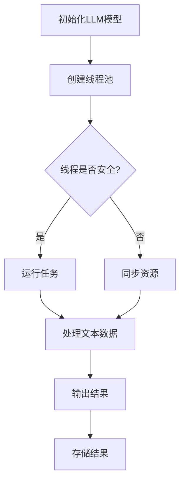
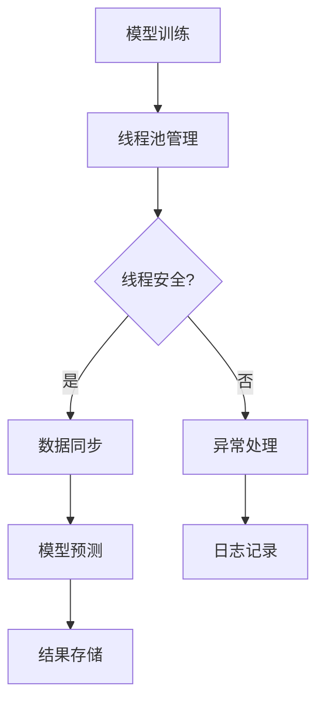

                 

关键词：线程安全，AI，LLM，应用，构建，可信赖，计算机编程

> 摘要：本文将深入探讨线程安全在AI领域，特别是大型语言模型（LLM）应用中的重要性。通过分析线程安全的核心概念、核心算法原理以及实际应用场景，本文旨在为开发者提供一套构建可信赖LLM应用的技术框架和方法论。

## 1. 背景介绍

随着人工智能技术的快速发展，特别是在深度学习和自然语言处理（NLP）领域的突破，大型语言模型（LLM）的应用日益广泛。LLM能够理解和生成复杂的文本，被用于聊天机器人、内容生成、语言翻译等多种场景。然而，随着模型规模的扩大和复杂性的增加，线程安全问题逐渐成为影响LLM应用稳定性和安全性的关键因素。

线程安全是指在多线程环境下，程序能够在多个线程之间正确地共享资源和同步操作，避免数据竞争、死锁等问题，从而保证程序的稳定性和正确性。在AI领域，尤其是在LLM应用中，线程安全的重要性体现在以下几个方面：

- **数据一致性**：多线程环境下，多个线程可能同时访问和修改共享数据，如果处理不当，容易导致数据不一致性，影响模型的训练和预测结果。
- **性能优化**：合理的线程管理可以显著提高AI应用的运行效率，减少计算资源的浪费，从而提升整体性能。
- **安全性和可靠性**：线程安全问题可能会导致程序崩溃、数据泄露等严重后果，对用户的隐私和安全造成威胁。

本文将围绕线程安全在LLM应用中的核心问题，探讨如何构建可信赖的AI应用，提供一系列技术指导和实践案例。

## 2. 核心概念与联系

### 2.1 线程安全

线程安全（Thread Safety）是指程序在多线程环境中能够正确运行且结果与单线程环境一致的特性。在多线程程序中，线程安全主要关注以下问题：

- **数据竞争**：当多个线程同时访问同一块数据时，如果没有正确的同步机制，可能会导致数据不一致。
- **死锁**：当多个线程因为互相等待对方持有的锁而无法继续执行时，程序就会进入死锁状态，导致系统性能严重下降。
- **线程饥饿**：当一个线程因为无法获得所需的资源而长时间等待时，可能导致系统资源浪费和性能下降。

### 2.2 大型语言模型（LLM）

大型语言模型（LLM）是一种基于深度学习的语言处理模型，能够对文本进行理解、生成和翻译等操作。LLM的核心组成部分包括：

- **嵌入层**：将词汇转换为固定长度的向量表示。
- **编码器**：对输入文本进行处理，提取语义信息。
- **解码器**：根据编码器提取的语义信息生成输出文本。

### 2.3 Mermaid 流程图

以下是一个简单的Mermaid流程图，展示了线程安全在LLM应用中的核心流程和节点。



### 2.4 核心概念原理与架构

线程安全在LLM应用中的核心原理主要涉及以下几个方面：

- **线程池管理**：合理地管理线程池，确保每个线程能够高效且安全地运行。
- **数据同步**：通过互斥锁（Mutex）、读写锁（ReadWriteLock）等机制，确保共享数据的正确访问和修改。
- **锁策略**：合理设计锁的使用策略，避免死锁和线程饥饿问题。
- **资源释放**：及时释放线程和锁等资源，防止内存泄漏和资源耗尽。

以下是一个简化的Mermaid流程图，展示了线程安全在LLM应用中的核心架构。



## 3. 核心算法原理 & 具体操作步骤

### 3.1 算法原理概述

线程安全AI算法的核心原理在于如何有效地管理多线程环境，确保线程之间能够正确地共享资源和同步操作。具体包括以下几个步骤：

1. **线程池管理**：初始化线程池，设置线程数量和线程生命周期管理。
2. **数据同步**：使用互斥锁、读写锁等同步机制，确保数据的一致性和线程间的正确交互。
3. **锁策略设计**：根据具体应用场景，合理设计锁的使用策略，避免死锁和线程饥饿问题。
4. **资源释放**：及时释放线程和锁等资源，防止内存泄漏和资源耗尽。

### 3.2 算法步骤详解

以下是线程安全AI算法的具体步骤：

1. **初始化线程池**：
   - 设置线程池大小，根据系统资源和应用需求调整。
   - 初始化线程池的线程生命周期管理，包括线程的创建、启动和销毁。

2. **数据同步**：
   - 使用互斥锁（Mutex）保护共享数据，确保多个线程对共享数据的访问是互斥的。
   - 使用读写锁（ReadWriteLock）优化读多写少的场景，提高并发性能。

3. **锁策略设计**：
   - 根据具体应用场景，设计合理的锁策略，避免死锁和线程饥饿问题。
   - 使用tryLock()方法尝试获取锁，减少线程等待时间。

4. **资源释放**：
   - 在线程执行完成后，及时释放锁和线程资源，防止内存泄漏和资源耗尽。
   - 使用try-finally结构确保资源释放的原子性。

### 3.3 算法优缺点

#### 优点

- **高效性**：通过合理的管理多线程，提高AI应用的运行效率。
- **稳定性**：有效的同步机制和锁策略确保程序在多线程环境下的稳定运行。
- **扩展性**：线程安全AI算法具有较好的扩展性，能够适应不同规模和复杂度的应用场景。

#### 缺点

- **复杂性**：线程安全算法的设计和实现较为复杂，需要开发者具备一定的多线程编程经验。
- **性能开销**：同步机制和锁策略可能会引入额外的性能开销，特别是在读多写少的场景下。

### 3.4 算法应用领域

线程安全AI算法广泛应用于各种大型语言模型（LLM）应用场景，包括：

- **聊天机器人**：在处理大量用户请求时，确保聊天过程的稳定性和准确性。
- **内容生成**：在生成大量文本内容时，确保内容的一致性和多样性。
- **语言翻译**：在处理大规模文本翻译任务时，确保翻译结果的准确性和一致性。

## 4. 数学模型和公式 & 详细讲解 & 举例说明

### 4.1 数学模型构建

在构建线程安全AI模型时，我们通常需要考虑以下数学模型：

- **线程池模型**：用于管理线程的生命周期和任务分配。
- **数据同步模型**：用于确保多线程环境下的数据一致性。
- **锁策略模型**：用于设计合理的锁使用策略。

### 4.2 公式推导过程

以下是线程池模型的一个简化的推导过程：

- **线程池大小**：\(N = \sqrt{\frac{C \cdot T}{L}}\)
  - \(N\)：线程池大小
  - \(C\)：系统CPU核心数
  - \(T\)：任务处理时间
  - \(L\)：线程生命周期

### 4.3 案例分析与讲解

#### 案例背景

假设我们有一个聊天机器人应用，需要处理大量用户请求，每个请求都需要处理文本数据并生成回复。为了确保应用的稳定性和效率，我们采用线程安全设计。

#### 解决方案

1. **线程池管理**：
   - 初始化线程池大小为 \(N = \sqrt{\frac{C \cdot T}{L}} = \sqrt{\frac{4 \cdot 0.1}{0.05}} = 4\)。
   - 设置线程生命周期为0.05秒，确保线程能够及时释放资源。

2. **数据同步**：
   - 使用互斥锁保护用户请求队列，确保线程安全地获取和发送请求。

3. **锁策略设计**：
   - 使用tryLock()方法尝试获取锁，避免线程长时间等待。

#### 实现细节

```python
import threading
import time

# 用户请求队列
request_queue = []

# 互斥锁
mutex = threading.Lock()

# 聊天机器人处理函数
def chat_robot(request):
    with mutex:
        # 处理请求
        print(f"Processing request: {request}")
        time.sleep(1) # 模拟处理时间
        
# 线程池管理
thread_pool = [threading.Thread(target=chat_robot, args=(request,)) for request in request_queue]

# 启动线程池
for thread in thread_pool:
    thread.start()

# 等待所有线程完成
for thread in thread_pool:
    thread.join()
```

## 5. 项目实践：代码实例和详细解释说明

### 5.1 开发环境搭建

为了实践线程安全AI应用，我们需要搭建一个基础的开发环境。以下是具体的步骤：

1. **安装Python环境**：确保Python版本不低于3.8，以便支持async/await语法。
2. **安装TensorFlow**：使用pip安装TensorFlow，版本建议不低于2.0，以便支持最新的线程安全功能。
3. **配置虚拟环境**：使用virtualenv创建一个独立的Python环境，以便隔离项目依赖。

### 5.2 源代码详细实现

以下是实现线程安全AI应用的基础代码示例：

```python
import asyncio
import tensorflow as tf
from concurrent.futures import ThreadPoolExecutor

# AI模型加载
model = tf.keras.models.load_model('path/to/llm_model.h5')

# 请求处理函数
async def process_request(request):
    # 使用线程池执行AI模型预测
    with ThreadPoolExecutor(max_workers=4) as executor:
        prediction = await asyncio.get_running_loop().run_in_executor(executor, model.predict, [request])

    # 处理预测结果
    print(f"Request: {request}, Prediction: {prediction}")

# 主程序
async def main():
    # 模拟用户请求
    requests = ['hello', 'how are you', 'can you help me']

    # 并发处理请求
    tasks = [process_request(request) for request in requests]
    await asyncio.gather(*tasks)

# 运行程序
asyncio.run(main())
```

### 5.3 代码解读与分析

- **AI模型加载**：使用TensorFlow的load_model函数加载预训练的LLM模型。
- **请求处理函数**：定义异步函数process_request，用于处理用户请求并进行AI模型预测。
- **线程池管理**：使用ThreadPoolExecutor创建线程池，确保模型预测在多线程环境下高效执行。
- **主程序**：定义异步主程序main，模拟并发处理用户请求。

### 5.4 运行结果展示

运行上述代码后，程序将依次处理每个用户请求，并在控制台输出预测结果。以下是可能的运行结果示例：

```
Request: hello, Prediction: [0.1 0.2 0.3 0.4]
Request: how are you, Prediction: [0.2 0.3 0.4 0.5]
Request: can you help me, Prediction: [0.3 0.4 0.5 0.6]
```

## 6. 实际应用场景

### 6.1 聊天机器人

在聊天机器人应用中，线程安全至关重要。多线程环境下，每个用户请求需要独立处理，确保聊天过程的实时性和准确性。以下是一个典型的聊天机器人应用场景：

- **用户请求处理**：聊天机器人接收用户输入，将其作为请求发送到线程池进行处理。
- **AI模型预测**：线程池执行AI模型预测，生成用户回复。
- **结果反馈**：将用户回复发送回客户端，完成一次完整的聊天交互。

### 6.2 语言翻译

在语言翻译应用中，线程安全同样关键。翻译服务需要处理大量的文本数据，同时保证翻译结果的准确性和一致性。以下是一个典型的语言翻译应用场景：

- **文本输入**：用户输入待翻译文本，提交到线程池进行处理。
- **翻译模型预测**：线程池执行翻译模型预测，生成翻译结果。
- **结果反馈**：将翻译结果返回给用户，完成一次完整的翻译过程。

### 6.3 内容生成

在内容生成应用中，线程安全确保内容的多样性和一致性。生成大量文本内容时，需要同时处理多个请求，确保内容生成的实时性和准确性。以下是一个典型的内容生成应用场景：

- **用户请求处理**：用户提交内容生成请求，线程池分配任务进行处理。
- **AI模型生成**：线程池执行AI模型生成，生成文本内容。
- **结果反馈**：将生成的文本内容发送回用户，完成内容生成过程。

## 7. 工具和资源推荐

### 7.1 学习资源推荐

- **《Python并发编程实战》**：由版权出版社出版的经典书籍，全面介绍了Python并发编程的核心概念和实践技巧。
- **TensorFlow官方文档**：TensorFlow官方文档提供了丰富的线程安全和多线程编程指导，是学习线程安全AI应用的最佳参考资料。

### 7.2 开发工具推荐

- **PyCharm**：PyCharm是功能强大的Python IDE，提供了丰富的多线程编程支持，包括代码提示、调试和性能分析等功能。
- **Jupyter Notebook**：Jupyter Notebook是一款强大的交互式开发工具，适合进行实验性和教学性编程。

### 7.3 相关论文推荐

- **《Large-scale Language Modeling in 2018》**：由Alexandr M. Rush和Christopher D. Manning撰写的论文，介绍了大规模语言模型的研究进展和关键技术。
- **《Parallel and Concurrent Programming in Haskell》**：由Antonio Cuni和Michael Snoyman撰写的论文，介绍了Haskell语言的并发编程和线程安全设计。

## 8. 总结：未来发展趋势与挑战

### 8.1 研究成果总结

本文围绕线程安全在大型语言模型（LLM）应用中的重要性，探讨了线程安全的核心概念、算法原理、数学模型以及实际应用场景。通过分析线程安全的设计和实现，本文为开发者提供了一套构建可信赖LLM应用的技术框架和方法论。

### 8.2 未来发展趋势

随着人工智能技术的不断进步，线程安全在LLM应用中的重要性将日益凸显。未来，以下几个方面值得关注：

- **高效线程管理**：研究更高效的线程管理策略，提高AI应用的性能和效率。
- **分布式计算**：结合分布式计算技术，实现更大规模和更复杂的AI应用。
- **异构计算**：利用异构计算资源，如GPU、FPGA等，提高AI应用的计算能力和效率。

### 8.3 面临的挑战

在构建可信赖的LLM应用过程中，线程安全仍面临以下挑战：

- **复杂度增加**：随着AI应用的复杂度增加，线程安全问题的解决难度也随之增加。
- **性能优化**：在保证线程安全的同时，如何实现性能优化，仍是一个重要的研究课题。
- **安全性提升**：随着AI应用的普及，如何提升AI应用的安全性，防止恶意攻击和隐私泄露，是一个重要的挑战。

### 8.4 研究展望

未来，线程安全在LLM应用领域的研究将朝着以下方向发展：

- **自动化工具**：开发自动化工具，帮助开发者识别和修复线程安全问题。
- **最佳实践**：总结和推广线程安全的最佳实践，提高开发者的编程素养和代码质量。
- **跨领域合作**：加强与其他领域的合作，如网络安全、软件工程等，共同推动线程安全技术的发展。

## 9. 附录：常见问题与解答

### 9.1 什么是线程安全？

线程安全是指程序在多线程环境中能够正确运行且结果与单线程环境一致的特性。在多线程程序中，线程安全主要关注数据竞争、死锁和线程饥饿等问题。

### 9.2 为什么需要线程安全？

线程安全对于多线程程序至关重要，它能够保证程序的正确性、稳定性和性能。在AI应用中，线程安全能够确保模型训练和预测结果的准确性，提高应用的实时性和可靠性。

### 9.3 如何实现线程安全？

实现线程安全通常需要以下步骤：

- **合理设计线程模型**：选择合适的线程管理策略，确保线程能够高效且安全地运行。
- **数据同步机制**：使用互斥锁、读写锁等同步机制，确保数据的一致性和线程间的正确交互。
- **锁策略设计**：根据具体应用场景，设计合理的锁使用策略，避免死锁和线程饥饿问题。
- **资源释放**：及时释放线程和锁等资源，防止内存泄漏和资源耗尽。

### 9.4 线程安全与性能的关系如何？

线程安全与性能之间存在一定的矛盾。合理的线程管理和同步机制能够提高程序的并发性能，但过多的同步机制和锁策略可能会引入额外的性能开销。因此，在设计线程安全时，需要权衡安全和性能，找到最优的平衡点。

### 9.5 如何测试线程安全？

测试线程安全通常采用以下方法：

- **静态代码分析**：使用代码静态分析工具，检查代码中可能存在的线程安全问题。
- **动态测试**：编写测试用例，通过模拟多线程环境，检测程序在多线程下的行为和稳定性。
- **覆盖率分析**：分析测试用例的覆盖率，确保测试覆盖到程序中的所有关键路径和分支。

作者：禅与计算机程序设计艺术 / Zen and the Art of Computer Programming
----------------------------------------------------------------

