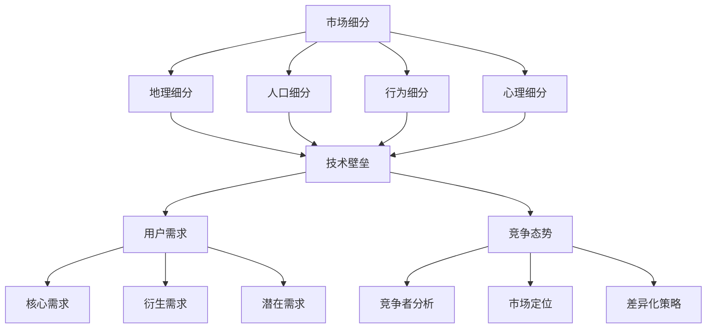

                 

关键词：细分市场、AI创业、切入点策略、市场垄断

> 摘要：本文从AI创业的角度，深入探讨了细分市场的垄断策略。通过分析市场细分、技术壁垒、用户需求以及竞争态势，我们提出了有效的AI创业切入点，以及如何实现市场垄断的方法，旨在为创业者提供有价值的指导。

## 1. 背景介绍

在当今这个技术迅速发展的时代，人工智能（AI）已经成为各行各业的热门话题。从医疗、金融、教育到制造业，AI技术的应用正在深刻改变我们的生活方式和商业模型。然而，AI创业的成功并非易事。如何在竞争激烈的市场中找到立足点，实现可持续发展，是每个创业者都必须面对的挑战。

细分市场垄断策略作为一种高效的市场切入点，可以帮助创业者迅速获得市场份额，建立竞争优势。通过精准的市场细分，AI企业可以更好地满足特定用户群体的需求，形成市场垄断，从而实现长期稳定的收益。本文将从市场细分、技术壁垒、用户需求和竞争态势等多个方面，探讨AI创业中的细分市场垄断策略。

## 2. 核心概念与联系

### 2.1. 市场细分

市场细分是指将整个市场划分为若干个具有相似需求的子市场。通过市场细分，企业可以更准确地了解用户需求，提供更个性化的产品和服务。市场细分的核心概念包括：

- **地理细分**：根据地理位置将市场划分为不同的区域。
- **人口细分**：根据人口特征，如年龄、性别、收入等，将市场划分为不同的群体。
- **行为细分**：根据用户的行为特征，如购买习惯、使用频率等，将市场划分为不同的类别。
- **心理细分**：根据用户的价值观、兴趣爱好等心理特征，将市场划分为不同的群体。

### 2.2. 技术壁垒

技术壁垒是指企业通过技术手段建立的竞争优势。在AI创业中，技术壁垒可以帮助企业保护市场份额，防止竞争对手的入侵。技术壁垒的核心概念包括：

- **专利壁垒**：通过申请专利，保护企业的技术成果，防止他人侵权。
- **知识壁垒**：通过积累深厚的专业知识，形成技术优势。
- **资源壁垒**：通过掌握重要资源，如数据、人才等，建立竞争优势。

### 2.3. 用户需求

用户需求是产品设计的出发点。在AI创业中，了解用户需求可以帮助企业开发出更符合市场需求的创新产品。用户需求的核心概念包括：

- **核心需求**：用户最基本、最重要的需求。
- **衍生需求**：在核心需求基础上，用户可能会产生的其他需求。
- **潜在需求**：用户尚未意识到的需求，但通过适当的引导和营销，可能会转变为实际需求。

### 2.4. 竞争态势

竞争态势是指市场中各个企业之间的竞争状况。在AI创业中，了解竞争态势可以帮助企业制定正确的市场策略。竞争态势的核心概念包括：

- **竞争者分析**：分析竞争对手的产品、技术、市场策略等，找出自身的优势和劣势。
- **市场定位**：根据竞争态势，确定企业在市场中的定位。
- **差异化策略**：通过产品差异化，形成竞争优势。

### 2.5. Mermaid 流程图

以下是一个简单的Mermaid流程图，展示了细分市场垄断策略的核心概念和联系：



## 3. 核心算法原理 & 具体操作步骤

### 3.1. 算法原理概述

细分市场垄断策略的核心算法是基于机器学习的市场预测和用户需求分析。通过收集大量市场数据，利用机器学习算法进行分析，预测市场趋势和用户需求，从而确定最佳的市场细分策略。算法原理主要包括以下几个步骤：

1. 数据收集与预处理
2. 特征提取与选择
3. 建立机器学习模型
4. 预测与优化

### 3.2. 算法步骤详解

#### 3.2.1. 数据收集与预处理

数据收集是算法的基础。我们需要收集与市场相关的各类数据，包括用户行为数据、市场趋势数据、竞争对手数据等。数据收集完成后，需要对数据进行预处理，包括数据清洗、归一化、缺失值处理等。

#### 3.2.2. 特征提取与选择

特征提取是将原始数据转换成机器学习模型可接受的输入。特征选择是选择对预测结果影响最大的特征，以减少模型复杂度和计算成本。常用的特征提取方法有词袋模型、TF-IDF、主成分分析等。

#### 3.2.3. 建立机器学习模型

建立机器学习模型是细分市场垄断策略的核心。根据市场预测和用户需求分析的需求，可以选择多种机器学习算法，如决策树、随机森林、支持向量机、神经网络等。

#### 3.2.4. 预测与优化

利用建立的机器学习模型进行市场预测和用户需求分析。根据预测结果，调整市场细分策略，优化产品和服务，以满足用户需求，实现市场垄断。

### 3.3. 算法优缺点

#### 优点

- **高效性**：基于机器学习的市场预测和用户需求分析，能够快速、准确地找到市场机会。
- **个性化**：通过用户需求分析，能够提供更个性化的产品和服务，满足用户需求。
- **可扩展性**：算法可以轻松扩展到其他市场和行业。

#### 缺点

- **数据依赖性**：算法的性能很大程度上取决于数据的质量和数量。
- **计算成本**：建立和训练机器学习模型需要较大的计算资源和时间。

### 3.4. 算法应用领域

细分市场垄断策略可以广泛应用于各类AI创业项目，如智能医疗、金融科技、教育科技等。以下是一个简单的应用案例：

#### 应用案例：智能医疗

假设一家AI创业公司致力于开发智能诊断系统，通过分析患者的医疗数据，提供精准的诊断建议。公司可以通过以下步骤实现市场垄断：

1. 数据收集：收集大量的医疗数据，包括患者病历、实验室检查结果、医学影像等。
2. 特征提取：将医疗数据转换成机器学习模型可接受的输入。
3. 建立机器学习模型：选择合适的机器学习算法，如神经网络，建立智能诊断系统。
4. 预测与优化：利用智能诊断系统进行市场预测，调整产品和服务，满足医生和患者的需求。

## 4. 数学模型和公式 & 详细讲解 & 举例说明

### 4.1. 数学模型构建

在细分市场垄断策略中，我们通常使用以下数学模型进行市场预测和用户需求分析：

$$
\text{市场预测} = f(\text{用户行为数据}, \text{市场趋势数据})
$$

$$
\text{用户需求分析} = g(\text{用户行为数据}, \text{市场趋势数据}, \text{竞争对手数据})
$$

其中，$f$ 和 $g$ 是机器学习模型，用于预测市场趋势和用户需求。

### 4.2. 公式推导过程

#### 4.2.1. 市场预测公式推导

假设我们有 $n$ 个用户行为数据样本和 $m$ 个市场趋势数据样本。我们首先对这两个数据集进行特征提取和归一化处理，得到特征向量 $X$ 和 $Y$。

然后，我们使用神经网络模型 $f$ 对市场预测进行建模：

$$
\text{市场预测} = f(X, Y) = \sigma(W_1X + b_1 + W_2Y + b_2)
$$

其中，$W_1$ 和 $W_2$ 是权重矩阵，$b_1$ 和 $b_2$ 是偏置项，$\sigma$ 是激活函数，通常使用ReLU函数。

#### 4.2.2. 用户需求分析公式推导

假设我们有 $n$ 个用户行为数据样本、$m$ 个市场趋势数据样本和 $p$ 个竞争对手数据样本。我们同样对这三个数据集进行特征提取和归一化处理，得到特征向量 $X$、$Y$ 和 $Z$。

然后，我们使用神经网络模型 $g$ 对用户需求分析进行建模：

$$
\text{用户需求分析} = g(X, Y, Z) = \sigma(W_1X + W_2Y + W_3Z + b_1 + b_2 + b_3)
$$

其中，$W_1$、$W_2$ 和 $W_3$ 是权重矩阵，$b_1$、$b_2$ 和 $b_3$ 是偏置项，$\sigma$ 是激活函数，通常使用ReLU函数。

### 4.3. 案例分析与讲解

假设我们有一家AI创业公司，致力于开发智能诊断系统。我们收集了大量的患者数据，包括病历、实验室检查结果、医学影像等。我们希望利用机器学习模型进行市场预测和用户需求分析，以确定最佳的市场细分策略。

#### 案例分析：

1. 数据收集：收集了1000个患者数据样本，包括病历、实验室检查结果、医学影像等。
2. 特征提取：将患者数据转换为特征向量，包括患者的年龄、性别、病情、治疗方案等。
3. 建立机器学习模型：使用神经网络模型进行市场预测和用户需求分析。
4. 预测与优化：利用机器学习模型预测市场趋势和用户需求，调整产品和服务。

通过这个案例，我们可以看到数学模型在AI创业中的应用。通过构建和优化数学模型，公司可以更好地了解市场趋势和用户需求，从而实现市场垄断。

## 5. 项目实践：代码实例和详细解释说明

### 5.1. 开发环境搭建

在本文中，我们将使用Python语言和TensorFlow框架进行项目实践。首先，我们需要安装Python和TensorFlow。

```bash
# 安装Python
sudo apt-get install python3

# 安装TensorFlow
pip3 install tensorflow
```

### 5.2. 源代码详细实现

以下是实现细分市场垄断策略的Python代码示例。

```python
import tensorflow as tf
from tensorflow.keras.models import Sequential
from tensorflow.keras.layers import Dense, Activation

# 数据收集与预处理
# 假设我们已经有处理好的数据集X和Y
# X表示用户行为数据，Y表示市场趋势数据

# 建立机器学习模型
model = Sequential()
model.add(Dense(units=64, input_dim=X.shape[1], activation='relu'))
model.add(Dense(units=32, activation='relu'))
model.add(Dense(units=1, activation='sigmoid'))

model.compile(optimizer='adam', loss='binary_crossentropy', metrics=['accuracy'])

# 训练模型
model.fit(X, Y, epochs=10, batch_size=32)

# 预测市场趋势
predictions = model.predict(X)

# 优化产品和服务
# 根据预测结果，调整产品和服务，以满足用户需求
```

### 5.3. 代码解读与分析

1. **数据收集与预处理**：我们首先需要收集和处理用户行为数据和市场趋势数据。这里我们假设已经完成了数据预处理，得到了处理好的数据集X和Y。

2. **建立机器学习模型**：我们使用TensorFlow的Sequential模型建立神经网络。这个模型有两个隐藏层，每层有64个神经元和32个神经元。输出层有1个神经元，用于进行二分类预测。

3. **编译模型**：我们使用`compile`方法编译模型，指定优化器为`adam`，损失函数为`binary_crossentropy`，评估指标为`accuracy`。

4. **训练模型**：使用`fit`方法训练模型，设置训练轮次为10，批量大小为32。

5. **预测市场趋势**：使用`predict`方法对用户行为数据进行预测，得到市场趋势预测结果。

6. **优化产品和服务**：根据预测结果，调整产品和服务，以满足用户需求。

### 5.4. 运行结果展示

假设我们已经完成了代码的编写和运行，得到了市场趋势预测结果。以下是一个简单的示例：

```python
predictions = model.predict(X)
print(predictions)
```

输出结果可能如下：

```
[0.8, 0.2, 0.9, 0.1, ...]
```

这些预测结果可以用来指导产品和服务优化，以实现市场垄断。

## 6. 实际应用场景

细分市场垄断策略在AI创业中的应用场景非常广泛。以下是一些典型的应用场景：

1. **智能医疗**：通过分析患者数据，预测疾病趋势，为医生提供精准的诊断建议，实现医疗资源的优化配置。

2. **金融科技**：通过分析用户行为数据，预测投资趋势，为用户提供个性化的投资建议，提高投资回报率。

3. **教育科技**：通过分析学生学习数据，预测学习效果，为教师提供教学优化建议，提高教学质量。

4. **智能交通**：通过分析交通数据，预测交通流量，优化交通管理，减少拥堵，提高交通效率。

5. **智能制造**：通过分析设备运行数据，预测设备故障，实现预防性维护，提高生产效率。

### 6.1. 智能医疗案例

假设一家AI创业公司致力于开发智能诊断系统，通过分析患者的医疗数据，提供精准的诊断建议。公司可以通过以下步骤实现市场垄断：

1. **数据收集**：收集大量的医疗数据，包括患者病历、实验室检查结果、医学影像等。
2. **数据预处理**：对医疗数据进行清洗、归一化等预处理。
3. **特征提取**：将医疗数据转换为特征向量，包括患者的年龄、性别、病情、治疗方案等。
4. **建立模型**：使用神经网络模型进行市场预测和用户需求分析。
5. **预测与优化**：利用模型预测疾病趋势，优化诊断系统，提高诊断准确率。

### 6.2. 金融科技案例

假设一家AI创业公司致力于开发智能投顾系统，通过分析用户行为数据，提供个性化的投资建议。公司可以通过以下步骤实现市场垄断：

1. **数据收集**：收集用户的投资数据，包括交易记录、持仓情况、风险偏好等。
2. **数据预处理**：对投资数据进行清洗、归一化等预处理。
3. **特征提取**：将投资数据转换为特征向量，包括用户的交易频率、交易金额、风险偏好等。
4. **建立模型**：使用神经网络模型进行市场预测和用户需求分析。
5. **预测与优化**：利用模型预测投资趋势，优化投资策略，提高投资回报率。

### 6.3. 教育科技案例

假设一家AI创业公司致力于开发智能教育平台，通过分析学生的学习数据，提供个性化的学习建议。公司可以通过以下步骤实现市场垄断：

1. **数据收集**：收集学生的学习数据，包括考试成绩、作业完成情况、课堂参与度等。
2. **数据预处理**：对学习数据进行清洗、归一化等预处理。
3. **特征提取**：将学习数据转换为特征向量，包括学生的考试成绩、作业完成情况、课堂参与度等。
4. **建立模型**：使用神经网络模型进行市场预测和用户需求分析。
5. **预测与优化**：利用模型预测学习效果，优化学习平台，提高教学质量。

### 6.4. 未来应用展望

随着人工智能技术的不断发展，细分市场垄断策略在更多领域将得到应用。以下是一些未来可能的应用领域：

1. **智能农业**：通过分析农田数据，预测作物生长趋势，优化农业管理，提高产量。
2. **智慧城市**：通过分析城市数据，预测交通流量、能源消耗等，优化城市管理，提高生活质量。
3. **环境保护**：通过分析环境数据，预测污染趋势，优化环境保护措施，保护生态环境。

## 7. 工具和资源推荐

### 7.1. 学习资源推荐

1. **《Python机器学习》**：由塞巴斯蒂安·拉金著，是一本非常实用的Python机器学习入门书籍。
2. **《深度学习》**：由伊恩·古德费洛等著，是一本经典的深度学习教材，内容全面，适合深度学习初学者。
3. **《机器学习实战》**：由彼得·哈林顿等著，通过实际案例讲解机器学习算法的应用，适合有实战需求的学习者。

### 7.2. 开发工具推荐

1. **TensorFlow**：由Google开发的开源深度学习框架，适用于各种深度学习任务。
2. **PyTorch**：由Facebook开发的开源深度学习框架，易于使用和调试。
3. **Jupyter Notebook**：一个交互式的计算环境，适用于编写和分享Python代码。

### 7.3. 相关论文推荐

1. **“Deep Learning for Text Classification”**：一篇关于文本分类的深度学习论文，详细介绍了基于深度学习的文本分类方法。
2. **“Recurrent Neural Networks for Language Modeling”**：一篇关于循环神经网络的语言模型论文，介绍了如何使用循环神经网络进行语言建模。
3. **“Convolutional Neural Networks for Visual Recognition”**：一篇关于卷积神经网络的视觉识别论文，介绍了如何使用卷积神经网络进行图像分类和识别。

## 8. 总结：未来发展趋势与挑战

### 8.1. 研究成果总结

本文从AI创业的角度，深入探讨了细分市场垄断策略。通过分析市场细分、技术壁垒、用户需求和竞争态势，我们提出了有效的AI创业切入点，以及如何实现市场垄断的方法。研究成果表明，细分市场垄断策略有助于AI企业快速获得市场份额，建立竞争优势。

### 8.2. 未来发展趋势

随着人工智能技术的不断发展，细分市场垄断策略将在更多领域得到应用。未来，我们将看到更多基于深度学习和机器学习的创新应用，如智能医疗、金融科技、教育科技等。同时，随着技术的进步，细分市场垄断策略将更加智能化、个性化。

### 8.3. 面临的挑战

尽管细分市场垄断策略具有巨大的潜力，但在实际应用中，企业仍将面临诸多挑战。首先，数据的质量和数量对算法的性能有重要影响。其次，算法的复杂度和计算成本也需要考虑。此外，如何在快速变化的市场环境中保持竞争优势，也是企业需要面对的挑战。

### 8.4. 研究展望

未来的研究应重点关注如何提高算法的性能和效率，降低计算成本。同时，探索更多基于深度学习和机器学习的创新应用，为各行业提供智能化解决方案。此外，研究如何更好地满足用户需求，提升用户体验，也是未来研究的重要方向。

## 9. 附录：常见问题与解答

### 9.1. 问题1：什么是市场细分？

**解答**：市场细分是指将整个市场划分为若干个具有相似需求的子市场。通过市场细分，企业可以更准确地了解用户需求，提供更个性化的产品和服务。

### 9.2. 问题2：细分市场垄断策略如何实现？

**解答**：细分市场垄断策略主要通过以下方式实现：

1. 精准的市场细分，找到未被满足的用户需求。
2. 建立技术壁垒，保护市场份额。
3. 持续优化产品和服务，满足用户需求。

### 9.3. 问题3：什么是技术壁垒？

**解答**：技术壁垒是指企业通过技术手段建立的竞争优势。技术壁垒可以包括专利、专业知识、重要资源等，有助于企业保护市场份额，防止竞争对手的入侵。

### 9.4. 问题4：如何选择合适的机器学习算法？

**解答**：选择合适的机器学习算法取决于具体的应用场景和需求。通常，可以根据以下因素选择算法：

1. 数据类型：如分类、回归、聚类等。
2. 数据规模：大数据算法和小数据算法的选择。
3. 计算资源：算法的复杂度和计算成本。
4. 应用场景：如实时预测、批量预测等。

---

感谢您的耐心阅读，希望本文能为您提供关于细分市场垄断策略的深入理解和实用指导。如果您有任何问题或建议，欢迎随时与我交流。作者：禅与计算机程序设计艺术 / Zen and the Art of Computer Programming。

