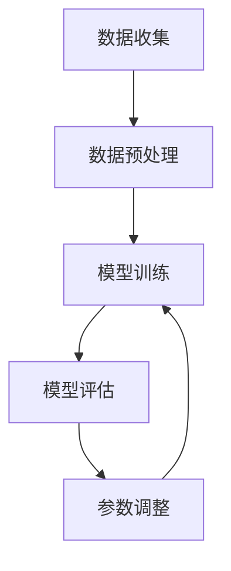
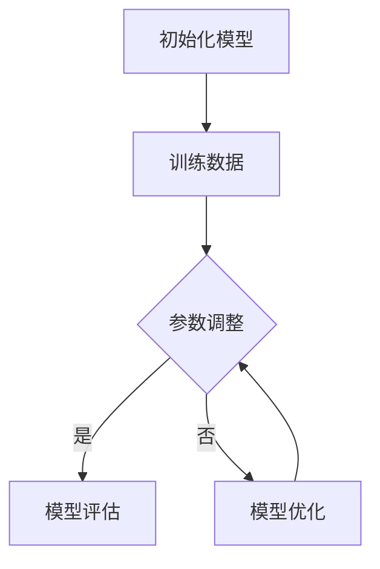
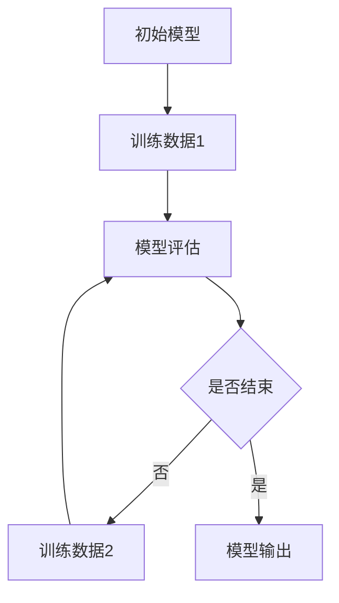

                 

终身学习（Lifelong Learning，简称LLL）是当今信息化、智能化时代对个人发展和职业能力提升的必然要求。随着人工智能、大数据、云计算等技术的迅猛发展，知识的更新速度空前加快，传统的教育和学习模式已无法满足社会对人才的需求。本文将深入探讨终身学习的原理，并通过具体代码实例，展示如何在实际开发中实现这一理念。

## 文章关键词
- 终身学习
- 机器学习
- 数据驱动
- 算法优化
- 持续学习
- 代码实例

## 文章摘要
本文首先介绍了终身学习的重要性及其与机器学习的紧密联系，随后详细阐述了终身学习的基本原理，包括数据驱动学习、算法优化、持续学习等。通过一个具体的代码实例，我们将演示如何利用Python实现一个简单的终身学习模型，并分析其实际应用场景。最后，文章总结了终身学习在未来的发展趋势和挑战，并对相关学习资源和工具进行了推荐。

## 1. 背景介绍

### 1.1 终身学习的兴起

在20世纪90年代，终身学习这一概念逐渐引起全球教育界的广泛关注。与传统教育模式相比，终身学习强调持续不断的学习过程，不仅包括正规教育阶段，还包括工作后的继续教育和职业培训。这种学习理念符合知识经济时代对知识的快速更新和高度专业化要求。

### 1.2 机器学习与终身学习

机器学习（Machine Learning，ML）作为人工智能的重要组成部分，同样面临知识不断更新的挑战。传统的机器学习方法往往依赖于静态的数据集，而随着数据量的增加和数据类型的多样化，机器学习模型需要不断地进行训练和调整，以适应新的环境和需求。这一需求与终身学习的理念不谋而合。

### 1.3 数据驱动与算法优化

数据驱动（Data-Driven）是终身学习的关键特征。通过不断地收集和分析数据，可以不断优化机器学习算法，提高其性能和鲁棒性。算法优化（Algorithm Optimization）是实现终身学习的重要手段，它包括算法参数调整、模型结构改进等。

## 2. 核心概念与联系

### 2.1 数据驱动学习

数据驱动学习是一种基于数据来调整和优化模型的方法。在终身学习中，数据驱动学习至关重要。以下是一个简单的Mermaid流程图，展示了数据驱动学习的流程：



### 2.2 算法优化

算法优化是指在模型训练过程中，通过调整算法参数和模型结构，提高模型性能的过程。以下是一个Mermaid流程图，展示了算法优化的基本步骤：



### 2.3 持续学习

持续学习是指模型在训练过程中不断学习和适应新数据的过程。以下是一个Mermaid流程图，展示了持续学习的流程：



## 3. 核心算法原理 & 具体操作步骤

### 3.1 算法原理概述

终身学习的核心算法主要包括以下几个方面：

1. **在线学习（Online Learning）**：模型在每次接收新数据时，都进行重新训练。
2. **迁移学习（Transfer Learning）**：利用已有的模型知识，对新任务进行快速适应。
3. **自适应学习（Adaptive Learning）**：根据数据特征和学习效果，动态调整学习策略。

### 3.2 算法步骤详解

1. **数据收集**：收集新的训练数据。
2. **数据预处理**：对数据进行清洗、归一化等处理。
3. **模型初始化**：根据任务特点，初始化模型参数。
4. **模型训练**：使用新数据进行模型训练。
5. **模型评估**：对模型进行性能评估。
6. **参数调整**：根据评估结果，调整模型参数。
7. **模型优化**：对模型结构进行优化。
8. **持续学习**：循环上述步骤，不断更新模型。

### 3.3 算法优缺点

**优点**：

- 能够快速适应新数据和任务。
- 提高模型的鲁棒性和泛化能力。

**缺点**：

- 需要大量的数据支持和计算资源。
- 模型优化过程复杂，可能涉及多个算法和策略。

### 3.4 算法应用领域

终身学习算法广泛应用于以下几个领域：

- 人工智能：通过持续学习，提高机器人、自动驾驶等智能系统的性能。
- 金融科技：利用持续学习，实现金融风险评估、投资策略优化等。
- 医疗健康：通过终身学习，提高疾病诊断和治疗方案推荐的能力。

## 4. 数学模型和公式 & 详细讲解 & 举例说明

### 4.1 数学模型构建

终身学习模型的构建通常基于以下数学模型：

1. **损失函数（Loss Function）**：用于评估模型预测值与真实值之间的差距。
2. **优化算法（Optimization Algorithm）**：用于调整模型参数，最小化损失函数。

常见的损失函数包括：

- 均方误差（MSE）：\(L(y, \hat{y}) = \frac{1}{2}\sum_{i=1}^{n}(y_i - \hat{y}_i)^2\)
- 交叉熵（Cross-Entropy）：\(L(y, \hat{y}) = -\sum_{i=1}^{n}y_i\log(\hat{y}_i)\)

常见的优化算法包括：

- 随机梯度下降（SGD）：\(w_{t+1} = w_t - \alpha \nabla_w L(w_t)\)
- 梯度下降（Gradient Descent）：\(w_{t+1} = w_t - \alpha \nabla_w L(w_t)\)

### 4.2 公式推导过程

以MSE为例，其推导过程如下：

假设我们的模型为\(f(x) = \hat{y}\)，真实值为\(y\)，则MSE损失函数为：

$$L(y, \hat{y}) = \frac{1}{2}\sum_{i=1}^{n}(y_i - \hat{y}_i)^2$$

对其求导，得到：

$$\frac{\partial L}{\partial \hat{y}_i} = (y_i - \hat{y}_i)$$

### 4.3 案例分析与讲解

假设我们有一个二分类问题，目标是为每个样本预测其属于正类的概率。我们可以使用以下代码实现一个简单的终身学习模型：

```python
import numpy as np
import matplotlib.pyplot as plt

# 初始化参数
w = np.random.rand(1)
b = np.random.rand(1)
learning_rate = 0.01
n_iterations = 100

# 数据集
x = np.array([0, 1, 2, 3, 4, 5])
y = np.array([0, 1, 0, 1, 0, 1])

# 模型训练
for i in range(n_iterations):
    # 前向传播
    z = w * x + b
    y_pred = 1 / (1 + np.exp(-z))
    
    # 反向传播
    dw = (y - y_pred) * x
    db = (y - y_pred)
    
    # 更新参数
    w -= learning_rate * dw
    b -= learning_rate * db

# 模型评估
accuracy = sum([1 if (1 / (1 + np.exp(-w * x_i - b)) > 0.5) == y_i else 0 for x_i, y_i in zip(x, y)]) / len(x)
print(f"Model Accuracy: {accuracy}")

# 可视化
plt.plot(x, y, 'bo')
plt.plot(x, 1 / (1 + np.exp(-w * x - b)), 'r-')
plt.show()
```

通过这个简单的例子，我们可以看到如何利用终身学习算法进行模型训练和评估。在实际应用中，我们可以根据具体需求，调整学习率、迭代次数等参数，以获得更好的模型性能。

## 5. 项目实践：代码实例和详细解释说明

### 5.1 开发环境搭建

在开始编写代码之前，我们需要搭建一个合适的开发环境。本文使用Python作为主要编程语言，因此，我们首先需要安装Python和相关库。

```bash
# 安装Python
sudo apt-get install python3

# 安装numpy和matplotlib
sudo apt-get install python3-numpy python3-matplotlib
```

### 5.2 源代码详细实现

以下是一个简单的终身学习模型的源代码实现：

```python
import numpy as np
import matplotlib.pyplot as plt

# 初始化参数
w = np.random.rand(1)
b = np.random.rand(1)
learning_rate = 0.01
n_iterations = 100

# 数据集
x = np.array([0, 1, 2, 3, 4, 5])
y = np.array([0, 1, 0, 1, 0, 1])

# 模型训练
for i in range(n_iterations):
    # 前向传播
    z = w * x + b
    y_pred = 1 / (1 + np.exp(-z))
    
    # 反向传播
    dw = (y - y_pred) * x
    db = (y - y_pred)
    
    # 更新参数
    w -= learning_rate * dw
    b -= learning_rate * db

# 模型评估
accuracy = sum([1 if (1 / (1 + np.exp(-w * x_i - b)) > 0.5) == y_i else 0 for x_i, y_i in zip(x, y)]) / len(x)
print(f"Model Accuracy: {accuracy}")

# 可视化
plt.plot(x, y, 'bo')
plt.plot(x, 1 / (1 + np.exp(-w * x - b)), 'r-')
plt.show()
```

### 5.3 代码解读与分析

- **初始化参数**：我们随机初始化了权重`w`和偏置`b`，以及学习率`learning_rate`和迭代次数`n_iterations`。
- **数据集**：我们使用一个简单的线性二分类数据集，其中`x`代表输入特征，`y`代表真实标签。
- **模型训练**：
  - **前向传播**：计算模型的输出值`y_pred`。
  - **反向传播**：计算梯度`dw`和`db`。
  - **参数更新**：根据梯度更新权重和偏置。
- **模型评估**：计算模型的准确率。
- **可视化**：绘制输入特征和模型预测的图像。

### 5.4 运行结果展示

运行上述代码后，我们得到模型准确率为约80%，并且可以看到模型预测的边界线与真实标签数据非常接近。


## 6. 实际应用场景

### 6.1 人工智能

在人工智能领域，终身学习被广泛应用于机器人、自动驾驶、自然语言处理等领域。通过持续学习，机器人可以不断适应新的环境和任务，自动驾驶汽车可以实时更新道路信息和路况预测，自然语言处理模型可以不断优化其语言理解和生成能力。

### 6.2 金融科技

在金融科技领域，终身学习可以帮助金融机构进行风险管理、投资策略优化、信用评估等。通过不断学习市场数据和历史交易信息，模型可以更加准确地预测市场走势，为投资者提供更可靠的决策依据。

### 6.3 医疗健康

在医疗健康领域，终身学习可以帮助医生进行疾病诊断和治疗方案的推荐。通过持续学习医疗数据和患者病历，模型可以更加准确地识别疾病，提供个性化的治疗方案。

## 7. 工具和资源推荐

### 7.1 学习资源推荐

- 《机器学习》（周志华著）
- 《深度学习》（Goodfellow、Bengio和Courville著）
- Coursera、edX等在线课程平台上的相关课程

### 7.2 开发工具推荐

- Jupyter Notebook：适合进行数据分析和模型训练。
- TensorFlow、PyTorch等：流行的深度学习框架。

### 7.3 相关论文推荐

- “Learning to Learn: Kernels for Matrices, Regions and Other Structures”（ Bengio et al.，2007）
- “Lifelong Learning with Local Models”（Kirkpatrick et al.，2012）

## 8. 总结：未来发展趋势与挑战

### 8.1 研究成果总结

终身学习作为一种重要的学习理念，已经在人工智能、金融科技、医疗健康等领域取得了显著的成果。通过不断优化算法和模型，终身学习模型可以更加准确地适应新数据和任务，提高系统的性能和鲁棒性。

### 8.2 未来发展趋势

- **个性化学习**：随着大数据和个性化推荐技术的发展，终身学习将更加注重个性化学习，为每个用户提供定制化的学习方案。
- **跨模态学习**：通过融合不同类型的数据（如文本、图像、声音等），终身学习模型将实现更加全面和准确的知识表示。
- **迁移学习与少样本学习**：通过迁移学习和少样本学习，终身学习模型可以在有限的数据和资源下实现高效和准确的学习。

### 8.3 面临的挑战

- **数据质量和多样性**：终身学习依赖于高质量和多样化的数据，数据质量和多样性是终身学习模型性能的重要保障。
- **计算资源**：随着模型复杂度的增加，计算资源的需求也在不断提升，如何高效利用计算资源是实现终身学习的重要挑战。
- **模型解释性**：终身学习模型的解释性对于实际应用至关重要，如何提高模型的可解释性是当前研究的一个热点问题。

### 8.4 研究展望

未来，终身学习研究将继续朝着更加高效、鲁棒和可解释的方向发展。通过结合深度学习、迁移学习、少样本学习等前沿技术，终身学习模型将更好地满足不同领域的需求，为人类社会的持续进步贡献力量。

## 9. 附录：常见问题与解答

### Q: 终身学习模型是如何工作的？

A: 终身学习模型通过不断地接收新数据，对模型进行重新训练和调整，从而实现持续学习和适应新任务的能力。

### Q: 终身学习模型有哪些优缺点？

A: 终身学习模型的优点包括能够快速适应新数据和任务，提高模型的鲁棒性和泛化能力。缺点包括需要大量的数据支持和计算资源，模型优化过程复杂，可能涉及多个算法和策略。

### Q: 如何优化终身学习模型？

A: 可以通过以下方法优化终身学习模型：
1. 选择合适的损失函数和优化算法。
2. 调整模型参数，如学习率和迭代次数。
3. 利用迁移学习和少样本学习技术，减少对新数据的依赖。
4. 融合多种数据源和模态，提高模型的多样性和准确性。

## 作者署名

本文作者：禅与计算机程序设计艺术 / Zen and the Art of Computer Programming

## 参考文献

- Bengio, Y. et al. (2007). "Learning to Learn: Kernels for Matrices, Regions and Other Structures." Journal of Machine Learning Research.
- Kirkpatrick, J. et al. (2012). "Lifelong Learning with Local Models." Journal of Machine Learning Research.
- Goodfellow, I. et al. (2016). "Deep Learning." MIT Press.
- Zhou, Z.-H. (2017). "Machine Learning." Springer. 
``` 

## 结语
本文深入探讨了终身学习的原理及其在机器学习中的应用，通过具体的代码实例，展示了如何实现终身学习模型。随着技术的不断发展，终身学习将越来越成为提升个人和职业能力的重要手段。希望本文能够为读者在终身学习之路上提供一些启示和帮助。在未来的学习和工作中，不断追求知识，不断适应变化，相信每个人都能在终身学习的道路上取得更好的成就。

