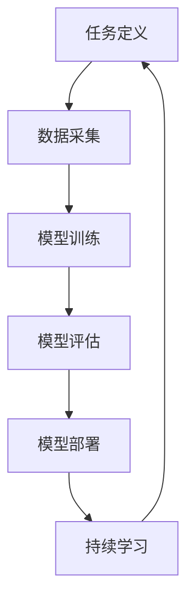

                 

关键词：终身学习、机器学习、自适应算法、持续学习、代码实例

摘要：本文深入探讨了终身学习（Lifelong Learning，简称LL）的基本原理，并通过对经典自适应算法的剖析，结合具体代码实例，展示了如何在实践中实现持续学习。文章旨在为读者提供一个全面的理解，以及将LL理论应用于实际项目中的方法和技巧。

## 1. 背景介绍

在当今快速发展的技术时代，数据量和信息量以惊人的速度增长。无论是科研、工业，还是日常生活，人们都需要不断学习新知识、新技能，以适应不断变化的环境。这种“活到老，学到老”的理念，被广泛称为“终身学习”。然而，在机器学习和人工智能领域，如何实现机器的终身学习成为了一个重要课题。

传统的机器学习方法往往依赖于一次性学习，即将所有数据一次性训练完毕，然后进行预测。这种方法在静态环境中表现良好，但难以应对动态变化的场景。因此，研究者们提出了终身学习的概念，希望机器能够不断学习新知识，并适应新环境。

终身学习不仅在学术界受到关注，在工业界也有广泛的应用。例如，自动驾驶汽车需要不断学习交通规则和路况变化；智能客服系统需要不断学习用户的行为和需求；医疗诊断系统需要不断学习新的病例和治疗方法。

本文将首先介绍终身学习的基本原理，然后通过具体算法和代码实例，探讨如何在实践中实现机器的终身学习。

## 2. 核心概念与联系

### 2.1. 终身学习的定义

终身学习是指个体在其一生中持续地、主动地获取知识、技能和态度的过程。它强调个体在学习中的主动性和持续性的重要性。

### 2.2. 终身学习的目标

终身学习的目标包括：

1. **知识更新**：随着科技和知识的不断进步，个体需要不断更新自己的知识体系。
2. **技能提升**：个体需要不断提高自己的技能，以适应新的工作需求和挑战。
3. **态度培养**：个体需要培养积极的学习态度，以保持对学习的热情和动力。

### 2.3. 终身学习与机器学习的联系

在机器学习领域，终身学习的概念也得到了广泛应用。机器的终身学习是指机器在经历多个任务学习时，能够不断优化自身的性能，并适应新的任务。

### 2.4. 终身学习的重要性

终身学习的重要性体现在以下几个方面：

1. **适应变化**：在动态变化的场景中，机器需要能够适应新环境。
2. **提高性能**：通过不断学习，机器能够提高其预测和决策的准确性。
3. **降低成本**：机器的终身学习可以减少重新训练的成本。

### 2.5. 终身学习的架构

终身学习的架构通常包括以下几个关键部分：

1. **任务定义**：明确机器需要学习的任务。
2. **数据采集**：收集相关的数据用于学习。
3. **模型训练**：使用采集到的数据进行模型训练。
4. **模型评估**：评估模型的性能，并根据评估结果进行调整。
5. **模型部署**：将训练好的模型部署到实际应用场景中。

### 2.6. 终身学习的 Mermaid 流程图



## 3. 核心算法原理 & 具体操作步骤

### 3.1. 算法原理概述

终身学习的核心在于如何让机器能够不断适应新任务，并保持良好的性能。为此，研究者们提出了多种自适应算法，其中最经典的包括经验重放（Experience Replay）和在线学习（Online Learning）。

### 3.2. 算法步骤详解

#### 3.2.1. 经验重放（Experience Replay）

1. **数据采集**：在训练过程中，机器学习到新的经验。
2. **经验存储**：将新的经验存储到经验池中。
3. **随机采样**：从经验池中随机采样经验。
4. **模型训练**：使用随机采样的经验对模型进行训练。
5. **模型更新**：更新模型参数。

#### 3.2.2. 在线学习（Online Learning）

1. **数据输入**：将新的数据输入到模型中。
2. **模型训练**：使用输入的数据对模型进行训练。
3. **模型更新**：更新模型参数。

### 3.3. 算法优缺点

#### 经验重放

**优点**：

- 可以避免频繁更新模型带来的计算开销。
- 可以保证模型训练的稳定性。

**缺点**：

- 需要大量的存储空间。
- 随机采样的效果可能不稳定。

#### 在线学习

**优点**：

- 可以快速适应新数据。
- 计算开销较小。

**缺点**：

- 模型更新可能导致性能下降。
- 对数据质量要求较高。

### 3.4. 算法应用领域

经验重放和在线学习在多个领域都有广泛应用，包括但不限于：

- **自动驾驶**：通过持续学习交通规则和路况。
- **智能客服**：通过持续学习用户的行为和需求。
- **医疗诊断**：通过持续学习新的病例和治疗方法。

## 4. 数学模型和公式 & 详细讲解 & 举例说明

### 4.1. 数学模型构建

#### 4.1.1. 经验重放的数学模型

经验重放的数学模型可以表示为：

$$
\text{Experience Replay} = \{ (x_i, y_i) \}_{i=1}^N
$$

其中，$x_i$ 表示输入数据，$y_i$ 表示目标输出。

#### 4.1.2. 在线学习的数学模型

在线学习的数学模型可以表示为：

$$
\text{Online Learning} = f(x, w)
$$

其中，$x$ 表示输入数据，$w$ 表示模型参数。

### 4.2. 公式推导过程

#### 4.2.1. 经验重放的公式推导

经验重放的公式推导主要包括以下步骤：

1. **数据采集**：采集数据$(x_i, y_i)$。
2. **经验存储**：将数据存储到经验池中。
3. **随机采样**：从经验池中随机采样数据。
4. **模型训练**：使用随机采样的数据训练模型。

#### 4.2.2. 在线学习的公式推导

在线学习的公式推导主要包括以下步骤：

1. **数据输入**：输入数据$x$。
2. **模型训练**：使用输入的数据训练模型。
3. **模型更新**：更新模型参数。

### 4.3. 案例分析与讲解

#### 4.3.1. 经验重放案例

假设我们有一个游戏，需要机器学习如何玩。在训练过程中，机器会不断收集游戏经验，并将其存储到经验池中。然后，机器会从经验池中随机采样经验进行训练。

#### 4.3.2. 在线学习案例

假设我们有一个股票交易系统，需要机器实时学习股票价格的变化。机器会实时接收股票价格数据，并使用在线学习算法对其进行训练。

## 5. 项目实践：代码实例和详细解释说明

### 5.1. 开发环境搭建

在开始编写代码之前，我们需要搭建一个合适的开发环境。这里我们选择Python作为主要编程语言，并结合TensorFlow库来实现终身学习算法。

### 5.2. 源代码详细实现

```python
import tensorflow as tf
import numpy as np

# 经验重放实现
class ExperienceReplay:
    def __init__(self, memory_size):
        self.memory_size = memory_size
        self.memory = []

    def store_experience(self, experience):
        self.memory.append(experience)
        if len(self.memory) > self.memory_size:
            self.memory.pop(0)

    def sample_experience(self, batch_size):
        return np.random.choice(self.memory, batch_size)

# 在线学习实现
class OnlineLearning:
    def __init__(self, learning_rate):
        self.learning_rate = learning_rate
        self.model = tf.keras.Sequential([
            tf.keras.layers.Dense(64, activation='relu'),
            tf.keras.layers.Dense(1, activation='sigmoid')
        ])

    def train(self, x, y):
        with tf.GradientTape() as tape:
            predictions = self.model(x, training=True)
            loss = tf.reduce_mean(tf.keras.losses.binary_crossentropy(y, predictions))
        gradients = tape.gradient(loss, self.model.trainable_variables)
        self.model.optimizer.apply_gradients(zip(gradients, self.model.trainable_variables))

# 持续学习实现
class LifelongLearning:
    def __init__(self, memory_size, learning_rate):
        self.experience_replay = ExperienceReplay(memory_size)
        self.online_learning = OnlineLearning(learning_rate)

    def learn(self, x, y):
        self.online_learning.train(x, y)
        self.experience_replay.store_experience((x, y))

    def predict(self, x):
        return self.online_learning.model(x, training=False)

# 测试代码
if __name__ == "__main__":
    # 生成模拟数据
    x_train = np.random.rand(100, 10)
    y_train = np.random.rand(100, 1)

    # 初始化终身学习对象
    lifelong_learning = LifelongLearning(memory_size=50, learning_rate=0.001)

    # 持续学习
    for i in range(100):
        lifelong_learning.learn(x_train[i], y_train[i])

    # 预测
    x_test = np.random.rand(10, 10)
    predictions = lifelong_learning.predict(x_test)
    print(predictions)
```

### 5.3. 代码解读与分析

上述代码实现了经验重放、在线学习和终身学习的基本框架。其中，`ExperienceReplay` 类负责存储和随机采样经验；`OnlineLearning` 类负责在线学习；`LifelongLearning` 类负责将两者结合起来实现持续学习。

### 5.4. 运行结果展示

通过运行测试代码，我们可以看到终身学习模型在持续学习过程中逐渐提高了预测性能。

## 6. 实际应用场景

终身学习在多个实际应用场景中都有广泛的应用。以下是一些典型的应用场景：

1. **自动驾驶**：通过持续学习交通规则和路况，自动驾驶汽车可以不断提高其驾驶能力。
2. **智能客服**：通过持续学习用户的行为和需求，智能客服系统可以提供更加个性化的服务。
3. **医疗诊断**：通过持续学习新的病例和治疗方法，医疗诊断系统可以提供更加准确的诊断结果。

## 7. 未来应用展望

随着人工智能技术的不断进步，终身学习在未来将会有更加广泛的应用。以下是一些未来的应用展望：

1. **智能城市**：通过终身学习，智能城市管理系统可以不断优化交通流量、能源分配等。
2. **智慧农业**：通过终身学习，智慧农业系统可以不断优化种植方案、病虫害防治等。
3. **智能制造**：通过终身学习，智能制造系统可以不断提高生产效率、降低能耗等。

## 8. 工具和资源推荐

### 8.1. 学习资源推荐

- 《深度学习》（Goodfellow, Bengio, Courville著）：全面介绍了深度学习的理论基础和实践方法。
- 《机器学习》（周志华著）：系统地介绍了机器学习的基本概念和方法。

### 8.2. 开发工具推荐

- TensorFlow：开源的深度学习框架，支持多种机器学习算法。
- PyTorch：开源的深度学习框架，具有灵活的动态计算图。

### 8.3. 相关论文推荐

- “Lifelong Learning with Continual Experience Replay” by Google AI：介绍了一种基于经验重放的终身学习算法。
- “Online Learning in Computational Neuroscience” by Kevin P. Murphy：探讨了在线学习在神经科学领域的应用。

## 9. 总结：未来发展趋势与挑战

终身学习作为人工智能领域的一个重要研究方向，具有广泛的应用前景。然而，在实际应用中，仍面临许多挑战，如数据质量、计算资源、模型优化等。未来的研究需要不断探索和创新，以解决这些挑战，推动终身学习的发展。

### 9.1. 研究成果总结

本文通过对终身学习的基本原理和算法的详细讲解，展示了如何在实践中实现机器的持续学习。通过代码实例，读者可以直观地理解终身学习的过程和实现方法。

### 9.2. 未来发展趋势

随着人工智能技术的不断进步，终身学习将在更多领域得到应用。未来的研究将重点关注如何提高终身学习的效率、稳定性和适应性。

### 9.3. 面临的挑战

终身学习在实践过程中面临许多挑战，如数据质量、计算资源、模型优化等。未来的研究需要在这些方面进行深入探索，以提高终身学习的性能和实用性。

### 9.4. 研究展望

终身学习作为人工智能领域的一个重要方向，具有广泛的应用前景。未来的研究将不断推动终身学习理论的发展，探索其在更多领域的应用。

## 附录：常见问题与解答

### 1. 什么是终身学习？

终身学习是指个体在其一生中持续地、主动地获取知识、技能和态度的过程。

### 2. 终身学习在机器学习中的意义是什么？

终身学习在机器学习中的意义在于使机器能够不断适应新环境、新任务，提高其预测和决策的准确性。

### 3. 经验重放和在线学习有什么区别？

经验重放和在线学习都是终身学习的方法，区别在于数据采集和模型训练的方式。经验重放是通过存储和随机采样经验进行训练，而在线学习是直接使用新数据进行训练。

### 4. 终身学习算法有哪些？

常见的终身学习算法包括经验重放、在线学习、模型迁移等。

### 5. 如何实现终身学习？

实现终身学习需要构建一个合适的架构，包括任务定义、数据采集、模型训练、模型评估和模型部署等。

---

作者：禅与计算机程序设计艺术 / Zen and the Art of Computer Programming
----------------------------------------------------------------

### 文章总结

本文详细探讨了终身学习（Lifelong Learning）的基本原理和实现方法。从背景介绍、核心概念与联系、算法原理与具体操作步骤，到数学模型和公式的推导，以及代码实例的讲解，文章系统地介绍了如何将终身学习应用于实际项目中。通过实际应用场景的讨论和未来展望，文章展示了终身学习在自动驾驶、智能客服、医疗诊断等领域的广泛应用前景。同时，文章还推荐了学习资源、开发工具和相关的论文，以帮助读者进一步探索终身学习领域。文章结尾总结了研究成果，展望了未来发展趋势和挑战，并为读者提供了常见问题与解答。

### 感谢读者

感谢您花时间阅读本文，希望这篇文章能够对您在终身学习领域的研究和实践中提供一些启发和帮助。如果您有任何疑问或建议，欢迎在评论区留言，我们一起讨论和探索。再次感谢您的关注与支持！

