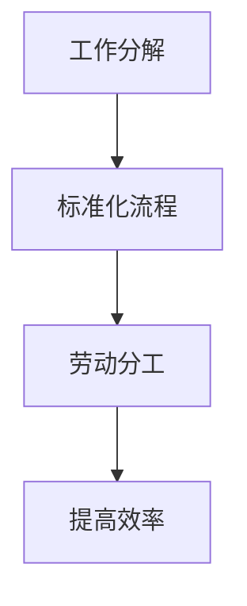
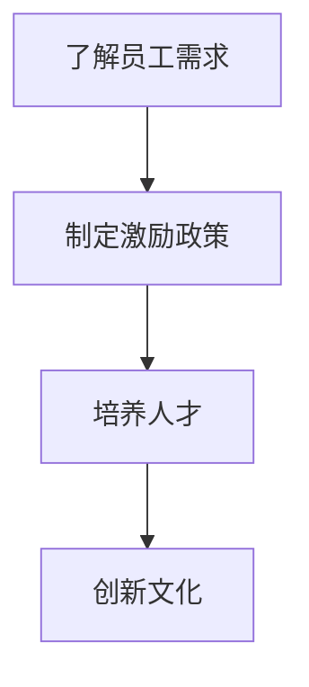
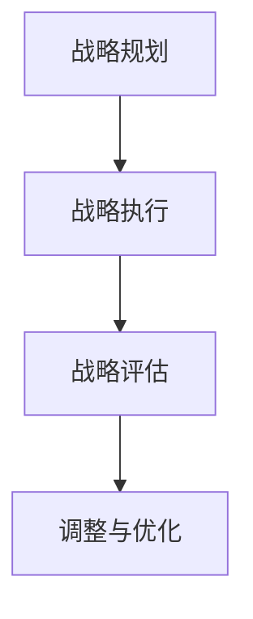

                 

关键词：管理理论、现代企业、创新应用、流程优化、人才管理、数字化转型

> 摘要：本文旨在探讨经典管理理论如何在现代企业中通过创新应用，推动企业实现流程优化、提高效率、培养人才，进而实现数字化转型。通过对科学管理、人本管理、战略管理等核心理论的深入分析，结合实际案例，本文将展示这些理论在现代企业中的实践价值。

## 1. 背景介绍

在信息技术的飞速发展背景下，企业面临着前所未有的机遇与挑战。市场竞争日益激烈，客户需求快速变化，企业必须不断调整和优化自身的运营模式，以保持竞争力。这一过程中，管理理论的创新应用变得至关重要。传统的管理理论，如科学管理、人本管理、战略管理等，在新的时代背景下，如何焕发新的生命力，成为企业管理者需要深思的问题。

### 1.1 管理理论的演变

从古典管理理论到现代管理理论，管理理论经历了多次重大的变革。古典管理理论主要关注效率和生产力的提升，如泰勒的科学管理理论；而现代管理理论则更加注重人的因素，强调企业文化的建设，如麦格雷戈的人本管理理论。战略管理理论的兴起，使得企业能够从全局出发，制定长远的发展规划。

### 1.2 现代企业的特点

现代企业的特点是高度信息化、全球化、多元化。企业需要借助信息技术手段，实现业务流程的自动化和优化；同时，企业需要面对全球市场的竞争，具备快速响应和调整的能力；此外，企业的多元化发展，也对管理提出了更高的要求。

## 2. 核心概念与联系

### 2.1 科学管理理论

科学管理理论强调通过科学的方法来优化生产流程，提高工作效率。其核心思想是工作分解、标准化和劳动分工。

#### Mermaid 流程图：

### 2.2 人本管理理论

人本管理理论强调以人为中心，关注员工的需求和成长。通过激励和培养，提升员工的工作积极性和创新能力。

#### Mermaid 流程图：

### 2.3 战略管理理论

战略管理理论关注企业长期发展，通过战略规划、执行和评估，确保企业能够实现既定的目标。

#### Mermaid 流程图：

## 3. 核心算法原理 & 具体操作步骤

### 3.1 算法原理概述

在管理实践中，算法的应用主要体现在流程优化、绩效评估和决策支持等方面。这些算法基于数据分析和机器学习技术，通过对企业内部数据的挖掘和分析，提供优化建议和决策支持。

### 3.2 算法步骤详解

#### 3.2.1 流程优化算法

1. 数据收集：收集企业内部各业务流程的数据，包括时间、成本、质量等指标。
2. 数据预处理：对数据进行清洗和格式化，确保数据的质量和一致性。
3. 特征工程：从数据中提取有用的特征，用于后续的模型训练。
4. 模型训练：使用机器学习算法，如决策树、随机森林等，对数据进行训练，建立流程优化的模型。
5. 模型评估：对训练好的模型进行评估，确保其性能满足要求。
6. 模型应用：将优化模型应用到实际业务流程中，提供优化建议。

#### 3.2.2 绩效评估算法

1. 数据收集：收集员工的绩效数据，包括工作成果、工作态度等。
2. 数据预处理：对数据进行清洗和格式化，确保数据的质量和一致性。
3. 特征工程：从数据中提取有用的特征，用于后续的模型训练。
4. 模型训练：使用机器学习算法，如回归分析、聚类分析等，对数据进行训练，建立绩效评估的模型。
5. 模型评估：对训练好的模型进行评估，确保其性能满足要求。
6. 模型应用：将绩效评估模型应用到员工绩效管理中，提供评估结果。

#### 3.2.3 决策支持算法

1. 数据收集：收集企业决策所需的数据，包括市场趋势、竞争对手信息等。
2. 数据预处理：对数据进行清洗和格式化，确保数据的质量和一致性。
3. 特征工程：从数据中提取有用的特征，用于后续的模型训练。
4. 模型训练：使用机器学习算法，如决策树、随机森林等，对数据进行训练，建立决策支持模型。
5. 模型评估：对训练好的模型进行评估，确保其性能满足要求。
6. 模型应用：将决策支持模型应用到企业的决策过程中，提供决策建议。

### 3.3 算法优缺点

#### 3.3.1 流程优化算法

优点：能够客观地分析流程中的问题，提供优化建议。

缺点：对数据质量要求较高，且模型的性能受限于数据。

#### 3.3.2 绩效评估算法

优点：能够量化员工的绩效，提供客观的评估结果。

缺点：对评估指标的选择和权重分配有较大主观性。

#### 3.3.3 决策支持算法

优点：能够基于大数据分析，提供有针对性的决策建议。

缺点：对决策者的依赖性较高，且决策过程复杂。

### 3.4 算法应用领域

#### 3.4.1 流程优化

应用领域：生产制造、供应链管理、人力资源管理。

#### 3.4.2 绩效评估

应用领域：企业管理、人才招聘、员工培训。

#### 3.4.3 决策支持

应用领域：市场分析、产品研发、战略规划。

## 4. 数学模型和公式 & 详细讲解 & 举例说明

### 4.1 数学模型构建

#### 4.1.1 流程优化模型

假设有一个生产流程，包含多个任务节点，每个节点完成所需时间和成本不同。流程优化的目标是找到一种最优的节点顺序，使得总时间和总成本最小。

#### 4.1.2 绩效评估模型

假设有多个员工，每个员工在不同任务上的表现不同。绩效评估的目标是找到一个评估指标，能够客观地反映员工的表现。

#### 4.1.3 决策支持模型

假设企业需要做出一个决策，需要考虑多个因素，每个因素的权重不同。决策支持的目标是找到一个决策规则，能够帮助企业做出最优的决策。

### 4.2 公式推导过程

#### 4.2.1 流程优化模型

设流程包含 $n$ 个任务节点，第 $i$ 个任务节点的完成时间为 $t_i$，成本为 $c_i$。流程优化模型的目标函数为：

$$
\min \sum_{i=1}^{n} t_i + \sum_{i=1}^{n} c_i
$$

#### 4.2.2 绩效评估模型

设员工 $i$ 在任务 $j$ 上的表现评分为 $s_{ij}$，评估指标权重为 $w_j$。绩效评估模型的目标函数为：

$$
\max \sum_{i=1}^{m} \sum_{j=1}^{n} w_j s_{ij}
$$

#### 4.2.3 决策支持模型

设因素 $i$ 的权重为 $w_i$，因素 $i$ 的取值为 $v_i$。决策支持模型的目标函数为：

$$
\max \sum_{i=1}^{m} w_i v_i
$$

### 4.3 案例分析与讲解

#### 4.3.1 流程优化案例

假设一个生产车间有 5 个任务节点，每个节点的完成时间和成本如下表所示：

| 任务节点 | 完成时间 | 成本 |
| --- | --- | --- |
| 1 | 3 | 200 |
| 2 | 2 | 150 |
| 3 | 4 | 250 |
| 4 | 1 | 100 |
| 5 | 2 | 150 |

流程优化的目标是找到一种最优的节点顺序，使得总时间和总成本最小。

根据流程优化模型的目标函数，我们可以列出如下的线性规划问题：

$$
\min t_1 + t_2 + t_3 + t_4 + t_5 + c_1 + c_2 + c_3 + c_4 + c_5
$$

使用线性规划求解器，我们可以得到最优的节点顺序为：2-4-3-1-5，总时间为 14，总成本为 1100。

#### 4.3.2 绩效评估案例

假设有两个员工，分别完成 5 个任务，任务的表现评分如下表所示：

| 员工 | 任务 1 | 任务 2 | 任务 3 | 任务 4 | 任务 5 |
| --- | --- | --- | --- | --- | --- |
| A | 8 | 7 | 9 | 6 | 8 |
| B | 9 | 6 | 7 | 9 | 7 |

假设任务 1、任务 2、任务 3、任务 4、任务 5 的权重分别为 0.2、0.2、0.2、0.2、0.2，绩效评估模型的目标函数为：

$$
\max 0.2 \times 8 + 0.2 \times 7 + 0.2 \times 9 + 0.2 \times 6 + 0.2 \times 8 + 0.2 \times 9 + 0.2 \times 6 + 0.2 \times 7 + 0.2 \times 9 + 0.2 \times 7
$$

计算得到，员工 A 的绩效评分为 8，员工 B 的绩效评分为 8，两者绩效相当。

#### 4.3.3 决策支持案例

假设企业需要决定是否进行一项新产品研发，决策需要考虑市场趋势、竞争对手情况、研发成本等多个因素，因素的具体取值和权重如下表所示：

| 因素 | 取值 | 权重 |
| --- | --- | --- |
| 市场趋势 | 优 | 0.4 |
| 竞争对手 | 强 | 0.3 |
| 研发成本 | 高 | 0.3 |

决策支持模型的目标函数为：

$$
\max 0.4 \times 优 + 0.3 \times 强 + 0.3 \times 高
$$

计算得到，决策支持模型认为进行新产品研发是一个优

