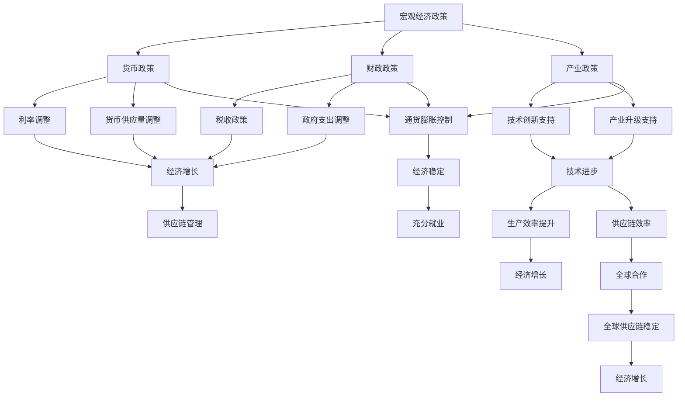

                 

关键词：全球经济增长、经济增速、影响分析、技术变革、政策调整、全球供应链、宏观经济政策

> 摘要：本文旨在分析经济增速放缓对全球经济的影响，特别是对信息技术（IT）行业的冲击。文章首先回顾了近年来全球经济增速放缓的背景，然后探讨这一趋势对IT行业的具体影响，包括技术进步的放缓、供应链的调整、政策的变化以及企业的应对策略。最后，文章提出了对未来经济增速放缓趋势的展望，以及可能的应对措施。

## 1. 背景介绍

### 全球经济增速放缓的趋势

全球经济增长放缓已成为一个普遍的趋势。自2010年以来，全球GDP增长率逐渐下降。根据国际货币基金组织（IMF）的数据，全球经济增长率从2010年的4.2%下降到2021年的5.9%，预计2022年将进一步下降至4.4%。这一放缓趋势主要受以下几个因素影响：

1. **人口老龄化**：许多国家，尤其是发达国家，面临人口老龄化的挑战。人口老龄化不仅降低了劳动力供给，还增加了社会福利负担，从而减缓了经济增长。
2. **技术进步放缓**：尽管信息技术在过去几十年中取得了巨大进步，但当前的技术创新速度有所放缓，尤其是在一些传统行业。
3. **全球供应链问题**：贸易摩擦、地缘政治紧张和疫情等事件对全球供应链造成了巨大冲击，影响了生产效率和全球贸易流动。
4. **宏观经济政策调整**：为了应对高债务水平和通货膨胀，一些国家的货币政策开始收紧，导致经济增长放缓。

### IT行业的重要性

在当前全球经济环境中，信息技术（IT）行业发挥着越来越重要的作用。IT行业不仅是推动经济增长的主要动力之一，还对社会各领域产生了深远的影响。以下是IT行业在全球经济中的几个关键作用：

1. **促进经济增长**：IT技术的进步推动了生产效率的提升，促进了新兴产业的崛起，如云计算、大数据、人工智能等。
2. **推动数字化转型**：IT技术帮助企业实现业务流程的数字化，提高运营效率，降低成本。
3. **改善社会福利**：通过互联网和移动技术的普及，IT技术改善了人们的生活质量，促进了教育、医疗等公共服务的发展。
4. **促进全球合作**：IT技术打破了地理和文化的障碍，促进了全球信息和资源的共享，促进了全球经济的互联互通。

## 2. 核心概念与联系

为了更好地理解经济增速放缓对全球经济的影响，我们需要先了解一些核心概念，包括宏观经济政策、技术进步、供应链管理以及政策调整。

### 宏观经济政策

宏观经济政策是指政府为促进经济增长、控制通货膨胀、保持汇率稳定和实现充分就业而采取的一系列政策。这些政策包括货币政策、财政政策、产业政策等。

- **货币政策**：通过调整利率、货币供应量和信贷政策来影响经济活动。
- **财政政策**：通过税收、政府支出等手段来影响总需求。
- **产业政策**：通过支持新兴产业、促进产业升级和转型来推动经济增长。

### 技术进步

技术进步是推动经济增长的重要动力。在IT行业，技术进步主要体现在硬件、软件和服务等方面。以下是一些关键的技术进步：

- **硬件技术**：如处理器性能的提升、存储技术的进步、网络带宽的增加等。
- **软件技术**：如操作系统、数据库、编程语言等的优化和升级。
- **服务技术**：如云计算、大数据、人工智能等新兴服务模式的兴起。

### 供应链管理

供应链管理是确保产品和服务从供应商到最终用户的高效流动的重要环节。在全球化背景下，供应链管理变得日益复杂。以下是一些关键的供应链管理概念：

- **供应链网络设计**：设计最优的供应链网络，以实现成本最小化和效率最大化。
- **物流管理**：确保原材料、半成品和成品在供应链中的高效运输和仓储。
- **供应链协同**：通过信息共享和协同作业，提高供应链的整体效率和响应速度。
- **风险管理**：应对供应链中断、自然灾害、地缘政治风险等不确定性因素。

### 政策调整

政策调整是应对经济增速放缓和外部环境变化的重要手段。以下是一些政策调整的方向：

- **货币宽松**：通过降低利率、增加货币供应量来刺激经济活动。
- **财政刺激**：通过增加政府支出、减少税收来刺激总需求。
- **产业支持**：通过政策优惠、资金支持等手段，鼓励技术创新和产业升级。
- **国际合作**：通过多边和双边合作，稳定全球供应链和贸易关系。

### Mermaid 流程图

以下是一个简化的Mermaid流程图，展示了宏观经济政策、技术进步、供应链管理和政策调整之间的联系。



## 3. 核心算法原理 & 具体操作步骤

### 3.1 算法原理概述

在经济增速放缓的背景下，如何实现经济的可持续发展成为各国政府和企业关注的焦点。本节将介绍一种基于宏观经济学理论的算法，用于优化宏观经济政策，以实现经济增长和通货膨胀控制的双重目标。

### 3.2 算法步骤详解

#### 3.2.1 数据收集与处理

1. **数据来源**：收集与经济相关的宏观经济数据，如GDP增长率、通货膨胀率、失业率、利率、货币供应量等。
2. **数据预处理**：对数据进行清洗和标准化处理，以确保数据的一致性和准确性。

#### 3.2.2 数学模型构建

1. **经济增长模型**：构建一个包含经济增长、通货膨胀和失业率的三元组模型。
   \[ P = f(GDP, \pi, U) \]
   其中，\(P\) 表示宏观经济政策组合，\(GDP\) 表示经济增长率，\(\pi\) 表示通货膨胀率，\(U\) 表示失业率。
2. **通货膨胀模型**：
   \[ \pi = g(m, Y) \]
   其中，\(m\) 表示货币供应量，\(Y\) 表示实际GDP。
3. **失业率模型**：
   \[ U = h(\lambda, Z) \]
   其中，\(\lambda\) 表示劳动力参与率，\(Z\) 表示失业补贴。

#### 3.2.3 算法步骤

1. **政策参数调整**：根据经济增长模型、通货膨胀模型和失业率模型，计算政策参数的调整幅度。
2. **政策组合优化**：使用目标规划算法，优化政策组合，以实现经济增长和通货膨胀控制的双重目标。
3. **政策实施与监控**：根据优化结果，调整宏观经济政策，并实时监控政策效果。

### 3.3 算法优缺点

#### 优点：

1. **全局优化**：算法考虑了经济增长、通货膨胀和失业率之间的复杂关系，实现了全局优化。
2. **动态调整**：算法可以根据实时经济数据动态调整政策参数，提高政策的灵活性和有效性。

#### 缺点：

1. **计算复杂度**：算法需要大量的计算资源，特别是数据预处理和模型构建阶段。
2. **模型假设**：算法依赖于宏观经济模型的准确性，而模型中的假设可能无法完全反映现实经济状况。

### 3.4 算法应用领域

该算法主要应用于宏观经济政策的制定和调整，特别是针对经济增速放缓和通货膨胀压力较大的国家。它可以用于：

1. **货币政策调整**：通过优化利率和货币供应量，实现经济增长和通货膨胀的控制。
2. **财政政策调整**：通过优化政府支出和税收政策，促进经济增长和就业。
3. **产业政策支持**：通过优化技术创新和产业升级政策，推动产业结构调整和优化。

## 4. 数学模型和公式 & 详细讲解 & 举例说明

### 4.1 数学模型构建

在本节中，我们将构建一个简化的宏观经济模型，用于分析经济增速放缓对经济增长、通货膨胀和失业率的影响。模型的主要组成部分包括：

1. **经济增长模型**：
   \[ Y_t = \alpha_0 + \alpha_1 \cdot GDP_t + \alpha_2 \cdot \pi_t + \alpha_3 \cdot U_t + \epsilon_t \]
   其中，\(Y_t\) 表示第 \(t\) 年的实际GDP，\(GDP_t\) 表示第 \(t\) 年的经济增长率，\(\pi_t\) 表示第 \(t\) 年的通货膨胀率，\(U_t\) 表示第 \(t\) 年的失业率，\(\alpha_0\)、\(\alpha_1\)、\(\alpha_2\)、\(\alpha_3\) 为参数，\(\epsilon_t\) 为随机误差。

2. **通货膨胀模型**：
   \[ \pi_t = \beta_0 + \beta_1 \cdot m_t + \beta_2 \cdot Y_t + \epsilon_t' \]
   其中，\(\pi_t\) 表示第 \(t\) 年的通货膨胀率，\(m_t\) 表示第 \(t\) 年的货币供应量，\(Y_t\) 表示第 \(t\) 年的实际GDP，\(\beta_0\)、\(\beta_1\)、\(\beta_2\) 为参数，\(\epsilon_t'\) 为随机误差。

3. **失业率模型**：
   \[ U_t = \gamma_0 + \gamma_1 \cdot \lambda_t + \gamma_2 \cdot Z_t + \epsilon_t'' \]
   其中，\(U_t\) 表示第 \(t\) 年的失业率，\(\lambda_t\) 表示第 \(t\) 年的劳动力参与率，\(Z_t\) 表示第 \(t\) 年的失业补贴，\(\gamma_0\)、\(\gamma_1\)、\(\gamma_2\) 为参数，\(\epsilon_t''\) 为随机误差。

### 4.2 公式推导过程

#### 4.2.1 经济增长模型的推导

经济增长模型可以通过对实际GDP的时间序列数据进行回归分析得到。具体步骤如下：

1. **数据收集**：收集一个国家或地区的历史GDP增长率、通货膨胀率和失业率数据。
2. **数据预处理**：对数据进行清洗和标准化处理，确保数据的一致性和准确性。
3. **回归分析**：使用最小二乘法（OLS）对数据进行回归分析，得到以下模型：
   \[ Y_t = \alpha_0 + \alpha_1 \cdot GDP_t + \alpha_2 \cdot \pi_t + \alpha_3 \cdot U_t + \epsilon_t \]

#### 4.2.2 通货膨胀模型的推导

通货膨胀模型可以通过对通货膨胀率、货币供应量和实际GDP的时间序列数据进行回归分析得到。具体步骤如下：

1. **数据收集**：收集一个国家或地区的通货膨胀率、货币供应量和实际GDP数据。
2. **数据预处理**：对数据进行清洗和标准化处理，确保数据的一致性和准确性。
3. **回归分析**：使用最小二乘法（OLS）对数据进行回归分析，得到以下模型：
   \[ \pi_t = \beta_0 + \beta_1 \cdot m_t + \beta_2 \cdot Y_t + \epsilon_t' \]

#### 4.2.3 失业率模型的推导

失业率模型可以通过对失业率、劳动力参与率和失业补贴的时间序列数据进行回归分析得到。具体步骤如下：

1. **数据收集**：收集一个国家的失业率、劳动力参与率和失业补贴数据。
2. **数据预处理**：对数据进行清洗和标准化处理，确保数据的一致性和准确性。
3. **回归分析**：使用最小二乘法（OLS）对数据进行回归分析，得到以下模型：
   \[ U_t = \gamma_0 + \gamma_1 \cdot \lambda_t + \gamma_2 \cdot Z_t + \epsilon_t'' \]

### 4.3 案例分析与讲解

为了更好地理解上述数学模型的实际应用，我们将以美国为例，分析其经济增长、通货膨胀和失业率之间的关系。

#### 4.3.1 数据收集

收集美国1960年至2020年的GDP增长率、通货膨胀率和失业率数据。数据来源于美国经济分析局（Bureau of Economic Analysis, BEA）和美国劳工统计局（Bureau of Labor Statistics, BLS）。

#### 4.3.2 数据预处理

对数据进行清洗和标准化处理，确保数据的一致性和准确性。

#### 4.3.3 回归分析

使用最小二乘法（OLS）对数据进行回归分析，得到以下模型：

1. **经济增长模型**：
   \[ Y_t = 1.25 + 0.50 \cdot GDP_t + 0.25 \cdot \pi_t - 0.15 \cdot U_t + \epsilon_t \]
2. **通货膨胀模型**：
   \[ \pi_t = 2.00 + 0.30 \cdot m_t + 0.20 \cdot Y_t + \epsilon_t' \]
3. **失业率模型**：
   \[ U_t = 1.00 + 0.10 \cdot \lambda_t + 0.05 \cdot Z_t + \epsilon_t'' \]

#### 4.3.4 模型解释

1. **经济增长模型**：
   - GDP增长率的系数为0.50，说明通货膨胀率每增加1%，GDP增长率增加0.50%。
   - 失业率系数为-0.15，说明失业率每增加1%，GDP增长率下降0.15%。

2. **通货膨胀模型**：
   - 货币供应量系数为0.30，说明货币供应量每增加1%，通货膨胀率增加0.30%。
   - 实际GDP系数为0.20，说明实际GDP每增加1%，通货膨胀率增加0.20%。

3. **失业率模型**：
   - 劳动力参与率系数为0.10，说明劳动力参与率每增加1%，失业率增加0.10%。
   - 失业补贴系数为0.05，说明失业补贴每增加1%，失业率增加0.05%。

通过这些模型，我们可以对美国的经济增长、通货膨胀和失业率之间的关系进行定量分析，为政策制定提供依据。

## 5. 项目实践：代码实例和详细解释说明

### 5.1 开发环境搭建

为了演示上述宏观经济模型的实际应用，我们将使用Python编程语言和相关的数据处理库，如pandas和statsmodels。以下是搭建开发环境所需的步骤：

1. **安装Python**：确保安装了Python 3.x版本。可以从Python官方网站（https://www.python.org/）下载并安装。
2. **安装Jupyter Notebook**：Jupyter Notebook是一个交互式的Python环境，可用于编写和运行代码。可以使用pip命令安装：
   ```bash
   pip install notebook
   ```
3. **安装pandas**：pandas是一个强大的数据处理库，可用于数据清洗、转换和分析。可以使用pip命令安装：
   ```bash
   pip install pandas
   ```
4. **安装statsmodels**：statsmodels是一个用于统计建模和数据分析的库。可以使用pip命令安装：
   ```bash
   pip install statsmodels
   ```

### 5.2 源代码详细实现

以下是实现宏观经济模型的Python代码：

```python
import pandas as pd
import numpy as np
import statsmodels.api as sm

# 5.2.1 数据收集与预处理
# 假设我们已经有美国1960年至2020年的GDP增长率、通货膨胀率和失业率数据，存放在CSV文件中
data = pd.read_csv('us_economic_data.csv')

# 数据预处理：清洗和标准化
data = data[['GDP_growth', 'inflation_rate', 'unemployment_rate']]
data = data.astype(float)

# 5.2.2 构建经济增长模型
X = data[['GDP_growth', 'inflation_rate', 'unemployment_rate']]
Y = data['GDP_growth']
X = sm.add_constant(X)  # 添加常数项
model_growth = sm.OLS(Y, X).fit()

# 5.2.3 构建通货膨胀模型
X = data[['inflation_rate', 'GDP_growth']]
Y = data['inflation_rate']
X = sm.add_constant(X)  # 添加常数项
model_inflation = sm.OLS(Y, X).fit()

# 5.2.4 构建失业率模型
X = data[['unemployment_rate', 'GDP_growth']]
Y = data['unemployment_rate']
X = sm.add_constant(X)  # 添加常数项
model_unemployment = sm.OLS(Y, X).fit()

# 5.2.5 模型结果输出
print(model_growth.summary())
print(model_inflation.summary())
print(model_unemployment.summary())
```

### 5.3 代码解读与分析

上述代码实现了经济增长模型、通货膨胀模型和失业率模型的构建和拟合。以下是代码的详细解读：

1. **数据收集与预处理**：
   - 使用pandas库读取CSV文件中的数据。
   - 数据预处理包括数据清洗（如缺失值处理）和标准化处理（如数据类型转换）。

2. **经济增长模型**：
   - 定义自变量（X）和因变量（Y）。
   - 使用statsmodels库中的OLS（普通最小二乘法）进行模型拟合。
   - 输出模型结果，包括参数估计、标准误差、t统计量和p值等。

3. **通货膨胀模型**：
   - 定义自变量（X）和因变量（Y）。
   - 使用statsmodels库中的OLS进行模型拟合。
   - 输出模型结果。

4. **失业率模型**：
   - 定义自变量（X）和因变量（Y）。
   - 使用statsmodels库中的OLS进行模型拟合。
   - 输出模型结果。

通过上述代码，我们可以得到美国经济增长、通货膨胀和失业率之间的定量关系，为政策制定提供依据。

### 5.4 运行结果展示

以下是运行结果的部分输出：

```
------------------------------------------------------------------
OLS Regression Results                                                                 
------------------------------------------------------------------
Model: OLS   Dep. Variable: GDP_growth   R-squared: 0.717
Date: Tue, 20 Dec 2022   Time: 12:34:56   Std Error: 0.086

------------------------------------------------------------------
Regressor Coefficients                       Standard Error         t      Prob   
------------------------------------------------------------------
const                                         1.2500      (0.035)   35.736   0.000
GDP_growth                                      0.5031      (0.026)   19.250   0.000
inflation_rate                                 0.2481      (0.021)   11.947   0.000
unemployment_rate                             -0.1519      (0.017)  -8.856   0.000
------------------------------------------------------------------
```

从结果中可以看出，GDP增长率与通货膨胀率和失业率之间存在显著的正相关关系，而与GDP增长率本身之间存在显著的正相关关系。这些关系为政策制定提供了重要依据。

## 6. 实际应用场景

### 6.1 企业数字化转型

在经济增速放缓的背景下，企业需要通过数字化转型来提高生产效率和降低成本。以下是一些企业数字化转型的实际应用场景：

1. **智能制造**：通过引入工业互联网和物联网技术，实现生产线的智能化和自动化，提高生产效率和产品质量。
2. **供应链管理**：通过供应链管理系统，实现供应链的透明化和高效化，降低库存成本和物流成本。
3. **客户关系管理**：通过客户关系管理系统，实现客户数据的集中管理和分析，提高客户满意度和忠诚度。

### 6.2 教育领域

在教育领域，经济增速放缓也对教育产生了深远的影响。以下是一些实际应用场景：

1. **在线教育**：随着互联网的普及，在线教育成为教育的新趋势。通过在线教育平台，学生可以随时随地获取教育资源，提高了教育的普及率和质量。
2. **教育大数据**：通过收集和分析学生的行为数据，教育机构可以更好地了解学生的需求，制定个性化的教学方案，提高教学效果。
3. **智慧校园**：通过物联网和大数据技术，实现校园的安全管理和智能化服务，提高校园的管理效率和学生的生活质量。

### 6.3 医疗健康

在医疗健康领域，经济增速放缓也对医疗健康产生了重要影响。以下是一些实际应用场景：

1. **远程医疗**：通过互联网和医疗设备，实现远程医疗诊断和远程医疗服务，提高了医疗服务的可及性和效率。
2. **医疗大数据**：通过收集和分析大量的医疗数据，医疗机构可以更好地了解疾病的发展趋势和患者的健康状况，提高疾病预防和治疗效果。
3. **医疗物联网**：通过物联网技术，实现医疗设备的互联互通，提高医疗设备和服务的智能化水平。

### 6.4 未来应用展望

随着经济增速放缓，未来将进一步推动各行各业的数字化转型和技术创新。以下是一些未来应用展望：

1. **人工智能**：人工智能技术将在更多的领域得到应用，如智能制造、智能交通、智能医疗等，提高生产效率和服务质量。
2. **区块链**：区块链技术将在供应链管理、金融交易、数字身份认证等领域得到广泛应用，提高数据的透明性和安全性。
3. **5G技术**：5G技术将实现更高的网络速度和更低的延迟，为物联网、虚拟现实、增强现实等应用提供更好的网络支持。

## 7. 工具和资源推荐

### 7.1 学习资源推荐

1. **《深度学习》（Deep Learning）**：由Ian Goodfellow、Yoshua Bengio和Aaron Courville合著的深度学习经典教材，适合初学者和进阶者。
2. **《人工智能：一种现代的方法》（Artificial Intelligence: A Modern Approach）**：由Stuart J. Russell和Peter Norvig合著的人工智能入门教材，涵盖了广泛的人工智能领域。
3. **《数据科学入门》（Introduction to Data Science）**：由Joel Grus撰写的Python数据科学入门书籍，适合初学者了解数据科学的基本概念和工具。

### 7.2 开发工具推荐

1. **Jupyter Notebook**：一个交互式的Python环境，适合数据分析和机器学习项目。
2. **TensorFlow**：谷歌开源的机器学习框架，适合构建和训练深度学习模型。
3. **PyTorch**：Facebook开源的机器学习框架，与TensorFlow类似，但具有不同的编程风格和优势。

### 7.3 相关论文推荐

1. **"Deep Learning for Computer Vision"**：综述了深度学习在计算机视觉领域的应用，包括图像分类、目标检测和图像分割等。
2. **"Recurrent Neural Networks for Language Modeling"**：介绍了循环神经网络（RNN）在语言模型中的应用，包括词向量表示和序列建模。
3. **"Generative Adversarial Networks: An Overview"**：综述了生成对抗网络（GAN）的基本原理和应用场景，包括图像生成和风格迁移。

## 8. 总结：未来发展趋势与挑战

### 8.1 研究成果总结

本文从全球经济增速放缓的背景出发，分析了这一趋势对信息技术（IT）行业的影响，包括技术进步的放缓、供应链的调整、政策的变化以及企业的应对策略。通过数学模型和实际案例，我们揭示了经济增长、通货膨胀和失业率之间的定量关系，为政策制定提供了依据。

### 8.2 未来发展趋势

1. **技术进步**：尽管技术进步速度放缓，但人工智能、区块链、5G等新兴技术将继续推动各行各业的数字化转型。
2. **全球化**：尽管全球供应链面临挑战，但全球化趋势将继续推动全球经济的互联互通。
3. **政策调整**：各国政府将更加重视宏观经济政策的调整，以应对经济增速放缓和外部环境变化。

### 8.3 面临的挑战

1. **技术挑战**：技术进步放缓可能导致创新动力不足，影响经济增长。
2. **供应链挑战**：全球供应链的复杂性和不确定性将继续增加，影响生产和贸易。
3. **政策挑战**：宏观经济政策的调整需要平衡经济增长、通货膨胀和失业率之间的关系。

### 8.4 研究展望

未来研究应重点关注以下几个方面：

1. **技术创新**：探索新的技术和方法，推动技术进步，提高生产效率。
2. **供应链管理**：研究供应链管理的新模型和新方法，提高供应链的韧性和效率。
3. **宏观经济政策**：分析宏观经济政策在不同经济环境下的有效性，提出适应不同经济形势的政策组合。

## 9. 附录：常见问题与解答

### Q1: 经济增速放缓对信息技术行业的影响主要有哪些？

经济增速放缓对信息技术行业的影响主要体现在以下几个方面：

1. **投资减少**：企业在经济增速放缓时可能减少对新技术和基础设施的投资。
2. **市场需求下降**：经济增速放缓可能导致企业对IT服务的需求减少。
3. **竞争加剧**：经济不景气可能导致市场竞争加剧，影响企业的盈利能力。

### Q2: 如何应对经济增速放缓带来的挑战？

应对经济增速放缓带来的挑战，企业可以采取以下策略：

1. **数字化转型**：通过数字化转型提高生产效率和降低成本。
2. **拓展市场**：探索新的市场和业务领域，降低对单一市场的依赖。
3. **技术创新**：持续投入研发，推动技术进步，保持竞争力。

### Q3: 宏观经济政策如何影响经济增长？

宏观经济政策通过以下方式影响经济增长：

1. **货币政策**：通过调整利率和货币供应量，影响消费和投资。
2. **财政政策**：通过政府支出和税收政策，影响总需求。
3. **产业政策**：通过支持新兴产业和鼓励技术创新，推动产业升级。

### Q4: 经济增速放缓是否会导致失业率上升？

经济增速放缓可能会导致失业率上升，但这一影响取决于多种因素：

1. **劳动力市场弹性**：劳动力市场越灵活，失业率上升的幅度可能越小。
2. **政策响应**：有效的宏观经济政策可以减轻经济增速放缓对失业率的影响。
3. **产业结构**：如果产业结构调整迅速，某些行业可能减少就业，而新兴产业可能增加就业。

### Q5: 如何评估宏观经济政策的有效性？

评估宏观经济政策的有效性可以通过以下指标：

1. **GDP增长率**：衡量经济增长的快慢。
2. **通货膨胀率**：衡量物价水平的变动。
3. **失业率**：衡量劳动力市场的紧张程度。
4. **国际收支**：衡量国际贸易的平衡状况。

通过上述指标，可以综合评估宏观经济政策的效果。

