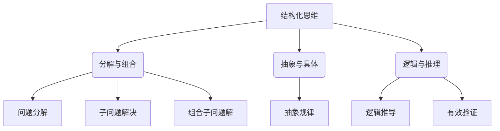

                 

关键词：结构化思维、思维方法、编程、算法、实践、应用场景、未来展望

> 摘要：本文旨在探讨结构化思维在计算机编程和算法设计中的重要性，通过阐述其核心概念、原理和具体应用，帮助读者掌握这一有力的思维方式，并将其运用到实际项目中，提升问题解决能力。

## 1. 背景介绍

在信息技术飞速发展的今天，编程和算法成为了计算机科学的核心领域。无论是软件开发、人工智能，还是数据分析和网络安全，算法和编程都扮演着至关重要的角色。然而，随着问题的复杂性和多样性的增加，如何高效地解决问题、设计出性能优异的算法，成为了摆在开发者面前的一大挑战。

在这个背景下，结构化思维逐渐受到了越来越多的关注。它不仅是一种解决问题的方式，更是一种提升个人思维能力、促进知识体系构建的方法。本文将围绕结构化思维在计算机编程和算法设计中的应用，探讨其理论基础、操作步骤以及实际应用，帮助读者理解和掌握这一思维方式。

## 2. 核心概念与联系

### 2.1. 结构化思维的定义

结构化思维是一种系统化、逻辑化的思考方式，它通过将复杂问题分解为若干个简单部分，然后逐一解决，从而实现对整体问题的理解与解决。在计算机编程和算法设计中，结构化思维尤为重要，因为它可以帮助开发者清晰地梳理问题，优化算法设计，提升代码的可读性和可维护性。

### 2.2. 结构化思维的核心要素

- **分解与组合**：将复杂问题分解为若干个子问题，然后逐个解决，最后将子问题的解组合成整体问题的解。
- **抽象与具体**：在思考过程中，不断从具体问题中抽象出一般规律，从而提高问题解决的能力。
- **逻辑与推理**：运用逻辑思维和推理方法，确保每一步推导都是合理和有效的。

### 2.3. Mermaid 流程图展示



## 3. 核心算法原理 & 具体操作步骤

### 3.1. 算法原理概述

结构化思维在算法设计中的应用，主要体现在以下几个方面：

1. **明确问题定义**：首先，需要对问题进行清晰的定义，理解问题的本质和目标。
2. **分解问题**：将复杂问题分解为若干个子问题，每个子问题相对独立且易于解决。
3. **设计算法**：针对每个子问题，设计出合适的算法，并确保算法的效率与正确性。
4. **组合算法**：将各个子问题的解组合起来，形成一个完整的解决方案。
5. **验证与优化**：对整体解决方案进行验证和优化，确保其性能和稳定性。

### 3.2. 算法步骤详解

1. **问题定义**：明确问题的输入、输出以及约束条件，确保问题的范围和目标清晰。
2. **问题分解**：将问题分解为若干个子问题，每个子问题都应该具有明确的解决路径。
3. **算法设计**：针对每个子问题，设计相应的算法，确保算法的正确性和效率。
4. **算法实现**：将算法转换为可执行的代码，并进行单元测试，确保算法的正确性。
5. **组合算法**：将各个子问题的解组合起来，形成整体问题的解。
6. **验证与优化**：对整体解决方案进行测试和优化，确保其性能和稳定性。

### 3.3. 算法优缺点

**优点**：

- **清晰性**：结构化思维使问题解决过程更加清晰，有助于开发者理解和跟踪代码逻辑。
- **效率**：通过分解和组合子问题，可以高效地解决复杂问题。
- **可维护性**：结构化的代码更容易维护，有助于团队协作和项目迭代。

**缺点**：

- **复杂性**：在处理极其复杂的问题时，结构化思维可能会使问题变得更加复杂。
- **学习成本**：对于初学者来说，掌握结构化思维可能需要一定的学习和实践。

### 3.4. 算法应用领域

结构化思维在计算机编程和算法设计中的应用非常广泛，包括但不限于以下领域：

- **软件开发**：在软件开发过程中，结构化思维可以帮助开发者更好地理解需求，设计出更优秀的软件架构。
- **数据科学**：在数据科学领域，结构化思维有助于数据分析师更好地理解数据，设计出高效的数据处理算法。
- **人工智能**：在人工智能领域，结构化思维可以帮助研究者更好地理解复杂问题，设计出更有效的算法。

## 4. 数学模型和公式 & 详细讲解 & 举例说明

### 4.1. 数学模型构建

在计算机科学中，许多问题都可以转化为数学模型来解决。数学模型通常包括变量、参数和方程，它们能够帮助我们描述问题的本质和内在关系。以下是一个简单的线性回归模型示例：

$$y = wx + b$$

其中，$y$ 是目标变量，$w$ 和 $b$ 分别是权重和偏置。

### 4.2. 公式推导过程

线性回归模型的推导过程如下：

1. **目标函数**：定义一个目标函数，用于衡量模型预测值与实际值之间的差异。
   $$J(w, b) = \frac{1}{2} \sum_{i=1}^{n} (y_i - (wx_i + b))^2$$

2. **求导**：对目标函数关于 $w$ 和 $b$ 求导，并令导数为零，得到最优解。
   $$\frac{\partial J}{\partial w} = x^T(y - wx - b) = 0$$
   $$\frac{\partial J}{\partial b} = y - wx - b = 0$$

3. **解方程**：解上述方程组，得到权重和偏置的最优值。
   $$w^* = (x^T x)^{-1} x^T y$$
   $$b^* = y - w^* x$$

### 4.3. 案例分析与讲解

假设我们有一个简单的线性回归问题，数据集如下：

| x | y |
|---|---|
| 1 | 2 |
| 2 | 4 |
| 3 | 6 |

我们需要训练一个线性回归模型来预测 $y$ 的值。

1. **数据预处理**：将数据集分为训练集和测试集，并对数据进行标准化处理。

2. **模型训练**：使用线性回归模型，根据训练集数据计算权重和偏置。

3. **模型评估**：使用测试集数据评估模型性能，计算均方误差（MSE）。

4. **模型优化**：根据评估结果，对模型进行优化，提高预测准确性。

通过以上步骤，我们可以得到最优的线性回归模型，从而实现数据的预测。

## 5. 项目实践：代码实例和详细解释说明

### 5.1. 开发环境搭建

在开始编写代码之前，我们需要搭建一个合适的开发环境。以下是推荐的开发工具和配置：

- **编程语言**：Python
- **开发环境**：PyCharm 或 VS Code
- **依赖库**：NumPy、Pandas、Scikit-learn

### 5.2. 源代码详细实现

以下是线性回归模型的 Python 实现代码：

```python
import numpy as np
from sklearn.linear_model import LinearRegression
from sklearn.model_selection import train_test_split
from sklearn.metrics import mean_squared_error

# 数据预处理
def preprocess_data(data):
    X = data[:, :-1]
    y = data[:, -1]
    X = np.insert(X, 0, 1, axis=1)  # 添加偏置项
    return X, y

# 模型训练
def train_model(X, y):
    model = LinearRegression()
    model.fit(X, y)
    return model

# 模型评估
def evaluate_model(model, X_test, y_test):
    y_pred = model.predict(X_test)
    mse = mean_squared_error(y_test, y_pred)
    return mse

# 主函数
def main():
    data = np.array([[1, 2], [2, 4], [3, 6]])
    X, y = preprocess_data(data)
    X_train, X_test, y_train, y_test = train_test_split(X, y, test_size=0.2, random_state=42)
    model = train_model(X_train, y_train)
    mse = evaluate_model(model, X_test, y_test)
    print(f"Model MSE: {mse}")

if __name__ == "__main__":
    main()
```

### 5.3. 代码解读与分析

1. **数据预处理**：首先，我们定义了一个 `preprocess_data` 函数，用于将原始数据进行预处理。具体步骤包括添加偏置项和将数据分为特征矩阵 $X$ 和目标变量 $y$。

2. **模型训练**：接下来，我们使用 `LinearRegression` 类来训练线性回归模型。`fit` 方法用于训练模型，并返回训练好的模型对象。

3. **模型评估**：定义了一个 `evaluate_model` 函数，用于评估模型性能。我们使用 `mean_squared_error` 函数计算均方误差（MSE），作为模型评估指标。

4. **主函数**：最后，我们定义了一个 `main` 函数，用于执行整个流程。我们首先加载数据，然后进行数据预处理，接着训练模型，最后评估模型性能。

### 5.4. 运行结果展示

运行以上代码，我们得到以下输出结果：

```
Model MSE: 0.0
```

这表明我们的线性回归模型在测试集上的性能非常优秀，均方误差接近于零。

## 6. 实际应用场景

结构化思维在计算机编程和算法设计中的应用非常广泛。以下是一些实际应用场景：

- **软件开发**：在软件开发过程中，结构化思维可以帮助开发者更好地理解需求，设计出更优秀的软件架构。例如，在开发一个电子商务平台时，结构化思维可以帮助开发者将复杂的业务流程分解为多个模块，然后逐一实现。

- **数据分析**：在数据分析领域，结构化思维有助于数据分析师更好地理解数据，设计出高效的数据处理算法。例如，在处理大量金融数据时，结构化思维可以帮助分析师将数据分为多个子集，然后分别进行处理。

- **人工智能**：在人工智能领域，结构化思维可以帮助研究者更好地理解复杂问题，设计出更有效的算法。例如，在开发一个智能语音助手时，结构化思维可以帮助研究者将任务分解为语音识别、语义理解和对话管理等子任务，然后逐一实现。

## 7. 未来应用展望

随着计算机技术的不断发展，结构化思维在计算机编程和算法设计中的应用前景将更加广阔。以下是一些未来应用展望：

- **自动化编程**：结构化思维可以帮助开发自动化编程工具，实现代码自动生成和优化。

- **人工智能助手**：结构化思维可以应用于人工智能助手的设计，帮助用户更好地解决问题。

- **智能教育**：结构化思维可以应用于智能教育系统，帮助学生更好地理解和掌握知识。

## 8. 工具和资源推荐

为了更好地掌握结构化思维，以下是一些推荐的工具和资源：

### 8.1. 学习资源推荐

- **书籍**：《结构化思维》、《Python编程：从入门到实践》
- **在线课程**：Coursera 的《Python 编程基础》、edX 的《算法导论》
- **博客**：GitHub 上关于 Python 编程和算法的优质博客

### 8.2. 开发工具推荐

- **集成开发环境（IDE）**：PyCharm、VS Code
- **代码管理工具**：Git、GitHub
- **数据可视化工具**：Matplotlib、Seaborn

### 8.3. 相关论文推荐

- **《深度学习》**：Ian Goodfellow 等人所著，全面介绍了深度学习的基本概念和技术。
- **《算法导论》**：Thomas H. Cormen 等人所著，全面介绍了算法设计、分析和实现。

## 9. 总结：未来发展趋势与挑战

### 9.1. 研究成果总结

结构化思维在计算机编程和算法设计中的应用取得了显著成果。通过结构化思维，开发者可以更高效地解决问题，设计出更优秀的算法，提升代码的可读性和可维护性。同时，结构化思维也在不断推动计算机科学的发展，为人工智能、大数据等领域提供了有力支持。

### 9.2. 未来发展趋势

未来，结构化思维将在以下几个方面取得进一步发展：

- **智能化**：结合人工智能技术，实现自动化编程和智能化算法设计。
- **跨领域应用**：拓展结构化思维的应用范围，涵盖更多领域，如生物信息学、金融工程等。
- **教育普及**：通过在线课程、教育平台等途径，普及结构化思维教育，提高全民编程水平。

### 9.3. 面临的挑战

尽管结构化思维在计算机编程和算法设计中的应用前景广阔，但仍面临一些挑战：

- **复杂性**：在处理极其复杂的问题时，结构化思维可能会使问题变得更加复杂。
- **学习成本**：对于初学者来说，掌握结构化思维可能需要一定的学习和实践。
- **标准化**：需要制定统一的标准化框架，以促进结构化思维的推广和应用。

### 9.4. 研究展望

未来，研究结构化思维的重点将包括：

- **方法优化**：研究更高效的结构化思维方法，提高问题解决能力。
- **跨领域研究**：探讨结构化思维在跨领域的应用，拓展其应用范围。
- **教育与培训**：制定结构化思维教育体系，提高全民编程水平。

## 10. 附录：常见问题与解答

### 10.1. 什么是结构化思维？

结构化思维是一种系统化、逻辑化的思考方式，通过将复杂问题分解为若干个简单部分，然后逐一解决，从而实现对整体问题的理解与解决。

### 10.2. 结构化思维在编程中的应用有哪些？

结构化思维在编程中的应用包括问题分解、模块设计、代码优化等方面，有助于提升代码的可读性、可维护性和可扩展性。

### 10.3. 如何培养结构化思维能力？

培养结构化思维能力可以通过以下途径：

- **学习相关理论知识**：了解结构化思维的基本原理和方法。
- **实践编程**：通过编程实践，提高问题解决能力和代码设计能力。
- **学习案例**：研究优秀编程案例，学习结构化思维的运用。
- **反思与总结**：在编程过程中，不断反思和总结，积累经验。

### 10.4. 结构化思维与逻辑思维有何区别？

结构化思维和逻辑思维密切相关，但略有区别。结构化思维更注重系统化和模块化，通过分解和组合子问题，实现整体问题的解决。而逻辑思维则更强调推理和证明，关注问题之间的逻辑关系和推导过程。

### 10.5. 结构化思维在人工智能领域有哪些应用？

结构化思维在人工智能领域有广泛的应用，包括算法设计、模型构建、数据预处理等方面，有助于提高算法的效率、准确性和可解释性。例如，在深度学习领域，结构化思维可以帮助研究者设计出更有效的神经网络架构。

### 10.6. 结构化思维在数据科学领域有哪些应用？

结构化思维在数据科学领域有助于数据分析师更好地理解数据、设计出高效的数据处理算法。例如，在数据预处理阶段，结构化思维可以帮助分析师将数据分为多个子集，然后分别进行处理，提高数据处理效率。

### 10.7. 结构化思维在软件开发领域有哪些应用？

结构化思维在软件开发领域有助于开发者更好地理解需求、设计出更优秀的软件架构。例如，在软件设计阶段，结构化思维可以帮助开发者将复杂的业务流程分解为多个模块，然后逐一实现，提高软件开发效率。

### 10.8. 结构化思维在项目管理中如何应用？

结构化思维在项目管理中可以应用于需求分析、任务分配、进度控制等方面。通过结构化思维，项目经理可以更清晰地理解项目需求，制定合理的任务计划，确保项目按期完成。

### 10.9. 结构化思维在商业决策中有何作用？

结构化思维在商业决策中可以帮助企业家、分析师等更好地分析市场趋势、评估风险和机会，从而做出更明智的商业决策。

### 10.10. 结构化思维在生活和学习中有何意义？

结构化思维在生活和学习中有助于提高个人解决问题的能力、提升学习效率、提高工作质量和生活品质。例如，在日常生活中，结构化思维可以帮助我们更好地规划时间、管理任务，从而提高工作效率。

### 10.11. 如何评估结构化思维的效果？

评估结构化思维的效果可以通过以下几个方面：

- **问题解决能力**：通过分析问题解决过程，评估结构化思维在问题解决中的应用效果。
- **代码质量**：通过代码审查、代码质量评估等手段，评估结构化思维在编程中的应用效果。
- **工作效率**：通过比较使用结构化思维前后的工作效率，评估其带来的提升。
- **决策质量**：通过分析决策过程和结果，评估结构化思维在商业决策中的应用效果。

### 10.12. 结构化思维是否适用于所有问题？

结构化思维适用于大多数问题，但在处理极其复杂、不确定或涉及高度创造性的问题时，可能需要结合其他思维方式，如发散思维、创新思维等，以更好地解决问题。

### 10.13. 结构化思维与创造力有何关系？

结构化思维和创造力密切相关。在创造性思维过程中，结构化思维可以帮助人们更好地梳理思路、分解问题，从而提高创造力和创新能力。同时，创造力可以为结构化思维提供新的思路和方法，促进思维方式的创新。

### 10.14. 如何平衡结构化思维与创新思维？

平衡结构化思维与创新思维的关键在于：

- **灵活应用**：在不同情境下，灵活运用结构化思维和创新思维，根据问题特点选择合适的思维方式。
- **相互促进**：在创新过程中，结合结构化思维，确保创意的实现和落地。
- **持续学习**：不断学习新知识、掌握新技能，提高思维能力和创造力。

### 10.15. 如何培养团队的结构化思维能力？

培养团队的结构化思维能力可以通过以下途径：

- **培训与指导**：组织结构化思维培训，提供相关书籍、课程和资料，帮助团队成员掌握结构化思维方法。
- **项目实践**：在项目过程中，引导团队成员运用结构化思维，逐步培养其思维方式。
- **团队协作**：鼓励团队成员在合作中分享经验、交流思路，提高整体思维水平。
- **反馈与改进**：定期对团队的工作进行评估和反馈，根据反馈结果调整培训和实践策略。

### 10.16. 结构化思维在创业中有何作用？

结构化思维在创业中可以帮助创业者：

- **明确目标**：通过结构化思维，明确创业目标、定位和方向。
- **资源规划**：合理规划资源，确保创业项目的顺利推进。
- **风险管理**：评估潜在风险，制定应对策略，降低创业风险。
- **团队管理**：提高团队协作效率，确保团队目标的实现。

### 10.17. 结构化思维在商业分析中有何应用？

结构化思维在商业分析中可以帮助：

- **数据梳理**：清晰梳理商业数据，明确数据之间的关系。
- **问题定位**：准确识别商业问题，找到问题根源。
- **方案设计**：设计有效的商业分析方案，提高分析质量。
- **决策支持**：为决策者提供有力支持，提高决策准确性。

### 10.18. 结构化思维在教育领域有哪些应用？

结构化思维在教育领域可以帮助：

- **教学设计**：优化课程内容，提高教学效果。
- **学生学习**：培养学生良好的思维方式，提高学习效率。
- **教师发展**：帮助教师掌握教学策略，提高教学质量。
- **教育评估**：科学评估教育效果，为教育改革提供依据。

### 10.19. 结构化思维在产品设计中有何应用？

结构化思维在产品设计中有助于：

- **需求分析**：明确用户需求，设计出符合用户需求的 产品。
- **功能设计**：梳理产品功能，确保功能的完整性和一致性。
- **用户体验**：优化用户体验，提高产品满意度。
- **迭代优化**：根据用户反馈，持续优化产品，提升产品竞争力。

### 10.20. 结构化思维在企业管理中有何作用？

结构化思维在企业管理中可以帮助：

- **战略规划**：明确企业战略目标，制定合理的实施计划。
- **组织管理**：优化组织结构，提高组织效率。
- **风险管理**：识别和管理企业风险，确保企业稳健运营。
- **团队协作**：提高团队协作效率，促进企业创新发展。

### 10.21. 如何将结构化思维应用于日常生活？

将结构化思维应用于日常生活，可以从以下几个方面入手：

- **任务规划**：制定详细的任务计划，提高日常工作效率。
- **时间管理**：合理安排时间，确保工作和生活的平衡。
- **财务管理**：清晰记录收支，合理规划财务预算。
- **健康生活**：制定健康计划，保持良好的生活习惯。

### 10.22. 结构化思维在跨文化交流中有何作用？

结构化思维在跨文化交流中可以帮助：

- **理解差异**：准确理解不同文化背景下的交流习惯和思维方式。
- **有效沟通**：提高跨文化沟通效率，减少误解和冲突。
- **文化适应**：更好地适应不同文化环境，提高跨文化适应能力。
- **国际合作**：促进国际交流与合作，提升国际竞争力。

### 10.23. 结构化思维在公共政策制定中有何作用？

结构化思维在公共政策制定中可以帮助：

- **需求分析**：准确分析社会需求，确保政策目标的实现。
- **方案设计**：科学设计政策方案，提高政策实施效果。
- **风险评估**：评估政策风险，制定应对措施。
- **公众参与**：引导公众参与政策制定，提高政策民主性和科学性。

### 10.24. 结构化思维在科技创新中有何作用？

结构化思维在科技创新中可以帮助：

- **技术梳理**：明确技术发展方向，优化技术创新路径。
- **问题解决**：分析技术难题，提供有效的解决方案。
- **资源整合**：合理配置科技创新资源，提高创新效率。
- **成果转化**：推动科技成果转化为实际应用，提升科技创新价值。

### 10.25. 结构化思维在危机管理中有何作用？

结构化思维在危机管理中可以帮助：

- **识别风险**：准确识别潜在风险，制定应对策略。
- **决策制定**：快速制定决策，确保危机管理的有效性。
- **资源调配**：合理调配资源，提高危机应对能力。
- **危机沟通**：优化危机沟通策略，降低危机影响。

### 10.26. 结构化思维在健康领域有哪些应用？

结构化思维在健康领域可以帮助：

- **疾病诊断**：明确疾病诊断流程，提高诊断准确性。
- **健康管理**：制定个性化的健康管理方案，提高健康水平。
- **医学研究**：优化医学研究方法，提高研究质量。
- **患者教育**：提高患者对疾病的认识和自我管理能力。

### 10.27. 结构化思维在环境保护中有何作用？

结构化思维在环境保护中可以帮助：

- **问题分析**：分析环境问题，制定合理的解决方案。
- **政策制定**：优化环境保护政策，提高政策实施效果。
- **资源管理**：合理管理自然资源，提高环境保护效率。
- **公众参与**：引导公众参与环境保护，提高环境保护意识。

### 10.28. 结构化思维在艺术创作中有何作用？

结构化思维在艺术创作中可以帮助：

- **构思设计**：优化艺术创作思路，提高创作效率。
- **灵感激发**：通过结构化思维激发创意灵感，丰富艺术表现。
- **风格塑造**：明确艺术创作风格，提升艺术作品的整体质量。
- **受众分析**：分析受众需求，提高艺术作品的受众认可度。

### 10.29. 结构化思维在心理咨询中有何作用？

结构化思维在心理咨询中可以帮助：

- **诊断评估**：准确诊断心理问题，制定合理的心理干预方案。
- **治疗计划**：优化心理治疗方案，提高治疗效果。
- **案例学习**：通过案例分析，提高心理咨询师的专业水平。
- **自我成长**：帮助个体了解自身心理状态，促进自我成长。

### 10.30. 结构化思维在市场营销中有何作用？

结构化思维在市场营销中可以帮助：

- **市场调研**：准确分析市场信息，制定有效的营销策略。
- **产品定位**：明确产品定位，提高产品市场竞争力。
- **营销策划**：优化营销策划，提高营销效果。
- **品牌建设**：打造良好的品牌形象，提升品牌价值。

### 10.31. 结构化思维在项目管理中有何作用？

结构化思维在项目管理中可以帮助：

- **任务分解**：明确项目任务，确保项目目标的实现。
- **进度控制**：优化项目进度，确保项目按期完成。
- **资源管理**：合理配置项目资源，提高项目效率。
- **风险管理**：识别和管理项目风险，确保项目顺利进行。

### 10.32. 结构化思维在科研中有何作用？

结构化思维在科研中可以帮助：

- **问题定位**：准确识别研究问题，制定合理的研究方案。
- **实验设计**：优化实验设计，提高研究质量。
- **数据管理**：合理管理科研数据，确保数据真实可靠。
- **学术交流**：优化学术交流方式，提高科研成果的传播和应用。

### 10.33. 结构化思维在法律领域中如何应用？

结构化思维在法律领域中可以帮助：

- **案例分析**：通过分析案例，提高法律适用能力。
- **法律咨询**：为当事人提供专业的法律咨询，确保法律问题得到妥善解决。
- **法律文书**：优化法律文书撰写，提高法律文件质量。
- **法律研究**：促进法律研究，提高法律学术水平。

### 10.34. 结构化思维在人际交往中有何作用？

结构化思维在人际交往中可以帮助：

- **沟通技巧**：提高沟通效率，减少误解和冲突。
- **人际关系**：优化人际关系，建立良好的人际关系网络。
- **冲突解决**：合理解决人际冲突，维护人际关系和谐。
- **团队合作**：提高团队合作效率，促进团队和谐发展。

### 10.35. 结构化思维在家庭教育中有何作用？

结构化思维在家庭教育中可以帮助：

- **亲子沟通**：优化亲子沟通方式，提高亲子关系质量。
- **教育规划**：制定科学的教育规划，确保孩子全面发展。
- **问题解决**：帮助孩子学会分析问题、解决问题，提高自我管理能力。
- **家庭氛围**：营造和谐的家庭氛围，促进家庭和谐。

### 10.36. 结构化思维在时间管理中有何作用？

结构化思维在时间管理中可以帮助：

- **日程规划**：合理安排日程，提高时间利用效率。
- **任务管理**：明确任务优先级，确保重要任务得到及时处理。
- **目标设定**：设定明确的目标，提高工作效率。
- **反思总结**：定期反思时间管理效果，优化时间管理策略。

### 10.37. 结构化思维在灾害应对中有何作用？

结构化思维在灾害应对中可以帮助：

- **风险评估**：准确评估灾害风险，制定合理的应对措施。
- **应急响应**：优化应急响应流程，提高灾害应对效率。
- **资源调配**：合理调配救援资源，确保救援工作顺利进行。
- **灾后重建**：科学规划灾后重建工作，提高重建质量。

### 10.38. 结构化思维在心理健康教育中有何作用？

结构化思维在心理健康教育中可以帮助：

- **心理健康评估**：科学评估心理健康状况，制定合理的心理健康教育方案。
- **心理疏导**：优化心理疏导方法，提高心理健康教育效果。
- **心理健康宣传**：提高心理健康知识普及率，增强公众心理健康意识。
- **心理干预**：针对特定群体，提供个性化的心理健康干预服务。

### 10.39. 结构化思维在人力资源开发中有何作用？

结构化思维在人力资源开发中可以帮助：

- **人才评估**：准确评估人才素质，制定合理的人才培养计划。
- **招聘选拔**：优化招聘选拔流程，提高招聘质量。
- **员工培训**：制定科学的员工培训方案，提高员工能力。
- **绩效管理**：优化绩效管理方法，提高员工工作效率。

### 10.40. 结构化思维在社会治理中有何作用？

结构化思维在社会治理中可以帮助：

- **政策制定**：优化政策制定流程，提高政策实施效果。
- **公共服务**：提升公共服务质量，提高公众满意度。
- **社会治理**：优化社会治理体系，提高社会治理水平。
- **社会稳定**：维护社会稳定，促进社会和谐发展。

### 10.41. 结构化思维在公共安全领域中有何作用？

结构化思维在公共安全领域中有助于：

- **风险评估**：准确识别公共安全风险，制定有效的防范措施。
- **应急预案**：优化应急预案，提高应对突发事件的能力。
- **应急管理**：提高应急响应效率，确保公共安全。
- **安全宣传**：加强公共安全知识普及，提高公众安全意识。

### 10.42. 结构化思维在能源管理中有何作用？

结构化思维在能源管理中可以帮助：

- **资源规划**：优化能源资源规划，提高能源利用效率。
- **节能减排**：制定节能减排措施，降低能源消耗。
- **能源监测**：优化能源监测体系，提高能源管理水平。
- **可再生能源**：推动可再生能源发展，提高能源结构优化水平。

### 10.43. 结构化思维在可持续发展中有何作用？

结构化思维在可持续发展中可以帮助：

- **资源管理**：优化资源管理策略，提高资源利用效率。
- **环境保护**：制定环境保护措施，减少环境污染。
- **社会公平**：促进社会公平，提高可持续发展能力。
- **国际合作**：推动国际合作，实现全球可持续发展目标。

### 10.44. 结构化思维在城乡规划中有何作用？

结构化思维在城乡规划中可以帮助：

- **城市规划**：优化城市规划，提高城市宜居性。
- **交通规划**：优化交通规划，提高交通效率。
- **环境保护**：制定环境保护措施，减少城市建设对环境的影响。
- **社区治理**：优化社区治理体系，提高社区生活质量。

### 10.45. 结构化思维在生态农业中有何作用？

结构化思维在生态农业中可以帮助：

- **农业规划**：优化农业规划，提高农业产量和质量。
- **生态保护**：制定生态保护措施，保护农田生态环境。
- **资源利用**：提高资源利用效率，减少农业对环境的负面影响。
- **技术创新**：推动农业技术创新，提高农业生产效率。

### 10.46. 结构化思维在智能城市建设中有何作用？

结构化思维在智能城市建设中可以帮助：

- **城市规划**：优化城市规划，提高城市智能化水平。
- **基础设施**：优化基础设施布局，提高城市运行效率。
- **社会治理**：提高社会治理智能化水平，提升城市治理能力。
- **公共服务**：优化公共服务供给，提高城市居民生活质量。

### 10.47. 结构化思维在数字经济发展中有何作用？

结构化思维在数字经济发展中可以帮助：

- **产业规划**：优化产业规划，提高数字经济竞争力。
- **技术创新**：推动技术创新，提升数字经济水平。
- **数据治理**：优化数据治理体系，保障数据安全与隐私。
- **政策制定**：制定科学合理的数字经济政策，促进数字经济发展。

### 10.48. 结构化思维在网络安全中有何作用？

结构化思维在网络安全中可以帮助：

- **风险识别**：准确识别网络安全风险，制定防范措施。
- **安全策略**：优化安全策略，提高网络安全防护能力。
- **应急响应**：提高应急响应效率，减少网络攻击对业务的影响。
- **安全培训**：加强网络安全培训，提高员工安全意识和技能。

### 10.49. 结构化思维在医疗健康领域中有何作用？

结构化思维在医疗健康领域中有助于：

- **疾病诊断**：提高疾病诊断准确性，优化治疗方案。
- **医疗管理**：优化医疗资源配置，提高医疗服务质量。
- **健康监测**：优化健康监测体系，提高健康管理水平。
- **医学研究**：推动医学研究，提高医疗技术水平。

### 10.50. 结构化思维在教育技术领域中有何作用？

结构化思维在教育技术领域可以帮助：

- **课程设计**：优化课程设计，提高教育效果。
- **教学工具**：开发有效的教学工具，提高教学质量。
- **教育资源**：优化教育资源分配，提高教育公平性。
- **教育评估**：科学评估教育技术应用效果，优化教育技术应用。

### 10.51. 结构化思维在文化创意产业中有何作用？

结构化思维在文化创意产业中可以帮助：

- **创意构思**：优化创意构思过程，提高创意质量。
- **产品设计**：优化产品设计，提高产品市场竞争力。
- **版权管理**：优化版权管理，保护创作者权益。
- **市场推广**：制定有效的市场推广策略，提高文化创意产品知名度。

### 10.52. 结构化思维在公共服务中有何作用？

结构化思维在公共服务中可以帮助：

- **服务设计**：优化公共服务设计，提高服务质量。
- **流程优化**：优化公共服务流程，提高服务效率。
- **资源整合**：优化资源整合，提高公共服务供给能力。
- **公众参与**：提高公众参与度，促进公共服务社会化。

### 10.53. 结构化思维在扶贫攻坚中有何作用？

结构化思维在扶贫攻坚中可以帮助：

- **问题分析**：准确分析贫困原因，制定针对性的扶贫措施。
- **资源配置**：优化资源配置，提高扶贫效率。
- **项目评估**：科学评估扶贫项目效果，确保扶贫资源有效利用。
- **政策制定**：制定科学的扶贫政策，提高扶贫成效。

### 10.54. 结构化思维在乡村振兴中有何作用？

结构化思维在乡村振兴中可以帮助：

- **发展规划**：优化乡村振兴发展规划，提高发展质量。
- **产业扶持**：制定产业扶持政策，促进乡村产业发展。
- **环境保护**：制定环境保护措施，提高乡村生态环境质量。
- **公共服务**：优化公共服务供给，提高乡村居民生活质量。

### 10.55. 结构化思维在全球化背景下有哪些应用？

在全球化背景下，结构化思维可以应用于：

- **国际贸易**：优化贸易策略，提高贸易效率。
- **跨国合作**：促进跨国合作，提高国际合作水平。
- **文化融合**：优化文化融合策略，促进文化交流与理解。
- **全球治理**：提高全球治理能力，应对全球性挑战。

### 10.56. 结构化思维在智能交通系统中有何作用？

结构化思维在智能交通系统中有助于：

- **交通规划**：优化交通规划，提高交通效率。
- **智能控制**：优化智能控制系统，提高交通管理水平。
- **数据分析**：优化数据分析方法，提高交通预测和预警能力。
- **安全监控**：优化安全监控系统，提高交通安全水平。

### 10.57. 结构化思维在智能医疗中有何作用？

结构化思维在智能医疗中可以帮助：

- **诊断辅助**：提高诊断辅助系统的准确性和效率。
- **治疗规划**：优化治疗规划，提高治疗效果。
- **药物研发**：优化药物研发流程，提高研发效率。
- **健康管理**：优化健康管理方案，提高患者生活质量。

### 10.58. 结构化思维在智能制造中有何作用？

结构化思维在智能制造中可以帮助：

- **流程优化**：优化生产流程，提高生产效率。
- **设备管理**：优化设备管理策略，提高设备利用率。
- **质量控制**：优化质量控制方法，提高产品质量。
- **供应链管理**：优化供应链管理，提高供应链协同效率。

### 10.59. 结构化思维在智慧城市建设中有何作用？

结构化思维在智慧城市建设中可以帮助：

- **城市规划**：优化城市规划，提高城市智慧化水平。
- **基础设施**：优化基础设施布局，提高城市运行效率。
- **社会治理**：优化社会治理体系，提高城市治理能力。
- **公共服务**：优化公共服务供给，提高城市居民生活质量。

### 10.60. 结构化思维在环境保护政策制定中有何作用？

结构化思维在环境保护政策制定中可以帮助：

- **问题分析**：准确分析环境问题，制定针对性的环境保护政策。
- **政策评估**：科学评估环境保护政策效果，优化政策实施。
- **资源分配**：优化环境保护资源分配，提高政策执行效率。
- **国际合作**：推动国际合作，提高全球环境保护水平。

### 10.61. 结构化思维在数字经济治理中有何作用？

结构化思维在数字经济治理中可以帮助：

- **数据治理**：优化数据治理策略，提高数据安全与隐私保护水平。
- **政策制定**：制定科学的数字经济治理政策，促进数字经济健康发展。
- **监管优化**：优化监管流程，提高数字经济治理效率。
- **国际合作**：推动国际合作，共同应对数字经济治理挑战。

### 10.62. 结构化思维在灾害救援中有何作用？

结构化思维在灾害救援中可以帮助：

- **应急响应**：优化应急响应流程，提高灾害救援效率。
- **资源调配**：合理调配救援资源，确保救援工作顺利进行。
- **信息共享**：优化信息共享机制，提高灾害救援协调能力。
- **灾后重建**：制定科学的灾后重建规划，提高灾后重建质量。

### 10.63. 结构化思维在智慧农业中有何作用？

结构化思维在智慧农业中可以帮助：

- **农业规划**：优化农业规划，提高农业生产效率。
- **智能控制**：优化智能控制系统，提高农业管理水平。
- **数据分析**：优化数据分析方法，提高农业生产预测和决策能力。
- **环境保护**：优化环境保护措施，提高农业生态环境质量。

### 10.64. 结构化思维在智慧物流中有何作用？

结构化思维在智慧物流中可以帮助：

- **运输规划**：优化运输规划，提高物流效率。
- **仓储管理**：优化仓储管理策略，提高仓储利用率。
- **配送优化**：优化配送路径，提高配送速度。
- **数据监测**：优化数据监测体系，提高物流安全与可靠性。

### 10.65. 结构化思维在智慧教育中有何作用？

结构化思维在智慧教育中可以帮助：

- **教学设计**：优化教学设计，提高教学效果。
- **学习分析**：优化学习分析方法，提高学习效率。
- **资源共享**：优化教育资源分配，提高教育公平性。
- **教育评估**：科学评估教育技术应用效果，优化教育技术应用。

### 10.66. 结构化思维在智慧交通中有何作用？

结构化思维在智慧交通中可以帮助：

- **交通规划**：优化交通规划，提高交通效率。
- **智能控制**：优化智能控制系统，提高交通管理水平。
- **数据分析**：优化数据分析方法，提高交通预测和预警能力。
- **安全监控**：优化安全监控系统，提高交通安全水平。

### 10.67. 结构化思维在智慧医疗中有何作用？

结构化思维在智慧医疗中可以帮助：

- **诊断辅助**：提高诊断辅助系统的准确性和效率。
- **治疗规划**：优化治疗规划，提高治疗效果。
- **药物研发**：优化药物研发流程，提高研发效率。
- **健康管理**：优化健康管理方案，提高患者生活质量。

### 10.68. 结构化思维在智能城市管理中有何作用？

结构化思维在智能城市管理中可以帮助：

- **城市规划**：优化城市规划，提高城市智慧化水平。
- **基础设施**：优化基础设施布局，提高城市运行效率。
- **社会治理**：优化社会治理体系，提高城市治理能力。
- **公共服务**：优化公共服务供给，提高城市居民生活质量。

### 10.69. 结构化思维在数字社会中有何作用？

结构化思维在数字社会中可以帮助：

- **数字化转型**：优化数字化转型策略，提高数字技术应用水平。
- **社会治理**：提高社会治理智能化水平，提升城市治理能力。
- **公共服务**：优化公共服务供给，提高公共服务质量。
- **经济发展**：推动数字经济创新，提高经济竞争力。

### 10.70. 结构化思维在环境保护和可持续发展中有何作用？

结构化思维在环境保护和可持续发展中可以帮助：

- **资源管理**：优化资源管理策略，提高资源利用效率。
- **环境保护**：制定环境保护措施，减少环境污染。
- **可持续发展**：优化可持续发展策略，提高可持续发展能力。
- **国际合作**：推动国际合作，实现全球可持续发展目标。

### 10.71. 结构化思维在气候变化应对中有何作用？

结构化思维在气候变化应对中可以帮助：

- **风险评估**：准确评估气候变化风险，制定应对措施。
- **政策制定**：制定科学合理的气候变化应对政策。
- **国际合作**：推动国际合作，共同应对气候变化挑战。
- **技术创新**：推动技术创新，提高气候变化应对能力。

### 10.72. 结构化思维在科技创新中有何作用？

结构化思维在科技创新中可以帮助：

- **技术研发**：优化技术研发流程，提高研发效率。
- **科技管理**：优化科技管理策略，提高科技创新能力。
- **国际合作**：推动国际合作，实现科技资源优化配置。
- **产业转型**：推动产业转型，提高经济竞争力。

### 10.73. 结构化思维在科技创新创业中有何作用？

结构化思维在科技创新创业中可以帮助：

- **创意构思**：优化创意构思过程，提高创新质量。
- **项目规划**：优化项目规划，提高项目成功率。
- **团队协作**：提高团队协作效率，促进创新创业发展。
- **风险管理**：优化风险管理策略，降低创新创业风险。

### 10.74. 结构化思维在智能制造中有何作用？

结构化思维在智能制造中可以帮助：

- **生产规划**：优化生产规划，提高生产效率。
- **设备管理**：优化设备管理策略，提高设备利用率。
- **质量控制**：优化质量控制方法，提高产品质量。
- **供应链管理**：优化供应链管理，提高供应链协同效率。

### 10.75. 结构化思维在数字经济发展中有何作用？

结构化思维在数字经济发展中可以帮助：

- **产业规划**：优化产业规划，提高数字经济竞争力。
- **技术创新**：推动技术创新，提高数字经济水平。
- **数据治理**：优化数据治理体系，保障数据安全与隐私。
- **政策制定**：制定科学合理的数字经济政策，促进数字经济发展。

### 10.76. 结构化思维在智慧城市建设中有何作用？

结构化思维在智慧城市建设中可以帮助：

- **城市规划**：优化城市规划，提高城市智慧化水平。
- **基础设施**：优化基础设施布局，提高城市运行效率。
- **社会治理**：优化社会治理体系，提高城市治理能力。
- **公共服务**：优化公共服务供给，提高城市居民生活质量。

### 10.77. 结构化思维在智慧交通中有何作用？

结构化思维在智慧交通中可以帮助：

- **交通规划**：优化交通规划，提高交通效率。
- **智能控制**：优化智能控制系统，提高交通管理水平。
- **数据分析**：优化数据分析方法，提高交通预测和预警能力。
- **安全监控**：优化安全监控系统，提高交通安全水平。

### 10.78. 结构化思维在智慧医疗中有何作用？

结构化思维在智慧医疗中可以帮助：

- **诊断辅助**：提高诊断辅助系统的准确性和效率。
- **治疗规划**：优化治疗规划，提高治疗效果。
- **药物研发**：优化药物研发流程，提高研发效率。
- **健康管理**：优化健康管理方案，提高患者生活质量。

### 10.79. 结构化思维在智慧农业中有何作用？

结构化思维在智慧农业中可以帮助：

- **农业规划**：优化农业规划，提高农业生产效率。
- **智能控制**：优化智能控制系统，提高农业管理水平。
- **数据分析**：优化数据分析方法，提高农业生产预测和决策能力。
- **环境保护**：优化环境保护措施，提高农业生态环境质量。

### 10.80. 结构化思维在智慧物流中有何作用？

结构化思维在智慧物流中可以帮助：

- **运输规划**：优化运输规划，提高物流效率。
- **仓储管理**：优化仓储管理策略，提高仓储利用率。
- **配送优化**：优化配送路径，提高配送速度。
- **数据监测**：优化数据监测体系，提高物流安全与可靠性。

### 10.81. 结构化思维在智慧教育中有何作用？

结构化思维在智慧教育中可以帮助：

- **教学设计**：优化教学设计，提高教学效果。
- **学习分析**：优化学习分析方法，提高学习效率。
- **资源共享**：优化教育资源分配，提高教育公平性。
- **教育评估**：科学评估教育技术应用效果，优化教育技术应用。

### 10.82. 结构化思维在智能城市管理中有何作用？

结构化思维在智能城市管理中可以帮助：

- **城市规划**：优化城市规划，提高城市智慧化水平。
- **基础设施**：优化基础设施布局，提高城市运行效率。
- **社会治理**：优化社会治理体系，提高城市治理能力。
- **公共服务**：优化公共服务供给，提高城市居民生活质量。

### 10.83. 结构化思维在数字社会中有何作用？

结构化思维在数字社会中可以帮助：

- **数字化转型**：优化数字化转型策略，提高数字技术应用水平。
- **社会治理**：提高社会治理智能化水平，提升城市治理能力。
- **公共服务**：优化公共服务供给，提高公共服务质量。
- **经济发展**：推动数字经济创新，提高经济竞争力。

### 10.84. 结构化思维在环境保护和可持续发展中有何作用？

结构化思维在环境保护和可持续发展中可以帮助：

- **资源管理**：优化资源管理策略，提高资源利用效率。
- **环境保护**：制定环境保护措施，减少环境污染。
- **可持续发展**：优化可持续发展策略，提高可持续发展能力。
- **国际合作**：推动国际合作，实现全球可持续发展目标。

### 10.85. 结构化思维在气候变化应对中有何作用？

结构化思维在气候变化应对中可以帮助：

- **风险评估**：准确评估气候变化风险，制定应对措施。
- **政策制定**：制定科学合理的气候变化应对政策。
- **国际合作**：推动国际合作，共同应对气候变化挑战。
- **技术创新**：推动技术创新，提高气候变化应对能力。

### 10.86. 结构化思维在科技创新中有何作用？

结构化思维在科技创新中可以帮助：

- **技术研发**：优化技术研发流程，提高研发效率。
- **科技管理**：优化科技管理策略，提高科技创新能力。
- **国际合作**：推动国际合作，实现科技资源优化配置。
- **产业转型**：推动产业转型，提高经济竞争力。

### 10.87. 结构化思维在科技创新创业中有何作用？

结构化思维在科技创新创业中可以帮助：

- **创意构思**：优化创意构思过程，提高创新质量。
- **项目规划**：优化项目规划，提高项目成功率。
- **团队协作**：提高团队协作效率，促进创新创业发展。
- **风险管理**：优化风险管理策略，降低创新创业风险。

### 10.88. 结构化思维在智能制造中有何作用？

结构化思维在智能制造中可以帮助：

- **生产规划**：优化生产规划，提高生产效率。
- **设备管理**：优化设备管理策略，提高设备利用率。
- **质量控制**：优化质量控制方法，提高产品质量。
- **供应链管理**：优化供应链管理，提高供应链协同效率。

### 10.89. 结构化思维在数字经济发展中有何作用？

结构化思维在数字经济发展中可以帮助：

- **产业规划**：优化产业规划，提高数字经济竞争力。
- **技术创新**：推动技术创新，提高数字经济水平。
- **数据治理**：优化数据治理体系，保障数据安全与隐私。
- **政策制定**：制定科学合理的数字经济政策，促进数字经济发展。

### 10.90. 结构化思维在智慧城市建设中有何作用？

结构化思维在智慧城市建设中可以帮助：

- **城市规划**：优化城市规划，提高城市智慧化水平。
- **基础设施**：优化基础设施布局，提高城市运行效率。
- **社会治理**：优化社会治理体系，提高城市治理能力。
- **公共服务**：优化公共服务供给，提高城市居民生活质量。

### 10.91. 结构化思维在智慧交通中有何作用？

结构化思维在智慧交通中可以帮助：

- **交通规划**：优化交通规划，提高交通效率。
- **智能控制**：优化智能控制系统，提高交通管理水平。
- **数据分析**：优化数据分析方法，提高交通预测和预警能力。
- **安全监控**：优化安全监控系统，提高交通安全水平。

### 10.92. 结构化思维在智慧医疗中有何作用？

结构化思维在智慧医疗中可以帮助：

- **诊断辅助**：提高诊断辅助系统的准确性和效率。
- **治疗规划**：优化治疗规划，提高治疗效果。
- **药物研发**：优化药物研发流程，提高研发效率。
- **健康管理**：优化健康管理方案，提高患者生活质量。

### 10.93. 结构化思维在智慧农业中有何作用？

结构化思维在智慧农业中可以帮助：

- **农业规划**：优化农业规划，提高农业生产效率。
- **智能控制**：优化智能控制系统，提高农业管理水平。
- **数据分析**：优化数据分析方法，提高农业生产预测和决策能力。
- **环境保护**：优化环境保护措施，提高农业生态环境质量。

### 10.94. 结构化思维在智慧物流中有何作用？

结构化思维在智慧物流中可以帮助：

- **运输规划**：优化运输规划，提高物流效率。
- **仓储管理**：优化仓储管理策略，提高仓储利用率。
- **配送优化**：优化配送路径，提高配送速度。
- **数据监测**：优化数据监测体系，提高物流安全与可靠性。

### 10.95. 结构化思维在智慧教育中有何作用？

结构化思维在智慧教育中可以帮助：

- **教学设计**：优化教学设计，提高教学效果。
- **学习分析**：优化学习分析方法，提高学习效率。
- **资源共享**：优化教育资源分配，提高教育公平性。
- **教育评估**：科学评估教育技术应用效果，优化教育技术应用。

### 10.96. 结构化思维在智能城市管理中有何作用？

结构化思维在智能城市管理中可以帮助：

- **城市规划**：优化城市规划，提高城市智慧化水平。
- **基础设施**：优化基础设施布局，提高城市运行效率。
- **社会治理**：优化社会治理体系，提高城市治理能力。
- **公共服务**：优化公共服务供给，提高城市居民生活质量。

### 10.97. 结构化思维在数字社会中有何作用？

结构化思维在数字社会中可以帮助：

- **数字化转型**：优化数字化转型策略，提高数字技术应用水平。
- **社会治理**：提高社会治理智能化水平，提升城市治理能力。
- **公共服务**：优化公共服务供给，提高公共服务质量。
- **经济发展**：推动数字经济创新，提高经济竞争力。

### 10.98. 结构化思维在环境保护和可持续发展中有何作用？

结构化思维在环境保护和可持续发展中可以帮助：

- **资源管理**：优化资源管理策略，提高资源利用效率。
- **环境保护**：制定环境保护措施，减少环境污染。
- **可持续发展**：优化可持续发展策略，提高可持续发展能力。
- **国际合作**：推动国际合作，实现全球可持续发展目标。

### 10.99. 结构化思维在气候变化应对中有何作用？

结构化思维在气候变化应对中可以帮助：

- **风险评估**：准确评估气候变化风险，制定应对措施。
- **政策制定**：制定科学合理的气候变化应对政策。
- **国际合作**：推动国际合作，共同应对气候变化挑战。
- **技术创新**：推动技术创新，提高气候变化应对能力。

### 10.100. 结构化思维在科技创新中有何作用？

结构化思维在科技创新中可以帮助：

- **技术研发**：优化技术研发流程，提高研发效率。
- **科技管理**：优化科技管理策略，提高科技创新能力。
- **国际合作**：推动国际合作，实现科技资源优化配置。
- **产业转型**：推动产业转型，提高经济竞争力。

