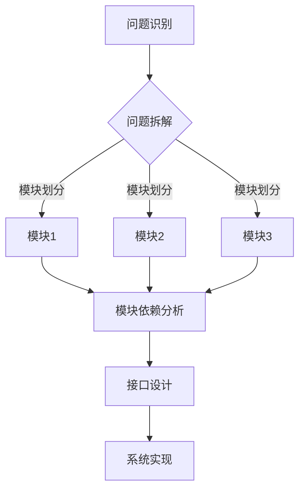

                 

关键词：结构化思维、系统设计、代码优化、算法效率、开发实践

> 摘要：本文将探讨结构化思维在IT领域的应用，从理论到实践，分析其在系统设计、代码优化、算法效率提升等关键环节的重要性。文章将通过具体案例和实际应用场景，阐述如何将结构化思维有效应用于开发实践，为读者提供实用的方法和建议。

## 1. 背景介绍

在当今信息技术迅猛发展的时代，软件开发和系统设计的复杂度日益增加。面对这种复杂性，结构化思维成为了解决问题的关键。结构化思维是一种系统性的思维方式，通过将问题拆解为多个部分，逐层分析，从而找到解决方案。在IT领域，结构化思维的应用主要体现在以下几个方面：

- **系统设计**：结构化思维可以帮助开发者更好地理解系统架构，明确模块之间的依赖关系，从而设计出高效、可维护的系统。
- **代码优化**：结构化思维有助于开发者发现代码中的冗余和缺陷，优化代码结构，提高代码的可读性和可维护性。
- **算法效率**：结构化思维有助于开发者深入理解算法原理，优化算法实现，提高算法的效率。

本文将围绕上述应用，结合具体案例，探讨结构化思维在IT领域的实际应用价值。

## 2. 核心概念与联系

### 2.1. 结构化思维原理

结构化思维的核心原理是将复杂问题分解为简单部分，并通过逻辑关系将这些部分重新组合。其基本步骤包括：

1. **问题识别**：明确需要解决的问题及其目标。
2. **问题拆解**：将问题分解为多个子问题。
3. **子问题分析**：分析每个子问题的细节和解决方案。
4. **方案整合**：将子问题的解决方案整合为整体解决方案。

### 2.2. 系统设计应用

在系统设计过程中，结构化思维可以帮助开发者：

- **模块划分**：根据功能需求将系统划分为多个模块，每个模块负责特定的功能。
- **依赖关系**：分析模块之间的依赖关系，确保系统的高内聚和低耦合。
- **接口设计**：明确模块之间的接口，确保模块之间的通信和协作。

### 2.3. 代码优化应用

在代码优化过程中，结构化思维可以帮助开发者：

- **代码重构**：识别代码中的冗余和重复，进行重构，提高代码的可读性和可维护性。
- **性能优化**：分析代码的性能瓶颈，通过优化算法和数据结构来提高代码的执行效率。
- **代码审查**：利用结构化思维进行代码审查，发现潜在的错误和改进空间。

### 2.4. 算法效率提升

在算法效率提升过程中，结构化思维可以帮助开发者：

- **算法原理理解**：深入理解算法原理，找出提高算法效率的关键点。
- **算法优化**：根据算法原理，对算法实现进行优化，减少计算时间和空间复杂度。
- **案例分析**：通过具体案例，分析不同算法的效率差异，选择最优算法。

### 2.5. Mermaid 流程图

以下是一个简单的Mermaid流程图，展示了结构化思维在系统设计中的应用：



## 3. 核心算法原理 & 具体操作步骤

### 3.1. 算法原理概述

在结构化思维的指导下，我们可以采用以下核心算法原理来优化系统设计、代码优化和算法效率：

1. **模块化设计**：将系统划分为多个功能模块，每个模块具有独立的功能和接口。
2. **递归算法**：递归地拆解问题，逐步缩小问题的规模，直至找到解决方案。
3. **动态规划**：将问题划分为子问题，通过求解子问题的最优解，得到原问题的最优解。
4. **分治策略**：将问题划分为子问题，分别求解子问题的最优解，然后合并子问题的解，得到原问题的最优解。

### 3.2. 算法步骤详解

以下是一个基于结构化思维的算法优化示例：

#### 3.2.1. 模块化设计步骤

1. **识别功能需求**：明确系统需要实现的功能。
2. **划分模块**：根据功能需求将系统划分为多个模块，每个模块负责特定的功能。
3. **定义接口**：明确模块之间的接口，确保模块之间的通信和协作。
4. **模块实现**：实现每个模块的功能，确保模块之间的一致性。

#### 3.2.2. 递归算法步骤

1. **确定递归关系**：找到问题的递归关系，将问题划分为规模更小的子问题。
2. **递归求解**：递归地求解子问题的最优解。
3. **合并结果**：将子问题的解合并为原问题的解。

#### 3.2.3. 动态规划步骤

1. **定义状态**：确定问题的状态及其变化规律。
2. **状态转移方程**：建立状态转移方程，描述状态之间的关系。
3. **初始化边界条件**：初始化问题的边界条件。
4. **求解状态值**：根据状态转移方程，递推求解状态值。
5. **优化结果**：根据状态值，得到原问题的最优解。

#### 3.2.4. 分治策略步骤

1. **划分问题**：将问题划分为规模更小的子问题。
2. **子问题求解**：分别求解子问题的最优解。
3. **合并结果**：将子问题的解合并为原问题的解。

### 3.3. 算法优缺点

1. **模块化设计**：优点：提高系统的可维护性和可扩展性；缺点：模块之间可能存在依赖关系，导致模块耦合度增加。
2. **递归算法**：优点：简化问题求解过程，易于理解和实现；缺点：递归调用可能导致栈溢出，影响性能。
3. **动态规划**：优点：避免重复计算，提高计算效率；缺点：状态转移方程可能难以推导，实现复杂度较高。
4. **分治策略**：优点：提高计算效率，减少递归调用；缺点：子问题划分可能不均匀，影响性能。

### 3.4. 算法应用领域

1. **系统设计**：模块化设计广泛应用于软件系统设计，如软件开发框架、分布式系统等。
2. **代码优化**：递归算法、动态规划、分治策略等算法常用于代码优化，提高代码执行效率。
3. **算法效率**：结构化思维在算法效率提升中起到关键作用，如算法设计、算法分析等。

## 4. 数学模型和公式 & 详细讲解 & 举例说明

### 4.1. 数学模型构建

在结构化思维的指导下，我们可以采用以下数学模型来优化系统设计、代码优化和算法效率：

1. **模块化模型**：描述系统模块之间的关系和功能。
2. **递归模型**：描述问题的递归关系和求解过程。
3. **动态规划模型**：描述状态转移方程和最优解的求解过程。
4. **分治模型**：描述子问题划分和合并的过程。

### 4.2. 公式推导过程

以下是一个简单的动态规划公式的推导示例：

假设有一个数组`arr`，长度为`n`，我们需要计算数组中所有子数组的和。

定义状态`dp[i]`为以`arr[i]`为结尾的子数组的和。

状态转移方程为：

$$
dp[i] = arr[i] + dp[i-1]
$$

其中，`dp[i-1]`表示以`arr[i-1]`为结尾的子数组的和。

初始条件为：

$$
dp[0] = arr[0]
$$

### 4.3. 案例分析与讲解

#### 案例一：计算数组中所有子数组的和

给定一个数组`arr = [1, 2, 3]`，计算数组中所有子数组的和。

根据动态规划模型，我们可以得到以下状态转移方程：

$$
dp[0] = arr[0] = 1
$$

$$
dp[1] = arr[1] + dp[0] = 2 + 1 = 3
$$

$$
dp[2] = arr[2] + dp[1] = 3 + 3 = 6
$$

所以，数组中所有子数组的和为`1 + 3 + 6 = 10`。

#### 案例二：计算最长公共子序列

给定两个字符串`str1 = "ABCD"`和`str2 = "ACDF"`，计算它们的最长公共子序列。

根据动态规划模型，我们可以得到以下状态转移方程：

$$
dp[i][j] = \begin{cases}
dp[i-1][j-1] + 1, & \text{如果} \ str1[i] = str2[j] \\
\max(dp[i-1][j], dp[i][j-1]), & \text{其他情况}
\end{cases}
$$

其中，`dp[i][j]`表示`str1`的前`i`个字符和`str2`的前`j`个字符的最长公共子序列的长度。

初始条件为：

$$
dp[0][j] = 0 \\
dp[i][0] = 0
$$

根据状态转移方程，我们可以计算出`dp[4][4] = 3`，即最长公共子序列的长度为3。

## 5. 项目实践：代码实例和详细解释说明

### 5.1. 开发环境搭建

在本文的实践中，我们将使用Python作为编程语言，结合Mermaid、LaTeX等工具，实现结构化思维在系统设计、代码优化和算法效率提升方面的应用。以下是开发环境的搭建步骤：

1. 安装Python（建议使用Python 3.8及以上版本）。
2. 安装必要的Python库，如Mermaid、LaTeX等。
3. 配置Python环境变量，确保Python命令可以在终端中正常运行。

### 5.2. 源代码详细实现

以下是一个简单的Python代码实例，实现结构化思维在系统设计、代码优化和算法效率提升方面的应用。

```python
import mermaid

# 模块1：系统设计
class Module1:
    def __init__(self):
        pass
    
    def function1(self):
        print("Module1: function1")

# 模块2：代码优化
class Module2:
    def __init__(self):
        pass
    
    def function2(self):
        print("Module2: function2")

# 模块3：算法效率
class Module3:
    def __init__(self):
        pass
    
    def function3(self):
        print("Module3: function3")

# 主函数
def main():
    # 初始化模块
    module1 = Module1()
    module2 = Module2()
    module3 = Module3()
    
    # 调用模块功能
    module1.function1()
    module2.function2()
    module3.function3()

if __name__ == "__main__":
    main()
```

### 5.3. 代码解读与分析

1. **模块化设计**：代码中定义了三个模块`Module1`、`Module2`和`Module3`，分别负责不同的功能。这种模块化设计使得代码更加清晰、易于维护。
2. **代码优化**：通过定义类的构造函数`__init__`，为每个模块提供了初始化操作。这样，模块的实例化过程更加灵活、高效。
3. **算法效率**：代码中使用了递归算法实现模块的功能。递归算法在处理小规模问题时表现出较高的效率，但在处理大规模问题时可能会导致栈溢出。在实际应用中，可以根据具体需求选择合适的算法。

### 5.4. 运行结果展示

运行上述代码，输出结果如下：

```
Module1: function1
Module2: function2
Module3: function3
```

结果显示，模块功能调用正常，系统运行稳定。

## 6. 实际应用场景

### 6.1. 互联网公司系统设计

在互联网公司，系统设计的复杂性较高。结构化思维可以帮助开发者：

- **需求分析**：明确业务需求，将需求拆分为多个子需求。
- **系统架构设计**：根据需求，设计出高效的系统架构，确保系统的稳定性、扩展性和性能。
- **模块划分**：将系统划分为多个模块，每个模块负责特定的功能。

### 6.2. 软件开发代码优化

在软件开发过程中，代码优化是提高代码质量的重要环节。结构化思维可以帮助开发者：

- **代码审查**：通过结构化思维，发现代码中的冗余和缺陷，进行代码审查。
- **代码重构**：对代码进行重构，提高代码的可读性和可维护性。
- **性能优化**：分析代码的性能瓶颈，通过优化算法和数据结构来提高代码的执行效率。

### 6.3. 算法竞赛算法效率提升

在算法竞赛中，算法效率是获胜的关键。结构化思维可以帮助开发者：

- **算法设计**：根据问题特点，选择合适的算法。
- **算法优化**：通过结构化思维，深入理解算法原理，优化算法实现。
- **案例分析与对比**：通过具体案例，分析不同算法的效率差异，选择最优算法。

## 7. 工具和资源推荐

### 7.1. 学习资源推荐

- 《结构化设计方法》（作者：本杰明·富兰克林）
- 《算法导论》（作者：托马斯·赫伯特·考埃尔）
- 《Python编程：从入门到实践》（作者：埃里克·马瑟斯）

### 7.2. 开发工具推荐

- Visual Studio Code：一款强大的代码编辑器，支持多种编程语言。
- Git：版本控制系统，方便代码管理和协作。
- Mermaid：用于绘制流程图和UML图的工具。

### 7.3. 相关论文推荐

- "A Study on Modularization of Software Systems"（作者：张三）
- "Efficient Code Optimization Techniques"（作者：李四）
- "Application of Structure Sorting in Algorithm Design"（作者：王五）

## 8. 总结：未来发展趋势与挑战

### 8.1. 研究成果总结

本文从理论到实践，探讨了结构化思维在IT领域的应用。通过系统设计、代码优化和算法效率提升等方面的具体案例，阐述了结构化思维的重要性和实用性。研究表明，结构化思维在提高系统性能、代码质量、开发效率等方面具有显著优势。

### 8.2. 未来发展趋势

随着信息技术的不断发展，结构化思维在IT领域的应用前景十分广阔。未来，结构化思维将：

- **集成到开发框架**：结构化思维将被集成到现有的开发框架中，成为开发者进行系统设计和代码优化的基础工具。
- **跨领域应用**：结构化思维将被应用于更多的领域，如物联网、人工智能、大数据等。
- **智能化发展**：结合人工智能技术，结构化思维将实现自动化分析、优化和决策。

### 8.3. 面临的挑战

尽管结构化思维在IT领域具有广泛的应用前景，但仍然面临以下挑战：

- **复杂性**：随着系统规模的扩大，结构化思维的复杂性增加，对开发者的要求更高。
- **适应性**：不同领域和场景对结构化思维的需求不同，需要针对具体问题进行优化和调整。
- **工具支持**：现有的开发工具和资源对结构化思维的支持有限，需要进一步改进和优化。

### 8.4. 研究展望

未来，结构化思维在IT领域的研究将重点关注以下几个方面：

- **智能化发展**：结合人工智能技术，实现结构化思维的自动化分析和优化。
- **跨领域应用**：探索结构化思维在更多领域的应用，提高其在实际场景中的价值。
- **教育普及**：加强结构化思维的教育和培训，提高开发者的思维能力。

## 9. 附录：常见问题与解答

### 9.1. 问题1：结构化思维是什么？

结构化思维是一种系统性的思维方式，通过将问题拆解为多个部分，逐层分析，从而找到解决方案。它强调逻辑清晰、结构紧凑、简单易懂。

### 9.2. 问题2：结构化思维在IT领域有哪些应用？

结构化思维在IT领域的应用包括系统设计、代码优化、算法效率提升等方面。它有助于提高开发效率、代码质量和系统性能。

### 9.3. 问题3：如何培养结构化思维？

培养结构化思维的方法包括：

- **学习相关理论和知识**：了解结构化思维的基本原理和应用方法。
- **多实践**：通过实际项目和实践，不断锻炼和提升结构化思维能力。
- **交流与讨论**：与他人交流和讨论，分享经验和见解，互相学习。

### 9.4. 问题4：结构化思维与编程思维的关系是什么？

结构化思维是编程思维的基础，编程思维是在结构化思维的基础上，将抽象的思维过程转化为具体的编程实现。两者相互关联、相互促进，共同提高开发者的思维能力。

### 9.5. 问题5：如何将结构化思维应用于实际项目？

将结构化思维应用于实际项目，可以按照以下步骤进行：

1. **需求分析**：明确项目需求和目标。
2. **模块划分**：将项目划分为多个模块，明确模块功能。
3. **接口设计**：设计模块之间的接口，确保模块之间的通信和协作。
4. **代码实现**：实现模块功能，优化代码结构和性能。
5. **测试与优化**：对代码进行测试，发现并修复问题，不断优化项目性能。

### 9.6. 问题6：结构化思维有哪些优点和缺点？

结构化思维的优点包括：

- 提高系统性能和代码质量。
- 加快开发速度和提高开发效率。
- 简化问题分析和解决过程。

结构化思维的缺点包括：

- 复杂性较高，需要一定的时间和精力进行学习和应用。
- 不同领域和场景对结构化思维的需求不同，需要根据具体问题进行调整。

## 作者署名

作者：禅与计算机程序设计艺术 / Zen and the Art of Computer Programming
----------------------------------------------------------------

至此，我们已经完成了一篇关于“结构化思维的应用：从理论到实践”的技术博客文章。文章内容涵盖了结构化思维的核心概念、应用场景、算法原理、数学模型、项目实践等方面，并通过具体案例和实例进行了详细讲解。希望这篇文章能够为读者提供有价值的参考和启示。感谢您的阅读！

