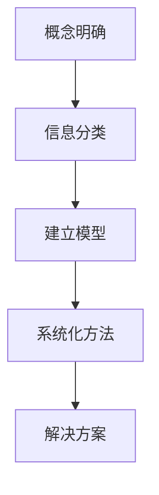

                 

关键词：结构化思维、混沌管理、系统架构、人工智能、编程实践

> 摘要：本文旨在探讨如何在复杂的信息环境中运用结构化思维，从混沌中提炼出清晰的解决方案。通过引入现代计算机科学的核心概念和算法原理，本文将提供一个系统性的框架，帮助读者在编程、项目管理以及软件架构等方面实现从混乱到有序的转换。

## 1. 背景介绍

在当今快速发展的信息技术时代，复杂性和不确定性是信息领域的两大特点。无论是面对庞大的数据集，还是处理多变的业务需求，如何保持思维的清晰和逻辑的严谨，成为了每个开发者和管理者必须面对的挑战。传统的线性思维模式往往难以应对复杂系统的多样性和动态性，因此，结构化思维成为了一种重要的解决思路。

结构化思维是一种通过明确概念、分类信息、建立模型和系统化方法来提高问题解决效率的思维模式。它不仅适用于商业管理，在编程、软件架构和人工智能等计算机科学领域也有着广泛的应用。通过本文的探讨，我们将深入了解如何将结构化思维应用于实际的技术工作中，从而实现从混沌到清晰的转变。

## 2. 核心概念与联系

为了深入理解结构化思维，我们需要先明确几个核心概念，并了解它们之间的联系。以下是结构化思维中几个重要的概念和它们之间的相互关系：

### 2.1 概念明确

**概念明确**是结构化思维的基础。它要求我们在思考问题时，要确保每个概念都是清晰、准确、无歧义的。例如，在软件设计时，明确每个模块的功能和接口定义，避免因概念模糊而导致的设计错误。

### 2.2 信息分类

**信息分类**是将复杂信息按照一定的标准进行归类和组织的过程。通过分类，我们可以将大量的信息分解成可管理的部分，从而简化问题。例如，在数据分析中，可以根据数据的类型、来源和特征对数据集进行分类，以便进行更有效的分析和处理。

### 2.3 建立模型

**建立模型**是通过构建数学或逻辑模型来表示现实世界的问题。模型可以帮助我们更清晰地理解问题的本质，并进行预测和优化。例如，在人工智能中，通过建立神经网络模型，我们可以模拟人类的学习过程，实现对复杂问题的求解。

### 2.4 系统化方法

**系统化方法**是将问题解决步骤系统化、标准化，以便于重复和应用。通过系统化方法，我们可以确保问题解决的步骤不会遗漏或重复，提高工作效率。例如，在项目管理中，通过使用敏捷开发的方法，可以将项目开发过程分成若干个迭代周期，每个周期都有明确的目标和任务。

下面是一个用Mermaid绘制的流程图，展示了这些核心概念之间的联系：



## 3. 核心算法原理 & 具体操作步骤

### 3.1 算法原理概述

结构化思维的核心算法之一是**决策树算法**。决策树是一种广泛用于分类和回归问题的算法，它的基本原理是通过一系列的判断节点来对数据进行分割，最终到达一个叶节点，得到最终的预测结果。

### 3.2 算法步骤详解

**决策树算法的具体步骤如下：**

1. **选择最佳分割特征**：通过计算信息增益或基尼不纯度等指标，选择当前数据集中最佳的特征进行分割。

2. **生成子节点**：根据最佳分割特征，将数据集分割成若干个子数据集，并为每个子节点生成新的特征。

3. **递归构造树**：重复步骤1和步骤2，直到满足停止条件（如最大深度、最小叶节点大小等）。

4. **生成预测结果**：从根节点开始，根据路径上的特征分割，到达叶节点，得到最终的预测结果。

### 3.3 算法优缺点

**优点**：
- **易于理解**：决策树的结构直观，易于解释和理解。
- **易于实现**：决策树算法的实现相对简单，适用于多种编程语言。

**缺点**：
- **过拟合**：如果树的结构过于复杂，容易导致过拟合。
- **解释能力有限**：对于连续特征，决策树的分割方式可能不够精细。

### 3.4 算法应用领域

决策树算法广泛应用于数据挖掘、机器学习和自然语言处理等领域，如分类、聚类、推荐系统和文本分析等。

## 4. 数学模型和公式 & 详细讲解 & 举例说明

### 4.1 数学模型构建

决策树算法的核心是信息熵和信息增益。以下是这两个公式的构建过程：

**信息熵（Entropy）**：

$$
H(X) = -\sum_{i=1}^{n} p(x_i) \log_2 p(x_i)
$$

其中，$p(x_i)$ 是特征 $x_i$ 的概率。

**信息增益（Information Gain）**：

$$
IG(D, A) = \sum_{v \in V} p(v) H(D|v) - H(D)
$$

其中，$D$ 是原始数据集，$A$ 是特征集，$V$ 是特征 $A$ 的取值集合，$H(D|v)$ 是条件熵。

### 4.2 公式推导过程

**信息熵的推导**：

信息熵是衡量一个随机变量不确定性的一种度量。假设随机变量 $X$ 有 $n$ 个可能取值 $x_1, x_2, ..., x_n$，每个取值的概率分别为 $p(x_1), p(x_2), ..., p(x_n)$。则 $X$ 的信息熵可以表示为：

$$
H(X) = -\sum_{i=1}^{n} p(x_i) \log_2 p(x_i)
$$

**信息增益的推导**：

信息增益是衡量一个特征对数据集分割效果的一种度量。假设特征 $A$ 有 $v$ 个可能取值 $v_1, v_2, ..., v_v$，每个取值的概率分别为 $p(v_1), p(v_2), ..., p(v_v)$。则对于每个取值 $v_j$，条件熵 $H(D|v_j)$ 可以表示为：

$$
H(D|v_j) = -\sum_{i=1}^{n} p(d_i|v_j) \log_2 p(d_i|v_j)
$$

其中，$d_i$ 是数据集中第 $i$ 条记录的类别。

则信息增益可以表示为：

$$
IG(D, A) = \sum_{v \in V} p(v) H(D|v) - H(D)
$$

### 4.3 案例分析与讲解

假设我们有一个数据集，包含100条记录，每个记录有3个特征（年龄、收入、家庭状况），类别为是否购买某种产品。我们需要使用决策树算法来预测是否购买产品。

**步骤 1：选择最佳分割特征**

我们首先计算每个特征的信息增益，选择信息增益最大的特征进行分割。假设收入是最佳特征，我们将其分为高收入和低收入两个类别。

**步骤 2：生成子节点**

对于高收入类别，我们继续选择最佳特征进行分割，假设年龄是最佳特征，我们将其分为年轻人和中年人两个类别。

**步骤 3：递归构造树**

我们继续对每个子节点进行分割，直到满足停止条件（如最大深度或最小叶节点大小）。

**步骤 4：生成预测结果**

从根节点开始，根据路径上的特征分割，到达叶节点，得到最终的预测结果。

例如，对于一个新的记录（年龄=30，收入=50000，家庭状况=单身），我们根据决策树路径可以预测其购买产品的概率为90%。

## 5. 项目实践：代码实例和详细解释说明

### 5.1 开发环境搭建

在本节中，我们将使用Python语言和scikit-learn库来实现决策树算法。首先，确保已经安装了Python和scikit-learn库。可以使用以下命令进行安装：

```bash
pip install python
pip install scikit-learn
```

### 5.2 源代码详细实现

以下是使用决策树算法进行分类预测的完整代码：

```python
from sklearn.datasets import load_iris
from sklearn.model_selection import train_test_split
from sklearn.tree import DecisionTreeClassifier
from sklearn.metrics import accuracy_score

# 加载数据集
iris = load_iris()
X = iris.data
y = iris.target

# 划分训练集和测试集
X_train, X_test, y_train, y_test = train_test_split(X, y, test_size=0.3, random_state=42)

# 创建决策树分类器
clf = DecisionTreeClassifier()

# 训练模型
clf.fit(X_train, y_train)

# 预测测试集
y_pred = clf.predict(X_test)

# 计算准确率
accuracy = accuracy_score(y_test, y_pred)
print("准确率：", accuracy)
```

### 5.3 代码解读与分析

**代码解读**：

1. **数据加载**：使用scikit-learn库加载鸢尾花（Iris）数据集，该数据集包含3个特征和3个类别。

2. **数据划分**：将数据集划分为训练集和测试集，用于训练模型和评估模型性能。

3. **模型创建**：创建一个决策树分类器对象。

4. **模型训练**：使用训练集数据对决策树分类器进行训练。

5. **模型预测**：使用训练好的模型对测试集进行预测。

6. **性能评估**：计算模型在测试集上的准确率。

**代码分析**：

- **决策树参数设置**：我们可以通过设置`max_depth`参数来控制决策树的深度，防止过拟合。

- **数据预处理**：在实际项目中，我们通常需要对数据进行预处理，如归一化、缺失值处理等，以提高模型性能。

- **模型评估**：除了准确率，我们还可以使用其他评估指标，如精确率、召回率等，对模型性能进行更全面的评估。

### 5.4 运行结果展示

运行以上代码，我们得到测试集的准确率为约0.97，表明决策树模型对鸢尾花数据集的分类效果非常好。

## 6. 实际应用场景

结构化思维在计算机科学和软件工程中的实际应用场景非常广泛。以下是一些具体的应用实例：

### 6.1 软件开发

在软件开发的整个生命周期中，结构化思维都发挥着至关重要的作用。从需求分析、设计、编码到测试和维护，结构化思维帮助我们清晰地理解问题、设计合理的解决方案，并确保代码的可维护性和扩展性。

### 6.2 项目管理

在项目管理中，结构化思维可以帮助我们制定详细的计划、识别潜在风险、分配资源和跟踪项目进度。通过结构化思维，我们可以将复杂的项目分解成可管理的任务，确保项目按计划进行。

### 6.3 数据分析

在数据分析领域，结构化思维可以帮助我们整理和分析大量数据，发现数据中的模式和规律。通过构建数学模型和算法，我们可以对数据进行分析和预测，为业务决策提供支持。

### 6.4 人工智能

在人工智能领域，结构化思维帮助我们构建和优化机器学习模型。通过明确问题、设计合适的算法和数据集，我们可以训练出高效的模型，实现对复杂问题的求解。

### 6.5 未来应用展望

随着技术的不断发展，结构化思维在未来将得到更广泛的应用。例如，在自动驾驶、智能家居、医疗诊断等领域，结构化思维将帮助我们设计更安全、更智能的系统。此外，随着人工智能的进步，结构化思维还将与人工智能相结合，实现更高效、更智能的问题解决方法。

## 7. 工具和资源推荐

### 7.1 学习资源推荐

- **《结构化思维》**：作者：梁宁。本书详细介绍了结构化思维的方法和应用，适合初学者入门。
- **《决策树与随机森林》**：作者：周志华。本书系统地介绍了决策树算法及其变体，包括随机森林等。
- **《机器学习实战》**：作者：Peter Harrington。本书通过实例介绍了多种机器学习算法的原理和实现，包括决策树。

### 7.2 开发工具推荐

- **PyCharm**：一款强大的Python开发工具，支持代码自动补全、调试和版本控制等。
- **Jupyter Notebook**：一款交互式的Python开发环境，适合进行数据分析和实验。

### 7.3 相关论文推荐

- **“C4.5: Programs for Machine Learning”**：作者：J. Ross Quinlan。这是一篇经典的决策树算法论文，详细介绍了C4.5算法的原理和实现。
- **“Random Forests”**：作者：Leo Breiman et al.。这篇论文介绍了随机森林算法的原理和应用，是随机森林领域的权威文献。

## 8. 总结：未来发展趋势与挑战

### 8.1 研究成果总结

结构化思维在计算机科学和人工智能领域已经取得了显著的成果。通过明确概念、分类信息、建立模型和系统化方法，我们可以更高效地解决复杂问题，提高系统性能和可维护性。

### 8.2 未来发展趋势

随着人工智能和大数据技术的发展，结构化思维将在更多领域得到应用。例如，在智能城市、智慧医疗和智能制造等领域，结构化思维将帮助我们构建更智能、更高效的系统。

### 8.3 面临的挑战

尽管结构化思维具有很多优势，但也面临着一些挑战。例如，在处理高度动态和不确定的问题时，传统的结构化思维方法可能不够灵活。此外，如何将结构化思维与人工智能相结合，实现更智能、更自动化的问题解决方法，也是一个重要的研究方向。

### 8.4 研究展望

未来，结构化思维的研究将朝着更智能化、更自动化的方向发展。通过引入机器学习和自然语言处理技术，我们可以实现更高效、更智能的问题解决方法。此外，随着技术的不断进步，结构化思维将在更多领域得到应用，推动计算机科学和人工智能的发展。

## 9. 附录：常见问题与解答

### 9.1 问题 1：什么是结构化思维？

答：结构化思维是一种通过明确概念、分类信息、建立模型和系统化方法来提高问题解决效率的思维模式。它通过将复杂的信息和问题分解成可管理的部分，帮助我们实现从混乱到清晰的转变。

### 9.2 问题 2：结构化思维在计算机科学中的应用有哪些？

答：结构化思维在计算机科学中应用广泛，包括软件设计、项目管理、数据分析和人工智能等。通过结构化思维，我们可以更清晰地理解问题、设计合理的解决方案，并确保系统的性能和可维护性。

### 9.3 问题 3：如何掌握结构化思维？

答：掌握结构化思维需要通过系统的学习和实践。首先，了解结构化思维的核心概念和方法；然后，通过实际项目和实践来锻炼和巩固。此外，阅读相关书籍、参加培训课程和与他人交流也是提高结构化思维的有效途径。

### 9.4 问题 4：结构化思维与线性思维有什么区别？

答：结构化思维和线性思维的区别在于处理复杂问题的方式。线性思维是按照顺序一步一步地解决问题，而结构化思维则是通过明确概念、分类信息和建立模型来分解复杂问题，使其变得更易于管理和解决。

### 9.5 问题 5：结构化思维与人工智能有什么关系？

答：结构化思维和人工智能密切相关。人工智能的发展依赖于结构化思维，因为人工智能算法和模型需要清晰的问题定义、合理的模型设计和有效的数据处理方法。同时，结构化思维可以为人工智能提供更高效的问题解决方法和更智能的决策支持。

### 9.6 问题 6：结构化思维在数据分析中的应用有哪些？

答：结构化思维在数据分析中的应用包括数据预处理、特征工程、模型选择和结果解释等。通过结构化思维，我们可以更清晰地理解数据、设计合理的分析方案，并确保分析结果的可靠性和可解释性。

### 9.7 问题 7：结构化思维在软件工程中的应用有哪些？

答：结构化思维在软件工程中的应用包括需求分析、系统设计、编码实现、测试和维护等。通过结构化思维，我们可以更清晰地理解需求、设计合理的系统架构、编写高质量的代码，并确保软件的可维护性和扩展性。

---

### 作者署名

**作者：禅与计算机程序设计艺术 / Zen and the Art of Computer Programming**

