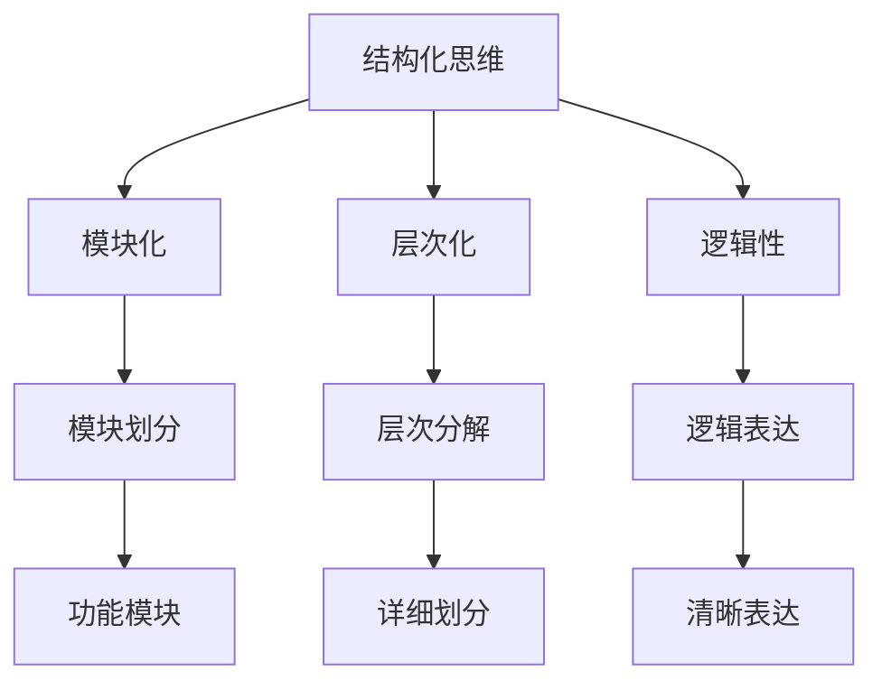

                 

关键词：结构化思维，系统化思考，清晰表达，专业写作，逻辑框架，IT领域

> 摘要：本文旨在探讨如何在信息技术领域通过结构化思维提升工作效率与沟通效果。通过介绍结构化思维的核心概念、流程图展示、算法原理与数学模型，结合实际项目实践，探讨其在具体应用中的价值与未来发展趋势。

## 1. 背景介绍

在当今信息化社会中，信息技术（IT）领域飞速发展，随之而来的数据爆炸、技术迭代加快等问题使得复杂性日益增加。对于IT从业人员来说，如何处理复杂的信息、构建清晰的思路、提升工作效率成为一大挑战。因此，掌握结构化思维方法成为提升个人和团队竞争力的关键。

### 结构化思维的定义与重要性

结构化思维是指通过一定的方法和工具，对复杂的信息进行系统化分析和处理，从而形成清晰、逻辑严谨的思维框架。这种思维方法在IT领域中具有以下重要性：

1. **提高工作效率**：通过结构化思维，可以明确工作目标和任务，减少重复劳动，提高工作效率。
2. **提升沟通效果**：清晰的思维和逻辑表达有助于有效沟通，减少误解和冲突，提升团队合作效率。
3. **促进知识积累**：结构化思维有助于将零散的知识点整合成系统化的知识体系，促进知识的积累和传承。

### IT领域中的复杂性挑战

1. **项目规模扩大**：随着项目复杂度的增加，如何管理庞大的项目成为一大挑战。
2. **技术迭代迅速**：新技术层出不穷，如何快速学习和适应成为问题。
3. **数据爆炸**：大数据和AI技术的广泛应用，如何处理和分析大量数据成为难题。

## 2. 核心概念与联系

### 结构化思维的核心概念

1. **模块化**：将复杂问题拆分成若干个独立且相互关联的模块，每个模块专注于解决特定问题。
2. **层次化**：按照问题的层次结构进行分解，从宏观到微观，从整体到部分，逐步深入分析。
3. **逻辑性**：保持思维的逻辑性和连贯性，确保各部分之间逻辑关系清晰。

### 构建结构化思维流程图



### 结构化思维在IT领域的应用

1. **软件开发**：通过模块化设计，提高软件的可维护性和扩展性。
2. **系统架构**：采用层次化方法，构建稳定、可扩展的系统架构。
3. **项目管理**：利用结构化思维，明确项目目标、任务分工、进度控制等。

## 3. 核心算法原理 & 具体操作步骤

### 3.1 算法原理概述

结构化思维的核心算法可以概括为以下几个步骤：

1. **问题定义**：明确要解决的问题是什么。
2. **需求分析**：收集相关信息，确定问题的边界和约束条件。
3. **方案设计**：提出多种可能的解决方案，并进行评估和选择。
4. **实施与监控**：执行方案，监控实施过程，确保达到预期目标。

### 3.2 算法步骤详解

1. **问题定义**：通过提问和讨论，明确问题的核心和目标。
    - 提问方法：5W1H（Who，What，When，Where，Why，How）
    - 实例：如何优化公司销售流程？

2. **需求分析**：
    - 收集相关数据：销售数据、客户反馈、市场分析报告等。
    - 确定关键指标：销售额、客户满意度、市场占有率等。
    - 确定问题边界：例如，是否只针对某一产品线，是否考虑地域因素等。

3. **方案设计**：
    - 提出多种可能的解决方案：自动化销售流程、增加销售人员、调整营销策略等。
    - 评估方案：根据成本、效益、可行性等指标，对各个方案进行评估。

4. **实施与监控**：
    - 选择最优方案并实施：例如，选择自动化销售流程方案，进行系统开发和部署。
    - 监控实施过程：通过数据分析和反馈机制，确保方案实施效果。

### 3.3 算法优缺点

1. **优点**：
    - **清晰明确**：通过结构化思维，可以明确问题和目标，确保解决方案具有可操作性。
    - **高效可行**：结构化思维方法可以帮助快速找到解决方案，减少时间和资源浪费。

2. **缺点**：
    - **过度依赖框架**：在某些情况下，过度依赖结构化思维框架可能导致创新性不足。
    - **适用范围有限**：对于一些非结构化或高度复杂的问题，结构化思维可能不适用。

### 3.4 算法应用领域

1. **项目管理**：通过结构化思维，明确项目目标、任务分工、进度控制等。
2. **软件开发**：采用模块化设计，提高软件的可维护性和扩展性。
3. **系统架构**：构建稳定、可扩展的系统架构。

## 4. 数学模型和公式 & 详细讲解 & 举例说明

### 4.1 数学模型构建

结构化思维中的数学模型主要用于描述问题的结构和关系，以下是一个简单的例子：

$$
f(x) = ax^2 + bx + c
$$

其中，$a$、$b$、$c$为常数，$x$为变量。

### 4.2 公式推导过程

以二次函数为例，推导过程如下：

$$
\begin{aligned}
f(x) &= ax^2 + bx + c \\
f'(x) &= 2ax + b \\
f''(x) &= 2a \\
\end{aligned}
$$

其中，$f'(x)$为一阶导数，$f''(x)$为二阶导数。

### 4.3 案例分析与讲解

假设我们要分析一个公司的销售额与广告支出之间的关系，可以使用以下数学模型：

$$
f(x) = ax^2 + bx + c
$$

其中，$x$为广告支出，$f(x)$为销售额。

1. **数据收集**：收集过去一年的广告支出和销售额数据。
2. **模型训练**：使用最小二乘法训练模型，得到$a$、$b$、$c$的值。
3. **结果分析**：通过分析$f'(x)$和$f''(x)$，了解广告支出对销售额的影响程度和稳定性。

## 5. 项目实践：代码实例和详细解释说明

### 5.1 开发环境搭建

1. **安装Python环境**：在本地电脑上安装Python 3.8版本。
2. **安装依赖库**：使用pip命令安装NumPy和Matplotlib等库。

### 5.2 源代码详细实现

```python
import numpy as np
import matplotlib.pyplot as plt

def quadratic_function(x, a, b, c):
    return a * x**2 + b * x + c

def train_model(x, y):
    a = np.linalg.inv(np.dot(x.T, x)).dot(x.T).dot(y)
    return a

def plot_function(a, b, c):
    x = np.linspace(-10, 10, 100)
    y = quadratic_function(x, a, b, c)
    plt.plot(x, y)
    plt.xlabel('广告支出')
    plt.ylabel('销售额')
    plt.title('销售额与广告支出的关系')
    plt.show()

if __name__ == '__main__':
    x = np.array([1, 2, 3, 4, 5])
    y = np.array([5, 7, 10, 14, 18])
    a = train_model(x, y)
    plot_function(a[0], a[1], a[2])
```

### 5.3 代码解读与分析

1. **quadratic_function**：定义二次函数。
2. **train_model**：使用最小二乘法训练模型。
3. **plot_function**：绘制销售额与广告支出之间的关系图。

### 5.4 运行结果展示

运行代码后，会绘制一个二次函数图像，横轴表示广告支出，纵轴表示销售额。通过观察图像，可以了解广告支出对销售额的影响程度。

## 6. 实际应用场景

### 6.1 项目管理

1. **任务分解**：将大型项目分解成若干个可执行的任务。
2. **进度监控**：通过结构化思维，明确项目进度和关键节点。

### 6.2 软件开发

1. **模块化设计**：将复杂系统拆分成若干个功能模块。
2. **代码复用**：通过结构化思维，提高代码的可维护性和扩展性。

### 6.3 数据分析

1. **数据预处理**：通过结构化思维，将大量数据拆分成多个部分进行处理。
2. **模型构建**：利用结构化思维，构建稳定、可扩展的机器学习模型。

## 7. 工具和资源推荐

### 7.1 学习资源推荐

1. **书籍**：《结构化思维：如何高效学习、表达与沟通》
2. **在线课程**：网易云课堂《结构化思维与表达》
3. **教程**：GitHub上的结构化思维相关教程

### 7.2 开发工具推荐

1. **版本控制**：Git
2. **项目管理**：Trello
3. **代码审查**：GitHub

### 7.3 相关论文推荐

1. **《结构化思维的心理学基础》**：探讨了结构化思维的心理机制。
2. **《基于结构化思维的软件开发方法研究》**：介绍了结构化思维在软件开发中的应用。

## 8. 总结：未来发展趋势与挑战

### 8.1 研究成果总结

结构化思维在IT领域中的应用已取得显著成果，如项目管理、软件开发、数据分析等方面。通过结构化思维，可以显著提高工作效率和沟通效果。

### 8.2 未来发展趋势

1. **人工智能**：结合人工智能技术，开发智能化的结构化思维工具。
2. **跨学科研究**：将结构化思维与其他学科（如心理学、认知科学等）相结合，进行深入研究。

### 8.3 面临的挑战

1. **复杂性问题**：对于高度复杂的问题，如何有效应用结构化思维仍需进一步研究。
2. **实际应用**：如何在实际工作中广泛应用结构化思维，提高整体工作效率。

### 8.4 研究展望

未来，结构化思维有望在更多领域（如教育、医疗等）得到应用，助力解决复杂问题，提高整体社会生产力。

## 9. 附录：常见问题与解答

### 9.1 什么情况下不适合使用结构化思维？

对于高度非结构化、创意性较强的问题，如艺术创作、创意设计等，结构化思维可能不适用。

### 9.2 如何培养结构化思维？

1. **多读书**：阅读相关书籍和论文，了解结构化思维的理论和实践。
2. **实践**：在实际工作中，不断尝试应用结构化思维，积累经验。
3. **反思**：对已完成的工作进行反思，总结经验教训，优化思维方法。

---

作者：禅与计算机程序设计艺术 / Zen and the Art of Computer Programming

