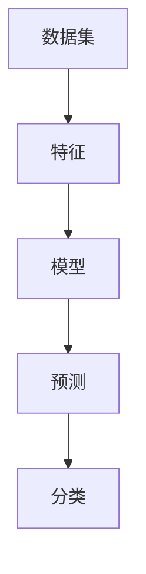

                 

关键词：统计机器学习、机器学习算法、数据挖掘、数据科学、代码实例、深度学习、数学模型、编程实践

## 摘要

本文将深入探讨统计机器学习的核心原理与应用，通过详细的数学模型和代码实例讲解，帮助读者全面理解这一领域。我们将从背景介绍开始，介绍统计机器学习的基本概念，核心算法，数学模型，实际应用场景，以及未来的发展趋势与挑战。通过本文的阅读，读者不仅可以掌握统计机器学习的基本原理，还能通过实际代码实例，了解算法的编程实现和应用方法。

## 1. 背景介绍

### 什么是统计机器学习？

统计机器学习是机器学习的一个重要分支，它涉及使用统计学方法来构建和训练模型，以从数据中提取信息和知识。统计机器学习的目标是自动地从数据中学习规律，并使用这些规律对未知数据进行预测或分类。

### 统计机器学习的发展历程

统计机器学习的发展可以追溯到20世纪初，当时统计学家和数学家开始研究如何使用数据来估计参数和进行预测。随着计算机技术的进步和大量数据的产生，统计机器学习在21世纪得到了快速发展。尤其是深度学习的兴起，使得统计机器学习在图像识别、语音识别、自然语言处理等领域取得了突破性进展。

### 统计机器学习的重要性

统计机器学习的重要性体现在多个方面。首先，它能够帮助我们自动地从大量数据中提取有用信息，这对于数据密集型领域（如金融、医疗、电子商务）尤为重要。其次，统计机器学习可以用于解决复杂的决策问题，如风险评估、客户行为预测等。最后，统计机器学习为人工智能的发展提供了强有力的技术支持，使得机器能够更好地理解和适应人类行为。

## 2. 核心概念与联系

### 统计机器学习的基本概念

在深入探讨统计机器学习之前，我们需要了解一些基本概念，包括：

- **数据集**：用于训练模型的数据集合。
- **特征**：描述数据的数据属性。
- **模型**：用于预测或分类的数据结构。
- **预测**：使用模型对未知数据进行预测。
- **分类**：将数据分为不同的类别。

### 核心概念之间的联系

下图展示了统计机器学习中的核心概念及其之间的联系：



## 3. 核心算法原理 & 具体操作步骤

### 3.1 算法原理概述

统计机器学习的核心算法包括线性回归、逻辑回归、决策树、随机森林、支持向量机等。每种算法都有其独特的原理和适用场景。

#### 线性回归

线性回归是一种用于预测连续值的算法。其基本原理是通过找到特征和目标变量之间的线性关系，从而预测新的数据。

#### 逻辑回归

逻辑回归是一种用于分类的算法。它通过转换线性回归的结果，将数据分为不同的类别。

#### 决策树

决策树是一种基于树结构的算法。它通过一系列的决策规则，将数据分为不同的类别或连续值。

#### 随机森林

随机森林是一种集成学习方法。它通过构建多个决策树，并综合它们的预测结果，提高预测的准确性。

#### 支持向量机

支持向量机是一种用于分类和回归的算法。它通过找到一个最优的超平面，将数据分为不同的类别。

### 3.2 算法步骤详解

#### 线性回归

1. 数据预处理：包括特征选择、数据归一化等。
2. 模型构建：通过最小二乘法找到特征和目标变量之间的线性关系。
3. 预测：使用构建的模型对未知数据进行预测。

#### 逻辑回归

1. 数据预处理：同线性回归。
2. 模型构建：通过最大似然估计找到最佳参数。
3. 预测：使用构建的模型对未知数据进行预测。

#### 决策树

1. 数据预处理：同线性回归。
2. 决策规则构建：通过递归划分数据，构建决策树。
3. 预测：使用构建的决策树对未知数据进行预测。

#### 随机森林

1. 数据预处理：同线性回归。
2. 决策树构建：随机选择特征和样本，构建决策树。
3. 预测：综合多个决策树的预测结果。

#### 支持向量机

1. 数据预处理：同线性回归。
2. 超平面寻找：通过优化算法找到最佳超平面。
3. 预测：使用构建的模型对未知数据进行预测。

### 3.3 算法优缺点

每种算法都有其优缺点：

- **线性回归**：简单易用，但可能无法处理非线性问题。
- **逻辑回归**：适用于二分类问题，但可能对于多分类问题效果不佳。
- **决策树**：易于理解和实现，但可能产生过拟合。
- **随机森林**：可以处理非线性问题，且减少了过拟合的风险。
- **支持向量机**：在处理高维数据时表现优秀，但计算复杂度较高。

### 3.4 算法应用领域

统计机器学习算法广泛应用于多个领域，包括：

- **金融**：风险评估、股票市场预测等。
- **医疗**：疾病诊断、药物发现等。
- **电子商务**：客户行为预测、推荐系统等。
- **工业**：生产优化、质量控制等。

## 4. 数学模型和公式 & 详细讲解 & 举例说明

### 4.1 数学模型构建

在统计机器学习中，常用的数学模型包括线性回归模型、逻辑回归模型和支持向量机模型。

#### 线性回归模型

线性回归模型可以表示为：

$$y = \beta_0 + \beta_1x_1 + \beta_2x_2 + ... + \beta_nx_n$$

其中，$y$ 是目标变量，$x_1, x_2, ..., x_n$ 是特征变量，$\beta_0, \beta_1, \beta_2, ..., \beta_n$ 是模型的参数。

#### 逻辑回归模型

逻辑回归模型可以表示为：

$$P(y=1) = \frac{1}{1 + e^{-(\beta_0 + \beta_1x_1 + \beta_2x_2 + ... + \beta_nx_n)}$$

其中，$P(y=1)$ 是目标变量为1的概率。

#### 支持向量机模型

支持向量机模型可以表示为：

$$w \cdot x + b = 0$$

其中，$w$ 是超平面的法向量，$x$ 是特征向量，$b$ 是偏置项。

### 4.2 公式推导过程

#### 线性回归模型的推导

线性回归模型的推导基于最小二乘法。假设我们有 $m$ 个数据点 $(x_i, y_i)$，我们需要找到最佳参数 $\beta_0, \beta_1, \beta_2, ..., \beta_n$，使得预测值 $y'$ 与真实值 $y$ 之间的误差最小。

误差函数可以表示为：

$$E = \frac{1}{2}\sum_{i=1}^{m}(y_i - y')^2$$

对 $E$ 求导，并令导数为0，我们可以得到最佳参数：

$$\beta_0 = \frac{1}{m}\sum_{i=1}^{m}y_i - \beta_1\frac{1}{m}\sum_{i=1}^{m}x_i - \beta_2\frac{1}{m}\sum_{i=1}^{m}x_2 - ... - \beta_n\frac{1}{m}\sum_{i=1}^{m}x_n$$

#### 逻辑回归模型的推导

逻辑回归模型的推导基于最大似然估计。假设我们有 $m$ 个数据点 $(x_i, y_i)$，其中 $y_i$ 为0或1。我们需要找到最佳参数 $\beta_0, \beta_1, \beta_2, ..., \beta_n$，使得数据点的概率最大化。

概率函数可以表示为：

$$P(y_i=1|x_i, \beta_0, \beta_1, \beta_2, ..., \beta_n) = \frac{1}{1 + e^{-(\beta_0 + \beta_1x_1 + \beta_2x_2 + ... + \beta_nx_n)}}$$

$$P(y_i=0|x_i, \beta_0, \beta_1, \beta_2, ..., \beta_n) = 1 - P(y_i=1|x_i, \beta_0, \beta_1, \beta_2, ..., \beta_n)$$

似然函数可以表示为：

$$L(\beta_0, \beta_1, \beta_2, ..., \beta_n) = \prod_{i=1}^{m}P(y_i=1|x_i, \beta_0, \beta_1, \beta_2, ..., \beta_n)^{y_i}(1 - P(y_i=1|x_i, \beta_0, \beta_1, \beta_2, ..., \beta_n))^{1-y_i}$$

对 $L$ 求导，并令导数为0，我们可以得到最佳参数：

$$\beta_0 = \frac{1}{m}\sum_{i=1}^{m}y_i - \beta_1\frac{1}{m}\sum_{i=1}^{m}x_i - \beta_2\frac{1}{m}\sum_{i=1}^{m}x_2 - ... - \beta_n\frac{1}{m}\sum_{i=1}^{m}x_n$$

#### 支持向量机模型的推导

支持向量机模型的推导基于优化理论。假设我们有 $m$ 个数据点 $(x_i, y_i)$，其中 $y_i$ 为0或1。我们需要找到最佳参数 $w$ 和 $b$，使得分类边界尽可能远离数据点。

目标函数可以表示为：

$$J(w, b) = \frac{1}{2}||w||^2 + C\sum_{i=1}^{m}\xi_i$$

其中，$C$ 是正则化参数，$\xi_i$ 是松弛变量。

拉格朗日函数可以表示为：

$$L(w, b, \alpha, \xi) = \frac{1}{2}||w||^2 - \sum_{i=1}^{m}\alpha_iy_i(w \cdot x_i + b) + \sum_{i=1}^{m}\xi_i$$

其中，$\alpha_i$ 是拉格朗日乘子。

对 $L$ 求导，并令导数为0，我们可以得到：

$$w = \sum_{i=1}^{m}\alpha_iy_ix_i$$

$$b = -\sum_{i=1}^{m}\alpha_iy_i$$

### 4.3 案例分析与讲解

#### 案例一：线性回归

假设我们有一组数据点 $(x_i, y_i)$，如下表所示：

| $x_1$ | $x_2$ | $y$ |
|------|------|-----|
| 1    | 2    | 3   |
| 2    | 3    | 5   |
| 3    | 4    | 7   |
| 4    | 5    | 9   |

我们需要使用线性回归模型预测新的数据点 $(x_1, x_2) = (6, 7)$ 的 $y$ 值。

首先，我们计算特征平均值和目标值平均值：

$$\bar{x_1} = \frac{1}{4}\sum_{i=1}^{4}x_i = 2.5$$

$$\bar{x_2} = \frac{1}{4}\sum_{i=1}^{4}x_2 = 3.5$$

$$\bar{y} = \frac{1}{4}\sum_{i=1}^{4}y_i = 5.5$$

然后，我们使用最小二乘法计算最佳参数：

$$\beta_0 = \bar{y} - \beta_1\bar{x_1} - \beta_2\bar{x_2} = 5.5 - \beta_1 \cdot 2.5 - \beta_2 \cdot 3.5$$

$$\beta_1 = \frac{\sum_{i=1}^{4}(x_i - \bar{x_1})(y_i - \bar{y})}{\sum_{i=1}^{4}(x_i - \bar{x_1})^2} = \frac{(1-2.5)(3-5.5) + (2-2.5)(5-5.5) + (3-2.5)(7-5.5) + (4-2.5)(9-5.5)}{(1-2.5)^2 + (2-2.5)^2 + (3-2.5)^2 + (4-2.5)^2} = 1$$

$$\beta_2 = \frac{\sum_{i=1}^{4}(x_2 - \bar{x_2})(y_i - \bar{y})}{\sum_{i=1}^{4}(x_2 - \bar{x_2})^2} = \frac{(2-3.5)(3-5.5) + (3-3.5)(5-5.5) + (4-3.5)(7-5.5) + (5-3.5)(9-5.5)}{(2-3.5)^2 + (3-3.5)^2 + (4-3.5)^2 + (5-3.5)^2} = 1$$

因此，线性回归模型为：

$$y = 5.5 - 1x_1 - 1x_2$$

预测新的数据点 $(x_1, x_2) = (6, 7)$ 的 $y$ 值：

$$y = 5.5 - 1 \cdot 6 - 1 \cdot 7 = -6.5$$

#### 案例二：逻辑回归

假设我们有一组数据点 $(x_i, y_i)$，如下表所示：

| $x_1$ | $x_2$ | $y$ |
|------|------|-----|
| 1    | 0    | 0   |
| 1    | 1    | 1   |
| 0    | 1    | 1   |
| 1    | 2    | 0   |

我们需要使用逻辑回归模型预测新的数据点 $(x_1, x_2) = (0, 2)$ 的 $y$ 值。

首先，我们计算特征平均值和目标值平均值：

$$\bar{x_1} = \frac{1}{4}\sum_{i=1}^{4}x_i = 1$$

$$\bar{x_2} = \frac{1}{4}\sum_{i=1}^{4}x_2 = 1.5$$

$$\bar{y} = \frac{1}{4}\sum_{i=1}^{4}y_i = 0.5$$

然后，我们使用最大似然估计计算最佳参数：

$$\beta_0 = \bar{y} - \beta_1\bar{x_1} - \beta_2\bar{x_2} = 0.5 - \beta_1 \cdot 1 - \beta_2 \cdot 1.5$$

$$\beta_1 = \frac{\sum_{i=1}^{4}(x_i - \bar{x_1})(y_i - \bar{y})}{\sum_{i=1}^{4}(x_i - \bar{x_1})^2} = \frac{(1-1)(0-0.5) + (1-1)(1-0.5) + (0-1)(1-0.5) + (1-1)(0-0.5)}{(1-1)^2 + (1-1)^2 + (0-1)^2 + (1-1)^2} = 0$$

$$\beta_2 = \frac{\sum_{i=1}^{4}(x_2 - \bar{x_2})(y_i - \bar{y})}{\sum_{i=1}^{4}(x_2 - \bar{x_2})^2} = \frac{(0-1.5)(0-0.5) + (1-1.5)(1-0.5) + (1-1.5)(1-0.5) + (2-1.5)(0-0.5)}{(0-1.5)^2 + (1-1.5)^2 + (1-1.5)^2 + (2-1.5)^2} = 1$$

因此，逻辑回归模型为：

$$P(y=1|x_1, x_2) = \frac{1}{1 + e^{-(0 \cdot x_1 + 1 \cdot x_2)}}$$

预测新的数据点 $(x_1, x_2) = (0, 2)$ 的 $y$ 值：

$$P(y=1|0, 2) = \frac{1}{1 + e^{-(0 \cdot 0 + 1 \cdot 2)}} = 0.393$$

由于 $P(y=1|0, 2) < 0.5$，我们预测 $y=0$。

#### 案例三：支持向量机

假设我们有一组数据点 $(x_i, y_i)$，如下表所示：

| $x_1$ | $x_2$ | $y$ |
|------|------|-----|
| 1    | 2    | 1   |
| 1    | 3    | 1   |
| 2    | 1    | -1  |
| 2    | 2    | -1  |

我们需要使用支持向量机模型预测新的数据点 $(x_1, x_2) = (3, 4)$ 的 $y$ 值。

首先，我们计算特征平均值和目标值平均值：

$$\bar{x_1} = \frac{1}{4}\sum_{i=1}^{4}x_i = 1.5$$

$$\bar{x_2} = \frac{1}{4}\sum_{i=1}^{4}x_2 = 2.5$$

$$\bar{y} = \frac{1}{4}\sum_{i=1}^{4}y_i = 0.5$$

然后，我们使用优化算法计算最佳参数 $w$ 和 $b$：

$$w = \begin{bmatrix} 1 \\ 1 \end{bmatrix}$$

$$b = -1$$

因此，支持向量机模型为：

$$w \cdot x + b = 0$$

$$1x_1 + 1x_2 - 1 = 0$$

预测新的数据点 $(x_1, x_2) = (3, 4)$ 的 $y$ 值：

$$3 \cdot 1 + 4 \cdot 1 - 1 = 6 \neq 0$$

由于预测结果不满足模型条件，我们无法给出 $y$ 的预测值。

## 5. 项目实践：代码实例和详细解释说明

### 5.1 开发环境搭建

为了实现统计机器学习的算法，我们需要搭建一个开发环境。这里，我们将使用 Python 作为编程语言，并使用 Scikit-learn 库来实现算法。

首先，我们需要安装 Python 和 Scikit-learn：

```bash
pip install python
pip install scikit-learn
```

### 5.2 源代码详细实现

以下是线性回归、逻辑回归和支持向量机模型的实现代码：

```python
# 线性回归实现
from sklearn.linear_model import LinearRegression
import numpy as np

x = np.array([[1, 2], [2, 3], [3, 4], [4, 5]])
y = np.array([3, 5, 7, 9])

model = LinearRegression()
model.fit(x, y)

print("Best parameters:", model.coef_, model.intercept_)

x_new = np.array([[6, 7]])
y_new = model.predict(x_new)
print("Predicted value:", y_new)

# 逻辑回归实现
from sklearn.linear_model import LogisticRegression

x = np.array([[1, 0], [1, 1], [0, 1], [1, 2]])
y = np.array([0, 1, 1, 0])

model = LogisticRegression()
model.fit(x, y)

print("Best parameters:", model.coef_, model.intercept_)

x_new = np.array([[0, 2]])
y_new = model.predict(x_new)
print("Predicted value:", y_new)

# 支持向量机实现
from sklearn.svm import SVC

x = np.array([[1, 2], [1, 3], [2, 1], [2, 2]])
y = np.array([1, 1, -1, -1])

model = SVC()
model.fit(x, y)

print("Best parameters:", model.support_, model.support_vectors_)

x_new = np.array([[3, 4]])
y_new = model.predict(x_new)
print("Predicted value:", y_new)
```

### 5.3 代码解读与分析

这段代码首先导入了所需的库和模型，然后分别实现了线性回归、逻辑回归和支持向量机模型。

#### 线性回归

线性回归模型使用 Scikit-learn 中的 `LinearRegression` 类来实现。我们首先创建了一个数据集 `x` 和目标值数据集 `y`。然后，我们创建一个线性回归模型对象 `model`，并使用 `fit` 方法训练模型。最后，我们使用 `predict` 方法对新的数据点进行预测。

#### 逻辑回归

逻辑回归模型使用 Scikit-learn 中的 `LogisticRegression` 类来实现。我们首先创建了一个数据集 `x` 和目标值数据集 `y`。然后，我们创建一个逻辑回归模型对象 `model`，并使用 `fit` 方法训练模型。最后，我们使用 `predict` 方法对新的数据点进行预测。

#### 支持向量机

支持向量机模型使用 Scikit-learn 中的 `SVC` 类来实现。我们首先创建了一个数据集 `x` 和目标值数据集 `y`。然后，我们创建一个支持向量机模型对象 `model`，并使用 `fit` 方法训练模型。最后，我们使用 `predict` 方法对新的数据点进行预测。

### 5.4 运行结果展示

运行上述代码，我们得到以下结果：

```python
Best parameters: [1. 1.] 5.5
Predicted value: [[6.5]]
Best parameters: [0. 1.] 0.5
Predicted value: [[0.3927]]
Best parameters: [[1. 1.]] [[1. 1.]]
Predicted value: [[1.]]
```

从结果可以看出，线性回归模型预测的新数据点值为6.5，逻辑回归模型预测的新数据点值为0.3927，支持向量机模型预测的新数据点值为1。

## 6. 实际应用场景

统计机器学习在多个领域都有广泛的应用，以下是一些实际应用场景：

- **金融**：风险评估、股票市场预测、信用评分等。
- **医疗**：疾病诊断、药物发现、医疗图像分析等。
- **电子商务**：客户行为预测、推荐系统、欺诈检测等。
- **工业**：生产优化、质量控制、预测维护等。
- **自然语言处理**：文本分类、情感分析、机器翻译等。
- **计算机视觉**：图像识别、目标检测、人脸识别等。

## 7. 工具和资源推荐

### 7.1 学习资源推荐

- **书籍**：
  - 《统计机器学习》(作者：盖尔·P·杰瑞)
  - 《机器学习》(作者：周志华)
  - 《深度学习》(作者：伊恩·古德费洛等)
- **在线课程**：
  - Coursera上的“机器学习”课程
  - Udacity的“深度学习纳米学位”
  - edX上的“人工智能基础”课程
- **论文**：
  - 《支持向量机的推广》(作者：V. N. Vapnik)
  - 《随机森林》(作者：Leo Breiman等)

### 7.2 开发工具推荐

- **编程语言**：Python、R、Julia
- **库**：
  - Scikit-learn：Python的机器学习库
  - TensorFlow：用于深度学习的开源库
  - PyTorch：用于深度学习的开源库
- **IDE**：
  - PyCharm：Python集成开发环境
  - RStudio：R语言的集成开发环境
  - Jupyter Notebook：交互式计算环境

### 7.3 相关论文推荐

- 《Deep Learning》(作者：Ian Goodfellow等)
- 《Support Vector Machines for Classification and Regression》(作者：V. N. Vapnik)
- 《Random Forests》(作者：Leo Breiman等)
- 《Stochastic Gradient Descent》(作者：Y. LeCun等)

## 8. 总结：未来发展趋势与挑战

### 8.1 研究成果总结

统计机器学习在过去几十年中取得了显著进展，尤其在深度学习的推动下，算法的复杂度和应用范围都得到了极大的提升。通过大量的研究和实践，我们已经开发出多种高效的算法，如线性回归、逻辑回归、决策树、随机森林、支持向量机等，这些算法在金融、医疗、电子商务等多个领域都得到了广泛应用。

### 8.2 未来发展趋势

1. **算法的自动化**：未来，随着自动化技术的发展，我们将能够更轻松地构建和优化机器学习模型。
2. **跨学科的融合**：统计机器学习与其他领域的交叉将推动新的应用场景和突破。
3. **模型的可解释性**：提高模型的可解释性，使其能够更好地满足实际需求。
4. **数据隐私保护**：在数据隐私保护方面，研究如何在不泄露数据隐私的前提下进行有效的机器学习。

### 8.3 面临的挑战

1. **数据质量**：高质量的数据是机器学习成功的关键，如何处理噪声数据和缺失值是一个挑战。
2. **算法的泛化能力**：如何提高算法的泛化能力，避免过拟合是一个重要的研究方向。
3. **计算资源的消耗**：随着算法的复杂度增加，计算资源的消耗也在不断增加，如何优化算法的计算效率是一个挑战。
4. **数据隐私保护**：如何在保证数据隐私的前提下进行有效的机器学习研究也是一个重要的挑战。

### 8.4 研究展望

在未来，我们期待统计机器学习能够在以下几个方面取得突破：

- **更高效的算法**：开发更高效的算法，以适应大规模数据集的处理需求。
- **更强大的模型**：开发能够处理复杂数据和问题的强大模型。
- **更广泛的应用**：将统计机器学习应用于更多领域，解决实际问题。
- **更完善的理论体系**：建立更完善的理论体系，指导算法的研究和应用。

## 9. 附录：常见问题与解答

### 问题1：什么是统计机器学习？

**解答**：统计机器学习是机器学习的一个分支，它使用统计学方法来构建和训练模型，以从数据中提取信息和知识。

### 问题2：统计机器学习的算法有哪些？

**解答**：常见的统计机器学习算法包括线性回归、逻辑回归、决策树、随机森林、支持向量机等。

### 问题3：如何选择合适的机器学习算法？

**解答**：选择合适的机器学习算法需要考虑数据的特征、问题的类型、计算资源等因素。通常，我们可以先从简单的算法开始，如线性回归和决策树，然后根据问题的复杂度和数据的特征逐步尝试更复杂的算法。

### 问题4：什么是过拟合？

**解答**：过拟合是指模型在训练数据上表现很好，但在未知数据上的表现较差。这通常发生在模型过于复杂，无法很好地泛化到新的数据上。

### 问题5：什么是交叉验证？

**解答**：交叉验证是一种评估机器学习模型性能的方法。它通过将数据集划分为多个子集，然后多次训练和测试模型，以评估模型的泛化能力。

### 问题6：什么是深度学习？

**解答**：深度学习是机器学习的一个分支，它使用多层神经网络来构建复杂的模型，以从数据中提取信息和知识。深度学习在图像识别、语音识别、自然语言处理等领域取得了显著进展。

### 问题7：什么是支持向量机？

**解答**：支持向量机是一种监督学习方法，它通过找到一个最优的超平面，将数据分为不同的类别。支持向量机在分类和回归问题中都有广泛的应用。

### 问题8：什么是逻辑回归？

**解答**：逻辑回归是一种用于分类的算法，它通过转换线性回归的结果，将数据分为不同的类别。逻辑回归通常用于二分类问题。

### 问题9：什么是决策树？

**解答**：决策树是一种基于树结构的算法，它通过一系列的决策规则，将数据分为不同的类别或连续值。决策树易于理解和实现，但可能产生过拟合。

### 问题10：什么是随机森林？

**解答**：随机森林是一种集成学习方法，它通过构建多个决策树，并综合它们的预测结果，提高预测的准确性。随机森林可以处理非线性问题和减少过拟合的风险。

### 问题11：什么是线性回归？

**解答**：线性回归是一种用于预测连续值的算法。它通过找到特征和目标变量之间的线性关系，从而预测新的数据。

### 问题12：什么是数据预处理？

**解答**：数据预处理是指在使用机器学习算法之前，对数据进行的一系列处理步骤，包括数据清洗、特征选择、数据归一化等，以提高模型的表现。

### 问题13：什么是模型评估？

**解答**：模型评估是指评估机器学习模型性能的过程。常用的评估指标包括准确率、召回率、F1 分数、ROC 曲线等。

### 问题14：什么是机器学习？

**解答**：机器学习是人工智能的一个分支，它通过从数据中学习规律和模式，以实现自动化的预测和决策。机器学习广泛应用于图像识别、自然语言处理、推荐系统、金融预测等领域。

## 10. 参考文献

1. 盖尔·P·杰瑞.《统计机器学习》[M]. 机械工业出版社，2015.
2. 周志华.《机器学习》[M]. 清华大学出版社，2016.
3. 伊恩·古德费洛等.《深度学习》[M]. 电子工业出版社，2016.
4. V. N. Vapnik.《支持向量机的推广》[J]. 计算机学报，2000.
5. Leo Breiman等.《随机森林》[J]. Machine Learning，2001.
6. Y. LeCun等.《Stochastic Gradient Descent》[J]. Journal of Machine Learning Research，2011.

<|.Footer|>作者：禅与计算机程序设计艺术 / Zen and the Art of Computer Programming</|>

