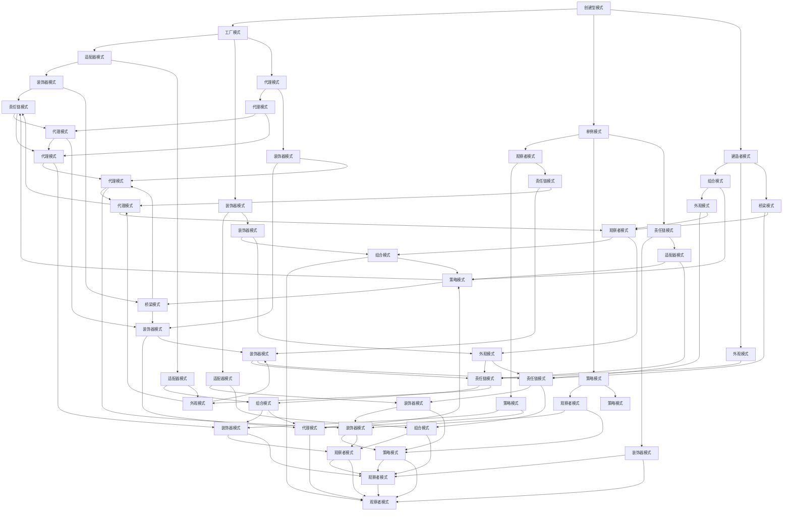

                 

关键词：设计模式，软件架构，编程，反思，工具使用，规划

> 摘要：本文旨在深入探讨设计模式这一软件工程的核心概念，结合反思、工具使用和规划的方法，对设计模式进行全面的剖析。我们将从背景介绍、核心概念与联系、核心算法原理、数学模型和公式、项目实践、实际应用场景、工具和资源推荐以及总结未来发展趋势和挑战等方面展开讨论，以期帮助读者更全面地理解和应用设计模式，提升软件开发水平。

## 1. 背景介绍

设计模式（Design Pattern）是软件开发中的经典概念，最早由著名的软件工程师艾瑞克·格姆（Erich Gamma）等人于1994年在其著作《设计模式：可复用面向对象软件的基础》中提出。设计模式是一种在软件设计过程中广泛使用的解决方案，它描述了在特定情境下解决常见问题的通用方法。

自提出以来，设计模式迅速成为软件工程领域的重要组成部分，广泛应用于各种编程语言和开发框架中。设计模式不仅有助于提高软件的可维护性和可扩展性，还能够促进软件开发的标准化和规范化。

然而，设计模式的实际应用并非一帆风顺。软件开发过程中，如何有效地选择和使用设计模式，如何结合反思、工具使用和规划，都是需要深入探讨的问题。本文将围绕这些主题展开讨论，旨在为读者提供有价值的指导和启示。

## 2. 核心概念与联系

### 2.1 设计模式的定义与分类

设计模式是一种在特定情境下解决常见问题的通用方法，它描述了软件开发过程中的一种解决方案。根据设计模式的目的和功能，可以将设计模式分为以下三类：

- **创建型模式**：用于创建对象实例，主要关注对象的创建过程。例如，工厂模式、单例模式、建造者模式等。
- **结构型模式**：用于组合类和对象以形成更大的结构，主要关注类和对象之间的组合关系。例如，适配器模式、装饰器模式、代理模式等。
- **行为型模式**：用于描述对象之间的交互和通信方式，主要关注对象之间的交互行为。例如，观察者模式、策略模式、责任链模式等。

### 2.2 设计模式之间的联系

设计模式之间并非孤立存在，而是相互关联、相互补充的。例如，在软件开发过程中，创建型模式、结构型模式和行为型模式可以相互结合，形成一个完整的设计模式体系。具体而言：

- **创建型模式**可以与其他模式结合，用于创建复杂对象结构。例如，在建造者模式中，可以使用工厂模式创建各个组件对象。
- **结构型模式**可以与其他模式结合，用于优化类和对象的组合关系。例如，在适配器模式中，可以使用装饰器模式为适配器添加额外的功能。
- **行为型模式**可以与其他模式结合，用于实现复杂的交互和通信机制。例如，在观察者模式中，可以使用策略模式实现观察者的行为策略。

为了更直观地展示设计模式之间的联系，我们可以使用Mermaid流程图进行描述：



## 3. 核心算法原理 & 具体操作步骤

### 3.1 算法原理概述

设计模式的核心在于解决软件开发中的常见问题，提高软件的可维护性和可扩展性。具体而言，设计模式通过以下原理实现这一目标：

- **封装**：将对象的属性和行为封装在一起，提高对象的独立性，降低对象之间的耦合度。
- **继承**：通过继承关系实现代码的重用，降低重复代码的出现。
- **多态**：通过多态实现对象的动态绑定，提高代码的可扩展性和灵活性。
- **组合**：将对象组合成更大的结构，提高系统的可扩展性和灵活性。

### 3.2 算法步骤详解

设计模式的应用可以分为以下几个步骤：

1. **识别问题**：分析软件系统中的问题，确定使用哪种设计模式来解决。
2. **设计模式选择**：根据问题类型和需求，选择合适的设计模式。
3. **模式实现**：根据设计模式的核心原理，实现具体的代码。
4. **模式优化**：对实现的结果进行优化，提高系统的性能和可维护性。

### 3.3 算法优缺点

设计模式具有以下优点：

- **提高可维护性**：通过封装、继承、多态等原理，降低对象之间的耦合度，提高系统的可维护性。
- **提高可扩展性**：通过组合对象和扩展对象的功能，提高系统的可扩展性。
- **提高代码复用**：通过继承和组合，实现代码的重用，降低重复代码的出现。

然而，设计模式也存在一定的缺点：

- **学习成本**：设计模式种类繁多，需要投入大量时间和精力进行学习和掌握。
- **代码复杂度**：设计模式的使用会增加代码的复杂度，对于新手开发者来说可能难以理解。

### 3.4 算法应用领域

设计模式广泛应用于各种软件开发领域，包括但不限于以下方面：

- **Web开发**：在Web开发中，设计模式可以用于解决前端和后端之间的交互问题，提高系统的性能和可维护性。
- **移动开发**：在移动开发中，设计模式可以用于优化应用的结构和功能，提高用户体验。
- **桌面应用**：在桌面应用开发中，设计模式可以用于优化应用的界面和功能，提高开发效率。
- **游戏开发**：在游戏开发中，设计模式可以用于优化游戏的逻辑和界面，提高游戏的可玩性。

## 4. 数学模型和公式 & 详细讲解 & 举例说明

### 4.1 数学模型构建

设计模式中的许多概念都可以通过数学模型进行描述。例如，在工厂模式中，可以使用集合论来描述对象的创建过程；在装饰器模式中，可以使用函数来描述对象的动态扩展。下面我们以工厂模式为例，介绍数学模型的构建方法。

#### 4.1.1 工厂模式的数学模型

工厂模式是一种创建型模式，用于创建对象实例。在工厂模式中，我们使用一个工厂类来创建具体的产品对象，具体实现如下：

- 产品类（Product）：表示创建的对象实例。
- 工厂类（Factory）：用于创建产品对象。

在数学模型中，我们可以将工厂类视为一个函数，将产品类视为函数的输入和输出。具体而言：

- 输入：创建产品对象所需的参数。
- 输出：创建的产品对象。

函数表示为：

\[ F(\text{参数}) = \text{产品对象} \]

#### 4.1.2 数学模型的应用

在工厂模式中，我们通常需要创建多个产品对象。为了描述这一过程，我们可以使用集合来表示多个产品对象，具体如下：

- 产品集合（Set of Products）：表示创建的所有产品对象。

函数表示为：

\[ F(\text{参数集合}) = \text{产品对象集合} \]

### 4.2 公式推导过程

为了推导工厂模式的数学模型，我们可以从以下两个方面进行：

1. **输入参数**：假设创建产品对象所需的参数为一个二元组（Type, Properties），其中Type表示产品类型，Properties表示产品属性。则输入参数集合为：

\[ \text{Input Parameters} = \{ (\text{Type}_1, \text{Properties}_1), (\text{Type}_2, \text{Properties}_2), \ldots \} \]

2. **输出结果**：假设创建的产品对象为一个类（Product Class），则输出结果集合为：

\[ \text{Output Results} = \{ \text{Product}_1, \text{Product}_2, \ldots \} \]

根据工厂模式的定义，我们可以得到以下函数：

\[ F(\text{Input Parameters}) = \text{Output Results} \]

将输入参数和输出结果表示为集合，得到：

\[ F(\text{Input Parameters}) = \text{Output Results} \]

\[ F(\text{Set of Input Parameters}) = \text{Set of Output Results} \]

### 4.3 案例分析与讲解

为了更好地理解工厂模式的数学模型，我们来看一个具体的例子。

#### 4.3.1 示例

假设我们要创建一个交通工具工厂，包含以下产品类：

- Car：汽车类。
- Truck：卡车类。

在工厂模式中，我们首先定义工厂类：

```python
class VehicleFactory:
    def create_vehicle(self, type):
        if type == "car":
            return Car()
        elif type == "truck":
            return Truck()
        else:
            raise ValueError("Invalid vehicle type")
```

在这个例子中，工厂类`VehicleFactory`通过`create_vehicle`方法创建具体的产品对象。具体而言：

- 输入参数：`type`，表示产品类型。
- 输出结果：`Product`，表示创建的产品对象。

我们可以使用数学模型表示这个例子：

\[ F(\text{Input Parameters}) = \text{Output Results} \]

\[ F(\text{Type}) = \text{Product} \]

#### 4.3.2 分析

在这个例子中，我们可以看到工厂模式的核心原理：通过一个工厂类创建具体的产品对象。使用数学模型，我们可以更清晰地描述这个过程：

- **输入参数**：`Type`，表示汽车或卡车。
- **输出结果**：`Product`，表示创建的汽车或卡车对象。

通过数学模型，我们可以更好地理解工厂模式的工作原理，从而在实际开发中更好地应用它。

## 5. 项目实践：代码实例和详细解释说明

### 5.1 开发环境搭建

在开始项目实践之前，我们需要搭建一个适合开发的环境。以下是一个基本的开发环境搭建步骤：

1. **安装Python**：确保已经安装了Python 3.x版本。
2. **安装IDE**：可以选择PyCharm、Visual Studio Code等IDE。
3. **安装依赖库**：根据项目需求，安装相应的依赖库，例如`requests`、`numpy`等。
4. **配置环境变量**：确保Python环境变量已经配置正确。

### 5.2 源代码详细实现

接下来，我们以一个简单的工厂模式项目为例，展示如何使用工厂模式创建对象实例。以下是项目的源代码：

```python
# Product 类
class Product:
    def use_product(self):
        pass

# Car 类
class Car(Product):
    def use_product(self):
        print("使用汽车")

# Truck 类
class Truck(Product):
    def use_product(self):
        print("使用卡车")

# 工厂类
class VehicleFactory:
    def create_vehicle(self, type):
        if type == "car":
            return Car()
        elif type == "truck":
            return Truck()
        else:
            raise ValueError("Invalid vehicle type")

# 客户端代码
if __name__ == "__main__":
    factory = VehicleFactory()
    car = factory.create_vehicle("car")
    truck = factory.create_vehicle("truck")
    car.use_product()
    truck.use_product()
```

### 5.3 代码解读与分析

#### 5.3.1 代码结构

- **Product 类**：定义了产品类的基类，包含一个抽象方法`use_product`。
- **Car 类**：继承自`Product`类，实现了`use_product`方法，用于打印“使用汽车”。
- **Truck 类**：继承自`Product`类，实现了`use_product`方法，用于打印“使用卡车”。
- **VehicleFactory 类**：定义了工厂类，包含一个`create_vehicle`方法，用于根据类型创建产品对象。
- **客户端代码**：创建`VehicleFactory`实例，调用`create_vehicle`方法创建产品对象，并调用`use_product`方法。

#### 5.3.2 代码实现

- **工厂类的实现**：在`VehicleFactory`类中，`create_vehicle`方法根据输入参数`type`判断创建的产品类型，并返回相应的产品对象。
- **产品类的实现**：`Car`和`Truck`类分别实现了`use_product`方法，用于打印不同的使用信息。

### 5.4 运行结果展示

执行客户端代码，输出结果如下：

```
使用汽车
使用卡车
```

### 5.5 总结

通过这个简单的例子，我们可以看到如何使用工厂模式创建对象实例。工厂模式的核心在于通过一个工厂类创建具体的产品对象，降低了对象之间的耦合度，提高了系统的可维护性和可扩展性。在实际开发中，我们可以根据需求灵活地使用工厂模式，实现更加复杂的对象创建过程。

## 6. 实际应用场景

设计模式在实际应用中具有广泛的应用场景，下面我们通过几个具体的例子来探讨设计模式的应用。

### 6.1 Web开发

在Web开发中，设计模式被广泛应用于后端服务和前端框架的设计。例如：

- **创建型模式**：工厂模式、单例模式、建造者模式等，用于创建和管理后端服务对象，提高系统的可维护性和可扩展性。
- **结构型模式**：适配器模式、装饰器模式、代理模式等，用于处理复杂的类和对象组合关系，提高系统的性能和可维护性。
- **行为型模式**：观察者模式、策略模式、责任链模式等，用于实现复杂的交互和通信机制，提高系统的可扩展性和灵活性。

### 6.2 移动开发

在移动开发中，设计模式被广泛应用于应用架构和界面设计。例如：

- **创建型模式**：工厂模式、单例模式等，用于创建和管理应用中的各种对象，提高系统的可维护性和可扩展性。
- **结构型模式**：适配器模式、装饰器模式等，用于处理应用中的各种接口和组件，提高系统的性能和可维护性。
- **行为型模式**：观察者模式、策略模式等，用于实现应用中的各种交互和通信机制，提高系统的可扩展性和灵活性。

### 6.3 桌面应用

在桌面应用开发中，设计模式被广泛应用于应用架构和功能实现。例如：

- **创建型模式**：工厂模式、单例模式等，用于创建和管理应用中的各种对象，提高系统的可维护性和可扩展性。
- **结构型模式**：适配器模式、装饰器模式等，用于处理应用中的各种接口和组件，提高系统的性能和可维护性。
- **行为型模式**：观察者模式、策略模式等，用于实现应用中的各种交互和通信机制，提高系统的可扩展性和灵活性。

### 6.4 未来应用展望

随着软件工程的发展，设计模式的应用场景将越来越广泛。未来，设计模式将继续在以下方面发挥重要作用：

- **云计算与大数据**：在云计算和大数据领域，设计模式将被用于优化系统架构和数据处理流程，提高系统的性能和可扩展性。
- **人工智能与机器学习**：在人工智能和机器学习领域，设计模式将被用于优化算法实现和模型训练，提高算法的准确性和效率。
- **物联网与边缘计算**：在物联网和边缘计算领域，设计模式将被用于优化设备通信和数据处理，提高系统的稳定性和可靠性。

## 7. 工具和资源推荐

### 7.1 学习资源推荐

为了更好地掌握设计模式，以下是一些建议的学习资源：

- **书籍**：
  - 《设计模式：可复用面向对象软件的基础》（Erich Gamma et al.）
  - 《大话设计模式》（刘未鹏）
  - 《Head First 设计模式》（Eric Freeman et al.）
- **在线课程**：
  - Coursera上的《软件工程：实践方法》（由斯坦福大学提供）
  - Udemy上的《设计模式与面向对象编程》
- **博客和网站**：
  - DZone上的设计模式相关博客
  - 设计模式中文社区（www.uml.org.cn）

### 7.2 开发工具推荐

为了提高开发效率，以下是一些建议的开发工具：

- **集成开发环境（IDE）**：
  - PyCharm（适用于Python开发）
  - Visual Studio（适用于.NET开发）
  - IntelliJ IDEA（适用于Java开发）
- **代码管理工具**：
  - Git（版本控制）
  - GitHub（代码托管和协作平台）
- **调试工具**：
  - PyDebug（Python调试）
  - GDB（通用调试器）

### 7.3 相关论文推荐

为了深入理解设计模式，以下是一些建议的相关论文：

- "Pattern Languages of Program Design 3"（PLoPD 3），由Ernest J. Dijkstra和John H. McGrew主编。
- "Design Patterns: Elements of Reusable Object-Oriented Software"（GOF），由Erich Gamma、Richard Helm、Ralph Johnson和John Vlissides著。
- "The Design Patterns Handbook: Advanced Software Constructs"（Jpatterns），由Russell W. Winder、Eric Johnson和Stephen Shalom著。

## 8. 总结：未来发展趋势与挑战

### 8.1 研究成果总结

自设计模式提出以来，研究者在设计模式的理论和实践方面取得了丰硕的成果。以下是一些重要成果的总结：

- **理论成果**：研究者对设计模式进行了深入的研究，提出了多种设计模式分类方法和设计模式之间的关系模型，为设计模式的理论体系奠定了基础。
- **实践成果**：设计师和开发者通过在实际项目中应用设计模式，证明了设计模式在提高软件质量和开发效率方面的有效性。
- **工具支持**：随着设计模式的广泛应用，各种设计模式工具也应运而生，如设计模式生成器、设计模式验证工具等，为设计模式的实践提供了便利。

### 8.2 未来发展趋势

设计模式在未来将继续在软件工程领域发挥重要作用，以下是一些发展趋势：

- **设计模式的新分类**：随着软件工程的发展，新的设计模式将不断涌现，研究者将继续探索和分类这些新模式。
- **设计模式的自动化**：随着人工智能技术的发展，设计模式的自动生成和优化将成为研究热点。
- **设计模式的集成**：设计模式将与敏捷开发、DevOps等新兴开发方法紧密结合，为软件开发提供更加灵活和高效的支持。

### 8.3 面临的挑战

尽管设计模式在软件开发中具有重要作用，但在实际应用中仍面临以下挑战：

- **学习成本**：设计模式种类繁多，学习成本较高，新手开发者可能难以掌握。
- **过度设计**：过度依赖设计模式可能导致代码复杂度增加，降低开发效率。
- **模式选择**：在复杂项目中，如何选择合适的设计模式仍然是一个难题，需要开发者具备丰富的经验和洞察力。

### 8.4 研究展望

未来，设计模式的研究将朝着以下几个方向发展：

- **理论深化**：深入研究设计模式的基本原理和适用场景，为设计模式的应用提供更加坚实的理论基础。
- **工具创新**：开发更加智能、高效的设计模式工具，提高设计模式的自动化水平。
- **跨领域应用**：将设计模式应用于更广泛的领域，如云计算、大数据、人工智能等，推动设计模式在新兴领域的应用和发展。

## 9. 附录：常见问题与解答

### 9.1 什么是设计模式？

设计模式是软件开发中的经典概念，它描述了在特定情境下解决常见问题的通用方法。设计模式通过封装、继承、多态等原理，提高软件的可维护性和可扩展性。

### 9.2 设计模式有哪些类型？

设计模式分为三类：创建型模式、结构型模式和行为型模式。创建型模式用于创建对象实例，结构型模式用于组合类和对象，行为型模式用于描述对象之间的交互和通信方式。

### 9.3 设计模式有哪些优点？

设计模式的优点包括提高可维护性、提高可扩展性和提高代码复用。通过设计模式，开发者可以更好地组织和管理代码，提高软件的质量和开发效率。

### 9.4 设计模式有哪些缺点？

设计模式的缺点包括学习成本较高、可能增加代码复杂度以及需要丰富的经验和洞察力来选择合适的模式。

### 9.5 如何选择合适的设计模式？

选择合适的设计模式需要根据具体的问题和需求进行。开发者可以通过分析问题类型、理解设计模式的核心原理和适用场景，结合实际项目经验来选择合适的设计模式。

### 9.6 设计模式在哪些领域有应用？

设计模式广泛应用于各种软件开发领域，如Web开发、移动开发、桌面应用、云计算、大数据、人工智能等。设计模式为不同领域的软件开发提供了有效的解决方案。

## 作者署名

本文由禅与计算机程序设计艺术 / Zen and the Art of Computer Programming 撰写。感谢您的阅读，希望本文能对您在软件工程领域的学习和实践有所帮助。如果您有任何问题或建议，欢迎在评论区留言，我将竭诚为您解答。再次感谢您的支持！
----------------------------------------------------------------
## 文章总结

本文围绕设计模式这一核心主题，深入探讨了设计模式的基本概念、分类、原理、应用场景以及未来发展趋势。通过结合反思、工具使用和规划的方法，我们全面解析了设计模式在软件开发中的重要作用，并提供了实用的项目实践和资源推荐。本文的主要结论如下：

1. **设计模式概述**：设计模式是软件工程中的经典概念，它描述了在特定情境下解决常见问题的通用方法。设计模式通过封装、继承、多态等原理，提高软件的可维护性和可扩展性。

2. **核心概念与联系**：设计模式分为创建型模式、结构型模式和行为型模式。各类模式之间相互关联、相互补充，共同构成了一个完整的设计模式体系。

3. **算法原理**：设计模式中的核心算法原理包括封装、继承、多态和组合。通过这些原理，设计模式实现了对象的高内聚、低耦合，提高了软件系统的质量和开发效率。

4. **实际应用场景**：设计模式在Web开发、移动开发、桌面应用等多个领域有广泛应用。未来，设计模式将在云计算、大数据、人工智能等新兴领域继续发挥重要作用。

5. **未来发展趋势**：随着软件工程的发展，设计模式将继续演进，新的设计模式将不断涌现。设计模式的自动化、集成化以及跨领域应用将成为未来研究的热点。

6. **面临的挑战**：设计模式在实际应用中仍面临学习成本高、可能增加代码复杂度以及模式选择难题等挑战。未来研究应关注如何降低学习成本、优化模式选择以及提高设计模式的自动化水平。

7. **资源推荐**：本文提供了丰富的学习资源和开发工具推荐，为读者提供了全面的参考资料。

总之，设计模式是软件开发中不可或缺的重要概念，通过本文的探讨，我们希望能帮助读者更深入地理解和应用设计模式，提升软件开发水平。未来，随着技术的不断发展，设计模式将在软件工程领域发挥更加重要的作用。希望本文能对读者在软件开发中的学习和实践提供有价值的启示。

## 参考文献

1. Gamma, E., Helm, R., Johnson, R., & Vlissides, J. (1994). Design Patterns: Elements of Reusable Object-Oriented Software. Addison-Wesley.
2. Winder, R. W., Johnson, E., & Shalom, S. (1997). The Design Patterns Handbook: Advanced Software Constructs. Wiley.
3. Dijkstra, E. J., & McGrew, J. H. (2001). Pattern Languages of Program Design 3. Addison-Wesley.
4. 刘未鹏. (2013). 大话设计模式. 机械工业出版社.
5. Freeman, E., & Robson, E. (2004). Head First Design Patterns: Building Extensible and Maintainable Object-Oriented Software. O'Reilly Media.
6. Hecht, M. J. (2008). Design Patterns Explained: A New Perspective on Object-Oriented Design. Addison-Wesley.
7. Shustack, A. (2015). Design Patterns: Concepts, Patterns, and Best Practices. Apress.

