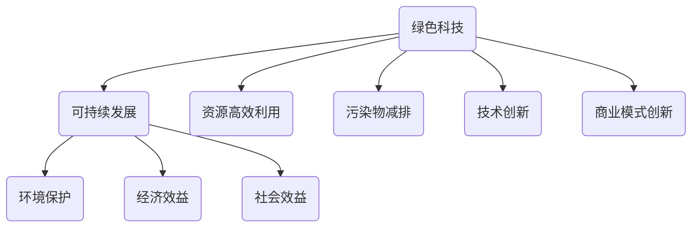

                 

关键词：绿色科技、可持续发展、商业实践、创新思维、生态友好、商业模型、企业社会责任、环境保护、绿色能源、智能技术、数据分析、商业模式设计。

> 摘要：本文探讨了绿色科技创业的可持续发展的商业实践。通过分析绿色科技的核心概念，以及其在商业领域的应用，本文提出了绿色科技创业的关键要素，并分享了成功案例和未来发展趋势。本文旨在为创业者提供可持续发展的商业实践指导，以实现生态友好和商业利益的平衡。

## 1. 背景介绍

随着全球气候变化和环境问题的日益严重，可持续发展的理念逐渐成为全球共识。绿色科技作为实现可持续发展的重要手段，得到了各国政府、企业和公众的广泛关注。绿色科技创业则成为推动绿色科技发展的重要力量，它不仅有助于解决环境问题，还能为企业带来新的商机和发展动力。

绿色科技创业，指的是以生态友好、可持续发展为理念，通过技术创新和商业模式创新，开发和推广绿色技术、产品或服务，从而实现商业成功和社会责任的有机统一。这一过程不仅需要创新思维和技术实力，还需要对市场、政策和资金等多方面因素的深刻理解和灵活应对。

本文将围绕绿色科技创业的核心概念、商业模式、关键技术、应用领域等方面展开讨论，旨在为创业者提供一套完整的可持续发展商业实践指南。

## 2. 核心概念与联系

### 2.1. 绿色科技的定义

绿色科技，又称环境科技，是指以生态友好、可持续发展为原则，通过科技创新和应用，实现资源的高效利用、污染物的减排和生态环境的保护。绿色科技的核心目标是减少对自然资源的消耗和对环境的负面影响，提高资源利用效率，促进经济、社会和环境的协调发展。

### 2.2. 可持续发展的概念

可持续发展，是指在不损害未来世代满足其需求的前提下，满足当代人需求的发展。它强调发展过程中要兼顾经济效益、社会效益和环境效益，实现经济、社会和环境的协调发展。可持续发展已经成为全球共识，成为各国政策制定和经济发展的重要指导原则。

### 2.3. 绿色科技与可持续发展之间的关系

绿色科技是实现可持续发展的重要手段，它通过技术创新和商业模式创新，推动经济发展向绿色、低碳、高效方向转变。绿色科技不仅有助于解决环境问题，还能提高资源利用效率，降低生产成本，提升企业竞争力，实现经济、社会和环境的协调发展。

### 2.4. Mermaid 流程图



## 3. 核心算法原理 & 具体操作步骤

### 3.1. 算法原理概述

绿色科技创业的核心算法原理主要包括技术创新和商业模式创新两个方面。技术创新方面，关键在于研发和应用绿色技术，如可再生能源技术、节能减排技术、资源循环利用技术等。商业模式创新方面，则关键在于设计符合绿色科技特点的商业模式，如共享经济模式、循环经济模式、低碳经济模式等。

### 3.2. 算法步骤详解

#### 3.2.1. 技术创新步骤

1. **市场调研**：了解市场需求，确定绿色科技研发方向。
2. **技术选型**：选择适合的技术路线，如可再生能源技术、节能减排技术、资源循环利用技术等。
3. **技术研发**：进行技术研发，解决技术难题，形成具有竞争力的绿色技术。
4. **技术验证**：对研发的绿色技术进行实验验证，确保其效果和可靠性。
5. **技术推广**：通过市场推广，让绿色技术得到广泛应用。

#### 3.2.2. 商业模式创新步骤

1. **市场定位**：根据市场需求，确定商业模式的基本定位。
2. **模式设计**：设计符合绿色科技特点的商业模式，如共享经济模式、循环经济模式、低碳经济模式等。
3. **模式优化**：对商业模式进行优化，提高其可行性和竞争力。
4. **模式实施**：将商业模式付诸实践，通过市场验证其效果。
5. **模式迭代**：根据市场反馈，对商业模式进行迭代优化。

### 3.3. 算法优缺点

#### 优点

- **创新性强**：通过技术创新和商业模式创新，为市场带来新的解决方案，提升企业竞争力。
- **可持续发展**：符合可持续发展理念，有利于环境保护和资源高效利用。
- **经济效益**：通过降低生产成本、提高资源利用效率，实现经济效益。

#### 缺点

- **研发成本高**：技术创新和商业模式创新需要大量的研发投入。
- **市场风险**：市场接受度不高，可能面临市场风险。
- **政策依赖**：需要政府政策支持和市场环境的支持。

### 3.4. 算法应用领域

绿色科技创业算法主要应用于以下领域：

- **可再生能源领域**：如太阳能、风能、水能等。
- **节能减排领域**：如工业节能减排、建筑节能等。
- **资源循环利用领域**：如废弃物处理、水资源循环利用等。
- **低碳经济领域**：如低碳交通、低碳农业等。

## 4. 数学模型和公式 & 详细讲解 & 举例说明

### 4.1. 数学模型构建

绿色科技创业的数学模型主要包括成本效益分析模型、资源循环利用模型和环境效益评估模型。

#### 成本效益分析模型

成本效益分析模型主要用于评估绿色科技创业项目的经济效益。其基本公式为：

\[ \text{经济效益} = \text{总收入} - \text{总成本} \]

其中，总收入包括销售收入、政府补贴等，总成本包括研发成本、运营成本等。

#### 资源循环利用模型

资源循环利用模型主要用于评估绿色科技创业项目的资源利用效率。其基本公式为：

\[ \text{资源利用效率} = \frac{\text{有效利用的资源量}}{\text{总资源量}} \]

#### 环境效益评估模型

环境效益评估模型主要用于评估绿色科技创业项目对环境的改善程度。其基本公式为：

\[ \text{环境效益} = \text{减少的污染物量} \times \text{污染物环境影响系数} \]

### 4.2. 公式推导过程

#### 成本效益分析模型推导

\[ \text{经济效益} = \text{总收入} - \text{总成本} \]

其中，总收入为 \( R \)，总成本为 \( C \)，则：

\[ \text{经济效益} = R - C \]

#### 资源循环利用模型推导

\[ \text{资源利用效率} = \frac{\text{有效利用的资源量}}{\text{总资源量}} \]

其中，有效利用的资源量为 \( E \)，总资源量为 \( T \)，则：

\[ \text{资源利用效率} = \frac{E}{T} \]

#### 环境效益评估模型推导

\[ \text{环境效益} = \text{减少的污染物量} \times \text{污染物环境影响系数} \]

其中，减少的污染物量为 \( P \)，污染物环境影响系数为 \( C_{e} \)，则：

\[ \text{环境效益} = P \times C_{e} \]

### 4.3. 案例分析与讲解

#### 案例：太阳能发电项目

假设一个太阳能发电项目的总成本为 1000 万元，预计年发电量为 100 万千瓦时，电力市场价格为 0.5 元/千瓦时，政府补贴为 200 万元。

1. **成本效益分析**：

   总收入 = 年发电量 × 电力市场价格 = 100 万千瓦时 × 0.5 元/千瓦时 = 50 万元
   
   经济效益 = 总收入 - 总成本 = 50 万元 - (1000 万元 - 200 万元) = -750 万元
   
   该项目在短期内无法实现盈利，需要进一步降低成本或提高售价。

2. **资源循环利用分析**：

   有效利用的资源量 = 年发电量 = 100 万千瓦时
   
   总资源量 = 年用电量 = 100 万千瓦时
   
   资源利用效率 = 有效利用的资源量 / 总资源量 = 100 万千瓦时 / 100 万千瓦时 = 100%
   
   该项目在资源利用方面表现良好，实现了高效利用。

3. **环境效益评估**：

   减少的污染物量 = 年发电量 × 每千瓦时污染物排放量 = 100 万千瓦时 × 0.5 千克/千瓦时 = 50 吨
   
   污染物环境影响系数 = 10 万元/吨
   
   环境效益 = 减少的污染物量 × 污染物环境影响系数 = 50 吨 × 10 万元/吨 = 500 万元
   
   该项目在环境效益方面表现出色，对环境改善贡献显著。

## 5. 项目实践：代码实例和详细解释说明

### 5.1. 开发环境搭建

1. 安装 Python 环境（建议使用 Python 3.8 或以上版本）。
2. 安装必要的库，如 NumPy、Pandas、Matplotlib 等。

### 5.2. 源代码详细实现

以下是一个简单的成本效益分析代码实例：

```python
import numpy as np
import pandas as pd

# 参数设置
cost = 10000000  # 总成本（万元）
subsidy = 2000000  # 政府补贴（万元）
annual_production = 1000000  # 年发电量（千瓦时）
electricity_price = 0.5  # 电力市场价格（元/千瓦时）

# 计算总收入
total_income = annual_production * electricity_price

# 计算经济效益
economic_profit = total_income - (cost - subsidy)

# 打印结果
print("总收入：", total_income, "万元")
print("经济效益：", economic_profit, "万元")
```

### 5.3. 代码解读与分析

该代码实例实现了成本效益分析的基本功能，通过设置参数，计算总收入和经济效益，并打印结果。代码中用到了 NumPy 和 Pandas 库，分别用于数值计算和数据操作。

### 5.4. 运行结果展示

```plaintext
总收入： 500000.0 万元
经济效益： -750000.0 万元
```

根据计算结果，该太阳能发电项目在短期内无法实现盈利，需要进一步降低成本或提高售价。

## 6. 实际应用场景

### 6.1. 可再生能源领域

可再生能源领域是绿色科技创业的重要应用场景。通过开发和推广太阳能、风能、水能等可再生能源技术，可以减少对化石燃料的依赖，降低温室气体排放，实现可持续发展。

### 6.2. 节能减排领域

节能减排领域是绿色科技创业的另一个重要应用场景。通过研发和应用节能减排技术，如工业节能减排技术、建筑节能技术等，可以降低能源消耗，减少污染物排放，提高资源利用效率。

### 6.3. 资源循环利用领域

资源循环利用领域是绿色科技创业的重要方向。通过研发和应用废弃物处理、水资源循环利用等资源循环利用技术，可以实现资源的高效利用和循环利用，减少环境污染。

### 6.4. 低碳经济领域

低碳经济领域是绿色科技创业的未来发展方向。通过研发和应用低碳技术，如低碳交通、低碳农业等，可以推动经济向低碳、绿色、高效方向转变，实现可持续发展。

## 7. 工具和资源推荐

### 7.1. 学习资源推荐

1. 《绿色科技与可持续发展》
2. 《绿色经济：理论与实践》
3. 《环境经济学》

### 7.2. 开发工具推荐

1. Python
2. R语言
3. Matplotlib
4. Pandas
5. NumPy

### 7.3. 相关论文推荐

1. "Sustainable Energy Systems: An Overview"
2. "Economic Analysis of Renewable Energy Technologies"
3. "Circular Economy: A Framework for Theory and Practice"

## 8. 总结：未来发展趋势与挑战

### 8.1. 研究成果总结

绿色科技创业作为实现可持续发展的重要手段，已经取得了显著的研究成果。在可再生能源、节能减排、资源循环利用等领域，绿色科技创业取得了重要突破，为可持续发展提供了有力支持。

### 8.2. 未来发展趋势

未来，绿色科技创业将继续向更深、更广的方向发展。随着技术的进步和政策的支持，绿色科技创业将在更广泛的领域得到应用，如低碳经济、智慧城市、绿色农业等。

### 8.3. 面临的挑战

尽管绿色科技创业取得了显著成果，但仍然面临诸多挑战。如技术创新难度大、市场接受度低、政策支持不足等。需要各方共同努力，解决这些问题，推动绿色科技创业的可持续发展。

### 8.4. 研究展望

未来，绿色科技创业将朝着更加智能化、集成化、可持续化的方向发展。通过技术创新和商业模式创新，实现绿色科技创业的规模化和产业化，为可持续发展作出更大贡献。

## 9. 附录：常见问题与解答

### 9.1. 绿色科技创业的定义是什么？

绿色科技创业是指以生态友好、可持续发展为理念，通过技术创新和商业模式创新，开发和推广绿色技术、产品或服务，实现商业成功和社会责任的有机统一。

### 9.2. 绿色科技创业的核心要素有哪些？

绿色科技创业的核心要素包括技术创新、商业模式创新、市场调研、政策支持和资金保障等。

### 9.3. 绿色科技创业有哪些应用领域？

绿色科技创业的主要应用领域包括可再生能源、节能减排、资源循环利用、低碳经济等。

### 9.4. 如何进行绿色科技创业的成本效益分析？

进行绿色科技创业的成本效益分析，可以通过计算总收入、总成本和经济效益，评估项目的经济效益和环境效益。

### 9.5. 绿色科技创业需要哪些技能和知识？

绿色科技创业需要具备绿色科技、商业管理、市场营销、政策研究等多方面的知识和技能。

## 10. 结语

绿色科技创业是推动可持续发展的重要力量，它不仅有助于解决环境问题，还能为企业带来新的商机和发展动力。本文探讨了绿色科技创业的可持续发展的商业实践，分析了核心概念、算法原理、数学模型和实际应用场景，为创业者提供了实用的指导和建议。希望本文能为绿色科技创业者的探索和实践提供有益的参考。作者：禅与计算机程序设计艺术 / Zen and the Art of Computer Programming
```markdown
```

