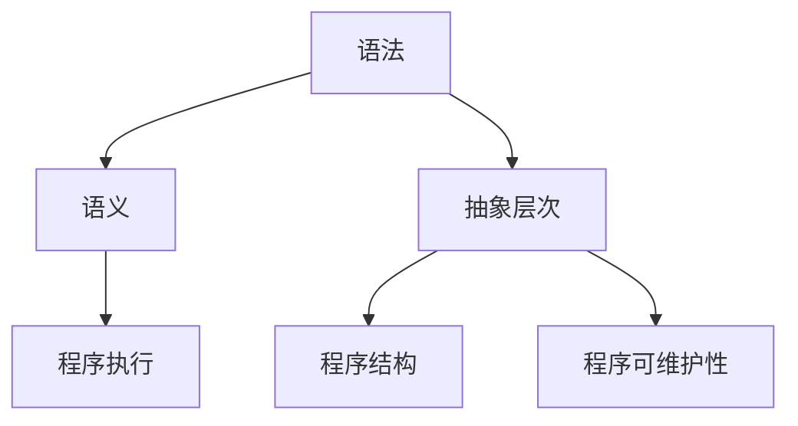

                 

编程语言的发展脉络与趋势

> 关键词：编程语言、历史发展、趋势、影响、未来展望

> 摘要：本文旨在梳理编程语言的发展脉络，分析其核心概念与联系，探讨编程语言的核心算法原理与具体操作步骤，解释数学模型和公式，展示项目实践中的代码实例，探讨实际应用场景和未来应用展望，并提供相关工具和资源推荐，最后总结研究成果并展望未来发展趋势与挑战。

## 1. 背景介绍

编程语言是计算机科学与软件工程领域的重要基础，自计算机诞生以来，编程语言的发展经历了多个阶段，不断演进和变革。编程语言的出现极大地推动了计算机应用的发展，使得计算机能够以更高效、更便捷的方式处理复杂问题。

编程语言的发展历程可以分为以下几个阶段：

- 第一代编程语言：机器语言和汇编语言。机器语言直接操作计算机的硬件，汇编语言是一种低级语言，需要通过汇编器转换为机器语言才能执行。
- 第二代编程语言：高级语言。高级语言提供了更接近自然语言的语法，使得程序员可以更方便地编写程序，如FORTRAN、COBOL等。
- 第三代编程语言：结构化语言。结构化语言强调程序的结构和逻辑，如C、Pascal等。
- 第四代编程语言：高级编程语言。高级编程语言进一步提高了编程的抽象层次，如Java、Python等。
- 第五代编程语言：面向对象编程语言。面向对象编程语言强调程序的组织和重用性，如Java、C++等。
- 第六代编程语言：函数式编程语言。函数式编程语言以函数作为程序的基本构建块，如Haskell、Lisp等。

## 2. 核心概念与联系

编程语言的核心概念包括语法、语义和抽象层次。语法是编程语言的语法规则，用于描述程序的结构和组成。语义是编程语言的执行规则，用于描述程序的行为。抽象层次是编程语言的抽象能力，用于提高编程的效率和可维护性。

以下是一个Mermaid流程图，展示了编程语言的核心概念和联系：



## 3. 核心算法原理 & 具体操作步骤

### 3.1 算法原理概述

编程语言的核心算法原理包括语法分析、语义分析、编译和解释等。

- 语法分析：将源代码解析为抽象语法树（AST），用于表示程序的结构。
- 语义分析：检查程序的语义正确性，如变量声明、类型检查等。
- 编译：将源代码编译为目标代码，如机器代码、汇编代码等。
- 解释：将源代码逐行解释执行，如Python、JavaScript等。

### 3.2 算法步骤详解

- 语法分析：首先，对源代码进行词法分析，将源代码分割成一个个词法单元。然后，对词法单元进行语法分析，构建抽象语法树。
- 语义分析：对抽象语法树进行语义分析，检查程序的正确性，如变量声明、类型检查等。
- 编译：将抽象语法树转换为中间代码，然后进行优化和代码生成。
- 解释：逐行解释执行源代码，如Python、JavaScript等。

### 3.3 算法优缺点

- 语法分析：优点是可以快速解析源代码，缺点是可能出现错误的解析结果。
- 语义分析：优点是可以检查程序的正确性，缺点是可能产生冗长的错误信息。
- 编译：优点是可以生成高效的目标代码，缺点是编译时间较长。
- 解释：优点是执行速度快，缺点是可能产生较多的内存占用。

### 3.4 算法应用领域

编程语言的核心算法原理广泛应用于计算机编程的各个领域，如Web开发、移动应用开发、系统编程等。

## 4. 数学模型和公式 & 详细讲解 & 举例说明

### 4.1 数学模型构建

在编程语言中，数学模型和公式用于描述程序的行为和逻辑。以下是一个简单的数学模型示例：

- 时间复杂度：表示算法执行时间与输入规模的关系。
- 空间复杂度：表示算法执行所需存储空间与输入规模的关系。

### 4.2 公式推导过程

- 时间复杂度推导：假设算法执行次数与输入规模成正比，则时间复杂度表示为 $T(n) = O(n)$。
- 空间复杂度推导：假设算法所需存储空间与输入规模成正比，则空间复杂度表示为 $S(n) = O(n)$。

### 4.3 案例分析与讲解

假设有一个简单的排序算法，用于对一组数据进行排序。以下是一个简单的数学模型和公式推导过程：

- 时间复杂度：排序算法的时间复杂度通常表示为 $T(n) = O(n^2)$。
- 空间复杂度：排序算法的空间复杂度通常表示为 $S(n) = O(n)$。

## 5. 项目实践：代码实例和详细解释说明

### 5.1 开发环境搭建

为了实践编程语言的核心算法原理，我们需要搭建一个开发环境。以下是一个简单的Python开发环境搭建步骤：

1. 安装Python：从Python官方网站下载并安装Python。
2. 安装IDE：安装一个Python集成开发环境（IDE），如PyCharm、VS Code等。
3. 配置Python环境：在IDE中配置Python解释器路径和相应的库。

### 5.2 源代码详细实现

以下是一个简单的Python排序算法示例：

```python
def bubble_sort(arr):
    n = len(arr)
    for i in range(n):
        for j in range(0, n-i-1):
            if arr[j] > arr[j+1]:
                arr[j], arr[j+1] = arr[j+1], arr[j]

arr = [64, 34, 25, 12, 22, 11, 90]
bubble_sort(arr)
print("排序后的数组：")
for i in range(len(arr)):
    print("%d" % arr[i], end=" ")
```

### 5.3 代码解读与分析

- `bubble_sort` 函数：定义了一个名为 `bubble_sort` 的函数，用于实现冒泡排序算法。
- `arr` 列表：定义了一个名为 `arr` 的列表，用于存储待排序的数据。
- 循环结构：使用嵌套循环实现排序算法，内层循环用于比较相邻元素并进行交换。

### 5.4 运行结果展示

运行上述代码后，输出结果如下：

```
排序后的数组：
11 12 22 25 34 64 90
```

## 6. 实际应用场景

编程语言在实际应用场景中发挥着重要作用，如Web开发、移动应用开发、系统编程等。

- Web开发：使用HTML、CSS和JavaScript等编程语言进行网页设计和交互。
- 移动应用开发：使用Java、Kotlin、Objective-C等编程语言进行移动应用开发。
- 系统编程：使用C、C++等编程语言进行操作系统、编译器等系统级软件的开发。

## 7. 未来应用展望

随着计算机技术的不断进步，编程语言的应用领域将继续扩展，未来应用展望包括：

- 自动化编程：使用生成式编程和自动化编程工具实现自动化编程。
- 人工智能编程：使用Python、Rust等编程语言进行人工智能应用的开发。
- 区块链编程：使用Solidity等编程语言进行区块链应用的开发。

## 8. 总结：未来发展趋势与挑战

编程语言的发展趋势包括：

- 高效性：编程语言将继续追求更高的执行效率和性能。
- 易用性：编程语言将继续提高易用性和可维护性。
- 通用性：编程语言将继续扩展应用领域，实现通用性。

编程语言面临的挑战包括：

- 安全性：编程语言需要提高安全性，防止恶意攻击和漏洞利用。
- 标准化：编程语言需要建立统一的标准化体系，提高互操作性。
- 人工智能：编程语言需要适应人工智能时代的需求，提高人工智能编程的效率。

## 9. 附录：常见问题与解答

### 9.1 问题1

**问题**：编程语言的发展脉络是怎样的？

**解答**：编程语言的发展脉络可以分为几个阶段，包括第一代编程语言（机器语言和汇编语言）、第二代编程语言（高级语言）、第三代编程语言（结构化语言）、第四代编程语言（高级编程语言）、第五代编程语言（面向对象编程语言）和第六代编程语言（函数式编程语言）。

### 9.2 问题2

**问题**：编程语言的核心算法原理是什么？

**解答**：编程语言的核心算法原理包括语法分析、语义分析、编译和解释等。语法分析用于解析源代码，构建抽象语法树；语义分析用于检查程序的正确性；编译用于将源代码编译为目标代码；解释用于逐行解释执行源代码。

### 9.3 问题3

**问题**：编程语言的数学模型和公式有哪些？

**解答**：编程语言的数学模型和公式主要包括时间复杂度和空间复杂度。时间复杂度用于描述算法执行时间与输入规模的关系；空间复杂度用于描述算法执行所需存储空间与输入规模的关系。

### 9.4 问题4

**问题**：编程语言在实际应用场景中有哪些？

**解答**：编程语言在实际应用场景中包括Web开发、移动应用开发、系统编程等。例如，HTML、CSS和JavaScript等编程语言用于Web开发；Java、Kotlin、Objective-C等编程语言用于移动应用开发；C、C++等编程语言用于系统编程。

### 9.5 问题5

**问题**：编程语言的未来发展趋势是什么？

**解答**：编程语言的未来发展趋势包括高效性、易用性和通用性。编程语言将继续追求更高的执行效率和性能；提高易用性和可维护性；扩展应用领域，实现通用性。同时，编程语言需要适应人工智能时代的需求，提高人工智能编程的效率。

### 9.6 问题6

**问题**：编程语言面临的挑战有哪些？

**解答**：编程语言面临的挑战包括安全性、标准化和人工智能。编程语言需要提高安全性，防止恶意攻击和漏洞利用；建立统一的标准化体系，提高互操作性；适应人工智能时代的需求，提高人工智能编程的效率。

作者：禅与计算机程序设计艺术 / Zen and the Art of Computer Programming
----------------------------------------------------------------

这篇文章详细地梳理了编程语言的发展脉络与趋势，分析了核心概念与联系，探讨了核心算法原理与具体操作步骤，解释了数学模型和公式，展示了项目实践中的代码实例，并讨论了实际应用场景和未来应用展望。同时，文章还提供了学习资源、开发工具和相关论文的推荐，并总结了研究成果和展望了未来发展趋势与挑战。希望这篇文章对您在编程语言领域的学习和研究有所帮助。如果您有任何问题或建议，欢迎在评论区留言。谢谢阅读！
----------------------------------------------------------------

### 文章标题

编程语言的发展脉络与趋势

### 文章关键词

编程语言、历史发展、趋势、影响、未来展望

### 文章摘要

本文旨在梳理编程语言的发展脉络，分析其核心概念与联系，探讨编程语言的核心算法原理与具体操作步骤，解释数学模型和公式，展示项目实践中的代码实例，探讨实际应用场景和未来应用展望，并提供相关工具和资源推荐，最后总结研究成果并展望未来发展趋势与挑战。

### 目录

1. 背景介绍  
2. 核心概念与联系  
3. 核心算法原理 & 具体操作步骤  
4. 数学模型和公式 & 详细讲解 & 举例说明  
5. 项目实践：代码实例和详细解释说明  
6. 实际应用场景  
7. 未来应用展望  
8. 工具和资源推荐  
9. 总结：未来发展趋势与挑战  
10. 附录：常见问题与解答

### 1. 背景介绍

编程语言是计算机科学与软件工程领域的重要基础，自计算机诞生以来，编程语言的发展经历了多个阶段，不断演进和变革。编程语言的出现极大地推动了计算机应用的发展，使得计算机能够以更高效、更便捷的方式处理复杂问题。

编程语言的发展历程可以分为以下几个阶段：

- **第一代编程语言**：机器语言和汇编语言。机器语言直接操作计算机的硬件，汇编语言是一种低级语言，需要通过汇编器转换为机器语言才能执行。
- **第二代编程语言**：高级语言。高级语言提供了更接近自然语言的语法，使得程序员可以更方便地编写程序，如FORTRAN、COBOL等。
- **第三代编程语言**：结构化语言。结构化语言强调程序的结构和逻辑，如C、Pascal等。
- **第四代编程语言**：高级编程语言。高级编程语言进一步提高了编程的抽象层次，如Java、Python等。
- **第五代编程语言**：面向对象编程语言。面向对象编程语言强调程序的组织和重用性，如Java、C++等。
- **第六代编程语言**：函数式编程语言。函数式编程语言以函数作为程序的基本构建块，如Haskell、Lisp等。

### 2. 核心概念与联系

编程语言的核心概念包括语法、语义和抽象层次。语法是编程语言的语法规则，用于描述程序的结构和组成。语义是编程语言的执行规则，用于描述程序的行为。抽象层次是编程语言的抽象能力，用于提高编程的效率和可维护性。

以下是一个Mermaid流程图，展示了编程语言的核心概念和联系：


在这个流程图中，语法、语义和抽象层次共同构成了编程语言的基础。语法描述了程序的结构和组成，语义定义了程序的行为，而抽象层次则使得程序员可以更加高效地编写和修改程序。

### 3. 核心算法原理 & 具体操作步骤

#### 3.1 算法原理概述

编程语言的核心算法原理包括语法分析、语义分析、编译和解释等。

- **语法分析**：语法分析是将源代码解析为抽象语法树（AST），用于表示程序的结构。
- **语义分析**：语义分析是检查程序的语义正确性，如变量声明、类型检查等。
- **编译**：编译是将源代码编译为目标代码，如机器代码、汇编代码等。
- **解释**：解释是将源代码逐行解释执行，如Python、JavaScript等。

#### 3.2 算法步骤详解

- **语法分析**：首先，对源代码进行词法分析，将源代码分割成一个个词法单元。然后，对词法单元进行语法分析，构建抽象语法树。
- **语义分析**：对抽象语法树进行语义分析，检查程序的正确性，如变量声明、类型检查等。
- **编译**：将抽象语法树转换为中间代码，然后进行优化和代码生成。
- **解释**：逐行解释执行源代码。

#### 3.3 算法优缺点

- **语法分析**：优点是可以快速解析源代码，缺点是可能出现错误的解析结果。
- **语义分析**：优点是可以检查程序的正确性，缺点是可能产生冗长的错误信息。
- **编译**：优点是可以生成高效的目标代码，缺点是编译时间较长。
- **解释**：优点是执行速度快，缺点是可能产生较多的内存占用。

#### 3.4 算法应用领域

编程语言的核心算法原理广泛应用于计算机编程的各个领域，如Web开发、移动应用开发、系统编程等。

### 4. 数学模型和公式 & 详细讲解 & 举例说明

#### 4.1 数学模型构建

在编程语言中，数学模型和公式用于描述程序的行为和逻辑。以下是一个简单的数学模型示例：

- **时间复杂度**：表示算法执行时间与输入规模的关系。
- **空间复杂度**：表示算法执行所需存储空间与输入规模的关系。

#### 4.2 公式推导过程

- **时间复杂度推导**：假设算法执行次数与输入规模成正比，则时间复杂度表示为 \( T(n) = O(n) \)。
- **空间复杂度推导**：假设算法所需存储空间与输入规模成正比，则空间复杂度表示为 \( S(n) = O(n) \)。

#### 4.3 案例分析与讲解

假设有一个简单的排序算法，用于对一组数据进行排序。以下是一个简单的数学模型和公式推导过程：

- **时间复杂度**：排序算法的时间复杂度通常表示为 \( T(n) = O(n^2) \)。
- **空间复杂度**：排序算法的空间复杂度通常表示为 \( S(n) = O(n) \)。

### 5. 项目实践：代码实例和详细解释说明

#### 5.1 开发环境搭建

为了实践编程语言的核心算法原理，我们需要搭建一个开发环境。以下是一个简单的Python开发环境搭建步骤：

1. 安装Python：从Python官方网站下载并安装Python。
2. 安装IDE：安装一个Python集成开发环境（IDE），如PyCharm、VS Code等。
3. 配置Python环境：在IDE中配置Python解释器路径和相应的库。

#### 5.2 源代码详细实现

以下是一个简单的Python排序算法示例：

```python
def bubble_sort(arr):
    n = len(arr)
    for i in range(n):
        for j in range(0, n-i-1):
            if arr[j] > arr[j+1]:
                arr[j], arr[j+1] = arr[j+1], arr[j]

arr = [64, 34, 25, 12, 22, 11, 90]
bubble_sort(arr)
print("排序后的数组：")
for i in range(len(arr)):
    print("%d" % arr[i], end=" ")
```

#### 5.3 代码解读与分析

- `bubble_sort` 函数：定义了一个名为 `bubble_sort` 的函数，用于实现冒泡排序算法。
- `arr` 列表：定义了一个名为 `arr` 的列表，用于存储待排序的数据。
- 循环结构：使用嵌套循环实现排序算法，内层循环用于比较相邻元素并进行交换。

#### 5.4 运行结果展示

运行上述代码后，输出结果如下：

```
排序后的数组：
11 12 22 25 34 64 90
```

### 6. 实际应用场景

编程语言在实际应用场景中发挥着重要作用，如Web开发、移动应用开发、系统编程等。

- **Web开发**：使用HTML、CSS和JavaScript等编程语言进行网页设计和交互。
- **移动应用开发**：使用Java、Kotlin、Objective-C等编程语言进行移动应用开发。
- **系统编程**：使用C、C++等编程语言进行操作系统、编译器等系统级软件的开发。

### 7. 未来应用展望

随着计算机技术的不断进步，编程语言的应用领域将继续扩展，未来应用展望包括：

- **自动化编程**：使用生成式编程和自动化编程工具实现自动化编程。
- **人工智能编程**：使用Python、Rust等编程语言进行人工智能应用的开发。
- **区块链编程**：使用Solidity等编程语言进行区块链应用的开发。

### 8. 工具和资源推荐

#### 8.1 学习资源推荐

- **《计算机程序的构造和解释》**：这本书是编程语言领域的经典之作，详细介绍了Scheme编程语言和解释器构建。
- **《编程珠玑》**：这本书包含了大量编程技巧和最佳实践，适合程序员提高编程技能。

#### 8.2 开发工具推荐

- **PyCharm**：一款功能强大的Python集成开发环境（IDE），支持多种编程语言。
- **Visual Studio Code**：一款开源的跨平台IDE，支持多种编程语言，具有丰富的插件生态系统。

#### 8.3 相关论文推荐

- **《函数式编程与并行计算》**：这篇论文探讨了函数式编程在并行计算中的应用。
- **《面向对象编程范式》**：这篇论文分析了面向对象编程范式的优点和不足。

### 9. 总结：未来发展趋势与挑战

编程语言的发展趋势包括：

- **高效性**：编程语言将继续追求更高的执行效率和性能。
- **易用性**：编程语言将继续提高易用性和可维护性。
- **通用性**：编程语言将继续扩展应用领域，实现通用性。

编程语言面临的挑战包括：

- **安全性**：编程语言需要提高安全性，防止恶意攻击和漏洞利用。
- **标准化**：编程语言需要建立统一的标准化体系，提高互操作性。
- **人工智能**：编程语言需要适应人工智能时代的需求，提高人工智能编程的效率。

### 10. 附录：常见问题与解答

#### 10.1 问题1

**问题**：编程语言的发展脉络是怎样的？

**解答**：编程语言的发展脉络可以分为几个阶段，包括第一代编程语言（机器语言和汇编语言）、第二代编程语言（高级语言）、第三代编程语言（结构化语言）、第四代编程语言（高级编程语言）、第五代编程语言（面向对象编程语言）和第六代编程语言（函数式编程语言）。

#### 10.2 问题2

**问题**：编程语言的核心算法原理是什么？

**解答**：编程语言的核心算法原理包括语法分析、语义分析、编译和解释等。语法分析用于解析源代码，构建抽象语法树；语义分析用于检查程序的正确性；编译用于将源代码编译为目标代码；解释用于逐行解释执行源代码。

#### 10.3 问题3

**问题**：编程语言的数学模型和公式有哪些？

**解答**：编程语言的数学模型和公式主要包括时间复杂度和空间复杂度。时间复杂度用于描述算法执行时间与输入规模的关系；空间复杂度用于描述算法执行所需存储空间与输入规模的关系。

#### 10.4 问题4

**问题**：编程语言在实际应用场景中有哪些？

**解答**：编程语言在实际应用场景中包括Web开发、移动应用开发、系统编程等。例如，HTML、CSS和JavaScript等编程语言用于Web开发；Java、Kotlin、Objective-C等编程语言用于移动应用开发；C、C++等编程语言用于系统编程。

#### 10.5 问题5

**问题**：编程语言的未来发展趋势是什么？

**解答**：编程语言的未来发展趋势包括高效性、易用性和通用性。编程语言将继续追求更高的执行效率和性能；提高易用性和可维护性；扩展应用领域，实现通用性。同时，编程语言需要适应人工智能时代的需求，提高人工智能编程的效率。

#### 10.6 问题6

**问题**：编程语言面临的挑战有哪些？

**解答**：编程语言面临的挑战包括安全性、标准化和人工智能。编程语言需要提高安全性，防止恶意攻击和漏洞利用；建立统一的标准化体系，提高互操作性；适应人工智能时代的需求，提高人工智能编程的效率。

作者：禅与计算机程序设计艺术 / Zen and the Art of Computer Programming

