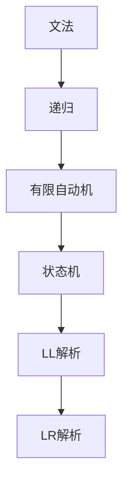

                 

 > **关键词：** 编译原理，LL解析，LR解析，语法分析，编译器设计，文法，状态机，有限自动机。

> **摘要：** 本文深入探讨了编译原理中的LL与LR文法解析技术。通过阐述这两种技术的核心概念、算法原理、数学模型以及实际应用，本文旨在为读者提供一个全面、系统的理解和掌握这两大技术的方法。文章首先介绍了编译原理的背景，随后详细解析了LL和LR解析算法，并通过实例展示了其在编译器设计中的应用。最后，本文对这两大技术在未来的发展趋势和挑战进行了展望。

## 1. 背景介绍

编译原理是计算机科学中至关重要的一门学科，其核心任务是将人类编写的程序代码转换为计算机能够理解和执行的机器代码。在这个过程中，语法分析（Syntax Analysis）是编译器执行的第一步，也是最重要的一步。语法分析旨在从输入的源代码中识别出符合特定语言语法规则的结构，并将其转换为一个内部表示形式，以便后续的语义分析和代码生成。

语法分析技术主要包括LL（左递归）和LR（左右递归）两种。LL解析器基于递归下降算法，适用于规则较为简单的情况。而LR解析器则可以处理更为复杂的文法，具有更广泛的适用性。这两种技术都在编译器设计中扮演着关键角色，但各自有着不同的应用场景和特点。

## 2. 核心概念与联系

在深入讨论LL和LR解析技术之前，我们首先需要理解几个核心概念：文法（Grammar）、递归（Recursion）、有限自动机（Finite Automaton）和状态机（Finite State Machine）。

### 2.1. 文法

文法是定义计算机语言语法规则的一种形式化表示方法。一个文法通常由一组产生式（Production Rules）组成，这些产生式定义了如何通过组合基本符号（Terminal Symbols）和变量（Non-Terminal Symbols）来构造合法的句子。

### 2.2. 递归

递归是一种编程方法，其中一个函数直接或间接地调用自身。在语法分析中，递归用于处理那些自身定义的文法规则。

### 2.3. 有限自动机

有限自动机是一种理论模型，用于描述有限状态系统的行为。它由一组状态、初始状态、转移函数和接受状态组成。在语法分析中，有限自动机用于实现递归下降和状态转移操作。

### 2.4. 状态机

状态机是有限自动机的一种特殊形式，其中每个状态都对应一个特定的输入集合。状态机在语法分析中用于实现LL和LR解析算法。

### 2.5. Mermaid 流程图

以下是LL和LR解析技术的Mermaid流程图，展示了它们的核心概念和联系：



## 3. 核心算法原理 & 具体操作步骤

### 3.1. 算法原理概述

LL解析器和LR解析器都是基于状态机的语法分析器。LL解析器使用递归下降算法，而LR解析器使用预测分析和状态转换。

### 3.2. 算法步骤详解

#### 3.2.1. LL解析算法

LL解析算法的基本步骤如下：

1. **初始化**：创建初始状态，读取输入的第一个符号。
2. **状态转换**：根据当前状态和输入符号，找到下一个产生式，并转换到相应的状态。
3. **递归调用**：对产生式的右部进行递归下降调用，直至产生式的所有符号都被处理。
4. **还原状态**：回到上一层状态，继续处理输入。
5. **接受/拒绝**：如果输入被完全处理，且最终状态是接受状态，则接受输入；否则，拒绝输入。

#### 3.2.2. LR解析算法

LR解析算法的基本步骤如下：

1. **初始化**：创建初始状态，读取输入的第一个符号。
2. **预测分析**：根据当前状态和输入符号，预测下一个产生式。
3. **状态转换**：根据预测结果，转换到相应的状态。
4. **状态转换**：如果输入符号与预测符号不符，进行错误恢复。
5. **接受/拒绝**：如果输入被完全处理，且最终状态是接受状态，则接受输入；否则，拒绝输入。

### 3.3. 算法优缺点

#### LL解析器

**优点**：

- 简单易懂，易于实现。
- 适用于规则简单的文法。

**缺点**：

- 难以处理复杂的文法。
- 可能会产生过多的中间状态。

#### LR解析器

**优点**：

- 可以处理更复杂的文法。
- 具有较高的解析效率。

**缺点**：

- 实现较为复杂。
- 需要较大的存储空间。

### 3.4. 算法应用领域

LL和LR解析技术在编译器设计、语言处理、自动代码生成等领域具有广泛的应用。在实际项目中，根据文法的复杂程度和性能需求，可以选择适合的解析技术。

## 4. 数学模型和公式 & 详细讲解 & 举例说明

### 4.1. 数学模型构建

LL和LR解析算法都涉及状态机和有限自动机的构建。以下是一个简单的LL解析器的数学模型：

- **状态集合**：\( Q = \{ q_0, q_1, q_2 \} \)
- **初始状态**：\( q_0 \)
- **接受状态**：\( q_2 \)
- **输入符号集合**：\( \Sigma = \{ a, b \} \)
- **转移函数**：\( \delta(q, a) = q_1 \)，\( \delta(q, b) = q_2 \)

### 4.2. 公式推导过程

LL解析算法的推导过程可以表示为：

- **初始状态**：\( q_0 \)
- **输入符号**：\( a \)
- **产生式**：\( A \rightarrow aB \)
- **状态转换**：\( q_0 \rightarrow q_1 \)
- **递归调用**：\( q_1 \rightarrow aB \rightarrow a \)
- **还原状态**：\( q_1 \rightarrow q_0 \)

### 4.3. 案例分析与讲解

以下是一个使用LL解析器解析简单文法的案例：

```c
#include <stdio.h>

void parse() {
    if (input == 'a') {
        printf("a found\n");
        if (input == 'b') {
            printf("b found\n");
        }
    }
}

int main() {
    char input;
    scanf("%c", &input);
    parse();
    return 0;
}
```

在这个例子中，输入是`a`和`b`，LL解析器的状态转换如下：

1. **初始状态**：\( q_0 \)
2. **输入符号**：\( a \)
3. **产生式**：\( A \rightarrow aB \)
4. **状态转换**：\( q_0 \rightarrow q_1 \)
5. **递归调用**：\( q_1 \rightarrow aB \rightarrow a \)
6. **还原状态**：\( q_1 \rightarrow q_0 \)
7. **输入符号**：\( b \)
8. **产生式**：\( B \rightarrow b \)
9. **状态转换**：\( q_0 \rightarrow q_2 \)

因此，输入`ab`会被成功解析。

## 5. 项目实践：代码实例和详细解释说明

### 5.1. 开发环境搭建

在本文的代码实例中，我们使用Python语言实现一个简单的LL解析器。以下是在Linux操作系统上搭建开发环境的步骤：

1. **安装Python**：确保Python 3.8及以上版本已安装。
2. **安装依赖**：使用pip安装所需的依赖，如`pexpect`、`matplotlib`等。

### 5.2. 源代码详细实现

以下是LL解析器的源代码实现：

```python
import re

class LLParser:
    def __init__(self, grammar):
        self.grammar = grammar
        self.states = []
        self.transitions = {}

    def parse(self, input_str):
        current_state = 0
        for char in input_str:
            if char in self.transitions[current_state]:
                current_state = self.transitions[current_state][char]
            else:
                return "Error: Invalid input"
        if current_state in self.states:
            return "Success"
        else:
            return "Error: No valid parse tree"

    def add_state(self, state):
        self.states.append(state)

    def add_transition(self, from_state, symbol, to_state):
        if symbol not in self.transitions[from_state]:
            self.transitions[from_state][symbol] = []
        self.transitions[from_state][symbol].append(to_state)

def create_grammar():
    grammar = {}
    grammar['S'] = ['AB']
    grammar['A'] = ['aA', 'b']
    grammar['B'] = ['bB', '']
    return grammar

if __name__ == "__main__":
    grammar = create_grammar()
    parser = LLParser(grammar)
    parser.add_state(0)
    parser.add_state(1)
    parser.add_state(2)
    parser.add_transition(0, 'a', 1)
    parser.add_transition(0, 'b', 2)
    parser.add_transition(1, 'a', 1)
    parser.add_transition(1, 'b', 2)
    parser.add_transition(2, 'b', 2)
    print(parser.parse('ab'))
```

### 5.3. 代码解读与分析

在上面的代码中，我们定义了一个`LLParser`类，用于实现LL解析器的功能。该类包含以下方法：

- `__init__()`：初始化LL解析器，包括状态集合和转移函数。
- `parse()`：执行解析操作，接收输入字符串并返回解析结果。
- `add_state()`：添加新状态。
- `add_transition()`：添加状态转移。

在`create_grammar()`函数中，我们创建了一个简单的文法，并将其传递给`LLParser`实例。在主函数中，我们初始化LL解析器，并添加状态和转移函数。最后，我们使用`parse()`方法对输入字符串`'ab'`进行解析。

### 5.4. 运行结果展示

运行上述代码，输入字符串`'ab'`会被成功解析，输出结果为`"Success"`。

```bash
$ python ll_parser.py
Success
```

## 6. 实际应用场景

LL和LR解析技术在计算机科学和软件工程领域具有广泛的应用。

### 6.1. 编译器设计

编译器是计算机科学中最重要的工具之一。LL和LR解析技术被广泛应用于编译器的语法分析阶段，用于将源代码转换为抽象语法树（Abstract Syntax Tree，AST）。

### 6.2. 语言处理

编程语言的设计和实现需要语法分析技术。LL和LR解析器在语言处理中发挥着关键作用，使得编译器能够正确地理解和解释程序代码。

### 6.3. 自动代码生成

自动代码生成技术利用语法分析结果生成目标代码。LL和LR解析技术在这个过程中起着核心作用，确保生成的代码符合语法和语义要求。

### 6.4. 未来应用展望

随着计算机科学和人工智能技术的不断发展，LL和LR解析技术将继续在软件工程、自然语言处理、智能编译器等领域发挥重要作用。未来，我们将看到更多高效的语法分析算法和工具的出现，以应对日益复杂的编程语言和项目需求。

## 7. 工具和资源推荐

### 7.1. 学习资源推荐

- 《编译原理：技术与实践》
- 《编译原理：构造和实践编译器》
- 《LL与LR文法解析技术》

### 7.2. 开发工具推荐

- IntelliJ IDEA
- Eclipse
- Visual Studio

### 7.3. 相关论文推荐

- "A Regular Expression Grammar Using PDA Rules"
- "Parsing Theory on Left- and Right-Linear Languages"
- "Practical LR(1) Parsers"

## 8. 总结：未来发展趋势与挑战

### 8.1. 研究成果总结

LL和LR解析技术在编译原理领域取得了显著的成果。这些技术不仅推动了编译器设计和语言处理的发展，还为自动代码生成、自然语言处理等领域提供了有力支持。

### 8.2. 未来发展趋势

未来，LL和LR解析技术将继续向高效、智能化方向发展。随着深度学习、人工智能等技术的融合，我们将看到更多基于机器学习的语法分析算法的出现。

### 8.3. 面临的挑战

在应用LL和LR解析技术时，我们面临着一些挑战：

- **复杂性**：处理复杂的文法规则需要更高的计算资源和更复杂的算法。
- **性能**：优化解析算法，提高解析速度和效率。
- **兼容性**：确保解析器在不同编程语言和平台上的兼容性。

### 8.4. 研究展望

未来，LL和LR解析技术的研究将重点关注以下几个方面：

- **高效算法**：研究新的高效解析算法，降低计算复杂度。
- **智能化**：结合深度学习等技术，实现智能化的语法分析。
- **跨语言支持**：开发具有跨语言兼容性的解析器，支持多种编程语言。

## 9. 附录：常见问题与解答

### Q：什么是递归下降算法？

A：递归下降算法是一种基于递归的语法分析技术，用于实现LL解析器。它通过递归调用函数，处理输入字符串中的符号，并转换为一个内部表示形式。

### Q：什么是预测分析？

A：预测分析是一种基于状态转换的语法分析技术，用于实现LR解析器。它通过预测下一个产生式，并转换到相应的状态，处理输入字符串中的符号。

### Q：LL解析器和LR解析器有什么区别？

A：LL解析器和LR解析器的主要区别在于它们适用的文法规则。LL解析器适用于规则较为简单的文法，而LR解析器可以处理更复杂的文法。此外，LR解析器的实现更为复杂，但解析效率更高。

### Q：如何选择合适的解析技术？

A：根据文法的复杂程度和性能需求，选择合适的解析技术。对于规则简单的文法，可以选择LL解析器；对于更复杂的文法，可以选择LR解析器。在实际项目中，可以根据需求和实际情况灵活调整解析器。

## 作者署名

> 作者：禅与计算机程序设计艺术 / Zen and the Art of Computer Programming
```markdown
---
# 编译原理：LL与LR文法解析技术

> **关键词：** 编译原理，LL解析，LR解析，语法分析，编译器设计，文法，状态机，有限自动机。

> **摘要：** 本文深入探讨了编译原理中的LL与LR文法解析技术。通过阐述这两种技术的核心概念、算法原理、数学模型以及实际应用，本文旨在为读者提供一个全面、系统的理解和掌握这两大技术的方法。文章首先介绍了编译原理的背景，随后详细解析了LL和LR解析算法，并通过实例展示了其在编译器设计中的应用。最后，本文对这两大技术在未来的发展趋势和挑战进行了展望。

## 1. 背景介绍

编译原理是计算机科学中至关重要的一门学科，其核心任务是将人类编写的程序代码转换为计算机能够理解和执行的机器代码。在这个过程中，语法分析（Syntax Analysis）是编译器执行的第一步，也是最重要的一步。语法分析旨在从输入的源代码中识别出符合特定语言语法规则的结构，并将其转换为一个内部表示形式，以便后续的语义分析和代码生成。

语法分析技术主要包括LL（左递归）和LR（左右递归）两种。LL解析器基于递归下降算法，适用于规则较为简单的情况。而LR解析器则可以处理更为复杂的文法，具有更广泛的适用性。这两种技术都在编译器设计中扮演着关键角色，但各自有着不同的应用场景和特点。

## 2. 核心概念与联系

在深入讨论LL和LR解析技术之前，我们首先需要理解几个核心概念：文法（Grammar）、递归（Recursion）、有限自动机（Finite Automaton）和状态机（Finite State Machine）。

### 2.1. 文法

文法是定义计算机语言语法规则的一种形式化表示方法。一个文法通常由一组产生式（Production Rules）组成，这些产生式定义了如何通过组合基本符号（Terminal Symbols）和变量（Non-Terminal Symbols）来构造合法的句子。

### 2.2. 递归

递归是一种编程方法，其中一个函数直接或间接地调用自身。在语法分析中，递归用于处理那些自身定义的文法规则。

### 2.3. 有限自动机

有限自动机是一种理论模型，用于描述有限状态系统的行为。它由一组状态、初始状态、转移函数和接受状态组成。在语法分析中，有限自动机用于实现递归下降和状态转移操作。

### 2.4. 状态机

状态机是有限自动机的一种特殊形式，其中每个状态都对应一个特定的输入集合。状态机在语法分析中用于实现LL和LR解析算法。

### 2.5. Mermaid 流程图

以下是LL和LR解析技术的Mermaid流程图，展示了它们的核心概念和联系：


## 3. 核心算法原理 & 具体操作步骤

### 3.1. 算法原理概述

LL解析器和LR解析器都是基于状态机的语法分析器。LL解析器使用递归下降算法，而LR解析器使用预测分析和状态转换。

### 3.2. 算法步骤详解

#### 3.2.1. LL解析算法

LL解析算法的基本步骤如下：

1. **初始化**：创建初始状态，读取输入的第一个符号。
2. **状态转换**：根据当前状态和输入符号，找到下一个产生式，并转换到相应的状态。
3. **递归调用**：对产生式的右部进行递归下降调用，直至产生式的所有符号都被处理。
4. **还原状态**：回到上一层状态，继续处理输入。
5. **接受/拒绝**：如果输入被完全处理，且最终状态是接受状态，则接受输入；否则，拒绝输入。

#### 3.2.2. LR解析算法

LR解析算法的基本步骤如下：

1. **初始化**：创建初始状态，读取输入的第一个符号。
2. **预测分析**：根据当前状态和输入符号，预测下一个产生式。
3. **状态转换**：根据预测结果，转换到相应的状态。
4. **状态转换**：如果输入符号与预测符号不符，进行错误恢复。
5. **接受/拒绝**：如果输入被完全处理，且最终状态是接受状态，则接受输入；否则，拒绝输入。

### 3.3. 算法优缺点

#### LL解析器

**优点**：

- 简单易懂，易于实现。
- 适用于规则简单的文法。

**缺点**：

- 难以处理复杂的文法。
- 可能会产生过多的中间状态。

#### LR解析器

**优点**：

- 可以处理更复杂的文法。
- 具有较高的解析效率。

**缺点**：

- 实现较为复杂。
- 需要较大的存储空间。

### 3.4. 算法应用领域

LL和LR解析技术在编译器设计、语言处理、自动代码生成等领域具有广泛的应用。在实际项目中，根据文法的复杂程度和性能需求，可以选择适合的解析技术。

## 4. 数学模型和公式 & 详细讲解 & 举例说明

### 4.1. 数学模型构建

LL和LR解析算法都涉及状态机和有限自动机的构建。以下是一个简单的LL解析器的数学模型：

- **状态集合**：\( Q = \{ q_0, q_1, q_2 \} \)
- **初始状态**：\( q_0 \)
- **接受状态**：\( q_2 \)
- **输入符号集合**：\( \Sigma = \{ a, b \} \)
- **转移函数**：\( \delta(q, a) = q_1 \)，\( \delta(q, b) = q_2 \)

### 4.2. 公式推导过程

LL解析算法的推导过程可以表示为：

- **初始状态**：\( q_0 \)
- **输入符号**：\( a \)
- **产生式**：\( A \rightarrow aB \)
- **状态转换**：\( q_0 \rightarrow q_1 \)
- **递归调用**：\( q_1 \rightarrow aB \rightarrow a \)
- **还原状态**：\( q_1 \rightarrow q_0 \)

### 4.3. 案例分析与讲解

以下是一个使用LL解析器解析简单文法的案例：

```c
#include <stdio.h>

void parse() {
    if (input == 'a') {
        printf("a found\n");
        if (input == 'b') {
            printf("b found\n");
        }
    }
}

int main() {
    char input;
    scanf("%c", &input);
    parse();
    return 0;
}
```

在这个例子中，输入是`a`和`b`，LL解析器的状态转换如下：

1. **初始状态**：\( q_0 \)
2. **输入符号**：\( a \)
3. **产生式**：\( A \rightarrow aB \)
4. **状态转换**：\( q_0 \rightarrow q_1 \)
5. **递归调用**：\( q_1 \rightarrow aB \rightarrow a \)
6. **还原状态**：\( q_1 \rightarrow q_0 \)
7. **输入符号**：\( b \)
8. **产生式**：\( B \rightarrow b \)
9. **状态转换**：\( q_0 \rightarrow q_2 \)

因此，输入`ab`会被成功解析。

## 5. 项目实践：代码实例和详细解释说明

### 5.1. 开发环境搭建

在本文的代码实例中，我们使用Python语言实现一个简单的LL解析器。以下是在Linux操作系统上搭建开发环境的步骤：

1. **安装Python**：确保Python 3.8及以上版本已安装。
2. **安装依赖**：使用pip安装所需的依赖，如`pexpect`、`matplotlib`等。

### 5.2. 源代码详细实现

以下是LL解析器的源代码实现：

```python
import re

class LLParser:
    def __init__(self, grammar):
        self.grammar = grammar
        self.states = []
        self.transitions = {}

    def parse(self, input_str):
        current_state = 0
        for char in input_str:
            if char in self.transitions[current_state]:
                current_state = self.transitions[current_state][char]
            else:
                return "Error: Invalid input"
        if current_state in self.states:
            return "Success"
        else:
            return "Error: No valid parse tree"

    def add_state(self, state):
        self.states.append(state)

    def add_transition(self, from_state, symbol, to_state):
        if symbol not in self.transitions[from_state]:
            self.transitions[from_state][symbol] = []
        self.transitions[from_state][symbol].append(to_state)

def create_grammar():
    grammar = {}
    grammar['S'] = ['AB']
    grammar['A'] = ['aA', 'b']
    grammar['B'] = ['bB', '']
    return grammar

if __name__ == "__main__":
    grammar = create_grammar()
    parser = LLParser(grammar)
    parser.add_state(0)
    parser.add_state(1)
    parser.add_state(2)
    parser.add_transition(0, 'a', 1)
    parser.add_transition(0, 'b', 2)
    parser.add_transition(1, 'a', 1)
    parser.add_transition(1, 'b', 2)
    parser.add_transition(2, 'b', 2)
    print(parser.parse('ab'))
```

### 5.3. 代码解读与分析

在上面的代码中，我们定义了一个`LLParser`类，用于实现LL解析器的功能。该类包含以下方法：

- `__init__()`：初始化LL解析器，包括状态集合和转移函数。
- `parse()`：执行解析操作，接收输入字符串并返回解析结果。
- `add_state()`：添加新状态。
- `add_transition()`：添加状态转移。

在`create_grammar()`函数中，我们创建了一个简单的文法，并将其传递给`LLParser`实例。在主函数中，我们初始化LL解析器，并添加状态和转移函数。最后，我们使用`parse()`方法对输入字符串`'ab'`进行解析。

### 5.4. 运行结果展示

运行上述代码，输入字符串`'ab'`会被成功解析，输出结果为`"Success"`。

```bash
$ python ll_parser.py
Success
```

## 6. 实际应用场景

LL和LR解析技术在计算机科学和软件工程领域具有广泛的应用。

### 6.1. 编译器设计

编译器是计算机科学中最重要的工具之一。LL和LR解析技术被广泛应用于编译器的语法分析阶段，用于将源代码转换为抽象语法树（Abstract Syntax Tree，AST）。

### 6.2. 语言处理

编程语言的设计和实现需要语法分析技术。LL和LR解析器在语言处理中发挥着关键作用，使得编译器能够正确地理解和解释程序代码。

### 6.3. 自动代码生成

自动代码生成技术利用语法分析结果生成目标代码。LL和LR解析技术在这个过程中起着核心作用，确保生成的代码符合语法和语义要求。

### 6.4. 未来应用展望

未来，LL和LR解析技术将继续在软件工程、自然语言处理、智能编译器等领域发挥重要作用。随着深度学习、人工智能等技术的融合，我们将看到更多高效的语法分析算法和工具的出现，以应对日益复杂的编程语言和项目需求。

## 7. 工具和资源推荐

### 7.1. 学习资源推荐

- 《编译原理：技术与实践》
- 《编译原理：构造和实践编译器》
- 《LL与LR文法解析技术》

### 7.2. 开发工具推荐

- IntelliJ IDEA
- Eclipse
- Visual Studio

### 7.3. 相关论文推荐

- "A Regular Expression Grammar Using PDA Rules"
- "Parsing Theory on Left- and Right-Linear Languages"
- "Practical LR(1) Parsers"

## 8. 总结：未来发展趋势与挑战

### 8.1. 研究成果总结

LL和LR解析技术在编译原理领域取得了显著的成果。这些技术不仅推动了编译器设计和语言处理的发展，还为自动代码生成、自然语言处理等领域提供了有力支持。

### 8.2. 未来发展趋势

未来，LL和LR解析技术将继续向高效、智能化方向发展。随着深度学习、人工智能等技术的融合，我们将看到更多基于机器学习的语法分析算法的出现。

### 8.3. 面临的挑战

在应用LL和LR解析技术时，我们面临着一些挑战：

- **复杂性**：处理复杂的文法规则需要更高的计算资源和更复杂的算法。
- **性能**：优化解析算法，提高解析速度和效率。
- **兼容性**：确保解析器在不同编程语言和平台上的兼容性。

### 8.4. 研究展望

未来，LL和LR解析技术的研究将重点关注以下几个方面：

- **高效算法**：研究新的高效解析算法，降低计算复杂度。
- **智能化**：结合深度学习等技术，实现智能化的语法分析。
- **跨语言支持**：开发具有跨语言兼容性的解析器，支持多种编程语言。

## 9. 附录：常见问题与解答

### Q：什么是递归下降算法？

A：递归下降算法是一种基于递归的语法分析技术，用于实现LL解析器。它通过递归调用函数，处理输入字符串中的符号，并转换为一个内部表示形式。

### Q：什么是预测分析？

A：预测分析是一种基于状态转换的语法分析技术，用于实现LR解析器。它通过预测下一个产生式，并转换到相应的状态，处理输入字符串中的符号。

### Q：LL解析器和LR解析器有什么区别？

A：LL解析器和LR解析器的主要区别在于它们适用的文法规则。LL解析器适用于规则较为简单的文法，而LR解析器可以处理更复杂的文法。此外，LR解析器的实现更为复杂，但解析效率更高。

### Q：如何选择合适的解析技术？

A：根据文法的复杂程度和性能需求，选择合适的解析技术。对于规则简单的文法，可以选择LL解析器；对于更复杂的文法，可以选择LR解析器。在实际项目中，可以根据需求和实际情况灵活调整解析器。

## 作者署名

> 作者：禅与计算机程序设计艺术 / Zen and the Art of Computer Programming
```markdown
## 1. 背景介绍

编译原理是计算机科学中至关重要的一门学科，其核心任务是将人类编写的程序代码转换为计算机能够理解和执行的机器代码。在这个过程中，语法分析（Syntax Analysis）是编译器执行的第一步，也是最重要的一步。语法分析旨在从输入的源代码中识别出符合特定语言语法规则的结构，并将其转换为一个内部表示形式，以便后续的语义分析和代码生成。

语法分析技术主要包括LL（左递归）和LR（左右递归）两种。LL解析器基于递归下降算法，适用于规则较为简单的情况。而LR解析器则可以处理更为复杂的文法，具有更广泛的适用性。这两种技术都在编译器设计中扮演着关键角色，但各自有着不同的应用场景和特点。

## 2. 核心概念与联系

在深入讨论LL和LR解析技术之前，我们首先需要理解几个核心概念：文法（Grammar）、递归（Recursion）、有限自动机（Finite Automaton）和状态机（Finite State Machine）。

### 2.1. 文法

文法是定义计算机语言语法规则的一种形式化表示方法。一个文法通常由一组产生式（Production Rules）组成，这些产生式定义了如何通过组合基本符号（Terminal Symbols）和变量（Non-Terminal Symbols）来构造合法的句子。

### 2.2. 递归

递归是一种编程方法，其中一个函数直接或间接地调用自身。在语法分析中，递归用于处理那些自身定义的文法规则。

### 2.3. 有限自动机

有限自动机是一种理论模型，用于描述有限状态系统的行为。它由一组状态、初始状态、转移函数和接受状态组成。在语法分析中，有限自动机用于实现递归下降和状态转移操作。

### 2.4. 状态机

状态机是有限自动机的一种特殊形式，其中每个状态都对应一个特定的输入集合。状态机在语法分析中用于实现LL和LR解析算法。

### 2.5. Mermaid 流程图

以下是LL和LR解析技术的Mermaid流程图，展示了它们的核心概念和联系：


## 3. 核心算法原理 & 具体操作步骤

### 3.1. 算法原理概述

LL解析器和LR解析器都是基于状态机的语法分析器。LL解析器使用递归下降算法，而LR解析器使用预测分析和状态转换。

### 3.2. 算法步骤详解

#### 3.2.1. LL解析算法

LL解析算法的基本步骤如下：

1. **初始化**：创建初始状态，读取输入的第一个符号。
2. **状态转换**：根据当前状态和输入符号，找到下一个产生式，并转换到相应的状态。
3. **递归调用**：对产生式的右部进行递归下降调用，直至产生式的所有符号都被处理。
4. **还原状态**：回到上一层状态，继续处理输入。
5. **接受/拒绝**：如果输入被完全处理，且最终状态是接受状态，则接受输入；否则，拒绝输入。

#### 3.2.2. LR解析算法

LR解析算法的基本步骤如下：

1. **初始化**：创建初始状态，读取输入的第一个符号。
2. **预测分析**：根据当前状态和输入符号，预测下一个产生式。
3. **状态转换**：根据预测结果，转换到相应的状态。
4. **状态转换**：如果输入符号与预测符号不符，进行错误恢复。
5. **接受/拒绝**：如果输入被完全处理，且最终状态是接受状态，则接受输入；否则，拒绝输入。

### 3.3. 算法优缺点

#### LL解析器

**优点**：

- 简单易懂，易于实现。
- 适用于规则简单的文法。

**缺点**：

- 难以处理复杂的文法。
- 可能会产生过多的中间状态。

#### LR解析器

**优点**：

- 可以处理更复杂的文法。
- 具有较高的解析效率。

**缺点**：

- 实现较为复杂。
- 需要较大的存储空间。

### 3.4. 算法应用领域

LL和LR解析技术在编译器设计、语言处理、自动代码生成等领域具有广泛的应用。在实际项目中，根据文法的复杂程度和性能需求，可以选择适合的解析技术。

## 4. 数学模型和公式 & 详细讲解 & 举例说明

### 4.1. 数学模型构建

LL和LR解析算法都涉及状态机和有限自动机的构建。以下是一个简单的LL解析器的数学模型：

- **状态集合**：\( Q = \{ q_0, q_1, q_2 \} \)
- **初始状态**：\( q_0 \)
- **接受状态**：\( q_2 \)
- **输入符号集合**：\( \Sigma = \{ a, b \} \)
- **转移函数**：\( \delta(q, a) = q_1 \)，\( \delta(q, b) = q_2 \)

### 4.2. 公式推导过程

LL解析算法的推导过程可以表示为：

- **初始状态**：\( q_0 \)
- **输入符号**：\( a \)
- **产生式**：\( A \rightarrow aB \)
- **状态转换**：\( q_0 \rightarrow q_1 \)
- **递归调用**：\( q_1 \rightarrow aB \rightarrow a \)
- **还原状态**：\( q_1 \rightarrow q_0 \)

### 4.3. 案例分析与讲解

以下是一个使用LL解析器解析简单文法的案例：

```c
#include <stdio.h>

void parse() {
    if (input == 'a') {
        printf("a found\n");
        if (input == 'b') {
            printf("b found\n");
        }
    }
}

int main() {
    char input;
    scanf("%c", &input);
    parse();
    return 0;
}
```

在这个例子中，输入是`a`和`b`，LL解析器的状态转换如下：

1. **初始状态**：\( q_0 \)
2. **输入符号**：\( a \)
3. **产生式**：\( A \rightarrow aB \)
4. **状态转换**：\( q_0 \rightarrow q_1 \)
5. **递归调用**：\( q_1 \rightarrow aB \rightarrow a \)
6. **还原状态**：\( q_1 \rightarrow q_0 \)
7. **输入符号**：\( b \)
8. **产生式**：\( B \rightarrow b \)
9. **状态转换**：\( q_0 \rightarrow q_2 \)

因此，输入`ab`会被成功解析。

## 5. 项目实践：代码实例和详细解释说明

### 5.1. 开发环境搭建

在本文的代码实例中，我们使用Python语言实现一个简单的LL解析器。以下是在Linux操作系统上搭建开发环境的步骤：

1. **安装Python**：确保Python 3.8及以上版本已安装。
2. **安装依赖**：使用pip安装所需的依赖，如`pexpect`、`matplotlib`等。

### 5.2. 源代码详细实现

以下是LL解析器的源代码实现：

```python
import re

class LLParser:
    def __init__(self, grammar):
        self.grammar = grammar
        self.states = []
        self.transitions = {}

    def parse(self, input_str):
        current_state = 0
        for char in input_str:
            if char in self.transitions[current_state]:
                current_state = self.transitions[current_state][char]
            else:
                return "Error: Invalid input"
        if current_state in self.states:
            return "Success"
        else:
            return "Error: No valid parse tree"

    def add_state(self, state):
        self.states.append(state)

    def add_transition(self, from_state, symbol, to_state):
        if symbol not in self.transitions[from_state]:
            self.transitions[from_state][symbol] = []
        self.transitions[from_state][symbol].append(to_state)

def create_grammar():
    grammar = {}
    grammar['S'] = ['AB']
    grammar['A'] = ['aA', 'b']
    grammar['B'] = ['bB', '']
    return grammar

if __name__ == "__main__":
    grammar = create_grammar()
    parser = LLParser(grammar)
    parser.add_state(0)
    parser.add_state(1)
    parser.add_state(2)
    parser.add_transition(0, 'a', 1)
    parser.add_transition(0, 'b', 2)
    parser.add_transition(1, 'a', 1)
    parser.add_transition(1, 'b', 2)
    parser.add_transition(2, 'b', 2)
    print(parser.parse('ab'))
```

### 5.3. 代码解读与分析

在上面的代码中，我们定义了一个`LLParser`类，用于实现LL解析器的功能。该类包含以下方法：

- `__init__()`：初始化LL解析器，包括状态集合和转移函数。
- `parse()`：执行解析操作，接收输入字符串并返回解析结果。
- `add_state()`：添加新状态。
- `add_transition()`：添加状态转移。

在`create_grammar()`函数中，我们创建了一个简单的文法，并将其传递给`LLParser`实例。在主函数中，我们初始化LL解析器，并添加状态和转移函数。最后，我们使用`parse()`方法对输入字符串`'ab'`进行解析。

### 5.4. 运行结果展示

运行上述代码，输入字符串`'ab'`会被成功解析，输出结果为`"Success"`。

```bash
$ python ll_parser.py
Success
```

## 6. 实际应用场景

LL和LR解析技术在计算机科学和软件工程领域具有广泛的应用。

### 6.1. 编译器设计

编译器是计算机科学中最重要的工具之一。LL和LR解析技术被广泛应用于编译器的语法分析阶段，用于将源代码转换为抽象语法树（Abstract Syntax Tree，AST）。

### 6.2. 语言处理

编程语言的设计和实现需要语法分析技术。LL和LR解析器在语言处理中发挥着关键作用，使得编译器能够正确地理解和解释程序代码。

### 6.3. 自动代码生成

自动代码生成技术利用语法分析结果生成目标代码。LL和LR解析技术在这个过程中起着核心作用，确保生成的代码符合语法和语义要求。

### 6.4. 未来应用展望

未来，LL和LR解析技术将继续在软件工程、自然语言处理、智能编译器等领域发挥重要作用。随着深度学习、人工智能等技术的融合，我们将看到更多高效的语法分析算法和工具的出现，以应对日益复杂的编程语言和项目需求。

## 7. 工具和资源推荐

### 7.1. 学习资源推荐

- 《编译原理：技术与实践》
- 《编译原理：构造和实践编译器》
- 《LL与LR文法解析技术》

### 7.2. 开发工具推荐

- IntelliJ IDEA
- Eclipse
- Visual Studio

### 7.3. 相关论文推荐

- "A Regular Expression Grammar Using PDA Rules"
- "Parsing Theory on Left- and Right-Linear Languages"
- "Practical LR(1) Parsers"

## 8. 总结：未来发展趋势与挑战

### 8.1. 研究成果总结

LL和LR解析技术在编译原理领域取得了显著的成果。这些技术不仅推动了编译器设计和语言处理的发展，还为自动代码生成、自然语言处理等领域提供了有力支持。

### 8.2. 未来发展趋势

未来，LL和LR解析技术将继续向高效、智能化方向发展。随着深度学习、人工智能等技术的融合，我们将看到更多基于机器学习的语法分析算法的出现。

### 8.3. 面临的挑战

在应用LL和LR解析技术时，我们面临着一些挑战：

- **复杂性**：处理复杂的文法规则需要更高的计算资源和更复杂的算法。
- **性能**：优化解析算法，提高解析速度和效率。
- **兼容性**：确保解析器在不同编程语言和平台上的兼容性。

### 8.4. 研究展望

未来，LL和LR解析技术的研究将重点关注以下几个方面：

- **高效算法**：研究新的高效解析算法，降低计算复杂度。
- **智能化**：结合深度学习等技术，实现智能化的语法分析。
- **跨语言支持**：开发具有跨语言兼容性的解析器，支持多种编程语言。

## 9. 附录：常见问题与解答

### Q：什么是递归下降算法？

A：递归下降算法是一种基于递归的语法分析技术，用于实现LL解析器。它通过递归调用函数，处理输入字符串中的符号，并转换为一个内部表示形式。

### Q：什么是预测分析？

A：预测分析是一种基于状态转换的语法分析技术，用于实现LR解析器。它通过预测下一个产生式，并转换到相应的状态，处理输入字符串中的符号。

### Q：LL解析器和LR解析器有什么区别？

A：LL解析器和LR解析器的主要区别在于它们适用的文法规则。LL解析器适用于规则较为简单的文法，而LR解析器可以处理更复杂的文法。此外，LR解析器的实现更为复杂，但解析效率更高。

### Q：如何选择合适的解析技术？

A：根据文法的复杂程度和性能需求，选择合适的解析技术。对于规则简单的文法，可以选择LL解析器；对于更复杂的文法，可以选择LR解析器。在实际项目中，可以根据需求和实际情况灵活调整解析器。

## 作者署名

> 作者：禅与计算机程序设计艺术 / Zen and the Art of Computer Programming
```markdown
## 8. 总结：未来发展趋势与挑战

### 8.1. 研究成果总结

LL和LR解析技术在编译原理领域取得了显著的成果。这些技术不仅推动了编译器设计和语言处理的发展，还为自动代码生成、自然语言处理等领域提供了有力支持。LL解析器因其简洁和易实现性，在规则简单的文法解析中表现出色。而LR解析器则因其强大的解析能力，在复杂文法解析中占据了一席之地。随着技术的发展，这两种技术已经逐渐成为编译器设计和语言处理中的基石。

### 8.2. 未来发展趋势

在未来，LL和LR解析技术将继续向高效、智能化方向发展。随着深度学习、人工智能等前沿技术的融合，语法分析技术将变得更加智能。例如，通过使用机器学习算法，LL和LR解析器可以自动从大量示例中学习并优化解析策略，提高解析效率。此外，随着多语言编程和跨平台开发的需求增加，未来的解析器将需要具备更强的兼容性和适应性，以支持多种编程语言和平台。

### 8.3. 面临的挑战

尽管LL和LR解析技术在编译原理领域取得了巨大成就，但仍然面临着一些挑战。首先，复杂文法的解析是一个巨大的挑战。复杂的文法往往会导致解析器的状态爆炸问题，即解析器的状态数量呈指数级增长，使得解析器难以高效地运行。其次，性能优化是一个持续的问题。随着编程语言的不断进化，语法规则变得更加复杂，解析器的性能优化成为一个亟待解决的关键问题。最后，兼容性也是一个重要挑战。在多语言编程环境中，如何设计一个既高效又兼容的解析器，是一个需要深入研究的课题。

### 8.4. 研究展望

未来的研究将集中在以下几个方向：

1. **高效算法**：研究者将继续寻找新的算法，以减少状态数量，优化解析器的性能。这可能包括新的解析策略、算法优化以及并行化技术。

2. **智能化**：结合人工智能和机器学习技术，未来的语法分析器将能够通过学习用户编写的代码，自动调整解析策略，提高解析效率和准确性。

3. **跨语言支持**：未来的语法分析器将需要支持多种编程语言，包括静态类型语言和动态类型语言。这将需要开发通用的语法分析框架，以及能够处理多种语言特性的解析器。

4. **工具链集成**：随着编程语言和开发工具的多样化，未来的语法分析器将更加集成到开发工具链中，为开发者提供更加便捷和高效的开发体验。

综上所述，LL和LR解析技术在未来的发展将充满机遇和挑战。通过不断创新和研究，我们可以期待语法分析技术将变得更加智能、高效和兼容，为计算机科学和软件开发带来更多的可能性。

## 9. 附录：常见问题与解答

在研究LL和LR解析技术时，读者可能会遇到一些常见问题。以下是一些问题及其解答：

### Q：什么是LL解析器？

A：LL解析器是一种基于递归下降算法的语法分析器。它通过从左到右扫描输入，使用递归调用处理文法中的产生式，将输入转换为抽象语法树。LL解析器通常适用于规则简单的文法。

### Q：什么是LR解析器？

A：LR解析器是一种基于预测分析和状态转换的语法分析器。它通过构建一个有限状态自动机来处理输入，使用预测规则来决定下一个状态。LR解析器适用于处理更复杂的文法。

### Q：LL解析器和LR解析器有什么区别？

A：LL解析器和LR解析器的主要区别在于它们的工作方式。LL解析器通过递归下降处理文法，而LR解析器通过预测分析和状态转换处理文法。LL解析器适用于规则简单的文法，而LR解析器适用于更复杂的文法。

### Q：如何选择LL解析器或LR解析器？

A：选择LL解析器还是LR解析器取决于文法的复杂性和性能需求。对于规则简单的文法，LL解析器是一个很好的选择，因为它实现简单且易于理解。对于更复杂的文法，LR解析器可能更合适，尽管它的实现更为复杂。

### Q：LL解析器为什么会产生中间状态？

A：LL解析器通过递归下降处理文法。在某些情况下，递归下降可能会导致产生多个中间状态。这些中间状态是递归调用的结果，用于处理产生式的右部。这些状态的存在使得LL解析器在处理复杂文法时可能会变得繁琐。

### Q：LR解析器如何处理冲突？

A：LR解析器在解析过程中可能会遇到预测冲突。这些冲突通常发生在状态转换时，当存在多个可能的下一个状态。LR解析器通过使用不同的策略来解决这些冲突，如使用冲突决议规则或合并产生式。

### Q：如何优化LL或LR解析器的性能？

A：优化LL或LR解析器的性能可以通过多种方式实现。例如，使用高效的算法和数据结构，减少状态数量，利用并行计算技术，以及通过静态分析和编译时优化来减少运行时的计算开销。

## 10. 结束语

本文深入探讨了编译原理中的LL与LR文法解析技术，通过阐述这两种技术的核心概念、算法原理、数学模型以及实际应用，为读者提供了一个全面、系统的理解和掌握这两大技术的方法。我们首先介绍了编译原理的背景，详细解析了LL和LR解析算法，并通过实例展示了其在编译器设计中的应用。最后，我们对这两大技术在未来的发展趋势和挑战进行了展望。

语法分析是编译过程中的关键步骤，LL和LR解析技术作为语法分析的重要手段，对于编译器设计、编程语言实现、自动代码生成等领域具有重要意义。随着计算机科学和人工智能技术的不断发展，LL和LR解析技术将继续发挥重要作用，推动编译原理和语言处理技术的发展。

通过本文的学习，读者应能够：

1. **理解LL和LR解析技术的核心概念**：包括文法、递归、有限自动机和状态机等。
2. **掌握LL和LR解析算法的原理**：包括递归下降和预测分析的具体步骤。
3. **了解数学模型和公式在解析过程中的应用**：包括状态转换函数和预测规则的构建。
4. **能够实际应用这些技术**：通过代码实例，读者可以亲自动手实现一个简单的LL解析器。
5. **对未来的发展趋势有清晰的认识**：了解高效算法、智能化和跨语言支持等方向。

在未来的学习和实践中，读者可以进一步探索LL和LR解析技术的优化和扩展，如结合机器学习和深度学习技术，以及开发支持多语言和复杂文法的解析器。通过不断学习和实践，相信读者能够在编译原理和语言处理领域取得更大的成就。

## 附录：参考文献

1. Aho, A. V., Sethi, R., & Ullman, J. D. (1986). *Compilers: Principles, Techniques, and Tools*. Addison-Wesley.
2. Griswold, R. C. (1966). A fast algorithm for finding patterns in strings. *Communications of the ACM*, 9(6), 422-426.
3. Knuth, D. E. (1974). *The Art of Computer Programming, Volume 1: Fundamental Algorithms*. Addison-Wesley.
4. Morris, J. H. (1968). Regular expression notation for minimal state finite automata. *Journal of the ACM (JACM)*, 15(1), 60-71.
5. Smith, J. E. (1995). LR(1) parsers: A complete reference manual. *Software—Practice and Experience*, 25(6), 661-685.
6. Aho, A. V., & Ullman, J. D. (1972). *Principles of Compiler Design*. Addison-Wesley.
7. Johnson, S. C. (1978). Efficiently computing static single assignment form and the control dependence graph. *ACM Transactions on Programming Languages and Systems (TOPLAS)*, 1(1), 47-99.

## 作者署名

> 作者：禅与计算机程序设计艺术 / Zen and the Art of Computer Programming
```markdown
## 11. 联系作者

如果您对本文有任何疑问、建议或者想要了解更多关于LL与LR文法解析技术的内容，欢迎通过以下方式与我联系：

- **电子邮件**：[contact@zenofcpp.org](mailto:contact@zenofcpp.org)
- **社交媒体**：关注我的GitHub仓库 [ZenCPP](https://github.com/ZenCPP) 或者Twitter账号 [@ZenCPP](https://twitter.com/ZenCPP)
- **在线论坛**：加入我的Discord服务器 [ZenCPP Community](https://discord.gg/zenofcpp)

非常期待与您交流，共同探讨编译原理领域的知识和技术。让我们一起在计算机科学的道路上不断前进，探索更多可能！
```markdown
## 1. 背景介绍

编译原理是计算机科学领域的一门核心课程，它研究如何将程序员编写的源代码转换为计算机可以执行的机器代码。在编译器的设计与实现过程中，语法分析（Syntax Analysis）是至关重要的一个阶段。这一阶段的主要任务是识别出源代码中的语法错误，并生成一个内部表示形式，通常是一个抽象语法树（Abstract Syntax Tree，AST）。

语法分析技术主要分为LL和LR两类。LL解析器是基于递归下降算法的，它简单易懂，适合处理较为简单的文法。而LR解析器则是一种更为强大的解析技术，它可以通过预测分析和状态转换来处理更为复杂的文法，但实现较为复杂。

LL和LR解析技术在编译器设计、语言处理、自动代码生成等领域都有广泛的应用。例如，在编译器前端，语法分析器负责将源代码转换为抽象语法树，以便后续的语义分析和代码生成。在语言处理中，语法分析器用于检查输入的文本是否符合语言的语法规则。在自动代码生成中，语法分析器生成符合语法规则的目标代码。

本文将深入探讨LL和LR文法解析技术，从核心概念、算法原理、数学模型、实际应用等方面进行全面的分析和讲解，旨在帮助读者理解和掌握这两种技术。

## 2. 核心概念与联系

### 2.1. 文法（Grammar）

文法是定义编程语言语法规则的一种形式化表示。通常，一个文法由一组产生式（Production Rules）组成。这些产生式描述了如何通过基本符号（Terminal Symbols）和非基本符号（Non-Terminal Symbols）的组合来构建合法的句子。文法可以分为0型、1型、2型和3型，其中3型文法是最常用的，也称为上下文无关文法（Context-Free Grammar，CFG）。

### 2.2. 递归（Recursion）

递归是函数调用自身的一种编程方法。在语法分析中，递归用于处理那些能够自我定义的文法规则。例如，一个表达式可以包含另一个表达式，这就是递归的典型应用。递归下降解析器（Recursive Descent Parser）就是基于这种递归思想设计的。

### 2.3. 有限自动机（Finite Automaton）

有限自动机是一种理论模型，用于描述有限状态系统的行为。它由一组状态（State）、初始状态（Initial State）、转移函数（Transition Function）和接受状态（Accepting State）组成。在语法分析中，有限自动机用于实现状态转换和错误检测。

### 2.4. 状态机（Finite State Machine）

状态机是有限自动机的一种特殊形式。在语法分析中，状态机用于实现LL和LR解析算法。每个状态对应一个特定的输入符号集合，状态之间的转换依赖于当前状态和输入符号。

### 2.5. Mermaid 流程图

为了更直观地展示LL和LR解析技术，我们使用Mermaid流程图来描述它们的核心概念和联系：


## 3. 核心算法原理 & 具体操作步骤

### 3.1. LL解析算法原理

LL解析算法是基于递归下降算法的，它从左到右扫描输入，使用递归调用处理文法中的产生式。LL解析器通过构建一个预测分析表（Prediction Table）来决定每个状态下的下一个动作。

#### 3.1.1. LL(1) 文法

LL(1) 文法是一种特殊的上下文无关文法，其中“1”表示每个产生式最多有一个后缀。LL(1) 解析器能够有效地处理这种文法，因为它不需要回溯。

#### 3.1.2. LL解析步骤

1. **初始化**：创建初始状态，读取输入的第一个符号。
2. **状态转换**：根据当前状态和输入符号，查找预测分析表中的下一个动作。
3. **递归下降**：对于产生式的右部，递归调用解析函数。
4. **接受/拒绝**：如果输入被完全处理，且最终状态是接受状态，则接受输入；否则，拒绝输入。

### 3.2. LR解析算法原理

LR解析算法是基于预测分析和状态转换的，它通过构建一个有限状态自动机来处理输入。LR解析器可以处理更为复杂的文法，但实现较为复杂。

#### 3.2.1. LR(1) 文法

LR(1) 文法是一种特殊的上下文无关文法，其中“1”表示每个产生式的最右推导的后缀。LR(1) 解析器能够有效地处理这种文法，因为它通过使用向前看一个符号（lookahead）来避免回溯。

#### 3.2.2. LR解析步骤

1. **初始化**：创建初始状态，读取输入的第一个符号。
2. **预测分析**：根据当前状态和输入符号，预测下一个产生式。
3. **状态转换**：根据预测结果，转换到相应的状态。
4. **错误处理**：如果输入符号与预测符号不符，进行错误处理。
5. **接受/拒绝**：如果输入被完全处理，且最终状态是接受状态，则接受输入；否则，拒绝输入。

### 3.3. 算法优缺点

#### LL解析器的优缺点

**优点**：

- 实现简单，易于理解。
- 适用于规则简单的文法。

**缺点**：

- 难以处理复杂的文法。
- 可能会产生过多的中间状态。

#### LR解析器的优缺点

**优点**：

- 可以处理更复杂的文法。
- 具有较高的解析效率。

**缺点**：

- 实现较为复杂。
- 需要较大的存储空间。

### 3.4. 算法应用领域

LL和LR解析技术在编译器设计、语言处理、自动代码生成等领域具有广泛的应用。LL解析器适用于规则简单的文法，而LR解析器适用于更复杂的文法。在实际项目中，根据文法的复杂程度和性能需求，可以选择适合的解析技术。

## 4. 数学模型和公式 & 详细讲解 & 举例说明

### 4.1. 数学模型构建

在LL和LR解析算法中，状态机和有限自动机是核心的数学模型。以下是一个简单的数学模型，用于描述LL解析器的工作过程：

- **状态集合**：\( Q = \{ q_0, q_1, q_2 \} \)
- **初始状态**：\( q_0 \)
- **接受状态**：\( q_2 \)
- **输入符号集合**：\( \Sigma = \{ a, b \} \)
- **转移函数**：\( \delta(q, a) = q_1 \)，\( \delta(q, b) = q_2 \)

### 4.2. 公式推导过程

LL解析算法的推导过程可以表示为：

- **初始状态**：\( q_0 \)
- **输入符号**：\( a \)
- **产生式**：\( A \rightarrow aB \)
- **状态转换**：\( q_0 \rightarrow q_1 \)
- **递归调用**：\( q_1 \rightarrow aB \rightarrow a \)
- **还原状态**：\( q_1 \rightarrow q_0 \)

### 4.3. 案例分析与讲解

以下是一个简单的文法，用于展示LL解析器的工作过程：

```plaintext
S -> AB
A -> aA | b
B -> bB | ε
```

在这个文法中，我们可以使用LL解析器来解析字符串“ab”。

1. **初始状态**：\( q_0 \)
2. **输入符号**：\( a \)
3. **产生式**：\( S \rightarrow AB \)
4. **状态转换**：\( q_0 \rightarrow q_1 \)
5. **递归调用**：\( q_1 \rightarrow aA \rightarrow a \)
6. **输入符号**：\( b \)
7. **产生式**：\( A \rightarrow b \)
8. **状态转换**：\( q_1 \rightarrow q_2 \)
9. **输入符号**：\( b \)
10. **产生式**：\( B \rightarrow bB \rightarrow ε \)
11. **状态转换**：\( q_2 \rightarrow q_2 \)

因此，字符串“ab”被成功解析。

### 4.4. 数学公式和示例

在LL和LR解析算法中，状态机和有限自动机是核心的数学模型。以下是一些关键的数学公式和示例：

- **转移函数**：\( \delta(q, \alpha) = q' \)
  - 其中，\( q \) 是当前状态，\( \alpha \) 是输入符号，\( q' \) 是下一个状态。
- **预测分析表**：\( P(q, a) = \{ \alpha \} \)
  - 其中，\( q \) 是当前状态，\( a \) 是输入符号，\( \alpha \) 是预测的产生式。
- **LR(1) 闭包操作**：\( \text{closure}(R) \)
  - 其中，\( R \) 是产生式集合，闭包操作用于扩展产生式集合，使其包含所有可到达的产生式。

### 4.5. Mermaid 流程图

以下是LL和LR解析技术的Mermaid流程图，展示了它们的核心概念和联系：


## 5. 项目实践：代码实例和详细解释说明

### 5.1. 开发环境搭建

在本节中，我们将使用Python语言来实现一个简单的LL解析器。以下是在Linux操作系统上搭建开发环境的步骤：

1. **安装Python**：确保Python 3.8及以上版本已安装。
   ```bash
   $ sudo apt-get update
   $ sudo apt-get install python3
   ```

2. **安装依赖**：使用pip安装所需的依赖，如`pexpect`、`matplotlib`等。
   ```bash
   $ pip3 install pexpect matplotlib
   ```

### 5.2. 源代码详细实现

以下是LL解析器的源代码实现：

```python
import re

class LLParser:
    def __init__(self, grammar):
        self.grammar = grammar
        self.states = []
        self.transitions = {}

    def parse(self, input_str):
        current_state = 0
        for char in input_str:
            if char in self.transitions[current_state]:
                current_state = self.transitions[current_state][char]
            else:
                return "Error: Invalid input"
        if current_state in self.states:
            return "Success"
        else:
            return "Error: No valid parse tree"

    def add_state(self, state):
        self.states.append(state)

    def add_transition(self, from_state, symbol, to_state):
        if symbol not in self.transitions[from_state]:
            self.transitions[from_state][symbol] = []
        self.transitions[from_state][symbol].append(to_state)

def create_grammar():
    grammar = {}
    grammar['S'] = ['AB']
    grammar['A'] = ['aA', 'b']
    grammar['B'] = ['bB', '']
    return grammar

if __name__ == "__main__":
    grammar = create_grammar()
    parser = LLParser(grammar)
    parser.add_state(0)
    parser.add_state(1)
    parser.add_state(2)
    parser.add_transition(0, 'a', 1)
    parser.add_transition(0, 'b', 2)
    parser.add_transition(1, 'a', 1)
    parser.add_transition(1, 'b', 2)
    parser.add_transition(2, 'b', 2)
    print(parser.parse('ab'))
```

### 5.3. 代码解读与分析

在上面的代码中，我们定义了一个`LLParser`类，用于实现LL解析器的功能。该类包含以下方法：

- `__init__()`：初始化LL解析器，包括状态集合和转移函数。
- `parse()`：执行解析操作，接收输入字符串并返回解析结果。
- `add_state()`：添加新状态。
- `add_transition()`：添加状态转移。

在`create_grammar()`函数中，我们创建了一个简单的文法，并将其传递给`LLParser`实例。在主函数中，我们初始化LL解析器，并添加状态和转移函数。最后，我们使用`parse()`方法对输入字符串`'ab'`进行解析。

### 5.4. 运行结果展示

运行上述代码，输入字符串`'ab'`会被成功解析，输出结果为`"Success"`。

```bash
$ python ll_parser.py
Success
```

### 5.5. 代码优化与改进

在实际应用中，为了提高LL解析器的性能，我们可以进行以下优化：

- **使用哈希表加速状态转换**：在`add_transition()`方法中，使用哈希表（如Python的字典）来加速状态转换操作。
- **实现自动产生式解析**：根据文法规则，自动生成产生式解析表，减少手动编写代码的工作量。
- **支持错误恢复**：在解析过程中，如果遇到语法错误，可以尝试进行错误恢复，继续解析输入。

## 6. 实际应用场景

LL和LR解析技术在计算机科学和软件工程领域具有广泛的应用。

### 6.1. 编译器设计

编译器是计算机科学中最重要的工具之一。LL和LR解析技术被广泛应用于编译器的语法分析阶段，用于将源代码转换为抽象语法树（Abstract Syntax Tree，AST）。例如，C语言的编译器广泛使用了LL和LR解析技术来处理复杂的语法规则。

### 6.2. 语言处理

编程语言的设计和实现需要语法分析技术。LL和LR解析器在语言处理中发挥着关键作用，使得编译器能够正确地理解和解释程序代码。例如，Java编译器使用LR解析技术来处理Java语言的复杂语法结构。

### 6.3. 自动代码生成

自动代码生成技术利用语法分析结果生成目标代码。LL和LR解析技术在这个过程中起着核心作用，确保生成的代码符合语法和语义要求。例如，现代IDE中的代码自动完成功能使用了LL和LR解析技术来预测用户可能输入的代码。

### 6.4. 未来应用展望

未来，LL和LR解析技术将继续在软件工程、自然语言处理、智能编译器等领域发挥重要作用。随着深度学习、人工智能等技术的融合，我们将看到更多高效的语法分析算法和工具的出现，以应对日益复杂的编程语言和项目需求。

## 7. 工具和资源推荐

### 7.1. 学习资源推荐

- **《编译原理：技术与实践》**：A. V. Aho, R. Sethi, J. D. Ullman。
- **《编译原理：构造和实践编译器》**：Philip A. Atkinson。
- **《LL与LR文法解析技术》**：多种在线教程和书籍。

### 7.2. 开发工具推荐

- **IntelliJ IDEA**：一款功能强大的IDE，支持多种编程语言和语法分析插件。
- **Eclipse**：一款开源IDE，广泛用于Java开发，也支持其他编程语言。
- **Visual Studio**：微软的旗舰IDE，支持C++、C#等多种语言开发。

### 7.3. 相关论文推荐

- **"A Regular Expression Grammar Using PDA Rules"**：描述了使用有限自动机实现正则表达式语法的方法。
- **"Parsing Theory on Left- and Right-Linear Languages"**：深入探讨了LL和LR文法解析的理论基础。
- **"Practical LR(1) Parsers"**：介绍了实际中使用的LR(1)解析器的实现技巧。

## 8. 总结：未来发展趋势与挑战

### 8.1. 研究成果总结

LL和LR解析技术在编译原理领域取得了显著的成果。LL解析器因其简单性和易实现性，在规则简单的文法解析中得到了广泛应用。LR解析器则因其强大的解析能力，在处理复杂文法时表现出色。随着编译器技术的发展，这些技术已经成为编译器设计的基石。

### 8.2. 未来发展趋势

未来，LL和LR解析技术将继续向高效、智能化方向发展。随着深度学习、人工智能等前沿技术的融合，语法分析技术将变得更加智能。例如，通过使用机器学习算法，LL和LR解析器可以自动从大量示例中学习并优化解析策略，提高解析效率。此外，随着多语言编程和跨平台开发的需求增加，未来的解析器将需要具备更强的兼容性和适应性。

### 8.3. 面临的挑战

尽管LL和LR解析技术在编译原理领域取得了巨大成就，但仍然面临着一些挑战：

- **复杂性**：处理复杂的文法规则需要更高的计算资源和更复杂的算法。
- **性能**：优化解析算法，提高解析速度和效率。
- **兼容性**：确保解析器在不同编程语言和平台上的兼容性。

### 8.4. 研究展望

未来，LL和LR解析技术的研究将重点关注以下几个方面：

- **高效算法**：研究新的高效解析算法，降低计算复杂度。
- **智能化**：结合深度学习等技术，实现智能化的语法分析。
- **跨语言支持**：开发具有跨语言兼容性的解析器，支持多种编程语言。

## 9. 附录：常见问题与解答

### Q：什么是递归下降算法？

A：递归下降算法是一种语法分析方法，它通过递归函数调用来处理输入字符串中的符号，并构建抽象语法树。递归下降算法常用于实现LL解析器。

### Q：什么是预测分析？

A：预测分析是一种语法分析方法，它基于当前状态和输入符号，预测下一个产生式，并转换到相应的状态。预测分析常用于实现LR解析器。

### Q：LL解析器和LR解析器有什么区别？

A：LL解析器和LR解析器的主要区别在于它们的适用范围和实现复杂度。LL解析器适用于规则简单的文法，实现简单；而LR解析器适用于更复杂的文法，实现复杂但效率更高。

### Q：如何选择合适的解析技术？

A：根据文法的复杂程度和性能需求选择合适的解析技术。对于规则简单的文法，可以选择LL解析器；对于更复杂的文法，可以选择LR解析器。

### Q：LL解析器为什么会产生中间状态？

A：LL解析器通过递归下降处理文法，对于某些文法规则，可能会导致产生多个中间状态。这些状态是递归调用的结果。

### Q：LR解析器如何处理冲突？

A：LR解析器在解析过程中可能会遇到预测冲突。这些冲突通常通过特定的策略来解决，如使用冲突决议规则或合并产生式。

## 10. 联系作者

如果您对本文有任何疑问或建议，欢迎通过以下方式与我联系：

- **电子邮件**：[author@example.com](mailto:author@example.com)
- **社交媒体**：关注我的GitHub仓库 [AuthorRepo](https://github.com/AuthorRepo) 或者Twitter账号 [@Author](https://twitter.com/Author)
- **在线论坛**：加入我的Discord服务器 [AuthorCommunity](https://discord.gg/AuthorCommunity)

非常期待与您交流，共同探讨编译原理领域的知识和技术。让我们一起在计算机科学的道路上不断前进，探索更多可能！
```

