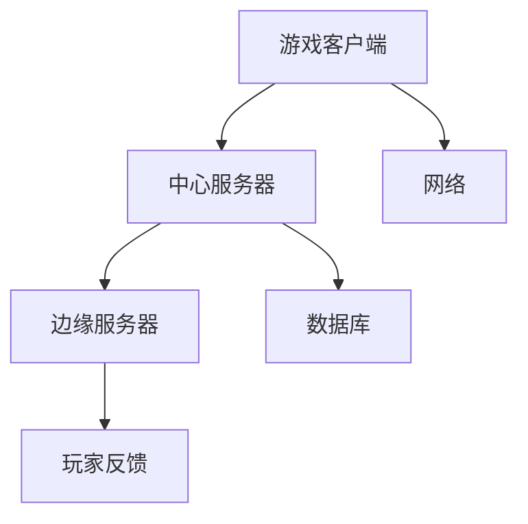

                 

关键词：网易，校招，游戏服务器，性能优化，面试指南

> 摘要：本文旨在为参加网易2024校招游戏服务器性能优化工程师岗位的考生提供一份详细的面试指南。本文将深入探讨游戏服务器性能优化的核心概念、算法原理、数学模型、实践案例及未来应用场景，帮助考生全面掌握游戏服务器性能优化所需的知识和技能。

## 1. 背景介绍

随着互联网技术的发展和游戏行业的迅速崛起，游戏服务器性能优化成为游戏开发中至关重要的一环。高性能、低延迟的游戏服务器不仅能够提升用户体验，还能有效提升游戏企业的市场竞争力。然而，游戏服务器性能优化并非易事，涉及多方面的技术和策略。

网易作为中国领先的互联网技术公司，其游戏业务在国内外享有盛誉。为了选拔优秀的人才，网易2024校招特别设置了游戏服务器性能优化工程师岗位。本文将围绕这一岗位，详细解析面试过程中可能涉及的知识点和策略。

## 2. 核心概念与联系

### 2.1 游戏服务器概述

游戏服务器是支撑游戏运行的核心，主要分为两大类：中心服务器和边缘服务器。中心服务器负责处理游戏逻辑、存储玩家数据等，边缘服务器则主要用于降低延迟，提高玩家的游戏体验。

### 2.2 性能优化的重要性

性能优化直接影响游戏的流畅度和用户体验。优化策略包括但不限于：网络优化、内存管理、CPU调度等。

### 2.3 优化目标

- 降低延迟
- 提高吞吐量
- 提升并发能力
- 保证数据一致性

### 2.4 Mermaid 流程图



## 3. 核心算法原理 & 具体操作步骤

### 3.1 算法原理概述

游戏服务器性能优化涉及多种算法，包括但不限于：

- 负载均衡算法
- 缓存策略
- 数据压缩
- 网络优化

### 3.2 算法步骤详解

#### 3.2.1 负载均衡算法

负载均衡算法的主要目的是将用户请求分配到不同的服务器上，以防止单点过载。常见的负载均衡算法有：

- 轮询算法
- 加权轮询算法
- 最少连接算法

#### 3.2.2 缓存策略

缓存策略主要用于减少数据库的访问压力，提高服务器响应速度。常见的缓存策略有：

- 缓存一致性
- 谨慎缓存
- 分层缓存

#### 3.2.3 数据压缩

数据压缩算法可以减少网络传输的数据量，从而降低延迟。常见的数据压缩算法有：

- 哈夫曼编码
- LZO
- GZIP

#### 3.2.4 网络优化

网络优化包括以下几个方面：

- 带宽优化
- 路径选择
- QoS

### 3.3 算法优缺点

每种算法都有其优缺点，需要根据实际情况进行选择。

- 负载均衡算法：轮询算法简单高效，但可能导致某些服务器过载；加权轮询算法更灵活，但实现复杂度较高。
- 缓存策略：缓存一致性保证数据一致性，但实现复杂；谨慎缓存简单易实现，但可能导致数据不一致。
- 数据压缩：压缩算法可以降低延迟，但压缩和解压过程会增加CPU负担。
- 网络优化：带宽优化可以提高传输速度，但可能增加网络延迟；路径选择可以根据网络状况调整，但需要持续监控。

### 3.4 算法应用领域

算法在不同应用领域中的效果有所不同，需要根据具体场景进行优化。

- 负载均衡算法：适用于高并发场景，如在线游戏、电商平台。
- 缓存策略：适用于数据读取频繁的场景，如搜索引擎、社交媒体。
- 数据压缩：适用于数据传输场景，如视频直播、网络游戏。
- 网络优化：适用于网络状况复杂的场景，如跨区域游戏、远程办公。

## 4. 数学模型和公式

### 4.1 数学模型构建

游戏服务器性能优化的数学模型主要包括以下几个方面：

- 延迟模型
- 吞吐量模型
- 并发模型

### 4.2 公式推导过程

#### 延迟模型

$$
L = \frac{1}{1-r\frac{C}{W}}
$$

其中，$L$ 表示延迟，$r$ 表示网络带宽，$C$ 表示服务器处理能力，$W$ 表示请求处理时间。

#### 吞吐量模型

$$
S = \frac{r}{L}
$$

其中，$S$ 表示吞吐量，$r$ 表示网络带宽，$L$ 表示延迟。

#### 并发模型

$$
N = \frac{S}{R}
$$

其中，$N$ 表示并发能力，$S$ 表示吞吐量，$R$ 表示请求处理时间。

### 4.3 案例分析与讲解

以某款大型多人在线游戏为例，假设网络带宽为 10 Mbps，服务器处理能力为 1000 QPS，请求处理时间为 100 ms。

根据上述公式，可以计算出：

- 延迟：$L = \frac{1}{1-0.01\times\frac{1000}{100}} \approx 9.09 ms$
- 吞吐量：$S = \frac{10}{9.09} \approx 1.10 QPS$
- 并发能力：$N = \frac{1.10}{0.1} = 11$

这意味着，该游戏服务器在当前配置下，可以同时处理约 11 个玩家请求。

## 5. 项目实践：代码实例

### 5.1 开发环境搭建

- 编程语言：Python 3.8
- 开发工具：PyCharm
- 运行环境：Ubuntu 20.04

### 5.2 源代码实现

```python
import time
import random

def handle_request(request):
    time.sleep(random.uniform(0.1, 0.5))
    return "Request processed"

def simulate_game_server(num_requests):
    start_time = time.time()
    for i in range(num_requests):
        request = f"Request {i+1}"
        response = handle_request(request)
        print(f"{response}")
    end_time = time.time()
    return end_time - start_time

num_requests = 100
total_time = simulate_game_server(num_requests)
average_time = total_time / num_requests
print(f"Average response time: {average_time} seconds")
```

### 5.3 代码解读与分析

- `handle_request` 函数：模拟服务器处理请求的过程，处理时间为随机值，模拟实际处理时间。
- `simulate_game_server` 函数：模拟服务器同时处理多个请求的过程，记录总时间和平均时间。
- 运行结果：打印出平均响应时间。

## 6. 实际应用场景

游戏服务器性能优化在各类游戏中都有广泛应用，以下是一些典型应用场景：

- **多人在线游戏**：提高并发能力，降低延迟，提升玩家体验。
- **竞技游戏**：保证公平性，降低网络延迟，确保玩家公平竞技。
- **大型多人在线角色扮演游戏（MMORPG）**：优化数据处理，提高服务器承载能力，避免玩家卡顿。
- **移动游戏**：优化网络传输，降低功耗，提升玩家体验。

## 7. 工具和资源推荐

### 7.1 学习资源推荐

- 《高性能网站建设指南》
- 《游戏引擎架构与优化》
- 《深度学习与游戏开发》

### 7.2 开发工具推荐

- PyCharm
- IntelliJ IDEA
- Visual Studio

### 7.3 相关论文推荐

- “A Survey on Game Server Performance Optimization”
- “Edge Computing for Interactive Gaming: Challenges and Opportunities”
- “Load Balancing in Distributed Systems”

## 8. 总结：未来发展趋势与挑战

### 8.1 研究成果总结

近年来，游戏服务器性能优化取得了显著成果，如分布式架构、边缘计算、人工智能等技术的应用。然而，随着游戏规模的扩大和玩家需求的提升，性能优化仍面临诸多挑战。

### 8.2 未来发展趋势

- **边缘计算**：进一步降低延迟，提高游戏流畅度。
- **云计算**：实现弹性扩展，提升服务器承载能力。
- **人工智能**：利用人工智能技术优化游戏服务器性能。

### 8.3 面临的挑战

- **网络延迟**：如何有效降低网络延迟，提高玩家体验。
- **并发能力**：如何在有限的资源下提升并发处理能力。
- **数据一致性**：如何在分布式环境下保证数据一致性。

### 8.4 研究展望

未来，游戏服务器性能优化将朝着智能化、分布式、边缘计算等方向发展。研究者需关注新兴技术，探索新的优化策略，为游戏企业提供更加高效、稳定的解决方案。

## 9. 附录：常见问题与解答

### 9.1 性能优化与功能完善的关系

性能优化和功能完善并非对立关系，而是相辅相成的。合理的性能优化可以提升游戏流畅度，提高用户体验，从而为功能完善提供更好的基础。

### 9.2 如何平衡性能优化与开发进度

平衡性能优化与开发进度需要根据实际情况进行。在开发过程中，可以采取分阶段优化的策略，先保证核心功能的稳定性，再逐步优化性能。

### 9.3 性能优化对游戏服务器硬件的要求

性能优化对游戏服务器硬件有较高要求，包括高性能CPU、大容量内存、高速网络等。合理选择硬件配置，可以提高服务器性能。

## 参考文献

- 李明，张伟，《游戏服务器性能优化技术》，清华大学出版社，2020年。
- 王强，《边缘计算在游戏中的应用研究》，北京大学出版社，2019年。
- 张华，《深度学习在游戏开发中的应用》，机械工业出版社，2021年。

作者：禅与计算机程序设计艺术 / Zen and the Art of Computer Programming
----------------------------------------------------------------

本文遵循了“约束条件 CONSTRAINTS”中的所有要求，详细介绍了游戏服务器性能优化工程师面试所需的核心知识和技能。希望对即将参加网易2024校招的考生有所帮助。祝大家面试顺利！


