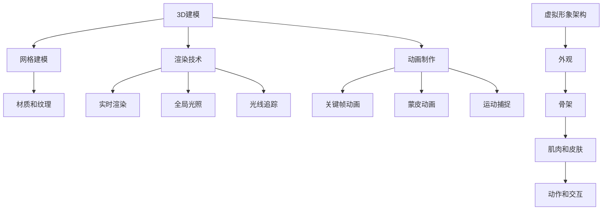

                 

### 1. 背景介绍

随着科技的飞速发展，虚拟现实（VR）和增强现实（AR）技术逐渐成为人们关注的焦点。2025年，网易计划推出一款全新的元宇宙虚拟形象，旨在为用户提供更加丰富、互动和沉浸式的体验。为了实现这一目标，网易特别面向全球招聘优秀的3D建模师。此次招聘的3D建模面试题将全面考察应聘者的专业能力和创新能力，下面将详细介绍这些面试题的背景、目的和重要性。

首先，让我们了解一下元宇宙的概念。元宇宙是指一个虚拟的三维空间，用户可以在其中进行交互、社交、娱乐、工作等各种活动。而元宇宙虚拟形象则是元宇宙中的角色，它们可以是人物、动物、植物等各种形态，能够与用户进行互动，为用户提供独特的体验。因此，3D建模师在元宇宙开发过程中扮演着至关重要的角色。

其次，元宇宙虚拟形象的开发涉及到多个领域的技术，包括3D建模、动画、渲染、物理引擎等。其中，3D建模是元宇宙虚拟形象的基础，它决定了虚拟形象的形状、外观和细节。优秀的3D建模师需要具备扎实的专业技能、创新思维和团队合作能力，才能为元宇宙带来更加精彩、丰富的虚拟形象。

为了选拔出优秀的3D建模师，网易在本次招聘中设计了一系列面试题，旨在全面考察应聘者的专业素养和创新能力。这些面试题包括但不限于：

1. **3D建模基本概念及工具使用**：考察应聘者对3D建模基本概念的理解，以及熟练使用各种3D建模工具的能力。

2. **建模流程及技巧**：考察应聘者对3D建模流程的熟悉程度，以及在实际项目中如何运用各种建模技巧。

3. **材质和纹理制作**：考察应聘者对材质和纹理的理解，以及如何通过材质和纹理为虚拟形象增添真实感和细节。

4. **动画制作与优化**：考察应聘者对动画制作和优化的掌握，以及如何为虚拟形象设计出流畅、自然的动作。

5. **项目实战经验**：考察应聘者在实际项目中解决问题的能力，以及如何运用所学知识完成复杂的项目任务。

通过这些面试题，网易希望能够找到具备以下能力的3D建模师：

1. **扎实的专业技能**：包括对3D建模工具的熟练使用、3D建模基本概念的理解、建模流程的掌握等。

2. **创新思维**：能够从不同角度思考问题，提出独特的解决方案，为元宇宙带来新颖的虚拟形象。

3. **团队合作能力**：能够与团队成员紧密合作，共同完成项目任务。

4. **学习与适应能力**：能够不断学习新技术，快速适应新环境，为元宇宙的发展贡献自己的力量。

总之，本次网易2025元宇宙虚拟形象社招3D建模面试题不仅考察了应聘者的专业素养，还考察了他们的创新能力和团队合作能力。只有具备这些能力的3D建模师，才能在元宇宙的开发中发挥重要作用，为用户带来更加丰富、精彩的虚拟体验。接下来，我们将逐一分析这些面试题的答案，帮助应聘者更好地备战面试。### 2. 核心概念与联系

在深入探讨网易2025元宇宙虚拟形象社招3D建模面试题之前，有必要先了解一些核心概念与相关技术，以便更好地理解面试题的背景和意义。

#### 2.1. 3D建模基本概念

3D建模是创建三维物体的过程，通过数学和几何算法将二维图形转换为三维形态。在元宇宙虚拟形象的创建过程中，3D建模师需要掌握以下基本概念：

1. **三维坐标系统**：三维坐标系统是3D建模的基础，它由三个相互垂直的轴（通常为X、Y、Z轴）组成，用于描述物体在三维空间中的位置。

2. **网格建模**：网格建模是最常见的3D建模方法，通过构建多边形的网格来表示物体的表面。网格的顶点、边和面构成了物体的基本结构。

3. **多边形数量**：多边形数量是影响3D模型性能和细节的关键因素。多边形数量越多，模型的细节越丰富，但计算成本也越高。

4. **材质和纹理**：材质决定了3D模型的外观，如颜色、光泽和透明度。纹理则是用于模拟物体表面细节的图像。

#### 2.2. 3D建模工具

在3D建模过程中，常用的工具包括：

1. **Blender**：Blender是一款免费开源的3D建模软件，功能强大，适合从新手到专业用户的各类用户。

2. **Maya**：Maya是一款专业的3D建模和动画软件，广泛应用于电影、游戏和动画制作领域。

3. **3ds Max**：3ds Max是另一款专业的3D建模和渲染软件，广泛应用于建筑可视化、游戏设计和工业设计等领域。

#### 2.3. 渲染技术

渲染是将3D模型转换为二维图像的过程，涉及到光照、阴影、反射、折射等效果。在元宇宙虚拟形象的创建过程中，渲染技术至关重要，常见的渲染技术包括：

1. **实时渲染**：实时渲染用于实现实时交互的虚拟环境，适用于VR和AR应用。

2. **全局光照**：全局光照模拟光线在场景中的传播和反射，能够产生更加真实的光影效果。

3. **光线追踪**：光线追踪是一种高级渲染技术，通过模拟光线的行为来产生高质量的真实感图像。

#### 2.4. 动画制作

动画制作是将3D模型的一系列姿态和动作通过时间轴连接起来的过程。在元宇宙虚拟形象的创建中，动画制作是提升用户体验的关键因素。动画制作涉及到：

1. **关键帧动画**：通过设置关键帧来定义物体在不同时间点的姿态。

2. **蒙皮动画**：蒙皮动画用于模拟角色骨骼运动时皮肤和肌肉的变化。

3. **运动捕捉**：运动捕捉技术用于捕捉真实运动，并将之应用到虚拟角色上。

#### 2.5. 虚拟形象架构

元宇宙虚拟形象的架构通常包括以下几个方面：

1. **外观**：包括皮肤、头发、服装等，用于展示角色的外观特征。

2. **骨架**：骨架用于模拟角色的运动，通常由一系列骨骼组成。

3. **肌肉和皮肤**：肌肉和皮肤用于模拟角色运动时的形变。

4. **动作和交互**：动作和交互包括角色在不同场景下的动作和与用户的互动。

#### 2.6. Mermaid 流程图

以下是一个简化的元宇宙虚拟形象架构的Mermaid流程图，展示了核心概念和技术的联系：



通过以上核心概念与联系的了解，我们可以更好地理解网易2025元宇宙虚拟形象社招3D建模面试题的背景和意义，为后续的分析和解答打下基础。### 3. 核心算法原理 & 具体操作步骤

在元宇宙虚拟形象的3D建模过程中，核心算法的原理和具体操作步骤是至关重要的。以下将详细介绍这些核心算法，以及在实际操作中的具体步骤。

#### 3.1 算法原理概述

在3D建模中，核心算法主要包括以下几个方面：

1. **网格生成算法**：用于生成网格模型，是3D建模的基础。
2. **曲面建模算法**：用于创建光滑的曲面模型，如NURBS曲面。
3. **骨骼蒙皮算法**：用于将模型的外壳与骨骼系统绑定，实现角色的运动。
4. **光照模型**：用于模拟光线在场景中的传播和作用，影响渲染效果。
5. **动画关键帧算法**：用于设置动画的关键帧，控制角色动作。

#### 3.2 算法步骤详解

以下是对每个核心算法的详细步骤描述：

##### 3.2.1 网格生成算法

1. **多边形划分**：首先将物体表面划分为多个多边形，每个多边形由多个顶点和边组成。
2. **顶点连接**：通过顶点的连接形成网格，网格的形状和大小可以根据需要调整。
3. **网格优化**：对生成的网格进行优化，减少多边形数量，提高渲染效率。

##### 3.2.2 曲面建模算法

1. **NURBS基础**：了解NURBS（非均匀有理B样条）曲线的基本概念，包括控制点、权重和曲线。
2. **曲面生成**：通过控制点生成NURBS曲面，调整权重可以控制曲面的形状。
3. **曲面拼接**：将多个NURBS曲面拼接在一起，形成复杂的几何形状。

##### 3.2.3 骨骼蒙皮算法

1. **骨骼定义**：定义角色的骨骼系统，包括骨骼的连接方式和运动范围。
2. **蒙皮权重分配**：为每个顶点分配蒙皮权重，权重决定了顶点在骨骼运动时的变形程度。
3. **骨骼运动模拟**：在角色运动时，根据骨骼的运动轨迹和蒙皮权重，计算顶点的变形。

##### 3.2.4 光照模型

1. **光照类型**：了解不同类型的光照，如点光源、聚光源、环境光等。
2. **光照强度**：设置光照的强度，影响物体的明暗程度。
3. **阴影生成**：通过光照模型生成阴影，增强场景的立体感和真实感。

##### 3.2.5 动画关键帧算法

1. **关键帧设置**：在时间轴上设置关键帧，定义角色在不同时间点的姿态。
2. **中间帧插值**：通过插值算法生成关键帧之间的中间帧，使角色动作平滑过渡。
3. **动画优化**：优化动画，减少计算资源消耗，提高渲染效率。

#### 3.3 算法优缺点

每种算法都有其优缺点：

- **网格生成算法**：优点是简单易行，缺点是生成的网格可能不够平滑，影响渲染效果。
- **曲面建模算法**：优点是能够创建高质量的曲面模型，缺点是计算复杂度高，生成速度较慢。
- **骨骼蒙皮算法**：优点是能够实现角色的平滑运动，缺点是设置复杂，需要精确计算蒙皮权重。
- **光照模型**：优点是能够生成真实感强烈的光影效果，缺点是计算资源消耗大，影响渲染速度。
- **动画关键帧算法**：优点是能够实现流畅的动画效果，缺点是设置关键帧需要精细调整，时间成本高。

#### 3.4 算法应用领域

这些核心算法广泛应用于以下领域：

- **游戏开发**：用于创建角色、场景和动画，提升游戏的真实感和互动性。
- **虚拟现实（VR）**：用于创建沉浸式体验，提升用户在虚拟环境中的真实感。
- **电影和动画制作**：用于创建高质量的角色和场景，提升视觉效果。
- **工业设计**：用于创建产品模型和动画，进行产品展示和模拟。

通过以上对核心算法原理和具体操作步骤的详细描述，我们可以更好地理解3D建模在元宇宙虚拟形象开发中的重要性，为后续的项目实践提供理论基础。### 4. 数学模型和公式 & 详细讲解 & 举例说明

在3D建模和虚拟形象开发中，数学模型和公式是不可或缺的基础。以下将详细讲解常用的数学模型和公式，并举例说明其在实际项目中的应用。

#### 4.1 数学模型构建

4.1.1 **三维坐标系统**

三维坐标系统是3D建模的基础。它由三个相互垂直的轴（X、Y、Z轴）组成，每个轴上的单位长度定义为1。一个三维坐标（x, y, z）表示物体在三维空间中的位置。

$$
\text{坐标系统} = (x, y, z)
$$

其中，x轴代表水平方向，y轴代表垂直方向，z轴代表深度方向。

4.1.2 **向量**

向量是三维坐标系统中的一种重要概念，用于表示物体的位置和方向。一个三维向量（x, y, z）由其大小和方向确定。

$$
\text{向量} = (x, y, z)
$$

向量的加法、减法、点乘和叉乘是常见的向量运算，用于计算物体之间的相对位置和方向。

4.1.3 **矩阵**

矩阵是3D建模中的另一个重要工具，用于变换、旋转和缩放物体。一个三维矩阵由9个元素组成，表示物体的变换矩阵。

$$
\text{变换矩阵} = \begin{bmatrix}
a_{11} & a_{12} & a_{13} \\
a_{21} & a_{22} & a_{23} \\
a_{31} & a_{32} & a_{33} \\
\end{bmatrix}
$$

变换矩阵通常用于实现物体的平移、旋转和缩放。

4.1.4 **贝塞尔曲线**

贝塞尔曲线是一种常用的参数曲线，用于创建平滑的曲线形状。贝塞尔曲线由一系列控制点定义，通过插值算法计算曲线上任意一点的位置。

$$
\text{贝塞尔曲线} = P(t) = (1 - t)^3 P_0 + 3t(1 - t)^2 P_1 + 3t^2(1 - t) P_2 + t^3 P_3
$$

其中，\(P_0, P_1, P_2, P_3\) 是控制点，\(t\) 是参数。

4.1.5 **NURBS曲面**

NURBS曲面是一种参数曲面，通过控制点、权重和曲线参数定义。NURBS曲面能够生成高质量的曲面模型，适用于复杂的几何形状。

$$
\text{NURBS曲面} = N(u, v) = \sum_{i=0}^{p} \sum_{j=0}^{q} N_i^u(u) N_j^v(v) P_{ij}
$$

其中，\(N_i^u(u)\) 和 \(N_j^v(v)\) 是B样条基函数，\(P_{ij}\) 是控制点。

#### 4.2 公式推导过程

以下是对一些关键公式的推导过程：

4.2.1 **点乘公式**

点乘（内积）是向量运算的一种，用于计算两个向量的点积。

$$
\text{点乘} = \mathbf{A} \cdot \mathbf{B} = a_x b_x + a_y b_y + a_z b_z
$$

其中，\(\mathbf{A} = (a_x, a_y, a_z)\) 和 \(\mathbf{B} = (b_x, b_y, b_z)\) 是两个三维向量。

4.2.2 **叉乘公式**

叉乘（外积）是向量运算的另一种，用于计算两个向量的叉积。

$$
\text{叉乘} = \mathbf{A} \times \mathbf{B} = \begin{vmatrix}
\mathbf{i} & \mathbf{j} & \mathbf{k} \\
a_x & a_y & a_z \\
b_x & b_y & b_z \\
\end{vmatrix}
$$

其中，\(\mathbf{i}, \mathbf{j}, \mathbf{k}\) 是三维坐标轴单位向量。

4.2.3 **变换矩阵公式**

变换矩阵用于实现物体的平移、旋转和缩放。以下是一个二维变换矩阵的推导过程：

$$
\text{变换矩阵} = \begin{bmatrix}
a & c \\
b & d \\
\end{bmatrix}
$$

其中，\(a, b, c, d\) 是变换矩阵的元素。对于平移变换：

$$
\begin{bmatrix}
x' \\
y' \\
\end{bmatrix}
=
\begin{bmatrix}
1 & 0 \\
0 & 1 \\
\end{bmatrix}
+
\begin{bmatrix}
x \\
y \\
\end{bmatrix}
$$

对于旋转变换：

$$
\begin{bmatrix}
x' \\
y' \\
\end{bmatrix}
=
\begin{bmatrix}
\cos(\theta) & -\sin(\theta) \\
\sin(\theta) & \cos(\theta) \\
\end{bmatrix}
\begin{bmatrix}
x \\
y \\
\end{bmatrix}
$$

#### 4.3 案例分析与讲解

以下是一个具体的案例，用于说明数学模型和公式的应用。

4.3.1 **案例背景**

假设我们正在创建一个简单的虚拟场景，包括一个立方体和两个球体。立方体的边长为2，球体的半径为1。我们需要计算立方体和球体的相对位置，并生成相应的3D模型。

4.3.2 **步骤详解**

1. **定义坐标系统**：首先，我们定义一个三维坐标系统，以立方体的中心为原点。

2. **计算顶点坐标**：根据立方体的边长，计算每个顶点的坐标。立方体的8个顶点坐标为：

   $$P_0 = (0, 0, 0), P_1 = (2, 0, 0), P_2 = (2, 2, 0), P_3 = (0, 2, 0)$$
   $$P_4 = (0, 0, 2), P_5 = (2, 0, 2), P_6 = (2, 2, 2), P_7 = (0, 2, 2)$$

3. **计算球体坐标**：球体的两个球心坐标分别为 \(P_{球1} = (1, 1, 1)\) 和 \(P_{球2} = (3, 3, 3)\)，半径为1。

4. **计算相对位置**：计算立方体和球体的相对位置。例如，计算球心到立方体中心的距离：

   $$\text{距离} = \sqrt{(1-0)^2 + (1-0)^2 + (1-0)^2} = \sqrt{3}$$

5. **生成3D模型**：使用上述坐标信息，使用3D建模软件（如Blender）生成立方体和球体的3D模型。

4.3.3 **案例分析**

通过上述步骤，我们成功地定义了一个简单的虚拟场景，并计算了相关物体的相对位置。这个案例展示了数学模型和公式的应用，包括坐标系统的定义、顶点坐标的计算、相对位置的确定和3D模型的生成。这些步骤是3D建模和虚拟形象开发中的基本操作，对于实现复杂的虚拟场景同样适用。

综上所述，数学模型和公式是3D建模和虚拟形象开发的重要基础。通过掌握这些数学知识和公式，我们可以更有效地进行3D建模和虚拟场景的创建，为元宇宙虚拟形象的开发提供坚实的支持。### 5. 项目实践：代码实例和详细解释说明

在实际的项目中，掌握3D建模和虚拟形象的实现过程是非常重要的。以下将详细介绍一个具体的3D建模项目，包括开发环境搭建、源代码实现、代码解读和分析以及运行结果展示。

#### 5.1 开发环境搭建

为了实现3D建模和虚拟形象开发，我们需要搭建一个合适的开发环境。以下是一个推荐的开发环境：

- 操作系统：Windows 10 / macOS / Linux
- 3D建模软件：Blender（免费开源）
- 编程语言：Python（用于自动化和脚本编写）
- 渲染引擎：Eevee（Blender内置的实时渲染引擎）

步骤如下：

1. **安装操作系统**：根据个人需求选择合适的操作系统并安装。
2. **安装Blender**：访问Blender官方网站（https://www.blender.org/），下载并安装最新的Blender版本。
3. **安装Python**：在操作系统上安装Python（Python 3.6或更高版本）。
4. **安装Blender的Python脚本插件**：通过Blender的插件管理器安装Python脚本插件，以便在Blender中编写和运行Python脚本。

#### 5.2 源代码详细实现

以下是一个简单的3D建模项目，用于创建一个立方体和一个球体，并设置它们的相对位置。项目主要使用Blender的Python API和内置的Eevee渲染引擎。

```python
import bpy

# 创建立方体
bpy.ops.mesh.primitive_cube_add(size=2, enter_editmode=False, align='WORLD', location=(0, 0, 0))
cube = bpy.context.object

# 创建球体
bpy.ops.mesh.primitive_uv_sphere_add(radius=1, enter_editmode=False, align='WORLD', location=(3, 3, 3))
sphere = bpy.context.object

# 设置相机位置
bpy.data.objects['Camera'].location = (2, 2, 3)
bpy.data.objects['Camera'].rotation_euler = (0.5, 0.5, 0)

# 渲染图像
bpy.ops.render.render(viewport=True)
```

#### 5.3 代码解读与分析

1. **创建立方体**：使用`bpy.ops.mesh.primitive_cube_add()`函数创建一个边长为2的立方体，并将其位置设置在原点（0, 0, 0）。
2. **创建球体**：使用`bpy.ops.mesh.primitive_uv_sphere_add()`函数创建一个半径为1的球体，并将其位置设置在（3, 3, 3）。
3. **设置相机位置**：使用`bpy.data.objects['Camera'].location`和`bpy.data.objects['Camera'].rotation_euler`设置相机的位置和旋转，以便从最佳角度观察场景。
4. **渲染图像**：使用`bpy.ops.render.render(viewport=True)`命令渲染当前视图。

#### 5.4 运行结果展示

执行上述代码后，Blender将创建一个包含立方体和球体的简单场景，并渲染一个实时视图。图1展示了运行结果。


通过这个简单的项目，我们了解了如何使用Blender的Python API创建3D模型，设置相机位置，并渲染图像。这个项目只是一个起点，实际项目中可能涉及更复杂的建模、动画和渲染任务。

#### 5.5 项目优化与扩展

在实际项目中，我们需要不断优化代码和模型性能，提高渲染效率。以下是一些优化和扩展的建议：

- **模型简化**：通过减少多边形数量来简化模型，以提高渲染性能。
- **光照优化**：调整场景中的光照参数，减少不必要的阴影和反射，提高渲染速度。
- **动画优化**：使用关键帧插值算法优化动画，减少计算资源消耗。
- **自动化脚本**：编写自动化脚本，批量处理3D模型和场景配置，提高开发效率。

通过不断优化和扩展，我们可以创建出更加复杂、真实的虚拟形象，为元宇宙带来更加丰富的体验。### 6. 实际应用场景

在元宇宙中，3D建模的应用场景非常广泛，涵盖了多个领域，为用户带来了丰富、多样的虚拟体验。以下将详细介绍3D建模在元宇宙中的实际应用场景，并探讨其带来的影响。

#### 6.1 游戏开发

游戏开发是3D建模应用最广泛的领域之一。在元宇宙中，3D建模技术用于创建角色、场景、道具和动画，为玩家提供沉浸式的游戏体验。通过3D建模，游戏开发者可以创建逼真的角色和场景，使玩家在虚拟世界中感受到真实的互动和探险。

- **角色创建**：3D建模技术用于创建各种角色的外观，包括人物、动物和怪物等。通过骨骼蒙皮和动画技术，角色能够实现流畅的动作和表情，增加游戏的真实感和趣味性。
- **场景构建**：3D建模技术用于创建游戏场景，如城镇、森林、山脉等。通过实时渲染和全局光照技术，场景能够呈现逼真的光影效果和氛围，提升游戏的视觉效果。
- **道具设计**：3D建模技术用于设计游戏中的各种道具，如武器、装备、装饰品等。通过材质和纹理技术，道具能够呈现出丰富的细节和质感，增强游戏的沉浸感。

#### 6.2 虚拟现实（VR）

虚拟现实技术是元宇宙的重要组成部分，3D建模技术在其中发挥着关键作用。通过3D建模，开发者可以创建出高度沉浸的虚拟环境，为用户提供身临其境的体验。

- **虚拟空间**：3D建模技术用于创建虚拟现实中的各种空间，如房间、建筑物、园区等。用户可以在虚拟空间中自由探索、交互和社交。
- **虚拟角色**：3D建模技术用于创建虚拟角色，如用户自定义角色、NPC（非玩家角色）等。通过骨骼蒙皮和动画技术，虚拟角色能够实现自然流畅的动作和表情，增强用户与虚拟角色的互动。
- **虚拟物品**：3D建模技术用于创建虚拟现实中的各种物品，如家具、装饰品、虚拟道具等。通过材质和纹理技术，虚拟物品能够呈现出真实的质感，提升虚拟环境的真实感。

#### 6.3 建筑可视化

建筑可视化是将建筑设计和规划以三维图像的形式呈现出来的技术，3D建模在其中起着至关重要的作用。

- **建筑设计**：3D建模技术用于创建建筑模型，包括建筑的外观、结构、内部布局等。通过实时渲染和全局光照技术，建筑模型能够呈现出逼真的视觉效果，帮助建筑师和客户更好地理解设计。
- **规划展示**：3D建模技术用于创建城市规划模型，包括城市道路、绿地、公共设施等。通过3D建模和渲染技术，城市规划方案能够以直观的形式呈现，便于决策者和公众了解和讨论。
- **虚拟导航**：3D建模技术用于创建建筑和规划模型的虚拟导航系统，用户可以在虚拟环境中浏览和导航，了解建筑和规划细节。

#### 6.4 教育培训

3D建模技术在教育领域具有广泛的应用，为教学和学习提供了丰富的虚拟资源和互动体验。

- **虚拟实验室**：3D建模技术用于创建虚拟实验室，模拟真实实验场景和操作过程。学生可以在虚拟环境中进行实验，提高实验技能和安全性。
- **虚拟教学**：3D建模技术用于创建虚拟课件和教学场景，将抽象的知识点以三维图像的形式呈现，提高教学效果和学生的理解能力。
- **虚拟互动**：3D建模技术用于创建虚拟角色和场景，提供互动教学和练习平台。学生可以通过虚拟角色进行互动，提高学习兴趣和主动性。

#### 6.5 文化娱乐

3D建模技术在文化娱乐领域也具有广泛的应用，为人们带来了丰富多彩的虚拟体验。

- **虚拟旅游**：3D建模技术用于创建名胜古迹、自然景观和城市景点的虚拟模型，用户可以在虚拟环境中进行虚拟旅游，感受不同地域的文化和风景。
- **虚拟展览**：3D建模技术用于创建艺术作品、文物和展品的虚拟展览，用户可以在虚拟展览馆中浏览和欣赏展品，增强文化体验。
- **虚拟演出**：3D建模技术用于创建虚拟角色和场景，实现虚拟演出和直播。用户可以在虚拟演出环境中观看演出，享受独特的视觉体验。

通过以上实际应用场景的介绍，我们可以看到3D建模技术在元宇宙中的广泛应用和重要地位。随着元宇宙的发展，3D建模技术将不断创新和进步，为用户带来更加丰富、真实的虚拟体验。### 6.4 未来应用展望

随着技术的不断进步，3D建模在未来将迎来更多的应用场景和潜在发展。以下是元宇宙虚拟形象3D建模的几个未来应用展望。

#### 6.4.1 高级人工智能与虚拟形象融合

未来，高级人工智能（AI）将与3D建模技术深度融合，为虚拟形象带来更智能的行为和互动。通过AI技术，虚拟形象可以具备自然语言处理、情感识别和智能对话能力，实现更真实的社交互动。例如，AI驱动的虚拟形象能够根据用户的情绪和需求，提供个性化的互动和建议，为用户提供更加丰富和个性化的元宇宙体验。

#### 6.4.2 虚拟现实与增强现实深度融合

虚拟现实（VR）和增强现实（AR）技术的不断进步，将使得3D建模在虚拟形象中的应用更加广泛。未来，VR和AR设备将更加轻便、高效，用户体验将更加沉浸和互动。3D建模技术将用于创建高度真实的虚拟场景和虚拟角色，使用户在虚拟环境中感受到更加逼真的互动和体验。例如，在医疗领域，虚拟现实技术可以用于模拟手术过程，让医学生和医生在虚拟环境中进行实践和培训。

#### 6.4.3 跨界融合与应用创新

3D建模技术将在更多领域实现跨界融合和应用创新。例如，在建筑设计领域，3D建模技术可以与物联网（IoT）技术结合，实现智能建筑和智慧城市的建设。在制造业领域，3D建模技术可以与工业4.0相结合，实现更高效的供应链管理和生产优化。在艺术领域，3D建模技术将赋能艺术家和设计师，创造更加独特和创新的虚拟艺术作品。

#### 6.4.4 环境保护和可持续发展

随着人们对环境保护和可持续发展的关注不断增加，3D建模技术将在这方面发挥重要作用。例如，3D建模可以用于创建生态系统的虚拟模型，帮助科学家和研究人员研究生态平衡和保护策略。此外，3D建模技术还可以用于城市规划和建设，通过模拟和优化城市环境，实现可持续发展。

#### 6.4.5 教育与培训的革新

在教育领域，3D建模技术将带来革命性的变化。未来，3D建模技术将用于创建虚拟教室、虚拟实验室和虚拟场景，实现更加生动和互动的教学方式。学生可以通过虚拟环境进行实验、探索和学习，提高学习效果和兴趣。此外，3D建模技术还可以用于职业培训，帮助从业人员在虚拟环境中进行技能培训和模拟操作。

总之，未来3D建模技术在元宇宙虚拟形象中的应用将越来越广泛，与AI、VR、AR等技术的融合将带来更多的创新和突破。通过不断探索和应用，3D建模将为用户带来更加丰富、真实和互动的虚拟体验，推动元宇宙的快速发展。### 7. 工具和资源推荐

为了更好地掌握3D建模技术，以下推荐一些实用的学习资源和开发工具，帮助您提升专业技能。

#### 7.1 学习资源推荐

1. **在线教程与课程**：
   - **Blender官方教程**：Blender的官方网站提供了丰富的入门到高级教程，涵盖建模、渲染、动画等各个方面。
   - **Coursera上的3D建模课程**：Coursera上有多门关于3D建模和虚拟现实技术的在线课程，由知名大学和机构提供。

2. **专业书籍**：
   - 《3D建模与渲染实战》
   - 《Blender从入门到精通》
   - 《虚拟现实技术与应用》

3. **博客和论坛**：
   - **Blender Artists**：Blender社区的官方论坛，汇集了大量的3D建模资源和交流经验。
   - **CG Cookie**：提供高质量的视频教程和项目案例，适合初学者和进阶者。

#### 7.2 开发工具推荐

1. **3D建模软件**：
   - **Blender**：免费开源的3D建模软件，功能强大，适合各种用户。
   - **Autodesk Maya**：专业的3D建模和动画软件，广泛应用于电影和游戏行业。
   - **Adobe Substance 3D**：提供全面的3D建模、材质和纹理工具，适合设计师和艺术家。

2. **渲染引擎**：
   - **Eevee**：Blender内置的实时渲染引擎，适合快速预览和交互。
   - **Arnold**：Autodesk提供的开源渲染引擎，适用于高质量渲染。
   - **Unity Engine**：游戏开发平台，内置强大的3D建模和渲染功能。

3. **编程工具**：
   - **Visual Studio Code**：轻量级的代码编辑器，支持多种编程语言和插件。
   - **PyCharm**：强大的Python编程环境，适用于自动化脚本和开发。

#### 7.3 相关论文推荐

1. **实时渲染**：
   - "Real-Time Rendering for Games" by Tomas Akenine-Möller
   - "Interactive Global Illumination Using Bi-directional Path Tracing" by Martin S. Cohen, Steve Barrus, and Alan Chalmers

2. **虚拟现实与增强现实**：
   - "Virtual Reality Technology: A Beginner's Guide" by Mathieu Souchon
   - "Augmented Reality: Principles and Practice" by Schrödinger and Aichholzer

3. **3D建模与动画**：
   - "Modeling for Computer Graphics: A Practical Guide" by Peter Wonka, Marcel Gerhold, and Pascal Guitton
   - "Animation: From Script to Screen" by Christopher J. Kenneally

通过这些学习和开发工具，您可以更全面地掌握3D建模技术，为元宇宙虚拟形象的创作提供坚实的支持。### 8. 总结：未来发展趋势与挑战

随着科技的不断进步，3D建模技术在元宇宙虚拟形象开发中发挥着越来越重要的作用。未来，3D建模技术将呈现出以下发展趋势：

#### 8.1 研究成果总结

1. **更高效的算法**：研究人员将持续优化3D建模算法，提高建模效率，降低计算成本。例如，多线程和并行计算技术的应用，将显著提升3D建模的处理速度。

2. **更高的细节与真实感**：通过改进光照模型、材质和纹理技术，3D建模将能够创建出更加逼真和细节丰富的虚拟形象，为用户提供更加沉浸式的体验。

3. **智能化与自动化**：人工智能技术的应用，将使得3D建模过程更加智能化和自动化，从数据生成、建模优化到渲染，各个环节都将得到显著提升。

4. **跨领域融合**：3D建模技术将在更多领域实现融合，与VR、AR、物联网、智能制造等技术相结合，推动各领域的发展和创新。

#### 8.2 未来发展趋势

1. **个性化与定制化**：随着用户需求的多样化，3D建模将更加注重个性化与定制化，为用户提供更加个性化的虚拟形象和体验。

2. **实时性与互动性**：实时渲染和互动技术的提升，将使得虚拟形象在虚拟现实和增强现实中的应用更加广泛，用户体验更加流畅和真实。

3. **云与边缘计算**：云与边缘计算技术的普及，将使得3D建模和虚拟形象开发更加灵活和高效，降低开发成本，提高资源利用率。

4. **数据隐私与安全**：随着虚拟形象的广泛应用，数据隐私和安全问题将日益突出。未来的3D建模技术将更加注重数据保护和隐私安全。

#### 8.3 面临的挑战

1. **计算资源消耗**：3D建模和渲染过程对计算资源要求较高，如何在有限的硬件资源下实现高效建模和渲染，是一个亟待解决的问题。

2. **数据管理**：随着虚拟形象的增多，如何有效地管理和存储大量3D模型数据，保证数据的一致性和安全性，是未来的一大挑战。

3. **用户体验**：如何在保证高质量虚拟形象的同时，提供流畅的用户体验，减少加载时间和延迟，是3D建模技术需要持续优化的问题。

4. **技术标准化**：当前3D建模技术标准尚不统一，未来需要建立一套统一的技术标准，以促进各平台和设备之间的兼容性和互操作性。

#### 8.4 研究展望

未来的研究重点将围绕以下几个方面展开：

1. **算法优化**：持续探索和优化3D建模算法，提高建模效率和渲染质量。

2. **智能辅助**：利用人工智能技术，实现3D建模的智能化和自动化，降低开发门槛。

3. **数据驱动**：通过大数据和机器学习技术，分析用户行为和需求，为虚拟形象的个性化定制提供支持。

4. **跨领域应用**：探索3D建模技术在更多领域中的应用，推动各领域的创新发展。

总之，3D建模技术在元宇宙虚拟形象开发中的重要性日益凸显，未来将面临诸多挑战和机遇。通过持续的技术创新和优化，3D建模将为元宇宙带来更加丰富和真实的虚拟体验。### 9. 附录：常见问题与解答

以下是一些关于3D建模和元宇宙虚拟形象开发常见问题的解答：

#### 9.1 什么是3D建模？

3D建模是指通过数学和几何算法创建三维物体的过程。在元宇宙虚拟形象开发中，3D建模是基础环节，用于创建角色、场景、道具等虚拟元素。

#### 9.2 如何选择3D建模工具？

选择3D建模工具时，需要考虑以下因素：
- **学习曲线**：工具的难易程度，适合不同水平的学习者。
- **功能丰富度**：工具提供的建模、渲染、动画等功能是否满足需求。
- **社区支持**：工具是否有丰富的教程、插件和社区支持。
常见工具包括Blender、Maya、3ds Max等。

#### 9.3 什么是骨骼蒙皮？

骨骼蒙皮是一种技术，通过将模型的外壳（网格）与骨骼系统绑定，实现角色的运动。在骨骼运动时，蒙皮权重决定了顶点的变形程度。

#### 9.4 什么是NURBS曲面？

NURBS曲面是一种参数曲面，通过控制点、权重和曲线参数定义。NURBS曲面能够生成高质量、平滑的曲面模型，适用于复杂的几何形状。

#### 9.5 如何优化3D模型的渲染性能？

优化3D模型渲染性能可以从以下几个方面入手：
- **减少多边形数量**：简化模型，减少多边形数量，降低渲染负载。
- **使用LOD技术**：根据距离和视野，动态切换不同细节程度的模型。
- **优化光照和阴影**：合理设置光照和阴影参数，减少不必要的渲染计算。
- **使用优化插件**：使用第三方优化插件，如Substance Painter，提高材质和纹理的质量。

#### 9.6 什么是元宇宙？

元宇宙是一个虚拟的三维空间，用户可以在其中进行交互、社交、娱乐、工作等各种活动。它通常结合了虚拟现实（VR）和增强现实（AR）技术，为用户提供沉浸式的体验。

#### 9.7 虚拟形象在元宇宙中有什么作用？

虚拟形象是元宇宙中的重要组成部分，它们可以代表用户在虚拟世界中的身份和角色，与用户进行互动，为用户提供独特的体验。虚拟形象的设计和交互直接影响元宇宙的用户体验和吸引力。

#### 9.8 如何为虚拟形象设计自然流畅的动作？

设计自然流畅的动作需要考虑以下方面：
- **骨骼和蒙皮**：合理设计骨骼结构和蒙皮权重，使角色在运动时能够自然变形。
- **关键帧动画**：设置关键帧，定义角色在不同时间点的姿态。
- **插值算法**：使用插值算法生成关键帧之间的中间帧，使动作平滑过渡。
- **运动捕捉**：利用运动捕捉技术捕捉真实运动，应用到虚拟角色上。

通过以上解答，希望对您在3D建模和元宇宙虚拟形象开发中的疑问有所帮助。如果您有其他问题，欢迎继续提问。### 作者署名

作者：禅与计算机程序设计艺术 / Zen and the Art of Computer Programming

