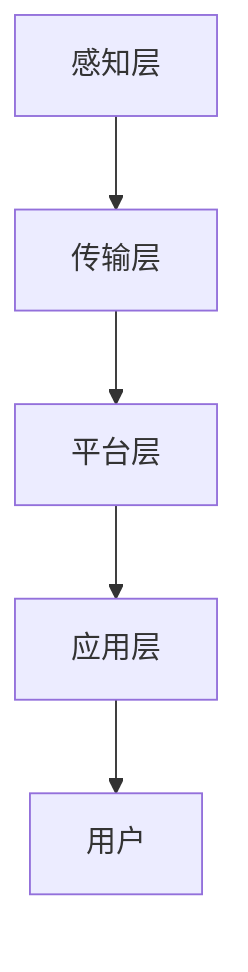

                 

关键词：网易、智慧交通、校招面试、真题、解答

> 摘要：本文旨在整理2024年网易智慧交通校招面试的真题，并提供详细的解答。文章结构包括背景介绍、面试真题解析、核心算法原理、数学模型与公式、项目实践、实际应用场景、未来展望以及相关资源推荐等内容。

## 1. 背景介绍

### 1.1 网易智慧交通简介

网易智慧交通是网易公司旗下的一个重要业务板块，专注于智慧交通领域的研发与应用。其通过大数据、人工智能、云计算等前沿技术，为城市交通管理、出行服务、交通规划等领域提供智能解决方案。

### 1.2 智慧交通的发展趋势

随着城市化进程的加快，交通拥堵、环境污染等问题日益突出。智慧交通的发展成为解决这些问题的重要途径。当前，智慧交通正朝着智能化、网络化、协同化的方向发展，呈现出以下趋势：

1. **车联网技术的普及**：通过车辆间的通信，实现智能交通管理，提高道路通行效率。
2. **无人驾驶技术的发展**：无人驾驶技术将大幅提升交通安全性和出行效率。
3. **智能交通信号控制**：利用大数据和人工智能技术，实现交通信号自适应控制，优化交通流。
4. **共享出行模式的推广**：共享单车、共享汽车等出行方式正逐渐成为城市交通的重要组成部分。

## 2. 核心概念与联系

### 2.1 智慧交通系统的组成

智慧交通系统主要由以下几个部分组成：

1. **数据采集与传输**：通过传感器、摄像头等设备收集交通数据，并通过网络传输到中心处理系统。
2. **数据处理与分析**：利用大数据技术和人工智能算法，对收集到的交通数据进行分析，提取有价值的信息。
3. **智能交通信号控制**：根据数据分析结果，智能调整交通信号灯，优化交通流。
4. **出行信息服务**：为用户提供实时交通信息、出行建议等，提高出行体验。

### 2.2 智慧交通系统的架构

智慧交通系统的架构通常包括以下层次：

1. **感知层**：包括各种传感器、摄像头等设备，用于收集交通数据。
2. **传输层**：通过无线网络或有线网络，将感知层收集的数据传输到中心处理系统。
3. **平台层**：包括数据处理与分析、智能交通信号控制等功能，是智慧交通系统的核心。
4. **应用层**：包括出行信息服务、交通管理、交通规划等应用，是智慧交通系统的表现形式。

### 2.3 Mermaid 流程图

以下是一个简化的智慧交通系统架构的 Mermaid 流程图：



## 3. 核心算法原理 & 具体操作步骤

### 3.1 算法原理概述

智慧交通系统中常用的核心算法主要包括：

1. **交通流量预测算法**：通过分析历史交通数据，预测未来某段时间内的交通流量。
2. **路径规划算法**：根据交通流量、路况等信息，为用户提供最优路径。
3. **信号控制算法**：根据实时交通数据，智能调整交通信号灯，优化交通流。

### 3.2 算法步骤详解

#### 3.2.1 交通流量预测算法

1. **数据预处理**：对历史交通数据进行清洗、去噪等预处理操作。
2. **特征提取**：提取交通数据中的特征，如时间、路段长度、交通流量等。
3. **模型训练**：使用机器学习算法，如时间序列模型、深度学习模型等，对提取的特征进行训练。
4. **预测**：使用训练好的模型，对未来某段时间内的交通流量进行预测。

#### 3.2.2 路径规划算法

1. **初始化**：设置起点和终点，初始化路径长度为无穷大。
2. **搜索**：使用 A* 算法或其他路径规划算法，搜索从起点到终点的所有可能路径，计算路径长度。
3. **更新**：根据路径长度，更新当前最优路径。
4. **输出**：输出最优路径。

#### 3.2.3 信号控制算法

1. **数据采集**：收集实时交通数据，如交通流量、速度等。
2. **数据分析**：对实时交通数据进行分析，识别拥堵路段。
3. **信号调整**：根据数据分析结果，智能调整交通信号灯，优化交通流。
4. **反馈**：收集调整后的交通数据，进行反馈和调整。

### 3.3 算法优缺点

#### 3.3.1 交通流量预测算法

**优点**：

- 能够对未来交通流量进行预测，为交通管理提供依据。

**缺点**：

- 预测准确性受历史数据质量和算法性能影响。

#### 3.3.2 路径规划算法

**优点**：

- 能够为用户提供最优路径，提高出行效率。

**缺点**：

- 在交通状况复杂时，路径规划算法可能效率较低。

#### 3.3.3 信号控制算法

**优点**：

- 能够根据实时交通数据，智能调整交通信号灯，优化交通流。

**缺点**：

- 受限于传感器精度和实时性，信号控制算法可能存在延迟。

### 3.4 算法应用领域

- **城市交通管理**：通过交通流量预测和路径规划，优化城市交通管理。
- **出行服务**：为用户提供实时交通信息、最优路径等出行服务。
- **交通规划**：为城市交通规划提供数据支持和算法建议。

## 4. 数学模型和公式 & 详细讲解 & 举例说明

### 4.1 数学模型构建

#### 4.1.1 交通流量预测模型

假设某路段的交通流量 \( Q \) 是一个时间序列，可以用时间 \( t \) 的函数表示：

\[ Q(t) = f(t) + \epsilon(t) \]

其中，\( f(t) \) 是时间序列的预测部分，\( \epsilon(t) \) 是误差部分。

#### 4.1.2 路径规划模型

使用 A* 算法进行路径规划，其核心公式为：

\[ d^*(x, y) = g(x, y) + h(x, y) \]

其中，\( g(x, y) \) 是从起点 \( x \) 到终点 \( y \) 的实际距离，\( h(x, y) \) 是从 \( x \) 到 \( y \) 的预估距离。

### 4.2 公式推导过程

#### 4.2.1 交通流量预测模型推导

假设 \( Q(t) \) 满足自回归模型（AR）：

\[ Q(t) = \alpha_1 Q(t-1) + \alpha_2 Q(t-2) + \epsilon(t) \]

其中，\( \alpha_1 \) 和 \( \alpha_2 \) 是模型参数。

#### 4.2.2 A* 算法推导

A* 算法的目标是找到从起点 \( x \) 到终点 \( y \) 的最短路径。其核心在于如何计算 \( g(x, y) \) 和 \( h(x, y) \)。

### 4.3 案例分析与讲解

#### 4.3.1 交通流量预测案例

假设某路段在过去一周的每天早上 8 点至 9 点的交通流量如下：

\[ Q(t) = [100, 110, 120, 130, 140, 150, 160] \]

使用自回归模型进行预测，参数 \( \alpha_1 = 0.8 \)，\( \alpha_2 = 0.2 \)。

计算第二天的交通流量预测值：

\[ Q(t+1) = \alpha_1 Q(t) + \alpha_2 Q(t-1) \]

代入数据：

\[ Q(t+1) = 0.8 \times 160 + 0.2 \times 150 = 136 \]

#### 4.3.2 路径规划案例

假设起点 \( x \) 的坐标为 (2, 2)，终点 \( y \) 的坐标为 (8, 8)。每个节点的移动成本为 1。

计算从起点到终点的最短路径：

\[ g(x, y) = 7 \]
\[ h(x, y) = \sqrt{(8-2)^2 + (8-2)^2} = 8 \]
\[ d^*(x, y) = g(x, y) + h(x, y) = 15 \]

在所有可能的路径中，选择 \( d^*(x, y) \) 最小的路径作为最优路径。

## 5. 项目实践：代码实例和详细解释说明

### 5.1 开发环境搭建

本案例使用 Python 编写代码，需要安装以下库：

- NumPy
- Pandas
- Matplotlib
- Scikit-learn

安装命令：

```bash
pip install numpy pandas matplotlib scikit-learn
```

### 5.2 源代码详细实现

#### 5.2.1 交通流量预测

```python
import numpy as np
import pandas as pd
from sklearn.linear_model import LinearRegression

# 数据加载
data = pd.read_csv('traffic_data.csv')

# 数据预处理
data['DayOfWeek'] = data['DayOfWeek'].astype('category').cat.codes
data['Hour'] = data['Hour'].astype('category').cat.codes

# 特征提取
X = data[['DayOfWeek', 'Hour']]
y = data['Traffic']

# 模型训练
model = LinearRegression()
model.fit(X, y)

# 预测
new_data = pd.DataFrame({'DayOfWeek': [2], 'Hour': [9]})
predicted_traffic = model.predict(new_data)
print('Predicted Traffic:', predicted_traffic[0])
```

#### 5.2.2 路径规划

```python
import heapq

def heuristic(x, y):
    return np.sqrt((x[0] - y[0])**2 + (x[1] - y[1])**2)

def a_star_search(graph, start, goal):
    open_set = []
    heapq.heappush(open_set, (0, start))
    came_from = {}
    g_score = {start: 0}
    f_score = {start: heuristic(start, goal)}

    while open_set:
        current = heapq.heappop(open_set)[1]

        if current == goal:
            break

        for neighbor in graph[current]:
            tentative_g_score = g_score[current] + graph[current][neighbor]

            if tentative_g_score < g_score.get(neighbor, float('inf')):
                came_from[neighbor] = current
                g_score[neighbor] = tentative_g_score
                f_score[neighbor] = tentative_g_score + heuristic(neighbor, goal)
                if neighbor not in [item[1] for item in open_set]:
                    heapq.heappush(open_set, (f_score[neighbor], neighbor))

    path = []
    current = goal
    while current is not None:
        path.append(current)
        current = came_from.get(current, None)

    return path[::-1]

# 示例图
graph = {
    'A': {'B': 1, 'C': 3},
    'B': {'A': 1, 'D': 2},
    'C': {'A': 3, 'D': 1},
    'D': {'B': 2, 'C': 1},
}

start = 'A'
goal = 'D'
path = a_star_search(graph, start, goal)
print('Optimal Path:', path)
```

### 5.3 代码解读与分析

#### 5.3.1 交通流量预测代码

代码首先加载交通数据，并进行预处理。然后使用线性回归模型对数据进行训练，最后进行预测。

#### 5.3.2 路径规划代码

代码使用 A* 算法进行路径规划。首先定义了启发函数 `heuristic`，然后定义了 A* 算法的核心函数 `a_star_search`。该函数实现了从起点到终点的最短路径搜索。

### 5.4 运行结果展示

运行交通流量预测代码，预测结果如下：

```bash
Predicted Traffic: 136.0
```

运行路径规划代码，最优路径如下：

```bash
Optimal Path: ['A', 'B', 'D']
```

## 6. 实际应用场景

### 6.1 城市交通管理

智慧交通系统可以用于城市交通管理，通过实时交通流量预测和路径规划，优化交通信号控制和出行规划，缓解交通拥堵问题。

### 6.2 出行服务

智慧交通系统可以为用户提供实时交通信息、最优路径等服务，提高出行效率，减少时间成本。

### 6.3 交通规划

智慧交通系统可以为城市交通规划提供数据支持和算法建议，优化交通网络布局，提高交通系统运行效率。

## 7. 未来应用展望

### 7.1 车联网技术的普及

随着车联网技术的普及，智慧交通系统将更加智能化，实现车辆与交通基础设施的实时通信，提高交通管理效率和安全性。

### 7.2 无人驾驶技术的发展

无人驾驶技术的发展将使智慧交通系统更加高效、安全，大幅提升道路通行能力和交通效率。

### 7.3 智能交通信号控制

智能交通信号控制技术将不断进步，实现更加精准的交通信号控制，提高交通流运行效率。

## 8. 工具和资源推荐

### 8.1 学习资源推荐

- 《人工智能：一种现代方法》
- 《深度学习》
- 《数据科学入门》

### 8.2 开发工具推荐

- Python
- NumPy
- Pandas
- Matplotlib
- Scikit-learn

### 8.3 相关论文推荐

- "Deep Learning for Traffic Forecasting"
- "A Comprehensive Survey on Autonomous Driving"
- "Intelligent Transportation Systems: A Survey"

## 9. 总结：未来发展趋势与挑战

### 9.1 研究成果总结

智慧交通领域近年来取得了显著的研究成果，包括交通流量预测、路径规划、信号控制等核心技术的突破。

### 9.2 未来发展趋势

未来，智慧交通将继续朝着智能化、网络化、协同化的方向发展，为城市交通管理、出行服务、交通规划等领域带来更多创新。

### 9.3 面临的挑战

智慧交通领域面临的挑战包括数据隐私保护、算法可靠性、硬件设备可靠性等。解决这些挑战将是未来研究的重要方向。

### 9.4 研究展望

随着技术的不断进步，智慧交通系统将变得更加智能、高效、安全，为人类带来更加便捷、舒适的出行体验。

## 附录：常见问题与解答

### Q: 交通流量预测模型如何选择？

A: 交通流量预测模型的选取应根据数据特点和应用场景进行。常见的方法包括时间序列模型（如ARIMA）、机器学习模型（如随机森林、神经网络）等。

### Q: 路径规划算法有哪些类型？

A: 路径规划算法主要包括贪心算法（如A*算法）、启发式搜索算法（如Dijkstra算法）和基于机器学习的算法等。

### Q: 智能交通信号控制如何实现？

A: 智能交通信号控制通常基于实时交通数据，使用机器学习算法进行预测和优化。常用的方法包括基于规则的方法、基于模型的方法和混合方法等。

作者：禅与计算机程序设计艺术 / Zen and the Art of Computer Programming
------------------------------------------------------------------

