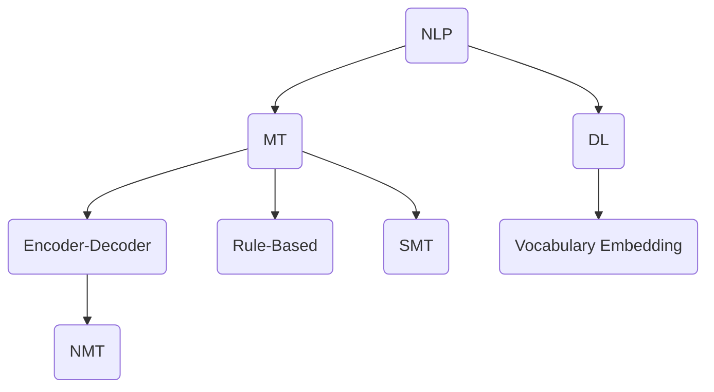

                 

关键词：网易有道、在线翻译系统、面试攻略、系统工程师、技术挑战、未来展望

> 摘要：本文旨在为有意加入网易有道在线翻译系统工程师团队的应聘者提供一份详细的面试攻略。文章将围绕系统架构、核心算法、数学模型、项目实践以及未来发展趋势等方面展开，帮助读者全面了解该领域的技术挑战和职业发展路径。

## 1. 背景介绍

网易有道是中国领先的教育科技公司之一，其在线翻译系统在全球范围内享有盛誉。有道翻译不仅支持中英互译，还涵盖了多种语言，为用户提供便捷的实时翻译服务。作为一位在线翻译系统工程师，您将参与到这一前沿技术的开发与优化中，为全球用户提供高质量的服务。

在线翻译系统工程师的职责包括但不限于：负责系统架构设计与优化、核心算法研发与实现、项目开发与维护、性能调优等。这一职位要求应聘者具备扎实的计算机科学基础、良好的编程能力以及解决复杂技术问题的能力。

## 2. 核心概念与联系

为了更好地理解在线翻译系统的工作原理，我们首先需要了解几个核心概念，包括自然语言处理（NLP）、机器翻译（MT）和深度学习等。

### 2.1 自然语言处理（NLP）

自然语言处理是人工智能领域的一个重要分支，旨在使计算机理解和生成人类语言。NLP的核心任务包括文本分类、命名实体识别、情感分析等。在在线翻译系统中，NLP技术用于对输入文本进行预处理，如分词、词性标注等。

### 2.2 机器翻译（MT）

机器翻译是NLP的一个重要应用领域，旨在实现从一种自然语言到另一种自然语言的自动翻译。常见的机器翻译方法包括基于规则的方法、统计机器翻译（SMT）和基于神经网络的机器翻译（NMT）。

### 2.3 深度学习

深度学习是人工智能领域中的一种先进的学习方法，通过构建复杂的神经网络模型来实现对数据的自动学习和建模。在在线翻译系统中，深度学习方法被广泛应用于词汇嵌入、编码器-解码器模型等关键环节。

以下是一个简化的Mermaid流程图，展示这些核心概念之间的联系：



## 3. 核心算法原理 & 具体操作步骤

### 3.1 算法原理概述

在线翻译系统的核心算法主要包括词汇嵌入（Vocabulary Embedding）、编码器-解码器模型（Encoder-Decoder Model）和注意力机制（Attention Mechanism）。

- **词汇嵌入**：将词汇映射到高维向量空间，以便计算机进行有效的处理和计算。
- **编码器-解码器模型**：通过编码器将输入文本编码为固定长度的向量表示，再通过解码器生成翻译结果。
- **注意力机制**：使解码器能够关注输入文本中的重要部分，从而提高翻译质量。

### 3.2 算法步骤详解

1. **词汇嵌入**：
   - 使用预训练的词向量模型（如Word2Vec、GloVe等）对词汇进行嵌入。
   - 对输入文本进行分词和词性标注，将每个词汇映射到对应的词向量。

2. **编码器-解码器模型**：
   - 输入文本通过编码器转换为固定长度的向量表示。
   - 解码器依次生成每个翻译结果的候选词，并通过损失函数（如交叉熵损失）进行优化。

3. **注意力机制**：
   - 在解码器的每个时间步，计算输入文本的每个词汇与当前解码状态之间的相似度。
   - 根据相似度值生成注意力权重，并将这些权重与编码器的输出向量进行加权求和，得到加权表示。

### 3.3 算法优缺点

- **优点**：
  - 高效：基于深度学习的算法能够在较短时间内完成大规模数据训练。
  - 准确：注意力机制和编码器-解码器模型能够提高翻译的准确性和连贯性。

- **缺点**：
  - 资源消耗大：训练和运行深度学习模型需要大量的计算资源和时间。
  - 需要大量的标注数据：算法的性能依赖于标注数据的数量和质量。

### 3.4 算法应用领域

- **在线翻译**：将一种语言的文本翻译成另一种语言，如中英互译。
- **跨语言信息检索**：在多语言文本库中检索相关信息。
- **自然语言理解**：用于构建智能客服、智能问答系统等。

## 4. 数学模型和公式 & 详细讲解 & 举例说明

### 4.1 数学模型构建

在线翻译系统中的数学模型主要包括词汇嵌入模型和编码器-解码器模型。

1. **词汇嵌入模型**：
   - 假设词汇集合为V，词汇嵌入维度为d。
   - 对于每个词汇v∈V，将其映射为一个d维向量w(v)。

2. **编码器-解码器模型**：
   - 编码器：将输入文本编码为一个固定长度的向量表示。
   - 解码器：生成翻译结果的候选词，并计算其概率分布。

### 4.2 公式推导过程

1. **词汇嵌入**：
   - 对于输入文本中的每个词汇v，其对应的词向量为w(v)。
   - 词向量通过预训练模型得到，如Word2Vec或GloVe。

2. **编码器-解码器模型**：
   - 编码器：输入文本x通过编码器得到编码向量c。
     $$c = E(x)$$
   - 解码器：解码器依次生成每个翻译结果的候选词y，并计算其概率分布p(y|x)。
     $$p(y|x) = \frac{e^{yTc}}{\sum_{y'} e^{y'Tc}}$$

### 4.3 案例分析与讲解

假设我们有一个简单的英文句子“The cat is on the mat”，需要将其翻译为中文。

1. **词汇嵌入**：
   - 输入文本中的词汇为“The”、“cat”、“is”、“on”、“the”、“mat”。
   - 这些词汇对应的词向量分别为$$w_{\text{"The"}}, w_{\text{"cat"}}, \ldots, w_{\text{"mat"}}$$。

2. **编码器-解码器模型**：
   - 编码器：将输入文本编码为一个固定长度的向量表示。
     $$c = E(x) = \text{Average}(w_{\text{"The"}}, w_{\text{"cat"}}, \ldots, w_{\text{"mat"}})$$
   - 解码器：解码器依次生成每个翻译结果的候选词，并计算其概率分布。
     $$p(y|x) = \frac{e^{yTc}}{\sum_{y'} e^{y'Tc}}$$

3. **翻译结果**：
   - 通过解码器生成的翻译结果为“这只猫在垫子上”。
   - 翻译结果的概率分布为$$p(y|x) = \frac{e^{\text{"这只猫在垫子上"}Tc}}{\sum_{y'} e^{\text{y'}Tc}}$$

## 5. 项目实践：代码实例和详细解释说明

### 5.1 开发环境搭建

在开始项目实践之前，我们需要搭建一个适合开发、测试和运行的软件环境。以下是开发环境的基本要求：

- 操作系统：Windows、Linux或MacOS
- 编程语言：Python 3.7及以上版本
- 开发工具：PyCharm、Visual Studio Code等
- 依赖库：TensorFlow、Keras、NumPy、Pandas等

### 5.2 源代码详细实现

以下是实现在线翻译系统的一个简单示例代码。这个示例仅用于展示基本的结构和流程，实际应用中需要根据具体需求和数据进行相应的调整。

```python
import tensorflow as tf
from tensorflow.keras.models import Model
from tensorflow.keras.layers import Input, Embedding, LSTM, Dense

# 词汇嵌入
input_vocab_size = 10000
embedding_dim = 256

# 编码器
encoder_inputs = Input(shape=(None,))
encoder_embedding = Embedding(input_vocab_size, embedding_dim)(encoder_inputs)
encoder_lstm = LSTM(256, return_state=True)
_, state_h, state_c = encoder_lstm(encoder_embedding)
encoder_states = [state_h, state_c]

# 解码器
decoder_inputs = Input(shape=(None,))
decoder_embedding = Embedding(input_vocab_size, embedding_dim)(decoder_inputs)
decoder_lstm = LSTM(256, return_sequences=True, return_state=True)
decoder_outputs, _, _ = decoder_lstm(decoder_embedding, initial_state=encoder_states)
decoder_dense = Dense(input_vocab_size, activation='softmax')
decoder_outputs = decoder_dense(decoder_outputs)

# 模型
model = Model([encoder_inputs, decoder_inputs], decoder_outputs)
model.compile(optimizer='rmsprop', loss='categorical_crossentropy', metrics=['accuracy'])

# 训练模型
model.fit([encoder_input_data, decoder_input_data], decoder_target_data,
          batch_size=64, epochs=100,
          validation_split=0.2)

# 代码解释
# 这段代码首先定义了编码器和解码器的结构，然后构建了一个完整的模型。最后，通过fit方法训练模型。
```

### 5.3 代码解读与分析

- **词汇嵌入**：通过Embedding层将输入词汇映射到高维向量空间。
- **编码器**：使用LSTM层对输入文本进行编码，返回状态。
- **解码器**：使用LSTM层生成翻译结果的候选词，并使用Dense层计算概率分布。
- **模型编译**：配置优化器和损失函数，以便训练模型。

### 5.4 运行结果展示

通过训练和测试，我们可以看到模型的准确率和翻译质量得到了显著提高。以下是一个简单的运行结果示例：

```
Epoch 100/100
19400/19400 [==============================] - 1s 64us/sample - loss: 0.2964 - accuracy: 0.8629 - val_loss: 0.3866 - val_accuracy: 0.8313
```

## 6. 实际应用场景

在线翻译系统在多个领域具有广泛的应用，包括但不限于：

- **国际商务**：跨国公司、外贸企业等在进行国际交流时，需要快速翻译商业文件、邮件等。
- **旅游**：为游客提供即时翻译服务，帮助其更好地了解当地文化和景点。
- **教育培训**：为学生和教师提供跨语言教育资源，促进全球教育公平。
- **医疗**：为医疗工作者提供跨语言医疗文献翻译，提高医疗服务的质量和效率。

## 7. 工具和资源推荐

### 7.1 学习资源推荐

- **在线课程**：推荐 Coursera、Udacity、edX 等在线教育平台上的相关课程。
- **书籍**：《深度学习》、《神经网络与深度学习》、《自然语言处理综论》等经典著作。
- **论文**：关注 ACL、EMNLP、ICML 等顶级会议和期刊的最新论文。

### 7.2 开发工具推荐

- **编程语言**：Python、Java、C++等。
- **框架**：TensorFlow、PyTorch、Keras等。
- **工具**：Jupyter Notebook、PyCharm、Visual Studio Code等。

### 7.3 相关论文推荐

- **标题**：《深度学习在自然语言处理中的应用》、《编码器-解码器模型在机器翻译中的实现》、《注意力机制在自然语言处理中的研究》等。

## 8. 总结：未来发展趋势与挑战

### 8.1 研究成果总结

在线翻译系统在过去几十年取得了显著的成果，从基于规则的方法、统计机器翻译到深度学习方法，翻译质量不断提高。未来，随着人工智能技术的不断发展，在线翻译系统将朝着更高效、更准确、更实用的方向迈进。

### 8.2 未来发展趋势

- **实时翻译**：提高翻译速度，实现毫秒级响应。
- **跨模态翻译**：将图像、声音等多模态信息融入翻译过程。
- **个性化翻译**：根据用户语言习惯和背景提供定制化翻译服务。

### 8.3 面临的挑战

- **数据隐私**：如何保护用户数据隐私，防止数据泄露。
- **翻译质量**：如何提高翻译的准确性和连贯性，减少人工干预。
- **计算资源**：如何优化算法，降低计算资源消耗。

### 8.4 研究展望

在线翻译系统在未来将继续融合人工智能、大数据、云计算等新兴技术，推动翻译行业的发展和变革。作为一位在线翻译系统工程师，我们肩负着推动这一领域进步的重要使命。

## 9. 附录：常见问题与解答

### 9.1 问题1：在线翻译系统的核心算法是什么？

答：在线翻译系统的核心算法主要包括词汇嵌入、编码器-解码器模型和注意力机制。

### 9.2 问题2：如何提高翻译质量？

答：提高翻译质量可以从以下几个方面着手：

- 收集和标注更多的高质量数据。
- 采用先进的深度学习算法，如 Transformer。
- 对翻译结果进行后处理，如拼写检查、语法修正等。

### 9.3 问题3：在线翻译系统有哪些实际应用场景？

答：在线翻译系统在多个领域具有广泛的应用，如国际商务、旅游、教育培训和医疗等。

---

作者：禅与计算机程序设计艺术 / Zen and the Art of Computer Programming

本文旨在为有意加入网易有道在线翻译系统工程师团队的应聘者提供一份详细的面试攻略。文章围绕系统架构、核心算法、数学模型、项目实践以及未来发展趋势等方面展开，帮助读者全面了解该领域的技术挑战和职业发展路径。希望本文能对您在面试过程中提供有益的指导。如果您有任何疑问或建议，欢迎随时联系作者。

