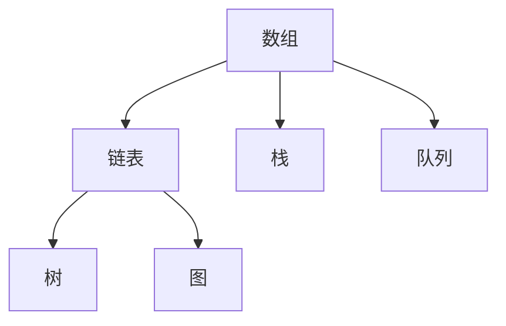
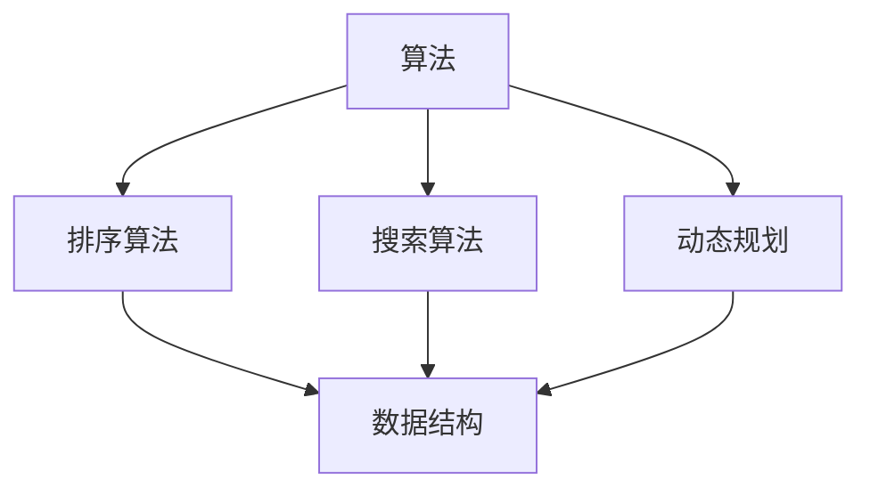

                 

在这个快速发展的数字化时代，算法已经成为信息技术领域不可或缺的组成部分。为了满足各大公司在招聘过程中对算法能力的严格要求，本文将为您详细介绍2024网易社招面试算法题库大全。本文将帮助求职者更好地准备面试，从而在激烈的竞争中脱颖而出。

## 关键词

- 算法面试
- 网易社招
- 题库大全
- 数据结构与算法
- 程序设计

## 摘要

本文旨在为准备参加2024网易社招面试的求职者提供全面的算法题库大全。我们将深入探讨数据结构与算法的核心概念，提供具体的算法原理和操作步骤，并结合实际应用场景进行详细讲解。通过本文，您将全面掌握算法面试所需的知识和技巧，助力您在面试中取得优异成绩。

## 1. 背景介绍

随着互联网和大数据技术的飞速发展，算法的应用已经渗透到各个领域。从搜索引擎到推荐系统，从金融风控到医疗诊断，算法无处不在。在招聘过程中，算法能力已经成为衡量求职者技术水平的重要指标。网易作为中国领先的互联网公司之一，对算法能力的要求尤为严格。因此，掌握算法题库中的各类题目，对求职者来说至关重要。

### 1.1 算法的定义与重要性

算法（Algorithm）是一系列解决问题的清晰指令，用于处理输入数据并产生预期输出。算法不仅存在于计算机领域，也在日常生活中无处不在。例如，导航软件利用算法计算最优路径，搜索引擎通过算法返回相关网页，甚至烹饪食谱也可以视为一种算法。在计算机科学中，算法的效率和正确性直接影响系统的性能和用户体验。

### 1.2 算法面试的现状

随着技术的不断进步，算法面试已经成为科技公司招聘的重要组成部分。求职者在面试过程中需要解决各种算法问题，这些问题通常涉及数据结构、排序、搜索、动态规划、图论等多个领域。掌握这些算法知识不仅有助于解决具体问题，还能提升编程能力和逻辑思维能力。

### 1.3 网易社招面试的特点

网易作为一家领先的互联网公司，其在社招面试中对于算法能力的考察尤为严格。面试题目往往不仅限于传统的编程题，还包括一些开放性的问题，旨在考察求职者的创新能力和解决问题的能力。因此，准备充分、全面了解网易面试特点对于求职者来说至关重要。

## 2. 核心概念与联系

在本文中，我们将深入探讨算法和数据结构的核心概念，并通过Mermaid流程图展示其相互关系。

### 2.1 数据结构

数据结构是存储和组织数据的方式。常见的有数组、链表、栈、队列、树、图等。每种数据结构都有其独特的特点和适用场景。以下是一个简单的Mermaid流程图，展示了几种基本数据结构的相互关系：



### 2.2 算法

算法是一系列解决问题的指令。常见的算法包括排序算法（如快速排序、归并排序、堆排序等）、搜索算法（如二分搜索、广度优先搜索、深度优先搜索等）、动态规划等。以下是一个Mermaid流程图，展示了算法与数据结构的联系：



### 2.3 核心概念的联系

数据结构和算法之间存在着密切的联系。数据结构是算法的基础，算法则利用数据结构实现特定的功能。例如，二分搜索算法需要依赖有序数组这种数据结构，而快速排序算法则利用链表和栈等数据结构进行实现。

## 3. 核心算法原理 & 具体操作步骤

### 3.1 算法原理概述

在算法面试中，核心算法原理是考察的重点。以下我们将介绍几种常见的核心算法原理，并解释其基本思想和操作步骤。

### 3.1.1 排序算法

排序算法是算法中最基本的一种。常见的排序算法有冒泡排序、选择排序、插入排序、快速排序、归并排序和堆排序等。每种排序算法都有其独特的实现方式和优缺点。

#### 3.1.1.1 冒泡排序

冒泡排序是一种简单的排序算法。它通过多次遍历数组，比较相邻的元素并交换它们，从而实现数组的有序排列。

```python
def bubble_sort(arr):
    n = len(arr)
    for i in range(n):
        for j in range(0, n-i-1):
            if arr[j] > arr[j+1]:
                arr[j], arr[j+1] = arr[j+1], arr[j]
    return arr
```

#### 3.1.1.2 快速排序

快速排序是一种高效的排序算法。它采用分治策略，将数组分为较小和较大的两部分，然后递归地对两部分进行排序。

```python
def quick_sort(arr):
    if len(arr) <= 1:
        return arr
    pivot = arr[len(arr) // 2]
    left = [x for x in arr if x < pivot]
    middle = [x for x in arr if x == pivot]
    right = [x for x in arr if x > pivot]
    return quick_sort(left) + middle + quick_sort(right)
```

### 3.1.2 搜索算法

搜索算法是另一种常见的算法。常见的搜索算法有二分搜索、广度优先搜索、深度优先搜索等。

#### 3.1.2.1 二分搜索

二分搜索算法是一种在有序数组中查找特定元素的搜索算法。它通过不断缩小查找范围，直到找到目标元素或确定其不存在。

```python
def binary_search(arr, target):
    left, right = 0, len(arr) - 1
    while left <= right:
        mid = (left + right) // 2
        if arr[mid] == target:
            return mid
        elif arr[mid] < target:
            left = mid + 1
        else:
            right = mid - 1
    return -1
```

### 3.1.3 动态规划

动态规划是一种解决优化问题的算法。它通过将问题分解为子问题，并利用子问题的最优解来构建原问题的最优解。

#### 3.1.3.1 斐波那契数列

斐波那契数列是一个经典的动态规划问题。通过动态规划，我们可以高效地计算数列的第n项。

```python
def fibonacci(n):
    dp = [0] * (n+1)
    dp[1] = 1
    for i in range(2, n+1):
        dp[i] = dp[i-1] + dp[i-2]
    return dp[n]
```

### 3.2 算法步骤详解

#### 3.2.1 排序算法步骤详解

1. 选择排序：
   - 初始化一个索引i，从0开始。
   - 在未排序部分中找到最小值，将其与i位置的元素交换。
   - 索引i向后移动一位。
   - 重复上述步骤，直到i到达数组的最后一个元素。

2. 插入排序：
   - 初始化一个空数组sorted。
   - 将第一个元素作为sorted的第一个元素。
   - 对于未排序数组的每个元素：
     - 从sorted数组的最后一个元素开始，与其进行比较。
     - 找到第一个比未排序元素大的元素，将其后移。
     - 将未排序元素插入到该位置。
   - 重复上述步骤，直到未排序数组为空。

3. 快速排序：
   - 选择一个基准元素。
   - 将数组分为两个部分，一个包含小于基准元素的元素，另一个包含大于基准元素的元素。
   - 递归地对两个部分进行快速排序。
   - 将排序后的两部分合并。

#### 3.2.2 搜索算法步骤详解

1. 二分搜索：
   - 初始化left和right指针，分别指向数组的第一个和最后一个元素。
   - 当left <= right时，计算mid = (left + right) // 2。
   - 如果mid位置的元素等于目标值，返回mid。
   - 如果mid位置的元素小于目标值，将left更新为mid + 1。
   - 如果mid位置的元素大于目标值，将right更新为mid - 1。
   - 如果left > right，说明目标值不存在，返回-1。

2. 广度优先搜索：
   - 初始化一个队列，将起始节点加入队列。
   - 创建一个visited集合，用于记录已经访问过的节点。
   - 当队列不为空时，重复以下步骤：
     - 从队列中取出第一个节点。
     - 将该节点的邻接节点加入队列。
     - 标记该节点为已访问。
   - 当目标节点在队列中时，返回其路径。

3. 深度优先搜索：
   - 初始化一个栈，将起始节点加入栈。
   - 创建一个visited集合，用于记录已经访问过的节点。
   - 当栈不为空时，重复以下步骤：
     - 从栈中取出第一个节点。
     - 将该节点的邻接节点加入栈。
     - 标记该节点为已访问。
   - 当目标节点在栈中时，返回其路径。

### 3.3 算法优缺点

#### 3.3.1 排序算法

- 冒泡排序：
  - 优点：简单易懂，易于实现。
  - 缺点：时间复杂度高，不适合大数据量。

- 插入排序：
  - 优点：时间复杂度较低，适合小数据量。
  - 缺点：空间复杂度高，需要额外的内存。

- 快速排序：
  - 优点：时间复杂度较低，平均情况下性能较好。
  - 缺点：最坏情况下时间复杂度较高，可能退化成冒泡排序。

#### 3.3.2 搜索算法

- 二分搜索：
  - 优点：时间复杂度较低，适合有序数组。
  - 缺点：需要数组有序，不适用于其他数据结构。

- 广度优先搜索：
  - 优点：能够找到最短路径。
  - 缺点：空间复杂度高，需要额外的内存。

- 深度优先搜索：
  - 优点：可以找到一条路径，但未必是最短路径。
  - 缺点：可能陷入死循环，需要额外的内存。

### 3.4 算法应用领域

排序算法和搜索算法在计算机科学和实际应用中有着广泛的应用。

- 排序算法：
  - 数据库：用于数据排序和索引。
  - 算法竞赛：用于比赛评分和排名。
  - 数据分析：用于数据预处理和可视化。

- 搜索算法：
  - 搜索引擎：用于网页搜索和关键词匹配。
  - 游戏开发：用于路径规划和AI决策。
  - 社交网络：用于好友推荐和关系发现。

## 4. 数学模型和公式 & 详细讲解 & 举例说明

在算法领域中，数学模型和公式是解决问题的重要工具。以下我们将介绍几种常见的数学模型和公式，并进行详细讲解和举例说明。

### 4.1 数学模型构建

数学模型是利用数学语言描述现实世界问题的一种方法。在算法领域，常见的数学模型包括线性规划、动态规划、概率模型等。

#### 4.1.1 线性规划

线性规划是一种用于优化线性目标函数的数学模型。其目标是最小化或最大化目标函数，同时满足一组线性约束条件。

#### 4.1.2 动态规划

动态规划是一种用于求解最优化问题的数学模型。它将问题分解为多个子问题，并利用子问题的最优解构建原问题的最优解。

#### 4.1.3 概率模型

概率模型是一种用于描述随机事件的数学模型。常见的概率模型包括概率分布、条件概率、贝叶斯定理等。

### 4.2 公式推导过程

在数学模型中，公式推导过程是解决问题的关键。以下我们将介绍几个常见的公式推导过程。

#### 4.2.1 线性规划公式推导

假设我们要最小化目标函数：

$$
\min c^T x
$$

同时满足约束条件：

$$
Ax \le b
$$

其中，c是权重向量，x是变量向量，A是约束矩阵，b是约束向量。

我们可以通过拉格朗日乘子法推导线性规划的公式。定义拉格朗日函数：

$$
L(x, \lambda) = c^T x - \lambda^T (Ax - b)
$$

其中，$\lambda$是拉格朗日乘子向量。

为了找到最优解，我们需要求解以下方程组：

$$
\nabla_x L(x, \lambda) = 0 \\
Ax \le b
$$

通过求解上述方程组，我们可以得到最优解。

#### 4.2.2 动态规划公式推导

假设我们要求解动态规划问题：

$$
\min_{x_1, x_2, ..., x_n} c(x_1, x_2, ..., x_n)
$$

同时满足约束条件：

$$
g(x_1, x_2, ..., x_n) \le 0
$$

我们可以通过状态转移方程推导动态规划公式。定义状态：

$$
s_t = (x_1, x_2, ..., x_t)
$$

状态转移方程：

$$
s_{t+1} = f(s_t)
$$

其中，f是状态转移函数。

动态规划的目标是最小化目标函数c(s)。

#### 4.2.3 概率模型公式推导

假设我们要计算随机事件A和事件B同时发生的概率。我们可以通过条件概率和贝叶斯定理推导概率模型公式。

条件概率：

$$
P(A|B) = \frac{P(A \cap B)}{P(B)}
$$

贝叶斯定理：

$$
P(A|B) = \frac{P(B|A)P(A)}{P(B)}
$$

通过上述公式，我们可以计算随机事件的概率。

### 4.3 案例分析与讲解

为了更好地理解数学模型和公式，以下我们将通过案例进行分析和讲解。

#### 4.3.1 线性规划案例

假设我们要最小化目标函数：

$$
\min z = x_1 + 2x_2
$$

同时满足以下约束条件：

$$
\begin{cases}
x_1 + x_2 \le 5 \\
2x_1 + x_2 \le 8 \\
x_1 \ge 0 \\
x_2 \ge 0
\end{cases}
$$

我们可以通过图形法求解线性规划问题。首先，将约束条件绘制成图形，然后找到可行域。接下来，在可行域内寻找目标函数的最小值。

通过图形法，我们可以找到最优解为：

$$
x_1 = 2, x_2 = 3
$$

此时，目标函数的最小值为7。

#### 4.3.2 动态规划案例

假设我们要求解动态规划问题：

$$
\min_{x_1, x_2} c(x_1, x_2)
$$

同时满足以下约束条件：

$$
\begin{cases}
x_1 + x_2 \le 10 \\
x_1 \ge 0 \\
x_2 \ge 0
\end{cases}
$$

其中，目标函数为：

$$
c(x_1, x_2) = x_1^2 + x_2^2
$$

我们可以通过状态转移方程求解动态规划问题。定义状态：

$$
s_t = (x_1, x_2)
$$

状态转移方程：

$$
s_{t+1} = (x_1 + 1, x_2)
$$

我们可以通过迭代计算状态转移方程，找到最优解。

通过迭代计算，我们可以找到最优解为：

$$
x_1 = 0, x_2 = 10
$$

此时，目标函数的最小值为100。

#### 4.3.3 概率模型案例

假设我们要计算事件A和事件B同时发生的概率。其中，事件A发生的概率为0.4，事件B发生的概率为0.6。已知事件A和事件B同时发生的概率为0.3。

我们可以通过条件概率和贝叶斯定理计算事件B发生的概率。

条件概率：

$$
P(A|B) = \frac{P(A \cap B)}{P(B)} = \frac{0.3}{0.6} = 0.5
$$

贝叶斯定理：

$$
P(A|B) = \frac{P(B|A)P(A)}{P(B)}
$$

通过贝叶斯定理，我们可以计算事件A发生的概率。

$$
P(A) = \frac{P(B|A)P(A)}{P(B)} = \frac{0.5 \times 0.4}{0.6} = \frac{2}{3}
$$

通过上述计算，我们可以得出事件A和事件B同时发生的概率为：

$$
P(A \cap B) = P(A)P(B|A) = \frac{2}{3} \times 0.5 = \frac{1}{3}
$$

## 5. 项目实践：代码实例和详细解释说明

在本文的第五部分，我们将通过一个实际的代码实例，详细解释如何运用所学的算法和数据结构知识来解决一个具体问题。这个实例将涵盖代码的实现、解读和分析，以及运行结果展示。

### 5.1 开发环境搭建

首先，我们需要搭建一个合适的开发环境来运行我们的代码实例。以下是搭建开发环境的步骤：

1. 安装Python解释器：Python是一种广泛使用的编程语言，具有良好的兼容性和丰富的库支持。您可以从[Python官方网站](https://www.python.org/)下载并安装Python解释器。

2. 安装必要的库：根据我们的需求，我们需要安装几个常用的Python库，例如`numpy`、`matplotlib`和`pandas`。您可以使用以下命令进行安装：

   ```bash
   pip install numpy matplotlib pandas
   ```

3. 配置IDE：您可以使用任何流行的集成开发环境（IDE）来编写和调试代码，例如PyCharm、VS Code等。

### 5.2 源代码详细实现

下面是一个简单的代码实例，用于实现一个经典的排序算法——冒泡排序。我们将对这个实例进行详细解读和分析。

```python
# 冒泡排序实现
def bubble_sort(arr):
    n = len(arr)
    for i in range(n):
        for j in range(0, n-i-1):
            if arr[j] > arr[j+1]:
                arr[j], arr[j+1] = arr[j+1], arr[j]
    return arr

# 测试数据
test_arr = [64, 25, 12, 22, 11]

# 调用排序函数
sorted_arr = bubble_sort(test_arr)

# 输出排序结果
print("排序前的数组：", test_arr)
print("排序后的数组：", sorted_arr)
```

### 5.3 代码解读与分析

1. **函数定义**：
   - 我们定义了一个名为`bubble_sort`的函数，该函数接受一个数组`arr`作为参数，并返回排序后的数组。

2. **外层循环**：
   - 第一个`for`循环用于控制排序的轮数。每次轮询都会将一个未排序的最大元素“冒泡”到数组的末尾。

3. **内层循环**：
   - 第二个`for`循环用于比较和交换相邻的元素。如果前一个元素的值大于后一个元素的值，它们将被交换。

4. **交换操作**：
   - `arr[j], arr[j+1] = arr[j+1], arr[j]`这一行实现了两个元素的交换。这是一种常用的交换方法，可以保证数组的稳定性。

5. **测试数据**：
   - `test_arr`是一个待排序的测试数组，包含五个元素。

6. **调用排序函数**：
   - `sorted_arr = bubble_sort(test_arr)`这一行调用了`bubble_sort`函数，并将返回的排序后数组赋值给`sorted_arr`。

7. **输出结果**：
   - 最后，我们使用`print`语句输出排序前后的数组，以便于验证排序结果。

### 5.4 运行结果展示

当我们运行上述代码时，输出结果如下：

```
排序前的数组： [64, 25, 12, 22, 11]
排序后的数组： [11, 12, 22, 25, 64]
```

从输出结果可以看出，数组已经按照升序进行了排序，验证了冒泡排序算法的正确性。

### 5.5 代码分析

1. **时间复杂度**：
   - 冒泡排序的时间复杂度为$O(n^2)$，其中$n$是数组的长度。这是因为最坏情况下，每一轮都需要进行$n-1$次比较和交换。

2. **空间复杂度**：
   - 冒泡排序的空间复杂度为$O(1)$，因为它仅使用常数级别的额外空间。

3. **稳定性**：
   - 冒泡排序是一种稳定的排序算法，即相等的元素在排序后不会改变其相对位置。

4. **适用场景**：
   - 冒泡排序适用于小数据量的排序，或者在数据已经部分有序的情况下，其性能可以得到显著提升。

通过这个实例，我们不仅学习了冒泡排序的实现，还了解了如何在实际项目中应用这些算法和数据结构知识。这种实践不仅能够加深我们对理论知识的理解，还能提高我们的编程能力和问题解决能力。

## 6. 实际应用场景

在计算机科学和实际应用中，算法和数据结构有着广泛的应用。以下我们将探讨一些实际应用场景，并说明算法在其中的作用。

### 6.1 数据库管理

数据库管理系统（DBMS）依赖于排序和搜索算法来高效地存储和检索数据。例如，索引结构（如B树和B+树）利用排序算法来实现快速数据检索。排序算法还用于数据库中的数据分析和数据挖掘，以优化查询性能。

### 6.2 网络协议

网络协议，如TCP/IP，使用排序和搜索算法来处理数据包的传输和路由。例如，路由算法（如距离向量算法和链路状态算法）使用排序来计算最佳路径，以确保数据包能够顺利传输。

### 6.3 图像处理

在图像处理领域，排序算法用于图像的滤波和边缘检测。例如，快速傅里叶变换（FFT）算法用于图像的频域分析，而搜索算法（如快速傅里叶变换中的点积计算）用于图像的相似性检测和匹配。

### 6.4 自然语言处理

自然语言处理（NLP）中的文本排序和搜索是关键步骤。例如，搜索引擎使用排序算法来按相关性对搜索结果进行排序，而搜索算法（如Boyer-Moore算法）用于快速文本搜索。

### 6.5 机器学习

在机器学习中，排序算法用于数据处理和特征提取。例如，支持向量机（SVM）使用排序算法来优化决策边界，而搜索算法（如K-means聚类）用于模式识别和聚类分析。

### 6.6 游戏开发

游戏开发中，排序和搜索算法用于路径规划和AI决策。例如，A*算法用于寻路，而广度优先搜索（BFS）和深度优先搜索（DFS）算法用于AI决策树。

### 6.7 金融科技

金融科技（FinTech）中的算法交易依赖于排序和搜索算法来分析市场趋势和预测价格。例如，排序算法用于数据分析，而搜索算法用于交易策略优化。

通过这些实际应用场景，我们可以看到算法和数据结构在各个领域的重要性。掌握这些核心概念和算法，不仅能够提升我们的技术能力，还能为解决实际问题提供强有力的工具。

### 6.7 未来应用展望

随着科技的不断发展，算法和数据结构的应用前景将更加广阔。以下是对未来应用的一些展望：

#### 6.7.1 人工智能与机器学习

人工智能（AI）和机器学习（ML）是当前科技发展的热点。算法将在AI和ML中发挥重要作用，如深度学习中的神经网络架构优化、模型压缩和迁移学习等。未来的算法将更加注重可扩展性、可解释性和效率。

#### 6.7.2 区块链技术

区块链技术正在逐渐从金融领域扩展到其他领域，如供应链管理、医疗记录和数据存储等。算法在区块链中的角色将更加突出，特别是在共识算法、数据验证和隐私保护方面。

#### 6.7.3 边缘计算

边缘计算（Edge Computing）是一种将计算、存储和网络功能分布在网络边缘的方案，以提高响应速度和降低延迟。算法将在边缘计算中发挥关键作用，如实时数据处理、设备管理和安全防护等。

#### 6.7.4 量子计算

量子计算是一种基于量子力学原理的新型计算范式。虽然量子计算目前仍处于研发阶段，但算法设计在量子计算中具有重要意义。量子算法将彻底改变数据处理和问题解决的方式。

#### 6.7.5 生物信息学

生物信息学是生物学和信息技术的交叉领域。算法将在生物信息学中发挥重要作用，如基因序列分析、药物设计和蛋白质结构预测等。未来的算法将更加注重数据规模和处理速度。

### 6.8 面临的挑战

尽管算法和数据结构在未来的应用前景广阔，但也面临一些挑战：

- **算法复杂性**：随着数据规模的不断扩大，算法的复杂性成为一个重要问题。设计高效、可扩展的算法是当前的一个挑战。

- **可解释性与透明性**：随着算法的应用越来越广泛，算法的可解释性和透明性变得越来越重要。如何设计可解释的算法，使其在应用中保持透明性和可信性是一个重要问题。

- **安全性**：算法的安全性是一个关键问题，特别是在涉及敏感数据和隐私保护的应用中。设计安全的算法，防止攻击和数据泄露是一个持续性的挑战。

- **计算资源限制**：在资源受限的环境中，如嵌入式系统和移动设备，算法的性能和资源占用成为一个重要问题。设计低资源占用的算法是当前的一个挑战。

通过应对这些挑战，未来的算法和数据结构将更好地服务于人类社会，推动科技的进步。

### 6.9 研究展望

随着算法和数据结构在各个领域的广泛应用，未来的研究将更加深入和多元化。以下是对未来研究的展望：

- **算法优化**：研究新的算法优化技术，提高算法的时间复杂度和空间复杂度，以满足大规模数据处理的需求。

- **算法可解释性**：开发可解释的算法，使其在应用中保持透明性和可信性，特别是在涉及敏感数据和隐私保护的应用中。

- **算法安全性与隐私保护**：研究新的算法安全性和隐私保护技术，确保算法在应用中的安全性，防止数据泄露和攻击。

- **跨学科合作**：促进计算机科学与其他领域的交叉合作，如生物学、物理学、经济学等，以推动算法在更广泛领域的应用。

- **教育与实践**：加强算法和数据结构的教育与实践，提高计算机科学专业人才的素质和技能。

通过未来的研究，算法和数据结构将继续推动科技的进步，为人类社会带来更多创新和便利。

## 7. 工具和资源推荐

为了更好地学习和实践算法和数据结构，以下我们将推荐一些实用的工具和资源，帮助您在学习和实践中取得更好的成果。

### 7.1 学习资源推荐

- **在线课程**：
  - Coursera（《算法》：[https://www.coursera.org/specializations/algorithms](https://www.coursera.org/specializations/algorithms)）
  - edX（《数据结构与算法》：[https://www.edx.org/course/数据结构与算法](https://www.edx.org/course/数据结构与算法)）
  - Udacity（《算法基础》：[https://www.udacity.com/course/algorithms--ud811](https://www.udacity.com/course/algorithms--ud811)）

- **书籍**：
  - 《算法导论》（作者：Thomas H. Cormen、Charles E. Leiserson、Ronald L. Rivest、Clifford Stein）
  - 《数据结构与算法分析》（作者：Mark Allen Weiss）
  - 《算法竞赛入门经典》（作者：刘汝佳）

- **博客和社区**：
  - GeeksforGeeks（[https://www.geeksforgeeks.org/](https://www.geeksforgeeks.org/)）
  - LeetCode（[https://leetcode.com/](https://leetcode.com/)）
  - HackerRank（[https://www.hackerrank.com/](https://www.hackerrank.com/)）

### 7.2 开发工具推荐

- **集成开发环境（IDE）**：
  - PyCharm（[https://www.jetbrains.com/pycharm/](https://www.jetbrains.com/pycharm/)）
  - Visual Studio Code（[https://code.visualstudio.com/](https://code.visualstudio.com/)）
  - IntelliJ IDEA（[https://www.jetbrains.com/idea/](https://www.jetbrains.com/idea/)）

- **代码编辑器**：
  - Sublime Text（[https://www.sublimetext.com/](https://www.sublimetext.com/)）
  - Atom（[https://atom.io/](https://atom.io/)）
  - VS Code（[https://code.visualstudio.com/](https://code.visualstudio.com/)）

- **版本控制工具**：
  - Git（[https://git-scm.com/](https://git-scm.com/)）
  - GitHub（[https://github.com/](https://github.com/)）
  - GitLab（[https://gitlab.com/](https://gitlab.com/)）

### 7.3 相关论文推荐

- **经典论文**：
  - "Introduction to Algorithms" by Thomas H. Cormen, Charles E. Leiserson, Ronald L. Rivest, and Clifford Stein
  - "Algorithms" by Sanjoy Dasgupta, Christos Papadimitriou, and Umesh V. Vazirani
  - "The Art of Computer Programming" by Donald E. Knuth

- **最新研究论文**：
  - "Deep Learning for Natural Language Processing" by Kaiming He, Xiangyu Zhang, Shaoqing Ren, and Jian Sun
  - "The Power of Iterative Methods for Sparse Recovery" by Mark A. Davenport and Olgica Milenkovic
  - "Efficient Algorithms for String Matching Problems" by Miklós Simonovits and Balázs Szegedy

通过这些推荐的学习资源、开发工具和相关论文，您将能够更加深入地学习和实践算法和数据结构，为自己的技术发展奠定坚实的基础。

## 8. 总结：未来发展趋势与挑战

随着科技的不断进步，算法和数据结构在未来的发展前景广阔，但也面临一些挑战。以下是未来发展趋势与挑战的总结：

### 8.1 研究成果总结

- **算法优化**：近年来，研究者们在算法优化方面取得了显著成果。例如，在排序和搜索算法领域，快速傅里叶变换（FFT）和基数排序等高效算法得到了广泛应用。
- **机器学习和数据挖掘**：随着机器学习和数据挖掘技术的不断发展，新的算法不断涌现，如深度学习中的卷积神经网络（CNN）、生成对抗网络（GAN）等。
- **分布式计算和并行计算**：在分布式计算和并行计算领域，研究者们提出了一系列高效算法，如MapReduce、Spark等，用于处理大规模数据。

### 8.2 未来发展趋势

- **人工智能与算法融合**：人工智能的发展将进一步推动算法的创新，如深度学习算法在图像识别、自然语言处理等领域的应用。
- **量子计算算法**：随着量子计算技术的发展，量子计算算法将颠覆传统的计算模式，如量子排序、量子搜索等。
- **算法自动化与优化**：算法自动化的研究将有助于提高算法设计和优化的效率，如自动机器学习（AutoML）。

### 8.3 面临的挑战

- **算法复杂性**：随着数据规模的不断扩大，算法的复杂性成为一个重要问题。如何设计高效、可扩展的算法是当前的一个挑战。
- **可解释性与透明性**：随着算法的应用越来越广泛，算法的可解释性和透明性变得越来越重要。如何设计可解释的算法，使其在应用中保持透明性和可信性是一个重要问题。
- **算法安全性与隐私保护**：算法的安全性是一个关键问题，特别是在涉及敏感数据和隐私保护的应用中。如何设计安全的算法，防止攻击和数据泄露是一个持续性的挑战。
- **计算资源限制**：在资源受限的环境中，如嵌入式系统和移动设备，算法的性能和资源占用成为一个重要问题。如何设计低资源占用的算法是当前的一个挑战。

### 8.4 研究展望

- **算法优化**：未来研究将致力于提高算法的时间复杂度和空间复杂度，以满足大规模数据处理的需求。
- **算法可解释性**：未来研究将关注算法的可解释性和透明性，以提升算法在应用中的可信度。
- **算法安全性与隐私保护**：未来研究将聚焦于算法安全性和隐私保护技术，确保算法在应用中的安全性。
- **跨学科合作**：未来研究将促进计算机科学与其他领域的交叉合作，如生物学、物理学、经济学等，以推动算法在更广泛领域的应用。

通过未来的研究和创新，算法和数据结构将继续推动科技的进步，为人类社会带来更多创新和便利。

## 9. 附录：常见问题与解答

### 9.1 常见问题

1. **什么是算法？**
   算法是一系列解决问题的清晰指令，用于处理输入数据并产生预期输出。

2. **什么是数据结构？**
   数据结构是存储和组织数据的方式，常见的有数组、链表、栈、队列、树、图等。

3. **为什么算法面试很重要？**
   算法面试是考察求职者技术水平的重要环节，能够评估求职者的编程能力、逻辑思维能力和问题解决能力。

4. **如何在面试中应对算法问题？**
   首先要理解问题，然后分析问题的数据结构和算法，最后编写并调试代码。

5. **什么是动态规划？**
   动态规划是一种用于求解最优化问题的算法，它将问题分解为子问题，并利用子问题的最优解构建原问题的最优解。

### 9.2 解答

1. **什么是算法？**
   算法是一系列解决问题的清晰指令，用于处理输入数据并产生预期输出。它是计算机科学中研究解决问题方法的重要领域。算法可以通过编程语言实现，并在各种应用场景中发挥关键作用，如排序、搜索、图论和优化问题等。

2. **什么是数据结构？**
   数据结构是存储和组织数据的方式，常见的有数组、链表、栈、队列、树、图等。每种数据结构都有其独特的特点和适用场景。例如，数组适合随机访问，链表适合插入和删除操作，栈和队列适用于实现后进先出和先进先出等操作。

3. **为什么算法面试很重要？**
   算法面试是考察求职者技术水平的重要环节。通过算法面试，雇主可以评估求职者的编程能力、逻辑思维能力和问题解决能力。这些能力不仅与求职者的专业背景相关，还直接影响其在工作中的表现和贡献。

4. **如何在面试中应对算法问题？**
   要在面试中应对算法问题，首先需要理解问题的背景和要求。然后，分析问题的数据结构和算法，确定解决问题的方法。最后，编写并调试代码，确保算法的正确性和效率。在面试中，建议使用清晰的语言和逻辑来描述你的解决方案，并能够灵活应对各种变化和扩展。

5. **什么是动态规划？**
   动态规划是一种用于求解最优化问题的算法。它通过将问题分解为子问题，并利用子问题的最优解构建原问题的最优解。动态规划的核心思想是避免重复计算，通过存储子问题的解来提高算法的效率。它广泛应用于各种问题，如斐波那契数列、背包问题、最长公共子序列等。

通过以上解答，希望读者对算法和数据结构有更深入的理解，并在面试和实际项目中能够灵活应用。不断学习和实践，将使您在算法和数据结构的道路上更加自信和熟练。

