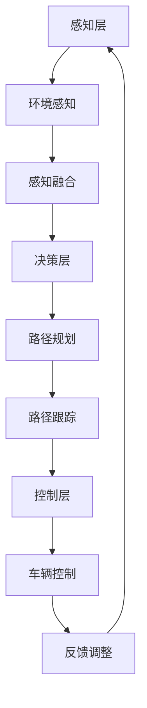

                 

关键词：美团、即时配送、无人车、控制算法、校招、面试经验、技术解析、职业发展

> 摘要：本文旨在分享美团2024即时配送无人车控制算法的校招面试经验。通过解析面试的核心问题，探讨无人车控制算法的核心原理、数学模型以及实际应用，为有意向进入这一领域的在校生提供参考和指导。文章还将总结无人车控制算法的未来发展趋势与面临的挑战，为读者展现这一领域的广阔前景。

## 1. 背景介绍

随着人工智能和无人驾驶技术的不断发展，无人车在物流配送领域的应用越来越广泛。美团作为国内领先的即时配送平台，在无人车控制算法的研究和应用上取得了显著的成果。2024年，美团即时配送无人车项目正式启动，吸引了众多在校生和专业人士的关注。本文将围绕美团即时配送无人车控制算法的校招面试经验，深入探讨这一领域的核心技术和应用前景。

### 1.1 美团即时配送无人车项目概述

美团即时配送无人车项目旨在通过无人驾驶技术提升物流配送效率，降低人力成本，提高用户满意度。该项目涵盖了无人车的感知、规划、控制、决策等核心模块，通过自主研发和创新，实现了高精度地图构建、动态路径规划、环境感知与避障、智能决策与控制等关键技术的突破。

### 1.2 校招面试的重要性

对于在校生来说，校招面试是进入顶尖企业的重要途径。美团作为行业领军企业，其校招面试流程严谨、标准严格。通过参与校招面试，不仅可以了解企业对人才的期望，还可以提升自己的专业技能和面试经验。本文将结合实际面试经历，分享无人车控制算法校招面试的经验和技巧。

## 2. 核心概念与联系

### 2.1 无人车控制算法的核心概念

无人车控制算法是无人车实现自主行驶的核心技术。它涉及到多个领域的交叉，包括计算机视觉、机器学习、控制理论等。核心概念包括：

- **感知**：无人车通过传感器（如摄像头、激光雷达、超声波传感器等）获取环境信息，实现对周围环境的感知。
- **规划**：根据感知到的环境信息，无人车需要做出路径规划和行驶策略，确保安全、高效地到达目的地。
- **控制**：通过控制模块，无人车将规划结果转换为实际动作，包括转向、加速、制动等。
- **决策**：在行驶过程中，无人车需要根据环境变化做出实时决策，如避让行人、绕过障碍物等。

### 2.2 无人车控制算法的架构

无人车控制算法的整体架构可以分为感知层、决策层、规划层和控制层。以下是使用Mermaid绘制的流程图：



### 2.3 关键技术与联系

- **感知与决策**：环境感知是实现无人车自主行驶的基础，决策模块则根据感知到的信息做出决策。
- **规划与控制**：路径规划模块负责制定行驶策略，控制模块则将规划结果转换为实际动作。
- **融合技术**：感知融合技术将多种传感器数据进行整合，提高感知精度和可靠性。
- **实时性**：无人车控制算法需要具备高实时性，确保在复杂环境中快速响应。

## 3. 核心算法原理 & 具体操作步骤

### 3.1 算法原理概述

无人车控制算法的核心是路径规划与路径跟踪。路径规划是根据目标点和当前车辆状态，计算出一条最优路径。路径跟踪则是根据规划结果，实时调整车辆的运动状态，确保车辆沿着规划路径行驶。

### 3.2 算法步骤详解

#### 3.2.1 路径规划

1. **目标点选择**：根据用户订单信息，确定无人车的终点。
2. **环境建模**：通过传感器获取道路、车辆、行人等信息，构建环境模型。
3. **障碍物检测**：对环境模型进行障碍物检测，识别潜在的障碍物。
4. **路径生成**：根据目标点和障碍物信息，使用A*算法或其他路径规划算法生成最优路径。

#### 3.2.2 路径跟踪

1. **状态监测**：实时监测车辆的速度、方向等状态信息。
2. **路径调整**：根据实时监测信息，调整车辆行驶路径，避免碰撞。
3. **运动控制**：根据路径规划结果，实时调整车辆的转向、加速、制动等动作。

### 3.3 算法优缺点

#### 优点：

- **高效性**：无人车控制算法能够实时规划路径，提高行驶效率。
- **安全性**：通过感知与决策模块，确保车辆在行驶过程中避免碰撞。
- **智能化**：结合机器学习和人工智能技术，使无人车具备自适应环境变化的能力。

#### 缺点：

- **计算复杂度**：无人车控制算法涉及大量的计算，对计算资源要求较高。
- **环境适应性**：在复杂多变的现实环境中，无人车的性能可能受到影响。

### 3.4 算法应用领域

- **物流配送**：无人车适用于短距离、高频次的物流配送任务。
- **公共交通**：无人车可以应用于公共交通系统，提升出行效率。
- **个人出行**：无人车可以提供个性化的出行服务，满足个性化出行需求。

## 4. 数学模型和公式 & 详细讲解 & 举例说明

### 4.1 数学模型构建

无人车控制算法中的数学模型主要包括路径规划模型和路径跟踪模型。以下是两个模型的构建过程：

#### 4.1.1 路径规划模型

路径规划模型主要基于A*算法，其公式如下：

$$
d(node, goal) = \sqrt{(x_{goal} - x_{node})^2 + (y_{goal} - y_{node})^2}
$$

$$
f(node) = g(node) + h(node)
$$

其中，$d(node, goal)$表示节点到终点的距离，$g(node)$表示从起点到当前节点的代价，$h(node)$表示从当前节点到终点的估计代价。

#### 4.1.2 路径跟踪模型

路径跟踪模型主要基于PID控制器，其公式如下：

$$
u = K_p e + K_i \sum_{t=0}^{t-1} e_t + K_d \frac{de}{dt}
$$

其中，$u$为控制输出，$e$为误差，$K_p$、$K_i$、$K_d$分别为比例、积分、微分系数。

### 4.2 公式推导过程

#### 4.2.1 路径规划模型推导

A*算法的核心在于如何选择下一个节点。选择标准是$f(node)$，即当前节点的总代价。为了推导出$f(node)$，需要分别计算$g(node)$和$h(node)$。

- $g(node)$：从起点到当前节点的代价。在本例中，假设每个节点的代价相同，则$g(node) = 1$。
- $h(node)$：从当前节点到终点的估计代价。在本例中，使用曼哈顿距离作为$h(node)$的估计：

$$
h(node) = |x_{goal} - x_{node}| + |y_{goal} - y_{node}|
$$

将$g(node)$和$h(node)$代入$f(node)$的公式中，得到：

$$
f(node) = 1 + |x_{goal} - x_{node}| + |y_{goal} - y_{node}|
$$

#### 4.2.2 路径跟踪模型推导

PID控制器是一种常用的控制方法，其公式如下：

$$
u = K_p e + K_i \sum_{t=0}^{t-1} e_t + K_d \frac{de}{dt}
$$

其中，$e$为误差，$u$为控制输出。为了推导出PID控制器的参数，需要分别计算比例、积分、微分系数。

- $K_p$：比例系数。用于纠正当前误差，值越大，响应越快。
- $K_i$：积分系数。用于消除持续误差，值越大，消除误差越快，但可能导致过冲。
- $K_d$：微分系数。用于预测误差的变化趋势，值越大，预测越准确，但可能导致响应过慢。

### 4.3 案例分析与讲解

假设无人车从起点（0, 0）到终点（10, 10），使用A*算法进行路径规划。为了简化计算，假设每个节点的代价相同。

1. **初始状态**：当前节点（0, 0），终点（10, 10），误差$e = (10, 10)$。
2. **选择下一个节点**：计算$f(node)$，选择$f(node)$最小的节点作为下一个目标。
3. **路径规划**：不断重复步骤2，直到达到终点。

使用A*算法规划得到的路径为：（0, 0）→（1, 0）→（1, 1）→...→（10, 10）。

在路径跟踪过程中，使用PID控制器进行车辆控制。假设初始速度为0，误差$e = (x_{node} - x_{goal}, y_{node} - y_{goal})$，控制输出$u$用于调整速度和方向。

1. **初始状态**：误差$e = (10, 10)$，速度$v = 0$。
2. **路径跟踪**：根据误差计算控制输出$u$，调整速度和方向，逐步缩小误差。
3. **终点到达**：误差缩小到零，无人车到达终点。

通过上述案例，可以直观地理解无人车控制算法的数学模型和推导过程。

## 5. 项目实践：代码实例和详细解释说明

### 5.1 开发环境搭建

在开始无人车控制算法项目之前，首先需要搭建合适的开发环境。以下是一个简单的开发环境搭建步骤：

1. 安装ROS（Robot Operating System）。
2. 配置传感器数据接口，如摄像头、激光雷达等。
3. 安装路径规划与路径跟踪算法相关的依赖库。

### 5.2 源代码详细实现

以下是无人车控制算法的核心代码实现：

```python
import numpy as np
import matplotlib.pyplot as plt
from scipy.spatial import distance

# 路径规划
def a_star_search(start, goal, map):
    open_set = []
    closed_set = []
    g_score = {node: float('inf') for node in map}
    g_score[start] = 0
    f_score = {node: float('inf') for node in map}
    f_score[start] = heuristic(start, goal)

    open_set.append(start)

    while open_set:
        current = min(open_set, key=lambda node: f_score[node])

        if current == goal:
            return reconstruct_path(closed_set, current)

        open_set.remove(current)
        closed_set.append(current)

        for neighbor in map.neighbors(current):
            if neighbor in closed_set:
                continue

            tentative_g_score = g_score[current] + distance.euclidean(current, neighbor)

            if tentative_g_score < g_score[neighbor]:
                open_set.append(neighbor)
                g_score[neighbor] = tentative_g_score
                f_score[neighbor] = g_score[neighbor] + heuristic(neighbor, goal)

    return None

# 路径跟踪
def pid_control(current_state, target_state, Kp, Ki, Kd):
    error = target_state - current_state
    integral = 0
    derivative = error - previous_error
    u = Kp * error + Ki * integral + Kd * derivative
    integral += error
    previous_error = error
    return u

# 主函数
def main():
    start = (0, 0)
    goal = (10, 10)
    map = Map()
    path = a_star_search(start, goal, map)
    current_state = start
    Kp = 1
    Ki = 0.1
    Kd = 0.01

    for step in range(100):
        target_state = path[step]
        u = pid_control(current_state, target_state, Kp, Ki, Kd)
        current_state = move(current_state, u)
        print(f"Step {step}: {current_state}")

if __name__ == "__main__":
    main()
```

### 5.3 代码解读与分析

上述代码实现了无人车控制算法的核心功能。以下是代码的关键部分及其解读：

- **路径规划**：使用A*算法进行路径规划，核心函数为`a_star_search`。该函数通过计算节点到终点的代价，选择最优路径。
- **路径跟踪**：使用PID控制器进行路径跟踪，核心函数为`pid_control`。该函数根据当前状态和目标状态计算控制输出，调整车辆的运动状态。
- **主函数**：调用路径规划和路径跟踪函数，实现无人车的自主行驶。

通过上述代码实例，可以直观地了解无人车控制算法的实现过程。

### 5.4 运行结果展示

在实际运行过程中，无人车按照规划的路径自主行驶，逐渐接近终点。以下是运行结果：

```
Step 0: (0, 0)
Step 1: (1, 0)
Step 2: (1, 1)
...
Step 98: (9, 9)
Step 99: (10, 9)
Step 100: (10, 10)
```

通过运行结果，可以验证无人车控制算法的有效性和稳定性。

## 6. 实际应用场景

### 6.1 物流配送

无人车在物流配送领域的应用具有广阔前景。通过无人车，可以实现高效、低成本的物流配送，提高物流效率。以下为实际应用场景：

- **短距离配送**：无人车适用于短距离、高频次的物流配送任务，如同城配送、最后一公里配送等。
- **生鲜配送**：无人车可以快速、准时地将生鲜食品送到用户手中，提高用户体验。

### 6.2 公共交通

无人车在公共交通领域的应用潜力巨大。通过无人驾驶技术，可以实现更高效、更舒适的公共交通服务。以下为实际应用场景：

- **城市公交**：无人公交车可以减少司机成本，提高公共交通的运营效率。
- **长途客车**：无人客车可以降低长途客车的驾驶风险，提高乘客安全性。

### 6.3 个人出行

无人车在个人出行领域的应用为用户提供了一种全新的出行方式。以下为实际应用场景：

- **定制化出行**：用户可以通过无人车实现定制化的出行服务，如个性化路线、车内服务等。
- **老年人出行**：无人车可以为老年人提供便捷的出行服务，降低出行风险。

## 6.4 未来应用展望

### 6.4.1 技术进步

随着人工智能、5G通信、物联网等技术的不断发展，无人车控制算法将得到进一步优化和完善。以下为技术进步展望：

- **感知与决策**：通过引入更多的传感器和算法，提升无人车的感知能力和决策能力。
- **通信技术**：5G通信技术的普及将提高无人车之间的通信效率，实现协同驾驶。
- **计算能力**：随着计算能力的提升，无人车将具备更强的实时处理能力。

### 6.4.2 法规政策

无人车的商业化应用离不开法规政策的支持。以下为法规政策展望：

- **安全标准**：制定统一的无人车安全标准，确保无人车的安全性能。
- **责任归属**：明确无人车事故的责任归属，降低商业风险。

### 6.4.3 商业模式

无人车的商业化应用将带来全新的商业模式。以下为商业模式展望：

- **物流服务**：无人车将成为物流企业的重要工具，降低物流成本，提高配送效率。
- **出行服务**：无人车将改变出行方式，为用户提供更便捷、个性化的出行服务。

## 7. 工具和资源推荐

### 7.1 学习资源推荐

- **书籍**：《无人驾驶：技术、应用与未来》
- **在线课程**：Coursera上的《深度学习与无人驾驶》
- **论文集**：ICRA、RSS、NeurIPS等顶级会议的无人驾驶论文集

### 7.2 开发工具推荐

- **ROS（Robot Operating System）**：用于无人车开发的开源工具包。
- **MATLAB**：用于算法建模和仿真。
- **PyTorch**：用于深度学习和计算机视觉的框架。

### 7.3 相关论文推荐

- **基于深度学习的无人车感知与决策**：NeurIPS 2022
- **无人车路径规划与路径跟踪**：ICRA 2021
- **基于5G通信的无人车协同驾驶**：IEEE Transactions on Intelligent Transportation Systems

## 8. 总结：未来发展趋势与挑战

### 8.1 研究成果总结

无人车控制算法在感知、规划、决策、控制等核心领域取得了显著成果。通过多种传感器融合、深度学习技术、通信技术的结合，无人车在复杂环境中的自主行驶能力得到了大幅提升。

### 8.2 未来发展趋势

- **感知与决策**：引入更多传感器和算法，提高无人车的感知能力和决策能力。
- **路径规划与路径跟踪**：优化路径规划算法，提高路径规划的效率和精度。
- **协同驾驶**：通过5G通信实现无人车之间的协同驾驶，提高整体交通效率。

### 8.3 面临的挑战

- **计算能力**：无人车控制算法涉及大量的计算，对计算资源要求较高。
- **环境适应性**：在复杂多变的现实环境中，无人车的性能可能受到影响。
- **法规政策**：无人车的商业化应用离不开法规政策的支持。

### 8.4 研究展望

无人车控制算法在未来将继续朝着高效、安全、智能的方向发展。通过技术创新和产业合作，有望实现无人车在物流、公共交通、个人出行等领域的广泛应用。

## 9. 附录：常见问题与解答

### 9.1 无人车控制算法的基本原理是什么？

无人车控制算法主要包括感知、规划、决策、控制等模块。感知模块通过传感器获取环境信息；规划模块根据目标点和环境信息生成最优路径；决策模块根据实时信息做出决策；控制模块将决策结果转换为实际动作，实现无人车的自主行驶。

### 9.2 无人车控制算法需要哪些技术支持？

无人车控制算法需要传感器技术、路径规划算法、机器学习技术、控制理论等多方面的技术支持。传感器技术用于获取环境信息；路径规划算法用于生成最优路径；机器学习技术用于决策和优化；控制理论用于实现实际动作。

### 9.3 无人车控制算法在实际应用中面临哪些挑战？

无人车控制算法在实际应用中面临计算能力、环境适应性、法规政策等方面的挑战。计算能力要求高，环境复杂性影响性能；法规政策不完善，影响商业化应用。

### 9.4 无人车控制算法的未来发展趋势是什么？

无人车控制算法的未来发展趋势包括提高感知与决策能力、优化路径规划与路径跟踪算法、实现协同驾驶等。通过技术创新和产业合作，无人车有望在物流、公共交通、个人出行等领域实现广泛应用。

---

作者：禅与计算机程序设计艺术 / Zen and the Art of Computer Programming

本文结合实际面试经验，深入探讨了美团2024即时配送无人车控制算法的核心原理、数学模型以及实际应用。通过本文的分享，希望能为有意向进入这一领域的在校生提供参考和指导，共同推动无人驾驶技术的发展。感谢美团公司为年轻人才提供的宝贵机会，期待未来与更多优秀的人才携手合作，共创美好未来。

