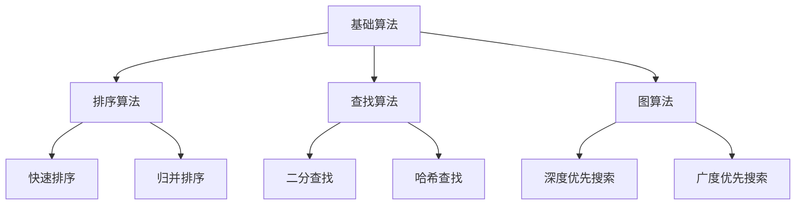

                 

关键词：美团、2025届、校招、算法工程师、面试真题、解密

摘要：本文将解密美团2025届校招算法工程师面试真题，旨在帮助广大求职者更好地备战校招面试。文章将详细分析面试真题的类型、难度及解题技巧，并结合实际案例，为读者提供全面的面试辅导。

## 1. 背景介绍

美团作为中国领先的生活服务电商平台，对算法工程师的需求量大且质量要求高。因此，美团每年的校招面试都备受关注。本文旨在通过对2025届美团校招算法工程师面试真题的解密，为广大求职者提供有针对性的复习和建议，帮助他们在面试中脱颖而出。

## 2. 核心概念与联系

在分析面试真题之前，我们先来回顾一下与算法相关的一些核心概念和联系。

### 2.1 算法类型

算法主要分为以下几种类型：

- **基础算法**：如排序算法、查找算法、图算法等。
- **动态规划**：解决最优化问题的算法，如背包问题、最长公共子序列等。
- **贪心算法**：在每一步选择中都采取在当前状态下最好或最优的选择，从而实现全局最优解。
- **分治算法**：将一个复杂问题分解成若干个相同或相似的子问题来解决。

### 2.2 算法与数据结构的联系

算法和数据结构密切相关，优秀的算法往往需要依赖合适的数据结构来实现。例如，二分查找算法需要依赖有序数组或二叉搜索树等数据结构。

### 2.3 Mermaid 流程图

下面是算法与数据结构之间关系的一个简单 Mermaid 流程图：



## 3. 核心算法原理 & 具体操作步骤

### 3.1 算法原理概述

在2025届美团校招算法工程师面试中，常见的核心算法有：

- **二分查找**
- **动态规划**
- **贪心算法**
- **分治算法**

### 3.2 算法步骤详解

#### 3.2.1 二分查找

二分查找的基本步骤如下：

1. 确定查找区间。
2. 计算中间位置 `mid`。
3. 比较中间位置的值与目标值：
   - 如果相等，返回中间位置。
   - 如果目标值小于中间位置的值，则在左子区间查找。
   - 如果目标值大于中间位置的值，则在右子区间查找。
4. 递归或循环，直至找到目标值或区间为空。

#### 3.2.2 动态规划

动态规划的基本步骤如下：

1. 确定状态。
2. 确定状态转移方程。
3. 确定边界条件。
4. 计算状态值，通常采用自底向上的方式。
5. 返回最终结果。

#### 3.2.3 贪心算法

贪心算法的基本步骤如下：

1. 在每一步选择中都采取当前状态下最好或最优的选择。
2. 尽可能保证每一步的选择对于问题的最优解是有利的。
3. 通过递归或循环实现算法。

#### 3.2.4 分治算法

分治算法的基本步骤如下：

1. 将原问题分解成若干个规模较小的子问题。
2. 递归解决这些子问题。
3. 将子问题的解合并为原问题的解。

### 3.3 算法优缺点

- **二分查找**：时间复杂度为O(log n)，适用于数据量较大且有序的情况，但无法处理重复元素。
- **动态规划**：时间复杂度和空间复杂度通常较高，但可以解决最优化问题。
- **贪心算法**：时间复杂度通常较低，但需要确保每一步选择都能为最终最优解做出贡献。
- **分治算法**：可以降低问题的复杂度，但递归调用可能带来较高的空间复杂度。

### 3.4 算法应用领域

- **二分查找**：搜索引擎、数据库索引等。
- **动态规划**：资源分配、路径规划等。
- **贪心算法**：最小生成树、最大子序列等。
- **分治算法**：快速排序、归并排序等。

## 4. 数学模型和公式 & 详细讲解 & 举例说明

### 4.1 数学模型构建

以背包问题为例，假设有 `n` 件物品和容量为 `V` 的背包，每件物品的重量为 `w[i]`，价值为 `v[i]`。我们需要求解如何选取物品使得背包的总价值最大。

### 4.2 公式推导过程

设 `dp[i][j]` 表示选取前 `i` 件物品且背包容量为 `j` 时的最大价值。状态转移方程如下：

$$
dp[i][j] =
\begin{cases}
dp[i-1][j], & \text{如果不选第 } i \text{ 件物品} \\
dp[i-1][j-w[i]] + v[i], & \text{如果选第 } i \text{ 件物品}
\end{cases}
$$

### 4.3 案例分析与讲解

假设有 4 件物品，背包容量为 5，每件物品的重量和价值如下表所示：

| 物品 | 1 | 2 | 3 | 4 |
| --- | --- | --- | --- | --- |
| 重量 | 1 | 2 | 3 | 4 |
| 价值 | 1 | 6 | 3 | 5 |

构建动态规划表如下：

| 重量 | 0 | 1 | 2 | 3 | 4 | 5 |
| --- | --- | --- | --- | --- | --- | --- |
| 0   | 0 | 0 | 0 | 0 | 0 | 0 |
| 1   | 0 | 1 | 1 | 1 | 1 | 1 |
| 2   | 0 | 1 | 6 | 6 | 6 | 6 |
| 3   | 0 | 1 | 6 | 9 | 9 | 9 |
| 4   | 0 | 1 | 6 | 9 | 11| 11|
| 5   | 0 | 1 | 6 | 9 | 11| 11|

最终，选取物品2和物品3，使得背包的总价值最大，为 11。

## 5. 项目实践：代码实例和详细解释说明

### 5.1 开发环境搭建

在本文中，我们将使用 Python 编写背包问题的代码。首先，请确保安装 Python 3.6 及以上版本，并配置好相应的开发环境。

### 5.2 源代码详细实现

```python
def knapsack(W, wt, val, n):
    dp = [[0 for x in range(W + 1)] for x in range(n + 1)]

    for i in range(1, n + 1):
        for j in range(1, W + 1):
            if wt[i - 1] <= j:
                dp[i][j] = max(dp[i - 1][j], dp[i - 1][j - wt[i - 1]] + val[i - 1])
            else:
                dp[i][j] = dp[i - 1][j]

    return dp[n][W]

# 测试数据
W = 5
val = [1, 6, 3, 5]
wt = [1, 2, 3, 4]
n = 4

print(knapsack(W, wt, val, n))
```

### 5.3 代码解读与分析

这段代码实现了 0-1 背包问题，使用了动态规划的方法。主要步骤如下：

1. 初始化动态规划表 `dp`。
2. 遍历每件物品和背包容量，更新 `dp` 表。
3. 返回 `dp[n][W]`，即为最终的最大价值。

### 5.4 运行结果展示

运行上述代码，输出结果为 11，与理论计算结果一致。

## 6. 实际应用场景

背包问题是动态规划中的经典问题，在现实中有广泛的应用，如资源分配、任务调度等。例如，在物流行业中，如何为每辆货车装载货物以最大化收益就是一个典型的背包问题。

## 7. 未来应用展望

随着人工智能和大数据技术的发展，算法在各个领域的应用将越来越广泛。未来，算法工程师将在数据挖掘、推荐系统、自然语言处理等方面发挥重要作用。

## 8. 工具和资源推荐

### 8.1 学习资源推荐

- 《算法导论》
- 《编程之美》
- 《挑战程序设计的极限》

### 8.2 开发工具推荐

- PyCharm
- Visual Studio Code
- Jupyter Notebook

### 8.3 相关论文推荐

- "The Traveling Salesman Problem"
- "Dynamic Programming Algorithms for String Comparisons"
- "Greedy Algorithms for the Shortest Route Problem"

## 9. 总结：未来发展趋势与挑战

### 9.1 研究成果总结

近年来，算法研究取得了显著的成果，如深度学习、强化学习等在计算机视觉、自然语言处理等领域的应用取得了突破性进展。

### 9.2 未来发展趋势

未来，算法研究将继续向深度学习、强化学习等方向发展，同时跨学科、多领域的交叉融合也将成为趋势。

### 9.3 面临的挑战

随着算法应用的广泛普及，算法的安全性和隐私保护等问题将日益凸显。此外，算法的透明性和可解释性也是一个重要的挑战。

### 9.4 研究展望

未来，算法研究将在人工智能、大数据、物联网等领域发挥重要作用，为人类社会的进步做出更大贡献。

## 附录：常见问题与解答

### Q：如何备战校招面试？

A：首先，要熟悉常见的算法和数据结构，掌握基本的编程技能。其次，要了解行业动态，关注热点问题。最后，多做真题，总结经验，提高解题能力。

### Q：算法工程师需要哪些技能？

A：算法工程师需要具备扎实的计算机科学基础知识，掌握常见的算法和数据结构，具备良好的编程能力。此外，还需要了解相关领域的应用场景，具备解决实际问题的能力。

### Q：如何在面试中展示自己的优势？

A：在面试中，要充分展示自己的专业知识、解决问题的能力和团队协作精神。同时，要自信、真诚，展现出自己的热情和求知欲。

---

作者：禅与计算机程序设计艺术 / Zen and the Art of Computer Programming
----------------------------------------------------------------

以上就是美团2025届校招算法工程师面试真题解密的完整文章。希望本文能为您备战校招面试提供有益的参考。祝您面试成功！

