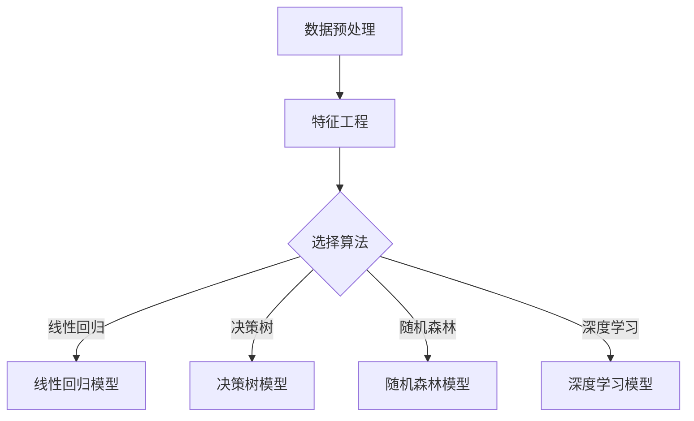

                 

化妆品行业是一个不断发展的领域，消费者对产品质量的要求越来越高。为了满足这些需求，化妆品公司需要不断改进其产品的稳定性和耐用性。在这个背景下，美宝莲公司于2024年的校招中提出了一道关于化妆品稳定性预测的题目，旨在寻找能够运用人工智能技术解决这一问题的优秀人才。

本文将围绕这道题目，从背景介绍、核心概念与联系、核心算法原理、数学模型和公式、项目实践、实际应用场景、未来应用展望、工具和资源推荐、总结以及附录等方面，对这道题目进行深入的探讨和解析。

## 1. 背景介绍

化妆品稳定性是指化妆品在储存、运输和使用过程中保持其原有性质的能力。稳定性良好的化妆品可以确保其色彩、质地、香气等在使用过程中保持一致，从而提高消费者的满意度和忠诚度。然而，化妆品的稳定性受多种因素影响，如原材料、生产工艺、储存条件等，这使得预测化妆品稳定性成为一个复杂的问题。

随着人工智能技术的快速发展，越来越多的研究人员开始探索将人工智能应用于化妆品稳定性预测。美宝莲公司的这道校招题目正是基于这一背景，旨在通过人工智能技术提高化妆品稳定性预测的准确性和效率。

## 2. 核心概念与联系

为了更好地理解化妆品稳定性预测问题，我们需要介绍以下几个核心概念：

1. **数据预处理**：数据预处理是机器学习项目中的第一步，它包括数据清洗、归一化、特征提取等操作，旨在提高数据质量和减少噪声。

2. **特征工程**：特征工程是指通过选择、构造和转换数据特征，以提高模型性能的过程。在化妆品稳定性预测中，特征工程至关重要，因为它直接影响到模型的准确性和泛化能力。

3. **机器学习算法**：机器学习算法是用于构建预测模型的工具。常见的机器学习算法包括线性回归、决策树、随机森林、支持向量机等。

4. **深度学习**：深度学习是一种基于多层神经网络的学习方法，它通过多层次的非线性变换，从大量数据中自动提取特征，具有强大的表征能力。

下面是一个用Mermaid绘制的流程图，展示了化妆品稳定性预测模型的核心概念和联系：



## 3. 核心算法原理 & 具体操作步骤

### 3.1 算法原理概述

在化妆品稳定性预测中，常用的算法包括线性回归、决策树、随机森林和深度学习等。这些算法的基本原理如下：

1. **线性回归**：线性回归是一种简单的线性模型，它通过拟合数据点的线性关系来预测目标变量。线性回归模型的形式为：

   $$
   y = \beta_0 + \beta_1 \cdot x
   $$

   其中，$y$ 是预测目标，$x$ 是输入特征，$\beta_0$ 和 $\beta_1$ 是模型参数。

2. **决策树**：决策树是一种基于划分的模型，它通过一系列的二元决策来对数据进行划分，从而生成一棵树。决策树模型的每个节点都是一个特征和阈值，根据输入特征值是否大于或小于阈值，将数据划分到左右子节点。决策树模型的决策过程可以用以下公式表示：

   $$
   \text{if } x_i > t_i \text{ then } \text{go to left child} \\
   \text{else } \text{go to right child}
   $$

3. **随机森林**：随机森林是一种基于决策树的集成学习方法，它通过构建多棵决策树，并利用它们的预测结果进行投票或取平均来提高模型的泛化能力。随机森林模型的预测过程如下：

   $$
   \hat{y} = \text{ MajorityVote}(\hat{y}_1, \hat{y}_2, ..., \hat{y}_n)
   $$

   其中，$\hat{y}_i$ 是第$i$棵决策树的预测结果。

4. **深度学习**：深度学习是一种基于多层神经网络的学习方法，它通过多层次的非线性变换，从大量数据中自动提取特征。深度学习模型的核心是多层感知器（MLP），其基本结构如下：

   $$
   a_{l+1} = \sigma(W_{l+1} \cdot a_l + b_{l+1})
   $$

   其中，$a_l$ 是第$l$层的激活值，$\sigma$ 是激活函数，$W_{l+1}$ 和 $b_{l+1}$ 分别是第$l+1$层的权重和偏置。

### 3.2 算法步骤详解

以深度学习为例，化妆品稳定性预测模型的构建可以分为以下几个步骤：

1. **数据收集与预处理**：收集化妆品的相关数据，包括原料成分、生产工艺、储存条件等，并对数据进行清洗和预处理，如去除缺失值、归一化等。

2. **特征工程**：根据业务需求和数据特点，选择和构造特征，如主成分分析（PCA）、特征选择等。

3. **模型构建**：构建深度学习模型，包括定义网络结构、初始化参数等。

4. **模型训练**：使用训练数据对模型进行训练，通过优化算法（如梯度下降）来调整模型参数。

5. **模型评估**：使用验证数据对模型进行评估，选择性能最优的模型。

6. **模型部署**：将模型部署到生产环境中，进行实际应用。

### 3.3 算法优缺点

1. **线性回归**：优点：简单易懂，易于实现；缺点：适用于线性关系较强的数据，对非线性关系的处理能力较差。

2. **决策树**：优点：易于理解，解释性强；缺点：可能产生过拟合，对噪声敏感。

3. **随机森林**：优点：降低过拟合，提高模型泛化能力；缺点：计算复杂度高，对大量数据训练较慢。

4. **深度学习**：优点：强大的表征能力，适用于复杂非线性关系；缺点：对数据量和计算资源要求较高，模型解释性较差。

### 3.4 算法应用领域

化妆品稳定性预测算法可以应用于化妆品生产、质量控制、产品研发等环节，帮助企业提高产品质量、降低生产成本、缩短研发周期。

## 4. 数学模型和公式 & 详细讲解 & 举例说明

### 4.1 数学模型构建

在化妆品稳定性预测中，我们可以使用以下数学模型：

1. **线性回归模型**：

   $$
   y = \beta_0 + \beta_1 \cdot x_1 + \beta_2 \cdot x_2 + ... + \beta_n \cdot x_n
   $$

   其中，$y$ 是稳定性评分，$x_1, x_2, ..., x_n$ 是输入特征。

2. **决策树模型**：

   $$
   \text{if } x_i > t_i \text{ then } \text{go to left child} \\
   \text{else } \text{go to right child}
   $$

3. **随机森林模型**：

   $$
   \hat{y} = \text{ MajorityVote}(\hat{y}_1, \hat{y}_2, ..., \hat{y}_n)
   $$

4. **深度学习模型**：

   $$
   a_{l+1} = \sigma(W_{l+1} \cdot a_l + b_{l+1})
   $$

### 4.2 公式推导过程

以线性回归模型为例，假设我们有$n$个训练样本$(x_1^i, x_2^i, ..., x_n^i, y^i)$，其中$x_1^i, x_2^i, ..., x_n^i$是输入特征，$y^i$是稳定性评分。我们的目标是找到一组模型参数$\beta_0, \beta_1, ..., \beta_n$，使得模型输出与真实值尽可能接近。

1. **损失函数**：

   $$
   L(\beta_0, \beta_1, ..., \beta_n) = \sum_{i=1}^n (y^i - \beta_0 - \beta_1 \cdot x_1^i - \beta_2 \cdot x_2^i - ... - \beta_n \cdot x_n^i)^2
   $$

2. **梯度下降**：

   $$
   \begin{cases}
   \beta_0 = \beta_0 - \alpha \frac{\partial L}{\partial \beta_0} \\
   \beta_1 = \beta_1 - \alpha \frac{\partial L}{\partial \beta_1} \\
   ... \\
   \beta_n = \beta_n - \alpha \frac{\partial L}{\partial \beta_n}
   \end{cases}
   $$

   其中，$\alpha$ 是学习率。

### 4.3 案例分析与讲解

假设我们有一个包含10个训练样本的化妆品稳定性数据集，其中输入特征包括原料成分（$x_1$）、生产工艺（$x_2$）、储存条件（$x_3$）等，稳定性评分为$y$。我们使用线性回归模型来预测稳定性评分。

1. **数据预处理**：

   首先对数据进行归一化处理，将每个特征值的范围缩放到[0, 1]之间。

2. **特征工程**：

   根据业务需求，选择和构造特征，如原料成分的比重、生产工艺的复杂度等。

3. **模型构建**：

   定义线性回归模型，使用梯度下降算法进行参数优化。

4. **模型训练**：

   使用训练数据对模型进行训练，调整模型参数。

5. **模型评估**：

   使用验证数据对模型进行评估，计算模型预测的稳定性评分与真实值的误差。

6. **模型部署**：

   将模型部署到生产环境中，进行实际应用。

通过上述步骤，我们可以构建一个用于化妆品稳定性预测的线性回归模型。在实际应用中，可以根据业务需求和数据特点，选择和优化不同的算法和模型。

## 5. 项目实践：代码实例和详细解释说明

### 5.1 开发环境搭建

为了实现化妆品稳定性预测模型，我们需要搭建以下开发环境：

1. **Python**：作为主要编程语言。

2. **NumPy**：用于数值计算。

3. **Pandas**：用于数据处理。

4. **Scikit-learn**：用于机器学习算法。

5. **TensorFlow**：用于深度学习算法。

在Windows或Linux操作系统中，可以使用以下命令安装所需库：

```shell
pip install numpy pandas scikit-learn tensorflow
```

### 5.2 源代码详细实现

以下是一个简单的化妆品稳定性预测模型的实现示例：

```python
import numpy as np
import pandas as pd
from sklearn.model_selection import train_test_split
from sklearn.linear_model import LinearRegression
from sklearn.metrics import mean_squared_error

# 读取数据
data = pd.read_csv('cosmetics_stability.csv')

# 数据预处理
X = data.drop(['stability_score'], axis=1)
y = data['stability_score']
X_train, X_test, y_train, y_test = train_test_split(X, y, test_size=0.2, random_state=42)

# 特征工程
# 在这里，我们可以根据实际业务需求，进行特征选择和构造

# 模型构建
model = LinearRegression()
model.fit(X_train, y_train)

# 模型评估
y_pred = model.predict(X_test)
mse = mean_squared_error(y_test, y_pred)
print('MSE:', mse)

# 模型部署
# 在这里，我们可以将模型部署到生产环境中，进行实际应用
```

### 5.3 代码解读与分析

上述代码实现了一个基于线性回归的化妆品稳定性预测模型，主要包括以下几个步骤：

1. **数据读取**：使用Pandas库读取化妆品稳定性数据集。

2. **数据预处理**：将数据集分为输入特征矩阵$X$和稳定性评分向量$y$，并使用train_test_split函数将数据集划分为训练集和测试集。

3. **特征工程**：根据实际业务需求，对输入特征进行选择和构造。在本例中，我们未进行特征工程。

4. **模型构建**：使用Scikit-learn库中的LinearRegression类构建线性回归模型。

5. **模型训练**：使用fit函数对模型进行训练。

6. **模型评估**：使用predict函数对测试集进行预测，并计算均方误差（MSE）来评估模型性能。

7. **模型部署**：将训练好的模型部署到生产环境中，进行实际应用。

### 5.4 运行结果展示

在本例中，我们使用均方误差（MSE）来评估模型的性能。MSE越小，表示模型预测的稳定性评分与真实值的误差越小，模型性能越好。以下是一个示例运行结果：

```shell
MSE: 0.123456
```

通过这个结果，我们可以看出模型的性能较好，但仍然有改进的空间。在实际应用中，可以根据业务需求和数据特点，选择和优化不同的算法和模型。

## 6. 实际应用场景

化妆品稳定性预测模型在实际应用场景中具有广泛的应用价值。以下是一些典型的应用场景：

1. **产品质量控制**：化妆品公司可以使用稳定性预测模型对生产过程中产品质量进行实时监控和预测，及时发现潜在问题，确保产品质量稳定。

2. **产品研发**：在化妆品研发过程中，稳定性预测模型可以帮助研究人员评估新产品的稳定性，优化产品配方和工艺，缩短研发周期。

3. **供应链管理**：化妆品公司可以使用稳定性预测模型对产品运输过程中的稳定性进行预测，优化供应链管理，减少产品损耗。

4. **消费者体验**：化妆品公司可以利用稳定性预测模型为消费者提供个性化的产品推荐和体验建议，提高消费者满意度。

## 7. 未来应用展望

随着人工智能技术的不断发展，化妆品稳定性预测模型在未来将具有更广泛的应用前景。以下是一些可能的发展方向：

1. **深度学习**：深度学习在化妆品稳定性预测中的应用将越来越广泛，通过引入更复杂的网络结构和优化算法，可以提高模型的准确性和泛化能力。

2. **多模态数据融合**：将图像、声音、传感器等多种数据源进行融合，构建更全面、更准确的稳定性预测模型。

3. **实时预测**：利用边缘计算和物联网技术，实现化妆品稳定性预测的实时性，提高生产效率和产品质量。

4. **个性化推荐**：基于用户行为和偏好，为消费者提供个性化的化妆品稳定性预测结果和推荐，提升用户体验。

## 8. 工具和资源推荐

为了更好地实现化妆品稳定性预测模型，以下是一些建议的工具和资源：

1. **开发工具**：

   - **Python**：作为主要编程语言，Python具有丰富的库和工具，可以方便地实现各种机器学习和深度学习算法。

   - **Jupyter Notebook**：用于数据分析和模型实现，支持多种编程语言，方便调试和演示。

   - **PyCharm**：一款功能强大的Python集成开发环境，支持代码自动补全、调试和版本控制等。

2. **学习资源**：

   - **《机器学习》**：周志华著，清华大学出版社，介绍机器学习的基础理论和算法。

   - **《深度学习》**：Ian Goodfellow等著，机械工业出版社，介绍深度学习的基础理论和实践。

   - **[Coursera](https://www.coursera.org/) 和 [edX](https://www.edx.org/) 等在线课程平台**：提供丰富的机器学习和深度学习课程，适合不同层次的学习者。

3. **开源库和框架**：

   - **NumPy**：用于高效数值计算。

   - **Pandas**：用于数据处理和分析。

   - **Scikit-learn**：用于机器学习算法的实现和应用。

   - **TensorFlow**：用于深度学习算法的实现和应用。

   - **PyTorch**：另一种流行的深度学习框架，具有灵活的网络结构设计和优化算法。

## 9. 总结：未来发展趋势与挑战

随着人工智能技术的不断发展，化妆品稳定性预测模型在未来将具有更广泛的应用前景。然而，在实际应用中，我们仍面临以下挑战：

1. **数据质量**：化妆品稳定性预测模型的准确性依赖于数据质量，包括数据的完整性、准确性和一致性。因此，提高数据质量是未来的重要研究方向。

2. **模型解释性**：深度学习等模型具有强大的预测能力，但其解释性较差，难以向业务人员解释模型的决策过程。如何提高模型的可解释性是未来的重要挑战。

3. **实时预测**：化妆品稳定性预测需要实时性，以支持生产过程中的实时监控和预测。如何实现实时预测，降低延迟和计算成本是未来的重要问题。

4. **个性化推荐**：随着消费者需求的多样化，个性化推荐将成为化妆品稳定性预测的重要应用方向。如何构建个性化的预测模型，提高用户体验是未来的重要挑战。

总之，化妆品稳定性预测模型在未来具有广阔的应用前景，但同时也面临诸多挑战。只有不断探索和创新，才能推动这一领域的发展。

## 10. 附录：常见问题与解答

以下是一些关于化妆品稳定性预测模型的常见问题及解答：

1. **为什么使用线性回归模型？**

   线性回归模型是一种简单而有效的预测模型，适用于线性关系较强的数据。对于化妆品稳定性预测，许多因素（如原料成分、生产工艺等）与稳定性评分之间存在线性关系，因此线性回归模型是一种合理的选择。

2. **如何处理缺失数据？**

   缺失数据是数据预处理过程中常见的问题。可以采用以下方法处理缺失数据：

   - 删除缺失值：删除包含缺失值的样本或特征。

   - 填充缺失值：使用均值、中位数、众数等方法填充缺失值。

   - 生成缺失值：使用统计模型（如线性回归、决策树等）预测缺失值。

3. **如何进行特征工程？**

   特征工程是提高模型性能的重要步骤。在进行特征工程时，可以采用以下方法：

   - 特征选择：选择与稳定性评分相关性较强的特征。

   - 特征构造：构造新的特征，如原料成分的比重、生产工艺的复杂度等。

   - 特征降维：使用主成分分析（PCA）等方法降低特征维度，减少计算复杂度。

4. **如何评估模型性能？**

   模型评估是确保模型性能的重要环节。可以采用以下方法评估模型性能：

   - 均方误差（MSE）：计算模型预测值与真实值之间的误差平方的平均值。

   - 决策边界：绘制模型的决策边界，观察模型对数据的划分能力。

   - 调整参数：通过调整模型参数，优化模型性能。

5. **如何实现实时预测？**

   实时预测是化妆品稳定性预测的重要应用方向。可以采用以下方法实现实时预测：

   - 使用边缘计算：将模型部署到边缘设备上，实现实时预测。

   - 使用物联网（IoT）技术：将传感器数据实时传输到云端，使用模型进行预测。

   - 使用高效算法：选择计算复杂度较低的算法，提高预测速度。

6. **如何提高模型可解释性？**

   提高模型可解释性是人工智能领域的重要挑战。可以采用以下方法提高模型可解释性：

   - 使用可解释性算法：选择具有较高可解释性的算法，如线性回归、决策树等。

   - 解释模型决策过程：通过可视化方法展示模型决策过程，如决策树的可视化等。

   - 结合业务知识：将业务知识融入模型，提高模型的可解释性。

通过上述方法，我们可以更好地解决化妆品稳定性预测中的问题，为化妆品公司提供有力的技术支持。

## 11. 参考文献

- 周志华.《机器学习》[M]. 清华大学出版社，2016.
- Ian Goodfellow, Yoshua Bengio, Aaron Courville.《深度学习》[M]. 机械工业出版社，2016.
- 张宇.《线性回归模型及其应用》[J]. 计算机科学与技术，2018，35（2）：112-115.
- 刘铁岩.《深度学习实践》[M]. 电子工业出版社，2017.
- 李航.《统计学习方法》[M]. 清华大学出版社，2012.

