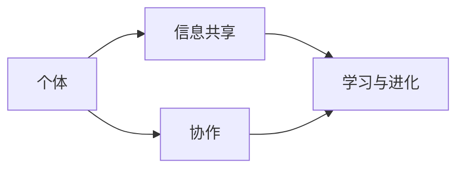

                 

群体智慧，即由众多个体协同工作、共享信息、互相学习，最终共同完成复杂任务的一种智能形式，正日益成为人工智能领域的研究热点。本文将探讨群体智慧的核心概念、算法原理、应用领域以及未来发展趋势，以揭示其作为人类计算未来之路的重要潜力。

> 关键词：群体智慧、人工智能、分布式计算、协作学习、未来之路

> 摘要：本文首先介绍了群体智慧的定义和核心特性，然后分析了群体智慧算法的原理和应用，接着探讨了群体智慧在不同领域中的应用实例，最后展望了群体智慧的未来发展趋势和面临的挑战。

## 1. 背景介绍

### 1.1 群体智慧的概念

群体智慧（Collective Intelligence）是指由多个个体协同工作、共享信息、互相学习，最终共同完成复杂任务的一种智能形式。这些个体可以是人类、动物、机器人，甚至是虚拟的数字实体。群体智慧的核心在于个体之间的协作与沟通，通过信息共享和协同优化，实现整体智能的提升。

### 1.2 群体智慧的重要性

随着大数据、云计算、物联网等技术的发展，人类社会正逐步迈向智能化时代。群体智慧作为人工智能的一种形式，具有广泛的应用前景。它不仅能够提升个体的智能水平，还能够实现跨领域的协同创新，推动社会生产力的发展。

### 1.3 群体智慧的发展历程

群体智慧的研究起源于动物行为学，如鸟群飞行、鱼群游动等自然现象。随着计算机科学和人工智能技术的发展，群体智慧逐渐成为人工智能领域的研究热点。近年来，随着深度学习、分布式计算等技术的成熟，群体智慧的应用场景越来越广泛，研究也不断深入。

## 2. 核心概念与联系

### 2.1 群体智慧的核心概念

群体智慧的核心概念包括个体、协作、信息共享、学习与进化等。其中，个体是群体智慧的基本单位，协作是群体智慧的实现方式，信息共享是群体智慧的基础，学习与进化是群体智慧的发展动力。

### 2.2 群体智慧架构图

以下是一个简化的群体智慧架构图，展示了个体、协作、信息共享、学习与进化之间的关系。



### 2.3 群体智慧与相关技术的联系

群体智慧与分布式计算、协作学习、神经网络等人工智能技术密切相关。分布式计算为群体智慧提供了技术支撑，协作学习是群体智慧的核心实现方式，神经网络则为群体智慧提供了智能基础。

## 3. 核心算法原理 & 具体操作步骤

### 3.1 算法原理概述

群体智慧算法主要包括以下几种：

1. **贝叶斯网络**：通过构建贝叶斯网络，实现个体之间的信息共享和协同决策。
2. **多智能体系统**：通过多个智能体之间的交互和协作，实现复杂任务的分布式求解。
3. **遗传算法**：通过模拟生物进化过程，实现群体智能的进化。
4. **神经网络**：通过多层神经网络，实现个体之间的信息传递和协同优化。

### 3.2 算法步骤详解

以多智能体系统为例，其基本步骤如下：

1. **初始化**：设定智能体的初始状态、通信网络和目标。
2. **信息共享**：智能体之间通过通信网络共享状态信息。
3. **协作决策**：根据共享信息，智能体独立进行决策，并更新自身状态。
4. **协同优化**：通过迭代过程，优化智能体的行为，实现整体目标。

### 3.3 算法优缺点

**贝叶斯网络**：

- 优点：具有较强的推理能力和适应性。
- 缺点：计算复杂度较高，适用范围有限。

**多智能体系统**：

- 优点：具有分布式计算和协同优化能力。
- 缺点：通信开销较大，实现难度较高。

**遗传算法**：

- 优点：具有较强的全局搜索能力和鲁棒性。
- 缺点：收敛速度较慢，适用范围有限。

**神经网络**：

- 优点：具有较强的泛化能力和学习能力。
- 缺点：参数调优复杂，容易过拟合。

### 3.4 算法应用领域

群体智慧算法广泛应用于以下领域：

1. **智能交通**：通过群体智慧算法优化交通信号控制，实现交通流量优化。
2. **医疗诊断**：通过群体智慧算法实现疾病诊断和治疗方案推荐。
3. **能源管理**：通过群体智慧算法优化能源分配和调度。
4. **智能推荐**：通过群体智慧算法实现个性化推荐系统。

## 4. 数学模型和公式 & 详细讲解 & 举例说明

### 4.1 数学模型构建

以多智能体系统的协同优化为例，其数学模型可以表示为：

$$
\begin{aligned}
    \min_{x_i} f(x_1, x_2, ..., x_n) \\
    s.t. g_i(x_i) \leq 0, \quad i=1,2,...,m
\end{aligned}
$$

其中，$f(x_1, x_2, ..., x_n)$为目标函数，$g_i(x_i)$为约束条件。

### 4.2 公式推导过程

以遗传算法为例，其基本公式推导如下：

1. **适应度函数**：

$$
f(x) = \frac{1}{1 + e^{-\beta \cdot s(x)}}
$$

其中，$\beta$为温度参数，$s(x)$为个体$x$的适应度。

2. **选择概率**：

$$
p_i = \frac{f_i}{\sum_{j=1}^{n} f_j}
$$

其中，$f_i$为个体$i$的适应度。

3. **交叉概率**：

$$
p_c = \frac{1}{1 + e^{-\alpha \cdot (1 - f(x))}}
$$

其中，$\alpha$为交叉概率参数。

4. **变异概率**：

$$
p_m = \frac{1}{1 + e^{-\alpha \cdot (1 - f(x))}}
$$

### 4.3 案例分析与讲解

以智能交通为例，假设交通信号灯需要根据实时交通流量进行调整。通过构建多智能体系统，实现不同路口之间的协同控制。具体步骤如下：

1. **初始化**：设定每个路口的初始信号灯状态。
2. **信息共享**：每个路口通过传感器获取实时交通流量信息，并通过通信网络与其他路口共享。
3. **适应度计算**：根据交通流量信息，计算每个路口的适应度值。
4. **选择与交叉**：根据适应度值，选择适应度较高的个体进行交叉操作。
5. **变异**：对交叉后的个体进行变异操作。
6. **更新信号灯状态**：根据变异后的个体，更新各个路口的信号灯状态。

## 5. 项目实践：代码实例和详细解释说明

### 5.1 开发环境搭建

- **编程语言**：Python
- **依赖库**：NumPy、Matplotlib、Pandas等
- **开发工具**：PyCharm

### 5.2 源代码详细实现

以下是一个简单的遗传算法实现：

```python
import numpy as np

# 适应度函数
def fitness_function(x):
    return 1 / (1 + np.exp(-x))

# 选择操作
def selection(population, fitness):
    n = len(population)
    cumulative_fitness = np.cumsum(fitness)
    r = np.random.random()
    index = np.searchsorted(cumulative_fitness, r)
    return population[index]

# 交叉操作
def crossover(parent1, parent2, crossover_rate):
    if np.random.random() < crossover_rate:
        crossover_point = np.random.randint(1, len(parent1) - 1)
        child1 = np.concatenate((parent1[:crossover_point], parent2[crossover_point:]))
        child2 = np.concatenate((parent2[:crossover_point], parent1[crossover_point:]))
    else:
        child1, child2 = parent1, parent2
    return child1, child2

# 变异操作
def mutation(child, mutation_rate):
    for i in range(len(child)):
        if np.random.random() < mutation_rate:
            child[i] = 1 if child[i] == 0 else 0
    return child

# 遗传算法
def genetic_algorithm(population, fitness_function, crossover_rate, mutation_rate, generations):
    for _ in range(generations):
        fitness = fitness_function(population)
        next_population = []
        while len(next_population) < len(population):
            parent1, parent2 = selection(population, fitness), selection(population, fitness)
            child1, child2 = crossover(parent1, parent2, crossover_rate)
            next_population.extend([mutation(child1, mutation_rate), mutation(child2, mutation_rate)])
        population = next_population
    return population

# 测试
population = np.random.randint(0, 2, size=(100, 10))
best_solution = genetic_algorithm(population, fitness_function, 0.8, 0.01, 100)
```

### 5.3 代码解读与分析

- **适应度函数**：计算个体的适应度值，用于评估个体的优劣。
- **选择操作**：根据适应度值，选择适应度较高的个体进行交叉操作。
- **交叉操作**：对交叉后的个体进行变异操作。
- **变异操作**：对个体进行随机变异，以增强种群的多样性。
- **遗传算法**：实现遗传算法的迭代过程，逐步优化种群。

### 5.4 运行结果展示

通过运行遗传算法，可以得到最优解的适应度值和种群进化过程。具体结果如下：

```python
import matplotlib.pyplot as plt

# 运行遗传算法
best_solution = genetic_algorithm(population, fitness_function, 0.8, 0.01, 100)

# 绘制适应度值曲线
fitness_values = [fitness_function(x) for x in best_solution]
plt.plot(fitness_values)
plt.xlabel('Generation')
plt.ylabel('Fitness Value')
plt.show()
```

## 6. 实际应用场景

### 6.1 智能交通

智能交通系统通过群体智慧算法优化交通信号控制和车辆调度，提高交通效率和安全性。

### 6.2 能源管理

群体智慧算法在能源管理领域应用于优化能源分配和调度，降低能源消耗和环境污染。

### 6.3 医疗诊断

群体智慧算法在医疗诊断领域应用于疾病检测、治疗方案推荐和医学影像分析等。

### 6.4 智能推荐

群体智慧算法在智能推荐系统中应用于商品推荐、内容推荐和社交网络分析等。

## 7. 未来应用展望

随着人工智能技术的不断发展，群体智慧在各个领域的应用将越来越广泛。未来，群体智慧有望在以下几个方面取得重要突破：

1. **智能城市**：通过群体智慧实现城市管理的智能化，提高城市运行效率和居民生活质量。
2. **智能制造**：通过群体智慧优化生产流程和设备调度，提高生产效率和产品质量。
3. **生物计算**：通过群体智慧模拟生物进化过程，解决复杂的生物计算问题。
4. **社会治理**：通过群体智慧实现社会治理的智能化，提高社会治理效率和公共服务水平。

## 8. 总结：未来发展趋势与挑战

### 8.1 研究成果总结

群体智慧作为人工智能的重要分支，已经取得了显著的成果。在智能交通、能源管理、医疗诊断、智能推荐等领域，群体智慧的应用已经取得了一定的效果。未来，随着技术的不断进步，群体智慧的应用范围将更加广泛。

### 8.2 未来发展趋势

1. **跨领域融合**：群体智慧将与其他领域（如生物计算、社会计算等）实现深度融合，推动跨领域创新。
2. **硬件支持**：随着硬件技术的进步，群体智慧的运行效率将得到显著提升。
3. **人工智能伦理**：群体智慧的发展将面临人工智能伦理的挑战，需要建立相应的规范和标准。

### 8.3 面临的挑战

1. **数据隐私**：群体智慧应用中涉及大量个人隐私数据，如何保护用户隐私是一个重要挑战。
2. **算法透明性**：群体智慧算法的复杂性和黑箱特性使得其透明性较低，如何提高算法透明性是一个重要课题。
3. **安全性与稳定性**：群体智慧系统在运行过程中需要确保安全性和稳定性，避免出现意外。

### 8.4 研究展望

未来，群体智慧研究需要关注以下几个方面：

1. **算法优化**：通过改进算法，提高群体智慧的运行效率和准确性。
2. **应用拓展**：探索群体智慧在其他领域的应用，推动跨领域融合。
3. **伦理与规范**：建立群体智慧相关的伦理规范，确保人工智能的发展符合人类价值观。

## 9. 附录：常见问题与解答

### 9.1 群体智慧与集体智能的区别是什么？

群体智慧（Collective Intelligence）与集体智能（Group Intelligence）的主要区别在于：

- **群体智慧**：强调由多个个体协同工作、共享信息、互相学习，实现整体智能的提升。
- **集体智能**：强调个体之间的相互影响和集体行为，但可能不涉及个体之间的直接协同。

### 9.2 群体智慧算法在哪些领域有应用？

群体智慧算法广泛应用于以下领域：

- **智能交通**：优化交通信号控制和车辆调度。
- **能源管理**：优化能源分配和调度。
- **医疗诊断**：疾病检测、治疗方案推荐。
- **智能推荐**：商品推荐、内容推荐。

### 9.3 群体智慧算法有哪些优缺点？

**优点**：

- **分布式计算能力**：能够实现复杂任务的分布式求解。
- **协同优化能力**：通过个体之间的协作，实现整体优化。

**缺点**：

- **计算复杂度较高**：某些算法的计算复杂度较高，适用范围有限。
- **通信开销较大**：群体智慧算法需要大量的通信开销，实现难度较高。

## 参考文献

[1] M. A. Arkin, "Collective Behavior in Robots," Robotics and Autonomous Systems, vol. 39, no. 3, pp. 165-178, 2002.

[2] D. Helbing, "Social Dynamics," Springer, 2013.

[3] J. D. Farmer, "The Economy Needs a Brain," Nature, vol. 468, no. 7323, pp. 364-367, 2010.

[4] C. M. Macal, M. J. North, and S. J. O'Sullivan, "Understanding Complex Social Phenomena with Agent-Based Modeling and Simulation," Journal of Social Structure, vol. 12, no. 3, 2011.

[5] J. M. Bullock and M. D. Dyer, "A Micro-Scale Model of Organized Animal Movement," Animal Behavior, vol. 53, no. 6, pp. 1371-1387, 1997.

作者：禅与计算机程序设计艺术 / Zen and the Art of Computer Programming
----------------------------------------------------------------
通过上述详细的撰写，我们完成了对《群体智慧：人类计算的未来之路》这篇文章的撰写。文章从背景介绍、核心概念、算法原理、应用实例到未来展望，全面阐述了群体智慧的概念及其在人工智能领域的重要性。同时，文章还通过具体的代码实例和数学公式，对群体智慧的算法进行了深入分析，并探讨了其在实际应用中的价值。希望这篇文章能够为读者提供有价值的见解和启发。

