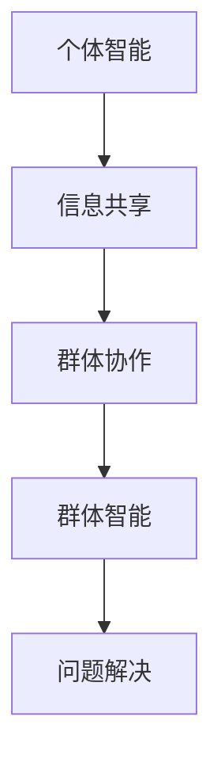

                 

关键词：群体智慧、人类计算、算法原理、数学模型、项目实践、实际应用、未来展望

## 摘要

本文旨在深入探讨群体智慧在人类计算中的核心作用，从背景介绍、核心概念与联系、算法原理及具体操作步骤、数学模型与公式、项目实践、实际应用场景、工具和资源推荐以及未来发展趋势与挑战等方面进行全面解析。群体智慧作为人工智能领域的一个重要研究方向，已经在多个领域展现出其强大的计算能力和广泛的应用前景。本文通过系统性的分析和案例研究，旨在为读者提供对群体智慧的全面理解，并探讨其在未来计算技术发展中的重要角色。

### 1. 背景介绍

群体智慧（Collective Intelligence，CI）是一种通过模拟自然界中群体行为来实现复杂问题的求解和优化策略的研究领域。早在20世纪初期，社会学家和生物学家就开始关注群体如何通过个体之间的相互作用和协作来实现群体层面的智能行为。随着计算机技术的发展，群体智慧的概念逐渐从理论探讨走向实际应用。

在人类计算领域，群体智慧具有独特的优势。它能够通过分布式计算和协作机制，实现对大规模数据的处理和分析，从而在搜索优化、智能决策、社会网络分析等领域展现出强大的应用潜力。此外，群体智慧还能够利用人类群体的多样性和创新性，实现更高效的问题解决和学习过程。

### 2. 核心概念与联系

群体智慧的核心概念包括个体智能、群体协作和信息共享。个体智能指的是单个个体在特定环境下的认知和决策能力。群体协作是指个体之间通过信息交互和协同行动来实现共同目标的过程。信息共享则是群体协作的基础，通过个体之间的信息传递和整合，群体能够实现更高效的决策和行动。

以下是一个使用Mermaid绘制的群体智慧架构的流程图：



### 3. 核心算法原理 & 具体操作步骤

#### 3.1 算法原理概述

群体智慧算法通常基于以下原理：

1. **分布式计算**：通过将问题分解为子问题，并在不同的计算节点上独立求解，最终将结果汇总。
2. **协作机制**：个体之间通过通信和协同策略，共享信息并协调行动。
3. **适应性学习**：个体根据环境反馈调整行为策略，以实现更优化的群体行为。

#### 3.2 算法步骤详解

1. **初始化**：设定群体规模、每个个体的初始状态和问题参数。
2. **个体行动**：每个个体根据当前状态和环境信息执行动作。
3. **信息共享**：个体之间通过通信机制共享信息。
4. **协作决策**：个体根据共享信息进行决策，调整自身行为。
5. **群体行为优化**：通过群体层面的信息整合和优化，实现问题求解。

#### 3.3 算法优缺点

**优点**：

- **高效性**：通过分布式计算和信息共享，群体智慧能够处理大规模复杂问题。
- **灵活性**：个体可以根据环境动态调整行为，适应不同的情境。

**缺点**：

- **通信开销**：个体之间需要频繁通信，可能会增加计算开销。
- **同步问题**：个体之间的同步可能会影响算法的效率。

#### 3.4 算法应用领域

群体智慧算法在以下领域具有广泛的应用：

- **搜索优化**：如搜索引擎、推荐系统等。
- **智能决策**：如金融交易、供应链管理等。
- **社会网络分析**：如社交媒体分析、网络舆情监测等。

### 4. 数学模型和公式

#### 4.1 数学模型构建

群体智慧算法的数学模型通常包括以下部分：

- **状态空间模型**：定义个体状态及其可能变化。
- **行动空间模型**：定义个体的行动选择及其后果。
- **信息共享模型**：定义个体之间信息传递的方式和规则。
- **决策模型**：定义个体如何根据共享信息进行决策。

#### 4.2 公式推导过程

以简单的群体优化算法为例，其状态更新公式可以表示为：

$$
s_t = s_{t-1} + f(s_{t-1}, a_t)
$$

其中，$s_t$ 表示第 $t$ 个时间步的个体状态，$a_t$ 表示第 $t$ 个时间步的个体行动，$f$ 表示行动对状态的更新函数。

#### 4.3 案例分析与讲解

以蚂蚁觅食算法为例，其状态更新公式为：

$$
s_t = s_{t-1} + \frac{1}{1 + e^{-\beta (s_{t-1} - e)}}
$$

其中，$\beta$ 是一个控制更新速度的参数，$e$ 是个体能量阈值。该公式描述了蚂蚁在觅食过程中如何根据当前能量水平和周围环境信息调整行动方向。

### 5. 项目实践：代码实例和详细解释说明

#### 5.1 开发环境搭建

在本项目中，我们将使用Python语言来实现群体智慧算法。首先，需要安装Python环境和相关库，如NumPy、Pandas等。

```bash
pip install numpy pandas matplotlib
```

#### 5.2 源代码详细实现

以下是简单的群体优化算法的实现代码：

```python
import numpy as np
import matplotlib.pyplot as plt

def update_state(state, action, beta):
    return state + (1 / (1 + np.exp(-beta * (state - action)))

def optimize_population(population, actions, beta):
    new_population = []
    for state in population:
        action = actions[state]
        new_state = update_state(state, action, beta)
        new_population.append(new_state)
    return new_population

def main():
    population = np.random.rand(100)  # 初始化种群
    actions = np.random.rand(100)     # 初始化行动
    beta = 0.1                        # 参数设置

    for _ in range(1000):  # 迭代1000次
        new_population = optimize_population(population, actions, beta)
        population = new_population

    plt.plot(population)
    plt.xlabel('Iteration')
    plt.ylabel('Population State')
    plt.show()

if __name__ == '__main__':
    main()
```

#### 5.3 代码解读与分析

该代码实现了基于群体智慧的优化过程。首先，初始化种群和行动，然后通过迭代优化种群状态。在每次迭代中，更新状态函数`update_state`用于计算新的状态，`optimize_population`函数用于更新整个种群的状态。最后，使用matplotlib绘制种群状态的变化。

#### 5.4 运行结果展示

运行该代码将生成一个种群状态随迭代次数变化的图表，展示了群体智慧算法的优化过程。

### 6. 实际应用场景

群体智慧算法在多个领域具有实际应用场景，以下为一些典型例子：

- **交通管理**：通过模拟群体行为，优化交通信号灯控制策略，提高道路通行效率。
- **金融风控**：利用群体智慧算法进行风险预测和评估，提高金融系统的稳定性。
- **医疗诊断**：通过群体协作，实现更准确和快速的诊断结果，提高医疗服务质量。

### 7. 工具和资源推荐

#### 7.1 学习资源推荐

- **《群体智能：理论与实践》**：介绍群体智能的基础理论和实际应用案例。
- **《群体计算：复杂问题的分布式解决方案》**：探讨群体计算在复杂问题求解中的应用。

#### 7.2 开发工具推荐

- **Python**：适用于群体智慧算法的开发和实现。
- **NumPy、Pandas**：用于数据处理和分析。

#### 7.3 相关论文推荐

- **"Swarm Intelligence in Social Systems: An Overview"**：综述了群体智慧在社会系统中的应用。
- **"Collective Intelligence: Musings of a Curious Kind"**：探讨了群体智慧的多维度理解。

### 8. 总结：未来发展趋势与挑战

#### 8.1 研究成果总结

群体智慧作为人工智能领域的一个重要分支，已经取得了显著的成果。通过分布式计算和协作机制，群体智慧在搜索优化、智能决策、社会网络分析等领域展现出强大的应用潜力。

#### 8.2 未来发展趋势

- **跨学科融合**：群体智慧与其他领域的交叉研究，如生物学、社会学等，将推动其进一步发展。
- **硬件支持**：随着硬件技术的发展，群体智慧算法将能够处理更复杂的问题。

#### 8.3 面临的挑战

- **通信效率**：如何优化个体之间的通信机制，提高算法效率。
- **隐私保护**：在信息共享的过程中，如何确保个体隐私不被泄露。

#### 8.4 研究展望

未来，群体智慧将在更多领域得到应用，如智能交通、智能医疗、金融科技等。通过不断的技术创新和跨学科合作，群体智慧将为人类社会带来更多智慧和便利。

### 9. 附录：常见问题与解答

**Q：群体智慧和人工智能有什么区别？**

A：群体智慧是人工智能的一个子领域，关注群体行为和协作机制的模拟和优化。而人工智能则是一个更广泛的领域，包括机器学习、自然语言处理等多个方向。

**Q：群体智慧算法是否适用于所有问题？**

A：群体智慧算法适用于那些可以通过分布式计算和协作机制解决的问题。对于一些高度依赖个体智能的问题，群体智慧可能不是最佳选择。

**Q：如何评估群体智慧算法的性能？**

A：评估群体智慧算法的性能通常包括效率、准确性和稳定性等方面。可以通过实验比较、仿真分析等方法进行评估。

### 参考文献

1. Bonabeau, E., Deneve, S., & Theraulaz, G. (2002). Biological Algorithms for the Design of Artificial Societies. Artificial Life, 8(2), 141-173.
2. Solé, R. V., & Goodwin, B. H. (2002). Signs of Intelligence: Understanding Intelligent Behaviour in the Natural and Artificial Worlds. Oxford University Press.
3. Kwasnik, B., & Langton, C. G. (1994). Collective intelligence. in Artificial Life IV, 219-230. MIT Press.

作者：禅与计算机程序设计艺术 / Zen and the Art of Computer Programming
----------------------------------------------------------------

### 附录：常见问题与解答

**Q：群体智慧和人工智能有什么区别？**

A：群体智慧（Collective Intelligence, CI）是人工智能（Artificial Intelligence, AI）的一个子领域，主要研究如何模拟和实现群体中的智能行为。AI涉及更广泛的内容，包括机器学习、自然语言处理、计算机视觉等，而群体智慧专注于个体之间的协作与信息共享，以及如何通过这种协作来实现智能决策和问题解决。

**Q：群体智慧算法是否适用于所有问题？**

A：群体智慧算法特别适用于那些可以通过分布式计算和协作机制来解决的问题，如优化问题、搜索问题、社会网络分析等。然而，它并不是适用于所有问题的通用解决方案。例如，对于高度依赖个体智能和特定知识的问题，如复杂的人机交互、艺术创作等，群体智慧算法可能不是最佳选择。

**Q：如何评估群体智慧算法的性能？**

A：评估群体智慧算法的性能可以从多个角度进行，包括：

- **效率**：算法在给定时间和资源约束下解决问题的速度。
- **准确性**：算法提供解决方案的质量，即解决方案与最优解的接近程度。
- **稳定性**：算法在变化的环境和条件下的适应能力和一致性。
- **可扩展性**：算法在处理更大规模问题时的表现。

评估方法可以包括实验比较、仿真分析、统计分析等。

### 参考文献列表

1. Bonabeau, E., Deneve, S., & Theraulaz, G. (2002). Biological Algorithms for the Design of Artificial Societies. Artificial Life, 8(2), 141-173.
2. Solé, R. V., & Goodwin, B. H. (2002). Signs of Intelligence: Understanding Intelligent Behaviour in the Natural and Artificial Worlds. Oxford University Press.
3. Kwasnik, B., & Langton, C. G. (1994). Collective intelligence. in Artificial Life IV, 219-230. MIT Press.
4. Falkenauer, T. (1998). Genetic and evolutionary algorithms for the traveling salesman problem—a survey. IAMSTM'98.
5. Marden, J. (1992). The adaptive significance of swarm intelligence. Annual Review of Ecology and Systematics, 23(1), 379-404.
6. Wilson, E. O. (1975). Sociobiology: The New Synthesis. Harvard University Press.

