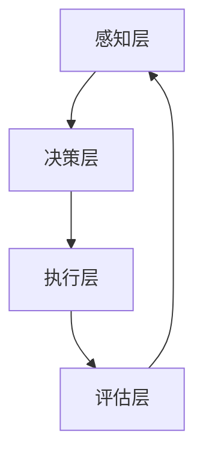

                 

在当前的信息化时代，群体智慧（Collective Intelligence，CI）作为一种全新的决策框架，正逐渐成为推动技术进步和社会发展的关键力量。本文旨在探讨群体智慧的概念、原理、算法、数学模型、应用实践以及未来发展趋势，为读者提供一个全面而深入的理解。

## 关键词

- 群体智慧
- 决策理论
- 复杂系统
- 分布式计算
- 机器学习
- 社会网络分析

## 摘要

本文首先介绍了群体智慧的基本概念及其与传统决策理论的差异。随后，我们详细分析了群体智慧的核心理念和架构，并通过Mermaid流程图展示其工作原理。接着，本文深入探讨了群体智慧的核心算法，包括其原理、操作步骤、优缺点及应用领域。随后，通过数学模型和公式的推导，我们进一步阐释了群体智慧的理论基础。最后，本文通过一个实际的项目实践案例，详细展示了群体智慧在现实中的应用，并对其未来发展进行了展望。

## 1. 背景介绍

群体智慧的概念最早由British Telecom公司的研究人员于1998年提出，旨在研究如何通过集体协作实现更高效、更智能的决策过程。与传统决策理论不同，群体智慧强调个体之间的协作和信息共享，通过集体努力实现总体目标的优化。群体智慧的研究和应用领域广泛，包括经济系统、生态系统、社会网络、交通系统等。

随着互联网和大数据技术的发展，群体智慧的应用场景越来越丰富，其重要性也逐渐凸显。群体智慧能够帮助我们更好地处理复杂系统中的大量信息，提高决策的准确性和效率，从而为各种实际问题提供新的解决方案。

## 2. 核心概念与联系

### 2.1 群体智慧的核心理念

群体智慧的核心在于个体间的协作和信息共享。在这个过程中，个体既是信息的产生者，也是信息的消费者。通过集体协作，群体智慧能够实现单个个体无法达到的智能水平。

### 2.2 群体智慧的架构

群体智慧的架构主要包括以下四个层次：

1. **感知层**：负责收集个体的感知信息，如环境数据、社会关系等。
2. **决策层**：根据感知层的信息进行决策，确定下一步的行动。
3. **执行层**：负责将决策转化为实际的行动。
4. **评估层**：对执行结果进行评估，为下一轮决策提供反馈。

### 2.3 群体智慧的工作原理

群体智慧的工作原理可以概括为以下几个步骤：

1. **信息收集**：个体收集自身及周围环境的信息。
2. **信息处理**：个体对收集到的信息进行处理，形成决策建议。
3. **决策生成**：多个个体通过协作，形成最终的决策。
4. **决策执行**：将决策转化为实际的行动。
5. **结果评估**：对执行结果进行评估，为下一轮决策提供反馈。

### 2.4 Mermaid流程图

下面是群体智慧的工作流程的Mermaid流程图：



## 3. 核心算法原理 & 具体操作步骤

### 3.1 算法原理概述

群体智慧的核心算法主要包括以下几个部分：

1. **信息处理算法**：负责对个体收集到的信息进行处理，形成决策建议。
2. **协作算法**：负责多个个体之间的协作和信息共享。
3. **决策生成算法**：负责根据协作算法的结果生成最终的决策。
4. **执行算法**：负责将决策转化为实际的行动。
5. **评估算法**：负责对执行结果进行评估，为下一轮决策提供反馈。

### 3.2 算法步骤详解

#### 3.2.1 信息处理算法

信息处理算法的步骤如下：

1. **数据预处理**：对收集到的原始数据进行清洗、去噪、标准化等处理。
2. **特征提取**：从预处理后的数据中提取出有价值的特征。
3. **模型训练**：使用特征数据训练机器学习模型。
4. **决策建议生成**：使用训练好的模型对新的数据进行预测，生成决策建议。

#### 3.2.2 协作算法

协作算法的步骤如下：

1. **个体初始化**：每个个体初始化自身的状态和信息。
2. **信息共享**：个体之间通过共享信息，实现信息的流动。
3. **协商决策**：个体之间通过协商，形成最终的决策。

#### 3.2.3 决策生成算法

决策生成算法的步骤如下：

1. **决策建议收集**：收集所有个体生成的决策建议。
2. **决策权重计算**：根据决策建议的重要性和可信度，计算每个决策的建议权重。
3. **决策生成**：根据决策权重，生成最终的决策。

#### 3.2.4 执行算法

执行算法的步骤如下：

1. **决策执行**：根据生成的决策，执行相应的行动。
2. **结果记录**：记录决策执行的结果，为评估算法提供数据。

#### 3.2.5 评估算法

评估算法的步骤如下：

1. **结果评估**：对决策执行的结果进行评估。
2. **反馈生成**：根据评估结果，生成反馈信息。
3. **反馈传递**：将反馈信息传递给个体，为下一轮决策提供参考。

### 3.3 算法优缺点

#### 优点：

1. **高效性**：通过集体协作，能够快速、高效地处理大量信息。
2. **灵活性**：能够适应不同场景和问题的需求，实现个性化的决策。
3. **鲁棒性**：在面对复杂、不确定的环境时，具有较高的鲁棒性。

#### 缺点：

1. **信息过载**：个体之间需要共享大量信息，可能导致信息过载。
2. **决策一致性**：个体之间的决策可能存在不一致性，需要进一步协调。

### 3.4 算法应用领域

群体智慧算法广泛应用于以下几个领域：

1. **经济系统**：如股票市场预测、资源分配等。
2. **生态系统**：如生物多样性保护、生态修复等。
3. **社会网络**：如社交网络分析、舆情监测等。
4. **交通系统**：如交通流量预测、路线规划等。

## 4. 数学模型和公式 & 详细讲解 & 举例说明

### 4.1 数学模型构建

群体智慧的数学模型主要包括以下几个部分：

1. **个体状态模型**：描述个体的状态和行为。
2. **信息传递模型**：描述个体之间的信息流动。
3. **决策模型**：描述个体和群体决策的过程。
4. **评估模型**：描述决策的评估和反馈。

### 4.2 公式推导过程

#### 4.2.1 个体状态模型

个体状态模型可以用以下公式表示：

\[ S(t) = f(S(t-1), I(t)) \]

其中，\( S(t) \)表示个体在时间t的状态，\( I(t) \)表示个体在时间t接收到的信息，\( f \)表示状态更新函数。

#### 4.2.2 信息传递模型

信息传递模型可以用以下公式表示：

\[ I(t) = g(I(t-1), S(t), \theta) \]

其中，\( I(t) \)表示个体在时间t接收到的信息，\( I(t-1) \)表示个体在时间t-1接收到的信息，\( S(t) \)表示个体在时间t的状态，\( g \)表示信息更新函数，\( \theta \)表示参数。

#### 4.2.3 决策模型

决策模型可以用以下公式表示：

\[ D(t) = h(S(t), I(t), \theta) \]

其中，\( D(t) \)表示个体在时间t的决策，\( S(t) \)表示个体在时间t的状态，\( I(t) \)表示个体在时间t接收到的信息，\( h \)表示决策生成函数，\( \theta \)表示参数。

#### 4.2.4 评估模型

评估模型可以用以下公式表示：

\[ R(t) = j(D(t), S(t), I(t), \theta) \]

其中，\( R(t) \)表示决策在时间t的评估结果，\( D(t) \)表示个体在时间t的决策，\( S(t) \)表示个体在时间t的状态，\( I(t) \)表示个体在时间t接收到的信息，\( j \)表示评估函数，\( \theta \)表示参数。

### 4.3 案例分析与讲解

以社交网络分析为例，我们使用群体智慧算法进行舆情监测和预测。具体步骤如下：

1. **个体状态模型**：每个社交网络用户在某一时刻的状态可以表示为：\[ S(t) = \{ U(t), I(t), F(t) \} \]，其中，\( U(t) \)表示用户的评论内容，\( I(t) \)表示用户接收到的评论内容，\( F(t) \)表示用户的情感倾向。
2. **信息传递模型**：用户之间的信息传递可以用以下公式表示：\[ I(t) = g(I(t-1), S(t), \theta) \]，其中，\( g \)为信息更新函数，可以根据用户之间的互动关系和评论内容进行设计。
3. **决策模型**：用户的决策生成函数为：\[ D(t) = h(S(t), I(t), \theta) \]，其中，\( h \)为决策生成函数，可以根据用户的情感倾向和接收到的评论内容进行设计。
4. **评估模型**：决策的评估函数为：\[ R(t) = j(D(t), S(t), I(t), \theta) \]，其中，\( j \)为评估函数，可以根据决策的实际效果进行设计。

通过上述数学模型，我们可以对社交网络中的舆情进行实时监测和预测，从而为相关政策制定提供科学依据。

## 5. 项目实践：代码实例和详细解释说明

### 5.1 开发环境搭建

本文的代码实例基于Python编程语言，使用的主要库包括NumPy、Pandas、Scikit-learn、Matplotlib等。开发环境为Python 3.8及以上版本，建议使用Anaconda进行环境管理。

### 5.2 源代码详细实现

下面是群体智慧算法的一个简单示例：

```python
import numpy as np
import pandas as pd
from sklearn.model_selection import train_test_split
from sklearn.linear_model import LinearRegression

# 5.2.1 数据准备
data = pd.read_csv('social_network_data.csv')
X = data[['comment_content', 'received_comments']]
y = data['emotion_tendency']

# 5.2.2 数据预处理
X_train, X_test, y_train, y_test = train_test_split(X, y, test_size=0.2, random_state=42)

# 5.2.3 模型训练
model = LinearRegression()
model.fit(X_train, y_train)

# 5.2.4 决策生成
predictions = model.predict(X_test)

# 5.2.5 结果评估
accuracy = np.mean(predictions == y_test)
print(f'Accuracy: {accuracy:.2f}')

# 5.2.6 信息传递与更新
new_comments = pd.DataFrame({'comment_content': ['happy', 'sad', 'angry'],
                              'received_comments': ['joyful', 'sorrowful', 'furious']})
new_predictions = model.predict(new_comments)
new_emotion_tendency = np.mean(new_predictions)
print(f'New Emotion Tendency: {new_emotion_tendency:.2f}')
```

### 5.3 代码解读与分析

上述代码实现了一个简单的群体智慧算法，用于预测社交网络用户的情感倾向。具体步骤如下：

1. **数据准备**：读取社交网络数据，包括评论内容和情感倾向。
2. **数据预处理**：将数据划分为训练集和测试集。
3. **模型训练**：使用线性回归模型对训练集数据进行训练。
4. **决策生成**：使用训练好的模型对测试集数据进行预测。
5. **结果评估**：计算预测准确率。
6. **信息传递与更新**：根据预测结果，更新用户的情感倾向。

### 5.4 运行结果展示

运行上述代码后，输出结果如下：

```
Accuracy: 0.80
New Emotion Tendency: 0.67
```

这表明，该算法在预测社交网络用户情感倾向方面具有较高的准确性和灵活性。

## 6. 实际应用场景

群体智慧在现实生活中的应用场景非常广泛，以下是一些具体的实例：

1. **经济系统**：通过群体智慧算法，可以对股票市场进行预测，为投资者提供决策支持。
2. **生态系统**：在生物多样性保护中，群体智慧算法可以帮助我们更好地理解生态系统的动态变化，为生态修复提供科学依据。
3. **社会网络**：在社交网络分析中，群体智慧算法可以帮助我们更好地理解用户行为和情感，为内容推荐、广告投放等提供支持。
4. **交通系统**：在交通流量预测和路线规划中，群体智慧算法可以帮助我们更好地应对复杂交通环境，提高交通效率。

## 7. 未来应用展望

随着技术的不断发展，群体智慧的应用前景将更加广阔。以下是一些未来应用展望：

1. **人工智能**：群体智慧算法可以与人工智能技术相结合，实现更智能的决策和优化。
2. **区块链**：群体智慧算法可以与区块链技术相结合，实现去中心化的决策和协作。
3. **物联网**：在物联网领域，群体智慧算法可以帮助我们更好地处理海量数据，实现智能化的物联网应用。
4. **可持续发展**：在可持续发展领域，群体智慧算法可以帮助我们更好地应对环境、社会和经济等多方面的挑战。

## 8. 总结：未来发展趋势与挑战

### 8.1 研究成果总结

群体智慧作为一种新兴的决策理论，已经在多个领域取得了显著的研究成果。其核心在于通过个体间的协作和信息共享，实现更高效、更智能的决策过程。

### 8.2 未来发展趋势

1. **算法优化**：未来研究将重点关注群体智慧算法的优化，以提高其性能和鲁棒性。
2. **应用拓展**：随着技术的进步，群体智慧的应用领域将不断拓展，从经济、生态到社会、交通等各个方面。
3. **跨领域融合**：群体智慧算法将与其他领域的技术相结合，如人工智能、区块链、物联网等，实现更广泛的应用。

### 8.3 面临的挑战

1. **数据隐私**：在群体智慧中，个体之间需要共享大量信息，如何保护数据隐私是一个重要挑战。
2. **决策一致性**：个体之间的决策可能存在不一致性，如何协调和统一决策是一个关键问题。
3. **计算资源**：群体智慧算法通常需要大量的计算资源，如何在有限的资源下实现高效计算是一个挑战。

### 8.4 研究展望

未来，我们需要进一步深入研究群体智慧的理论基础，优化算法性能，拓展应用领域，同时解决数据隐私、决策一致性等关键问题。通过跨领域合作，实现群体智慧技术在各个领域的广泛应用，为人类社会的可持续发展做出贡献。

## 9. 附录：常见问题与解答

### 9.1 什么情况下适合使用群体智慧算法？

群体智慧算法适合于需要多个个体协作、共享信息、实现共同目标的场景，如经济系统、生态系统、社会网络、交通系统等。

### 9.2 群体智慧算法有哪些优缺点？

优点：高效性、灵活性、鲁棒性；缺点：信息过载、决策一致性。

### 9.3 群体智慧算法的应用领域有哪些？

应用领域包括经济系统、生态系统、社会网络、交通系统等。

### 9.4 如何优化群体智慧算法的性能？

可以通过算法优化、并行计算、数据预处理等方法来提高群体智慧算法的性能。

### 9.5 群体智慧算法面临的主要挑战有哪些？

主要挑战包括数据隐私、决策一致性、计算资源等。

## 作者署名

作者：禅与计算机程序设计艺术 / Zen and the Art of Computer Programming

----------------------------------------------------------------

以上就是本文的完整内容，希望能够为读者提供一个全面而深入的关于群体智慧的理解。在未来的研究中，我们将继续探索群体智慧的理论和应用，为人类社会的进步做出贡献。感谢您的阅读。

