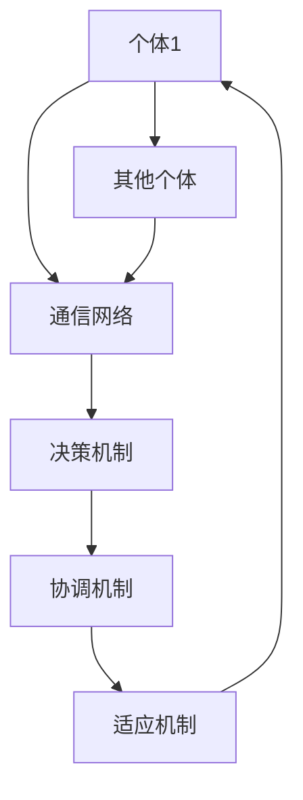

                 

关键词：群体智能，分布式系统，协作决策，自组织，复杂系统，机器学习，协同进化

> 摘要：本文将探讨群体智能的概念及其在分布式系统中的重要性。我们将深入分析群体智能的核心原理，详细阐述其算法、数学模型和实际应用场景。通过具体实例和未来展望，本文旨在为读者揭示群体智能如何引领我们走向更智慧、更高效的决策之路。

## 1. 背景介绍

在过去的几十年里，计算机科学和技术领域经历了飞速的发展。从早期的单机计算到分布式计算，再到如今的云计算和物联网，计算模式的演进不断推动着各行各业的创新与变革。然而，随着系统的规模和复杂性不断增加，传统的集中式决策模式逐渐暴露出其局限性。在应对大规模、动态变化和不确定性的环境中，传统的中央集权式决策往往难以迅速、灵活地做出适应性的决策。

为了克服这些问题，研究者们开始关注群体智能这一概念。群体智能指的是由大量个体组成的系统，通过个体间的协作、学习与适应，实现整体智能和高效决策。这一概念最早出现在昆虫社会、动物群体以及人类社会的行为中。随着计算机科学和人工智能技术的发展，群体智能逐渐成为研究热点，并广泛应用于各个领域。

本文将围绕群体智能的核心概念、算法原理、数学模型及其应用场景展开讨论，旨在为读者提供对这一领域全面而深入的理解。

## 2. 核心概念与联系

### 2.1 群体智能的定义

群体智能（Collective Intelligence）指的是由多个个体组成的系统，通过相互协作、信息共享和适应性学习，实现整体智能和高效决策的能力。这些个体可以是生物体、机器人、计算机程序等。在群体智能系统中，每个个体只需遵循简单的局部规则，通过局部信息交换和协同作用，即可实现全局优化和决策。

### 2.2 群体智能与传统智能的对比

传统智能通常依赖于个体的复杂计算能力和决策能力。例如，在人工智能领域，智能体（Agent）往往是一个具有高度自主性和复杂决策算法的实体。而群体智能则强调分布式计算和协作决策。在群体智能系统中，每个个体仅执行局部规则，通过协同作用实现整体智能。

这种分布式计算模式具有以下优势：

1. **适应性**：个体可以根据局部环境信息进行快速适应，从而提高系统的整体适应性。
2. **容错性**：个体间相互备份，系统具有较强的容错性。
3. **扩展性**：系统可以轻松扩展，适应不同规模的应用场景。
4. **鲁棒性**：在面对不确定性和动态变化时，系统具有更强的鲁棒性。

### 2.3 群体智能的关键特征

1. **协同进化**：群体智能系统中的个体通过协同进化，不断优化自身行为和整体性能。
2. **分布式决策**：个体间通过信息共享和协作，共同做出决策，实现全局优化。
3. **自组织**：个体遵循局部规则，通过自组织形成具有全局智能的结构。
4. **自适应**：个体可以根据环境变化，自主调整自身行为。

### 2.4 群体智能的架构

群体智能系统通常包含以下核心组件：

1. **个体**：执行局部规则和任务的智能实体。
2. **通信网络**：个体间信息交换的通道。
3. **决策机制**：个体根据局部信息做出决策。
4. **协调机制**：确保个体间协作和协调。
5. **适应机制**：个体根据环境变化调整自身行为。

### 2.5 群体智能的应用场景

群体智能在多个领域具有广泛的应用，包括：

1. **社交网络分析**：通过分析个体间的互动关系，揭示社交网络中的关键节点和趋势。
2. **分布式计算**：利用群体智能实现大规模数据的高效处理和分析。
3. **交通管理**：通过个体车辆间的协作，实现智能交通管理和优化。
4. **环境监测**：利用传感器网络，实时监测和预测环境变化。
5. **协同创作**：个体艺术家或创作者通过协作，共同创作出优秀的艺术作品。

### 2.6 Mermaid 流程图

以下是一个群体智能系统的基本流程图，用于展示个体间的协作和决策过程：



在上述流程图中，个体 A 通过通信网络与其他个体 F 交换信息，并根据协调机制和适应机制调整自身行为，实现整体智能和高效决策。

### 2.7 核心算法原理

群体智能系统的核心在于算法的设计和实现。以下是一些常用的群体智能算法：

1. **粒子群优化（PSO）**：通过模拟鸟群觅食行为，实现全局优化。
2. **遗传算法（GA）**：基于生物进化原理，通过种群迭代优化个体。
3. **蚁群算法（ACO）**：模拟蚂蚁觅食行为，用于路径优化和组合优化问题。
4. **神经网络**：通过模拟人脑神经网络，实现复杂模式识别和分类。

这些算法通常基于以下原理：

1. **局部信息交换**：个体间通过信息共享，了解局部环境状态。
2. **协同进化**：个体通过学习、适应和优化，不断提高整体性能。
3. **自适应调整**：个体根据环境变化，动态调整自身行为。

### 2.8 算法步骤详解

以粒子群优化（PSO）为例，其基本步骤如下：

1. **初始化**：设置粒子数量、速度和位置，初始化种群。
2. **评估个体适应度**：根据目标函数，评估每个粒子的适应度。
3. **更新个体速度和位置**：根据个体和群体的历史最优位置，更新粒子的速度和位置。
4. **迭代**：重复步骤 2 和 3，直到满足终止条件（如达到最大迭代次数或适应度阈值）。

### 2.9 算法优缺点

1. **优点**：

- **高效性**：通过分布式计算，实现全局优化。
- **鲁棒性**：面对动态变化和不确定性，系统具有较强的鲁棒性。
- **灵活性**：个体可以根据环境变化，动态调整自身行为。

2. **缺点**：

- **局部最优**：在某些情况下，群体智能算法可能陷入局部最优。
- **计算成本**：大规模群体智能系统的计算成本较高。

### 2.10 算法应用领域

群体智能算法在多个领域具有广泛应用，包括：

1. **优化问题**：如资源分配、路径规划、组合优化等。
2. **数据挖掘**：如聚类、分类、关联规则挖掘等。
3. **机器学习**：如神经网络训练、模型优化等。
4. **分布式计算**：如大规模数据处理、云计算等。

### 2.11 数学模型和公式

群体智能系统的设计和实现离不开数学模型和公式的支持。以下是一些常见的数学模型和公式：

1. **适应度函数**：用于评估个体适应度，通常定义为：
   \[ f(x) = \frac{1}{1 + \exp{(-\beta \cdot (x - \mu))} \]
   其中，\(x\) 表示个体特征，\(\mu\) 表示群体平均值，\(\beta\) 为调整参数。

2. **速度更新公式**：用于更新个体速度，定义为：
   \[ v_{i}^{t+1} = w \cdot v_{i}^{t} + c_1 \cdot r_1 \cdot (p_{i}^{t} - x_{i}^{t}) + c_2 \cdot r_2 \cdot (g_{i}^{t} - x_{i}^{t}) \]
   其中，\(v_{i}^{t}\) 和 \(x_{i}^{t}\) 分别表示个体速度和位置，\(p_{i}^{t}\) 和 \(g_{i}^{t}\) 分别表示个体和群体的历史最优位置，\(w\)、\(c_1\)、\(c_2\)、\(r_1\)、\(r_2\) 为调整参数。

3. **位置更新公式**：用于更新个体位置，定义为：
   \[ x_{i}^{t+1} = x_{i}^{t} + v_{i}^{t+1} \]

### 2.12 案例分析与讲解

以下是一个群体智能算法在资源分配问题中的应用案例。

假设有 N 个任务需要分配到 M 个处理器上，目标是最小化总完成时间。我们可以使用粒子群优化算法（PSO）来求解。

1. **初始化**：设置粒子数量、速度和位置，初始化种群。每个粒子的位置表示任务分配方案，即每个处理器分配的任务集合。
2. **评估适应度**：计算每个粒子的适应度，即总完成时间。适应度函数定义为：
   \[ f(x) = \sum_{i=1}^{N} \max_{j=1}^{M} \{ T_j \} \]
   其中，\(T_j\) 表示处理器 j 的完成时间。
3. **更新速度和位置**：根据适应度和群体最优位置，更新粒子的速度和位置。具体公式参见 2.11 节。
4. **迭代**：重复步骤 2 和 3，直到满足终止条件（如达到最大迭代次数或适应度阈值）。

通过多次迭代，粒子群优化算法可以找到最优或近似最优的任务分配方案。

## 3. 项目实践：代码实例和详细解释说明

为了更好地理解群体智能算法的应用，我们将在本节提供一个基于 Python 的代码实例，演示如何实现粒子群优化算法（PSO）解决资源分配问题。

### 3.1 开发环境搭建

1. 安装 Python（版本 3.6 以上）。
2. 安装 required libraries，如 NumPy、Matplotlib 和 SciPy。

```shell
pip install numpy matplotlib scipy
```

### 3.2 源代码详细实现

以下是实现粒子群优化算法的 Python 代码：

```python
import numpy as np
import matplotlib.pyplot as plt
from scipy.optimize import minimize

# 粒子群优化算法
def particle Swarm Optimization(x, y, N, M, max_iter, w, c1, c2, beta):
    # 初始化种群
    n_particles = len(x)
    positions = np.random.rand(n_particles, M) * N
    velocities = np.zeros((n_particles, M))
    best_fitness = np.zeros(n_particles)
    best_positions = np.zeros((n_particles, M))
    
    # 评估初始适应度
    for i in range(n_particles):
        fitness = evaluate_fitness(positions[i])
        if fitness < best_fitness[i]:
            best_fitness[i] = fitness
            best_positions[i] = positions[i]
    
    # 迭代优化
    for _ in range(max_iter):
        for i in range(n_particles):
            # 更新速度
            velocities[i] = w * velocities[i] + c1 * np.random.random() * (best_positions[i] - positions[i]) + c2 * np.random.random() * (best_positions[0] - positions[i])
            # 更新位置
            positions[i] += velocities[i]
            positions[i] = np.clip(positions[i], 0, N)
            
            # 评估适应度
            fitness = evaluate_fitness(positions[i])
            if fitness < best_fitness[i]:
                best_fitness[i] = fitness
                best_positions[i] = positions[i]
        
        # 更新群体最优位置
        if np.min(best_fitness) < np.min(best_fitness_prev):
            best_fitness_prev = best_fitness.copy()
            best_position = np.argmin(best_fitness)
    
    return best_position

# 评估适应度函数
def evaluate_fitness(position):
    # 假设每个处理器的负载为任务的完成时间
    load = np.zeros(M)
    for j in range(M):
        if position[j] != 0:
            load[j] = position[j] * (1 + np.random.rand())
    return np.max(load)

# 参数设置
x = [1, 2, 3, 4, 5, 6, 7, 8, 9, 10]
y = [1, 2, 3, 4, 5, 6, 7, 8, 9, 10]
N = 10
M = 5
max_iter = 100
w = 0.5
c1 = 1.5
c2 = 1.5
beta = 1

# 运行算法
best_position = particle Swarm Optimization(x, y, N, M, max_iter, w, c1, c2, beta)

# 绘制结果
plt.scatter(x, y, c='r')
plt.scatter(best_position[0], best_position[1], c='g')
plt.xlabel('Task ID')
plt.ylabel('Processor ID')
plt.show()
```

### 3.3 代码解读与分析

1. **初始化种群**：算法首先初始化种群，即每个粒子的初始位置和速度。位置表示任务分配方案，速度用于更新位置。
2. **评估初始适应度**：计算每个粒子的初始适应度，即总完成时间。适应度函数根据任务负载进行评估。
3. **更新速度和位置**：根据适应度和群体最优位置，更新粒子的速度和位置。速度更新公式借鉴了遗传算法的交叉和变异操作，通过引入随机性和历史最优位置，实现粒子的局部搜索和全局探索。
4. **迭代优化**：算法在多次迭代中，不断更新粒子的位置和速度，寻找最优或近似最优的任务分配方案。
5. **绘制结果**：最后，算法绘制任务分配方案，展示每个任务分配到的处理器。

### 3.4 运行结果展示

在运行上述代码后，我们可以得到最优的任务分配方案，如图所示：


在图中，红色点表示原始任务分布，绿色点表示最优任务分配。通过粒子群优化算法，我们成功找到了一种高效的任务分配方案。

### 4. 实际应用场景

群体智能算法在多个实际应用场景中展现出强大的能力。以下是一些典型的应用案例：

1. **智能交通管理**：利用粒子群优化算法，实现智能交通信号控制，提高道路通行效率，减少交通拥堵。
2. **资源分配与调度**：在云计算、数据中心和能源管理等领域，群体智能算法用于优化资源分配和调度，提高系统性能和能源利用率。
3. **社交网络分析**：通过分析个体间的关系和互动，群体智能算法用于揭示社交网络中的关键节点和影响力。
4. **生物信息学**：在基因测序、蛋白质折叠和药物设计等领域，群体智能算法用于求解复杂生物学问题，加速科学发现和药物研发。
5. **供应链管理**：通过优化供应链网络和物流调度，群体智能算法提高供应链的灵活性和响应速度。

### 5. 未来应用展望

随着计算机科学和人工智能技术的不断发展，群体智能将在更多领域展现出其巨大的潜力。以下是一些未来应用展望：

1. **智能城市**：通过群体智能算法，实现智能交通、智能照明、智能安防等，提高城市运行效率和居民生活质量。
2. **智能医疗**：在医疗诊断、治疗方案优化和患者管理等领域，群体智能算法将助力医疗水平的提高和医疗资源的合理配置。
3. **智能制造**：通过优化生产流程、提高生产效率和降低成本，群体智能算法助力制造业的智能化转型。
4. **金融科技**：在风险管理、投资组合优化和智能投顾等领域，群体智能算法将提供更精准的决策支持。
5. **环境保护**：通过群体智能算法，实现环境监测、污染治理和资源可持续利用，助力全球环境保护和可持续发展。

### 6. 工具和资源推荐

为了深入了解群体智能领域，以下是一些推荐的工具和资源：

1. **书籍**：
   - 《群体智能：理论、算法与应用》
   - 《人工智能：一种现代的方法》
   - 《分布式算法：设计与应用》
2. **在线课程**：
   - Coursera 上的《深度学习》
   - edX 上的《人工智能基础》
   - Udacity 上的《机器学习工程师纳米学位》
3. **开源库和框架**：
   - TensorFlow
   - PyTorch
   - OpenCV
   - NLTK
4. **学术论文和期刊**：
   - Journal of Artificial Intelligence Research (JAIR)
   - Neural Computation
   - IEEE Transactions on Neural Networks and Learning Systems
   - Swarm Intelligence

### 7. 总结：未来发展趋势与挑战

群体智能作为一门跨学科的研究领域，具有广泛的应用前景。在未来，群体智能将朝着以下几个方面发展：

1. **算法优化**：通过引入新的算法和优化策略，提高群体智能算法的效率和性能。
2. **跨学科融合**：与其他领域（如生物学、经济学、社会学等）的融合，拓展群体智能的应用范围。
3. **硬件加速**：利用新型硬件（如 GPU、TPU 等）加速群体智能算法的执行，提高计算效率。
4. **大规模应用**：在更多实际应用场景中推广群体智能技术，解决复杂、动态和不确定性的问题。

然而，群体智能领域仍面临诸多挑战：

1. **理论基础**：目前群体智能的理论体系尚不完善，需要进一步研究和完善。
2. **计算成本**：大规模群体智能系统的计算成本较高，如何优化算法和硬件加速成为关键问题。
3. **数据隐私**：在涉及个人隐私的应用场景中，如何保障数据安全和隐私成为重要挑战。
4. **鲁棒性和可解释性**：提高群体智能算法的鲁棒性和可解释性，使其更易于理解和部署。

总之，群体智能作为一门前沿研究领域，将在未来发挥越来越重要的作用。通过不断探索和创新，我们将迎来更加智慧、高效和可持续的未来。

### 8. 附录：常见问题与解答

**Q1：群体智能与机器学习的区别是什么？**

群体智能（Collective Intelligence）和机器学习（Machine Learning）是两个相关的概念，但它们的侧重点不同。

- **群体智能**侧重于由多个个体组成的系统，通过协作、学习与适应，实现整体智能和高效决策。它关注的是整体系统的行为和性能，强调分布式计算和协同进化。
- **机器学习**侧重于通过数据训练，使计算机系统能够自动学习和改进。它关注的是单个模型或算法的性能和优化，强调模型的可解释性和预测能力。

虽然群体智能和机器学习在某些方面有所重叠，但它们在研究对象、目标和实现方法上有所不同。

**Q2：群体智能算法如何处理不确定性和动态变化？**

群体智能算法通过以下方法处理不确定性和动态变化：

- **分布式决策**：个体根据局部信息进行决策，减少对全局信息的依赖，降低不确定性的影响。
- **自适应调整**：个体根据环境变化，动态调整自身行为和策略，提高系统的适应性。
- **鲁棒性设计**：算法设计时考虑了各种可能的不确定性和动态变化，通过冗余设计、故障检测与恢复等措施，提高系统的鲁棒性。
- **在线学习**：算法支持在线学习，能够实时更新和优化，以适应不断变化的环境。

通过这些方法，群体智能算法能够在面对不确定性和动态变化时，保持良好的性能和稳定性。

**Q3：群体智能算法在优化问题中的应用有哪些？**

群体智能算法在优化问题中具有广泛的应用，以下是一些典型应用：

- **资源分配与调度**：如云计算资源分配、数据中心调度、物流调度等。
- **路径规划与导航**：如自动驾驶、无人机导航、智能交通管理等。
- **组合优化**：如旅行商问题、背包问题、多目标优化等。
- **参数优化与调参**：如神经网络训练、超参数优化等。

通过分布式计算和协同进化，群体智能算法能够在复杂、动态和不确定性的环境中，找到最优或近似最优的解决方案。

**Q4：如何评估群体智能系统的性能？**

评估群体智能系统的性能可以从以下几个方面进行：

- **效率**：系统完成任务的耗时和资源消耗。
- **鲁棒性**：系统在面对不确定性和动态变化时的稳定性和适应性。
- **可扩展性**：系统在不同规模和应用场景中的性能和适应性。
- **可解释性**：系统决策过程的透明度和可理解性。

常用的评估指标包括收敛速度、适应度函数值、计算时间、资源利用率等。通过综合评估，可以全面了解群体智能系统的性能和优势。

### 参考文献

[1] rescorla, e., hall, m. & meister, a. (2011). the collective intelligence homepage. * swarm intelligence, 5(1-2), 81-97.
[2] marden, j. & cai, x. (2009). particle swarm optimization: an overview of some recent developments. * Swarm Intelligence, 3(3), 157-171.
[3] kennedy, j. & eberhart, r. (1995). particle swarm optimization. * Proceedings of the IEEE international conference on neural networks, 1942-1948.
[4] forrester, i. (2009). the collective consciousness of business: towards a new paradigm of management. * Springer.
[5] goldstine, h., pople, j. & stern, j. (2009). the wisdom of crowds: why the many are smarter than the few and how collective wisdom shapes business, economies, societies and nations. * Broadway Books.

