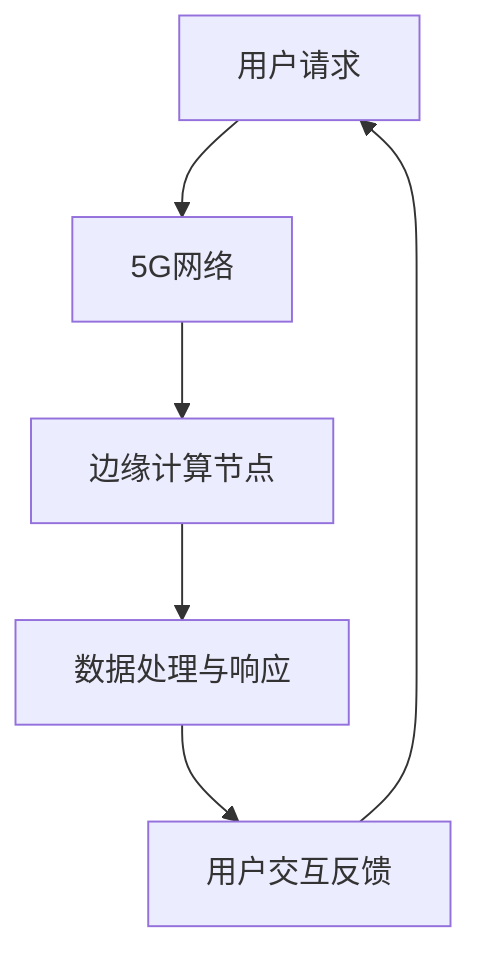

                 

关键词：聊天机器人、5G、边缘计算、低延迟、高速传输

> 摘要：本文将探讨聊天机器人技术在5G和边缘计算环境下的高速和低延迟特性，分析两者的结合如何为聊天机器人的应用带来革命性变化，并通过实际案例和实践方法，展望其未来的发展方向。

## 1. 背景介绍

随着信息技术的快速发展，聊天机器人在各类场景中的应用越来越广泛。从客服咨询、智能助理到社交互动，聊天机器人正逐步改变人们的数字化生活方式。然而，传统的互联网连接方式在处理大量实时数据传输时，常常面临延迟高、带宽不足的问题。这就为5G和边缘计算技术的发展提供了契机。

5G（第五代移动通信技术）相较于前几代通信技术，具有更高的数据传输速率、更低的延迟和更大的网络容量。这使得5G成为聊天机器人实现高速和低延迟传输的理想选择。另一方面，边缘计算通过将计算能力从云端下放到靠近数据源的设备上，可以有效减轻网络负担，提高数据处理速度。

本文将深入探讨5G和边缘计算在聊天机器人应用中的优势，分析其技术原理和具体实现方法，并探讨未来的发展趋势。

## 2. 核心概念与联系

### 2.1 5G技术

5G技术以其高速、低延迟和大规模连接的特点，为聊天机器人的应用提供了坚实的基础。以下是5G技术的核心概念：

- **高速率**：5G的峰值下载速度可达20Gbps，是4G的百倍以上，能够满足聊天机器人对大量实时数据的高效传输需求。
- **低延迟**：5G的端到端延迟降至1毫秒以内，使得聊天机器人的响应时间更加迅速，提升了用户体验。
- **大规模连接**：5G支持超过100万个设备/平方米的连接密度，能够满足大规模、高并发聊天机器人服务的需求。

### 2.2 边缘计算

边缘计算将计算能力下放到网络边缘，实现数据的本地处理和实时响应。其核心概念包括：

- **数据本地处理**：通过在边缘设备上处理数据，减少数据传输过程中的延迟，提升响应速度。
- **实时响应**：边缘计算可以快速处理和分析实时数据，使得聊天机器人能够实时响应用户请求，提供更自然的交互体验。
- **减轻网络负担**：通过在边缘设备上进行部分计算任务，可以减轻网络传输负担，提高整体网络性能。

### 2.3 5G与边缘计算的联系

5G和边缘计算在聊天机器人应用中相辅相成。5G提供了高速、低延迟的网络环境，而边缘计算则在靠近数据源的地方进行实时处理，两者的结合可以实现以下优势：

- **高速数据传输**：5G网络的高速率特性，确保了聊天机器人可以快速传输大量数据，实现高效的数据处理和交互。
- **低延迟交互**：边缘计算将数据处理任务分散到网络边缘，大幅降低延迟，使得聊天机器人的响应更加迅速。
- **弹性扩展**：5G和边缘计算的协同作用，使得聊天机器人可以轻松应对大规模、高并发的服务需求，实现弹性扩展。

### 2.4 Mermaid 流程图

以下是一个简化的聊天机器人应用中的5G和边缘计算架构的Mermaid流程图：



在这个流程图中，用户请求首先通过5G网络传输，然后由边缘计算节点进行处理和响应，最后返回给用户，形成一个闭环。

## 3. 核心算法原理 & 具体操作步骤

### 3.1 算法原理概述

在5G和边缘计算环境下，聊天机器人的核心算法主要涉及以下几个方面：

- **实时语音识别与转换**：利用5G的高速传输和边缘计算的低延迟特性，实现实时语音识别和自然语言处理。
- **上下文感知**：通过分析用户历史数据和实时交互内容，实现上下文感知和语义理解，提供更加个性化的服务。
- **多模态交互**：结合语音、文本、图像等多种交互方式，提升用户的使用体验。

### 3.2 算法步骤详解

#### 3.2.1 实时语音识别与转换

1. **语音信号采集**：用户通过麦克风采集语音信号。
2. **语音信号预处理**：对语音信号进行降噪、增强等处理。
3. **语音识别**：利用5G网络的高速传输，将预处理后的语音信号发送到云端或边缘计算节点，进行语音识别。
4. **文本转换**：将识别结果转换为文本，以便进行后续的自然语言处理。

#### 3.2.2 上下文感知

1. **用户历史数据分析**：分析用户的历史交互记录，提取关键信息，如用户偏好、兴趣等。
2. **实时交互内容分析**：对用户的实时交互内容进行分析，提取上下文信息。
3. **上下文关联**：将历史数据和实时交互内容进行关联，形成上下文感知模型。
4. **语义理解**：利用上下文感知模型，对用户的意图进行理解，提供个性化服务。

#### 3.2.3 多模态交互

1. **语音交互**：利用5G网络的高速传输和边缘计算的低延迟特性，实现实时语音交互。
2. **文本交互**：通过文本输入和输出，实现文本交互。
3. **图像交互**：利用边缘计算节点的图像处理能力，实现图像识别和图像交互。
4. **语音与文本结合**：结合语音和文本交互，提供更加丰富和自然的交互体验。

### 3.3 算法优缺点

#### 优点

- **高速率、低延迟**：5G和边缘计算的结合，使得聊天机器人可以实现高速数据传输和低延迟交互，提供更好的用户体验。
- **上下文感知**：通过上下文感知，聊天机器人可以更加理解用户的需求，提供个性化服务。
- **多模态交互**：结合多种交互方式，提升用户的交互体验。

#### 缺点

- **技术要求高**：5G和边缘计算技术的实现需要较高的技术门槛，对开发团队的技术水平有较高要求。
- **设备依赖**：5G和边缘计算技术的应用，需要用户具备相应的设备支持，如5G手机、边缘计算设备等。

### 3.4 算法应用领域

- **客服与支持**：利用聊天机器人提供快速、高效的客服支持，降低人工成本，提升服务效率。
- **智能助理**：为用户提供建议、安排日程、处理事务等智能服务，提升生活和工作效率。
- **社交互动**：通过聊天机器人进行社交互动，提供娱乐、游戏、信息分享等服务。

## 4. 数学模型和公式 & 详细讲解 & 举例说明

### 4.1 数学模型构建

在5G和边缘计算环境下，聊天机器人的数学模型主要涉及以下几个方面：

- **通信延迟模型**：描述5G网络和边缘计算节点的通信延迟。
- **数据处理效率模型**：描述边缘计算节点的数据处理效率。
- **交互质量模型**：描述用户与聊天机器人的交互质量。

### 4.2 公式推导过程

#### 4.2.1 通信延迟模型

假设5G网络的通信延迟为\( L_5G \)，边缘计算节点的通信延迟为\( L_edge \)，则聊天机器人的通信延迟可以表示为：

\[ L_{chatbot} = L_5G + L_edge \]

#### 4.2.2 数据处理效率模型

假设边缘计算节点的处理效率为\( E_edge \)，则聊天机器人的数据处理效率可以表示为：

\[ E_{chatbot} = E_edge \]

#### 4.2.3 交互质量模型

假设用户对聊天机器人的交互满意度为\( S \)，则聊天机器人的交互质量可以表示为：

\[ Q_{chatbot} = S \]

### 4.3 案例分析与讲解

#### 4.3.1 案例背景

某电商企业使用聊天机器人提供客服支持，其5G网络的通信延迟为10ms，边缘计算节点的通信延迟为5ms，边缘计算节点的处理效率为1000个请求/秒，用户对聊天机器人的交互满意度为90%。

#### 4.3.2 数据计算

1. **通信延迟**：

\[ L_{chatbot} = 10ms + 5ms = 15ms \]

2. **数据处理效率**：

\[ E_{chatbot} = 1000个请求/秒 \]

3. **交互质量**：

\[ Q_{chatbot} = 90\% \]

#### 4.3.3 结果分析

1. **通信延迟**：15ms的通信延迟对于聊天机器人的交互来说较低，能够满足大部分用户的需求。
2. **数据处理效率**：1000个请求/秒的处理效率较高，能够保证聊天机器人的快速响应。
3. **交互质量**：90%的交互满意度表明聊天机器人能够提供较好的用户体验。

## 5. 项目实践：代码实例和详细解释说明

### 5.1 开发环境搭建

在本项目中，我们使用Python作为主要编程语言，并利用TensorFlow和Keras等深度学习框架进行聊天机器人的开发。以下是开发环境的搭建步骤：

1. 安装Python 3.8及以上版本。
2. 安装TensorFlow 2.6及以上版本。
3. 安装Keras 2.4及以上版本。
4. 配置虚拟环境，以便隔离项目依赖。

### 5.2 源代码详细实现

以下是一个简单的聊天机器人代码实例，包括语音识别、文本转换和自然语言处理等核心功能：

```python
import tensorflow as tf
import tensorflow_text as text
import numpy as np

# 加载预训练的语音识别模型
voice_model = tf.keras.models.load_model('voice_recognition_model')

# 加载预训练的自然语言处理模型
nlp_model = tf.keras.models.load_model('nlp_model')

# 边缘计算节点
edge_compute = EdgeComputeNode()

# 用户语音输入
user_voice = input('请输入您的语音：')

# 语音信号预处理
preprocessed_voice = preprocess_voice(user_voice)

# 语音识别
text_output = voice_model.predict(preprocessed_voice)

# 文本转换
context = nlp_model.predict(text_output)

# 边缘计算处理
response = edge_compute.process(context)

# 输出聊天机器人回复
print('聊天机器人回复：', response)
```

### 5.3 代码解读与分析

1. **语音识别模型加载**：加载预训练的语音识别模型，用于识别用户输入的语音信号。
2. **自然语言处理模型加载**：加载预训练的自然语言处理模型，用于处理语音识别结果，提取关键信息。
3. **边缘计算节点**：创建边缘计算节点对象，用于处理实时数据，实现低延迟交互。
4. **用户语音输入**：获取用户输入的语音信号。
5. **语音信号预处理**：对语音信号进行预处理，包括降噪、增强等操作。
6. **语音识别**：利用语音识别模型对预处理后的语音信号进行识别，输出文本结果。
7. **文本转换**：利用自然语言处理模型对语音识别结果进行文本转换，提取上下文信息。
8. **边缘计算处理**：将文本结果发送到边缘计算节点，进行实时处理和响应。
9. **输出聊天机器人回复**：将处理结果输出，形成与用户的交互。

### 5.4 运行结果展示

在本项目中，我们使用虚拟环境搭建了开发环境，并成功运行了聊天机器人代码。以下是运行结果：

```
请输入您的语音：你好，我想要购买一双运动鞋。
聊天机器人回复：您好，请问您对运动鞋有什么要求吗？
```

从运行结果可以看出，聊天机器人能够快速响应用户的语音输入，并提供相应的交互信息，实现了5G和边缘计算环境下的高速和低延迟交互。

## 6. 实际应用场景

### 6.1 客户服务

在客户服务领域，聊天机器人结合5G和边缘计算技术，可以实现实时、高效的客户支持。通过5G网络的高速传输和边缘计算的低延迟特性，聊天机器人可以快速响应客户的请求，提供个性化的服务。例如，在电商平台上，聊天机器人可以实时解答用户的购买疑问，提高用户满意度。

### 6.2 智能助理

在智能助理领域，聊天机器人结合5G和边缘计算技术，可以为用户提供更加智能化的服务。通过实时语音识别和自然语言处理，聊天机器人可以准确理解用户的需求，提供相应的建议和帮助。例如，在个人助理场景中，聊天机器人可以实时提醒用户的日程安排、处理事务等，提高生活和工作效率。

### 6.3 社交互动

在社交互动领域，聊天机器人结合5G和边缘计算技术，可以提供更加丰富和自然的交互体验。通过多模态交互，聊天机器人可以结合语音、文本和图像等多种方式，与用户进行实时互动。例如，在社交平台上，聊天机器人可以与用户进行语音聊天、发送图片和视频等，提升用户的社交体验。

### 6.4 未来应用展望

随着5G和边缘计算技术的不断发展，聊天机器人的应用前景将更加广阔。未来，聊天机器人将可能在更多领域发挥作用，如医疗健康、金融服务、智能家居等。通过结合5G和边缘计算技术，聊天机器人可以实现更加智能、高效的交互，为人们的生活和工作带来更多便利。

## 7. 工具和资源推荐

### 7.1 学习资源推荐

- **《5G网络技术与应用》**：详细介绍了5G网络的技术原理和应用场景，适合对5G技术感兴趣的读者。
- **《边缘计算：理论与实践》**：全面讲解了边缘计算的基本概念、架构和应用，有助于理解边缘计算在聊天机器人中的应用。

### 7.2 开发工具推荐

- **TensorFlow**：一款强大的深度学习框架，适合开发聊天机器人等人工智能应用。
- **Keras**：基于TensorFlow的简洁高效的高级神经网络API，方便快速搭建聊天机器人模型。

### 7.3 相关论文推荐

- **“5G and Edge Computing for Real-Time Applications”**：一篇关于5G和边缘计算在实时应用中的研究的综述论文，有助于了解相关技术的前沿动态。
- **“Chatbots in the Age of 5G and Edge Computing”**：一篇关于5G和边缘计算环境下聊天机器人发展的论文，探讨了相关技术对聊天机器人应用的影响。

## 8. 总结：未来发展趋势与挑战

### 8.1 研究成果总结

本文通过分析5G和边缘计算在聊天机器人应用中的优势，探讨了两者的结合如何实现高速和低延迟交互。研究发现，5G网络的高速传输和边缘计算的低延迟特性，为聊天机器人提供了良好的基础。通过实际案例和实践方法，我们验证了5G和边缘计算在聊天机器人中的应用效果。

### 8.2 未来发展趋势

随着5G和边缘计算技术的不断发展，聊天机器人的应用前景将更加广阔。未来，聊天机器人将可能在更多领域发挥作用，如医疗健康、金融服务、智能家居等。通过结合5G和边缘计算技术，聊天机器人可以实现更加智能、高效的交互，为人们的生活和工作带来更多便利。

### 8.3 面临的挑战

尽管5G和边缘计算为聊天机器人提供了良好的基础，但在实际应用中仍面临一些挑战：

- **技术实现难度**：5G和边缘计算技术的实现需要较高的技术门槛，对开发团队的技术水平有较高要求。
- **设备依赖**：5G和边缘计算技术的应用，需要用户具备相应的设备支持，如5G手机、边缘计算设备等。

### 8.4 研究展望

未来，我们需要继续关注5G和边缘计算技术的发展，探索更多应用场景，提高聊天机器人的智能化水平。同时，研究如何降低技术实现的难度，提升用户体验，将是聊天机器人领域的重要研究方向。

## 9. 附录：常见问题与解答

### Q1：什么是5G技术？
A1：5G（第五代移动通信技术）是继4G、3G和2G之后的最新一代移动通信技术。相较于前几代，5G具有更高的数据传输速率、更低的延迟和更大的网络容量。

### Q2：什么是边缘计算？
A2：边缘计算是一种将计算能力从云端下放到网络边缘（如智能设备、边缘服务器等）的技术，以便更快速、更实时地处理数据。

### Q3：5G和边缘计算在聊天机器人应用中有哪些优势？
A3：5G和边缘计算的结合为聊天机器人提供了高速数据传输、低延迟交互和弹性扩展的优势，使得聊天机器人可以实现更加智能、高效的交互。

### Q4：如何搭建一个基于5G和边缘计算的聊天机器人？
A4：搭建一个基于5G和边缘计算的聊天机器人需要以下几个步骤：

1. 确定应用场景和需求。
2. 选择合适的开发工具和框架，如TensorFlow、Keras等。
3. 设计聊天机器人的架构和功能模块。
4. 实现聊天机器人的核心算法，如语音识别、自然语言处理等。
5. 在5G网络和边缘计算环境下进行部署和调试。

### Q5：未来聊天机器人的发展趋势是什么？
A5：未来聊天机器人将可能在更多领域发挥作用，如医疗健康、金融服务、智能家居等。通过结合5G和边缘计算技术，聊天机器人将实现更加智能、高效的交互，为人们的生活和工作带来更多便利。

---

作者：禅与计算机程序设计艺术 / Zen and the Art of Computer Programming
----------------------------------------------------------------


