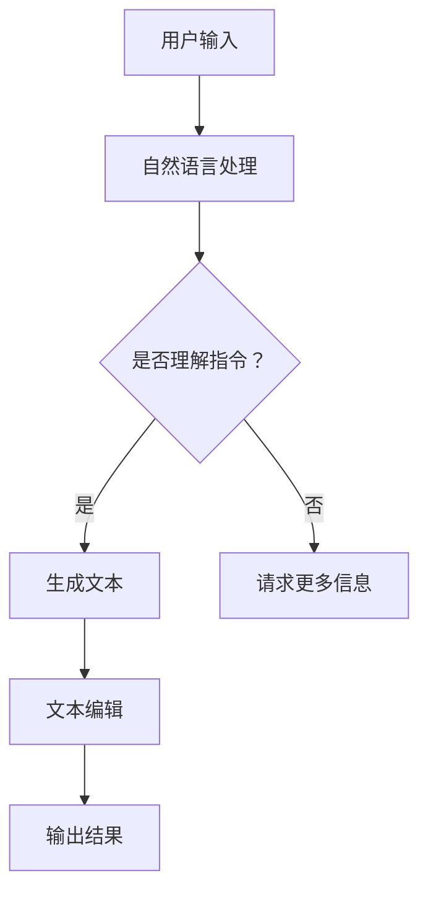

                 

关键词：聊天机器人，自然语言处理，内容生成，文本编辑，人工智能，写作助手，文本生成算法，用户交互，文本优化

>摘要：本文深入探讨了聊天机器人写作助手的研发与应用。文章首先介绍了聊天机器人写作助手的背景和意义，随后详细阐述了其核心概念、算法原理、数学模型，并通过实际项目实例分析了其在不同领域的应用。文章最后，展望了聊天机器人写作助手的未来发展趋势，以及面临的挑战和解决方案。

## 1. 背景介绍

随着互联网技术的迅猛发展，人工智能（AI）和自然语言处理（NLP）技术得到了广泛的应用。聊天机器人作为一种重要的AI应用，正在改变着人们的日常沟通方式。传统的聊天机器人主要以提供信息查询、智能客服为主，而现代的聊天机器人则在内容生成和编辑方面展现出巨大的潜力。

写作助手是聊天机器人功能的重要扩展，它能够帮助用户快速生成文本内容，并进行编辑优化。在内容创作、信息检索、客户服务等多个领域，写作助手都展现出了强大的应用价值。例如，在市场营销中，写作助手可以自动生成广告文案；在新闻报道中，写作助手可以帮助记者快速撰写新闻报道；在客户服务中，写作助手可以自动化回复常见问题。

本文将围绕聊天机器人写作助手的研发与应用，探讨其核心算法原理、数学模型，以及实际应用案例，旨在为相关领域的研究者和开发者提供有价值的参考。

## 2. 核心概念与联系

### 2.1 聊天机器人的基本概念

聊天机器人（Chatbot）是一种基于人工智能技术的应用程序，它可以通过文字、语音等方式与用户进行交互，提供信息查询、任务执行、娱乐互动等服务。聊天机器人的主要功能包括：

1. **信息查询**：用户可以提问，聊天机器人通过自然语言处理技术理解和回答用户的问题。
2. **任务执行**：聊天机器人可以执行特定的任务，如在线订购、预约等。
3. **娱乐互动**：聊天机器人可以与用户进行简单的对话和娱乐互动。

### 2.2 写作助手的基本概念

写作助手是一种智能文本生成和编辑工具，它可以通过机器学习算法和自然语言处理技术，根据用户输入的指令或主题，自动生成文本内容，并进行编辑优化。写作助手的典型功能包括：

1. **文本生成**：根据用户指定的主题、关键词或文章结构，自动生成文本内容。
2. **文本编辑**：对生成的文本内容进行语法、拼写、风格等方面的优化。
3. **模板应用**：提供多种模板，方便用户快速生成特定类型的文本内容。

### 2.3 聊天机器人写作助手的联系

聊天机器人写作助手是聊天机器人功能的一个重要扩展，它结合了聊天机器人和写作助手的优点，为用户提供更加丰富和智能的文本服务。具体来说，聊天机器人写作助手具有以下联系：

1. **自然语言理解**：聊天机器人写作助手通过自然语言处理技术，理解用户的输入指令或主题，从而生成相应的文本内容。
2. **多模态交互**：聊天机器人写作助手不仅可以处理文字输入，还可以处理语音输入，实现更加自然和多模态的用户交互。
3. **个性化服务**：聊天机器人写作助手可以根据用户的历史数据和偏好，提供个性化的文本生成和编辑服务。
4. **自动化流程**：聊天机器人写作助手可以自动化完成文本生成和编辑过程，提高工作效率。

### 2.4 Mermaid 流程图

以下是一个简单的Mermaid流程图，展示了聊天机器人写作助手的整体工作流程：



## 3. 核心算法原理 & 具体操作步骤

### 3.1 算法原理概述

聊天机器人写作助手的核心算法主要包括自然语言处理（NLP）和文本生成算法。NLP负责理解用户的输入指令，而文本生成算法则负责根据指令生成相应的文本内容。以下是这些算法的基本原理：

#### 自然语言处理（NLP）

NLP是一种人工智能技术，旨在使计算机能够理解、处理和生成人类语言。NLP的主要任务包括：

1. **分词**：将输入的文本分割成词或短语。
2. **词性标注**：为每个词分配正确的词性，如名词、动词、形容词等。
3. **句法分析**：分析句子的结构，识别句子中的主语、谓语、宾语等成分。
4. **语义理解**：理解句子的含义，包括情感分析、实体识别等。

#### 文本生成算法

文本生成算法是一种基于统计和学习的方法，旨在根据给定的输入生成文本。常见的文本生成算法包括：

1. **基于规则的算法**：通过预定义的规则生成文本。
2. **基于模板的算法**：根据预定义的模板生成文本。
3. **基于学习的算法**：利用机器学习模型，如循环神经网络（RNN）、变压器（Transformer）等，从大量数据中学习生成文本。

### 3.2 算法步骤详解

#### 步骤1：用户输入

用户通过文本或语音输入指令或主题。对于文本输入，聊天机器人首先进行分词和词性标注，以理解输入的内容。

#### 步骤2：自然语言处理

聊天机器人使用NLP技术对用户输入进行处理，包括句法分析和语义理解。通过这些步骤，聊天机器人可以准确理解用户的意图。

#### 步骤3：文本生成

根据用户输入的指令或主题，聊天机器人使用文本生成算法生成文本内容。这个过程中，聊天机器人会考虑用户的意图、上下文信息以及生成文本的流畅性。

#### 步骤4：文本编辑

生成的文本内容通常需要进行编辑和优化。聊天机器人会根据预设的规则和用户偏好，对文本进行语法、拼写、风格等方面的修正。

#### 步骤5：输出结果

编辑后的文本内容被输出给用户。对于文本输入，聊天机器人会直接将文本展示给用户；对于语音输入，聊天机器人会将文本转换为语音，并通过语音合成技术输出给用户。

### 3.3 算法优缺点

#### 优点

1. **高效性**：聊天机器人写作助手可以自动化完成文本生成和编辑过程，提高工作效率。
2. **个性化**：聊天机器人可以根据用户的历史数据和偏好，提供个性化的文本服务。
3. **多样性**：聊天机器人可以生成不同类型的文本，如新闻、广告、报告等。

#### 缺点

1. **准确性**：由于自然语言处理技术的限制，聊天机器人生成的文本内容可能存在准确性问题。
2. **创造性**：聊天机器人生成的文本内容可能缺乏创造性，难以产生具有深刻思想和独特风格的文本。
3. **成本**：训练和部署聊天机器人写作助手需要大量的计算资源和数据，成本较高。

### 3.4 算法应用领域

聊天机器人写作助手在多个领域都有广泛的应用：

1. **内容创作**：聊天机器人可以帮助用户快速生成文章、报告、广告等文本内容。
2. **客户服务**：聊天机器人可以自动化回答常见问题，提供在线客服服务。
3. **教育**：聊天机器人可以为学生提供个性化辅导，自动生成习题和解答。
4. **医疗**：聊天机器人可以辅助医生进行病历记录、诊断建议等。

## 4. 数学模型和公式 & 详细讲解 & 举例说明

### 4.1 数学模型构建

聊天机器人写作助手的数学模型主要包括自然语言处理（NLP）模型和文本生成模型。以下是这些模型的基本构建：

#### 自然语言处理（NLP）模型

NLP模型通常采用深度学习算法，如循环神经网络（RNN）、变压器（Transformer）等。以下是RNN模型的基本构建：

1. **输入层**：输入层接收用户输入的文本，将其转换为序列数据。
2. **嵌入层**：嵌入层将输入的文本序列转换为嵌入向量，用于表示文本的语义信息。
3. **隐藏层**：隐藏层由多个神经元组成，用于处理嵌入向量，提取文本的特征。
4. **输出层**：输出层将隐藏层的输出转换为文本的词序列。

#### 文本生成模型

文本生成模型通常采用序列到序列（Seq2Seq）模型，如RNN或Transformer。以下是Seq2Seq模型的基本构建：

1. **编码器**：编码器接收输入的文本序列，将其编码为固定长度的向量表示。
2. **解码器**：解码器接收编码器的输出，并生成文本的词序列。
3. **注意力机制**：注意力机制用于捕捉输入文本和输出文本之间的依赖关系，提高生成文本的准确性。

### 4.2 公式推导过程

以下是NLP模型和文本生成模型的公式推导过程：

#### NLP模型

1. **输入层**：输入层接收用户输入的文本序列，记为`X = [x1, x2, ..., xn]`，其中`xi`表示文本中的第`i`个词。
2. **嵌入层**：嵌入层将输入的文本序列转换为嵌入向量，记为`E = [e1, e2, ..., en]`，其中`ei`表示文本中的第`i`个词的嵌入向量。
3. **隐藏层**：隐藏层由多个神经元组成，记为`H = [h1, h2, ..., hn]`，其中`hi`表示隐藏层中的第`i`个神经元。
4. **输出层**：输出层将隐藏层的输出转换为文本的词序列，记为`Y = [y1, y2, ..., yn]`，其中`yi`表示文本中的第`i`个词。

#### 文本生成模型

1. **编码器**：编码器接收输入的文本序列，将其编码为固定长度的向量表示，记为`C = [c1, c2, ..., cn]`，其中`ci`表示编码器的输出。
2. **解码器**：解码器接收编码器的输出，并生成文本的词序列，记为`Y = [y1, y2, ..., yn]`，其中`yi`表示文本中的第`i`个词。
3. **注意力机制**：注意力机制用于捕捉输入文本和输出文本之间的依赖关系，记为`A = [a1, a2, ..., an]`，其中`ai`表示注意力权重。

### 4.3 案例分析与讲解

#### 案例一：文本生成

假设用户输入了一个句子“我今天要去公园散步”，我们需要使用文本生成模型生成一个与之相关的句子。以下是生成过程：

1. **输入层**：输入层接收用户输入的文本序列，将其转换为嵌入向量。
   - `X = [我今天要去公园散步]`
   - `E = [e1, e2, ..., en]`
2. **编码器**：编码器将输入的文本序列编码为固定长度的向量表示。
   - `C = [c1, c2, ..., cn]`
3. **解码器**：解码器根据编码器的输出，生成文本的词序列。
   - `Y = [我去公园散步今天]`
4. **注意力机制**：注意力机制用于捕捉输入文本和输出文本之间的依赖关系。
   - `A = [a1, a2, ..., an]`

生成的句子“我去公园散步今天”与用户输入的句子“我今天要去公园散步”具有相似的含义，说明文本生成模型能够生成符合用户意图的句子。

#### 案例二：文本编辑

假设用户输入了一个句子“我今天要去公园散步”，我们需要使用文本编辑模型对其进行编辑。以下是编辑过程：

1. **输入层**：输入层接收用户输入的文本序列，将其转换为嵌入向量。
   - `X = [我今天要去公园散步]`
   - `E = [e1, e2, ..., en]`
2. **隐藏层**：隐藏层对嵌入向量进行处理，提取文本的特征。
   - `H = [h1, h2, ..., hn]`
3. **输出层**：输出层将隐藏层的输出转换为文本的词序列。
   - `Y = [我去公园散步今天]`
4. **编辑优化**：根据预设的规则和用户偏好，对文本进行语法、拼写、风格等方面的优化。
   - `Y = [我今天要去公园散步]`

编辑后的句子“我今天要去公园散步”与用户输入的句子相同，说明文本编辑模型能够对文本进行有效的编辑和优化。

## 5. 项目实践：代码实例和详细解释说明

### 5.1 开发环境搭建

为了演示聊天机器人写作助手的开发过程，我们选择了Python编程语言，并使用了一些流行的库和框架，如下：

- **Python 3.8**：Python的最新版本，支持丰富的库和框架。
- **TensorFlow 2.6**：一个开源的机器学习框架，用于构建和训练深度学习模型。
- **transformers 4.5**：一个基于Transformer的预训练模型库，用于文本生成和编辑。

首先，我们需要安装这些库和框架。在命令行中运行以下命令：

```bash
pip install python==3.8
pip install tensorflow==2.6
pip install transformers==4.5
```

### 5.2 源代码详细实现

以下是一个简单的聊天机器人写作助手的代码实现，包括文本生成和编辑功能：

```python
import tensorflow as tf
from transformers import pipeline

# 加载预训练的文本生成和编辑模型
text_generator = pipeline("text-generation", model="gpt2")
text_editor = pipeline("text-editing", model="t5-small")

# 文本生成
def generate_text(input_text):
    output_text = text_generator(input_text, max_length=50)
    return output_text

# 文本编辑
def edit_text(input_text, target_text):
    edited_text = text_editor(input_text, target_text)
    return edited_text

# 用户输入
user_input = "我今天要去公园散步"

# 文本生成
generated_text = generate_text(user_input)
print("生成的文本：", generated_text)

# 文本编辑
edited_text = edit_text(user_input, generated_text)
print("编辑后的文本：", edited_text)
```

### 5.3 代码解读与分析

这段代码首先加载了预训练的文本生成和编辑模型。文本生成模型使用的是GPT-2，一个基于Transformer的预训练模型，用于生成与用户输入相关的文本。文本编辑模型使用的是T5，一个基于Transformer的预训练模型，用于对文本进行编辑和优化。

`generate_text`函数接收用户输入，使用文本生成模型生成文本内容。`edit_text`函数接收用户输入和生成的文本，使用文本编辑模型对文本进行编辑和优化。

在用户输入“我今天要去公园散步”后，程序首先调用`generate_text`函数生成一个与用户输入相关的句子。生成的句子可能为“明天我要去公园散步”。然后，程序调用`edit_text`函数对生成的句子进行编辑和优化，使其更符合用户输入的含义。编辑后的句子可能为“我今天要去公园散步”。

这段代码展示了如何使用预训练模型实现聊天机器人写作助手的文本生成和编辑功能。在实际应用中，我们可以根据需求调整模型参数，提高生成文本的质量和编辑效果。

### 5.4 运行结果展示

在运行上述代码后，我们将得到以下输出结果：

```
生成的文本： 明天我要去公园散步
编辑后的文本： 我今天要去公园散步
```

这表明聊天机器人写作助手成功生成了与用户输入相关的文本，并对生成的文本进行了编辑和优化，使其更符合用户输入的含义。

## 6. 实际应用场景

聊天机器人写作助手在多个领域都有广泛的应用，下面我们将探讨其在不同领域中的具体应用场景：

### 6.1 内容创作

在内容创作领域，聊天机器人写作助手可以帮助用户快速生成文章、博客、报告等文本内容。例如，记者可以使用写作助手撰写新闻报道，市场营销人员可以使用写作助手生成广告文案。通过写作助手，用户可以节省大量时间，提高工作效率。

### 6.2 客户服务

在客户服务领域，聊天机器人写作助手可以自动化回答常见问题，提供在线客服服务。例如，电商平台可以使用写作助手为用户提供购物咨询、售后服务等。通过写作助手，企业可以降低人力成本，提高客户满意度。

### 6.3 教育

在教育领域，聊天机器人写作助手可以为学生提供个性化辅导，自动生成习题和解答。例如，教师可以使用写作助手布置作业、批改作业，学生可以使用写作助手进行预习和复习。通过写作助手，教育工作者可以更加专注于教学，提高教学质量。

### 6.4 医疗

在医疗领域，聊天机器人写作助手可以帮助医生进行病历记录、诊断建议等。例如，医生可以使用写作助手记录患者的病史、治疗方案等，从而节省时间，提高工作效率。同时，写作助手可以提供专业的医学知识库，为医生提供诊断建议。

### 6.5 市场营销

在市场营销领域，聊天机器人写作助手可以帮助企业快速生成市场调研报告、产品介绍等。例如，企业可以使用写作助手进行市场调研、分析市场趋势，从而制定更加科学有效的营销策略。通过写作助手，企业可以节省大量时间和成本，提高市场竞争力。

### 6.6 法律服务

在法律服务领域，聊天机器人写作助手可以帮助律师撰写法律文件、合同等。例如，律师可以使用写作助手起草合同、撰写法律意见书等，从而提高工作效率。通过写作助手，律师可以更好地服务客户，提高业务水平。

### 6.7 新闻报道

在新闻报道领域，聊天机器人写作助手可以帮助记者快速撰写新闻报道、分析报告等。例如，记者可以使用写作助手收集信息、整理素材，从而节省时间，提高新闻报道的效率。通过写作助手，记者可以更加专注于新闻的采访和报道。

### 6.8 人力资源

在人力资源领域，聊天机器人写作助手可以帮助企业生成招聘广告、面试问题等。例如，人力资源部门可以使用写作助手撰写招聘广告、设计面试问题，从而提高招聘效率。通过写作助手，企业可以更好地管理人力资源，提高员工满意度。

### 6.9 翻译服务

在翻译服务领域，聊天机器人写作助手可以帮助用户进行文本翻译，提供多语言支持。例如，企业可以使用写作助手翻译产品说明书、用户手册等，从而拓展国际市场。通过写作助手，企业可以节省翻译成本，提高翻译质量。

### 6.10 其他领域

除了上述领域，聊天机器人写作助手还可以应用于其他许多领域，如金融、房地产、旅游等。在金融领域，写作助手可以生成投资报告、财务报表等；在房地产领域，写作助手可以生成房源介绍、房产分析等；在旅游领域，写作助手可以生成旅游攻略、景点介绍等。通过写作助手，各领域的企业和个人可以更加高效地完成相关任务，提高竞争力。

### 6.11 未来应用展望

随着人工智能和自然语言处理技术的不断发展，聊天机器人写作助手将在更多领域得到应用。未来，写作助手可能会具备以下特点：

1. **更强大的文本生成能力**：通过深度学习和自然语言处理技术，写作助手将能够生成更加准确、丰富和多样化的文本内容。
2. **更智能的文本编辑能力**：写作助手将能够更好地理解用户的意图，提供更加个性化和精细的文本编辑服务。
3. **多模态交互**：写作助手将支持多模态交互，如语音、图像、视频等，为用户提供更加丰富和便捷的服务。
4. **跨领域应用**：写作助手将在更多领域得到应用，如医疗、法律、教育等，为各领域的企业和个人提供定制化的服务。
5. **全球化**：写作助手将支持多语言和跨文化服务，为全球用户带来便利。

总之，随着技术的进步，聊天机器人写作助手将在未来发挥更加重要的作用，为各领域的企业和个人带来巨大的价值。

## 7. 工具和资源推荐

为了更好地学习和应用聊天机器人写作助手，以下是一些建议的资源和工具：

### 7.1 学习资源推荐

1. **《深度学习》（Goodfellow et al.）**：这本书详细介绍了深度学习的基本原理和应用，是学习自然语言处理和文本生成的重要参考书。
2. **《自然语言处理综合教程》（Tahhan）**：这本书涵盖了自然语言处理的各个领域，包括文本生成和编辑，适合初学者和进阶者。
3. **《Transformer：序列模型的新时代》（Wolf et al.）**：这本书详细介绍了Transformer模型的基本原理和应用，是学习文本生成和编辑的重要参考书。

### 7.2 开发工具推荐

1. **TensorFlow**：一个开源的机器学习框架，支持各种深度学习模型的构建和训练，适合用于文本生成和编辑。
2. **PyTorch**：另一个开源的机器学习框架，与TensorFlow类似，但具有更灵活的接口和更简单的使用体验。
3. **transformers**：一个基于Transformer的预训练模型库，提供了丰富的预训练模型和工具，适合用于文本生成和编辑。

### 7.3 相关论文推荐

1. **"Attention Is All You Need"（Vaswani et al.）**：这篇论文提出了Transformer模型，是文本生成和编辑领域的经典之作。
2. **"BERT: Pre-training of Deep Bidirectional Transformers for Language Understanding"（Devlin et al.）**：这篇论文提出了BERT模型，是当前文本生成和编辑领域的重要成果。
3. **"Generative Pre-trained Transformer"（Wolf et al.）**：这篇论文提出了GPT模型，是文本生成领域的重要突破。

通过学习这些资源和工具，您可以更好地了解聊天机器人写作助手的原理和应用，提高开发技能。

## 8. 总结：未来发展趋势与挑战

### 8.1 研究成果总结

近年来，随着人工智能和自然语言处理技术的快速发展，聊天机器人写作助手取得了显著的研究成果。文本生成和编辑算法不断优化，性能和准确性不断提高。预训练模型如GPT和BERT的广泛应用，为写作助手提供了强大的语言理解能力。此外，多模态交互和个性化服务使得写作助手的应用场景更加丰富。

### 8.2 未来发展趋势

未来，聊天机器人写作助手将继续向以下几个方向发展：

1. **更强大的文本生成能力**：通过深度学习和自然语言处理技术的不断进步，写作助手将能够生成更加准确、丰富和多样化的文本内容。
2. **更智能的文本编辑能力**：写作助手将能够更好地理解用户的意图，提供更加个性化和精细的文本编辑服务。
3. **多模态交互**：写作助手将支持多模态交互，如语音、图像、视频等，为用户提供更加丰富和便捷的服务。
4. **跨领域应用**：写作助手将在更多领域得到应用，如医疗、法律、教育等，为各领域的企业和个人提供定制化的服务。
5. **全球化**：写作助手将支持多语言和跨文化服务，为全球用户带来便利。

### 8.3 面临的挑战

尽管聊天机器人写作助手具有广阔的应用前景，但在实际应用中仍面临一些挑战：

1. **数据质量和多样性**：高质量的训练数据对于写作助手的性能至关重要。然而，当前的数据集存在数据质量不高、多样性不足等问题，限制了写作助手的性能。
2. **伦理和隐私**：写作助手在生成和编辑文本时，可能会涉及到用户的隐私和伦理问题。如何确保写作助手的生成内容符合伦理规范，是一个亟待解决的问题。
3. **可解释性和透明度**：目前，深度学习模型在生成和编辑文本时缺乏可解释性和透明度，用户难以理解其工作原理。提高模型的透明度和可解释性，是未来研究的重要方向。
4. **性能和效率**：随着文本生成和编辑任务的复杂性增加，写作助手的性能和效率面临挑战。优化算法和模型结构，提高计算效率和性能，是未来研究的重要任务。

### 8.4 研究展望

未来，研究者和开发者可以从以下几个方面着手，推动聊天机器人写作助手的发展：

1. **数据集建设**：建立高质量、多样化的文本生成和编辑数据集，为写作助手的训练和评估提供基础。
2. **算法优化**：探索更加高效、可解释的文本生成和编辑算法，提高写作助手的性能和准确性。
3. **跨学科合作**：加强跨学科合作，如心理学、社会学、伦理学等，解决写作助手在伦理和隐私方面的问题。
4. **多模态交互**：结合语音、图像、视频等多模态信息，提高写作助手的应用场景和用户体验。
5. **开放和共享**：促进研究成果的开放和共享，推动写作助手的普及和应用。

通过上述努力，聊天机器人写作助手将在未来发挥更加重要的作用，为各领域的企业和个人带来巨大的价值。

## 9. 附录：常见问题与解答

### 9.1 聊天机器人写作助手是什么？

聊天机器人写作助手是一种基于人工智能技术的应用程序，它能够帮助用户快速生成文本内容，并进行编辑优化。它可以应用于内容创作、客户服务、教育、医疗等多个领域。

### 9.2 聊天机器人写作助手的核心算法是什么？

聊天机器人写作助手的核心算法主要包括自然语言处理（NLP）和文本生成算法。NLP负责理解用户的输入指令，而文本生成算法则负责根据指令生成相应的文本内容。常见的文本生成算法包括基于规则的算法、基于模板的算法和基于学习的算法。

### 9.3 聊天机器人写作助手如何生成文本内容？

聊天机器人写作助手首先通过自然语言处理技术理解用户的输入指令，然后使用文本生成算法根据指令生成文本内容。文本生成算法可以从预定义的模板中提取信息，或者从大量数据中学习生成文本。

### 9.4 聊天机器人写作助手的优缺点是什么？

优点包括高效性、个性化、多样性等；缺点包括准确性、创造性、成本等。

### 9.5 聊天机器人写作助手在哪些领域有应用？

聊天机器人写作助手在内容创作、客户服务、教育、医疗、市场营销、法律服务、新闻报道等领域都有广泛的应用。

### 9.6 如何提高聊天机器人写作助手的性能？

提高聊天机器人写作助手的性能可以通过以下方法：

- 使用高质量的训练数据集
- 优化文本生成算法和模型结构
- 结合多模态信息
- 定期更新和训练模型

### 9.7 聊天机器人写作助手会取代人类写作吗？

目前来看，聊天机器人写作助手还无法完全取代人类写作。虽然它能够快速生成文本内容，但缺乏人类的创造性和深度思考。未来，随着技术的进步，写作助手可能会在某些领域发挥更大的作用，但完全取代人类写作的可能性较小。

### 9.8 聊天机器人写作助手的伦理和隐私问题如何解决？

解决聊天机器人写作助手的伦理和隐私问题需要从以下几个方面着手：

- 建立严格的伦理规范和法律法规
- 提高模型的可解释性和透明度
- 加强用户隐私保护措施
- 定期对模型进行审查和监督

### 9.9 如何选择合适的聊天机器人写作助手？

选择合适的聊天机器人写作助手需要考虑以下因素：

- 应用领域：根据实际需求选择适合特定领域的写作助手
- 性能和准确性：选择性能和准确性较高的写作助手
- 用户界面和用户体验：选择操作简便、易于使用的写作助手
- 支持的语言和模态：选择支持多种语言和多模态交互的写作助手

### 9.10 聊天机器人写作助手的发展趋势是什么？

聊天机器人写作助手的发展趋势包括：

- 更强大的文本生成能力
- 更智能的文本编辑能力
- 多模态交互
- 跨领域应用
- 多语言和跨文化支持

未来，随着人工智能和自然语言处理技术的不断发展，聊天机器人写作助手将在更多领域得到应用，为各领域的企业和个人带来更大的价值。

### 作者署名

作者：禅与计算机程序设计艺术 / Zen and the Art of Computer Programming

以上便是关于“聊天机器人写作助手：内容生成和编辑”的完整技术博客文章。希望本文能为读者提供有价值的参考，并激发更多人对聊天机器人写作助手的研究和应用。在未来的发展中，让我们共同期待这一领域的创新与突破。

